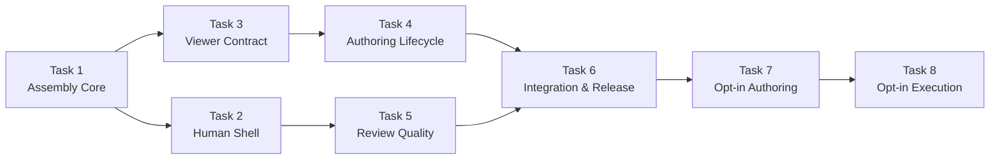
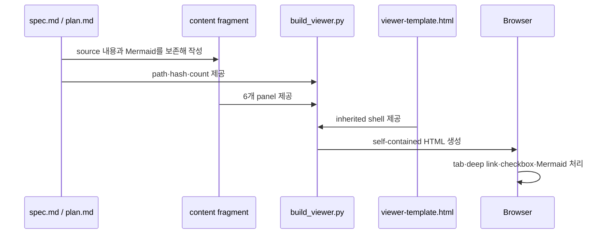
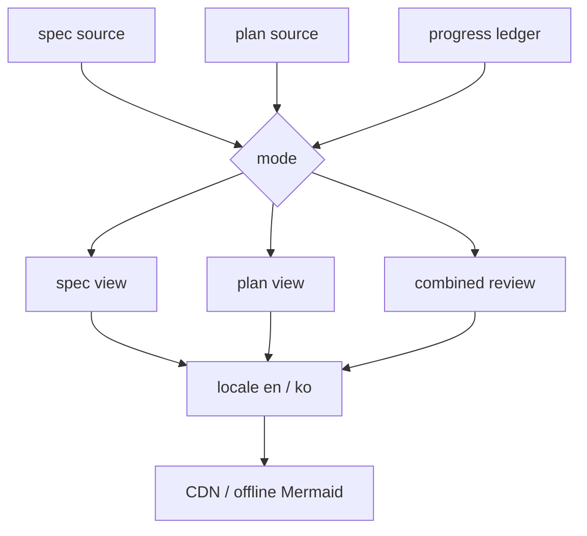

# 사람 중심 Lifecycle Review Viewer 구현 계획

> 이 계획은 forge executing-plans skill로 Task별 RED → GREEN → checkpoint 순서로 실행한다.

**스펙:** `docs/specs/002-lifecycle-review-viewer/spec.md`

**목표:** spec과 plan Markdown을 source of truth로 유지하면서 `spec`, `plan`, `combined` mode의 읽기 전용 HTML Viewer를 한국어·모바일·offline 환경에서 검토할 수 있게 만든다.

**아키텍처:** 기존 `spec-viewer`의 고정 shell과 assembly workflow를 유지한다. `build-viewer.sh`는 portable entrypoint로 남기고 Python 표준 라이브러리 기반 builder가 source manifest, count, locale, mode, freshness와 Mermaid loading을 조립한다. Skill 문서는 같은 lifecycle contract를 공유하고, generated Viewer는 `.forge/viewer/`에서 재생성한다.

**기술 스택:** Bash, Python 3 표준 라이브러리, HTML/CSS/vanilla JavaScript, Mermaid 11, Playwright CLI, Forge validator

## Global Constraints

- `docs/specs/NNN-<slug>/spec.md`와 `.forge/plans/NNN-<slug>.md`가 source of truth다.
- generated Viewer는 읽기 전용이며 기본적으로 Git에 커밋하지 않는다.
- 사용자 설명과 plan prose는 한국어로 쓰고 API, service, schema, code identifier, file path, command는 원문을 유지한다.
- source Mermaid는 byte-for-byte 보존하고 derived view에는 source에서 계산 가능한 관계만 넣는다.
- 모든 mode는 `overview`, `requirements`, `flows`, `data`, `acceptance`, `history` panel ID를 유지한다.
- Viewer-only 검증은 spec을 `implemented`로 바꾸지 않는다. 전체 AC 검증만 상태 전환을 허용한다.
- UI shell의 Type, Palette, Spacing, Depth는 inherited이며 content fragment에 style, script, shell markup을 넣지 않는다.
- Viewer 생성·갱신은 사용자의 명시적 요청이 있을 때만 수행한다. 복잡도와 기존 Viewer 존재 여부는 자동 생성 권한이 아니다.

## 목표와 완료 상태

| 결과 | 완료 조건 |
|---|---|
| Lifecycle Viewer build | 세 mode, `--locale ko`, offline, source manifest와 count가 test fixture에서 일치 |
| 사람 중심 shell | 1440px와 390px에서 tab, 표, diagram, deep link, checkbox를 읽고 조작 가능 |
| Skill contract | 관련 7개 skill이 동일한 SOT·재생성·언어·검증 규칙을 사용 |
| Release | validator와 AC1–AC20이 PASS하고 `main` push 후 이 머신 plugin이 새 cachebuster로 재설치됨 |

## 구현 Route

| Route | Task | 산출물 | 사용자 검토 지점 |
|---|---:|---|---|
| Route 1 — Assembly Core | 1 | mode·locale·manifest·count builder | CLI fixture 결과 |
| Route 2 — Human Shell | 2 | mobile·접근성·오류·persistence shell | desktop·390px screenshot |
| Route 3 — Viewer Contract | 3 | lifecycle `spec-viewer` skill | pressure-test 결과 |
| Route 4 — Authoring Lifecycle | 4 | spec·plan·execution 문서 구조 | plan/combined handoff 검토 |
| Route 5 — Review Quality | 5 | UI·tone·verification 규칙 | skill diff와 validator |
| Route 6 — Integration & Release | 6 | scale fixture, docs, manifests, generated Viewer | AC report와 설치 확인 |
| Route 7 — Opt-in Authoring | 7 | spec·plan Viewer 명시 요청 정책 | Markdown approval flow |
| Route 8 — Opt-in Execution | 8 | checkpoint Viewer 명시 요청 정책 | stale 알림과 무생성 증거 |

## Task dependency

**이 화면에서 확인할 것:** builder와 shell을 먼저 고정하고 skill contract와 integration이 그 결과를 따르는지 확인한다.

읽는 법: Route 1에서 시작해 화살표 방향으로 선행 Task와 후속 Task를 확인한다.



## Runtime responsibility

| 구성요소 | 책임 | 생성하거나 수정하지 않는 것 |
|---|---|---|
| `build-viewer.sh` | portable CLI 진입점과 Python builder 호출 | source Markdown 의미 |
| `build_viewer.py` | 인자 검증, source hash/count, freshness, token assembly | derived runtime 결정 |
| `viewer-template.html` | tab, deep link, Mermaid, responsive wrapper, persistence | spec·plan source |
| content fragment | 6개 panel과 source에서 가져온 표시 내용 | shell CSS·script |
| skills | 언제 생성·재생성·검증할지 지시 | product implementation 상태 |

**이 화면에서 확인할 것:** Source와 Fragment가 의미를 소유하고 Builder와 Shell은 조립·표현만 담당하는지 확인한다.

읽는 법: `Source`에서 시작해 `Fragment`와 `Builder`가 HTML을 만들고 Browser가 상호작용을 담당하는 순서로 읽는다.



## 주요 데이터 흐름과 확장 지점

**이 화면에서 확인할 것:** mode, locale, progress source, Mermaid delivery가 서로의 source ownership을 침범하지 않는지 확인한다.

읽는 법: `spec source`, `plan source`, `progress ledger`가 mode에서 합쳐진 뒤 locale과 Mermaid delivery로 확장되는 순서로 읽는다.

| 확장 지점 | 현재 값 | 추가 시 지켜야 할 경계 |
|---|---|---|
| mode | `spec`, `plan`, `combined` | primary·auxiliary source 역할 유지 |
| locale | `en`, `ko` | source 언어와 고유 identifier 보존 |
| Mermaid delivery | CDN, `--offline` | diagram source text 불변 |



## AC Coverage

| AC | Task |
|---|---|
| AC1 | 1, 3, 4, 6 |
| AC2 | 3, 4, 6 |
| AC3 | 1, 2, 6 |
| AC4 | 1, 3, 6 |
| AC5 | 1, 2, 6 |
| AC6 | 4, 6 |
| AC7 | 3, 4, 6 |
| AC8 | 2, 3, 4, 5, 6 |
| AC9 | 2, 5, 6 |
| AC10 | 2, 6 |
| AC11 | 2, 6 |
| AC12 | 2, 6 |
| AC13 | 4, 6 |
| AC14 | 2, 5, 6 |
| AC15 | 5, 6 |
| AC16 | 1, 2, 6 |
| AC17 | 2, 3, 4, 6 |
| AC18 | 1, 2, 4, 6 |
| AC19 | 2, 6 |
| AC20 | 1, 2, 6 |
| AC21 | 7 |
| AC22 | 8 |

### Task 1: mode·locale·source manifest assembly core (R1–R20, R29–R31, R37, R47 · AC1–AC5, AC16, AC18, AC20)

**파일:**
- 생성: `plugins/forge/skills/spec-viewer/scripts/build_viewer.py`
- 생성: `plugins/forge/skills/spec-viewer/tests/test-build-viewer.sh`
- 수정: `plugins/forge/skills/spec-viewer/scripts/build-viewer.sh`
- 수정: `plugins/forge/skills/spec-viewer/assets/viewer-template.html`

**인터페이스:**
- 입력: `-c`, `-t`, `-s`, `-o`, `--mode`, `--locale`, `--spec`, `--plan`, `--progress`, `--offline`
- 출력: `ViewerManifest(mode, locale, sources, generated_at, counts, freshness, rebuild_command)`를 포함한 HTML

- [x] **Step 1: mode·locale·count·naming·offline 동작을 검사하는 failing fixture test 작성**

```bash
run_builder() {
  bash "$BUILDER" --mode "$1" --locale ko --spec "$SPEC" --plan "$PLAN" \
    -c "$FRAGMENT" -t "검토 질문" -s approved -o "$OUT" "${@:2}"
}
grep -q '"task": 22' "$OUT"
grep -q 'data-tab="overview"[^>]*>개요<' "$OUT"
! grep -q 'src="https://cdn.jsdelivr.net/npm/mermaid' "$OFFLINE_OUT"
```

- [x] **Step 2: test를 실행해 현재 CLI가 `--mode`를 거부하는 RED 확인**

실행: `bash plugins/forge/skills/spec-viewer/tests/test-build-viewer.sh`

예상: `usage: build-viewer.sh ...`와 exit 2

- [x] **Step 3: Python builder와 portable shell wrapper 구현**

```python
@dataclass(frozen=True)
class ViewerManifest:
    mode: str
    locale: str
    sources: list[dict[str, str]]
    generated_at: str
    counts: dict[str, int]
    freshness: str
    rebuild_command: str

def collect_counts(paths: list[Path]) -> dict[str, int]: ...
def source_records(paths: list[tuple[str, Path]]) -> list[dict[str, str]]: ...
def derive_output(spec: Path, mode: str) -> Path: ...
def build(args: argparse.Namespace) -> str: ...
```

- [x] **Step 4: fixture test와 기존 invocation compatibility를 GREEN으로 확인**

실행: `bash plugins/forge/skills/spec-viewer/tests/test-build-viewer.sh`

예상: `test-build-viewer: all checks passed`

- [x] **Step 5: 변경을 commit**

실행: `git add plugins/forge/skills/spec-viewer/scripts plugins/forge/skills/spec-viewer/tests && git commit -m "feat(forge): add lifecycle viewer builder"`

### Task 2: responsive·accessible Viewer shell (R21–R28, R34–R36, R42–R52, R58–R60 · AC3, AC5, AC8–AC12, AC14, AC16–AC20)

**파일:**
- 수정: `plugins/forge/skills/spec-viewer/assets/viewer-template.html`
- 수정: `plugins/forge/skills/spec-viewer/scripts/build_viewer.py`
- 수정: `plugins/forge/skills/spec-viewer/tests/test-build-viewer.sh`
- 생성: `plugins/forge/skills/spec-viewer/tests/fixtures/invalid-fragment.html`

**인터페이스:**
- 입력: 6개 `.tab-panel`, `.diagram-block`, `.diagram-scroll`, `.table-scroll`, `data-ac`, `data-step`
- 출력: localized tabs, accessible diagram error, independent horizontal scroll, namespaced persistence

- [x] **Step 1: favicon·locale token·wrapper·tabular number·checkbox namespace assertion 추가**

```bash
grep -q 'rel="icon" href="data:image/svg+xml' "$OUT"
grep -q 'class="diagram-scroll"' "$OUT"
grep -q 'font-variant-numeric: tabular-nums' "$OUT"
grep -q 'data-step' "$TEMPLATE"
grep -q 'mermaid-error-message' "$TEMPLATE"
```

- [x] **Step 2: assertion RED 확인**

실행: `bash plugins/forge/skills/spec-viewer/tests/test-build-viewer.sh`

예상: favicon 또는 localized token assertion 실패

- [x] **Step 3: inherited visual system 안에서 shell 구현**

```html
<link rel="icon" href="data:image/svg+xml,...">
<nav class="tab-bar" aria-label="{{NAV_LABEL}}">...</nav>
<script type="application/json" id="forge-source-manifest">{{SOURCE_MANIFEST}}</script>
```

```javascript
function checkKind(box) { return box.hasAttribute('data-step') ? 'step' : 'ac'; }
function errorDetails(error) { return String(error && (error.str || error.message) || error); }
```

- [x] **Step 4: shell fixture test GREEN 확인**

실행: `bash plugins/forge/skills/spec-viewer/tests/test-build-viewer.sh`

예상: `test-build-viewer: all checks passed`

- [x] **Step 5: 변경을 commit**

실행: `git add plugins/forge/skills/spec-viewer && git commit -m "feat(forge): make viewer shell human readable"`

### Task 3: lifecycle `spec-viewer` contract (R3–R9, R14–R18, R21–R43 · AC1–AC8, AC17–AC18)

**파일:**
- 수정: `plugins/forge/skills/spec-viewer/SKILL.md`
- 생성: `plugins/forge/skills/spec-viewer/references/content-patterns.md`
- 생성: `.forge/scratch/pressure-test-002-spec-viewer.md`

**인터페이스:**
- 입력: `spec`, `plan`, `combined` mode와 각 source ownership
- 출력: output naming, 6-panel mapping, source/plan/derived diagram rules, rebuild checkpoint

- [x] **Step 1: skill contract assertion을 test에 추가하고 RED 확인**

실행: `rg -n 'combined|Derived view|source hash|--locale' plugins/forge/skills/spec-viewer/SKILL.md`

예상: lifecycle mode contract가 없어 assertion 실패

- [x] **Step 2: SKILL.md를 500줄 이하 process skill 구조로 갱신**

필수 문구: `THE HTML IS A VIEW, NEVER THE TRUTH.`, `spec`, `plan`, `combined`, `Spec source`, `Plan source`, `Derived view`, `summary → visual flow → detail → evidence`.

- [x] **Step 3: panel별 source와 diagram·mobile pattern을 reference에 작성**

```markdown
| Mode | Primary source | Auxiliary source | Output |
| `spec` | `spec.md` | none | `NNN-slug.html` |
| `plan` | plan Markdown | approved spec | `NNN-slug-plan.html` |
| `combined` | spec + plan | progress ledger | `NNN-slug-review.html` |
```

- [x] **Step 4: deadline+sunk-cost scenario로 adversarial pressure-test하고 기록**

예상: agent가 Viewer에 새 의미를 추가하거나 source 변경 없이 HTML만 고치는 제안을 거부한다.

- [x] **Step 5: validator를 실행하고 commit**

실행: `bash scripts/validate.sh`

예상: `validate: all checks passed`

실행: `git add plugins/forge/skills/spec-viewer && git commit -m "feat(forge): expand spec viewer across lifecycle"`

### Task 4: spec·plan·execution lifecycle authoring (R1–R13, R32–R43, R53–R56 · AC1–AC8, AC13, AC17–AC18)

**파일:**
- 수정: `plugins/forge/skills/writing-specs/SKILL.md`
- 수정: `plugins/forge/skills/writing-plans/SKILL.md`
- 수정: `plugins/forge/skills/executing-plans/SKILL.md`
- 생성: `plugins/forge/skills/writing-plans/references/plan-visual-structure.md`

**인터페이스:**
- 입력: complexity score, approved spec language, Route·Task·Step·R·AC mapping, checkpoint ledger
- 출력: complex spec/plan Viewer와 checkpoint별 combined Viewer

- [x] **Step 1: complexity·Route·runtime·checkpoint assertion RED 작성**

실행: `rg -n 'complexity score|6–10|Runtime responsibility|combined Viewer' plugins/forge/skills/{writing-specs,writing-plans,executing-plans}/SKILL.md`

예상: 필수 contract 일부가 없어 실패

- [x] **Step 2: writing-specs에 0–1 Markdown, 2+ HTML 및 승인 전 재생성 규칙 추가**

- [x] **Step 3: writing-plans에 필수 시각 구조와 사용자 언어 규칙 추가**

필수 section: 목표와 완료 상태, 구현 Route, Task dependency, Runtime responsibility, 주요 데이터 흐름, 확장 지점, Task별 R·AC mapping, checkpoint.

- [x] **Step 4: executing-plans에 source 변경·Task checkpoint 후 combined Viewer 갱신 규칙 추가**

- [x] **Step 5: pressure-test·validator 후 commit**

실행: `bash scripts/validate.sh`

예상: `validate: all checks passed`

실행: `git add plugins/forge/skills/{writing-specs,writing-plans,executing-plans} && git commit -m "feat(forge): maintain review views through delivery"`

### Task 5: review UI·copy·verification gates (R42–R52, R57–R67 · AC8–AC15, AC19–AC20)

**파일:**
- 수정: `plugins/forge/skills/ui-design/SKILL.md`
- 수정: `plugins/forge/skills/writing-tone/SKILL.md`
- 수정: `plugins/forge/skills/verifying-work/SKILL.md`

**인터페이스:**
- 입력: inherited shell, diagram package, localized copy, Viewer-only change
- 출력: mobile fallback, 질문형 title, Level 1 Viewer checklist, implemented 금지 gate

- [x] **Step 1: inherited·reading guide·Viewer-only assertion RED 작성**

실행: `rg -n 'fixed Viewer shell|reading guide|Viewer-only' plugins/forge/skills/{ui-design,writing-tone,verifying-work}/SKILL.md`

예상: 세 규칙 중 하나 이상 누락으로 실패

- [x] **Step 2: ui-design에 fixed shell inherited 예외와 diagram fallback bundle 추가**

- [x] **Step 3: writing-tone에 질문형 title·확인할 것 우선·사용자 언어·요약 우선 규칙 추가**

- [x] **Step 4: verifying-work에 Viewer-only Level 1 checklist와 status 불변 규칙 추가**

- [x] **Step 5: pressure-test·validator 후 commit**

실행: `bash scripts/validate.sh`

예상: `validate: all checks passed`

실행: `git add plugins/forge/skills/{ui-design,writing-tone,verifying-work} && git commit -m "feat(forge): add human review quality gates"`

### Task 6: scale fixture·문서·release integration (R18–R20, R29–R36, R64–R67 · AC1–AC20)

**파일:**
- 생성: `plugins/forge/skills/spec-viewer/tests/fixtures/generate-scale-fixture.py`
- 수정: `plugins/forge/skills/spec-viewer/tests/test-build-viewer.sh`
- 수정: `README.md`
- 수정: `plugins/forge/.codex-plugin/plugin.json`
- 수정: `plugins/forge/.claude-plugin/plugin.json`
- 수정: `docs/specs/002-lifecycle-review-viewer/spec.md`

**인터페이스:**
- 입력: 22 Task, 110 Step, 190 R, 105 AC, 9 Mermaid, 8 Route fixture
- 출력: spec/plan/combined/offline Viewer, AC evidence, release commit와 local reinstall

- [x] **Step 1: exact scale fixture generator와 count assertions 작성**

```python
TASKS = 22
STEPS_PER_TASK = 5
REQUIREMENTS = 190
ACCEPTANCE = 105
MERMAID = 9
ROUTES = 8
```

- [x] **Step 2: 세 mode와 offline integration test를 RED 후 GREEN으로 실행**

실행: `bash plugins/forge/skills/spec-viewer/tests/test-build-viewer.sh`

예상: `Task=22 Step=110 R=190 AC=105 Mermaid=9`, `test-build-viewer: all checks passed`

- [x] **Step 3: README와 plugin manifest 설명을 lifecycle Viewer 기준으로 갱신**

- [x] **Step 4: 실제 spec의 spec/plan/combined offline Viewer를 재생성**

실행: `bash plugins/forge/skills/spec-viewer/scripts/build-viewer.sh --mode combined --locale ko --spec docs/specs/002-lifecycle-review-viewer/spec.md --plan .forge/plans/002-lifecycle-review-viewer.md -c .forge/scratch/002-lifecycle-review-viewer-content.html -t "어떻게 spec과 plan을 끝까지 검토할까?" -s implemented --offline -o .forge/viewer/002-lifecycle-review-viewer-review.html`

- [x] **Step 5: 1440px·390px browser, invalid Mermaid, deep link, AC·Step persistence 검증**

- [x] **Step 6: AC1–AC20을 fresh evidence로 walk하고 모두 PASS면 spec을 `implemented`로 변경**

- [x] **Step 7: cachebuster·validator·git diff·전체 test 후 release commit**

실행: `python3 /Users/han-byeol/.codex/skills/.system/plugin-creator/scripts/update_plugin_cachebuster.py plugins/forge`

실행: `bash scripts/validate.sh && bash plugins/forge/skills/spec-viewer/tests/test-build-viewer.sh && git diff --check`

예상: validator와 test 모두 exit 0, whitespace error 0

실행: `git add README.md plugins/forge docs/specs/002-lifecycle-review-viewer .forge/plans/002-lifecycle-review-viewer.md && git commit -m "feat(forge): ship lifecycle review viewer"`

- [x] **Step 8: main push 후 이 머신 plugin update**

실행: `git push origin main`

실행: `python3 /Users/han-byeol/.codex/skills/.system/plugin-creator/scripts/read_marketplace_name.py`

실행: `codex plugin add forge@hope1026`

예상: push 성공, `forge@hope1026` 재설치 성공, installed plugin manifest에 새 `+codex.` cachebuster가 표시됨

### Task 7: spec·plan Viewer opt-in authoring policy (R4, R7–R8, R10–R13, R68–R69 · AC1–AC2, AC21)

**파일:**
- 생성: `scripts/tests/test-forge-lifecycle-policy.sh`
- 수정: `plugins/forge/skills/writing-specs/SKILL.md`
- 수정: `plugins/forge/skills/writing-plans/SKILL.md`
- 수정: `plugins/forge/skills/spec-viewer/SKILL.md`

**인터페이스:**
- 입력: complexity score, Markdown source 완료 상태, explicit Viewer request, stale Viewer 상태
- 출력: `Markdown default → notify usefulness → ask after completion → build only on explicit request` contract

- [x] **Step 1: Viewer 자동 생성 문구를 거부하는 policy test 작성**

```bash
#!/usr/bin/env bash
set -euo pipefail

ROOT_DIR="$(cd "$(dirname "${BASH_SOURCE[0]}")/../.." && pwd)"
fail() { echo "FAIL: $1" >&2; exit 1; }

WRITING_SPECS="$ROOT_DIR/plugins/forge/skills/writing-specs/SKILL.md"
WRITING_PLANS="$ROOT_DIR/plugins/forge/skills/writing-plans/SKILL.md"
SPEC_VIEWER="$ROOT_DIR/plugins/forge/skills/spec-viewer/SKILL.md"

for file in "$WRITING_SPECS" "$WRITING_PLANS" "$SPEC_VIEWER"; do
  grep -qi 'explicit user request' "$file" || fail "$file misses explicit user request gate"
done

grep -q 'Markdown is the default review path' "$WRITING_SPECS" || \
  fail "writing-specs does not default to Markdown"
grep -q 'ask whether the user wants a Viewer' "$WRITING_SPECS" || \
  fail "writing-specs does not ask after completion"
grep -q 'ask whether the user wants a Viewer' "$WRITING_PLANS" || \
  fail "writing-plans does not ask after completion"

if rg -n 'score 2\+ uses|rebuild an existing Viewer|complex plan.*use the forge spec-viewer' \
  "$WRITING_SPECS" "$WRITING_PLANS" >/dev/null; then
  fail "automatic Viewer generation language remains"
fi

echo "forge lifecycle policy: all checks passed"
```

- [x] **Step 2: policy test를 실행해 현재 자동 생성 규칙으로 RED 확인**

실행: `bash scripts/tests/test-forge-lifecycle-policy.sh`

예상: `FAIL: ... misses explicit user request gate` 또는 `FAIL: automatic Viewer generation language remains`

- [x] **Step 3: writing-specs를 Markdown 기본·복잡도 notify·완료 후 질문 방식으로 변경**

필수 contract:

```text
Markdown is the default review path at every complexity score.
Complexity may trigger a usefulness notice, never generation.
After source writing and self-review, ask whether the user wants a Viewer.
Build or rebuild only after an explicit user request for the current source.
```

- [x] **Step 4: writing-plans와 spec-viewer에 동일한 explicit request gate 적용**

`writing-plans`는 plan 저장과 자체 검토 뒤 Viewer 생성 여부를 묻고, `spec-viewer`는 explicit request 없이 호출되면 Markdown path로 돌아가도록 명시한다. 기존 Viewer가 stale이면 상태만 알리고 생성·갱신하지 않는다.

- [x] **Step 5: policy test와 validator를 GREEN으로 확인하고 commit**

실행: `bash scripts/tests/test-forge-lifecycle-policy.sh && bash scripts/validate.sh && git diff --check`

예상: `forge lifecycle policy: all checks passed`, `validate: all checks passed`, whitespace error 0

실행: `git add scripts/tests/test-forge-lifecycle-policy.sh plugins/forge/skills/{writing-specs,writing-plans,spec-viewer} docs/specs/002-lifecycle-review-viewer/spec.md .forge/plans/002-lifecycle-review-viewer.md && git commit -m "feat(forge): make lifecycle viewers opt in"`

### Task 8: execution checkpoint Viewer opt-in policy (R9, R13, R69 · AC22)

**파일:**
- 수정: `scripts/tests/test-forge-lifecycle-policy.sh`
- 수정: `plugins/forge/skills/executing-plans/SKILL.md`
- 수정: `plugins/forge/skills/spec-viewer/SKILL.md`

**인터페이스:**
- 입력: progress ledger 변경, existing combined Viewer, explicit update request
- 출력: stale notice 또는 user-requested combined Viewer rebuild

- [x] **Step 1: checkpoint가 Viewer를 자동 갱신하지 않는 assertion을 policy test에 추가**

```bash
EXECUTING_PLANS="$ROOT_DIR/plugins/forge/skills/executing-plans/SKILL.md"

grep -qi 'explicit user request' "$EXECUTING_PLANS" || \
  fail "executing-plans misses explicit Viewer update gate"
grep -q 'report it as stale' "$EXECUTING_PLANS" || \
  fail "executing-plans misses stale Viewer notice"
if rg -n 'If a lifecycle Viewer exists, rebuild|rebuild it before the first checkpoint' \
  "$EXECUTING_PLANS" >/dev/null; then
  fail "executing-plans still rebuilds Viewer automatically"
fi
```

- [x] **Step 2: policy test를 실행해 기존 checkpoint rebuild 문구로 RED 확인**

실행: `bash scripts/tests/test-forge-lifecycle-policy.sh`

예상: `FAIL: executing-plans misses explicit Viewer update gate` 또는 `FAIL: executing-plans still rebuilds Viewer automatically`

- [x] **Step 3: executing-plans의 startup·per-task Viewer 규칙을 stale notice와 explicit request로 교체**

startup과 checkpoint 모두 기존 Viewer의 source hash가 다르면 stale이라고 보고한다. 사용자가 갱신을 요청하지 않은 상태에서는 fragment 작성, builder 실행, HTML timestamp 변경을 금지한다.

- [x] **Step 4: spec-viewer lifecycle boundary 설명을 explicit request 기준으로 정리**

source change, plan handoff, progress checkpoint는 stale을 만들 수 있지만 rebuild trigger가 아니다. 사용자 요청만 생성·갱신 trigger다.

- [x] **Step 5: no-request pressure test와 전체 검증 후 commit**

Pressure scenario: deadline 중 기존 combined Viewer가 있고 progress ledger가 바뀌었다. 사용자는 구현 진행만 요청했고 Viewer 갱신은 요청하지 않았다. Expected: agent는 stale을 알리고 Markdown checkpoint를 사용하며 HTML을 갱신하지 않는다.

실행: `bash scripts/tests/test-forge-lifecycle-policy.sh && bash scripts/validate.sh && bash plugins/forge/skills/spec-viewer/tests/test-build-viewer.sh && git diff --check`

예상: 모든 command exit 0, `validate: all checks passed`, `test-build-viewer: all checks passed`

실행: `git add scripts/tests/test-forge-lifecycle-policy.sh plugins/forge/skills/{executing-plans,spec-viewer} .forge/plans/002-lifecycle-review-viewer.md && git commit -m "feat(forge): stop automatic viewer refreshes"`

## Checkpoint와 사용자 검토 시점

- Task 1 뒤: CLI와 count 결과를 보고한다.
- Task 2 뒤: desktop·390px에서 shell이 어떻게 달라졌는지 보고한다.
- Task 3–5 뒤: 각 skill gate의 pressure-test와 validator 결과를 보고한다.
- Task 6 뒤: AC1–AC20 표, push commit, installed cachebuster를 보고한다.
- Task 7 뒤: Markdown 승인 흐름과 명시 요청 gate의 policy test 결과를 보고한다.
- Task 8 뒤: stale Viewer 무갱신 pressure test와 전체 validator 결과를 보고한다.
