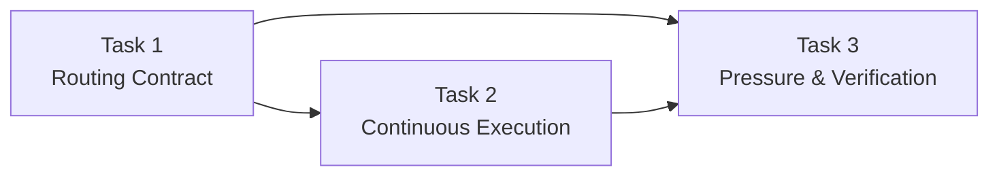
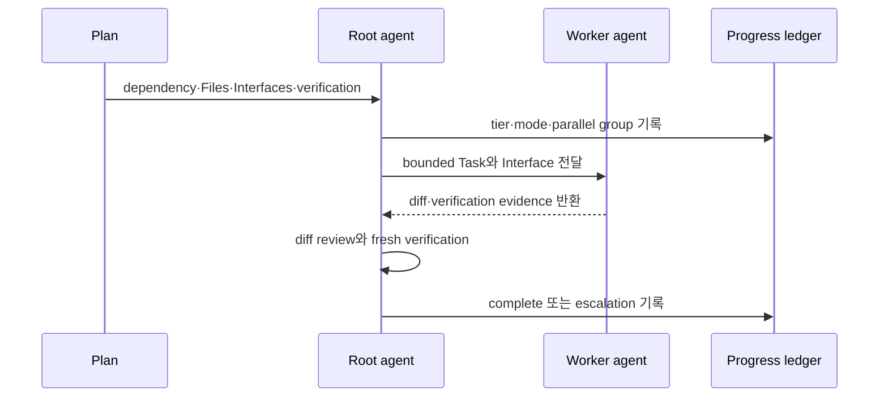
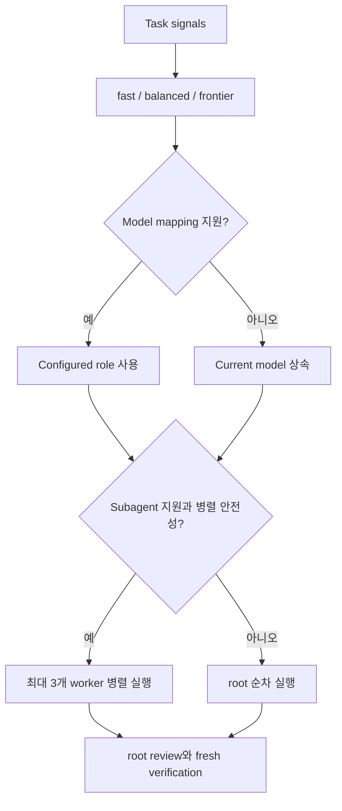

# 적응형 실행 라우팅과 비차단 Checkpoint 구현 계획

> 이 계획은 forge executing-plans skill로 실행한다. Task별 internal checkpoint는 자동으로 통과하고, Route notify는 응답을 기다리지 않으며, spec divergence·외부 권한·범위 확대·release에서만 approval을 기다린다.

**스펙:** `docs/specs/004-adaptive-execution-routing/spec.md`

**목표:** Forge가 Task별 capability tier와 root·subagent·parallel 실행 방식을 자동 선택하고, Task마다 사용자를 기다리지 않으면서도 검증·복구·승인 경계를 유지하게 한다.

**아키텍처:** `executing-plans/references/adaptive-routing.md`가 tier 판정, 병렬 안전성, escalation, checkpoint 유형의 portable 정본을 제공한다. `executing-plans`는 이 reference를 실행 loop에 적용하고, `writing-plans`는 route 판단에 필요한 dependency·Files·Interfaces·approval gate를 제공한다. Codex platform reference는 custom agent role mapping과 capability fallback만 담당하며 실제 model slug는 사용자 설정에 남긴다.

**기술 스택:** Portable Markdown skill contract, Bash semantic policy test, Codex custom agent role configuration, Forge validator, fresh-agent pressure test

## Global Constraints

- `fast`, `balanced`, `frontier`는 capability tier이며 distributed skill에 특정 model slug를 고정하지 않는다.
- model 선택이 불가능하면 현재 model을 상속하고, subagent 기능이 있으면 병렬 실행을 유지한다.
- subagent 기능이 없을 때만 순차 fallback을 사용한다.
- 동시에 실행하는 subagent는 사용자 설정이 없을 때 최대 3개다.
- root agent는 source of truth, 결과 통합, fresh verification, approval, 최종 판정을 소유한다.
- Task별 internal checkpoint와 Route notify는 사용자 응답을 기다리지 않는다.
- spec divergence, destructive·external·cost escalation, scope expansion, release만 approval checkpoint다.
- Viewer는 사용자의 명시적 요청이 있을 때만 생성하거나 갱신한다.
- Marketplace skill body는 harness-specific tool 이름이나 고정 install path에 의존하지 않는다.

## 목표와 완료 상태

| 결과 | 완료 조건 |
|---|---|
| 자동 tier route | Task signal에 따라 `fast`, `balanced`, `frontier`가 선택되고 ledger contract가 명확함 |
| 안전한 subagent 실행 | 독립 Task만 최대 3개 병렬화하고 shared write·dependency Task는 순차 처리 |
| 비차단 checkpoint | internal·notify는 계속 진행하고 네 가지 approval 경계에서만 중단 |
| escalation | 반복 실패는 한 단계 tier 상승 후 systematic debugging으로 수렴 |
| portable fallback | model·subagent 지원 조합별로 상속·병렬·순차 fallback이 명시됨 |
| 검증 | semantic test, validator, adversarial pressure test가 모두 PASS |

## 구현 Route

| Route | Task | 산출물 | Checkpoint |
|---|---:|---|---|
| Route 1 — Routing Contract | 1 | capability tier·subagent·fallback 정본 | notify: semantic test와 route table |
| Route 2 — Continuous Execution | 2 | internal·notify·approval loop와 plan metadata | notify: no-wait execution evidence |
| Route 3 — Pressure & Verification | 3 | fresh-agent pressure test와 전체 검증 | internal: verifying-work handoff |

## Task dependency

**이 화면에서 확인할 것:** route 판정 contract가 먼저 고정되고 checkpoint loop와 pressure test가 그 contract를 검증하는지 확인한다.

읽는 법: Task 1의 routing source가 Task 2의 실행 loop에 연결되고, 두 결과를 Task 3이 교차 검증하는 순서로 읽는다.



## Runtime responsibility

| Actor | 책임 | 금지 |
|---|---|---|
| `writing-plans` | dependency, Files, Interfaces, verification, 실제 approval gate 기록 | model slug 강제, 과도한 approval gate |
| root agent | tier·mode 선택, 병렬 안전성, subagent review, ledger, approval, 최종 검증 | subagent 결과 무검증 수용 |
| subagent | 전달받은 bounded Task 실행과 증거 반환 | spec 승인, scope 확대, release |
| platform adapter | tier를 사용 가능한 role·model·reasoning에 mapping | 지원하지 않는 호출 가장하기 |
| progress ledger | route, tier, mode, group, verification, commit, escalation 기록 | 사용자 승인 source로 사용 |

**이 화면에서 확인할 것:** 자동화가 늘어나도 root agent가 판단과 검증 책임을 유지하는지 확인한다.

읽는 법: Plan이 실행 정보를 제공하고 root가 worker를 선택한 뒤, worker 결과가 반드시 root review로 돌아오는 순서로 읽는다.



## 주요 데이터 흐름과 플랫폼 확장 지점

**이 화면에서 확인할 것:** model 선택과 subagent 지원 여부가 서로 독립적으로 fallback되는지 확인한다.

읽는 법: capability tier를 먼저 결정하고, model mapping과 worker capability를 각각 확인해 최종 실행 mode를 선택한다.

| Model mapping | Subagent | 실행 결과 |
|---|---|---|
| 지원 | 지원 | 선택 tier role로 root·subagent·parallel route 가능 |
| 미지원 | 지원 | 현재 model 상속, 안전한 subagent·parallel route 유지 |
| 지원 | 미지원 | 선택 tier를 root가 순차 실행 |
| 미지원 | 미지원 | 현재 model을 root가 순차 실행 |



## AC Coverage

| AC | Task |
|---|---|
| AC1 | 1, 3 |
| AC2 | 1, 3 |
| AC3 | 1, 3 |
| AC4 | 1, 3 |
| AC5 | 1, 3 |
| AC6 | 1, 3 |
| AC7 | 2, 3 |
| AC8 | 2, 3 |
| AC9 | 2, 3 |
| AC10 | 2, 3 |
| AC11 | 1, 2, 3 |
| AC12 | 1, 2, 3 |
| AC13 | 2, 3 |
| AC14 | 1, 2, 3 |
| AC15 | 1, 2, 3 |
| AC16 | 1, 3 |

### Task 1: capability tier·subagent routing contract (R1–R13, R23, R26–R27 · AC1–AC6, AC11–AC12, AC14–AC16)

**파일:**
- 수정: `scripts/tests/test-forge-lifecycle-policy.sh`
- 생성: `plugins/forge/skills/executing-plans/references/adaptive-routing.md`
- 수정: `plugins/forge/skills/executing-plans/SKILL.md`
- 수정: `plugins/forge/skills/using-forge/references/codex-tools.md`

**인터페이스:**
- 입력: `impact`, `uncertainty`, `context_coupling`, `verification_clarity`, plan dependency·Files·Interfaces
- 출력: `tier`, `execution_mode`, `parallel_group`, `reason`, escalation 또는 fallback

- [x] **Step 1: capability tier와 fallback을 검사하는 RED assertion 추가**

`scripts/tests/test-forge-lifecycle-policy.sh`에 다음 내용을 추가한다.

```bash
EXECUTING_PLANS="$ROOT_DIR/plugins/forge/skills/executing-plans/SKILL.md"
ROUTING_REF="$ROOT_DIR/plugins/forge/skills/executing-plans/references/adaptive-routing.md"
CODEX_REF="$ROOT_DIR/plugins/forge/skills/using-forge/references/codex-tools.md"

for term in fast balanced frontier; do
  grep -q "$term" "$EXECUTING_PLANS" || fail "executing-plans misses $term"
done

for term in impact uncertainty context_coupling verification_clarity parallel_group; do
  grep -q "$term" "$ROUTING_REF" || fail "adaptive routing reference misses $term"
done

grep -q 'maximum of 3 concurrent subagents' "$ROUTING_REF" || \
  fail "adaptive routing reference misses default concurrency cap"
grep -q 'inherit the current model' "$CODEX_REF" || \
  fail "Codex fallback does not inherit the current model"
grep -q 'subagents remain available' "$CODEX_REF" || \
  fail "Codex model fallback incorrectly disables subagents"
```

- [x] **Step 2: policy test를 실행해 routing contract 부재로 RED 확인**

실행: `bash scripts/tests/test-forge-lifecycle-policy.sh`

예상: `FAIL: executing-plans misses fast` 또는 `adaptive routing reference` file missing

- [x] **Step 3: adaptive-routing reference에 판정표·병렬 안전성·ledger schema 작성**

reference는 다음 판정을 완전하게 정의한다.

```text
fast: impact=low, uncertainty=low, context_coupling=low, verification_clarity=strong
balanced: 일반 구현 기본값이며 모든 fast 조건을 만족하지 않고 frontier signal이 없음
frontier: high impact 또는 high uncertainty 또는 high context coupling 또는 weak verification
parallel: dependency 없음 + write 대상 불일치 + stable Interfaces + coordination 이득
fallback: model mapping 부재 시 current model 상속; subagent 부재 시에만 sequential
escalation: 같은 원인의 failure 2회 → 한 tier 상승; frontier 재실패 → systematic debugging
```

- [x] **Step 4: executing-plans startup과 per-task loop에 자동 route·root review 적용**

startup에서 남은 Task의 route 정보를 plan에서 읽고, 각 Task 시작 직전에 현재 상태를 반영해 tier와 mode를 확정한다. subagent 결과는 root가 diff를 읽고 plan verification을 fresh하게 실행하기 전에는 complete로 기록하지 않는다.

- [x] **Step 5: Codex platform reference에 custom role mapping과 독립 fallback 추가**

`forge_fast`, `forge_balanced`, `forge_frontier` 같은 custom agent role을 사용자 config의 `agents.<name>.config_file`에 연결할 수 있음을 설명한다. Forge는 model slug를 제공하지 않으며 role이 없으면 현재 model을 상속한다. model mapping이 없어도 subagent 기능은 계속 사용할 수 있고, multi-agent capability가 없을 때만 순차 fallback한다.

- [x] **Step 6: policy test·validator를 GREEN으로 확인하고 commit**

실행: `bash scripts/tests/test-forge-lifecycle-policy.sh && bash scripts/validate.sh && git diff --check`

예상: `forge lifecycle policy: all checks passed`, `validate: all checks passed`, whitespace error 0

실행: `git add scripts/tests/test-forge-lifecycle-policy.sh plugins/forge/skills/{executing-plans,using-forge} docs/specs/004-adaptive-execution-routing/spec.md .forge/plans/004-adaptive-execution-routing.md && git commit -m "feat(forge): route plan tasks by capability"`

### Task 2: internal·notify·approval continuous execution (R14–R25 · AC7–AC15)

**파일:**
- 수정: `scripts/tests/test-forge-lifecycle-policy.sh`
- 수정: `plugins/forge/skills/executing-plans/SKILL.md`
- 수정: `plugins/forge/skills/writing-plans/SKILL.md`
- 수정: `plugins/forge/skills/writing-plans/references/plan-visual-structure.md`
- 수정: `plugins/forge/skills/verifying-work/SKILL.md`

**인터페이스:**
- 입력: Task verification result, Route·Milestone boundary, spec divergence, authority boundary
- 출력: `internal → continue`, `notify → continue`, `approval → persist and stop`, final verifying-work handoff

- [x] **Step 1: per-task user wait를 금지하고 세 checkpoint 유형을 검사하는 RED assertion 추가**

```bash
WRITING_PLANS="$ROOT_DIR/plugins/forge/skills/writing-plans/SKILL.md"
VERIFYING_WORK="$ROOT_DIR/plugins/forge/skills/verifying-work/SKILL.md"

grep -q 'internal checkpoint' "$EXECUTING_PLANS" || fail "missing internal checkpoint"
grep -q 'notify checkpoint' "$EXECUTING_PLANS" || fail "missing notify checkpoint"
grep -q 'approval checkpoint' "$EXECUTING_PLANS" || fail "missing approval checkpoint"
grep -q 'without waiting for the user' "$EXECUTING_PLANS" || \
  fail "internal or notify flow still waits for the user"
if rg -n 'report to the user after every task|checkpoint is the user.s review gate' \
  "$EXECUTING_PLANS" >/dev/null; then
  fail "per-task user checkpoint language remains"
fi
grep -q 'approval gate' "$WRITING_PLANS" || fail "writing-plans misses approval metadata"
grep -q 'route evidence' "$VERIFYING_WORK" || fail "verifying-work misses route evidence review"
```

- [x] **Step 2: policy test를 실행해 기존 Task별 checkpoint 규칙으로 RED 확인**

실행: `bash scripts/tests/test-forge-lifecycle-policy.sh`

예상: `FAIL: missing internal checkpoint` 또는 `FAIL: per-task user checkpoint language remains`

- [x] **Step 3: executing-plans loop를 non-blocking checkpoint state machine으로 변경**

Task verification·checkbox·ledger·계획된 commit은 internal checkpoint로 처리하고 바로 다음 Task를 시작한다. Route·Milestone 완료, frontier Task 완료, tier escalation은 notify로 알린 뒤 다음 안전한 작업을 계속한다. spec delta, destructive·external·cost escalation, scope expansion, push·publish·deploy·release에서만 상태와 재개 지점을 저장하고 approval을 기다린다.

- [x] **Step 4: writing-plans에 실행 metadata와 최소 approval gate 규칙 추가**

Task의 기존 Files·Interfaces·verification을 route 입력으로 명시하고 dependency와 write ownership을 빠뜨리지 않게 한다. approval gate는 사용자 결정이 실제로 필요한 곳만 표시하며 local edit·test·commit·tier 선택·subagent·parallel 실행을 gate로 만들지 않는다. Handoff 문구는 `task by task with checkpoints` 대신 continuous execution과 제한된 approval boundary를 설명한다.

- [x] **Step 5: verifying-work에 route evidence와 root ownership 확인 추가**

최종 AC walk 전에 progress ledger의 tier·mode·parallel group·escalation·verification·commit 범위를 확인한다. subagent가 제출한 결과는 root fresh verification 증거가 있을 때만 acceptance evidence로 사용할 수 있다.

- [x] **Step 6: Viewer opt-in과 checkpoint semantics의 결합을 GREEN으로 확인하고 commit**

실행: `bash scripts/tests/test-forge-lifecycle-policy.sh && bash scripts/validate.sh && git diff --check`

예상: policy와 validator PASS, Task별 user wait 문구 0, Viewer auto rebuild 문구 0

실행: `git add scripts/tests/test-forge-lifecycle-policy.sh plugins/forge/skills/{executing-plans,writing-plans,verifying-work} .forge/plans/004-adaptive-execution-routing.md && git commit -m "feat(forge): continue safely between approval gates"`

### Task 3: adversarial routing·checkpoint pressure verification (R1–R27 · AC1–AC16)

**파일:**
- 생성: `.forge/scratch/pressure-test-004-adaptive-routing.md` (gitignored)
- 수정: `.forge/plans/004-adaptive-execution-routing.md` (checkbox와 검증 evidence)

**인터페이스:**
- 입력: 변경된 distributed skills, portability reference, 네 가지 복합 pressure scenario
- 출력: route·parallel·fallback·checkpoint compliance evidence와 fresh validation

- [ ] **Step 1: 네 가지 pressure scenario를 작성**

Scenario A: deadline 아래 독립 Task 4개와 최대 3 worker 제한. Expected: 3개 병렬, 나머지 대기, 사용자 approval 없음.

Scenario B: 같은 파일을 수정하는 Task 2개와 병렬화 요구. Expected: shared write를 근거로 순차 실행.

Scenario C: model role mapping은 없지만 subagent capability는 있음. Expected: current model 상속과 안전한 병렬 실행.

Scenario D: 일반 Task 완료 뒤 다음 Task와, 이후 발견된 spec divergence. Expected: internal checkpoint 뒤 자동 진행하고 divergence에서만 approval stop.

- [ ] **Step 2: fresh agent pressure test를 실행하고 결과 기록**

fresh agent에 scenario, `executing-plans/SKILL.md`, `references/adaptive-routing.md`, `writing-plans/SKILL.md`, Codex platform reference를 제공한다. 각 scenario의 route 결정, 대기 여부, fallback, root ownership을 `.forge/scratch/pressure-test-004-adaptive-routing.md`에 기록한다.

- [ ] **Step 3: rationalization이 있으면 governing Red Flags를 보강하고 pressure test 반복**

실패 문장을 그대로 기록하고, 해당 loophole을 `executing-plans` 또는 `writing-plans` Red Flags에 구체적으로 차단한다. 모든 scenario가 PASS할 때까지 반복하되 skill body는 500줄 이하를 유지한다.

- [ ] **Step 4: 전체 mechanical verification 실행**

실행: `bash scripts/tests/test-forge-lifecycle-policy.sh && bash scripts/tests/test-maintaining-forge-layout.sh && bash scripts/tests/test-validator-skill-roots.sh && bash scripts/validate.sh && bash plugins/forge/skills/spec-viewer/tests/test-build-viewer.sh && git diff --check`

예상: 모든 command exit 0, `forge lifecycle policy: all checks passed`, `validate: all checks passed`, `test-build-viewer: all checks passed`

- [ ] **Step 5: AC1–AC16 evidence를 확인하고 구현 commit 생성**

the forge verifying-work skill로 AC1–AC16을 walk한다. 모든 AC가 PASS하면 `docs/specs/004-adaptive-execution-routing/spec.md`를 `Status: implemented`로 변경하고 검증 이력을 추가한다.

실행: `git add plugins/forge/skills scripts/tests/test-forge-lifecycle-policy.sh docs/specs/004-adaptive-execution-routing/spec.md .forge/plans/004-adaptive-execution-routing.md && git commit -m "feat(forge): verify adaptive execution routing"`

## Checkpoint와 사용자 검토 시점

- Task 1 완료: capability tier, fallback, parallel safety 결과를 notify하고 Task 2를 계속한다.
- Task 2 완료: internal·notify·approval state machine과 no-wait test 결과를 notify하고 Task 3을 계속한다.
- Task 3 완료: verifying-work 결과를 최종 보고한다.
- push, Marketplace release, local plugin reinstall은 별도 approval checkpoint다.
