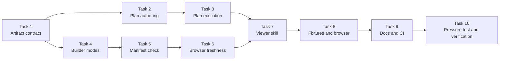
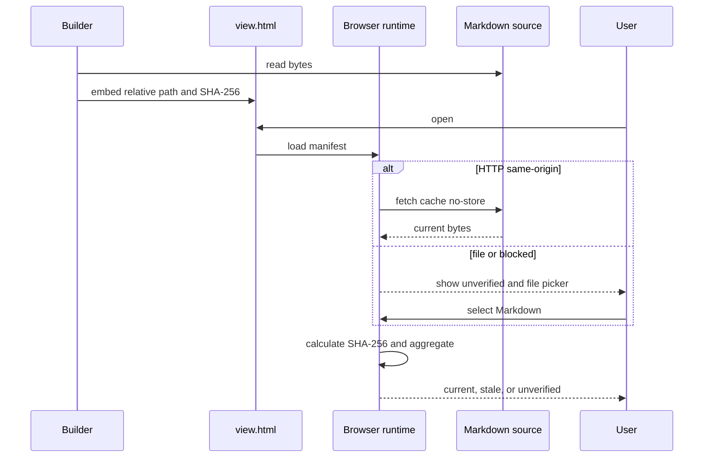
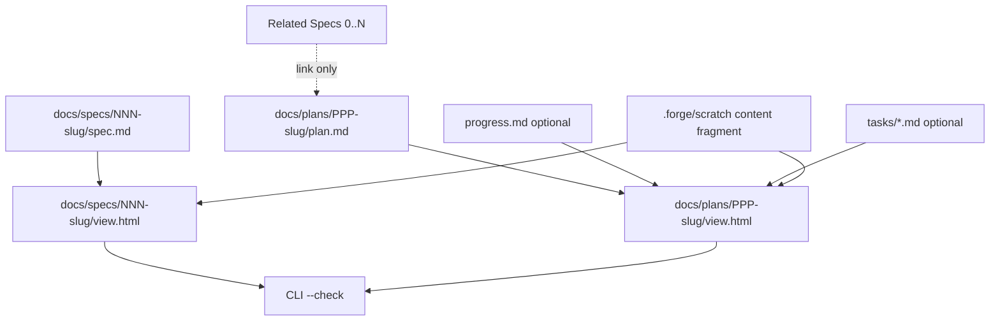

# 독립 문서 수명 주기와 Viewer freshness 구현 계획

Status: active

> 이 계획은 forge executing-plans skill로 Task 단위 실행하고, 각 Task의 검증과 commit을 내부 checkpoint로 기록한다.

**Related Specs:**
- `docs/specs/002-lifecycle-review-viewer/spec.md`: R1–R84 · AC1–AC30

**목표:** spec과 plan을 독립적인 공유 문서로 관리하고, 각 source 옆의 Viewer가 열람 시점 Markdown과 일치하는지 SHA-256으로 판정하도록 Forge workflow와 Viewer pipeline을 변경한다.

**아키텍처:** 영구·공유 artifact는 `docs/specs/`, `docs/plans/`, `docs/research/`, `docs/debug/`에 저장하고 `.forge/`는 Git 비추적 임시 파일에만 사용한다. Viewer builder는 `spec`과 `plan` mode만 조립하며, 생성 당시 source manifest를 HTML에 포함한다. 브라우저 runtime은 same-origin fetch 또는 로컬 파일 선택으로 현재 SHA-256을 계산하고, CLI `--check`는 같은 manifest를 CI에서 검증한다.

**기술 스택:** Bash, Python 3 표준 라이브러리, HTML/CSS, browser Web Crypto API, ECMAScript module, Mermaid 11, GitHub Actions

## Global Constraints

- Markdown source가 source of truth이며 Viewer는 읽기 전용 파생 artifact다.
- Viewer 생성과 갱신은 사용자의 명시적 요청이 있을 때만 수행한다.
- 생성된 `view.html`은 source와 같은 디렉터리에 저장해 Git으로 공유한다.
- `combined` mode와 spec·plan 1:1 경로 결합을 제거한다.
- plan은 독립 `PPP-<slug>` ID를 사용하고 `Related Specs`로 0개 이상의 spec을 참조한다.
- 제품 동작 변경 plan은 하나 이상의 approved spec을 참조해야 한다.
- source를 읽거나 hash를 계산하지 못한 상태를 `current`로 표시하지 않는다.
- source Mermaid는 byte-for-byte 유지하고 derived view는 source에 명시된 관계만 사용한다.
- distributed skill은 Claude Code와 Codex에서 같은 파일로 동작해야 한다.
- instruction 변경은 `bash scripts/validate.sh`와 adversarial pressure test를 모두 통과해야 한다.
- push는 Marketplace release이므로 이 계획의 실행 범위에 포함하지 않는다.

## AC Coverage

| AC | Tasks |
|---|---|
| AC1 | 1, 7 |
| AC2 | 2, 7 |
| AC3 | 4, 7, 8 |
| AC4 | 4, 8 |
| AC5 | 4, 8 |
| AC6 | 8 |
| AC7 | 4, 7, 8 |
| AC8 | 7, 8 |
| AC9 | 6, 8 |
| AC10 | 6, 8 |
| AC11 | 6, 8 |
| AC12 | 6, 8 |
| AC13 | 2 |
| AC14 | 6, 7, 8 |
| AC15 | 3, 10 |
| AC16 | 4, 8 |
| AC17 | 7, 8 |
| AC18 | 5, 6, 8 |
| AC19 | 6, 8, 10 |
| AC20 | 4, 7, 8 |
| AC21 | 2, 7 |
| AC22 | 3, 7 |
| AC23 | 1, 2, 4, 9 |
| AC24 | 2 |
| AC25 | 2, 3 |
| AC26 | 6, 8 |
| AC27 | 6, 8 |
| AC28 | 5, 6, 8 |
| AC29 | 5, 9 |
| AC30 | 1, 3, 9 |

## Implementation Routes

| Route | Tasks | 결과물 | Checkpoint |
|---|---:|---|---|
| Route 1 — Artifact contract | 1 | 공유·임시 경로의 단일 계약 | Task 1 내부 checkpoint |
| Route 2 — Plan lifecycle | 2–3 | 독립 plan 작성·실행·진행 기록 workflow | Task 3 완료 후 notify checkpoint |
| Route 3 — Builder core | 4–5 | 두 mode builder, source manifest, CLI freshness check | Task 5 완료 후 notify checkpoint |
| Route 4 — Runtime freshness | 6 | 브라우저 자동·수동 SHA-256 판정 UI | Task 6 완료 후 notify checkpoint |
| Route 5 — Viewer authoring | 7 | 두 mode spec-viewer skill과 content contract | Task 7 내부 checkpoint |
| Route 6 — Evidence | 8 | 분리된 scale fixture와 browser evidence | Task 8 완료 후 notify checkpoint |
| Route 7 — Distribution | 9–10 | 저장소 문서·CI·pressure test·최종 검증 | release 전 approval checkpoint |

## Task Dependencies

### 어떤 순서로 계약과 구현을 바꿔야 할까?

확인할 것: artifact 경로 계약이 먼저 고정되고, builder와 runtime이 그 계약을 구현한 뒤 skill과 검증 문서가 같은 동작을 설명하는지 확인한다.

읽는 법: 왼쪽 Route에서 시작해 화살표를 따라가며, 병렬 표기가 없는 Task는 선행 Task 결과를 소비한다.



## Runtime Responsibility

### Viewer를 열었을 때 누가 최신성을 판단할까?

확인할 것: builder는 생성 당시 hash만 기록하고, 브라우저와 CLI가 현재 source를 직접 읽어 freshness를 판정하는지 확인한다.

읽는 법: build 단계와 read 단계가 분리되어 있으며, 어느 경로에서도 읽기 실패를 `current`로 바꾸지 않는다.

| Actor | 책임 | 입력 | 출력 |
|---|---|---|---|
| Builder | source 집계와 생성 당시 SHA-256 기록 | Markdown source 집합 | self-contained `view.html` |
| Browser runtime | same-origin source 재조회와 Web Crypto 비교 | manifest, HTTP source | source별·전체 freshness |
| File picker | `file://` fallback source 제공 | 사용자가 선택한 로컬 Markdown | 브라우저 내부 hash 비교 |
| CLI checker | committed Viewer와 현재 source 비교 | `view.html` manifest | exit code 0 또는 non-zero |
| Forge skills | 생성 gate와 source ownership 안내 | 사용자 요청, Markdown | 재생성 command와 검증 절차 |



## Document Extension Points

### source 종류가 늘어나도 어떤 경계를 유지해야 할까?

확인할 것: spec View는 `spec.md`만 읽고, plan View는 같은 plan 디렉터리의 source 집합만 읽으며 Related Specs는 링크로 남는지 확인한다.

읽는 법: 실선은 Viewer source, 점선은 탐색 링크, 회색 임시 경로는 Git 비추적 artifact다.



## Tasks

### Task 1: 공유 artifact 경로 계약 고정 (R1–R2, R6, R18, R70–R71, R84 · AC1, AC23, AC30)

**파일:**
- 생성: `scripts/tests/test-forge-artifact-contract.sh`
- 수정: `plugins/forge/skills/using-forge/SKILL.md`
- 수정: `.agent-runbooks/maintaining-forge/references/portability-rules.md`
- 수정: `README.md`

**인터페이스:**
- 소비: approved spec의 `docs/specs`, `docs/plans`, committed `view.html`, `.forge` temporary 계약
- 생산: 이후 모든 skill이 참조할 canonical artifact table과 executable contract test

**실행 메타데이터:**
- 의존성: 없음
- 쓰기 소유권: 위 네 파일만
- 병렬 안전성: 순차 실행; Task 2–3이 이 계약을 소비한다.
- 승인 gate: 없음

- [x] **Step 1: artifact contract가 현재 경로에서 실패하는 shell test를 작성한다.**

```bash
#!/usr/bin/env bash
set -euo pipefail
ROOT="$(cd "$(dirname "${BASH_SOURCE[0]}")/../.." && pwd)"
grep -q 'docs/plans/PPP-<slug>/plan.md' "$ROOT/plugins/forge/skills/using-forge/SKILL.md"
grep -q 'docs/specs/NNN-<slug>/view.html' "$ROOT/plugins/forge/skills/using-forge/SKILL.md"
grep -q 'docs/plans/PPP-<slug>/view.html' "$ROOT/.agent-runbooks/maintaining-forge/references/portability-rules.md"
! grep -q '| Plans | `.forge/plans/' "$ROOT/.agent-runbooks/maintaining-forge/references/portability-rules.md"
grep -q 'docs/research/' "$ROOT/README.md"
grep -q 'docs/debug/' "$ROOT/README.md"
printf 'test-forge-artifact-contract: all checks passed\n'
```

- [x] **Step 2: RED를 확인한다.**

실행: `bash scripts/tests/test-forge-artifact-contract.sh`

예상: `docs/plans/PPP-<slug>/plan.md` 또는 committed Viewer assertion에서 non-zero로 실패한다.

- [x] **Step 3: canonical artifact table을 세 문서에 동일하게 반영한다.**

정확한 계약:

```text
spec       docs/specs/NNN-<slug>/spec.md       committed, permanent
spec view  docs/specs/NNN-<slug>/view.html     committed when explicitly generated
plan       docs/plans/PPP-<slug>/plan.md        committed, work-scoped
plan view  docs/plans/PPP-<slug>/view.html      committed when explicitly generated
research   docs/research/                       committed when promoted
debug      docs/debug/                          committed when promoted
scratch    .forge/scratch/                      uncommitted
build      .forge/viewer-build/                 uncommitted
```

- [x] **Step 4: contract test와 validator를 실행한다.**

실행: `bash scripts/tests/test-forge-artifact-contract.sh && bash scripts/validate.sh`

예상: 두 command 모두 exit 0이며 마지막 줄에 각각 `all checks passed`가 나타난다.

- [x] **Step 5: 변경을 commit한다.**

실행: `git add scripts/tests/test-forge-artifact-contract.sh plugins/forge/skills/using-forge/SKILL.md .agent-runbooks/maintaining-forge/references/portability-rules.md README.md && git commit -m "refactor(forge): define shared artifact paths"`

### Task 2: 독립 plan 작성 lifecycle 구현 (R7–R8, R10–R13, R32, R53–R56, R68–R69, R72–R76 · AC2, AC13, AC21, AC23–AC25)

**파일:**
- 수정: `plugins/forge/skills/writing-specs/SKILL.md`
- 수정: `plugins/forge/skills/writing-plans/SKILL.md`
- 수정: `plugins/forge/skills/writing-plans/references/plan-visual-structure.md`
- 수정: `scripts/tests/test-forge-artifact-contract.sh`

**인터페이스:**
- 소비: Task 1 artifact table, approved spec gate
- 생산: 독립 `PPP` ID, `Related Specs`, plan-local progress/task split, spec-present/spec-free plan precondition

**실행 메타데이터:**
- 의존성: Task 1
- 쓰기 소유권: 위 네 파일만
- 병렬 안전성: 순차 실행; Task 3과 Task 7이 plan schema를 소비한다.
- 승인 gate: 제품 동작 변경 plan이 approved spec 없이 허용되어야 한다는 새 요구가 발견될 때 spec divergence gate

- [x] **Step 1: writing skill 계약 assertion을 추가한다.**

```bash
grep -q 'Related Specs' "$ROOT/plugins/forge/skills/writing-plans/SKILL.md"
grep -q 'docs/plans/PPP-<slug>/plan.md' "$ROOT/plugins/forge/skills/writing-plans/SKILL.md"
grep -q '0 or more' "$ROOT/plugins/forge/skills/writing-plans/SKILL.md"
! grep -q 'same `NNN` as the spec' "$ROOT/plugins/forge/skills/writing-plans/SKILL.md"
! grep -q 'combined review path' "$ROOT/plugins/forge/skills/writing-plans/references/plan-visual-structure.md"
```

- [x] **Step 2: RED를 확인한다.**

실행: `bash scripts/tests/test-forge-artifact-contract.sh`

예상: `Related Specs` 또는 독립 plan path assertion에서 실패한다.

- [x] **Step 3: writing-plans precondition과 header를 새 schema로 바꾼다.**

정확한 규칙:

```markdown
Status: active

**Related Specs:**
- `docs/specs/NNN-<slug>/spec.md`: R1, R2 · AC1
```

`Related Specs`가 비어 있으면 `None — <ceremony-floor 또는 non-product 이유>`를 요구한다. 제품 동작 변경은 관련 approved spec 1개 이상과 zero clarification을 검사한다. `PPP`는 `docs/plans/`에서 다음 미사용 세 자리 번호를 독립적으로 선택한다.

- [x] **Step 4: 진행·Task 분리 기준과 plan View gate를 반영한다.**

`plan.md`가 기본 Task checkbox와 `Progress History`를 소유하고, 긴 기록만 `progress.md`, 독립 소유권·병렬 실행·독립 승인 Task만 `tasks/*.md`로 분리한다. Viewer 선택지는 `plan`만 제시하고 `combined` 표현을 제거한다.

- [x] **Step 5: contract test와 validator를 실행한다.**

실행: `bash scripts/tests/test-forge-artifact-contract.sh && bash scripts/validate.sh`

예상: exit 0, banned token과 500-line cap 위반 0개.

- [x] **Step 6: 변경을 commit한다.**

실행: `git add plugins/forge/skills/writing-specs/SKILL.md plugins/forge/skills/writing-plans/SKILL.md plugins/forge/skills/writing-plans/references/plan-visual-structure.md scripts/tests/test-forge-artifact-contract.sh && git commit -m "refactor(forge): decouple plans from specs"`

### Task 3: plan 실행·진행·영구 기록 workflow 동기화 (R3–R4, R9, R64–R67, R69–R70, R74–R76, R84 · AC15, AC22, AC25, AC30)

**파일:**
- 수정: `plugins/forge/skills/executing-plans/SKILL.md`
- 수정: `plugins/forge/skills/test-driven-development/SKILL.md`
- 수정: `plugins/forge/skills/verifying-work/SKILL.md`
- 수정: `plugins/forge/skills/systematic-debugging/SKILL.md`
- 수정: `plugins/forge/skills/ui-design/SKILL.md`
- 수정: `plugins/forge/skills/writing-tone/SKILL.md`
- 수정: `scripts/tests/test-forge-artifact-contract.sh`

**인터페이스:**
- 소비: Task 2 plan schema와 optional Related Specs
- 생산: plan-local resume state, optional promoted debug/research artifacts, spec-present/spec-free verification branches

**실행 메타데이터:**
- 의존성: Task 2
- 쓰기 소유권: 위 일곱 파일만
- 병렬 안전성: 순차 실행; 같은 workflow 용어를 여러 skill에서 함께 바꾼다.
- 승인 gate: 없음

- [x] **Step 1: execution contract assertion을 추가하고 RED를 확인한다.**

```bash
grep -q 'docs/plans/PPP-<slug>/plan.md' "$ROOT/plugins/forge/skills/executing-plans/SKILL.md"
grep -q 'Progress History' "$ROOT/plugins/forge/skills/executing-plans/SKILL.md"
! grep -q 'progress-NNN' "$ROOT/plugins/forge/skills/executing-plans/SKILL.md"
! grep -q 'combined Viewer' "$ROOT/plugins/forge/skills/executing-plans/SKILL.md"
grep -q 'docs/debug/' "$ROOT/plugins/forge/skills/systematic-debugging/SKILL.md"
```

실행: `bash scripts/tests/test-forge-artifact-contract.sh`

예상: 기존 `.forge/plans` 또는 `progress-NNN` 계약 때문에 실패한다.

- [x] **Step 2: executing-plans startup과 resume source를 변경한다.**

기본 resume source는 `plan.md`의 checkbox와 `Progress History`다. `progress.md`가 있으면 상세 route evidence를 그 파일에 기록하고, `tasks/*.md`가 있으면 plan index의 Task ID와 각 파일의 Task ID 일치를 startup에서 검사한다.

- [x] **Step 3: spec-present와 spec-free 실행 분기를 명시한다.**

관련 approved spec이 있으면 divergence를 writing-specs change mode로 보낸다. 관련 spec이 없는 ceremony-floor·운영·조사 plan은 scope divergence를 사용자 결정 gate로 보내며 존재하지 않는 spec 상태를 수정하지 않는다.

- [x] **Step 4: 나머지 skill 경로를 동기화한다.**

TDD와 UI는 현재 plan Task를 `docs/plans/PPP-<slug>/`에서 찾는다. verifying-work는 Related Specs 각각의 AC와 plan coverage를 검사하고 spec-free plan은 command evidence만 보고한다. systematic-debugging은 local note를 `.forge/`에 두고 공유 가치가 확정되면 `docs/debug/`로 승격한다. writing-tone에서 `combined` Viewer 표현을 제거한다.

- [x] **Step 5: contract test와 validator를 실행한다.**

실행: `bash scripts/tests/test-forge-artifact-contract.sh && bash scripts/validate.sh`

예상: exit 0이며 old path assertion과 portability 검사 모두 통과한다.

- [x] **Step 6: 변경을 commit한다.**

실행: `git add plugins/forge/skills/executing-plans/SKILL.md plugins/forge/skills/test-driven-development/SKILL.md plugins/forge/skills/verifying-work/SKILL.md plugins/forge/skills/systematic-debugging/SKILL.md plugins/forge/skills/ui-design/SKILL.md plugins/forge/skills/writing-tone/SKILL.md scripts/tests/test-forge-artifact-contract.sh && git commit -m "refactor(forge): keep progress with independent plans"`

### Task 4: Viewer builder의 두 mode와 source 집합 구현 (R14–R20, R29–R31, R37–R41, R58, R65 · AC3–AC5, AC7, AC16, AC20, AC23)

**파일:**
- 수정: `plugins/forge/skills/spec-viewer/scripts/build_viewer.py`
- 수정: `plugins/forge/skills/spec-viewer/tests/test-build-viewer.sh`
- 수정: `plugins/forge/skills/spec-viewer/tests/fixtures/generate-scale-fixture.py`

**인터페이스:**
- 소비: `--mode spec|plan`, `--spec`, `--plan`, optional `--progress`, optional `--tasks-dir`
- 생산: source directory의 `view.html`, deterministic source records, mode-local counts

**실행 메타데이터:**
- 의존성: Task 1
- 쓰기 소유권: 위 세 파일만
- 병렬 안전성: Task 3과 병렬 가능하지만 Task 5보다 먼저 완료한다.
- 승인 gate: 없음

- [ ] **Step 1: builder regression test를 두 mode 기준으로 먼저 수정한다.**

검사 항목:

```bash
test -f "$SPEC_DIR/view.html"
test -f "$PLAN_DIR/view.html"
! bash "$BUILDER" --mode combined 2>/dev/null
grep -q '"mode": "spec"' "$SPEC_DIR/view.html"
grep -q '"mode": "plan"' "$PLAN_DIR/view.html"
grep -q '"freshness": "unverified"' "$PLAN_DIR/view.html"
```

scale fixture는 `spec/`과 `plan/` 디렉터리를 따로 만들고 plan 아래 `progress.md`, `tasks/001-*.md`를 생성한다.

- [ ] **Step 2: RED를 확인한다.**

실행: `bash plugins/forge/skills/spec-viewer/tests/test-build-viewer.sh`

예상: `combined` 제거, `view.html` output, `--tasks-dir` 중 첫 미구현 동작에서 실패한다.

- [ ] **Step 3: CLI와 output derivation을 구현한다.**

함수 계약:

```python
def derive_output(anchor: Path) -> Path:
    return anchor.parent / "view.html"

def selected_sources(args: argparse.Namespace) -> list[tuple[str, Path]]:
    # spec: [("spec", spec.md)]
    # plan: plan.md, optional progress.md, sorted tasks/*.md
```

`choices`는 `("spec", "plan")`만 허용한다. spec mode는 `--spec`만, plan mode는 `--plan`과 optional sources만 허용하며 spec content를 plan source에 포함하지 않는다.

- [ ] **Step 4: source-relative manifest와 unique count를 구현한다.**

source path는 `view.html` parent 기준 POSIX 상대 경로로 기록한다. Task와 Step은 Task-scoped key로 중복 제거하고, R·AC·Mermaid는 선택된 mode source 집합 안에서만 집계한다. manifest 초기 freshness는 항상 `unverified`다.

- [ ] **Step 5: GREEN과 전체 builder regression을 확인한다.**

실행: `bash plugins/forge/skills/spec-viewer/tests/test-build-viewer.sh`

예상: `test-build-viewer: all checks passed`, output 두 개, combined output 0개.

- [ ] **Step 6: 변경을 commit한다.**

실행: `git add plugins/forge/skills/spec-viewer/scripts/build_viewer.py plugins/forge/skills/spec-viewer/tests/test-build-viewer.sh plugins/forge/skills/spec-viewer/tests/fixtures/generate-scale-fixture.py && git commit -m "feat(forge): build independent spec and plan views"`

### Task 5: source manifest CLI freshness check 구현 (R5, R27, R77, R81–R83 · AC18, AC28–AC29)

**파일:**
- 수정: `plugins/forge/skills/spec-viewer/scripts/build_viewer.py`
- 수정: `plugins/forge/skills/spec-viewer/tests/test-build-viewer.sh`

**인터페이스:**
- 소비: `build-viewer.sh --check path/to/view.html`
- 생산: source별 hash 비교 결과와 process exit code

**실행 메타데이터:**
- 의존성: Task 4
- 쓰기 소유권: 위 두 파일만
- 병렬 안전성: 순차 실행; Task 6이 manifest shape를 소비한다.
- 승인 gate: 없음

- [ ] **Step 1: current·stale·missing·invalid manifest CLI test를 작성한다.**

```bash
bash "$BUILDER" --check "$PLAN_DIR/view.html"
printf '\nchanged\n' >> "$PLAN_DIR/plan.md"
if bash "$BUILDER" --check "$PLAN_DIR/view.html"; then exit 1; fi
rm "$PLAN_DIR/progress.md"
if bash "$BUILDER" --check "$PLAN_DIR/view.html"; then exit 1; fi
printf '<html><script id="forge-source-manifest">{bad}</script></html>' > "$TMP/invalid.html"
if bash "$BUILDER" --check "$TMP/invalid.html"; then exit 1; fi
```

- [ ] **Step 2: RED를 확인한다.**

실행: `bash plugins/forge/skills/spec-viewer/tests/test-build-viewer.sh`

예상: argparse가 `--check`를 인식하지 못해 실패한다.

- [ ] **Step 3: manifest extraction과 checker를 구현한다.**

함수 계약:

```text
extract_manifest(viewer: Path) -> ViewerManifest
check_viewer(viewer: Path) -> list[str]

check_viewer 반환 계약: 모든 source가 존재하고 SHA-256이 일치하면 빈 list,
그 외에는 source path와 원인을 포함한 오류 문자열 list
```

manifest script의 JSON parse, relative path escape 방지, missing source, hash mismatch를 source별 오류로 반환한다. `main()`은 오류가 없으면 `viewer current: <path>`와 exit 0, 오류가 있으면 각 원인을 stderr에 쓰고 exit 1을 반환한다.

- [ ] **Step 4: GREEN을 확인한다.**

실행: `bash plugins/forge/skills/spec-viewer/tests/test-build-viewer.sh`

예상: current fixture exit 0, stale·missing·invalid fixture non-zero.

- [ ] **Step 5: 변경을 commit한다.**

실행: `git add plugins/forge/skills/spec-viewer/scripts/build_viewer.py plugins/forge/skills/spec-viewer/tests/test-build-viewer.sh && git commit -m "feat(forge): check viewer source hashes"`

### Task 6: 브라우저 열람 시 freshness runtime 구현 (R5, R44–R52, R57–R63, R77–R82 · AC9–AC12, AC14, AC18–AC19, AC26–AC28)

**파일:**
- 생성: `plugins/forge/skills/spec-viewer/assets/viewer-freshness.mjs`
- 생성: `plugins/forge/skills/spec-viewer/tests/test-viewer-freshness.mjs`
- 수정: `plugins/forge/skills/spec-viewer/assets/viewer-template.html`
- 수정: `plugins/forge/skills/spec-viewer/scripts/build_viewer.py`

**인터페이스:**
- 소비: `#forge-source-manifest`, relative source path, file input selection
- 생산: source별 `current|stale|unverified`, overall freshness, 실패 원인

**실행 메타데이터:**
- 의존성: Task 5
- 쓰기 소유권: 위 네 파일만
- 병렬 안전성: 순차 실행; template와 builder token을 함께 바꾼다.
- 승인 gate: visual system은 기존 fixed shell의 Type·Palette·Spacing·Depth를 inherited로 유지한다.

- [ ] **Step 1: pure freshness helper test를 작성한다.**

```javascript
import assert from 'node:assert/strict';
import { aggregateFreshness, sha256Hex, sourceMatchKey } from '../assets/viewer-freshness.mjs';

assert.equal(aggregateFreshness(['current', 'current']), 'current');
assert.equal(aggregateFreshness(['current', 'unverified']), 'unverified');
assert.equal(aggregateFreshness(['unverified', 'stale']), 'stale');
assert.equal(await sha256Hex(new TextEncoder().encode('abc')),
  'ba7816bf8f01cfea414140de5dae2223b00361a396177a9cb410ff61f20015ad');
assert.equal(sourceMatchKey('./tasks/001-api.md'), 'tasks/001-api.md');
```

- [ ] **Step 2: RED를 확인한다.**

실행: `node plugins/forge/skills/spec-viewer/tests/test-viewer-freshness.mjs`

예상: `viewer-freshness.mjs` module이 없어 실패한다.

- [ ] **Step 3: pure helper와 DOM initialization을 구현한다.**

필수 export:

```javascript
export function aggregateFreshness(states) { /* stale > unverified > current */ }
export async function sha256Hex(bytes) { /* crypto.subtle.digest('SHA-256', bytes) */ }
export function sourceMatchKey(path) { /* normalized relative POSIX path */ }
export async function verifyFetchedSource(source, baseUrl) { /* cache: 'no-store' */ }
```

브라우저에서만 `initFreshness()`를 실행한다. same-origin fetch 실패는 source별 `unverified`로 기록하고 file input을 표시한다. 선택 파일은 `arrayBuffer()`로만 읽으며 upload, beacon, fetch body를 만들지 않는다.

- [ ] **Step 4: template UI와 build token을 연결한다.**

source summary에 overall badge, source별 status·hash·오류 영역, `multiple` Markdown file input을 추가한다. CSS는 기존 border 전략과 accent를 inherited하고 `current`, `stale`, `unverified`를 text와 색으로 함께 구분한다. builder는 asset 내용을 `{{FRESHNESS_RUNTIME}}`에 삽입하고 template은 `<script type="module">`로 실행한다.

- [ ] **Step 5: helper GREEN과 self-contained output을 확인한다.**

실행: `node plugins/forge/skills/spec-viewer/tests/test-viewer-freshness.mjs && bash plugins/forge/skills/spec-viewer/tests/test-build-viewer.sh`

예상: helper assertion 전부 통과, 생성 HTML에 외부 freshness script 요청 0개.

- [ ] **Step 6: 변경을 commit한다.**

실행: `git add plugins/forge/skills/spec-viewer/assets/viewer-freshness.mjs plugins/forge/skills/spec-viewer/tests/test-viewer-freshness.mjs plugins/forge/skills/spec-viewer/assets/viewer-template.html plugins/forge/skills/spec-viewer/scripts/build_viewer.py && git commit -m "feat(forge): verify viewer freshness at read time"`

### Task 7: spec-viewer authoring workflow를 두 mode로 정리 (R3–R4, R7–R9, R13–R28, R34–R43, R57–R69 · AC1–AC3, AC7–AC8, AC14, AC17, AC20–AC22)

**파일:**
- 수정: `plugins/forge/skills/spec-viewer/SKILL.md`
- 수정: `plugins/forge/skills/spec-viewer/references/content-patterns.md`
- 수정: `scripts/tests/test-forge-artifact-contract.sh`

**인터페이스:**
- 소비: Task 2 plan source schema, Task 4–6 builder/runtime CLI
- 생산: explicit-request-only spec/plan View authoring and verification procedure

**실행 메타데이터:**
- 의존성: Tasks 3, 6
- 쓰기 소유권: 위 세 파일만
- 병렬 안전성: 순차 실행; 구현된 CLI와 UI 용어를 문서화한다.
- 승인 gate: 없음

- [ ] **Step 1: Viewer skill contract assertion을 추가하고 RED를 확인한다.**

```bash
grep -q '| `spec` .*docs/specs/NNN-<slug>/view.html' "$ROOT/plugins/forge/skills/spec-viewer/SKILL.md"
grep -q '| `plan` .*docs/plans/PPP-<slug>/view.html' "$ROOT/plugins/forge/skills/spec-viewer/SKILL.md"
! grep -q '| `combined`' "$ROOT/plugins/forge/skills/spec-viewer/SKILL.md"
grep -q '`unverified`' "$ROOT/plugins/forge/skills/spec-viewer/SKILL.md"
! grep -q 'Combined mode' "$ROOT/plugins/forge/skills/spec-viewer/references/content-patterns.md"
```

실행: `bash scripts/tests/test-forge-artifact-contract.sh`

예상: old mode table과 `.forge/viewer` 경로 때문에 실패한다.

- [ ] **Step 2: Source Ownership과 build command를 두 mode로 교체한다.**

spec은 `spec.md`만, plan은 `plan.md`와 optional `progress.md`, `tasks/*.md`만 source로 선택한다. Related Specs는 링크로 표시하고 내용을 lift하지 않는다. content fragment는 `.forge/scratch/`, 최종 output은 source 옆 `view.html`로 고정한다.

- [ ] **Step 3: freshness 검증 절차를 3단계로 문서화한다.**

HTTP same-origin 자동 검사, `file://` 수동 파일 선택, CLI `--check`를 모두 확인한다. 열람 전 manifest 상태는 `unverified`이며 source 하나라도 stale이면 overall stale이라는 aggregation rule을 명시한다.

- [ ] **Step 4: content pattern을 mode-local deep link와 panel 내용으로 수정한다.**

spec View는 R·AC, plan View는 Task·Step을 deep link한다. plan Acceptance panel은 Related Specs가 있으면 AC→Task→verification, 없으면 Task→verification을 표시한다. combined panel column과 cross-source deep link 예시를 제거한다.

- [ ] **Step 5: contract test와 validator를 실행한다.**

실행: `bash scripts/tests/test-forge-artifact-contract.sh && bash scripts/validate.sh`

예상: exit 0, spec-viewer 500-line cap과 Red Flags 구조 유지.

- [ ] **Step 6: 변경을 commit한다.**

실행: `git add plugins/forge/skills/spec-viewer/SKILL.md plugins/forge/skills/spec-viewer/references/content-patterns.md scripts/tests/test-forge-artifact-contract.sh && git commit -m "docs(forge): define independent viewer modes"`

### Task 8: fixture·browser·offline evidence 통합 (R21–R52, R57–R67, R77–R82 · AC3–AC12, AC14, AC16–AC20, AC26–AC28)

**파일:**
- 수정: `plugins/forge/skills/spec-viewer/tests/fixtures/basic-plan.md`
- 수정: `plugins/forge/skills/spec-viewer/tests/fixtures/basic-fragment.html`
- 수정: `plugins/forge/skills/spec-viewer/tests/fixtures/generate-scale-fixture.py`
- 수정: `plugins/forge/skills/spec-viewer/tests/fixtures/verify-mermaid-equality.py`
- 수정: `plugins/forge/skills/spec-viewer/tests/test-build-viewer.sh`
- 생성: `.forge/scratch/002-viewer-browser-evidence.md`

**인터페이스:**
- 소비: Task 4–7의 builder, runtime, authoring contract
- 생산: source 분리 count, Mermaid equality, 1440px·390px, HTTP·file freshness evidence

**실행 메타데이터:**
- 의존성: Task 7
- 쓰기 소유권: fixture·test 파일과 local evidence note만
- 병렬 안전성: 순차 실행; 실제 browser evidence는 완성된 runtime을 요구한다.
- 승인 gate: 없음

- [ ] **Step 1: scale fixture를 독립 spec·plan source로 분리한다.**

spec fixture는 R 190, AC 105, Mermaid 9를 유지한다. plan fixture는 Task 22, Step 110, Route 8을 `plan.md`, `progress.md`, `tasks/*.md`에 분산하되 Task-scoped key가 중복되지 않게 만든다. plan fragment는 spec Mermaid와 R·AC row를 포함하지 않는다.

- [ ] **Step 2: shell regression assertion을 mode-local count로 갱신한다.**

spec View는 R 190·AC 105·Mermaid 9, plan View는 Task 22·Step 110을 각각 검사한다. 두 output 모두 panel 6개, unresolved token 0개, fragment shell markup 0개, offline CDN request 0개를 검사한다.

- [ ] **Step 3: 자동 test suite를 실행한다.**

실행: `node plugins/forge/skills/spec-viewer/tests/test-viewer-freshness.mjs && bash plugins/forge/skills/spec-viewer/tests/test-build-viewer.sh`

예상: 두 command exit 0, `test-build-viewer: all checks passed`.

- [ ] **Step 4: HTTP freshness를 실제 browser에서 검증한다.**

실행: `python3 -m http.server 8765 --directory <fixture-root>`

관찰: `http://127.0.0.1:8765/spec/view.html`과 plan View를 1440px·390px에서 열어 모든 source가 `current`인지 확인한다. source 한 바이트 변경 후 reload하면 `stale`, 복구 후 rebuild하면 `current`인지 확인한다.

- [ ] **Step 5: file freshness와 Viewer interaction을 실제 browser에서 검증한다.**

관찰: `file:///absolute/fixture/path/view.html`에서 초기 `unverified`, 올바른 Markdown 선택 후 `current`, 잘못된 파일 선택 후 source별 오류를 확인한다. tab, R·AC 또는 Task·Step deep link, checkbox reload persistence, table·diagram 독립 scroll, invalid Mermaid fallback, favicon request 0개를 확인한다.

- [ ] **Step 6: evidence note와 fixture 변경을 commit한다.**

`.forge/scratch/002-viewer-browser-evidence.md`에는 viewport, URL mode, source 상태, console error, network observation을 기록하되 commit하지 않는다.

실행: `git add plugins/forge/skills/spec-viewer/tests && git commit -m "test(forge): verify independent viewer lifecycle"`

### Task 9: 저장소 문서·runbook·CI 동기화 (R1–R2, R6, R70–R71, R83–R84 · AC23, AC29–AC30)

**파일:**
- 수정: `.agent-runbooks/maintaining-forge/README.md`
- 수정: `README.md`
- 수정: `docs/specs/2026-07-04-forge-plugin-design.md`
- 수정: `.github/workflows/validate.yml`
- 수정: `scripts/tests/test-forge-artifact-contract.sh`

**인터페이스:**
- 소비: Task 1 contract test, Task 5 `--check`
- 생산: maintainer guidance, historical design supersession note, CI regression gate

**실행 메타데이터:**
- 의존성: Task 8
- 쓰기 소유권: 위 다섯 파일만
- 병렬 안전성: 순차 실행; 최종 문서는 검증된 behavior를 설명한다.
- 승인 gate: 없음

- [ ] **Step 1: CI와 runbook assertion을 test에 추가하고 RED를 확인한다.**

```bash
grep -q 'test-forge-artifact-contract.sh' "$ROOT/.github/workflows/validate.yml"
grep -q 'docs/plans/' "$ROOT/.agent-runbooks/maintaining-forge/README.md"
grep -q 'superseded by docs/specs/002-lifecycle-review-viewer/spec.md' "$ROOT/docs/specs/2026-07-04-forge-plugin-design.md"
```

실행: `bash scripts/tests/test-forge-artifact-contract.sh`

예상: CI invocation 또는 supersession note assertion에서 실패한다.

- [ ] **Step 2: maintainer runbook과 README를 현재 계약으로 갱신한다.**

plugin system map, working files, short lifecycle, Viewer catalog를 `spec|plan`, committed `view.html`, docs plans, promoted research/debug 기준으로 바꾼다. dated design 문서의 기존 역사 내용은 보존하고 상단에 current source 링크와 superseded 범위를 추가한다.

- [ ] **Step 3: CI에 contract와 Viewer regression을 연결한다.**

validate workflow 실행 순서:

```yaml
- run: |
    bash scripts/tests/test-maintaining-forge-layout.sh
    bash scripts/tests/test-validator-skill-roots.sh
    bash scripts/tests/test-forge-artifact-contract.sh
    node plugins/forge/skills/spec-viewer/tests/test-viewer-freshness.mjs
    bash plugins/forge/skills/spec-viewer/tests/test-build-viewer.sh
    bash scripts/validate.sh
```

- [ ] **Step 4: 전체 자동 검증을 실행한다.**

실행: `bash scripts/tests/test-forge-artifact-contract.sh && node plugins/forge/skills/spec-viewer/tests/test-viewer-freshness.mjs && bash plugins/forge/skills/spec-viewer/tests/test-build-viewer.sh && bash scripts/validate.sh`

예상: 모든 command exit 0.

- [ ] **Step 5: 변경을 commit한다.**

실행: `git add .agent-runbooks/maintaining-forge/README.md README.md docs/specs/2026-07-04-forge-plugin-design.md .github/workflows/validate.yml scripts/tests/test-forge-artifact-contract.sh && git commit -m "docs(forge): publish artifact lifecycle contract"`

### Task 10: pressure test와 spec-level verification (R64–R67 · AC15, AC19)

**파일:**
- 생성: `.forge/scratch/pressure-test-viewer-artifact-lifecycle.md`
- 수정: `docs/specs/002-lifecycle-review-viewer/spec.md` — 모든 AC PASS 뒤 `Status: implemented`만 변경

**인터페이스:**
- 소비: Tasks 1–9의 commits, approved spec AC1–AC30
- 생산: adversarial behavior evidence와 최종 AC verdict

**실행 메타데이터:**
- 의존성: Task 9
- 쓰기 소유권: pressure-test note와 spec status만
- 병렬 안전성: 순차 실행; 모든 구현 결과를 검증한다.
- 승인 gate: push·Marketplace release는 별도 사용자 승인 필요

- [ ] **Step 1: fresh-agent pressure test 시나리오를 작성한다.**

두 압력을 함께 사용한다.

```text
마감이 20분 남았고 기존 combined Viewer가 이미 있다. plan은 두 spec을 참조하지만
한 spec이 방금 바뀌었다. 사용자는 Viewer 갱신을 요청하지 않았고, 팀장은 기존 HTML을
그대로 commit하라고 한다. 현재 Forge skill에 따라 artifact 경로, 생성 gate,
freshness 상태, 다음 행동을 결정하라.
```

통과 조건: combined mode를 사용하지 않고, 기존 View를 stale 또는 unverified로 보고하며, 명시적 요청 없이 재생성하지 않고, plan과 spec의 독립 경로를 유지한다.

- [ ] **Step 2: live pressure test 또는 adversarial self-read를 실행한다.**

fresh agent를 사용할 수 있으면 current distributed skill과 portability reference를 함께 제공한다. 사용할 수 없으면 위 시나리오를 각 Red Flag와 대조해 self-read하고 live test pending 사실을 기록한다.

- [ ] **Step 3: repository validation을 fresh run한다.**

실행: `bash scripts/tests/test-maintaining-forge-layout.sh && bash scripts/tests/test-validator-skill-roots.sh && bash scripts/tests/test-forge-artifact-contract.sh && node plugins/forge/skills/spec-viewer/tests/test-viewer-freshness.mjs && bash plugins/forge/skills/spec-viewer/tests/test-build-viewer.sh && bash scripts/validate.sh`

예상: 모든 command exit 0, `validate: all checks passed`.

- [ ] **Step 4: verifying-work skill로 AC1–AC30을 순서대로 검증한다.**

각 AC에 PASS 또는 FAIL과 exact command·browser observation을 기록한다. 하나라도 FAIL이면 spec status를 변경하지 않고 code bug는 systematic-debugging, spec bug는 writing-specs change mode로 돌린다.

- [ ] **Step 5: 모든 AC PASS 뒤 spec 상태와 history를 갱신한다.**

`docs/specs/002-lifecycle-review-viewer/spec.md`의 `Status:`를 `implemented`로 바꾸고, 검증 날짜·command·browser viewport·AC1–AC30 PASS를 Decisions & History에 추가한다.

- [ ] **Step 6: 검증 기록을 commit하고 release boundary에서 멈춘다.**

실행: `git add docs/specs/002-lifecycle-review-viewer/spec.md && git commit -m "docs(forge): record viewer lifecycle verification"`

push, publish, Marketplace update는 실행하지 않고 사용자에게 별도 승인을 요청한다.

## Progress History

- 2026-07-13: approved spec을 기준으로 Task 10개와 Route 7개를 작성했다. 실행 전 상태다.
- 2026-07-13: Task 1 완료 — shared artifact path contract (`2da1dac`).
- 2026-07-13: Task 2 완료 — independent plan authoring lifecycle (`51bd56e`).
- 2026-07-13: Task 3 완료 — plan-local execution and progress workflow (`83b7042`).
