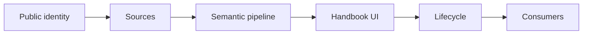
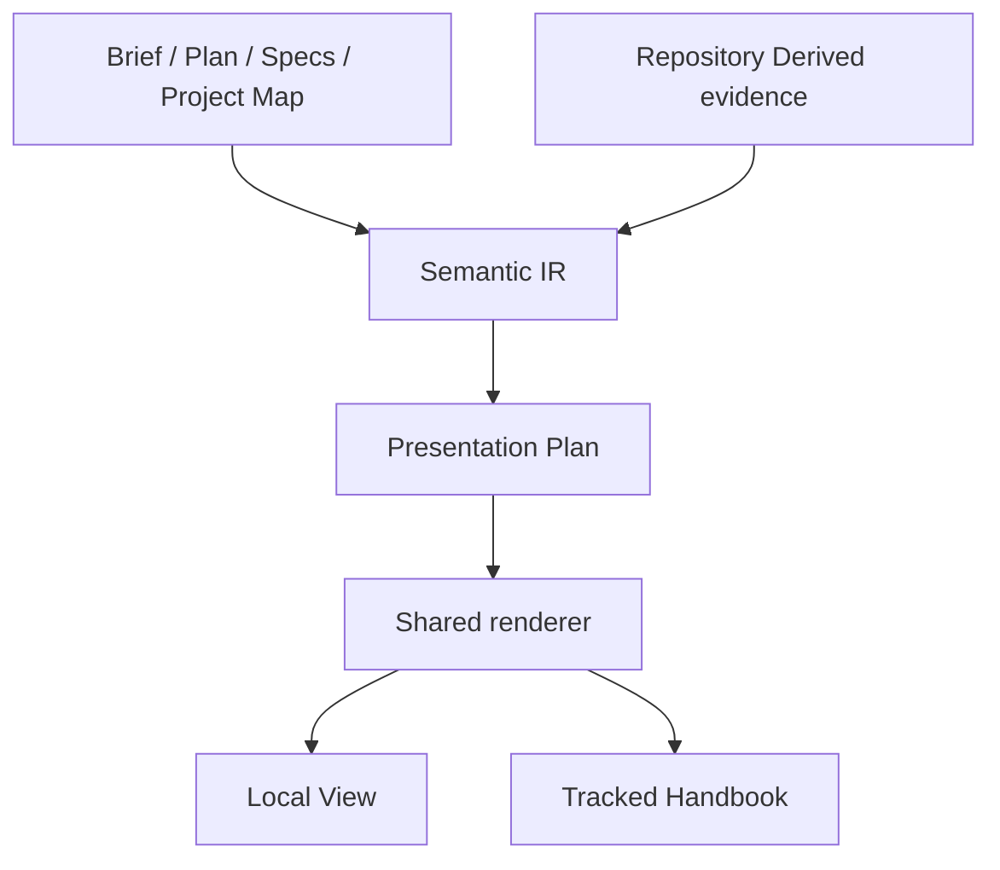

# Forge Visual Docs 구현 계획

> forge executing-plans skill로 Task별 red → green → checkpoint 순서로 실행하고, release authorization 경계 전까지 중단 없이 진행한다.

Status: complete

**Related Specs:**
- bundle: docs/specs/review-viewer-lifecycle/
- bundle: docs/specs/semantic-spec-bundles/
- bundle: docs/specs/forge-ui-design-skill-separation/
- bundle: docs/specs/adaptive-execution-routing/
- bundle: docs/specs/canonical-spec-workflow/

**목표:** `review-viewer`를 `visual-docs`로 교체하고 Brief·Plan·Spec의 local View와 source-backed tracked Project Handbook을 하나의 Semantic IR·renderer·freshness pipeline으로 제공한다.

**아키텍처:** public CLI는 `--kind brief|plan|spec|project`를 사용한다. `review_sources.py`는 Brief·Plan·Spec과 `project_map.py`가 검증한 Project Map·declared Spec을 typed bundle로 수집하고, 기존 Semantic IR·Presentation Plan·component renderer가 kind별 profile을 선택한다. Local View는 `.forge/visual-docs/<view-id>/view.html`, Project Handbook은 `docs/project-viewer/index.html`에 결정적으로 쓴다.

**기술 스택:** Python 3 표준 라이브러리, Bash, Node.js browser fixture, 정적 HTML·CSS·JavaScript, Mermaid 11.16.0, Forge `forge/spec@3` parser

## Global Constraints

- public skill은 `visual-docs` 하나이며 `review-viewer` alias를 배포하지 않는다.
- Renderer는 source에 없는 책임·관계·문장을 만들지 않고 `combined` kind를 거부한다.
- Purpose와 Owns는 Project Map의 사람이 작성한 prose만 사용한다.
- Project Handbook primary navigation은 `프로젝트 한눈에`, `Spec`, `구조`다.
- Runtime mirror, validation, drift, hash와 lifecycle count는 접힌 `Developer information`에만 둔다.
- local View는 single deterministic build로 끝나고, tracked Project Handbook은 build 뒤 freshness `--check`와 repository validation을 통과한다.
- push는 범위 밖이다. Marketplace release 전에는 별도 authorization과 version gate가 필요하다.

## Statement Coverage

| Statement | Kind | Task |
|---|---|---:|
| [`visual-docs` skill은 `brief`, `plan`, `spec`, `project` 네 document kind를 지원하고 Brief와 Plan은 Work View, Spec은 독립 Spec View, Project는 Project Handbook으로 표시해야 한다.](../../specs/review-viewer-lifecycle/human-readable-review-viewer.md#visual-docs-skill은-brief-plan-spec-project-네-document-kind를-지원하고-brief와-plan은-work-view-spec은-독립-spec-view-project는-project-handbook으로-표시해야-한다) | Requirement | 1, 2 |
| [Brief가 conversation에만 존재하고 사용자가 시각화를 요청한 경우 Forge는 현재 작업의 Goal, Scope, Out of Scope와 Done Checks를 `.forge/work/<work-id>/brief.md`에 비권위 source로 저장한 뒤 brief kind를 생성해야 한다.](../../specs/review-viewer-lifecycle/human-readable-review-viewer.md#brief가-conversation에만-존재하고-사용자가-시각화를-요청한-경우-forge는-현재-작업의-goal-scope-out-of-scope와-done-checks를-forgeworkwork-idbriefmd에-비권위-source로-저장한-뒤-brief-kind를-생성해야-한다) | Requirement | 2 |
| [Brief, Plan과 Spec의 독립 View는 `.forge/visual-docs/<view-id>/view.html`에 저장하고 Git 비추적 상태로 유지해야 한다.](../../specs/review-viewer-lifecycle/human-readable-review-viewer.md#brief-plan과-spec의-독립-view는-forgevisual-docsview-idviewhtml에-저장하고-git-비추적-상태로-유지해야-한다) | Requirement | 1, 5 |
| [Project Handbook은 `docs/project/project-map.md`와 그 source가 선언한 Spec Bundle을 읽어 `docs/project-viewer/index.html`에 생성하는 tracked derived document여야 하며 Project Map과 Canonical Spec을 대신하는 source of truth가 되지 않아야 한다.](../../specs/review-viewer-lifecycle/human-readable-review-viewer.md#project-handbook은-docsprojectproject-mapmd와-그-source가-선언한-spec-bundle을-읽어-docsproject-viewerindexhtml에-생성하는-tracked-derived-document여야-하며-project-map과-canonical-spec을-대신하는-source-of-truth가-되지-않아야-한다) | Requirement | 2, 4, 5 |
| [`build-visual-docs.sh`는 `--kind brief|plan|spec|project`, `--locale en|ko`, `--view-id`, `--offline`, kind별 하나의 primary source selector와 허용된 context selector를 지원하고 기본 locale은 `en`으로 유지해야 한다.](../../specs/review-viewer-lifecycle/adaptive-presentation-and-navigation.md#build-visual-docssh는-kind-briefplanspecproject-locale-enko-view-id-offline-kind별-하나의-primary-source-selector와-허용된-context-selector를-지원하고-기본-locale은-en으로-유지해야-한다) | Requirement | 1, 2 |
| [Renderer는 최소한 `generic`, `brief.summary`, `spec.workflow`, `spec.api`, `spec.architecture`, `spec.policy`, `spec.migration`, `plan.execution`, `plan.status`, `project.handbook`, `project.structure`, `project.spec-detail`, `comparison` profile을 제공해야 한다. 새 profile은 공통 component를 조합하고 문서별 template를 복사하지 않아야 한다.](../../specs/review-viewer-lifecycle/adaptive-presentation-and-navigation.md#renderer는-최소한-generic-briefsummary-specworkflow-specapi-specarchitecture-specpolicy-specmigration-planexecution-planstatus-projecthandbook-projectstructure-projectspec-detail-comparison-profile을-제공해야-한다-새-profile은-공통-component를-조합하고-문서별-template를-복사하지-않아야-한다) | Requirement | 3, 4 |
| [Visual Docs는 manifest에 `kind`, `view_id`, output lifecycle `local|tracked`, source별 role·path·SHA-256, 생성 시각, locale, 집계 수치와 project kind의 Project Map path·declared Spec Bundle·repository evidence source를 기록하고 열람 시점 hash와 비교해 `current`, `stale`, `unverified` freshness를 표시해야 한다. 화면의 주 label은 H1, path와 full statement이고 hash나 내부 key를 identity label로 사용하지 않아야 한다.](../../specs/review-viewer-lifecycle/source-selection-and-freshness.md#visual-docs는-manifest에-kind-view_id-output-lifecycle-localtracked-source별-rolepathsha-256-생성-시각-locale-집계-수치와-project-kind의-project-map-pathdeclared-spec-bundlerepository-evidence-source를-기록하고-열람-시점-hash와-비교해-current-stale-unverified-freshness를-표시해야-한다-화면의-주-label은-h1-path와-full-statement이고-hash나-내부-key를-identity-label로-사용하지-않아야-한다) | Requirement | 3, 5 |
| [Project Map의 Structure entry에 Purpose 또는 Owns가 없거나 path·Entry Point가 존재하지 않거나 Spec·statement link가 dangling인 fixture는 Project Handbook build에 실패하고 source를 수정할 수 있는 path-qualified 진단을 반환한다.](../../specs/review-viewer-lifecycle/project-handbook-and-structure.md#project-map의-structure-entry에-purpose-또는-owns가-없거나-pathentry-point가-존재하지-않거나-specstatement-link가-dangling인-fixture는-project-handbook-build에-실패하고-source를-수정할-수-있는-path-qualified-진단을-반환한다) | Acceptance | 2 |
| [같은 Spec Bundle을 Project Handbook의 Spec 상세와 독립 spec kind로 build하면 member path, full Requirement·Acceptance heading, Mermaid SHA-256과 provenance가 일치하고 Project Handbook Overview에는 해당 statement 본문이 중복되지 않는다.](../../specs/review-viewer-lifecycle/project-handbook-and-structure.md#같은-spec-bundle을-project-handbook의-spec-상세와-독립-spec-kind로-build하면-member-path-full-requirementacceptance-heading-mermaid-sha-256과-provenance가-일치하고-project-handbook-overview에는-해당-statement-본문이-중복되지-않는다) | Acceptance | 3, 4 |
| [Project Map과 repository evidence를 가진 Project Handbook에서 폴더별 Purpose와 Owns가 파일 목록보다 먼저 표시되고 Runtime mirror, validation, drift, source hash와 lifecycle count는 primary navigation에 없으며 접힌 Developer information에서만 확인된다.](../../specs/review-viewer-lifecycle/project-handbook-and-structure.md#project-map과-repository-evidence를-가진-project-handbook에서-폴더별-purpose와-owns가-파일-목록보다-먼저-표시되고-runtime-mirror-validation-drift-source-hash와-lifecycle-count는-primary-navigation에-없으며-접힌-developer-information에서만-확인된다) | Acceptance | 4 |
| [Visual Docs 생성·갱신·freshness 요청은 `visual-docs`가 소유하고, shell·component·profile·planner·Project Handbook interaction 변경은 `web-app-design`을 함께 적용해야 한다.](../../specs/forge-ui-design-skill-separation/forge-ui-design-skill-separation.md#visual-docs-생성갱신freshness-요청은-visual-docs가-소유하고-shellcomponentprofileplannerproject-handbook-interaction-변경은-web-app-design을-함께-적용해야-한다) | Requirement | 1, 4, 6 |
| [저장된 local View나 tracked Project Handbook이 있거나 checkpoint가 발생했다는 사실만으로 Visual Docs를 생성하거나 갱신하지 않아야 하며, stale 사실만 보고하고 Visual Docs 작업은 사용자의 명시적 요청이 있을 때만 수행해야 한다.](../../specs/adaptive-execution-routing/adaptive-execution-routing-and-checkpoints.md#저장된-local-view나-tracked-project-handbook이-있거나-checkpoint가-발생했다는-사실만으로-visual-docs를-생성하거나-갱신하지-않아야-하며-stale-사실만-보고하고-visual-docs-작업은-사용자의-명시적-요청이-있을-때만-수행해야-한다) | Requirement | 6 |

## 구현 Route

| Route | Task | 산출물 | Checkpoint |
|---|---:|---|---|
| Route 1 — Public identity | 1 | `visual-docs` skill과 CLI 이름 | internal |
| Route 2 — Sources | 2 | Brief·Project Map collector와 strict diagnostics | notify |
| Route 3 — Semantic pipeline | 3 | four-kind IR, profile, manifest | internal |
| Route 4 — Human-first Handbook | 4 | project navigation과 구조·Spec rendering | notify |
| Route 5 — Lifecycle | 5 | local·tracked output과 freshness | internal |
| Route 6 — Consumers | 6 | routing·install·validation·pressure evidence | approval only before push |

## Task 의존성은 어떻게 이어지는가?

확인할 것: public CLI → source → IR → renderer → lifecycle → consumer 순서로 안정된 interface를 만든다.

읽는 법: 각 화살표는 후속 Task가 소비하는 interface다.

## Runtime 책임은 어디에 있는가?

확인할 것: authority와 derived evidence가 섞이지 않고 builder만 HTML을 쓴다.

읽는 법: Project Map prose와 repository evidence는 renderer까지 별도 role로 유지된다.

| 주체 | 책임 |
|---|---|
| Brief·Plan | 작업 목표와 실행 source |
| Canonical Spec | 규범적 계약 |
| Project Map | 프로젝트 개요와 Purpose·Owns |
| Repository scan | 파일 목록·hash `Derived evidence` |
| Builder | source 검증, IR, plan, HTML·manifest |
| Checker | freshness 비교; 재생성 권한 없음 |

## kind별 확장 구조는 어떻게 유지되는가?

확인할 것: 네 kind가 별도 template가 아니라 공통 grammar와 profile을 공유한다.

읽는 법: source selector와 profile만 다르고 IR·renderer·freshness는 같다.

| Kind | Selector | Profile | Output |
|---|---|---|---|
| `brief` | `--brief` | `brief.summary` | local Work View |
| `plan` | `--plan` | `plan.*` | local Work View |
| `spec` | `--spec` | `spec.*` | local Spec View |
| `project` | `--project-map` | `project.*` | tracked Handbook |

### Task 1: Public skill과 CLI rename

**Governing statements:**
- [`visual-docs` skill은 `brief`, `plan`, `spec`, `project` 네 document kind를 지원하고 Brief와 Plan은 Work View, Spec은 독립 Spec View, Project는 Project Handbook으로 표시해야 한다.](../../specs/review-viewer-lifecycle/human-readable-review-viewer.md#visual-docs-skill은-brief-plan-spec-project-네-document-kind를-지원하고-brief와-plan은-work-view-spec은-독립-spec-view-project는-project-handbook으로-표시해야-한다)
- [`build-visual-docs.sh`는 `--kind brief|plan|spec|project`, `--locale en|ko`, `--view-id`, `--offline`, kind별 하나의 primary source selector와 허용된 context selector를 지원하고 기본 locale은 `en`으로 유지해야 한다.](../../specs/review-viewer-lifecycle/adaptive-presentation-and-navigation.md#build-visual-docssh는-kind-briefplanspecproject-locale-enko-view-id-offline-kind별-하나의-primary-source-selector와-허용된-context-selector를-지원하고-기본-locale은-en으로-유지해야-한다)

**파일:** 이동 `plugins/forge/skills/review-viewer/` → `plugins/forge/skills/visual-docs/`; 이동 `scripts/build-review-viewer.sh` → `scripts/build-visual-docs.sh`; 수정 `SKILL.md`, `scripts/build_review_viewer.py`; 테스트 `tests/test-build-visual-docs.sh`.

**Interfaces:** `build-visual-docs.sh --kind brief|plan|spec|project --view-id <id>`를 생산하고 public legacy path·option을 제거한다.

**실행 metadata:** 의존성 없음; 전체 skill 경로 소유; rename과 import path가 겹쳐 순차 실행; approval gate 없음.

- [x] **Step 1: `visual-docs` path, four-kind CLI와 legacy absence를 assert하는 shell test를 먼저 작성한다.**
- [x] **Step 2: `bash plugins/forge/skills/visual-docs/tests/test-build-visual-docs.sh`가 missing new path로 실패하는지 확인한다.**
- [x] **Step 3: directory·frontmatter·build script와 `parser.add_argument("--kind", choices=("brief", "plan", "spec", "project"))`를 구현한다.**
- [x] **Step 4: 같은 shell test가 PASS하는지 확인한다.**
- [x] **Step 5: public files의 `review-viewer|Review Viewer|.forge/reviews|build-review-viewer` 검색 결과가 0인지 확인한다.**

### Task 2: Brief와 Project Map source model

**Governing statements:**
- [Brief가 conversation에만 존재하고 사용자가 시각화를 요청한 경우 Forge는 현재 작업의 Goal, Scope, Out of Scope와 Done Checks를 `.forge/work/<work-id>/brief.md`에 비권위 source로 저장한 뒤 brief kind를 생성해야 한다.](../../specs/review-viewer-lifecycle/human-readable-review-viewer.md#brief가-conversation에만-존재하고-사용자가-시각화를-요청한-경우-forge는-현재-작업의-goal-scope-out-of-scope와-done-checks를-forgeworkwork-idbriefmd에-비권위-source로-저장한-뒤-brief-kind를-생성해야-한다)
- [Project Map의 Structure entry에 Purpose 또는 Owns가 없거나 path·Entry Point가 존재하지 않거나 Spec·statement link가 dangling인 fixture는 Project Handbook build에 실패하고 source를 수정할 수 있는 path-qualified 진단을 반환한다.](../../specs/review-viewer-lifecycle/project-handbook-and-structure.md#project-map의-structure-entry에-purpose-또는-owns가-없거나-pathentry-point가-존재하지-않거나-specstatement-link가-dangling인-fixture는-project-handbook-build에-실패하고-source를-수정할-수-있는-path-qualified-진단을-반환한다)

**파일:** 생성 `scripts/project_map.py`, `tests/test_project_map.py`, Brief·Project Map fixtures; 수정 `scripts/review_sources.py`, `scripts/build_review_viewer.py`, `tests/test_review_sources.py`.

**Interfaces:** `ProjectMap`, `StructureEntry`, `load_project_map(path, repo_root)`, `collect_brief_sources`, `collect_project_sources`; Structure H3의 `Purpose`, `Owns`, `Entry Points`, `Depends On`, `Related Specs`를 검증한다.

**실행 metadata:** Task 1 의존; parser·fixtures 소유; Task 3 type 입력 때문에 순차; schema authority divergence만 approval gate.

- [x] **Step 1: valid, missing Purpose, path escape, missing Entry Point, dangling Spec·statement fixture tests를 작성한다.**
- [x] **Step 2: `python3 -m unittest plugins/forge/skills/visual-docs/tests/test_project_map.py plugins/forge/skills/visual-docs/tests/test_review_sources.py`가 missing parser로 실패하는지 확인한다.**
- [x] **Step 3: `@dataclass(frozen=True) class StructureEntry`와 strict `load_project_map`·Brief·Project collectors를 구현한다.**
- [x] **Step 4: 같은 unit tests가 PASS하고 negative fixture가 path-qualified 진단을 반환하는지 확인한다.**
- [x] **Step 5: project `--dry-run` JSON에서 Project Map, declared Specs, repository evidence role이 분리되는지 확인한다.**

### Task 3: four-kind Semantic IR·profile·manifest

**Governing statements:**
- [Renderer는 최소한 `generic`, `brief.summary`, `spec.workflow`, `spec.api`, `spec.architecture`, `spec.policy`, `spec.migration`, `plan.execution`, `plan.status`, `project.handbook`, `project.structure`, `project.spec-detail`, `comparison` profile을 제공해야 한다. 새 profile은 공통 component를 조합하고 문서별 template를 복사하지 않아야 한다.](../../specs/review-viewer-lifecycle/adaptive-presentation-and-navigation.md#renderer는-최소한-generic-briefsummary-specworkflow-specapi-specarchitecture-specpolicy-specmigration-planexecution-planstatus-projecthandbook-projectstructure-projectspec-detail-comparison-profile을-제공해야-한다-새-profile은-공통-component를-조합하고-문서별-template를-복사하지-않아야-한다)
- [Visual Docs는 manifest에 `kind`, `view_id`, output lifecycle `local|tracked`, source별 role·path·SHA-256, 생성 시각, locale, 집계 수치와 project kind의 Project Map path·declared Spec Bundle·repository evidence source를 기록하고 열람 시점 hash와 비교해 `current`, `stale`, `unverified` freshness를 표시해야 한다. 화면의 주 label은 H1, path와 full statement이고 hash나 내부 key를 identity label로 사용하지 않아야 한다.](../../specs/review-viewer-lifecycle/source-selection-and-freshness.md#visual-docs는-manifest에-kind-view_id-output-lifecycle-localtracked-source별-rolepathsha-256-생성-시각-locale-집계-수치와-project-kind의-project-map-pathdeclared-spec-bundlerepository-evidence-source를-기록하고-열람-시점-hash와-비교해-current-stale-unverified-freshness를-표시해야-한다-화면의-주-label은-h1-path와-full-statement이고-hash나-내부-key를-identity-label로-사용하지-않아야-한다)

**파일:** 수정 `scripts/review_ir.py`, `review_planner.py`, `review_renderer.py`; 테스트 `test_review_ir.py`, `test_review_planner.py`, `test_review_renderer.py`.

**Interfaces:** `ReviewBundle.mode`·`SemanticIR.mode`·`ViewContext.mode`를 `kind`로 바꾸고 `brief.summary`, `project.handbook`, `project.structure`, `project.spec-detail`과 manifest `kind`, `view_id`, `output_lifecycle`을 생산한다.

**실행 metadata:** Task 2 의존; IR·planner·manifest 소유; 공통 dataclass rename 때문에 순차; approval gate 없음.

- [x] **Step 1: brief/project content coverage와 spec entity·Mermaid parity failing tests를 작성한다.**
- [x] **Step 2: IR·planner·renderer unit suite가 unsupported kind로 실패하는지 확인한다.**
- [x] **Step 3: kind field, four profiles, component references와 manifest fields를 구현한다.**
- [x] **Step 4: unit suite가 four-kind coverage 100%와 deterministic manifest로 PASS하는지 확인한다.**
- [x] **Step 5: 독립 spec View와 project Spec detail의 member path·statement·Mermaid hash가 일치하는지 확인한다.**

### Task 4: Human-first Project Handbook component와 navigation

**Governing statements:**
- [같은 Spec Bundle을 Project Handbook의 Spec 상세와 독립 spec kind로 build하면 member path, full Requirement·Acceptance heading, Mermaid SHA-256과 provenance가 일치하고 Project Handbook Overview에는 해당 statement 본문이 중복되지 않는다.](../../specs/review-viewer-lifecycle/project-handbook-and-structure.md#같은-spec-bundle을-project-handbook의-spec-상세와-독립-spec-kind로-build하면-member-path-full-requirementacceptance-heading-mermaid-sha-256과-provenance가-일치하고-project-handbook-overview에는-해당-statement-본문이-중복되지-않는다)
- [Project Map과 repository evidence를 가진 Project Handbook에서 폴더별 Purpose와 Owns가 파일 목록보다 먼저 표시되고 Runtime mirror, validation, drift, source hash와 lifecycle count는 primary navigation에 없으며 접힌 Developer information에서만 확인된다.](../../specs/review-viewer-lifecycle/project-handbook-and-structure.md#project-map과-repository-evidence를-가진-project-handbook에서-폴더별-purpose와-owns가-파일-목록보다-먼저-표시되고-runtime-mirror-validation-drift-source-hash와-lifecycle-count는-primary-navigation에-없으며-접힌-developer-information에서만-확인된다)

**파일:** 수정 `scripts/review_components.py`, `assets/viewer-template.html`, `tests/browser/visual-docs.spec.mjs`; 테스트 `test_review_renderer.py`, `run-visual-docs-browser.sh`.

**Interfaces:** `project-overview`, `capability-map`, `spec-index`, `structure-responsibility`, `developer-information`; primary nav DOM은 `overview`, `specs`, `structure`만 노출한다.

**실행 metadata:** Task 3 의존; component·template·browser test 소유; markup과 browser fixture가 겹쳐 순차; source 밖 prose나 nav 추가만 approval gate.

- [x] **Step 1: primary nav 3개, Purpose·Owns ordering, Developer information collapsed browser assertions를 작성한다.**
- [x] **Step 2: renderer/browser tests가 unknown project component로 실패하는지 확인한다.**
- [x] **Step 3: source-backed project components와 three-landmark navigation을 구현한다.**
- [x] **Step 4: desktop 1440px·mobile 390px browser tests에서 navigation, keyboard, overflow, deep link를 검증한다.**
- [x] **Step 5: Overview statement count 0, Spec detail statement count가 declared bundle과 같은지 확인한다.**

### Task 5: Local·tracked output과 freshness lifecycle

**Governing statements:**
- [Brief, Plan과 Spec의 독립 View는 `.forge/visual-docs/<view-id>/view.html`에 저장하고 Git 비추적 상태로 유지해야 한다.](../../specs/review-viewer-lifecycle/human-readable-review-viewer.md#brief-plan과-spec의-독립-view는-forgevisual-docsview-idviewhtml에-저장하고-git-비추적-상태로-유지해야-한다)
- [Project Handbook은 `docs/project/project-map.md`와 그 source가 선언한 Spec Bundle을 읽어 `docs/project-viewer/index.html`에 생성하는 tracked derived document여야 하며 Project Map과 Canonical Spec을 대신하는 source of truth가 되지 않아야 한다.](../../specs/review-viewer-lifecycle/human-readable-review-viewer.md#project-handbook은-docsprojectproject-mapmd와-그-source가-선언한-spec-bundle을-읽어-docsproject-viewerindexhtml에-생성하는-tracked-derived-document여야-하며-project-map과-canonical-spec을-대신하는-source-of-truth가-되지-않아야-한다)

**파일:** 수정 `scripts/build_review_viewer.py`, `review_freshness.py`, `assets/viewer-freshness.mjs`; 테스트 `test_review_freshness.py`, `test-visual-docs-freshness.mjs`, `test-build-visual-docs.sh`.

**Interfaces:** local output `.forge/visual-docs/<view-id>/view.html`; tracked output `docs/project-viewer/index.html`; read-only `--check` exit `0|1|2`.

**실행 metadata:** Task 4 의존; output·checker 소유; manifest shape 공유 때문에 순차; hosting이나 추가 tracked mutation만 approval gate.

- [x] **Step 1: local·tracked output path, manifest lifecycle과 source mutation freshness tests를 작성한다.**
- [x] **Step 2: 기존 `.forge/reviews` checker에서 tests가 실패하는지 확인한다.**
- [x] **Step 3: `output_for(kind, view_id)`와 Python·browser manifest checker를 구현한다.**
- [x] **Step 4: Python·Node freshness와 shell build tests가 PASS하는지 확인한다.**
- [x] **Step 5: fixed timestamp project build 두 번의 byte diff가 0이고 `--check`가 성공하는지 확인한다.**

### Task 6: Forge consumer·install·validation·pressure test

**Governing statements:**
- [Visual Docs 생성·갱신·freshness 요청은 `visual-docs`가 소유하고, shell·component·profile·planner·Project Handbook interaction 변경은 `web-app-design`을 함께 적용해야 한다.](../../specs/forge-ui-design-skill-separation/forge-ui-design-skill-separation.md#visual-docs-생성갱신freshness-요청은-visual-docs가-소유하고-shellcomponentprofileplannerproject-handbook-interaction-변경은-web-app-design을-함께-적용해야-한다)
- [저장된 local View나 tracked Project Handbook이 있거나 checkpoint가 발생했다는 사실만으로 Visual Docs를 생성하거나 갱신하지 않아야 하며, stale 사실만 보고하고 Visual Docs 작업은 사용자의 명시적 요청이 있을 때만 수행해야 한다.](../../specs/adaptive-execution-routing/adaptive-execution-routing-and-checkpoints.md#저장된-local-view나-tracked-project-handbook이-있거나-checkpoint가-발생했다는-사실만으로-visual-docs를-생성하거나-갱신하지-않아야-하며-stale-사실만-보고하고-visual-docs-작업은-사용자의-명시적-요청이-있을-때만-수행해야-한다)

**파일:** 수정 Forge consumer `SKILL.md`, maintaining-forge canonical source·portability, `README.md`, `.github/workflows/validate.yml`, `scripts/validate.sh`, `scripts/tests/*.sh`; 생성 `test-forge-visual-docs-install.sh`, `.forge/scratch/visual-docs-pressure-test.md`.

**Interfaces:** explicit Brief·Plan·Spec·Project create/update/check → `visual-docs`; source change/checkpoint → stale report only; install에는 `visual-docs`만 존재; push와 version bump는 별도 release 경계.

**실행 metadata:** Task 5 의존; consumer·CI·tests 소유; global rename 검증 때문에 순차; push 직전 approval gate.

- [x] **Step 1: consumer·install tests를 `visual-docs`, four kind, tracked exception 기준으로 먼저 수정한다.**
- [x] **Step 2: focused repository policy tests가 legacy reference로 실패하는지 확인한다.**
- [x] **Step 3: consumer skills, maintainer source, portability, README, CI와 test names를 동기화한다.**
- [x] **Step 4: focused policy·install tests가 PASS하는지 확인한다.**
- [x] **Step 5: `bash scripts/validate.sh`와 writer validation이 모두 성공하는지 확인한다.**
- [x] **Step 6: deadline·기존 Viewer sunk cost·자동 갱신 요구를 결합한 adversarial self-read를 `.forge/scratch/visual-docs-pressure-test.md`에 기록한다.**
- [x] **Step 7: `git diff --check` 뒤 release boundary에서 멈추고 version bump·push를 수행하지 않는다.**

## Checkpoints

- internal: 각 Task focused test가 red에서 green으로 바뀌고 diff ownership이 Task 범위와 일치하면 계속한다.
- notify: Task 2 source parser와 Task 4 Project Handbook browser behavior 완료를 알리되 응답을 기다리지 않는다.
- approval: plugin version bump, push 또는 Marketplace release 직전에만 사용자 authorization을 요구한다.

## Verification Evidence

| Evidence | Command | Expected |
|---|---|---|
| Source parser | `python3 -m unittest ...test_project_map.py ...test_review_sources.py` | PASS and path-qualified negatives |
| Semantic pipeline | `python3 -m unittest ...test_review_ir.py ...test_review_planner.py ...test_review_renderer.py` | four-kind coverage PASS |
| Browser | `bash plugins/forge/skills/visual-docs/tests/run-visual-docs-browser.sh` | desktop·mobile PASS |
| Freshness | `python3 -m unittest ...test_review_freshness.py && node --test ...test-visual-docs-freshness.mjs` | lifecycle PASS |
| Repository | `bash scripts/validate.sh` | `validate: all checks passed` |
| Canonical | `bash plugins/forge/skills/writing-specs/scripts/spec-docs.sh --repo-root . validate --root docs/specs --baseline-ref HEAD` | diagnostics 0 |

## Progress History

- 2026-08-09: approved Visual Docs Delta를 5개 Canonical Spec Bundle에 적용했고 writer validation diagnostics 0을 확인했다.
- Task 1: routed (impact=medium, uncertainty=low, context_coupling=high, verification_clarity=strong, tier=frontier, mode=root, parallel_group=none, reason="public path rename and tightly coupled CLI migration")
- 2026-08-09: Task 1–2 — public identity를 `visual-docs`로 교체하고 four-kind CLI, Brief source, strict Project Map과 exact governing statement 검증을 구현했다.
- 2026-08-09: Task 3–4 — 네 kind의 공통 Semantic IR·profile·manifest를 구현하고 Project Handbook을 `프로젝트 한눈에`·`Spec`·`구조`의 human-first navigation으로 재구성했다.
- 2026-08-09: Task 5 — local·tracked output lifecycle, deterministic manifest와 Python·browser freshness check를 구현했다.
- 2026-08-09: Task 6 — Forge consumer·installer·CI·maintainer source를 동기화하고 focused unit 44개, browser 6개, build·freshness·install parity와 repository validation을 통과했다.
- 2026-08-09: release boundary에서 중단했다. plugin version bump, commit, push와 Marketplace release는 수행하지 않았다.
