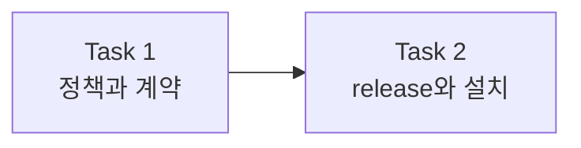

# 기본 Subagent 라우팅 구현 계획

> 이 계획은 the forge executing-plans skill로 Task별 검증과 checkpoint를 유지하며 실행한다.

Status: active

**Related Specs:**
- `docs/specs/004-adaptive-execution-routing/spec.md`: R28–R31 · AC17–AC18

**목표:** capability tier별 기본 execution mode를 결정적으로 고정하고 안전한 `balanced` Task를 질문 없이 subagent에 위임한다.

**아키텍처:** `adaptive-routing.md`가 tier별 기본값과 override 조건의 source가 되고, `executing-plans`가 실행 시 적용 원칙을 짧게 강제한다. shell contract test가 핵심 문구를 고정하며 root agent가 최종 diff와 fresh verification을 소유한다.

**Tech Stack:** Markdown Agent Skills, Bash contract test, Forge validator, Codex·Claude plugin manifests

## Global Constraints

- `fast=root`, 조건을 만족한 `balanced=subagent`, `frontier=root` 기본값을 유지한다.
- dependency, write ownership, handoff, verification 조건이 불완전하면 root sequential 실행으로 fallback한다.
- 사용자에게 execution mode를 매번 묻지 않고, 명시한 `root-only`·subagent 사용 여부·동시 실행 상한은 존중한다.
- root agent가 source-of-truth 판단, integration, diff review와 fresh verification을 계속 소유한다.
- subagent 동시 실행은 플랫폼 제한과 사용자 상한 안에서 최대 3개다.

## AC Coverage

| AC | Tasks |
|---|---|
| AC17 | 1 |
| AC18 | 1, 2 |

## Routes

| Route | Tasks | 산출물 | Checkpoint |
|---|---:|---|---|
| Route 1 — Policy | 1 | 기본 execution mode 규칙과 회귀 계약 | internal |
| Route 2 — Release | 2 | 검증된 plugin release와 로컬 설치 | release authority already granted |



## Runtime Responsibility

| 주체 | 책임 |
|---|---|
| root agent | spec·plan·라우팅 정책 수정, test RED/GREEN 확인, diff review, release, 최종 검증 |
| subagent | 이번 Task에서는 사용하지 않음 — source-of-truth 파일과 계약 테스트가 tightly coupled됨 |
| plugin manager | push된 version의 Codex·Claude 설치본 갱신 |

### Task 1: 기본 execution mode 정책과 계약 구현 (R28–R31 · AC17–AC18)

**Files:**
- Modify: `scripts/tests/test-forge-artifact-contract.sh`
- Modify: `plugins/forge/skills/executing-plans/references/adaptive-routing.md`
- Modify: `plugins/forge/skills/executing-plans/SKILL.md`
- Modify: `docs/plans/002-default-subagent-routing/plan.md`

**Interfaces:**
- Consumes: `impact`, `uncertainty`, `context_coupling`, `verification_clarity`, Task dependency, Files, Interfaces, verification, user execution preferences
- Produces: deterministic `fast→root`, eligible `balanced→subagent`, `frontier→root` selection and safe `parallel` override

**Execution metadata:**
- Dependencies: none
- Write ownership: 위 Files 전체
- Parallel safety: sequential root — policy source와 contract assertion이 같은 의미를 함께 변경함
- Approval gate: none — written spec과 release가 이 요청에서 승인됨

- [x] **Step 1: 기본 execution mode 계약 assertion을 먼저 추가한다**

```bash
grep -q '`fast` defaults to `root`' "$ROOT/plugins/forge/skills/executing-plans/references/adaptive-routing.md"
grep -q '`balanced` defaults to `subagent`' "$ROOT/plugins/forge/skills/executing-plans/references/adaptive-routing.md"
grep -q '`frontier` defaults to `root`' "$ROOT/plugins/forge/skills/executing-plans/references/adaptive-routing.md"
grep -q 'Do not ask the user to choose an execution mode' "$ROOT/plugins/forge/skills/executing-plans/SKILL.md"
```

- [x] **Step 2: 계약 테스트가 새 문구 부재로 실패하는지 확인한다**

Run: `bash scripts/tests/test-forge-artifact-contract.sh`
Expected: FAIL because the first missing default-mode assertion exits non-zero

- [x] **Step 3: 최소 정책 문구를 구현한다**

```markdown
| Tier | Default | Override |
| `fast` | `root` | safe mechanical parallel work only when savings exceed coordination |
| `balanced` | `subagent` | root unless coupling is low, verification strong, handoff complete, and ownership disjoint |
| `frontier` | `root` | bounded evidence collection may be delegated; judgment stays root-owned |
```

- [x] **Step 4: 계약 테스트와 Forge validator를 실행한다**

Run: `bash scripts/tests/test-forge-artifact-contract.sh && bash scripts/validate.sh`
Expected: `test-forge-artifact-contract: all checks passed` and `validate: all checks passed`

- [ ] **Step 5: Task 1 변경을 commit한다**

Run: `git add docs/specs/004-adaptive-execution-routing/spec.md docs/plans/002-default-subagent-routing/plan.md plugins/forge/skills/executing-plans/SKILL.md plugins/forge/skills/executing-plans/references/adaptive-routing.md scripts/tests/test-forge-artifact-contract.sh && git commit -m "feat(forge): default eligible balanced tasks to subagents"`

### Task 2: Forge release와 현재 머신 설치 (R31 · AC18)

**Files:**
- Modify: `plugins/forge/.claude-plugin/plugin.json`
- Modify: `plugins/forge/.codex-plugin/plugin.json`
- Modify: `docs/plans/002-default-subagent-routing/plan.md`

**Interfaces:**
- Consumes: Task 1의 검증된 policy files, 현재 plugin version, `origin/main`
- Produces: 새 patch version, pushed `main`, 최신 Codex managed cache, Claude user plugin, local dev copies

**Execution metadata:**
- Dependencies: Task 1
- Write ownership: plugin manifest 2개와 plan progress
- Parallel safety: sequential — release version과 설치 source가 동일 commit을 가리켜야 함
- Approval gate: satisfied — 사용자가 이 요청에서 push와 현재 머신 업데이트를 명시함

- [ ] **Step 1: Claude patch version과 Codex cachebuster를 갱신한다**

Modify: Claude manifest의 version을 `0.1.2`, Codex manifest의 base version을 `0.1.2`로 변경한다.
Run: `python3 /Users/han-byeol/.codex/skills/.system/plugin-creator/scripts/update_plugin_cachebuster.py plugins/forge`
Expected: Claude version은 `0.1.2`, Codex version은 `0.1.2+codex.<새 UTC timestamp>`다.

- [ ] **Step 2: plugin과 repository 전체를 fresh 검증한다**

Run: `bash scripts/validate.sh && bash scripts/tests/test-forge-artifact-contract.sh`
Expected: 모든 command exit 0

- [ ] **Step 3: release manifest와 progress를 commit하고 main에 push한다**

Run: `git push origin main`
Expected: remote `refs/heads/main`이 local HEAD와 일치

- [ ] **Step 4: Codex·Claude managed plugin과 local dev copies를 갱신한다**

Run: marketplace upgrade, plugin update, `bash scripts/install.sh --agent all --mode copy --plugin forge`
Expected: installed versions and policy files match the pushed repository

## Progress History

- 2026-07-13: plan created; Task 1 routed (impact=high, uncertainty=low, context_coupling=high, verification_clarity=strong, tier=frontier, mode=root, parallel_group=none, reason="routing source-of-truth and its contract test are tightly coupled")
- 2026-07-13: Task 1 RED confirmed (`test-forge-artifact-contract.sh` exit 1 at the first missing default-mode assertion); minimal routing policy implemented.
- 2026-07-13: Task 1 GREEN confirmed (`test-forge-artifact-contract: all checks passed`; `validate: all checks passed`); fresh-agent deadline pressure scenario preserved `fast/root`, eligible `balanced/subagent`, `frontier/root`, safe parallel gating, and root-owned review.
