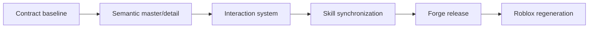
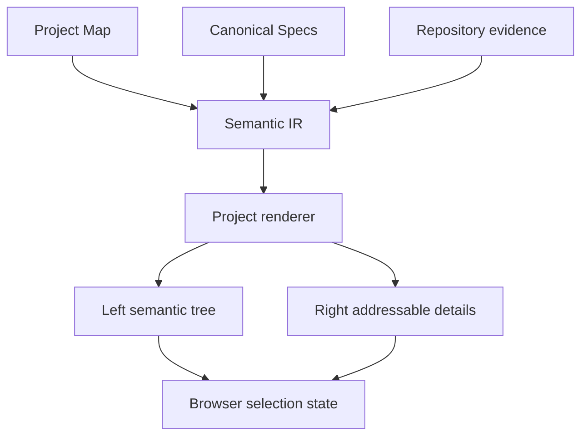
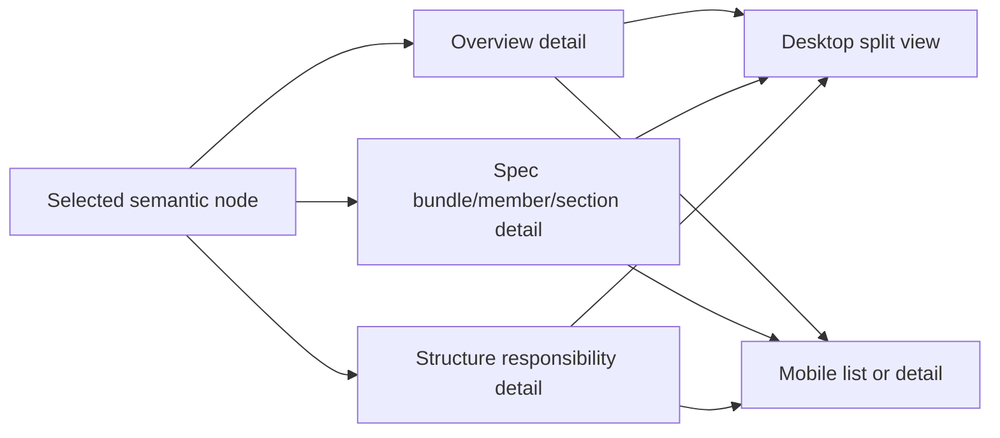

# Project Handbook 탐색 구조 개선 계획

> forge executing-plans skill로 Task별 red → green → checkpoint 순서로 실행하고, 검증된 Forge release를 먼저 배포한 뒤 Roblox Project Handbook을 재생성한다.

Status: complete

**Related Specs:**
- bundle: docs/specs/review-viewer-lifecycle/

**목표:** Project Handbook을 쉬운 한국어 label과 의미 기반 좌측 tree navigation, 선택형 우측 detail로 바꿔 프로젝트 개요·설계 기준·구조 책임·출처를 한 흐름에서 찾게 한다.

**완료 상태:** Forge renderer·interaction·skill contract·browser fixture가 새 구조를 검증하고, Marketplace version을 올려 `main`에 push한 뒤 `/Users/han-byeol/Work/roblox-project/docs/project-viewer/index.html`을 새 renderer로 재생성한다.

**아키텍처:** 기존 Project Map·Canonical Spec·repository evidence와 Semantic IR은 유지한다. Project profile renderer가 source entity에서 navigation tree와 addressable detail route를 만들고, 공통 shell script가 selection·search·tree keyboard·deep link·mobile list/detail state를 관리한다. 출처와 freshness는 선택한 항목의 `출처·검증` disclosure에서만 제공한다.

**기술 스택:** Python 3 표준 라이브러리, 정적 HTML·CSS·JavaScript, Node.js Playwright browser fixture, Bash validation, Forge `forge/spec@3`

## Global Constraints

- Project Map과 Canonical Spec의 exact statement, identifier, Mermaid bytes와 source ownership을 변경하지 않는다.
- 독립 Spec·Plan·Brief View의 기존 profile과 공통 freshness 동작을 회귀시키지 않는다.
- reader-facing label은 쉬운 한국어를 우선하고 API·schema·path 같은 고유 식별자만 원문을 유지한다.
- Project Handbook primary navigation에는 `개요`, `설계 기준`, `프로젝트 구조`만 둔다.
- 하나의 거대한 `Complete Spec details`와 전역 `Developer information`을 만들지 않는다.
- desktop 1440px과 mobile 390px에서 stable shell geometry, overflow, keyboard focus와 detail route를 검증한다.
- Forge 전체 validation과 fresh-agent pressure test를 통과한 release만 push한다.
- Forge push·배포가 성공한 뒤에만 Roblox Project Handbook을 갱신한다.

## Statement Coverage

| Statement | Kind | Task |
|---|---|---:|
| [Project Handbook의 primary navigation은 개요, 설계 기준, 프로젝트 구조를 고정된 좌측 탐색으로 제공하고 선택한 항목의 내용을 우측 상세에 표시하며 프로젝트 목적, 핵심 기능과 사용자 흐름, 상위 영역 책임을 diagnostic count나 contract lifecycle 수치보다 먼저 보여줘야 한다.](../../specs/review-viewer-lifecycle/project-handbook-and-structure.md#project-handbook의-primary-navigation은-개요-설계-기준-프로젝트-구조를-고정된-좌측-탐색으로-제공하고-선택한-항목의-내용을-우측-상세에-표시하며-프로젝트-목적-핵심-기능과-사용자-흐름-상위-영역-책임을-diagnostic-count나-contract-lifecycle-수치보다-먼저-보여줘야-한다) | Requirement | 1, 2 |
| [Project Handbook의 좌측 탐색은 Spec bundle·member·section과 Structure entry를 의미 기반 계층 node로 표시하고 검색, 현재 선택 상태, deep link와 표준 tree keyboard interaction을 지원해야 한다.](../../specs/review-viewer-lifecycle/project-handbook-and-structure.md#project-handbook의-좌측-탐색은-spec-bundlemembersection과-structure-entry를-의미-기반-계층-node로-표시하고-검색-현재-선택-상태-deep-link와-표준-tree-keyboard-interaction을-지원해야-한다) | Requirement | 1, 2, 3 |
| [Project Handbook의 Spec 탐색은 각 bundle의 title, Overview, 담당 영역, 관련 Spec과 source path를 요약하고 선택한 우측 상세에서 bundle의 모든 member와 Requirement·Acceptance Criteria를 source provenance와 함께 탐색할 수 있게 해야 한다.](../../specs/review-viewer-lifecycle/project-handbook-and-structure.md#project-handbook의-spec-탐색은-각-bundle의-title-overview-담당-영역-관련-spec과-source-path를-요약하고-선택한-우측-상세에서-bundle의-모든-member와-requirementacceptance-criteria를-source-provenance와-함께-탐색할-수-있게-해야-한다) | Requirement | 2 |
| [Project Handbook의 reader-facing label은 `프로젝트 한눈에`, `Spec`, `Requirement`, `Acceptance Criteria`, `Behavior & Flows`, `Launch Baseline`, `Purpose`, `Owns`, `Entry Points`와 `Developer information` 대신 각각 `개요`, `설계 기준`, `필수 사항`, `완료 기준`, `동작과 흐름`, `출시 기준`, `역할`, `담당 범위`, `주요 파일`과 `출처·검증`을 사용하되 exact normative statement와 identifier는 변경하지 않아야 한다.](../../specs/review-viewer-lifecycle/project-handbook-and-structure.md#project-handbook의-reader-facing-label은-프로젝트-한눈에-spec-requirement-acceptance-criteria-behavior-flows-launch-baseline-purpose-owns-entry-points와-developer-information-대신-각각-개요-설계-기준-필수-사항-완료-기준-동작과-흐름-출시-기준-역할-담당-범위-주요-파일과-출처검증을-사용하되-exact-normative-statement와-identifier는-변경하지-않아야-한다) | Requirement | 1, 2, 4 |
| [Project Handbook의 구조 상세는 선택한 Structure entry의 역할과 담당 범위를 먼저 표시하고 주요 파일, dependency evidence와 하위 파일 목록을 그 뒤에 표시해야 한다.](../../specs/review-viewer-lifecycle/project-handbook-and-structure.md#project-handbook의-구조-상세는-선택한-structure-entry의-역할과-담당-범위를-먼저-표시하고-주요-파일-dependency-evidence와-하위-파일-목록을-그-뒤에-표시해야-한다) | Requirement | 2 |
| [Runtime mirror, validation, drift, source hash, source record와 plan·contract lifecycle 집계는 primary navigation에서 제외하고 현재 선택 항목에 해당하는 `출처·검증` detail route 또는 panel에서 provenance와 함께 표시해야 한다.](../../specs/review-viewer-lifecycle/project-handbook-and-structure.md#runtime-mirror-validation-drift-source-hash-source-record와-plancontract-lifecycle-집계는-primary-navigation에서-제외하고-현재-선택-항목에-해당하는-출처검증-detail-route-또는-panel에서-provenance와-함께-표시해야-한다) | Requirement | 2, 3 |
| [Project Handbook은 하나의 `Complete Spec details` disclosure 없이 선언된 모든 Spec의 전체 내용을 좌측 탐색과 선택형 우측 상세에서 탐색할 수 있어야 하며 Overview와 Structure에 Requirement·Acceptance Criteria 본문을 복제하지 않아야 한다.](../../specs/review-viewer-lifecycle/project-handbook-and-structure.md#project-handbook은-하나의-complete-spec-details-disclosure-없이-선언된-모든-spec의-전체-내용을-좌측-탐색과-선택형-우측-상세에서-탐색할-수-있어야-하며-overview와-structure에-requirementacceptance-criteria-본문을-복제하지-않아야-한다) | Requirement | 2, 3 |
| [Project Handbook은 desktop working width에서 좌측 탐색과 우측 상세를 side-by-side로 유지하고 narrow viewport에서는 탐색과 상세을 한 화면씩 표시하며 상세에서 탐색으로 돌아가는 명시적 action을 제공해야 한다.](../../specs/review-viewer-lifecycle/project-handbook-and-structure.md#project-handbook은-desktop-working-width에서-좌측-탐색과-우측-상세를-side-by-side로-유지하고-narrow-viewport에서는-탐색과-상세을-한-화면씩-표시하며-상세에서-탐색으로-돌아가는-명시적-action을-제공해야-한다) | Requirement | 3 |
| [같은 Spec Bundle을 Project Handbook의 설계 기준 상세와 독립 spec kind로 build하면 member path, full Requirement·Acceptance heading, Mermaid SHA-256과 provenance가 일치하고 Project Handbook 개요에는 해당 statement 본문이 중복되지 않는다.](../../specs/review-viewer-lifecycle/project-handbook-and-structure.md#같은-spec-bundle을-project-handbook의-설계-기준-상세와-독립-spec-kind로-build하면-member-path-full-requirementacceptance-heading-mermaid-sha-256과-provenance가-일치하고-project-handbook-개요에는-해당-statement-본문이-중복되지-않는다) | Acceptance | 2, 5 |
| [Project Map과 repository evidence를 가진 Project Handbook에서 Structure node를 선택하면 역할과 담당 범위가 주요 파일보다 먼저 표시되고 출처·검증을 열면 해당 node의 Runtime mirror, validation, drift, source hash와 lifecycle evidence만 확인되며 narrow viewport에서도 탐색으로 돌아갈 수 있다.](../../specs/review-viewer-lifecycle/project-handbook-and-structure.md#project-map과-repository-evidence를-가진-project-handbook에서-structure-node를-선택하면-역할과-담당-범위가-주요-파일보다-먼저-표시되고-출처검증을-열면-해당-node의-runtime-mirror-validation-drift-source-hash와-lifecycle-evidence만-확인되며-narrow-viewport에서도-탐색으로-돌아갈-수-있다) | Acceptance | 3, 5 |
| [valid `forge/project-map@1`, 존재하는 Structure path와 approved 또는 implemented Spec Bundle을 가진 fixture를 `project` kind로 build하면 `docs/project-viewer/index.html`이 생성되고 개요, 설계 기준, 프로젝트 구조의 좌측 탐색과 선택한 우측 상세가 나타나며 freshness check와 repository validation이 통과한다.](../../specs/review-viewer-lifecycle/human-readable-review-viewer.md#valid-forgeproject-map1-존재하는-structure-path와-approved-또는-implemented-spec-bundle을-가진-fixture를-project-kind로-build하면-docsproject-viewerindexhtml이-생성되고-개요-설계-기준-프로젝트-구조의-좌측-탐색과-선택한-우측-상세가-나타나며-freshness-check와-repository-validation이-통과한다) | Acceptance | 5, 6 |

## 구현 Route

| Route | Task | 산출물 | Checkpoint |
|---|---:|---|---|
| Route 1 — Contract baseline | 1 | failing renderer·browser assertions | internal |
| Route 2 — Semantic master/detail | 2 | tree model과 addressable detail HTML | notify |
| Route 3 — Interaction system | 3 | search·keyboard·deep link·responsive state | notify |
| Route 4 — Skill synchronization | 4 | skill·rendering contract·canonical lifecycle 정합성 | internal |
| Route 5 — Release evidence | 5 | unit·browser·full validation·pressure evidence와 versioned push | release |
| Route 6 — Downstream regeneration | 6 | Roblox tracked Project Handbook | final |

## Task 의존성은 어떻게 이어지는가?

확인할 것: source authority를 유지한 채 test contract에서 renderer, interaction, release, downstream artifact 순서로 이동한다.

읽는 법: 화살표는 후속 Task가 소비하는 검증된 interface를 뜻한다.

## Runtime 책임은 어디에 있는가?

확인할 것: Markdown authority와 generated navigation·evidence가 섞이지 않는다.

읽는 법: builder는 source 의미를 보존해 navigation과 detail을 계산하고 browser runtime은 표시 상태만 바꾼다.

| 주체 | 책임 |
|---|---|
| Project Map | 프로젝트 개요, 기능, 구조 역할·담당 범위 |
| Canonical Spec | exact Requirement·Acceptance·Mermaid authority |
| Repository scan | 파일·dependency·hash derived evidence |
| Python renderer | semantic tree, detail route, provenance HTML 생성 |
| Browser runtime | selection, search, keyboard, URL hash, mobile list/detail state |
| Freshness checker | source hash 비교; content 또는 navigation 재생성 권한 없음 |

## Viewport와 항목 종류는 어떻게 확장되는가?

확인할 것: 하나의 semantic route가 desktop과 mobile에서 다른 배치만 사용한다.

읽는 법: 항목 종류는 같은 detail contract를 공유하고 viewport가 navigation 표시 방식만 결정한다.

### Task 1: Contract와 RED baseline

**Governing statements:**
- [Project Handbook의 primary navigation은 개요, 설계 기준, 프로젝트 구조를 고정된 좌측 탐색으로 제공하고 선택한 항목의 내용을 우측 상세에 표시하며 프로젝트 목적, 핵심 기능과 사용자 흐름, 상위 영역 책임을 diagnostic count나 contract lifecycle 수치보다 먼저 보여줘야 한다.](../../specs/review-viewer-lifecycle/project-handbook-and-structure.md#project-handbook의-primary-navigation은-개요-설계-기준-프로젝트-구조를-고정된-좌측-탐색으로-제공하고-선택한-항목의-내용을-우측-상세에-표시하며-프로젝트-목적-핵심-기능과-사용자-흐름-상위-영역-책임을-diagnostic-count나-contract-lifecycle-수치보다-먼저-보여줘야-한다)
- [Project Handbook의 reader-facing label은 `프로젝트 한눈에`, `Spec`, `Requirement`, `Acceptance Criteria`, `Behavior & Flows`, `Launch Baseline`, `Purpose`, `Owns`, `Entry Points`와 `Developer information` 대신 각각 `개요`, `설계 기준`, `필수 사항`, `완료 기준`, `동작과 흐름`, `출시 기준`, `역할`, `담당 범위`, `주요 파일`과 `출처·검증`을 사용하되 exact normative statement와 identifier는 변경하지 않아야 한다.](../../specs/review-viewer-lifecycle/project-handbook-and-structure.md#project-handbook의-reader-facing-label은-프로젝트-한눈에-spec-requirement-acceptance-criteria-behavior-flows-launch-baseline-purpose-owns-entry-points와-developer-information-대신-각각-개요-설계-기준-필수-사항-완료-기준-동작과-흐름-출시-기준-역할-담당-범위-주요-파일과-출처검증을-사용하되-exact-normative-statement와-identifier는-변경하지-않아야-한다)

**파일:** 수정 `plugins/forge/skills/visual-docs/tests/test_review_renderer.py`, `plugins/forge/skills/visual-docs/tests/browser/visual-docs.spec.mjs`.

**Interfaces:** `.project-workspace`, `[role=tree]`, `[role=treeitem]`, `.project-detail[data-route]`, `#project-search`, `.project-back`; reader-facing Korean label contract.

**실행 metadata:** 의존성 없음; tests만 소유; approval gate 없음.

- [x] **Step 1: left tree/right detail, 쉬운 label, no `Complete Spec details` assertions를 unit test에 추가한다.**
- [x] **Step 2: desktop·mobile selection, keyboard, search, back와 deep-link assertions를 browser fixture에 추가한다.**
- [x] **Step 3: renderer unit test를 실행해 기존 markup과 label 때문에 예상대로 실패하는지 확인한다.**

### Task 2: Semantic tree와 detail renderer

**Governing statements:**
- [Project Handbook의 좌측 탐색은 Spec bundle·member·section과 Structure entry를 의미 기반 계층 node로 표시하고 검색, 현재 선택 상태, deep link와 표준 tree keyboard interaction을 지원해야 한다.](../../specs/review-viewer-lifecycle/project-handbook-and-structure.md#project-handbook의-좌측-탐색은-spec-bundlemembersection과-structure-entry를-의미-기반-계층-node로-표시하고-검색-현재-선택-상태-deep-link와-표준-tree-keyboard-interaction을-지원해야-한다)
- [Project Handbook의 Spec 탐색은 각 bundle의 title, Overview, 담당 영역, 관련 Spec과 source path를 요약하고 선택한 우측 상세에서 bundle의 모든 member와 Requirement·Acceptance Criteria를 source provenance와 함께 탐색할 수 있게 해야 한다.](../../specs/review-viewer-lifecycle/project-handbook-and-structure.md#project-handbook의-spec-탐색은-각-bundle의-title-overview-담당-영역-관련-spec과-source-path를-요약하고-선택한-우측-상세에서-bundle의-모든-member와-requirementacceptance-criteria를-source-provenance와-함께-탐색할-수-있게-해야-한다)
- [Project Handbook의 구조 상세는 선택한 Structure entry의 역할과 담당 범위를 먼저 표시하고 주요 파일, dependency evidence와 하위 파일 목록을 그 뒤에 표시해야 한다.](../../specs/review-viewer-lifecycle/project-handbook-and-structure.md#project-handbook의-구조-상세는-선택한-structure-entry의-역할과-담당-범위를-먼저-표시하고-주요-파일-dependency-evidence와-하위-파일-목록을-그-뒤에-표시해야-한다)
- [Project Handbook은 하나의 `Complete Spec details` disclosure 없이 선언된 모든 Spec의 전체 내용을 좌측 탐색과 선택형 우측 상세에서 탐색할 수 있어야 하며 Overview와 Structure에 Requirement·Acceptance Criteria 본문을 복제하지 않아야 한다.](../../specs/review-viewer-lifecycle/project-handbook-and-structure.md#project-handbook은-하나의-complete-spec-details-disclosure-없이-선언된-모든-spec의-전체-내용을-좌측-탐색과-선택형-우측-상세에서-탐색할-수-있어야-하며-overview와-structure에-requirementacceptance-criteria-본문을-복제하지-않아야-한다)

**파일:** 수정 `plugins/forge/skills/visual-docs/scripts/review_components.py`, 필요 시 `review_planner.py`, `review_renderer.py`; 테스트 `test_review_renderer.py`.

**Interfaces:** source-backed `ProjectNavNode(route, kind, label, parent)`와 route별 detail article; exact statement DOM identity와 provenance 유지.

**실행 metadata:** Task 1 의존; project renderer 소유; 공통 IR 변경 시 spec parity test 선행; approval gate 없음.

- [x] **Step 1: Project Map·Spec member·section·Structure entry에서 deterministic semantic node와 route를 계산한다.**
- [x] **Step 2: 개요·설계 기준·프로젝트 구조 tree와 선택 가능한 detail article을 렌더링한다.**
- [x] **Step 3: 역할·담당 범위·주요 파일·출처·검증 순서와 쉬운 label을 적용한다.**
- [x] **Step 4: spec statement·Mermaid·provenance parity와 content coverage를 unit test로 확인한다.**

### Task 3: Interaction과 responsive layout

**Governing statements:**
- [Project Handbook의 좌측 탐색은 Spec bundle·member·section과 Structure entry를 의미 기반 계층 node로 표시하고 검색, 현재 선택 상태, deep link와 표준 tree keyboard interaction을 지원해야 한다.](../../specs/review-viewer-lifecycle/project-handbook-and-structure.md#project-handbook의-좌측-탐색은-spec-bundlemembersection과-structure-entry를-의미-기반-계층-node로-표시하고-검색-현재-선택-상태-deep-link와-표준-tree-keyboard-interaction을-지원해야-한다)
- [Runtime mirror, validation, drift, source hash, source record와 plan·contract lifecycle 집계는 primary navigation에서 제외하고 현재 선택 항목에 해당하는 `출처·검증` detail route 또는 panel에서 provenance와 함께 표시해야 한다.](../../specs/review-viewer-lifecycle/project-handbook-and-structure.md#runtime-mirror-validation-drift-source-hash-source-record와-plancontract-lifecycle-집계는-primary-navigation에서-제외하고-현재-선택-항목에-해당하는-출처검증-detail-route-또는-panel에서-provenance와-함께-표시해야-한다)
- [Project Handbook은 desktop working width에서 좌측 탐색과 우측 상세를 side-by-side로 유지하고 narrow viewport에서는 탐색과 상세을 한 화면씩 표시하며 상세에서 탐색으로 돌아가는 명시적 action을 제공해야 한다.](../../specs/review-viewer-lifecycle/project-handbook-and-structure.md#project-handbook은-desktop-working-width에서-좌측-탐색과-우측-상세를-side-by-side로-유지하고-narrow-viewport에서는-탐색과-상세을-한-화면씩-표시하며-상세에서-탐색으로-돌아가는-명시적-action을-제공해야-한다)

**파일:** 수정 `plugins/forge/skills/visual-docs/assets/viewer-template.html`; 테스트 `tests/browser/visual-docs.spec.mjs`, `run-visual-docs-browser.sh`.

**Interfaces:** URL `#<route>`, roving `tabindex`, ArrowUp/Down/Left/Right·Home·End·Enter/Space, search filter, `.is-detail` mobile state.

**실행 metadata:** Task 2 의존; shared shell style/script 소유; 모든 profile browser regression 필요; approval gate 없음.

- [x] **Step 1: desktop fixed-width navigation과 flexible detail layout을 구현한다.**
- [x] **Step 2: tree selection·expand/collapse·roving focus·search·hash navigation을 구현한다.**
- [x] **Step 3: mobile list/detail 전환과 명시적 `목록으로` action을 구현한다.**
- [x] **Step 4: 1440px·390px browser state matrix와 overflow·focus를 검증한다.**

### Task 4: Skill과 rendering contract 동기화

**Governing statements:**
- [Project Handbook의 reader-facing label은 `프로젝트 한눈에`, `Spec`, `Requirement`, `Acceptance Criteria`, `Behavior & Flows`, `Launch Baseline`, `Purpose`, `Owns`, `Entry Points`와 `Developer information` 대신 각각 `개요`, `설계 기준`, `필수 사항`, `완료 기준`, `동작과 흐름`, `출시 기준`, `역할`, `담당 범위`, `주요 파일`과 `출처·검증`을 사용하되 exact normative statement와 identifier는 변경하지 않아야 한다.](../../specs/review-viewer-lifecycle/project-handbook-and-structure.md#project-handbook의-reader-facing-label은-프로젝트-한눈에-spec-requirement-acceptance-criteria-behavior-flows-launch-baseline-purpose-owns-entry-points와-developer-information-대신-각각-개요-설계-기준-필수-사항-완료-기준-동작과-흐름-출시-기준-역할-담당-범위-주요-파일과-출처검증을-사용하되-exact-normative-statement와-identifier는-변경하지-않아야-한다)

**파일:** 수정 `plugins/forge/skills/visual-docs/SKILL.md`, `plugins/forge/skills/visual-docs/references/rendering-contract.md`, 필요 시 Forge lifecycle consumer 문서·tests.

**Interfaces:** future agents가 Project Handbook을 수동 HTML 없이 동일 renderer와 navigation contract로 생성하도록 지시한다.

**실행 metadata:** Task 3 의존; skill contract 소유; live fresh-agent pressure test 대상; approval gate 없음.

- [x] **Step 1: 이전 Project at a glance·Purpose·Owns·Developer information 지시를 새 contract로 교체한다.**
- [x] **Step 2: source-backed exact identifiers와 쉬운 reader copy의 경계를 명시한다.**
- [x] **Step 3: public skill·install fixtures와 stale term 검색을 검증한다.**

### Task 5: Forge verification과 release

**Governing statements:**
- [같은 Spec Bundle을 Project Handbook의 설계 기준 상세와 독립 spec kind로 build하면 member path, full Requirement·Acceptance heading, Mermaid SHA-256과 provenance가 일치하고 Project Handbook 개요에는 해당 statement 본문이 중복되지 않는다.](../../specs/review-viewer-lifecycle/project-handbook-and-structure.md#같은-spec-bundle을-project-handbook의-설계-기준-상세와-독립-spec-kind로-build하면-member-path-full-requirementacceptance-heading-mermaid-sha-256과-provenance가-일치하고-project-handbook-개요에는-해당-statement-본문이-중복되지-않는다)
- [Project Map과 repository evidence를 가진 Project Handbook에서 Structure node를 선택하면 역할과 담당 범위가 주요 파일보다 먼저 표시되고 출처·검증을 열면 해당 node의 Runtime mirror, validation, drift, source hash와 lifecycle evidence만 확인되며 narrow viewport에서도 탐색으로 돌아갈 수 있다.](../../specs/review-viewer-lifecycle/project-handbook-and-structure.md#project-map과-repository-evidence를-가진-project-handbook에서-structure-node를-선택하면-역할과-담당-범위가-주요-파일보다-먼저-표시되고-출처검증을-열면-해당-node의-runtime-mirror-validation-drift-source-hash와-lifecycle-evidence만-확인되며-narrow-viewport에서도-탐색으로-돌아갈-수-있다)

**파일:** 수정 `.claude-plugin/plugin.json`, `.codex-plugin/plugin.json`; 전체 repository validation과 release commit.

**Interfaces:** Claude base version과 Codex derived version; `origin/main` Marketplace release.

**실행 metadata:** Task 4 의존; manifests·release 소유; user가 이 plan에서 push·배포를 명시 승인함.

- [x] **Step 1: visual-docs unit·shell·browser suites와 canonical spec validation을 실행한다.**
- [x] **Step 2: updated skill을 대상으로 결합 압력 scenario fresh-agent test를 실행한다.**
- [x] **Step 3: `bash scripts/validate.sh`를 실행하고 failure를 0으로 만든다.**
- [x] **Step 4: upstream version을 다시 확인하고 Claude·Codex manifest version을 올린다.**
- [x] **Step 5: release commit을 만들고 `main`을 `origin/main`에 push한다.**

### Task 6: Roblox Project Handbook 재생성

**Governing statements:**
- [valid `forge/project-map@1`, 존재하는 Structure path와 approved 또는 implemented Spec Bundle을 가진 fixture를 `project` kind로 build하면 `docs/project-viewer/index.html`이 생성되고 개요, 설계 기준, 프로젝트 구조의 좌측 탐색과 선택한 우측 상세가 나타나며 freshness check와 repository validation이 통과한다.](../../specs/review-viewer-lifecycle/human-readable-review-viewer.md#valid-forgeproject-map1-존재하는-structure-path와-approved-또는-implemented-spec-bundle을-가진-fixture를-project-kind로-build하면-docsproject-viewerindexhtml이-생성되고-개요-설계-기준-프로젝트-구조의-좌측-탐색과-선택한-우측-상세가-나타나며-freshness-check와-repository-validation이-통과한다)

**파일:** 재생성 `/Users/han-byeol/Work/roblox-project/docs/project-viewer/index.html`.

**Interfaces:** deployed Forge `build-visual-docs.sh --kind project --project-map docs/project/project-map.md --view-id project-handbook --locale ko`; tracked handbook freshness check.

**실행 metadata:** Task 5 release push 의존; Roblox source Markdown은 읽기 전용; generated HTML만 소유; target repository push는 범위 밖.

- [x] **Step 1: Roblox worktree의 기존 변경을 확인하고 generated HTML 충돌 여부를 확인한다.**
- [x] **Step 2: released Forge builder로 Project Handbook을 deterministic build한다.**
- [x] **Step 3: tracked Project Handbook `--check`와 Roblox repository validation을 실행한다.**
- [x] **Step 4: 생성물 diff에서 새 navigation·label과 source fidelity를 확인한다.**

## Verification Matrix

| 범위 | 명령 | 성공 조건 |
|---|---|---|
| Renderer unit | `python3 -m unittest plugins/forge/skills/visual-docs/tests/test_review_renderer.py plugins/forge/skills/visual-docs/tests/test_review_planner.py` | semantic routes, labels, source parity PASS |
| Browser | `bash plugins/forge/skills/visual-docs/tests/run-visual-docs-browser.sh` | 1440px·390px states, keyboard, search, deep link PASS |
| Skill install | `bash scripts/tests/test-forge-visual-docs-install.sh` | installed skill contract PASS |
| Canonical | `bash plugins/forge/skills/writing-specs/scripts/spec-docs.sh --repo-root . validate --root docs/specs --baseline-ref HEAD` | diagnostics 0 |
| Repository | `bash scripts/validate.sh` | all validators PASS |
| Downstream | released `build-visual-docs.sh ...` 뒤 `--check`와 Roblox validation | current freshness와 repository PASS |

## Checkpoints

- Task 1 RED 확인: 내부 checkpoint.
- Task 3 browser state matrix PASS: 사용자에게 구조와 상호작용 결과를 알리는 notify checkpoint.
- Task 5 full validation·pressure PASS: 이미 승인된 release boundary에서 version bump·push 진행.
- Task 6 Roblox regeneration·freshness PASS: 최종 handoff.

## Progress History

- 2026-08-10: 사용자 검토 의견을 Spec Delta로 정리하고 `review-viewer-lifecycle`을 `approved` 상태로 갱신했다.
- 2026-08-10: governing bundle inspect 결과 `forge/spec@3`, status `approved`, diagnostics 0, bundle SHA `87f599407d84af4fe8fbc5b1a17b7f683efdbe461e9137c8fe583d6554262b0e`를 확인했다.
- 2026-08-10: 기존 renderer가 master/detail contract 부재로 실패하는 RED를 확인한 뒤 semantic tree와 addressable detail을 구현했다.
- 2026-08-10: visual-docs Python 44 tests, shell build·freshness, install fixture, desktop·mobile Playwright 6 scenarios와 `scripts/validate.sh`를 통과했다.
- 2026-08-10: fresh-agent combined-pressure test가 source inference·수동 HTML·검증 생략을 거부하며 PASS했다.
- 2026-08-10: upstream `0.1.12`를 확인하고 Claude `0.1.13`, Codex `0.1.13+codex.20260810015300`으로 release version을 올렸다.
- 2026-08-10: Forge `0.1.13` push 뒤 Roblox Project Handbook을 재생성하고 freshness·repository validation과 source fidelity를 확인했다.
