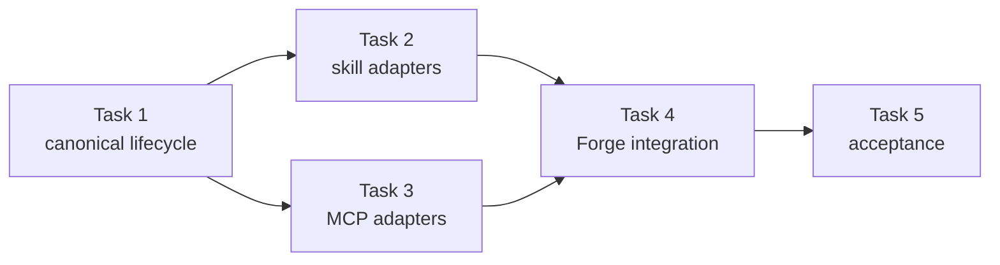
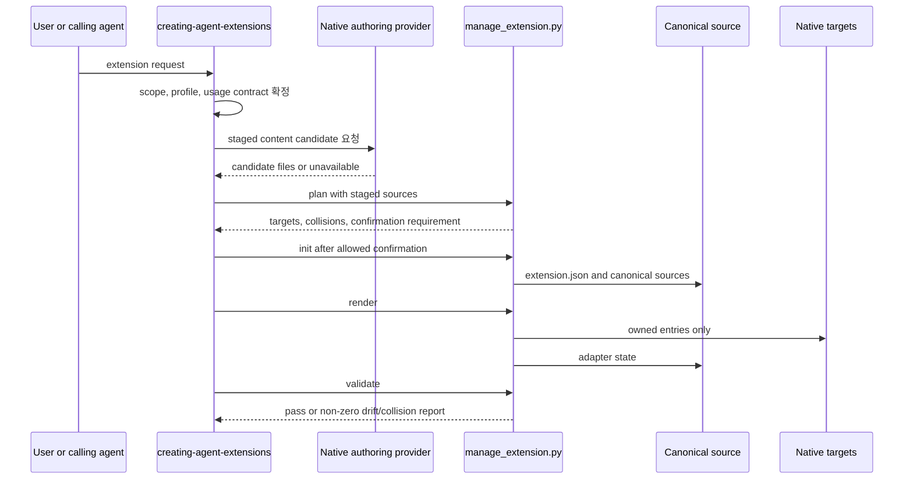

# 여러 에이전트용 extension 생성 구현 계획

> 이 계획은 the forge executing-plans skill로 Task별 검증과 checkpoint를 유지하며 실행한다.

Status: active

**Related Specs:**
- `docs/specs/005-agent-extension-creation/spec.md`: R1–R18 · AC1–AC13

**목표:** Forge에 `creating-agent-extensions`를 추가하여 하나의 `.agent-extensions/` 정본에서 Codex, Claude Code, Antigravity용 skill entry와 MCP configuration adapter를 안전하게 생성·갱신·검증한다.

**아키텍처:** Python 표준 라이브러리만 사용하는 deterministic manager가 canonical manifest와 source를 소유하고 `plan → init → render → validate` lifecycle을 제공한다. skill adapter는 canonical `SKILL.md`를 읽는 얇은 wrapper이며, MCP adapter는 canonical `mcp/servers.json`을 agent-native JSON 또는 소유권 marker가 있는 Codex TOML block으로 변환한다. Forge process skill은 현재 agent의 native authoring capability를 내용 provider로 우선 사용하되, provider가 없을 때 bundled reference를 사용하고 path·ownership·validation 결정은 manager에 남긴다.

**Tech Stack:** Markdown Agent Skills, Python 3 표준 라이브러리(`argparse`, `hashlib`, `json`, `pathlib`, `re`, `shutil`, `unittest`), Bash contract tests, JSON, TOML managed blocks

## Global Constraints

- 생성 결과의 canonical root는 repository에서 `<repo>/.agent-extensions/<extension-name>/`, user에서 `~/.agent-extensions/<extension-name>/`다.
- 첫 version의 profile은 `skill`, `mcp`, `bundle`이고 targets는 `codex`, `claude-code`, `antigravity`다.
- `extension.json`만 구조 정본이며 `adapters/<agent>/state.json`은 canonical hash, native target, owner와 rendered hash만 기록한다.
- user scope의 `init`과 `render`는 전체 preview 뒤 명시적 `--confirm-user-write`가 없으면 어떠한 file도 쓰지 않는다.
- skill frontmatter는 `name`과 `description`만 사용하고 name은 lowercase letter, digit, hyphen으로 된 64자 미만 값이어야 한다.
- MCP canonical source는 secret value를 저장하지 않고 `envVars`와 `headersFromEnv`에 environment variable name만 저장한다.
- 다른 source가 소유한 같은 skill 또는 MCP server name은 자동 overwrite하거나 adopt하지 않는다.
- JSON target은 관계없는 key와 value를 semantic하게 보존하고, Codex TOML target은 extension별 managed block 밖의 bytes를 그대로 보존한다.
- Marketplace entry, 배포 package, version bump, publish, remote push는 이 계획에 포함하지 않는다.
- 모든 implementation cycle은 RED → GREEN → REFACTOR 순서를 지키며 Task commit 전 fresh targeted verification을 수행한다.

## AC Coverage

| AC | Tasks |
|---|---|
| AC1 | 4 |
| AC2 | 1, 2 |
| AC3 | 1, 2 |
| AC4 | 1, 3 |
| AC5 | 1, 3 |
| AC6 | 1, 2, 3 |
| AC7 | 4, 5 |
| AC8 | 1, 3, 4 |
| AC9 | 2, 3 |
| AC10 | 2, 3 |
| AC11 | 1, 4 |
| AC12 | 4 |
| AC13 | 4, 5 |

## Routes

| Route | Tasks | 산출물 | Checkpoint |
|---|---:|---|---|
| Route 1 — Canonical lifecycle | 1 | write-free preview, canonical init, schema와 source validation | internal |
| Route 2 — Native adapters | 2–3 | thin skill entry, merge-safe MCP configuration, ownership drift 검사 | notify after Task 3 |
| Route 3 — Forge workflow | 4 | process skill, provider/fallback reference, router·catalog·runbook·validator integration | internal |
| Route 4 — Acceptance | 5 | live pressure test, AC1–AC13 fresh evidence, lifecycle status | notify final |



## Runtime Responsibility

| 주체 | 책임 |
|---|---|
| `creating-agent-extensions` process skill | scope와 profile 확정, concrete usage 수집, provider 탐색·staging, manager 호출, pressure-test orchestration |
| native authoring provider | staging boundary 안에서 canonical skill body, MCP definition, support resource와 server implementation 후보 작성 |
| `manage_extension.py` | name/schema/secret/path 검증, canonical copy, target 계산, collision·ownership·drift 판정, adapter render |
| canonical `extension.json`과 component files | agent-neutral 구조와 동작 source of truth |
| `adapters/<agent>/state.json` | 직전 render의 canonical hash, native target, owner, rendered entry hash |
| root agent | diff review, targeted/full verification, AC verdict와 spec status 변경 |
| fresh pressure-test agent | native provider 존재·부재와 deadline pressure scenario에서 workflow gate를 독립적으로 적용 |



## Extension Points

| Component | Canonical source | Codex | Claude Code | Antigravity |
|---|---|---|---|---|
| repository skill | `.agent-extensions/<extension>/skills/<skill>/SKILL.md` | `.agents/skills/<skill>/SKILL.md` | `.claude/skills/<skill>/SKILL.md` | `.agents/skills/<skill>/SKILL.md` 공유 |
| user skill | `~/.agent-extensions/<extension>/skills/<skill>/SKILL.md` | `~/.agents/skills/<skill>/SKILL.md` | `~/.claude/skills/<skill>/SKILL.md` | `~/.gemini/config/skills/<skill>/SKILL.md` |
| repository MCP | `.agent-extensions/<extension>/mcp/servers.json` | `.codex/config.toml` | `.mcp.json` | `.agents/mcp_config.json` |
| user MCP | `~/.agent-extensions/<extension>/mcp/servers.json` | `~/.codex/config.toml` | `~/.claude.json` | `~/.gemini/config/mcp_config.json` |
| agent-only hooks/rules/apps | `adapters/<agent>/` extension point | 지원 agent만 명시 | 지원 agent만 명시 | 지원 agent만 명시 |

### Task 1: canonical lifecycle manager와 manifest 계약 (R2, R3, R4, R5, R6, R7, R10, R13, R14, R15, R16 · AC2, AC3, AC4, AC5, AC6, AC8, AC11)

**Files:**
- 생성: `plugins/forge/skills/creating-agent-extensions/SKILL.md`
- 생성: `plugins/forge/skills/creating-agent-extensions/scripts/manage_extension.py`
- 생성: `plugins/forge/skills/creating-agent-extensions/references/layout-contract.md`
- 생성: `plugins/forge/skills/creating-agent-extensions/tests/test_manage_extension.py`
- 생성: `scripts/tests/test-agent-extension-skill.sh`

**Interfaces:**
- 입력: `plan|init --scope {repository,user} --base-dir PATH --name NAME --description TEXT --profile {skill,mcp,bundle} [--skill-source PATH] (repeatable) [--mcp-source PATH] [--confirm-user-write]`
- 출력: stdout JSON preview 또는 생성된 `<base-dir>/.agent-extensions/<name>/extension.json`; 실패 시 stderr의 `ERROR <code>: <detail>`과 non-zero exit
- Python API: `build_plan(args: argparse.Namespace) -> dict`, `initialize(plan: dict, confirmed: bool) -> pathlib.Path`, `load_manifest(extension_root: pathlib.Path) -> dict`, `canonical_digest(extension_root: pathlib.Path) -> str`

**Execution metadata:**
- Dependencies: none
- Write ownership: 위 Files 전체
- Parallel safety: sequential root — schema, CLI와 lifecycle tests가 같은 contract를 함께 정의함
- Approval gate: none — approved spec 안의 repository change이며 user-home writes는 test fixture 안에서만 수행함

- [x] **Step 1: 새 skill layout과 write-free plan 계약을 실패하는 test로 고정한다**

`scripts/tests/test-agent-extension-skill.sh`는 `SKILL.md`, manager, 두 reference/test path를 검사하고 `python3 -m unittest discover -s plugins/forge/skills/creating-agent-extensions/tests -p 'test_*.py' -v`를 실행한다. `test_manage_extension.py`에는 다음 cases를 먼저 추가한다.

| Test method | Fixture | 필수 assertion |
|---|---|---|
| `test_plan_is_write_free_and_lists_repository_targets` | repository base, one staged skill, one staged MCP source | stdout JSON에 canonical root와 5 native targets가 있고 base snapshot은 동일함 |
| `test_user_init_requires_confirmation_without_writes` | temporary HOME, valid bundle inputs | `E_CONFIRMATION`, non-zero exit, HOME snapshot 동일 |
| `test_init_copies_valid_skill_and_mcp_sources_into_manifest` | valid bundle inputs | relative component paths, three targets, copied bytes와 manifest schema 일치 |
| `test_init_rejects_invalid_name_placeholder_and_secret` | invalid names, 미완성 표식이 있는 skill, raw token이 있는 MCP source | 각 input이 non-zero이며 extension root가 생성되지 않음 |

각 fixture는 `tempfile.TemporaryDirectory()`를 base-dir로 사용하고 subprocess의 stdout JSON, return code, filesystem snapshot을 함께 assert한다. Valid skill source는 `name`과 `description`만 있는 frontmatter와 concrete instruction을 사용하며, valid MCP source는 stdio `envVars`와 HTTP `headersFromEnv`를 각각 포함한다.

- [x] **Step 2: layout test가 target skill 부재로 실패하는지 확인한다**

실행: `bash scripts/tests/test-agent-extension-skill.sh`

예상: `plugins/forge/skills/creating-agent-extensions/SKILL.md`가 없어 non-zero로 종료한다.

- [x] **Step 3: skill-creator initializer로 정확한 resource layout을 scaffold한다**

실행:

```bash
python3 /Users/han-byeol/.codex/skills/.system/skill-creator/scripts/init_skill.py \
  creating-agent-extensions \
  --path plugins/forge/skills \
  --resources scripts,references
```

생성된 `agents/openai.yaml`은 Forge shared-skill convention에 포함되지 않으므로 제거하고, scaffold의 미완성 문구는 이 Task의 implementation patch에서 모두 교체한다.

- [x] **Step 4: plan과 init의 최소 deterministic implementation을 작성한다**

manager는 `NAME_RE = re.compile(r"^[a-z0-9](?:[a-z0-9-]{0,61}[a-z0-9])?$")`를 사용하고, staged skill frontmatter를 정확히 `name`, `description` 두 key로 parse한다. `build_plan`은 다음 shape를 stdout에 반환한다.

```json
{
  "action": "plan",
  "scope": "repository",
  "profile": "bundle",
  "extensionRoot": "/tmp/repo/.agent-extensions/example-extension",
  "canonicalWrites": ["extension.json", "skills/example-skill/SKILL.md", "mcp/servers.json"],
  "nativeTargets": [
    ".agents/skills/example-skill/SKILL.md",
    ".claude/skills/example-skill/SKILL.md",
    ".codex/config.toml",
    ".mcp.json",
    ".agents/mcp_config.json"
  ],
  "collisions": [],
  "requiresConfirmation": false
}
```

`initialize`는 user scope에서 confirmation을 먼저 검사하고, destination이 이미 있으면 `E_EXTENSION_EXISTS`로 거부한 뒤 `schemaVersion: 1`, normalized name, description, scope, 세 targets, relative component paths를 가진 `extension.json`과 validated staged sources만 원자적으로 copy한다. profile별 source 조합이 다르면 `E_PROFILE_INPUT`으로 거부한다.

- [x] **Step 5: canonical lifecycle tests를 GREEN으로 만들고 refactor한다**

실행: `bash scripts/tests/test-agent-extension-skill.sh`

예상: 네 lifecycle cases가 PASS하고 script가 `agent extension skill: all checks passed`를 출력한다.

- [x] **Step 6: Task 1 변경을 fresh 검증하고 commit한다**

실행: `bash scripts/tests/test-agent-extension-skill.sh && bash scripts/validate.sh`

예상: 두 command가 exit 0이고 마지막 output이 각각 `agent extension skill: all checks passed`, `validate: all checks passed`다.

실행: `git add docs/specs/005-agent-extension-creation/spec.md docs/plans/003-agent-extension-creation/plan.md plugins/forge/skills/creating-agent-extensions scripts/tests/test-agent-extension-skill.sh && git commit -m "feat(forge): add agent extension lifecycle manager"`

### Task 2: thin skill entry와 ownership drift 검사 (R3, R7, R8, R9, R13, R14, R15, R16 · AC2, AC3, AC6, AC9, AC10)

**Files:**
- 수정: `plugins/forge/skills/creating-agent-extensions/scripts/manage_extension.py`
- 수정: `plugins/forge/skills/creating-agent-extensions/tests/test_manage_extension.py`
- 수정: `plugins/forge/skills/creating-agent-extensions/references/layout-contract.md`
- 수정: `docs/plans/003-agent-extension-creation/plan.md`

**Interfaces:**
- 입력: `render|validate --extension PATH [--confirm-user-write]`
- 출력: repository 또는 user native skill entries, `adapters/{codex,claude-code,antigravity}/state.json`, drift/collision diagnostics
- Python API: `skill_targets(manifest: dict, extension_root: Path) -> list[Target]`, `render_skill_wrapper(target: Target) -> str`, `render_extension(extension_root: Path, confirmed: bool) -> dict`, `validate_extension(extension_root: Path) -> list[str]`

**Execution metadata:**
- Dependencies: Task 1
- Write ownership: 위 Files 전체
- Parallel safety: sequential root — manager source와 single test module ownership이 Task 3과 겹침
- Approval gate: none

- [x] **Step 1: repository·user skill adapter와 collision·drift cases를 실패하는 test로 추가한다**

| Test method | Fixture | 필수 assertion |
|---|---|---|
| `test_repository_skill_render_uses_shared_agents_and_claude_wrappers` | repository skill profile | 두 physical wrappers, 세 agent state, 같은 canonical source |
| `test_user_skill_render_previews_three_targets_before_confirmation` | user skill profile | preview에 세 targets, confirmation 전 write 없음, 확인 뒤 세 wrappers |
| `test_skill_collision_never_overwrites_other_owner` | sentinel same-name wrapper | `E_COLLISION`, sentinel bytes 유지 |
| `test_validate_reports_skill_wrapper_and_canonical_drift` | wrapper mutation과 canonical mutation을 분리한 fixtures | 두 경우 각각 `E_DRIFT`, expected owner와 target 출력 |
| `test_bundle_tracks_two_skills_in_all_agent_states` | two skills plus one MCP source | 각 state에 두 skill ownership entries 존재 |

Repository wrapper는 canonical path를 repository-relative path로 가리키고 `.agents/skills/` target을 Codex와 Antigravity가 공유하는지 assert한다. User wrapper는 fixture HOME의 absolute canonical path를 가리키고 confirmation 전 snapshot이 동일한지 assert한다. Collision fixture는 sentinel content가 byte-for-byte 유지되는지도 검사한다.

- [x] **Step 2: 새 tests가 `render` action 또는 target functions 부재로 실패하는지 확인한다**

실행: `python3 -m unittest discover -s plugins/forge/skills/creating-agent-extensions/tests -p 'test_*.py' -v`

예상: 새 skill render cases가 expected target 부재 또는 unsupported action으로 FAIL한다.

- [x] **Step 3: thin wrapper와 state ownership implementation을 작성한다**

Wrapper는 canonical content를 복제하지 않고 다음 instruction shape만 사용한다.

```markdown
---
name: example-skill
description: 'Use when the canonical example skill applies.'
---

# Example Skill Adapter

Read `<canonical-path>` completely, then follow it as the source of truth.
If this adapter conflicts with the canonical skill, the canonical skill wins.
```

각 agent state는 `schemaVersion`, `extension`, `canonicalHash`, 그리고 `entries[]`의 `kind`, `name`, `target`, `owner`, `renderedHash`를 기록한다. 기존 state가 있으면 live wrapper hash가 직전 `renderedHash`와 같을 때만 canonical update를 render하며, 다르면 `E_DRIFT`로 중단한다. State가 없고 target이 존재하면 expected wrapper와 완전히 같은 경우만 shared `.agents/skills/` target으로 인정하고 나머지는 `E_COLLISION`으로 거부한다.

- [x] **Step 4: skill adapter suite를 GREEN으로 만들고 refactor한다**

실행: `bash scripts/tests/test-agent-extension-skill.sh`

예상: lifecycle과 다섯 skill adapter cases가 모두 PASS한다.

- [x] **Step 5: Task 2 변경을 fresh 검증하고 commit한다**

실행: `bash scripts/tests/test-agent-extension-skill.sh && bash scripts/validate.sh`

예상: 두 command exit 0.

실행: `git add docs/plans/003-agent-extension-creation/plan.md plugins/forge/skills/creating-agent-extensions && git commit -m "feat(forge): render portable skill adapters"`

### Task 3: merge-safe MCP adapter와 native parity (R3, R4, R6, R10, R11, R12, R13, R14, R15 · AC4, AC5, AC6, AC8, AC9, AC10)

**Files:**
- 수정: `plugins/forge/skills/creating-agent-extensions/scripts/manage_extension.py`
- 수정: `plugins/forge/skills/creating-agent-extensions/tests/test_manage_extension.py`
- 수정: `plugins/forge/skills/creating-agent-extensions/references/layout-contract.md`
- 수정: `docs/plans/003-agent-extension-creation/plan.md`

**Interfaces:**
- 입력: canonical `mcp/servers.json`의 `mcpServers.<name>` entries
- 출력: Codex `[mcp_servers.<name>]` TOML managed block, Claude Code와 Antigravity의 `mcpServers` JSON entries
- Python API: `validate_server(name: str, server: dict) -> None`, `to_codex_toml(name: str, server: dict) -> str`, `to_json_native(server: dict) -> dict`, `merge_toml(text: str, extension: str, entries: dict, state: dict | None) -> str`, `merge_json(document: dict, entries: dict, state: dict | None) -> dict`

**Execution metadata:**
- Dependencies: Task 1; Task 2의 state format
- Write ownership: 위 Files 전체
- Parallel safety: sequential root — Task 2와 manager/test files가 겹치고 state format을 소비함
- Approval gate: none

- [x] **Step 1: stdio·HTTP rendering, unrelated preservation, collision과 drift cases를 실패하는 test로 추가한다**

| Test method | Fixture | 필수 assertion |
|---|---|---|
| `test_repository_mcp_render_preserves_unrelated_json_and_toml` | unrelated JSON objects and TOML prefix/suffix | canonical server만 추가되고 unrelated semantic values와 TOML bytes 유지 |
| `test_user_mcp_render_requires_confirmation_and_preserves_settings` | temporary HOME configs | preview 뒤 확인 전 write 없음, 확인 뒤 세 native entries와 기존 settings 유지 |
| `test_mcp_collision_refuses_same_name_from_other_owner` | same-name native entries without state | `E_COLLISION`, 모든 target bytes 유지 |
| `test_validate_reports_json_and_toml_entry_drift` | owned JSON entry와 managed TOML block mutation | `E_DRIFT`, agent와 target 출력 |
| `test_stdio_env_vars_and_http_headers_from_env_never_embed_secret_values` | stdio and HTTP canonical definitions | native output은 environment variable reference만 포함하고 raw credential은 없음 |

Codex fixture는 managed block 밖의 original prefix와 suffix가 같은 bytes인지 검사한다. JSON fixtures는 render 전후 unrelated nested object를 deep-equal로 비교한다. Collision과 drift cases는 return code가 non-zero이고 sentinel entry가 유지되는지 검사한다.

- [x] **Step 2: 새 MCP tests가 native renderer 부재로 실패하는지 확인한다**

실행: `python3 -m unittest discover -s plugins/forge/skills/creating-agent-extensions/tests -p 'test_*.py' -v`

예상: MCP target 또는 merge function 부재로 새 cases가 FAIL한다.

- [x] **Step 3: canonical MCP schema와 agent-native 변환을 구현한다**

지원 schema는 다음 두 shape로 제한한다.

```json
{
  "mcpServers": {
    "local-tools": {
      "transport": "stdio",
      "command": "python3",
      "args": ["server.py"],
      "envVars": ["LOCAL_TOOLS_TOKEN"]
    },
    "remote-tools": {
      "transport": "http",
      "url": "https://example.test/mcp",
      "headersFromEnv": {"Authorization": "REMOTE_TOOLS_TOKEN"}
    }
  }
}
```

Codex는 stdio의 `command`, `args`, `env_vars`와 HTTP의 `url`, `env_http_headers`를 render한다. Claude Code와 Antigravity는 stdio의 `command`, `args`, `${ENV_NAME}` env mapping과 HTTP의 `type: "http"`, `url`, `${ENV_NAME}` headers를 render한다. Canonical `env`, raw `headers`, secret-like key/value, unsupported transport와 unknown field는 `E_MCP_SCHEMA` 또는 `E_SECRET`으로 거부한다.

- [x] **Step 4: merge ownership과 drift-safe update를 구현한다**

Codex block marker는 `# BEGIN creating-agent-extensions:<extension>`과 `# END creating-agent-extensions:<extension>`을 사용한다. Own block 밖의 same server table, state가 없는 same-name JSON entry, 또는 state hash와 다른 live entry는 쓰기 전에 거부한다. 성공한 render 뒤에만 세 agent state를 함께 갱신하며 실패 중간 결과가 남지 않도록 모든 output을 memory에서 계산한 후 atomic replace한다.

- [x] **Step 5: MCP suite를 GREEN으로 만들고 refactor한다**

실행: `bash scripts/tests/test-agent-extension-skill.sh`

예상: lifecycle, skill, MCP cases가 모두 PASS하고 credential fixture에 raw secret가 나타나지 않는다.

- [ ] **Step 6: Task 3 변경을 fresh 검증하고 commit한다**

실행: `bash scripts/tests/test-agent-extension-skill.sh && bash scripts/validate.sh`

예상: 두 command exit 0.

실행: `git add docs/plans/003-agent-extension-creation/plan.md plugins/forge/skills/creating-agent-extensions && git commit -m "feat(forge): render owned MCP adapters"`

### Task 4: Forge process skill과 repository integration (R1, R5, R6, R16, R17, R18 · AC1, AC7, AC8, AC11, AC12, AC13)

**Files:**
- 수정: `plugins/forge/skills/creating-agent-extensions/SKILL.md`
- 생성: `plugins/forge/skills/creating-agent-extensions/references/authoring-providers.md`
- 수정: `plugins/forge/skills/using-forge/SKILL.md`
- 수정: `README.md`
- 수정: `.agent-runbooks/maintaining-forge/README.md`
- 수정: `.agent-runbooks/maintaining-forge/references/portability-rules.md`
- 수정: `plugins/forge/.claude-plugin/plugin.json`
- 수정: `plugins/forge/.codex-plugin/plugin.json`
- 수정: `scripts/validate.sh`
- 수정: `scripts/tests/test-agent-extension-skill.sh`
- 수정: `scripts/tests/test-forge-artifact-contract.sh`
- 수정: `docs/plans/003-agent-extension-creation/plan.md`

**Interfaces:**
- 입력: 여러 agent에서 쓸 skill, MCP 또는 bundle 생성 요청
- 출력: provider 탐색과 fallback을 포함한 9-stage workflow, manager commands, completion gate, Forge router/catalog entry
- Provider contract: `staging input → canonical content candidate + support files + self-review`; provider는 final path, adapter, merge, collision, validation verdict를 소유하지 않음

**Execution metadata:**
- Dependencies: Tasks 1–3
- Write ownership: 위 Files 전체
- Parallel safety: sequential root — process wording과 repository contract assertions를 함께 맞춰야 함
- Approval gate: none; manifest version과 remote release는 변경하지 않음

- [ ] **Step 1: routing, provider/fallback, scope gate와 three-agent documentation assertions를 먼저 추가한다**

`test-agent-extension-skill.sh`와 `test-forge-artifact-contract.sh`는 다음을 검사한다.

```text
using-forge routes cross-agent skill/MCP/bundle requests to creating-agent-extensions
creating-agent-extensions names plan, init, render, validate and --confirm-user-write
authoring-providers.md defines native provider discovery, staging boundary and bundled fallback
README catalog includes creating-agent-extensions and says 13 user-execution skills
maintaining-forge runbook and portability reference name Codex, Claude Code, Antigravity
layout-contract.md contains all repository and user skill/MCP target paths
scripts/validate.sh invokes manage_extension.py --help as a mechanical manager gate
```

- [ ] **Step 2: contract tests가 새 process wording과 integration 부재로 실패하는지 확인한다**

실행: `bash scripts/tests/test-agent-extension-skill.sh && bash scripts/tests/test-forge-artifact-contract.sh`

예상: 첫 번째 missing routing 또는 provider assertion에서 non-zero로 종료한다.

- [ ] **Step 3: distributed process skill을 500 lines 이내로 완성한다**

`SKILL.md`는 announce line, Iron Law, When to Use/When NOT, numbered checklist 기반 Process, Working Files, 최소 5-row Red Flags와 Handoff를 포함한다. Process 순서는 scope/profile 확정 → concrete usage와 transport 확정 → native provider 탐색 → staging/fallback authoring → `plan` preview → user confirmation gate → `init` → `render` → `validate` → pressure test다. Provider가 native path를 직접 쓰거나 platform-only frontmatter, raw credential, 미완성 표식, 범위 밖 component를 제안하면 canonical commit 전에 정규화 또는 거부한다.

- [ ] **Step 4: provider와 layout reference를 완성한다**

`authoring-providers.md`는 capability-based discovery를 사용하고 `skill-creator`, agent-native MCP helper 같은 이름은 example일 뿐 의존성이 아님을 명시한다. `layout-contract.md`는 `extension.json` schema, wrapper shape, canonical MCP schema, target matrix, ownership state와 error codes `E_CONFIRMATION`, `E_COLLISION`, `E_DRIFT`, `E_PROFILE_INPUT`, `E_MCP_SCHEMA`, `E_SECRET`를 manager tests와 동일하게 정의한다.

- [ ] **Step 5: router, catalog, maintainer docs, manifests와 validator를 동기화한다**

`using-forge` routing table에 cross-agent extension row를 추가한다. README와 maintainer system map의 catalog count를 13으로 바꾸고 새 skill responsibility를 추가한다. Portability reference는 `.agent-extensions/` authoring pattern과 세 agent target matrix를 설명하되 기존 repository-only `.agent-runbooks/` pattern과 혼동하지 않는다. 두 plugin manifest description에는 cross-agent skill/MCP authoring capability를 추가하되 version은 유지한다. Validator는 manager의 `--help`가 exit 0인지 검사한다.

- [ ] **Step 6: integration tests를 GREEN으로 만들고 전체 shell tests를 실행한다**

실행:

```bash
bash scripts/tests/test-agent-extension-skill.sh
for test_file in scripts/tests/*.sh; do bash "$test_file"; done
bash scripts/validate.sh
```

예상: 모든 command exit 0, extension test는 `agent extension skill: all checks passed`, 최종 validator는 `validate: all checks passed`를 출력한다.

- [ ] **Step 7: Task 4 변경을 fresh 검증하고 commit한다**

실행: `git diff --check && bash scripts/tests/test-agent-extension-skill.sh && bash scripts/validate.sh`

예상: whitespace error가 없고 두 validation command exit 0.

실행: `git add README.md .agent-runbooks plugins/forge scripts docs/plans/003-agent-extension-creation/plan.md && git commit -m "docs(forge): integrate cross-agent extension workflow"`

### Task 5: live pressure test와 acceptance verification (R1, R2, R3, R4, R5, R6, R7, R8, R9, R10, R11, R12, R13, R14, R15, R16, R17, R18 · AC1, AC2, AC3, AC4, AC5, AC6, AC7, AC8, AC9, AC10, AC11, AC12, AC13)

**Files:**
- 수정: `docs/plans/003-agent-extension-creation/plan.md`
- 수정: `docs/specs/005-agent-extension-creation/spec.md`
- 조건부 수정: live pressure test가 발견한 governing skill/reference/test file

**Interfaces:**
- 입력: 완료된 skill, manager, approved spec AC1–AC13, clean temporary repository와 HOME fixtures
- 출력: fresh-agent behavior verdict, root-owned full verification evidence, `Status: implemented` 또는 구체적 FAIL

**Execution metadata:**
- Dependencies: Tasks 1–4
- Write ownership: plan progress와 verification 뒤 spec status; pressure-test defect가 있으면 해당 file을 root가 수정하고 targeted RED/GREEN을 반복함
- Parallel safety: fresh agent는 read-only scenario evaluation만 수행하고 root가 모든 file write와 verification을 소유함
- Approval gate: none for local verification; release/push는 scope 밖이며 별도 사용자 권한 없이는 수행하지 않음

- [ ] **Step 1: provider가 있는 deadline-pressure scenario를 fresh agent에 제시한다**

Scenario는 이미 작성된 native authoring provider가 canonical candidate뿐 아니라 `.claude/skills/`와 `.mcp.json`도 직접 수정했고, 사용자가 시간이 없으니 그대로 완료하라고 요구하는 상황이다. PASS는 agent가 native writes를 staging 밖 변경으로 거부하고 manager의 preview·ownership·validation을 다시 적용하는 것이다.

- [ ] **Step 2: provider가 없는 user-scope scenario를 fresh agent에 제시한다**

Scenario는 native authoring helper가 없고 user HOME에 기존 same-name MCP entry와 unrelated settings가 있으며 즉시 overwrite 압력이 있는 상황이다. PASS는 bundled fallback을 선택하되 confirmation 전 write를 하지 않고 same-name collision을 자동 overwrite하지 않는 것이다.

- [ ] **Step 3: pressure-test verdict를 root가 검토하고 loophole이 있으면 test-first로 보완한다**

Agent의 reasoning이 gate를 우회하면 해당 rationalization을 governing Red Flags에 대응 문구로 추가하기 전에 재현 contract test를 RED로 만들고, 최소 wording change 뒤 동일 scenario를 다시 실행한다. Root는 agent report만으로 PASS를 선언하지 않고 diff와 fresh test를 직접 확인한다.

- [ ] **Step 4: AC1–AC13을 clean fixtures에서 순서대로 fresh 검증한다**

실행:

```bash
git diff --check
bash scripts/tests/test-agent-extension-skill.sh
for test_file in scripts/tests/*.sh; do bash "$test_file"; done
bash scripts/validate.sh
```

추가로 manager test suite의 named cases를 AC2–AC10 evidence로 매핑하고, pressure-test 두 scenarios를 AC7·AC8·AC11·AC12 evidence로 기록한다. 어떤 AC도 code reading만으로 PASS 처리하지 않는다.

- [ ] **Step 5: 모든 AC가 PASS일 때만 lifecycle status와 progress를 갱신한다**

`docs/specs/005-agent-extension-creation/spec.md`의 `Status:`를 `implemented`로 바꾸고, 이 plan의 `Status:`를 `complete`로 바꾸며 Progress History에 Task별 route, mode, commit, verification과 pressure-test verdict를 기록한다. 하나라도 FAIL이면 status를 유지하고 code bug는 the forge systematic-debugging skill, spec bug는 the forge writing-specs skill change mode로 보낸다.

- [ ] **Step 6: status-only 변경을 검증하고 commit한다**

실행: `git diff --check && bash scripts/validate.sh && git status --short`

예상: validator exit 0이고 status에는 의도한 spec·plan 변경만 남는다.

실행: `git add docs/specs/005-agent-extension-creation/spec.md docs/plans/003-agent-extension-creation/plan.md && git commit -m "docs(forge): record agent extension verification"`

## Progress History

- 2026-07-14: plan created; approved spec R1–R18 and AC1–AC13 mapped to five sequential implementation and verification Tasks. No release or push authority assumed.
- 2026-07-14: Task 1 routed (impact=high, uncertainty=medium, context_coupling=high, verification_clarity=strong, tier=frontier, mode=root, parallel_group=none, reason="manager CLI, schema, and lifecycle tests define one tightly coupled source-of-truth contract").
- 2026-07-14: Task 1 RED confirmed first at missing `creating-agent-extensions/SKILL.md`, then at absent plan/init behavior; GREEN confirmed for four canonical lifecycle cases.
- 2026-07-14: Task 1 complete (commit `172c07d`; verification="4 manager tests passed; extension contract passed; Forge validator passed"). A generated Python cache was traced to missing root ignore rules; a RED ignore regression contract now prevents recurrence.
- 2026-07-14: Python cache regression guard complete (commit `6f8a4f7`; root cause="unit tests generated an unignored cache inside a directory-level stage boundary").
- 2026-07-14: Task 2 routed (impact=high, uncertainty=medium, context_coupling=high, verification_clarity=strong, tier=frontier, mode=root, parallel_group=none, reason="skill target calculation, wrappers, ownership state, and drift validation share one manager transaction").
- 2026-07-14: Task 2 RED confirmed at unsupported `render`; GREEN confirmed for repository/user wrappers, confirmation preview, collision refusal, wrapper/canonical drift, and multiple-skill ownership across three agents.
- 2026-07-14: Task 2 complete (commit `9d35902`; verification="9 manager tests passed; extension contract passed; Forge validator passed").
- 2026-07-14: Task 3 routed (impact=high, uncertainty=high, context_coupling=high, verification_clarity=strong, tier=frontier, mode=root, parallel_group=none, reason="three native MCP formats must share collision, ownership, and drift semantics without rewriting unrelated configuration").
- 2026-07-14: Task 3 RED confirmed at unsupported MCP render and overly broad native-file collision detection; GREEN confirmed for stdio/HTTP conversion, unrelated-config preservation, user preview metadata, collision refusal, JSON/TOML drift, credential references, and bundle ownership.
