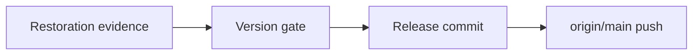

# Project Handbook 탐색 UI 보완 릴리즈 계획

> forge executing-plans skill로 기존 Project Handbook 탐색 보완을 재검증하고 Forge `0.1.14`로 배포한다.

Status: complete

**Related Specs:**
- bundle: docs/specs/review-viewer-lifecycle/

**목표:** 좌측 tree를 실제 disclosure control로 접고 펼칠 수 있게 하고, 좌우 panel의 scrollbar와 경계를 하나의 작업 화면처럼 정돈한 보완판을 안전하게 릴리즈한다.

**완료 상태:** renderer unit·desktop 1440px·mobile 390px browser·install·repository validation이 통과하고 Claude `0.1.14`와 같은 base의 Codex derived version이 `origin/main`에 push된다.

**아키텍처:** Project Map·Canonical Spec·Semantic IR과 route 계산은 유지한다. 공통 shell의 tree control markup·state synchronization·responsive CSS만 보완하고 renderer regression test로 계약을 고정한다.

**기술 스택:** Python 3 표준 라이브러리, 정적 HTML·CSS·JavaScript, Node.js Playwright, Bash validation, Forge `forge/spec@3`

## Global Constraints

- Project Map과 Canonical Spec의 statement, identifier, Mermaid bytes와 provenance를 변경하지 않는다.
- disclosure control과 treeitem selection을 분리하고 `aria-expanded`를 실제 표시 상태와 동기화한다.
- desktop에서는 panel 자체가 아니라 각 panel의 content 영역만 scroll하며 scrollbar를 경계선 쪽에 정렬한다.
- mobile에서는 문서 전체 scroll을 사용하고 panel 내부 scroll을 만들지 않는다.
- 독립 spec·plan·brief profile을 회귀시키지 않는다.
- upstream base와 동일하거나 낮은 version은 release하지 않는다.
- 사용자가 이 요청에서 Forge `main` push와 release를 명시 승인했다.

## Statement Coverage

| Statement | Kind | Task |
|---|---|---:|
| [Project Handbook의 좌측 탐색은 Spec bundle·member·section과 Structure entry를 의미 기반 계층 node로 표시하고 검색, 현재 선택 상태, deep link와 표준 tree keyboard interaction을 지원해야 한다.](../../specs/review-viewer-lifecycle/project-handbook-and-structure.md#project-handbook의-좌측-탐색은-spec-bundlemembersection과-structure-entry를-의미-기반-계층-node로-표시하고-검색-현재-선택-상태-deep-link와-표준-tree-keyboard-interaction을-지원해야-한다) | Requirement | 1 |
| [Project Handbook은 desktop working width에서 좌측 탐색과 우측 상세를 side-by-side로 유지하고 narrow viewport에서는 탐색과 상세을 한 화면씩 표시하며 상세에서 탐색으로 돌아가는 명시적 action을 제공해야 한다.](../../specs/review-viewer-lifecycle/project-handbook-and-structure.md#project-handbook은-desktop-working-width에서-좌측-탐색과-우측-상세를-side-by-side로-유지하고-narrow-viewport에서는-탐색과-상세을-한-화면씩-표시하며-상세에서-탐색으로-돌아가는-명시적-action을-제공해야-한다) | Requirement | 1 |
| [공통 provenance와 reading-route 구현을 검증하면 desktop 1440px와 mobile 390px의 tab, 표, diagram, deep link와 checkbox가 동작하고 이후 개별 `view.html` 생성에는 post-build checker나 browser 검증이 추가되지 않는다.](../../specs/review-viewer-lifecycle/human-readable-review-viewer.md#공통-provenance와-reading-route-구현을-검증하면-desktop-1440px와-mobile-390px의-tab-표-diagram-deep-link와-checkbox가-동작하고-이후-개별-viewhtml-생성에는-post-build-checker나-browser-검증이-추가되지-않는다) | Acceptance | 1, 2 |
| [fixed timestamp를 사용한 동일 source·View Context·Presentation Plan 재build diff는 0이고, shell·component·profile·planner 변경은 desktop 1440px와 mobile 390px의 profile별 typical·empty·long·invalid diagram, keyboard, disclosure, overflow와 stable shell geometry 검증을 통과한다.](../../specs/review-viewer-lifecycle/human-readable-review-viewer.md#fixed-timestamp를-사용한-동일-sourceview-contextpresentation-plan-재build-diff는-0이고-shellcomponentprofileplanner-변경은-desktop-1440px와-mobile-390px의-profile별-typicalemptylonginvalid-diagram-keyboard-disclosure-overflow와-stable-shell-geometry-검증을-통과한다) | Acceptance | 1, 2 |

## 실행 Route

| Route | Task | 산출물 | Checkpoint |
|---|---:|---|---|
| Route 1 — Restoration evidence | 1 | disclosure·scroll regression과 full validation 증거 | internal |
| Route 2 — Versioned release | 2 | `0.1.14` manifest와 `origin/main` push | release |

## Runtime 책임

| 주체 | 책임 |
|---|---|
| Python renderer | parent node에 독립 disclosure button과 선택 route를 생성 |
| Browser runtime | disclosure, `aria-expanded`, selection, keyboard와 hash state 동기화 |
| CSS shell | desktop panel scroll과 mobile document scroll 배치 |
| Tests | desktop·mobile state와 generated markup contract 검증 |

### Task 1: 보완 구현과 회귀 증거를 고정한다

**Governing statements:**
- [Project Handbook의 좌측 탐색은 Spec bundle·member·section과 Structure entry를 의미 기반 계층 node로 표시하고 검색, 현재 선택 상태, deep link와 표준 tree keyboard interaction을 지원해야 한다.](../../specs/review-viewer-lifecycle/project-handbook-and-structure.md#project-handbook의-좌측-탐색은-spec-bundlemembersection과-structure-entry를-의미-기반-계층-node로-표시하고-검색-현재-선택-상태-deep-link와-표준-tree-keyboard-interaction을-지원해야-한다)
- [Project Handbook은 desktop working width에서 좌측 탐색과 우측 상세를 side-by-side로 유지하고 narrow viewport에서는 탐색과 상세을 한 화면씩 표시하며 상세에서 탐색으로 돌아가는 명시적 action을 제공해야 한다.](../../specs/review-viewer-lifecycle/project-handbook-and-structure.md#project-handbook은-desktop-working-width에서-좌측-탐색과-우측-상세를-side-by-side로-유지하고-narrow-viewport에서는-탐색과-상세을-한-화면씩-표시하며-상세에서-탐색으로-돌아가는-명시적-action을-제공해야-한다)

**파일:** 수정 `plugins/forge/skills/visual-docs/assets/viewer-template.html`, `plugins/forge/skills/visual-docs/scripts/review_components.py`, `plugins/forge/skills/visual-docs/tests/test_review_renderer.py`, `plugins/forge/skills/visual-docs/tests/browser/visual-docs.spec.mjs`.

**Interfaces:** `.project-tree-toggle`, `aria-expanded`, `.project-nav-scroll`, `.project-detail-scroll`, `@media (max-width: 820px)`.

**실행 metadata:** 이전 RED evidence와 구현 diff를 입력으로 사용; shared shell·project renderer 소유; approval gate 없음.

- [x] **Step 1: unit test에서 disclosure button·초기 compact tree·desktop과 mobile scroll contract를 확인한다.**
- [x] **Step 2: desktop 1440px과 mobile 390px browser suite에서 click·keyboard·deep link·overflow를 확인한다.**
- [x] **Step 3: Python 전체 test, build·freshness, install fixture와 `bash scripts/validate.sh`를 통과시킨다.**
- [x] **Step 4: 구현·테스트·계획을 `fix(forge): repair project handbook navigation controls`로 commit한다.**

### Task 2: Forge `0.1.14`를 release한다

**Governing statements:**
- [공통 provenance와 reading-route 구현을 검증하면 desktop 1440px와 mobile 390px의 tab, 표, diagram, deep link와 checkbox가 동작하고 이후 개별 `view.html` 생성에는 post-build checker나 browser 검증이 추가되지 않는다.](../../specs/review-viewer-lifecycle/human-readable-review-viewer.md#공통-provenance와-reading-route-구현을-검증하면-desktop-1440px와-mobile-390px의-tab-표-diagram-deep-link와-checkbox가-동작하고-이후-개별-viewhtml-생성에는-post-build-checker나-browser-검증이-추가되지-않는다)

**파일:** 수정 `plugins/forge/.claude-plugin/plugin.json`, `plugins/forge/.codex-plugin/plugin.json`; plan progress.

**Interfaces:** Claude base `0.1.14`, Codex `0.1.14+codex.<UTC timestamp>`, `origin/main`.

**실행 metadata:** Task 1 의존; manifest·release 소유; user approval 획득.

- [x] **Step 1: `origin/main`을 fetch하고 local base가 upstream보다 큰지 확인한다.**
- [x] **Step 2: 두 manifest version을 올리고 전체 validation을 다시 실행한다.**
- [x] **Step 3: `chore(forge): release 0.1.14` commit을 만들고 outgoing commits와 파일 범위를 검토한다.**
- [x] **Step 4: `main`을 `origin/main`에 push하고 remote HEAD 일치와 clean worktree를 확인한다.**

## Verification Matrix

| 범위 | 명령 | 성공 조건 |
|---|---|---|
| Canonical | `bash plugins/forge/skills/writing-specs/scripts/spec-docs.sh inspect --spec docs/specs/review-viewer-lifecycle --format json` | approved, diagnostics 0 |
| Python | `python3 -m unittest discover -s plugins/forge/skills/visual-docs/tests -p 'test_*.py'` | 44 tests PASS |
| Browser | `bash plugins/forge/skills/visual-docs/tests/run-visual-docs-browser.sh` | desktop·mobile 6 scenarios PASS |
| Build·freshness | `bash plugins/forge/skills/visual-docs/tests/test-build-visual-docs.sh` | build·check PASS |
| Install | `bash scripts/tests/test-forge-visual-docs-install.sh` | fixture PASS |
| Repository | `bash scripts/validate.sh` | validators PASS |
| Release | `git rev-parse HEAD origin/main` | SHA 일치, clean worktree |

## Progress History

- 2026-08-10: 사용자 feedback의 collapse·scroll 문제를 shared shell과 project renderer 수준의 restoration으로 분류했다.
- 2026-08-10: unit·browser RED를 먼저 확인하고 disclosure control, compact default tree, aligned scrollbar와 mobile document scroll을 구현했다.
- 2026-08-10: Canonical bundle inspect에서 `forge/spec@3`, `approved`, diagnostics 0, bundle SHA `87f599407d84af4fe8fbc5b1a17b7f683efdbe461e9137c8fe583d6554262b0e`를 확인했다.
- 2026-08-10: Python 44 tests, desktop·mobile Playwright 6 scenarios, build·freshness와 install fixture가 통과했다.
- 2026-08-10: 구현을 `a4ba0df`로 commit하고 upstream `0.1.13`보다 큰 Claude `0.1.14`, Codex `0.1.14+codex.20260810023652`를 설정했다.
- 2026-08-10: version 변경 뒤 `scripts/validate.sh`를 다시 통과하고 release commit과 `origin/main` push를 승인된 경계에서 실행했다.
