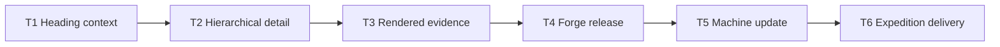
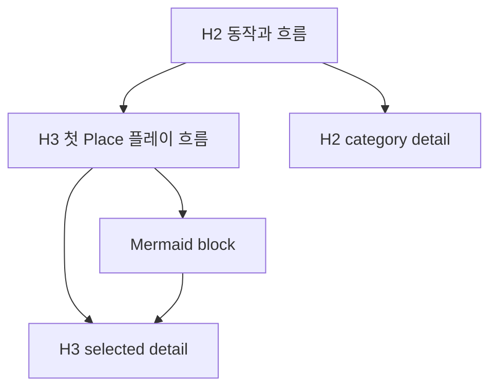
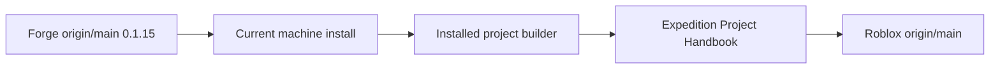

# Project Handbook heading 계층 복원과 배포 계획

> forge executing-plans skill로 Task별 RED → GREEN → checkpoint 순서로 실행하고, Forge release·현재 머신 설치·Expedition Project Handbook 갱신을 의존 순서대로 완료한다.

Status: active

**Related Specs:**
- bundle: docs/specs/review-viewer-lifecycle/

**목표:** H3 아래의 Mermaid·표·본문을 가장 가까운 heading 상세에 연결하고 H2→H3 계층을 Project Handbook tree에 보존한 뒤 Forge `0.1.15`, 현재 머신 설치와 Expedition tracked viewer를 모두 최신 상태로 만든다.

**완료 상태:** heading context regression이 RED→GREEN을 통과하고 desktop 1440px·mobile 390px browser suite와 Forge 전체 validation이 성공하며, Forge와 Roblox 두 repository의 `main`이 remote와 일치하고 현재 머신의 Codex·Claude Forge copy가 `0.1.15` source와 동일하다.

**아키텍처:** `SemanticBlock`이 nearest heading 하나뿐 아니라 source의 H2 이하 `heading_path`를 보존한다. Project renderer는 Requirement·Acceptance heading을 기존 집계 section으로 유지하고, 일반 source block은 `heading_path`를 사용해 H2 category와 H3 detail을 구성한다. Release source를 먼저 push하고 로컬 설치를 갱신한 뒤 동일 builder로 Expedition viewer를 재생성한다.

**기술 스택:** Python 3 표준 라이브러리, 정적 HTML·CSS·JavaScript, Node.js Playwright, Bash validation, Forge `forge/spec@3`, GitHub `main`

## Global Constraints

- Canonical Spec·Project Map·source Mermaid bytes와 full Requirement·Acceptance heading을 변경하지 않는다.
- selected source의 모든 block은 Semantic IR에 정확히 한 번 남고 `heading_path`는 source heading 순서에서만 계산한다.
- Requirement와 Acceptance Criteria의 full-statement H3는 개별 tree item으로 확장하지 않고 기존 `필수 사항`·`완료 기준` section에 유지한다.
- 일반 H2는 category, 일반 H3는 그 하위 detail로 표시하고 각 content block은 nearest heading detail에만 나타난다.
- H2 category detail은 direct content와 source-derived child link만 표시하며 descendant Mermaid를 한 화면에 몰아넣지 않는다.
- desktop 좌우 panel, mobile 목록/상세 전환, disclosure, search, keyboard, deep link와 overflow geometry를 유지한다.
- Forge push가 성공한 뒤에만 현재 머신 설치와 Expedition viewer를 갱신한다.
- Expedition source Markdown과 gameplay code는 수정하지 않고 generated `docs/project-viewer/index.html`만 갱신한다.
- 사용자가 Forge와 Expedition `main` push 및 현재 머신 업데이트를 이 요청에서 명시 승인했다.

## Statement Coverage

| Statement | Kind | Task |
|---|---|---:|
| [Semantic IR은 bundle·member metadata, source별 outline, 원문 순서의 prose·table·code·Mermaid block, full-statement Requirement·Acceptance Criterion, Task·Step·decision·interface entity, explicit relation과 provenance를 표현해야 한다.](../../specs/review-viewer-lifecycle/source-selection-and-freshness.md#semantic-ir은-bundlemember-metadata-source별-outline-원문-순서의-prosetablecodemermaid-block-full-statement-requirementacceptance-criteriontaskstepdecisioninterface-entity-explicit-relation과-provenance를-표현해야-한다) | Requirement | 1 |
| [Parser는 selected bundle의 모든 member block을 Semantic IR에 정확히 한 번 보존하고 각 entity와 relation을 bundle path·member path·internal namespace·line anchor에 연결해야 하며, 인식하지 못한 Markdown도 generic block으로 보존해야 한다.](../../specs/review-viewer-lifecycle/source-selection-and-freshness.md#parser는-selected-bundle의-모든-member-block을-semantic-ir에-정확히-한-번-보존하고-각-entity와-relation을-bundle-pathmember-pathinternal-namespaceline-anchor에-연결해야-하며-인식하지-못한-markdown도-generic-block으로-보존해야-한다) | Requirement | 1 |
| [Project Handbook의 좌측 탐색은 Spec bundle·member·section과 Structure entry를 의미 기반 계층 node로 표시하고 검색, 현재 선택 상태, deep link와 표준 tree keyboard interaction을 지원해야 한다.](../../specs/review-viewer-lifecycle/project-handbook-and-structure.md#project-handbook의-좌측-탐색은-spec-bundlemembersection과-structure-entry를-의미-기반-계층-node로-표시하고-검색-현재-선택-상태-deep-link와-표준-tree-keyboard-interaction을-지원해야-한다) | Requirement | 2, 3 |
| [Project Handbook은 하나의 `Complete Spec details` disclosure 없이 선언된 모든 Spec의 전체 내용을 좌측 탐색과 선택형 우측 상세에서 탐색할 수 있어야 하며 Overview와 Structure에 Requirement·Acceptance Criteria 본문을 복제하지 않아야 한다.](../../specs/review-viewer-lifecycle/project-handbook-and-structure.md#project-handbook은-하나의-complete-spec-details-disclosure-없이-선언된-모든-spec의-전체-내용을-좌측-탐색과-선택형-우측-상세에서-탐색할-수-있어야-하며-overview와-structure에-requirementacceptance-criteria-본문을-복제하지-않아야-한다) | Requirement | 2, 3 |
| [같은 Spec Bundle을 Project Handbook의 설계 기준 상세와 독립 spec kind로 build하면 member path, full Requirement·Acceptance heading, Mermaid SHA-256과 provenance가 일치하고 Project Handbook 개요에는 해당 statement 본문이 중복되지 않는다.](../../specs/review-viewer-lifecycle/project-handbook-and-structure.md#같은-spec-bundle을-project-handbook의-설계-기준-상세와-독립-spec-kind로-build하면-member-path-full-requirementacceptance-heading-mermaid-sha-256과-provenance가-일치하고-project-handbook-개요에는-해당-statement-본문이-중복되지-않는다) | Acceptance | 2, 3 |
| [공통 renderer의 provenance와 reading-route 변경은 desktop 1440px와 mobile 390px 및 관련 Acceptance Criterion을 검증하되 개별 `view.html` 생성에 post-build 검증을 다시 도입하지 않아야 한다.](../../specs/review-viewer-lifecycle/adaptive-presentation-and-navigation.md#공통-renderer의-provenance와-reading-route-변경은-desktop-1440px와-mobile-390px-및-관련-acceptance-criterion을-검증하되-개별-viewhtml-생성에-post-build-검증을-다시-도입하지-않아야-한다) | Requirement | 3 |
| [fixed timestamp를 사용한 동일 source·View Context·Presentation Plan 재build diff는 0이고, shell·component·profile·planner 변경은 desktop 1440px와 mobile 390px의 profile별 typical·empty·long·invalid diagram, keyboard, disclosure, overflow와 stable shell geometry 검증을 통과한다.](../../specs/review-viewer-lifecycle/adaptive-presentation-and-navigation.md#fixed-timestamp를-사용한-동일-sourceview-contextpresentation-plan-재build-diff는-0이고-shellcomponentprofileplanner-변경은-desktop-1440px와-mobile-390px의-profile별-typicalemptylonginvalid-diagram-keyboard-disclosure-overflow와-stable-shell-geometry-검증을-통과한다) | Acceptance | 3 |
| [Tracked Project Handbook을 생성하거나 갱신할 때는 deterministic build, freshness `--check`와 repository validation을 수행해야 한다.](../../specs/review-viewer-lifecycle/human-readable-review-viewer.md#tracked-project-handbook을-생성하거나-갱신할-때는-deterministic-build-freshness-check와-repository-validation을-수행해야-한다) | Requirement | 6 |
| [valid `forge/project-map@1`, 존재하는 Structure path와 approved 또는 implemented Spec Bundle을 가진 fixture를 `project` kind로 build하면 `docs/project-viewer/index.html`이 생성되고 개요, 설계 기준, 프로젝트 구조의 좌측 탐색과 선택한 우측 상세가 나타나며 freshness check와 repository validation이 통과한다.](../../specs/review-viewer-lifecycle/human-readable-review-viewer.md#valid-forgeproject-map1-존재하는-structure-path와-approved-또는-implemented-spec-bundle을-가진-fixture를-project-kind로-build하면-docsproject-viewerindexhtml이-생성되고-개요-설계-기준-프로젝트-구조의-좌측-탐색과-선택한-우측-상세가-나타나며-freshness-check와-repository-validation이-통과한다) | Acceptance | 6 |

## 실행 Route

| Route | Task | 산출물 | Checkpoint |
|---|---:|---|---|
| Route 1 — Heading context | 1 | source-qualified `heading_path`와 parser regression | internal |
| Route 2 — Hierarchical detail | 2 | H2 category→H3 detail tree와 정확한 content ownership | notify |
| Route 3 — Rendered evidence | 3 | desktop·mobile·determinism·full validation 증거 | internal |
| Route 4 — Forge release | 4 | Forge `0.1.15`와 `origin/main` push | release |
| Route 5 — Machine update | 5 | 현재 머신 Codex·Claude 설치 hash parity | internal |
| Route 6 — Expedition delivery | 6 | 최신 tracked Project Handbook과 Roblox `origin/main` push | final |

## 어떤 순서로 완료되는가?

확인할 것: parser 복원부터 downstream viewer push까지 선행 증거 없이 다음 단계로 넘어가지 않는다.

읽는 법: 화살표는 다음 Task가 소비하는 검증된 산출물을 뜻한다. Source: Plan source.

| 순서 | 입력 | 출력 |
|---:|---|---|
| 1 | Markdown headings | `heading_path` |
| 2 | `heading_path` | 계층 tree·detail |
| 3 | renderer | 검증 증거 |
| 4 | 증거 | Forge release |
| 5 | release source | 현재 머신 설치 |
| 6 | installed builder | Expedition viewer |

## content 소속은 어디에서 결정되는가?

확인할 것: source hierarchy는 IR에서 보존하고 renderer는 이를 표시만 한다.

읽는 법: content는 nearest heading path를 따라 하나의 detail에 들어가고 H2는 H3 child를 소유한다. Source: Spec source + Plan source.

| 주체 | 책임 |
|---|---|
| Markdown parser | H2 이하 heading stack과 block의 `heading_path` 계산 |
| Semantic IR | source 순서·bytes·path·line anchor 보존 |
| Project renderer | Requirement·Acceptance special grouping, 일반 section hierarchy와 detail 생성 |
| Browser runtime | 기존 disclosure·selection·keyboard·hash 상태만 관리 |

## release는 어떤 경로로 현재 프로젝트에 도달하는가?

확인할 것: repository release, machine install, tracked downstream artifact의 source가 하나다.

읽는 법: GitHub에 push된 Forge source를 로컬 copy로 설치한 다음 그 builder로 viewer를 재생성한다. Source: Plan source.

| 단계 | 검증 |
|---|---|
| Forge repository | manifest version과 remote SHA |
| 현재 머신 | installed file SHA와 source SHA |
| Expedition repository | deterministic build, freshness, repository validation, remote SHA |

### Task 1: Semantic IR heading context를 복원한다

**Governing statements:**
- [Semantic IR은 bundle·member metadata, source별 outline, 원문 순서의 prose·table·code·Mermaid block, full-statement Requirement·Acceptance Criterion, Task·Step·decision·interface entity, explicit relation과 provenance를 표현해야 한다.](../../specs/review-viewer-lifecycle/source-selection-and-freshness.md#semantic-ir은-bundlemember-metadata-source별-outline-원문-순서의-prosetablecodemermaid-block-full-statement-requirementacceptance-criteriontaskstepdecisioninterface-entity-explicit-relation과-provenance를-표현해야-한다)
- [Parser는 selected bundle의 모든 member block을 Semantic IR에 정확히 한 번 보존하고 각 entity와 relation을 bundle path·member path·internal namespace·line anchor에 연결해야 하며, 인식하지 못한 Markdown도 generic block으로 보존해야 한다.](../../specs/review-viewer-lifecycle/source-selection-and-freshness.md#parser는-selected-bundle의-모든-member-block을-semantic-ir에-정확히-한-번-보존하고-각-entity와-relation을-bundle-pathmember-pathinternal-namespaceline-anchor에-연결해야-하며-인식하지-못한-markdown도-generic-block으로-보존해야-한다)

**파일:** 수정 `plugins/forge/skills/visual-docs/scripts/review_ir.py`, fixture `plugins/forge/skills/visual-docs/tests/fixtures/repository/docs/specs/semantic-spec-bundles/supporting-visual-map.md`, 테스트 `plugins/forge/skills/visual-docs/tests/test_review_ir.py`.

**Interfaces:** `SemanticBlock.heading_path: tuple[str, ...]`; `heading`은 nearest heading label을 유지한다.

**실행 metadata:** 의존성 없음; parser·IR와 fixture 소유; sequential; approval gate 없음.

- [x] **Step 1: H2→H3 아래 Mermaid가 `("Runtime Map", "Source intake")` path를 갖는 test와 fixture를 작성한다.**
- [x] **Step 2: `python3 -m unittest plugins/forge/skills/visual-docs/tests/test_review_ir.py`를 실행해 `heading_path` 부재 또는 잘못된 heading 때문에 실패하는 RED를 확인한다.**
- [x] **Step 3: `_source_blocks`에 H2 이하 heading stack을 추가하고 모든 `SemanticBlock`에 deterministic `heading_path`를 저장한다.**
- [x] **Step 4: 같은 test를 다시 실행해 Mermaid bytes·block count·coverage와 새 path가 함께 PASS하는지 확인한다.**

### Task 2: Project Handbook의 section tree와 detail 소속을 복원한다

**Governing statements:**
- [Project Handbook의 좌측 탐색은 Spec bundle·member·section과 Structure entry를 의미 기반 계층 node로 표시하고 검색, 현재 선택 상태, deep link와 표준 tree keyboard interaction을 지원해야 한다.](../../specs/review-viewer-lifecycle/project-handbook-and-structure.md#project-handbook의-좌측-탐색은-spec-bundlemembersection과-structure-entry를-의미-기반-계층-node로-표시하고-검색-현재-선택-상태-deep-link와-표준-tree-keyboard-interaction을-지원해야-한다)
- [Project Handbook은 하나의 `Complete Spec details` disclosure 없이 선언된 모든 Spec의 전체 내용을 좌측 탐색과 선택형 우측 상세에서 탐색할 수 있어야 하며 Overview와 Structure에 Requirement·Acceptance Criteria 본문을 복제하지 않아야 한다.](../../specs/review-viewer-lifecycle/project-handbook-and-structure.md#project-handbook은-하나의-complete-spec-details-disclosure-없이-선언된-모든-spec의-전체-내용을-좌측-탐색과-선택형-우측-상세에서-탐색할-수-있어야-하며-overview와-structure에-requirementacceptance-criteria-본문을-복제하지-않아야-한다)
- [같은 Spec Bundle을 Project Handbook의 설계 기준 상세와 독립 spec kind로 build하면 member path, full Requirement·Acceptance heading, Mermaid SHA-256과 provenance가 일치하고 Project Handbook 개요에는 해당 statement 본문이 중복되지 않는다.](../../specs/review-viewer-lifecycle/project-handbook-and-structure.md#같은-spec-bundle을-project-handbook의-설계-기준-상세와-독립-spec-kind로-build하면-member-path-full-requirementacceptance-heading-mermaid-sha-256과-provenance가-일치하고-project-handbook-개요에는-해당-statement-본문이-중복되지-않는다)

**파일:** 수정 `plugins/forge/skills/visual-docs/scripts/review_components.py`, 테스트 `plugins/forge/skills/visual-docs/tests/test_review_renderer.py`, `plugins/forge/skills/visual-docs/tests/browser/visual-docs.spec.mjs`.

**Interfaces:** path-qualified `spec-section` route; H2 `ProjectNavNode.children`; H2 detail child index; H3 detail direct source blocks.

**실행 metadata:** Task 1 의존; project renderer·browser contract 소유; sequential; approval gate 없음.

- [x] **Step 1: `Runtime Map` parent 아래 `Source intake` child가 있고 Mermaid가 child detail에만 존재한다는 unit·browser test를 작성한다.**
- [x] **Step 2: focused renderer test를 실행해 flat sibling tree와 parent detail의 잘못된 Mermaid 귀속 때문에 실패하는 RED를 확인한다.**
- [x] **Step 3: general section은 `heading_path`, Requirement·Acceptance는 existing semantic section을 사용해 ordered hierarchy와 direct block detail을 생성한다.**
- [x] **Step 4: focused IR·renderer tests를 실행해 H2 category와 H3 detail, Mermaid SHA parity와 source provenance가 PASS하는지 확인한다.**

### Task 3: 공통 renderer의 전체 rendered evidence를 확인한다

**Governing statements:**
- [공통 renderer의 provenance와 reading-route 변경은 desktop 1440px와 mobile 390px 및 관련 Acceptance Criterion을 검증하되 개별 `view.html` 생성에 post-build 검증을 다시 도입하지 않아야 한다.](../../specs/review-viewer-lifecycle/adaptive-presentation-and-navigation.md#공통-renderer의-provenance와-reading-route-변경은-desktop-1440px와-mobile-390px-및-관련-acceptance-criterion을-검증하되-개별-viewhtml-생성에-post-build-검증을-다시-도입하지-않아야-한다)
- [fixed timestamp를 사용한 동일 source·View Context·Presentation Plan 재build diff는 0이고, shell·component·profile·planner 변경은 desktop 1440px와 mobile 390px의 profile별 typical·empty·long·invalid diagram, keyboard, disclosure, overflow와 stable shell geometry 검증을 통과한다.](../../specs/review-viewer-lifecycle/adaptive-presentation-and-navigation.md#fixed-timestamp를-사용한-동일-sourceview-contextpresentation-plan-재build-diff는-0이고-shellcomponentprofileplanner-변경은-desktop-1440px와-mobile-390px의-profile별-typicalemptylonginvalid-diagram-keyboard-disclosure-overflow와-stable-shell-geometry-검증을-통과한다)

**파일:** 테스트와 plan progress만 수정; implementation file 추가 변경 없음.

**Interfaces:** Python 45+ tests, Playwright desktop·mobile 6 scenarios, build/freshness fixture, install fixture, Canonical inspect, repository validator.

**실행 metadata:** Task 2 의존; verification 소유; independent commands may run concurrently; approval gate 없음.

- [x] **Step 1: Python 전체 test와 deterministic build·freshness shell suite를 실행한다.**
- [x] **Step 2: Playwright를 desktop 1440px·mobile 390px에서 실행해 nested disclosure, selection, keyboard, deep link와 Mermaid detail을 확인한다.**
- [x] **Step 3: install fixture와 `bash scripts/validate.sh`를 실행해 failure 0을 확인한다.**
- [x] **Step 4: diff를 검토하고 implementation·tests·plan을 `fix(forge): preserve project handbook heading hierarchy`로 commit한다.**

### Task 4: Forge `0.1.15`를 release한다

**Governing statements:**
- [Visual Docs 생성 결과만으로 governing product spec의 lifecycle status를 `implemented`로 변경하지 않아야 하며, Visual Docs parser·builder·template·style·script·runtime 동작 변경은 일반 구현 검증과 관련 Acceptance Criterion 검증을 따라야 한다.](../../specs/review-viewer-lifecycle/human-readable-review-viewer.md#visual-docs-생성-결과만으로-governing-product-spec의-lifecycle-status를-implemented로-변경하지-않아야-하며-visual-docs-parserbuildertemplatestylescriptruntime-동작-변경은-일반-구현-검증과-관련-acceptance-criterion-검증을-따라야-한다)

**파일:** 수정 `plugins/forge/.claude-plugin/plugin.json`, `plugins/forge/.codex-plugin/plugin.json`, plan progress.

**Interfaces:** Claude base `0.1.15`; Codex `0.1.15+codex.<UTC timestamp>`; `origin/main`.

**실행 metadata:** Task 3 의존; manifest·release 소유; sequential; user release approval 획득.

- [x] **Step 1: `origin/main`을 fetch하고 upstream `0.1.14`보다 큰 base version을 확인한다.**
- [x] **Step 2: 두 manifest version을 올리고 `bash scripts/validate.sh`를 다시 통과시킨다.**
- [x] **Step 3: `chore(forge): release 0.1.15` commit을 만들고 outgoing commit·file 범위를 검토한다.**
- [ ] **Step 4: `main`을 push하고 local·remote SHA 일치와 clean worktree를 확인한다.**

### Task 5: 현재 머신의 Forge 설치를 갱신한다

**Governing statements:** 없음 — user가 요청한 release 운영 단계이며 Canonical 제품 의미를 변경하지 않는다.

**파일:** user-level copy `/Users/han-byeol/.agents/skills/*`, `/Users/han-byeol/.claude/skills/forge/`; repository 파일 수정 없음.

**Interfaces:** `bash scripts/install.sh --agent all --mode copy --plugin forge`; installed `visual-docs/scripts/review_ir.py`와 source SHA parity.

**실행 metadata:** Task 4 의존; 현재 머신 설치 경로 소유; sequential; user local-install approval 획득.

- [ ] **Step 1: 현재 설치 mode와 target을 다시 확인한다.**
- [ ] **Step 2: release checkout에서 `scripts/install.sh --agent all --mode copy --plugin forge`를 실행한다.**
- [ ] **Step 3: Codex·Claude installed parser와 source의 SHA-256, Claude manifest base version `0.1.15`를 비교한다.**

### Task 6: Expedition Project Handbook을 갱신하고 push한다

**Governing statements:**
- [Tracked Project Handbook을 생성하거나 갱신할 때는 deterministic build, freshness `--check`와 repository validation을 수행해야 한다.](../../specs/review-viewer-lifecycle/human-readable-review-viewer.md#tracked-project-handbook을-생성하거나-갱신할-때는-deterministic-build-freshness-check와-repository-validation을-수행해야-한다)
- [valid `forge/project-map@1`, 존재하는 Structure path와 approved 또는 implemented Spec Bundle을 가진 fixture를 `project` kind로 build하면 `docs/project-viewer/index.html`이 생성되고 개요, 설계 기준, 프로젝트 구조의 좌측 탐색과 선택한 우측 상세가 나타나며 freshness check와 repository validation이 통과한다.](../../specs/review-viewer-lifecycle/human-readable-review-viewer.md#valid-forgeproject-map1-존재하는-structure-path와-approved-또는-implemented-spec-bundle을-가진-fixture를-project-kind로-build하면-docsproject-viewerindexhtml이-생성되고-개요-설계-기준-프로젝트-구조의-좌측-탐색과-선택한-우측-상세가-나타나며-freshness-check와-repository-validation이-통과한다)

**파일:** 재생성 `/Users/han-byeol/Work/roblox-project/docs/project-viewer/index.html`.

**Interfaces:** installed `build-visual-docs.sh --kind project --project-map docs/project/project-map.md --view-id project-handbook --locale ko`; `--check`; `ruby scripts/verify_project.rb`; Roblox `origin/main`.

**실행 metadata:** Task 5 의존; generated viewer만 소유; sequential; user push approval 획득.

- [ ] **Step 1: Roblox worktree가 기존 generated viewer 변경만 포함하는지 다시 확인한다.**
- [ ] **Step 2: 현재 머신에 설치된 Forge builder로 Project Handbook을 한 번 deterministic build한다.**
- [ ] **Step 3: freshness `--check`, `ruby scripts/verify_project.rb`와 빈 H3 detail count 0을 확인한다.**
- [ ] **Step 4: generated diff만 `fix(docs): refresh project handbook hierarchy`로 commit하고 Roblox `main`을 push한다.**
- [ ] **Step 5: 두 repository remote SHA와 clean worktree를 최종 확인한다.**

## Verification Matrix

| 범위 | 명령 | 성공 조건 |
|---|---|---|
| Canonical | `spec-docs.sh inspect --spec docs/specs/review-viewer-lifecycle --format json` | `forge/spec@3`, approved, diagnostics 0 |
| IR RED/GREEN | `python3 -m unittest plugins/forge/skills/visual-docs/tests/test_review_ir.py` | expected RED 뒤 PASS |
| Renderer | `python3 -m unittest plugins/forge/skills/visual-docs/tests/test_review_renderer.py` | nested section/detail PASS |
| Python full | `python3 -m unittest discover -s plugins/forge/skills/visual-docs/tests -p 'test_*.py'` | failure 0 |
| Browser | `bash plugins/forge/skills/visual-docs/tests/run-visual-docs-browser.sh` | desktop·mobile 6 scenarios PASS |
| Build | `bash plugins/forge/skills/visual-docs/tests/test-build-visual-docs.sh` | deterministic build·freshness PASS |
| Install fixture | `bash scripts/tests/test-forge-visual-docs-install.sh` | PASS |
| Forge repository | `bash scripts/validate.sh` | all checks passed |
| Current machine | `shasum -a 256` source vs Codex·Claude installed parser | 세 SHA 일치, base `0.1.15` |
| Expedition | installed build, `--check`, `ruby scripts/verify_project.rb` | current freshness, validation PASS, heading-only detail 0 |
| Release | `git rev-parse HEAD origin/main` in both repositories | SHA pair별 일치, clean worktree |

## Checkpoints

- Task 1 RED와 GREEN: internal checkpoint.
- Task 2 hierarchy가 unit에서 확인되면 notify checkpoint; 사용자 응답을 기다리지 않고 계속한다.
- Task 3 전체 rendered evidence: release 전 internal checkpoint.
- Task 4 push: 이 요청에서 승인된 release boundary.
- Task 5 machine install: 이 요청에서 승인된 local mutation boundary.
- Task 6 Roblox push: 이 요청에서 승인된 downstream release boundary.

## Progress History

- 2026-08-10: Expedition 원본 H3 아래 Mermaid가 Semantic IR에서 상위 H2로 귀속되고 51개 section 중 44개가 heading-only detail이 되는 reproduction을 확인했다.
- 2026-08-10: H3 condition에서 Mermaid heading이 상위 H2가 되고 같은 입력을 H2로 바꾸면 nearest heading이 되는 양방향 최소 재현으로 root cause를 확정했다.
- 2026-08-10: `review-viewer-lifecycle` inspect에서 `forge/spec@3`, status `approved`, diagnostics 0, bundle SHA `87f599407d84af4fe8fbc5b1a17b7f683efdbe461e9137c8fe583d6554262b0e`를 확인했다.
- 2026-08-10: IR test RED에서 `heading_path`가 빈 tuple인 실패를, renderer test RED에서 `Runtime Map` parent route가 없는 실패를 확인한 뒤 GREEN으로 전환했다.
- 2026-08-10: Python 45 tests, Playwright desktop·mobile 6 scenarios, deterministic build·freshness, install fixture와 repository validator가 모두 통과했다.
