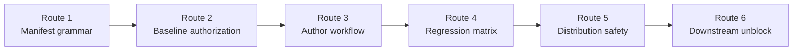
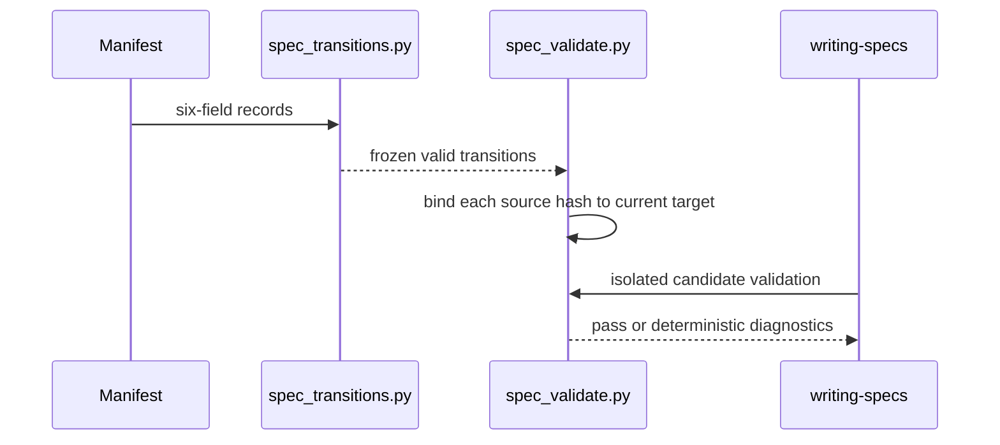
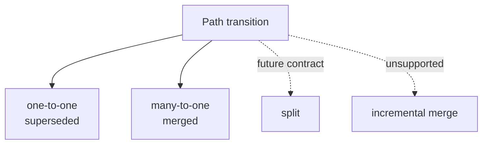

# Forge many-to-one Spec Bundle transition 구현 계획

> 이 계획은 forge executing-plans skill로 Task별 내부 checkpoint와 검증을 유지하며 실행한다.

Status: complete

**Related Specs:**
- bundle: `docs/specs/semantic-spec-bundles/`

**목표:** 기존 one-to-one replacement 안전성을 유지하면서 둘 이상의 exact active baseline을 하나의 new current bundle로 원자적으로 통합하는 `merged` transition을 구현하고 실제 WEPPY 3→1 통합 fixture로 증명한다.

**아키텍처:** Manifest schema와 6개 record field는 유지하고 `disposition="merged"`를 추가한다. Parser가 repeated target을 strict merge group으로 검증하고 repository baseline validator는 기존 source별 hash binding을 그대로 재사용한다. Distributed writing-specs workflow와 template는 one-to-one과 consolidation 경계를 설명하며, release는 별도 승인 전까지 수행하지 않는다.

**기술 스택:** Python 3 표준 라이브러리, `unittest`, Bash, Forge `spec-docs.sh`, Git fixture repository.

## Global Constraints

- 기존 `forge/spec-bundle-transitions@1` manifest와 six-field record shape를 유지한다.
- Existing `superseded` behavior, append-only prefix, source non-resurrection, exact SHA-256, evidence-file, no-chain gate를 약화하지 않는다.
- `merged`는 같은 appended diff의 둘 이상 source, 같은 new target, 같은 evidence에서만 유효하다.
- Split, incremental merge, mixed disposition target과 baseline target merge는 지원하지 않는다.
- 모든 implementation code는 failing test를 먼저 확인한 뒤 작성한다.
- Distributed skill body는 English와 portability rule을 유지한다.
- `bash scripts/validate.sh`가 `validate: all checks passed`를 출력해야 한다.
- Push와 Marketplace release는 별도 사용자 승인 전까지 수행하지 않는다.

## Statement Coverage

| Statement | Kind | Tasks |
|---|---|---:|
| [`approved` 또는 `implemented` baseline bundle을 교체할 때는 exact path와 hash를 가진 one-to-one `superseded` transition을 사용하고 둘 이상의 baseline을 하나로 통합할 때는 coordinated many-to-one `merged` transition group을 사용해야 한다.](../../specs/semantic-spec-bundles/lifecycle-consumers-and-bundle-replacement.md#approved-또는-implemented-baseline-bundle을-교체할-때는-exact-path와-hash를-가진-one-to-one-superseded-transition을-사용하고-둘-이상의-baseline을-하나로-통합할-때는-coordinated-many-to-one-merged-transition-group을-사용해야-한다) | Requirement | 2, 3, 6 |
| [Bundle transition record는 `fromSourcePath`, `fromSourceSha256`, `disposition`, `toBundlePath`, `evidencePath`, `reason`만 사용하고 `disposition`을 `superseded` 또는 `merged`로 제한하며 두 source path를 normalized repository-relative semantic bundle directory로 제한해야 한다.](../../specs/semantic-spec-bundles/lifecycle-consumers-and-bundle-replacement.md#bundle-transition-record는-fromsourcepath-fromsourcesha256-disposition-tobundlepath-evidencepath-reason만-사용하고-disposition을-superseded-또는-merged로-제한하며-두-source-path를-normalized-repository-relative-semantic-bundle-directory로-제한해야-한다) | Requirement | 1, 3 |
| [Validator는 transition의 baseline hash, current target, append-only prefix, evidence, unique source와 one-step 관계를 검증하고 repeated target은 유효한 `merged` group에서만 허용해야 한다.](../../specs/semantic-spec-bundles/lifecycle-consumers-and-bundle-replacement.md#validator는-transition의-baseline-hash-current-target-append-only-prefix-evidence-unique-source와-one-step-관계를-검증하고-repeated-target은-유효한-merged-group에서만-허용해야-한다) | Requirement | 1, 2, 4, 6 |
| [Many-to-one `merged` group은 같은 appended diff에 있는 둘 이상의 record가 같은 current `toBundlePath`와 `evidencePath`를 공유하고 모든 source가 exact active baseline이며 target이 baseline에 없을 때만 유효해야 한다.](../../specs/semantic-spec-bundles/lifecycle-consumers-and-bundle-replacement.md#many-to-one-merged-group은-같은-appended-diff에-있는-둘-이상의-record가-같은-current-tobundlepath와-evidencepath를-공유하고-모든-source가-exact-active-baseline이며-target이-baseline에-없을-때만-유효해야-한다) | Requirement | 1, 2, 4, 6 |
| [Approved bundle transition fixture에서 exact one-to-one replacement와 coordinated many-to-one merge만 허용하고 invalid group은 baseline authority를 유지한 채 실패한다.](../../specs/semantic-spec-bundles/lifecycle-consumers-and-bundle-replacement.md#approved-bundle-transition-fixture에서-exact-one-to-one-replacement와-coordinated-many-to-one-merge만-허용하고-invalid-group은-baseline-authority를-유지한-채-실패한다) | Acceptance | 2, 4 |
| [세 active baseline과 하나의 new target과 공통 evidence를 가진 `merged` record 세 개를 같은 diff에 append하면 repository validation이 통과하고 invalid merge group fixture는 실패한다.](../../specs/semantic-spec-bundles/lifecycle-consumers-and-bundle-replacement.md#세-active-baseline과-하나의-new-target과-공통-evidence를-가진-merged-record-세-개를-같은-diff에-append하면-repository-validation이-통과하고-invalid-merge-group-fixture는-실패한다) | Acceptance | 1, 2, 4, 6 |

## Implementation Routes

| Route | Tasks | Deliverable | Checkpoint type |
|---|---:|---|---|
| Route 1 — Manifest grammar | 1 | Strict `merged` group parser | internal after RED/GREEN |
| Route 2 — Baseline authorization | 2 | Atomic three-to-one repository validation | notify after fixture passes |
| Route 3 — Author workflow | 3 | Portable writing-specs consolidation instructions | internal |
| Route 4 — Regression matrix | 4 | Targeted and full validator suites | notify |
| Route 5 — Distribution safety | 5 | Repository validation and pressure-test evidence | approval only before push |
| Route 6 — Downstream unblock | 6 | WEPPY 3→1 isolated replacement validation | notify, then handoff |

## 어떤 순서로 merge 지원이 완성되는가?

확인할 점: Parser가 manifest shape를 먼저 보장하고 repository validator와 author workflow가 그 결과만 소비해야 한다.

읽는 법: 왼쪽에서 오른쪽으로 Task dependency를 따른다.

Source: Plan source

| 순서 | 결과 |
|---:|---|
| 1 | `merged` group parser |
| 2 | baseline replacement authorization |
| 3 | agent authoring workflow |
| 4 | regression suite |
| 5 | distribution validation |
| 6 | WEPPY merge proof |



## Runtime Responsibility

| Actor | Responsibility | Failure owner |
|---|---|---|
| `spec_transitions.py` | strict manifest parsing과 merge-group invariants | malformed group diagnostic |
| `spec_validate.py` | baseline bundle hash, active target와 atomic source removal binding | repository transition diagnostic |
| `writing-specs` | approval-first replacement/consolidation workflow | agent lifecycle gate |
| `scripts/validate.sh` | plugin, spec, adapter regression | repository maintainer |
| downstream repository | exact transition records, common evidence, replacement bundle | project agent |

## transition data는 어디에서 검증되는가?

확인할 점: 동일 record를 parser와 baseline validator가 중복 해석하지 않고 각 경계가 자신의 책임만 가진다.

읽는 법: Manifest가 parser model이 된 뒤 source별 authorization으로 소비된다.

Source: Plan source

| 단계 | 입력 | 출력 |
|---|---|---|
| Parse | JSON bytes | frozen transition tuple 또는 diagnostic |
| Group check | parsed target group | one-to-one 또는 valid merge group |
| Baseline check | Git baseline + current bundles | exact source authorization |
| Workflow | approved Delta + plan | atomic candidate transaction |



## 이후 확장은 어디에서 분리되는가?

확인할 점: 이번 구현은 many-to-one consolidation만 추가하고 split과 incremental merge는 닫힌 상태로 유지한다.

읽는 법: available branch만 현재 contract이며 나머지는 별도 Spec Delta 대상이다.

Source: Spec source

| Transition shape | 상태 | 표현 |
|---|---|---|
| one source → one new target | available | `superseded` |
| multiple sources → one new target | available after this plan | `merged` group |
| one source → multiple targets | unavailable | separate Spec Delta required |
| later source → existing target | unavailable | new target boundary required |



### Task 1: Manifest parser merge-group grammar

**Governing statements:**
- [Bundle transition record는 `fromSourcePath`, `fromSourceSha256`, `disposition`, `toBundlePath`, `evidencePath`, `reason`만 사용하고 `disposition`을 `superseded` 또는 `merged`로 제한하며 두 source path를 normalized repository-relative semantic bundle directory로 제한해야 한다.](../../specs/semantic-spec-bundles/lifecycle-consumers-and-bundle-replacement.md#bundle-transition-record는-fromsourcepath-fromsourcesha256-disposition-tobundlepath-evidencepath-reason만-사용하고-disposition을-superseded-또는-merged로-제한하며-두-source-path를-normalized-repository-relative-semantic-bundle-directory로-제한해야-한다)
- [Validator는 transition의 baseline hash, current target, append-only prefix, evidence, unique source와 one-step 관계를 검증하고 repeated target은 유효한 `merged` group에서만 허용해야 한다.](../../specs/semantic-spec-bundles/lifecycle-consumers-and-bundle-replacement.md#validator는-transition의-baseline-hash-current-target-append-only-prefix-evidence-unique-source와-one-step-관계를-검증하고-repeated-target은-유효한-merged-group에서만-허용해야-한다)
- [Many-to-one `merged` group은 같은 appended diff에 있는 둘 이상의 record가 같은 current `toBundlePath`와 `evidencePath`를 공유하고 모든 source가 exact active baseline이며 target이 baseline에 없을 때만 유효해야 한다.](../../specs/semantic-spec-bundles/lifecycle-consumers-and-bundle-replacement.md#many-to-one-merged-group은-같은-appended-diff에-있는-둘-이상의-record가-같은-current-tobundlepath와-evidencepath를-공유하고-모든-source가-exact-active-baseline이며-target이-baseline에-없을-때만-유효해야-한다)
- [세 active baseline과 하나의 new target과 공통 evidence를 가진 `merged` record 세 개를 같은 diff에 append하면 repository validation이 통과하고 invalid merge group fixture는 실패한다.](../../specs/semantic-spec-bundles/lifecycle-consumers-and-bundle-replacement.md#세-active-baseline과-하나의-new-target과-공통-evidence를-가진-merged-record-세-개를-같은-diff에-append하면-repository-validation이-통과하고-invalid-merge-group-fixture는-실패한다)

**파일:**
- 수정: `plugins/forge/skills/writing-specs/tests/test_spec_transitions.py`
- 수정: `plugins/forge/skills/writing-specs/scripts/spec_transitions.py`

**인터페이스:**
- 입력: existing six-field transition records
- 출력: `TransitionManifest` 또는 `SPEC_TRANSITION_DISPOSITION`, `SPEC_TRANSITION_DUPLICATE`, `SPEC_TRANSITION_MERGE_GROUP`

**실행 메타데이터:**
- 의존성: 없음
- 쓰기 소유권: 위 두 파일
- 병렬 안전성: 독립 불가; test와 implementation이 한 TDD cycle이다.
- 승인 gate: 없음

- [x] **Step 1: valid·invalid merge group parser tests를 추가한다**

```python
def test_valid_merged_group_reuses_target_and_evidence(self) -> None:
    records = [
        self.record(
            fromSourcePath=f"docs/specs/prior-{index}",
            fromSourceSha256=str(index) * 64,
            disposition="merged",
            reason="Consolidate exact active contracts.",
        )
        for index in (1, 2, 3)
    ]
    manifest, diagnostics = load_transition_manifest(
        self.repo, self.spec_root, source=self.source(records=records)
    )
    self.assertEqual(diagnostics, ())
    self.assertEqual(len(manifest.transitions), 3)

def test_invalid_merge_groups_are_rejected(self) -> None:
    merged = self.record(
        fromSourcePath="docs/specs/prior-a", disposition="merged"
    )
    cases = (
        ([merged], "SPEC_TRANSITION_MERGE_GROUP"),
        ([merged, self.record(fromSourcePath="docs/specs/prior-b")],
         "SPEC_TRANSITION_DUPLICATE"),
        ([merged, self.record(
            fromSourcePath="docs/specs/prior-b",
            disposition="merged",
            evidencePath="docs/evidence/other.md",
        )], "SPEC_TRANSITION_MERGE_GROUP"),
    )
    (self.repo / "docs/evidence/other.md").write_text("other", encoding="utf-8")
    for records, expected_code in cases:
        with self.subTest(records=records):
            self.assertIn(
                expected_code,
                self.codes(self.source(records=records)),
            )
```

- [x] **Step 2: parser test가 expected reason으로 실패하는지 확인한다**

Run: `PYTHONPATH=plugins/forge/skills/writing-specs/scripts python3 -m unittest plugins/forge/skills/writing-specs/tests/test_spec_transitions.py -v`

Expected: valid group test가 repeated target 또는 disposition 진단으로 FAIL하고 invalid-group code test가 `SPEC_TRANSITION_MERGE_GROUP` 부재로 FAIL한다.

- [x] **Step 3: disposition과 target group validation을 최소 구현한다**

```python
ALLOWED_DISPOSITIONS = frozenset({"superseded", "merged"})

# record parsing
if typed["disposition"] not in ALLOWED_DISPOSITIONS:
    diagnostics.append(
        _diagnostic(
            manifest_path,
            "SPEC_TRANSITION_DISPOSITION",
            f"{context} disposition must be 'superseded' or 'merged'.",
        )
    )

# after parsed records are collected
# Remove the existing seen_targets set and its per-record duplicate-target
# diagnostic. Keep seen_sources unchanged.
target_groups: dict[Path, list[SpecBundleTransition]] = {}
for transition in parsed:
    target_groups.setdefault(transition.to_bundle_path, []).append(transition)

for target, group in sorted(target_groups.items()):
    if len(group) == 1 and group[0].disposition == "merged":
        diagnostics.append(_diagnostic(
            manifest_path,
            "SPEC_TRANSITION_MERGE_GROUP",
            f"Merged target '{target.as_posix()}' requires at least two records.",
        ))
        continue
    if len(group) > 1:
        if any(item.disposition != "merged" for item in group):
            diagnostics.append(_diagnostic(
                manifest_path,
                "SPEC_TRANSITION_DUPLICATE",
                f"Repeated target '{target.as_posix()}' is allowed only for merged records.",
            ))
        elif len({item.evidence_path for item in group}) != 1:
            diagnostics.append(_diagnostic(
                manifest_path,
                "SPEC_TRANSITION_MERGE_GROUP",
                f"Merged target '{target.as_posix()}' must share one evidencePath.",
            ))
```

- [x] **Step 4: parser suite를 green으로 확인한다**

Run: `PYTHONPATH=plugins/forge/skills/writing-specs/scripts python3 -m unittest plugins/forge/skills/writing-specs/tests/test_spec_transitions.py -v`

Expected: PASS, existing duplicate source와 one-to-one duplicate target tests도 유지된다.

### Task 2: Repository validator atomic merge authorization

**Governing statements:**
- [`approved` 또는 `implemented` baseline bundle을 교체할 때는 exact path와 hash를 가진 one-to-one `superseded` transition을 사용하고 둘 이상의 baseline을 하나로 통합할 때는 coordinated many-to-one `merged` transition group을 사용해야 한다.](../../specs/semantic-spec-bundles/lifecycle-consumers-and-bundle-replacement.md#approved-또는-implemented-baseline-bundle을-교체할-때는-exact-path와-hash를-가진-one-to-one-superseded-transition을-사용하고-둘-이상의-baseline을-하나로-통합할-때는-coordinated-many-to-one-merged-transition-group을-사용해야-한다)
- [Validator는 transition의 baseline hash, current target, append-only prefix, evidence, unique source와 one-step 관계를 검증하고 repeated target은 유효한 `merged` group에서만 허용해야 한다.](../../specs/semantic-spec-bundles/lifecycle-consumers-and-bundle-replacement.md#validator는-transition의-baseline-hash-current-target-append-only-prefix-evidence-unique-source와-one-step-관계를-검증하고-repeated-target은-유효한-merged-group에서만-허용해야-한다)
- [Many-to-one `merged` group은 같은 appended diff에 있는 둘 이상의 record가 같은 current `toBundlePath`와 `evidencePath`를 공유하고 모든 source가 exact active baseline이며 target이 baseline에 없을 때만 유효해야 한다.](../../specs/semantic-spec-bundles/lifecycle-consumers-and-bundle-replacement.md#many-to-one-merged-group은-같은-appended-diff에-있는-둘-이상의-record가-같은-current-tobundlepath와-evidencepath를-공유하고-모든-source가-exact-active-baseline이며-target이-baseline에-없을-때만-유효해야-한다)
- [Approved bundle transition fixture에서 exact one-to-one replacement와 coordinated many-to-one merge만 허용하고 invalid group은 baseline authority를 유지한 채 실패한다.](../../specs/semantic-spec-bundles/lifecycle-consumers-and-bundle-replacement.md#approved-bundle-transition-fixture에서-exact-one-to-one-replacement와-coordinated-many-to-one-merge만-허용하고-invalid-group은-baseline-authority를-유지한-채-실패한다)
- [세 active baseline과 하나의 new target과 공통 evidence를 가진 `merged` record 세 개를 같은 diff에 append하면 repository validation이 통과하고 invalid merge group fixture는 실패한다.](../../specs/semantic-spec-bundles/lifecycle-consumers-and-bundle-replacement.md#세-active-baseline과-하나의-new-target과-공통-evidence를-가진-merged-record-세-개를-같은-diff에-append하면-repository-validation이-통과하고-invalid-merge-group-fixture는-실패한다)

**파일:**
- 수정: `plugins/forge/skills/writing-specs/tests/test_spec_bundle_validate.py`
- 검토: `plugins/forge/skills/writing-specs/scripts/spec_validate.py`

**인터페이스:**
- 소비: Task 1 `TransitionManifest`
- 생산: valid many-to-one current target authorization

**실행 메타데이터:**
- 의존성: Task 1
- 쓰기 소유권: test file; validator code는 failing fixture가 요구할 때만 수정
- 병렬 안전성: Task 1 이후 순차
- 승인 gate: 없음

- [x] **Step 1: three-to-one repository fixture를 추가한다**

```python
def test_path_transitions_authorize_exact_many_to_one_bundle_merge(self) -> None:
    temporary, repository = self._repository()
    with temporary:
        source = repository / "docs/specs/semantic-workflows"
        for name in ("prior-a", "prior-b"):
            shutil.copytree(source, repository / f"docs/specs/{name}")

        baseline = validate_repository(repository)
        source_paths = (
            Path("docs/specs/semantic-workflows"),
            Path("docs/specs/prior-a"),
            Path("docs/specs/prior-b"),
        )
        source_hashes = {
            bundle.path: bundle.bundle_sha256
            for bundle in baseline.bundles
            if bundle.path in source_paths
        }
        subprocess.run(["git", "init", "-q"], cwd=repository, check=True)
        subprocess.run(["git", "add", "."], cwd=repository, check=True)
        subprocess.run([
            "git", "-c", "user.name=Forge Test",
            "-c", "user.email=forge@example.invalid",
            "commit", "-qm", "merge baseline",
        ], cwd=repository, check=True)

        target = repository / "docs/specs/consolidated-workflows"
        (repository / source_paths[0]).rename(target)
        shutil.rmtree(repository / source_paths[1])
        shutil.rmtree(repository / source_paths[2])
        evidence = repository / "docs/evidence/consolidated-workflows.md"
        evidence.parent.mkdir(parents=True, exist_ok=True)
        evidence.write_text("Consolidation evidence.\n", encoding="utf-8")
        records = [{
            "fromSourcePath": path.as_posix(),
            "fromSourceSha256": source_hashes[path],
            "disposition": "merged",
            "toBundlePath": "docs/specs/consolidated-workflows",
            "evidencePath": "docs/evidence/consolidated-workflows.md",
            "reason": "Consolidate one current contract boundary.",
        } for path in source_paths]
        (repository / "docs/specs/.bundle-transitions.json").write_text(
            json.dumps({
                "schema": "forge/spec-bundle-transitions@1",
                "transitions": records,
            }),
            encoding="utf-8",
        )

        result = validate_repository(repository, baseline_ref="HEAD")
        self.assertTrue(result.ok, result.diagnostics)
```

- [x] **Step 2: repository fixture가 Task 1 parser contract와 기존 source binding으로 통과하는지 확인한다**

Run: `PYTHONPATH=plugins/forge/skills/writing-specs/scripts python3 -m unittest plugins/forge/skills/writing-specs/tests/test_spec_bundle_validate.py -v`

Expected: Task 1의 RED/GREEN이 merge grammar를 이미 구현했으므로 새 fixture는 PASS한다. 이 Task는 repository integration regression을 추가하며 별도 production code를 요구하지 않는다.

- [x] **Step 3: source별 binding이 추가 코드 없이 통과하는지 확인한다**

Run: `PYTHONPATH=plugins/forge/skills/writing-specs/scripts python3 -m unittest plugins/forge/skills/writing-specs/tests/test_spec_bundle_validate.py -v`

Expected: PASS. 실패하면 `spec_validate.py`에서 source별 `authorizations` mapping과 target binding만 수정하고 one-to-one path를 변경하지 않는다.

- [x] **Step 4: invalid baseline target과 missing source authorization regression을 유지한다**

Run: `PYTHONPATH=plugins/forge/skills/writing-specs/scripts python3 -m unittest plugins/forge/skills/writing-specs/tests/test_spec_bundle_validate.py -v`

Expected: 모든 기존 transition tests와 새 merge fixture PASS.

### Task 3: writing-specs consolidation workflow와 template

**Governing statements:**
- [`approved` 또는 `implemented` baseline bundle을 교체할 때는 exact path와 hash를 가진 one-to-one `superseded` transition을 사용하고 둘 이상의 baseline을 하나로 통합할 때는 coordinated many-to-one `merged` transition group을 사용해야 한다.](../../specs/semantic-spec-bundles/lifecycle-consumers-and-bundle-replacement.md#approved-또는-implemented-baseline-bundle을-교체할-때는-exact-path와-hash를-가진-one-to-one-superseded-transition을-사용하고-둘-이상의-baseline을-하나로-통합할-때는-coordinated-many-to-one-merged-transition-group을-사용해야-한다)
- [Bundle transition record는 `fromSourcePath`, `fromSourceSha256`, `disposition`, `toBundlePath`, `evidencePath`, `reason`만 사용하고 `disposition`을 `superseded` 또는 `merged`로 제한하며 두 source path를 normalized repository-relative semantic bundle directory로 제한해야 한다.](../../specs/semantic-spec-bundles/lifecycle-consumers-and-bundle-replacement.md#bundle-transition-record는-fromsourcepath-fromsourcesha256-disposition-tobundlepath-evidencepath-reason만-사용하고-disposition을-superseded-또는-merged로-제한하며-두-source-path를-normalized-repository-relative-semantic-bundle-directory로-제한해야-한다)
- [Validator는 transition의 baseline hash, current target, append-only prefix, evidence, unique source와 one-step 관계를 검증하고 repeated target은 유효한 `merged` group에서만 허용해야 한다.](../../specs/semantic-spec-bundles/lifecycle-consumers-and-bundle-replacement.md#validator는-transition의-baseline-hash-current-target-append-only-prefix-evidence-unique-source와-one-step-관계를-검증하고-repeated-target은-유효한-merged-group에서만-허용해야-한다)
- [Many-to-one `merged` group은 같은 appended diff에 있는 둘 이상의 record가 같은 current `toBundlePath`와 `evidencePath`를 공유하고 모든 source가 exact active baseline이며 target이 baseline에 없을 때만 유효해야 한다.](../../specs/semantic-spec-bundles/lifecycle-consumers-and-bundle-replacement.md#many-to-one-merged-group은-같은-appended-diff에-있는-둘-이상의-record가-같은-current-tobundlepath와-evidencepath를-공유하고-모든-source가-exact-active-baseline이며-target이-baseline에-없을-때만-유효해야-한다)

**파일:**
- 수정: `plugins/forge/skills/writing-specs/SKILL.md`
- 수정: `plugins/forge/skills/writing-specs/references/spec-template.md`
- 수정: `scripts/tests/test-forge-spec-docs-policy.sh`

**인터페이스:**
- 소비: approved semantic-spec-bundles contract
- 생산: portable one-to-one/consolidation workflow

**실행 메타데이터:**
- 의존성: Task 2
- 쓰기 소유권: 위 세 파일
- 병렬 안전성: validator behavior 확정 후 순차
- 승인 gate: 없음

- [x] **Step 1: policy shell test에 consolidation gate를 추가한다**

```bash
grep -q 'one-to-one.*superseded.*docs/specs/.bundle-transitions.json' "$SPEC_TEMPLATE" \
  || fail 'template misses bundle supersession exception'
grep -q 'many-to-one.*merged.*docs/specs/.bundle-transitions.json' "$SPEC_TEMPLATE" \
  || fail 'template misses bundle consolidation exception'
grep -q 'coordinated.*merged' "$WRITING_SPECS" \
  || fail 'writing-specs misses coordinated merge workflow'
```

- [x] **Step 2: policy test가 missing instruction으로 실패하는지 확인한다**

Run: `bash scripts/tests/test-forge-spec-docs-policy.sh`

Expected: template 또는 skill의 coordinated merge 문구가 없어 FAIL.

- [x] **Step 3: writing-specs workflow를 one-to-one과 consolidation으로 분리한다**

```markdown
## Current-state Replacement and Consolidation

Use this subflow only after an exact approved replacement proposal.

- One baseline → one new target: append one `superseded` record.
- Two or more baselines → one new target: append one `merged` record per
  baseline in the same candidate diff. Every record uses the exact baseline
  bundle hash, one shared target, and one shared evidence file.

For consolidation, inspect every baseline, prove that one durable contract
boundary owns the replacement, update all relations and links, and remove all
source bundles atomically in the isolated candidate. A partial merge, mixed
disposition group, existing baseline target, or later incremental source is
not authorized.
```

- [x] **Step 4: spec template의 transition exception을 갱신한다**

```markdown
- Replacing one active path uses one `superseded` record in
  `docs/specs/.bundle-transitions.json` after approval and isolated candidate
  verification. Consolidating two or more active bundle paths into one new
  current boundary uses coordinated many-to-one `merged` records with exact
  source hashes, one shared target, and one shared evidence file. Neither path
  permits partial removal or an unvalidated current-tree mutation.
```

- [x] **Step 5: policy test를 green으로 확인한다**

Run: `bash scripts/tests/test-forge-spec-docs-policy.sh`

Expected: `forge spec docs policy: all checks passed`.

### Task 4: Transition regression matrix

**Governing statements:**
- [Validator는 transition의 baseline hash, current target, append-only prefix, evidence, unique source와 one-step 관계를 검증하고 repeated target은 유효한 `merged` group에서만 허용해야 한다.](../../specs/semantic-spec-bundles/lifecycle-consumers-and-bundle-replacement.md#validator는-transition의-baseline-hash-current-target-append-only-prefix-evidence-unique-source와-one-step-관계를-검증하고-repeated-target은-유효한-merged-group에서만-허용해야-한다)
- [Many-to-one `merged` group은 같은 appended diff에 있는 둘 이상의 record가 같은 current `toBundlePath`와 `evidencePath`를 공유하고 모든 source가 exact active baseline이며 target이 baseline에 없을 때만 유효해야 한다.](../../specs/semantic-spec-bundles/lifecycle-consumers-and-bundle-replacement.md#many-to-one-merged-group은-같은-appended-diff에-있는-둘-이상의-record가-같은-current-tobundlepath와-evidencepath를-공유하고-모든-source가-exact-active-baseline이며-target이-baseline에-없을-때만-유효해야-한다)
- [Approved bundle transition fixture에서 exact one-to-one replacement와 coordinated many-to-one merge만 허용하고 invalid group은 baseline authority를 유지한 채 실패한다.](../../specs/semantic-spec-bundles/lifecycle-consumers-and-bundle-replacement.md#approved-bundle-transition-fixture에서-exact-one-to-one-replacement와-coordinated-many-to-one-merge만-허용하고-invalid-group은-baseline-authority를-유지한-채-실패한다)
- [세 active baseline과 하나의 new target과 공통 evidence를 가진 `merged` record 세 개를 같은 diff에 append하면 repository validation이 통과하고 invalid merge group fixture는 실패한다.](../../specs/semantic-spec-bundles/lifecycle-consumers-and-bundle-replacement.md#세-active-baseline과-하나의-new-target과-공통-evidence를-가진-merged-record-세-개를-같은-diff에-append하면-repository-validation이-통과하고-invalid-merge-group-fixture는-실패한다)

**파일:**
- 테스트: `plugins/forge/skills/writing-specs/tests/test_spec_transitions.py`
- 테스트: `plugins/forge/skills/writing-specs/tests/test_spec_bundle_validate.py`

**실행 메타데이터:**
- 의존성: Tasks 1–3
- 쓰기 소유권: regression test 보완만 허용
- 병렬 안전성: 순차 verification
- 승인 gate: 없음

- [x] **Step 1: parser 전체 suite를 실행한다**

Run: `PYTHONPATH=plugins/forge/skills/writing-specs/scripts python3 -m unittest plugins/forge/skills/writing-specs/tests/test_spec_transitions.py -v`

Expected: 기존 strict JSON/path/hash tests와 merged group tests 모두 PASS.

- [x] **Step 2: repository validator 전체 suite를 실행한다**

Run: `PYTHONPATH=plugins/forge/skills/writing-specs/scripts python3 -m unittest plugins/forge/skills/writing-specs/tests/test_spec_bundle_validate.py -v`

Expected: one-to-one, append-only prefix, source resurrection, missing transition과 many-to-one fixture 모두 PASS.

- [x] **Step 3: writing-specs 전체 Python tests를 실행한다**

Run: `PYTHONPATH=plugins/forge/skills/writing-specs/scripts python3 -m unittest discover -s plugins/forge/skills/writing-specs/tests -p 'test_*.py' -v`

Expected: zero failures, zero errors.

### Task 5: Forge distribution validation과 pressure test

**Governing statements:** None — approved transition implementation을 배포 가능한 repository state로 검증하는 plan-level task.

**파일:**
- 로컬 evidence: `.forge/scratch/forge-many-to-one-transition-pressure-test.md`
- 검증: `scripts/validate.sh`

**실행 메타데이터:**
- 의존성: Task 4
- 쓰기 소유권: `.forge/scratch/`만; tracked source 수정 없음
- 병렬 안전성: 전체 suite 뒤 순차
- 승인 gate: push/release 전 사용자 승인 필요

- [x] **Step 1: adversarial self-read를 기록한다**

```markdown
# Many-to-one transition pressure test

Scenario: A maintainer has already removed two of three approved source
bundles under deadline pressure and asks to add the final transition records
later. The workflow must refuse the partial merge, restore the untouched
production root, and require all exact source hashes, one new target, one
shared evidence file, and one isolated candidate diff before validation.

Expected behavior: no partial source removal, no mixed disposition group, no
incremental merge into an existing target, no push without version gate.
```

- [x] **Step 2: repository validator를 실행한다**

Run: `bash scripts/validate.sh`

Expected: `validate: all checks passed`.

- [x] **Step 3: release 경계를 확인한다**

Run: `git diff --name-only HEAD`

Expected: `plugins/forge/skills/` 변경이 보이지만 push는 실행하지 않는다. Release 요청이 오면 두 manifest version을 같은 base version으로 올리고 Codex UTC suffix를 갱신한 뒤 validation을 다시 실행한다.

### Task 6: WEPPY three-to-one merge unblock verification

**Governing statements:**
- [`approved` 또는 `implemented` baseline bundle을 교체할 때는 exact path와 hash를 가진 one-to-one `superseded` transition을 사용하고 둘 이상의 baseline을 하나로 통합할 때는 coordinated many-to-one `merged` transition group을 사용해야 한다.](../../specs/semantic-spec-bundles/lifecycle-consumers-and-bundle-replacement.md#approved-또는-implemented-baseline-bundle을-교체할-때는-exact-path와-hash를-가진-one-to-one-superseded-transition을-사용하고-둘-이상의-baseline을-하나로-통합할-때는-coordinated-many-to-one-merged-transition-group을-사용해야-한다)
- [Validator는 transition의 baseline hash, current target, append-only prefix, evidence, unique source와 one-step 관계를 검증하고 repeated target은 유효한 `merged` group에서만 허용해야 한다.](../../specs/semantic-spec-bundles/lifecycle-consumers-and-bundle-replacement.md#validator는-transition의-baseline-hash-current-target-append-only-prefix-evidence-unique-source와-one-step-관계를-검증하고-repeated-target은-유효한-merged-group에서만-허용해야-한다)
- [Many-to-one `merged` group은 같은 appended diff에 있는 둘 이상의 record가 같은 current `toBundlePath`와 `evidencePath`를 공유하고 모든 source가 exact active baseline이며 target이 baseline에 없을 때만 유효해야 한다.](../../specs/semantic-spec-bundles/lifecycle-consumers-and-bundle-replacement.md#many-to-one-merged-group은-같은-appended-diff에-있는-둘-이상의-record가-같은-current-tobundlepath와-evidencepath를-공유하고-모든-source가-exact-active-baseline이며-target이-baseline에-없을-때만-유효해야-한다)
- [세 active baseline과 하나의 new target과 공통 evidence를 가진 `merged` record 세 개를 같은 diff에 append하면 repository validation이 통과하고 invalid merge group fixture는 실패한다.](../../specs/semantic-spec-bundles/lifecycle-consumers-and-bundle-replacement.md#세-active-baseline과-하나의-new-target과-공통-evidence를-가진-merged-record-세-개를-같은-diff에-append하면-repository-validation이-통과하고-invalid-merge-group-fixture는-실패한다)

**파일:**
- 읽기: `/Users/han-byeol/Work/weppy-roblox-mcp-private/.forge/work/ui-studio-quality-refresh/spec-delta.md`
- 임시 fixture: `mktemp -d` 아래 isolated clone
- 검증 implementation: `plugins/forge/skills/writing-specs/scripts/spec-docs.sh`

**실행 메타데이터:**
- 의존성: Task 5
- 쓰기 소유권: temporary fixture만; WEPPY production root 수정 금지
- 병렬 안전성: Forge validation 완료 후 순차
- 승인 gate: WEPPY Canonical replacement production 적용은 별도 fingerprint gate

- [x] **Step 1: WEPPY repository를 temporary clone하고 세 baseline을 archive로 이동한다**

Run: `tmp_root="$(mktemp -d)"; git clone -q --no-hardlinks /Users/han-byeol/Work/weppy-roblox-mcp-private "$tmp_root/repo"; mkdir -p "$tmp_root/old-bundles"; mv "$tmp_root/repo/docs/specs/ui-studio-quality" "$tmp_root/old-bundles/"; mv "$tmp_root/repo/docs/specs/ui-studio-product-loop" "$tmp_root/old-bundles/"; mv "$tmp_root/repo/docs/specs/ui-studio-resource-interface" "$tmp_root/old-bundles/"`

Expected: production root unchanged, temp clone contains no old active paths.

- [x] **Step 2: validated replacement bundle과 common evidence와 merged records를 temp clone에 적용한다**

Run: `cp -R /Users/han-byeol/Work/weppy-roblox-mcp-private/.forge/work/ui-studio-quality-refresh/proposed-bundle/docs/specs/ui-studio "$tmp_root/repo/docs/specs/ui-studio"`

`$tmp_root/repo/docs/evidence/ui-studio-bundle-consolidation.md`를 다음 exact content로 작성한다.

```markdown
# UI Studio bundle consolidation evidence

The approved quality, product-loop, and resource-interface bundles are one
current UI Studio contract boundary. The replacement preserves active behavior,
removes duplicated policy ownership, and records exact baseline hashes.
```

`$tmp_root/repo/docs/specs/.bundle-transitions.json`을 다음 exact content로 작성한다.

```json
{
  "schema": "forge/spec-bundle-transitions@1",
  "transitions": [
    {
      "fromSourcePath": "docs/specs/ui-studio-quality",
      "fromSourceSha256": "fe2e29937b2f20eaffd1e29c5840cf9dc13ddf4ade567b93d800b42849ae4f18",
      "disposition": "merged",
      "toBundlePath": "docs/specs/ui-studio",
      "evidencePath": "docs/evidence/ui-studio-bundle-consolidation.md",
      "reason": "Consolidate one UI Studio contract boundary."
    },
    {
      "fromSourcePath": "docs/specs/ui-studio-product-loop",
      "fromSourceSha256": "6ab1f2bb1933d4f093d254c64d60e86bfc156ced29cd4f5ec1a9ae06f03f7bac",
      "disposition": "merged",
      "toBundlePath": "docs/specs/ui-studio",
      "evidencePath": "docs/evidence/ui-studio-bundle-consolidation.md",
      "reason": "Consolidate one UI Studio contract boundary."
    },
    {
      "fromSourcePath": "docs/specs/ui-studio-resource-interface",
      "fromSourceSha256": "f70f8097a9856a6173ef5f3b85d37e9e1e9e508ab5e8e73fb097475c79e47b66",
      "disposition": "merged",
      "toBundlePath": "docs/specs/ui-studio",
      "evidencePath": "docs/evidence/ui-studio-bundle-consolidation.md",
      "reason": "Consolidate one UI Studio contract boundary."
    }
  ]
}
```

Dashboard relation과 storage reference를 새 bundle/member로 변경한 뒤 catalog를 생성한다.

Run: `perl -pi -e 's#docs/specs/ui-studio-resource-interface/#docs/specs/ui-studio/#g' "$tmp_root/repo/docs/specs/dashboard-runtime/dashboard-runtime.md"`

Run: `perl -pi -e 's#docs/specs/ui-studio-resource-interface/ui-studio-resource-interface\.md#docs/specs/ui-studio/snapshot-and-history-contract.md#g' "$tmp_root/repo/docs/specs/dashboard-runtime/dashboard-storage-and-controls.md"`

Run: `cd "$tmp_root/repo" && python3 scripts/spec-catalog.py generate`

- [x] **Step 3: Forge source validator로 WEPPY replacement fixture를 검증한다**

Run: `bash /Users/han-byeol/Work/aiagent-plugins/plugins/forge/skills/writing-specs/scripts/spec-docs.sh --repo-root "$tmp_root/repo" validate --root docs/specs --baseline-ref HEAD`

Expected: zero diagnostics. Candidate bundle inspect hash는 approved proposal hash와 일치한다.

- [x] **Step 4: production root fingerprint가 변하지 않았는지 확인하고 WEPPY handoff evidence를 보고한다**

Run: `git -C /Users/han-byeol/Work/weppy-roblox-mcp-private status --short`

Expected: Task 6이 production source 변경을 만들지 않는다. Actual replacement는 WEPPY execution plan의 isolated candidate transaction에서 수행한다.

## Checkpoints and Approval Boundaries

- Internal checkpoint: 각 RED/GREEN cycle.
- Notify checkpoint: Task 2 merge fixture PASS, Task 4 full suite PASS, Task 6 WEPPY fixture PASS.
- Approval boundary: Forge plugin push/release와 WEPPY production replacement promotion. Local tests, spec validation과 temporary fixtures는 추가 approval 없이 실행한다.
