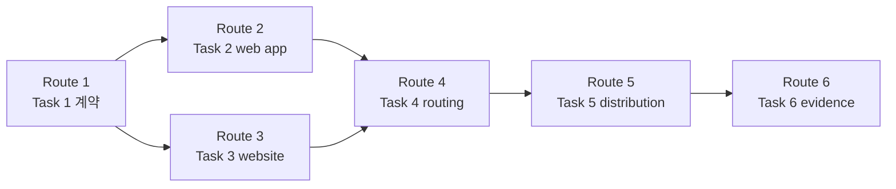
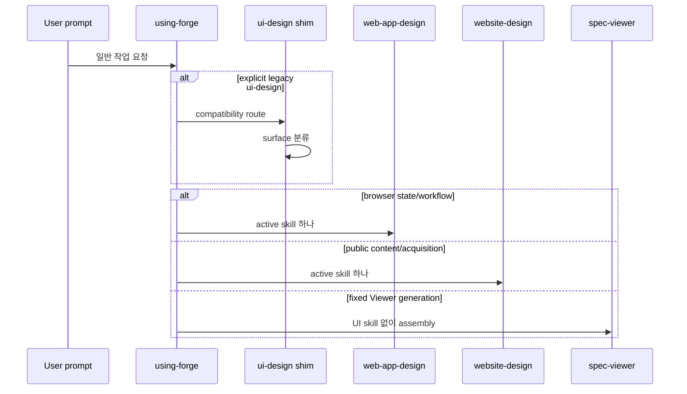
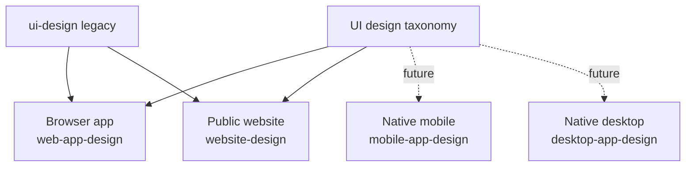

# Forge UI 디자인 스킬 분리 구현 계획

> 이 계획은 forge executing-plans skill로 Task를 순서대로 실행하고, 각 검증 checkpoint를 통과한 뒤 다음 단계로 진행한다.

Status: active

**Related Specs:**
- `docs/specs/006-ui-design-skill-split/spec.md`: R1–R9, R11–R12 · AC1–AC8, AC10–AC11
- `docs/specs/002-lifecycle-review-viewer/spec.md`: R57 · AC14

**목표:** browser application UI와 공개 website 디자인을 각각 `web-app-design`, `website-design`으로 분리하고, 기존 `ui-design`은 한 release 동안 직접 디자인하지 않는 compatibility router로 운영한다.

**아키텍처:** 두 active skill은 공통 파일에 의존하지 않는 독립 process skill로 만든다. `using-forge`가 기본 surface classifier를 소유하고, explicit legacy 호출만 `ui-design` shim이 분류한다. 정적 contract test, 실제 agent pressure test, browser fixture 검증을 조합해 trigger와 산출물 품질을 각각 검증한다.

**기술 스택:** Markdown Agent Skills, Bash contract tests, `jq`, GitHub Actions, `manage_extension.py`, 실제 target agent runtime, browser interaction 검사

## Global Constraints

- `web-app-design`은 browser·PWA application에만 적용하고 native mobile·desktop app을 소유한다고 주장하지 않는다.
- `website-design`은 공개 콘텐츠·브랜드·획득 website에만 적용하고 authenticated workflow와 operational table을 소유하지 않는다.
- 두 신규 스킬은 visual system 선언과 browser 검증 원칙을 각각 자급적으로 포함하며 서로의 경로를 참조하지 않는다.
- `ui-design`은 이번 계획에서 삭제하지 않고 직접 visual system·CSS·UI 구현을 수행하지 않는 deprecated router로만 유지한다.
- 고정 shell을 이용한 개별 spec·plan Viewer 생성에는 어떤 UI 디자인 스킬도 적용하지 않는다. Viewer shell·template·style 변경만 `web-app-design`에 속한다.
- 역사 문서인 `docs/specs/2026-07-04-forge-plugin-design.md`와 완료된 `docs/plans/` 기록은 수정하지 않는다.
- 사용자 machine의 `~/.agents/skills/ui-design`을 자동 또는 수동으로 삭제하지 않는다.
- 원격 push와 Marketplace release는 별도 사용자 승인이 있어야 한다.

## 이번 계획에서 제외되는 후속 삭제

`docs/specs/006-ui-design-skill-split/spec.md`의 R10, R13과 AC9, AC12는 이번 계획의 구현 대상이 아니다. 두 신규 스킬이 한 release 이상 배포된 뒤 별도 approved spec과 독립 plan을 만들고, active runtime 참조 0개·stale machine copy 안내·fresh install 비재생성을 검증한 경우에만 `ui-design` source 삭제를 진행한다.

## 구현 Routes

| Route | Tasks | 산출물 | Checkpoint |
|---|---:|---|---|
| Route 1 — 계약 고정 | 1 | 실패하는 cross-file routing contract | internal |
| Route 2 — Browser app | 2 | `web-app-design` process skill | notify |
| Route 3 — Public website | 3 | `website-design` process skill | notify |
| Route 4 — Routing migration | 4 | `using-forge`, legacy shim, Viewer·maintainer routing | notify |
| Route 5 — Distribution catalog | 5 | README, manifests, CI regression 동기화 | internal |
| Route 6 — Behavioral evidence | 6 | agent pressure test, browser fixture, release-ready evidence | release approval before push |

## 어떤 순서로 구현되는가?

확인할 내용: contract가 먼저 실패하고, 두 독립 스킬이 준비된 뒤에만 router와 배포 surface가 신규 이름을 노출해야 한다.

읽는 법: 실선은 Task의 명시적 선행 의존성을 뜻하며 Route 6만 모든 변경을 통합 검증한다.

Source: Plan source

| 먼저 | 다음 | 이유 |
|---|---|---|
| Task 1 | Task 2, 3 | 신규 이름과 금지 경계를 RED contract로 고정 |
| Task 2, 3 | Task 4 | handoff 대상이 존재한 뒤 router 전환 |
| Task 4 | Task 5 | canonical routing이 정해진 뒤 catalog 노출 |
| Task 5 | Task 6 | 전체 설치 surface가 동기화된 상태에서 behavioral verification |



## 실행 시 누가 어떤 결정을 소유하는가?

확인할 내용: 기본 분류와 legacy 분류, 실제 디자인 절차, Viewer 예외, release gate의 책임이 중복되지 않아야 한다.

읽는 법: 요청은 `using-forge` 또는 explicit `ui-design` shim에서 한 번만 분류되고, 선택된 active skill 하나가 디자인 절차를 소유한다.

Source: Spec source

| 주체 | 책임 | 하지 않는 일 |
|---|---|---|
| `using-forge` | 일반 UI prompt를 surface별 active skill로 분류 | visual system 작성 |
| `ui-design` shim | explicit legacy 호출만 분류하고 deprecation 안내 | CSS·UI 구현 |
| `web-app-design` | browser app hierarchy·state geometry·interaction 검증 | public website·native app 디자인 |
| `website-design` | public website composition·imagery·responsive 검증 | app table geometry 강제 |
| `spec-viewer` | 고정 shell의 개별 Viewer 생성 | 생성 시 UI skill 호출 |
| `maintaining-forge` | catalog·version·pressure-test release gate | Marketplace user UI 구현 |



## 미래 platform skill은 어디에 확장되는가?

확인할 내용: 현재 두 이름이 향후 mobile·desktop app skill과 의미적으로 충돌하지 않아야 한다.

읽는 법: 현재 release는 browser app과 website만 available이고, native platform 노드는 이름만 예약된 extension point다.

Source: Spec source

| Surface | 현재 상태 | Skill |
|---|---|---|
| Browser·PWA application | available | `web-app-design` |
| Public content website | available | `website-design` |
| Native mobile app | reserved | 향후 `mobile-app-design` |
| Native desktop app | reserved | 향후 `desktop-app-design` |
| Legacy broad UI | compatibility only | `ui-design` |



## AC Coverage

| AC | Tasks |
|---|---|
| AC1 | 1, 2, 4, 6 |
| AC2 | 1, 3, 4, 6 |
| AC3 | 1, 4, 6 |
| AC4 | 1, 4, 6 |
| AC5 | 2, 6 |
| AC6 | 3, 6 |
| AC7 | 1, 4, 5, 6 |
| AC8 | 5, 6 |
| AC10 | 1, 4, 6 |
| AC11 | 1, 4, 6 |
| AC14 | 1, 4, 6 |

### Task 1: UI skill routing contract를 RED로 고정 (R1–R9, R11–R12, R57 · AC1–AC4, AC7, AC10–AC11, AC14)

**파일:**
- 생성: `scripts/tests/test-ui-design-skill-routing.sh`
- 참조: `docs/specs/006-ui-design-skill-split/spec.md`
- 참조: `docs/specs/002-lifecycle-review-viewer/spec.md`

**인터페이스:**
- 입력: 두 approved spec의 surface taxonomy, Viewer 예외, compatibility lifecycle
- 출력: 신규 skill 본문·router·catalog·manifest가 함께 충족해야 하는 executable text contract

**실행 메타데이터:**
- 의존성: none
- 쓰기 소유권: `scripts/tests/test-ui-design-skill-routing.sh`
- 병렬 안전성: sequential — 뒤 Task들의 RED 기준을 먼저 고정해야 한다.
- 승인 gate: none

- [x] **Step 1: 다음 contract test를 생성한다.**

```bash
#!/usr/bin/env bash
set -euo pipefail

ROOT="$(cd "$(dirname "${BASH_SOURCE[0]}")/../.." && pwd)"

fail() {
  echo "FAIL: $1" >&2
  exit 1
}

assert_has() {
  local pattern="$1"
  local file="$2"
  grep -Eq "$pattern" "$file" || fail "$file is missing pattern: $pattern"
}

assert_not_has() {
  local pattern="$1"
  local file="$2"
  if grep -Eq "$pattern" "$file"; then
    fail "$file contains forbidden pattern: $pattern"
  fi
}

APP="$ROOT/plugins/forge/skills/web-app-design/SKILL.md"
SITE="$ROOT/plugins/forge/skills/website-design/SKILL.md"
LEGACY="$ROOT/plugins/forge/skills/ui-design/SKILL.md"
ROUTER="$ROOT/plugins/forge/skills/using-forge/SKILL.md"
VIEWER="$ROOT/plugins/forge/skills/spec-viewer/SKILL.md"
MAINTAINER="$ROOT/.agent-extensions/maintaining-forge/skills/maintaining-forge/SKILL.md"

for file in "$APP" "$SITE" "$LEGACY"; do
  [[ -f "$file" ]] || fail "missing skill: $file"
done

assert_has '^name: web-app-design$' "$APP"
assert_has 'browser.*PWA|PWA.*browser' "$APP"
assert_has 'Secondary ceiling' "$APP"
assert_has '44px hit area' "$APP"
assert_has 'viewport.*state matrix' "$APP"
assert_has '1px' "$APP"
assert_not_has 'owns native mobile|owns native desktop' "$APP"

assert_has '^name: website-design$' "$SITE"
assert_has 'Visual thesis' "$SITE"
assert_has 'Content hierarchy' "$SITE"
assert_has 'Imagery' "$SITE"
assert_has 'Responsive composition' "$SITE"
assert_has 'restrained motion' "$SITE"
assert_not_has 'table geometry.*required|required.*table geometry' "$SITE"

assert_has '^name: ui-design$' "$LEGACY"
assert_has 'DEPRECATED' "$LEGACY"
assert_has 'DO NOT DESIGN' "$LEGACY"
assert_has 'web-app-design' "$LEGACY"
assert_has 'website-design' "$LEGACY"
assert_not_has 'VISUAL SYSTEM —' "$LEGACY"

assert_has 'Browser application UI.*web-app-design' "$ROUTER"
assert_has 'Public website.*website-design' "$ROUTER"
assert_has 'one classification question' "$ROUTER"
assert_has 'Native mobile or desktop app.*specialist skill is not available' "$ROUTER"
assert_has 'Viewer shell.*web-app-design' "$ROUTER"

assert_has 'Building a browser application UI.*web-app-design' "$VIEWER"
assert_has 'Building a public website.*website-design' "$VIEWER"
assert_has 'Changing the Viewer shell.*web-app-design' "$VIEWER"
assert_not_has 'Building product UI.*ui-design' "$VIEWER"

assert_has '\| `web-app-design` \|' "$MAINTAINER"
assert_has '\| `website-design` \|' "$MAINTAINER"
assert_has '\| `ui-design` \| Deprecated compatibility router' "$MAINTAINER"

assert_has '\| `web-app-design` \|' "$ROOT/README.md"
assert_has '\| `website-design` \|' "$ROOT/README.md"
assert_has '14 active user-execution skills plus 1 deprecated compatibility router' "$ROOT/README.md"

jq -e '.keywords | index("web-app-design") != null' \
  "$ROOT/plugins/forge/.claude-plugin/plugin.json" >/dev/null ||
  fail "Claude manifest is missing web-app-design keyword"
jq -e '.keywords | index("website-design") != null' \
  "$ROOT/plugins/forge/.claude-plugin/plugin.json" >/dev/null ||
  fail "Claude manifest is missing website-design keyword"
assert_has 'web-app-design' "$ROOT/plugins/forge/.codex-plugin/plugin.json"
assert_has 'website-design' "$ROOT/plugins/forge/.codex-plugin/plugin.json"

assert_has 'test-ui-design-skill-routing.sh' "$ROOT/.github/workflows/validate.yml"

echo "ui-design-skill-routing: all checks passed"
```

- [x] **Step 2: 실행 권한을 부여한다.**

실행: `chmod +x scripts/tests/test-ui-design-skill-routing.sh`

예상: 파일 mode가 executable로 바뀐다.

- [x] **Step 3: contract가 신규 skill 부재로 실패하는지 확인한다.**

실행: `bash scripts/tests/test-ui-design-skill-routing.sh`

예상: exit 1과 `FAIL: missing skill: .../web-app-design/SKILL.md`가 출력된다.

- [x] **Step 4: 승인된 계약과 실행 계획을 먼저 commit한다.**

실행:

```bash
git add docs/specs/002-lifecycle-review-viewer/spec.md \
  docs/specs/006-ui-design-skill-split/spec.md \
  docs/plans/005-ui-design-skill-split/plan.md
git commit -m "docs(forge): approve UI design skill split"
```

예상: approved spec 두 개와 Plan 005만 commit되고, 아직 RED인 test 파일은 후속 구현이 GREEN이 될 때까지 working tree에 남는다.

### Task 2: `web-app-design` process skill 구현 (R1, R2, R5, R11–R12 · AC1, AC5, AC10–AC11)

**파일:**
- 생성: `plugins/forge/skills/web-app-design/SKILL.md`
- 테스트: `scripts/tests/test-ui-design-skill-routing.sh`

**인터페이스:**
- 입력: approved spec·plan Task, 기존 product token, browser application UI 요청
- 출력: inherited role hierarchy, state geometry, viewport×state matrix를 UI 코드 전 선언하는 process skill

**실행 메타데이터:**
- 의존성: Task 1
- 쓰기 소유권: `plugins/forge/skills/web-app-design/`
- 병렬 안전성: Task 3과 병렬 가능 — 파일 소유권과 active surface가 분리된다.
- 승인 gate: spec과 다른 native platform 소유권 또는 typography floor가 필요하면 중단하고 spec delta 승인을 받는다.

- [x] **Step 1: 다음 내용으로 `web-app-design/SKILL.md`를 생성한다.**

````markdown
---
name: web-app-design
description: 'Use when designing, implementing, or reviewing browser application UI such as dashboards, admin panels, settings, tables, forms, controls, internal tools, SaaS workspaces, and PWAs. Triggers: "대시보드", "관리자 화면", "설정 화면", "웹앱", "PWA", "table UI", "form UI", "control panel".'
---

# Web App Design

Announce at start: "Using the forge web-app-design skill to declare the inherited product UI system and state geometry before writing UI code."

Respond to the user in the user's language. This skill file stays in English.

## Overview

Browser application UI helps a person inspect state and complete work. Its design quality comes from clear relative hierarchy, stable geometry, obvious interaction, and complete state coverage. Decorative novelty never outranks scan speed or control predictability.

## Iron Law

```text
NO WEB APP UI CODE BEFORE THE INHERITED SYSTEM, ROLE HIERARCHY, AND STATE MATRIX ARE DECLARED.
SECONDARY CONTENT NEVER OUTRANKS THE PRIMARY TASK.
STATE CHANGES MUST NOT CAUSE UNPLANNED GEOMETRY CHANGES.
```

## When to Use / When NOT

Use for browser and PWA dashboards, authenticated workspaces, admin panels, settings, tables, forms, filters, controls, and operational tools.

Do NOT use for:

- public landing pages, marketing sites, portfolios, editorial sites, or public content sites — use the forge website-design skill;
- native iOS, Android, React Native, Flutter, desktop, Electron, or Tauri apps — the browser app contract does not own native platform behavior;
- fixed spec or plan Viewer generation — use the forge spec-viewer skill without a UI design skill;
- logic changes with no visible or interactive surface.

## The Process

Create one todo per numbered step before changing UI code.

### Step 1 — Read product truth

Read the current plan Task and every Related Spec. Then inspect the actual component, design tokens, typography roles, spacing, control states, and responsive rules already used by the product. Existing values are inherited unless the approved spec requires a change.

### Step 2 — Classify the primary task and interaction

State:

- the user's primary task;
- which labels, controls, values, descriptions, and metadata support it;
- which elements are interactive and how their default, hover, focus, selected, disabled, loading, success, and error states are signaled;
- whether the page is one authenticated workflow or contains a separately owned public website surface.

Do not make passive information look clickable. Do not make controls look like static labels.

### Step 3 — Declare the app UI system

Post this completed block to the user before UI code:

```text
WEB APP SYSTEM — browser application surface
Intent: <product-specific operational intent>
Inherited tokens: <actual type, color, spacing, radius, and depth sources>
Role scale: Primary <setting or task role> / Secondary ceiling <help role that cannot exceed primary> / Metadata <supporting role>
Palette: <neutral work surface, semantic states, and one interaction accent>
Spacing: <base unit and density rule>
Depth: <one primary separation strategy>
Control affordance: <how interactive, selected, disabled, and focus states differ from information>
State geometry: <stable row, column, action slot, and disclosure behavior>
```

Rules:

- Continuous reading copy stays at least 16px. Compact labels and metadata may use an inherited 12–14px role only when readability is verified and they do not carry the primary task.
- Help, tooltip, and “how it works” content uses the inherited secondary role. Opening it must not make its type size, weight, contrast, or spacing stronger than the setting or menu item it explains.
- A 44px hit area is an interaction floor, not a mandate for a 44px-tall visible control. Use padding or a wrapper so compact controls remain visually proportional.
- Selected tabs, segmented controls, Auto·Manual choices, toggles, and buttons must look operable before hover and must differ from static status text.
- Use spacing, weight, and color before introducing a larger title size. Preserve the product's established role scale.

### Step 4 — Declare the viewport×state matrix

List every viewport and state combination that will be verified. At minimum include:

| Dimension | Required cases |
|---|---|
| Viewport | desktop working width, narrow or mobile width supported by the product |
| Data | empty, typical, long label or value |
| Request | idle, loading, success, error |
| Control | default, keyboard focus, selected, disabled |
| Disclosure | help closed, help open |
| Mode | every mode that swaps controls or lists |

For the same data row, record the pre-change height, core column widths, and action slot. Help disclosure may intentionally add a subordinate region; changing a mode must keep the comparable row and core columns within 1px unless the approved spec defines a different layout.

### Step 5 — Implement within the declared system

Reuse product components and tokens before adding new ones. Keep DOM order aligned with reading and keyboard order. Reserve stable space for controls that swap by mode. Use semantic controls, visible focus, programmatic labels, and semantic status announcements.

Motion is optional. When used, keep it under 300ms and animate `transform` or `opacity`; never use `transition: all`.

### Step 6 — Verify rendered behavior

Use a real browser and execute the viewport×state matrix. For each case:

- compare primary, secondary, and metadata hierarchy;
- verify interactive and informational regions are distinguishable;
- measure row height, core column width, and action slot before and after mode changes;
- confirm the visible control and its 44px hit area are independently intentional;
- navigate every control by keyboard and inspect focus;
- check clipping, overflow, loading, success, error, disabled, empty, and long-content behavior.

Rendered behavior is the evidence. If a real browser is unavailable, report the missing verification instead of claiming completion.

## Red Flags

| Excuse | Reality |
|---|---|
| "The explanation deserves a larger font because it is newly opened." | Disclosure changes visibility, not ownership. Secondary help stays below the primary setting. |
| "A 44px hit target means every visible control should be 44px tall." | Hit geometry and visual geometry are separate decisions. |
| "Auto and Manual use different content, so different row geometry is expected." | Different content still needs a shared comparable row, core columns, and action slot. |
| "The selected option is obvious from context." | A control must communicate interaction and selection without requiring inference. |
| "The existing design system means no declaration is needed." | Read it and declare the inherited roles; otherwise the implementation is guessing. |
| "Desktop looks correct, so responsive states are implied." | Every viewport×state case needs rendered evidence. |

## Handoff

- Public website surface discovered during the task → isolate its owned files and use the forge website-design skill for that surface only.
- UI copy changes → use the forge writing-tone skill.
- Claiming completion → return to the forge executing-plans skill, then use the forge verifying-work skill against the approved acceptance criteria.
````

- [x] **Step 2: app-specific static contract를 실행한다.**

실행:

```bash
grep -Eq '^name: web-app-design$' plugins/forge/skills/web-app-design/SKILL.md
grep -Eq 'Secondary ceiling' plugins/forge/skills/web-app-design/SKILL.md
grep -Eq '44px hit area' plugins/forge/skills/web-app-design/SKILL.md
grep -Eq 'viewport.*state matrix' plugins/forge/skills/web-app-design/SKILL.md
grep -Eq 'within 1px' plugins/forge/skills/web-app-design/SKILL.md
```

예상: 모든 명령이 exit 0이다.

- [x] **Step 3: validator로 frontmatter·line cap·portable token을 확인한다.**

실행: `bash scripts/validate.sh`

예상: `validate: all checks passed`

- [x] **Step 4: 독립 skill 변경을 commit한다.**

실행:

```bash
git add plugins/forge/skills/web-app-design/SKILL.md
git commit -m "feat(forge): add web app design skill"
```

예상: `web-app-design` 파일만 포함한 commit이 생성되고 push는 수행되지 않는다.

### Task 3: `website-design` process skill 구현 (R3–R5, R11–R12 · AC2, AC6, AC10–AC11)

**파일:**
- 생성: `plugins/forge/skills/website-design/SKILL.md`
- 테스트: `scripts/tests/test-ui-design-skill-routing.sh`

**인터페이스:**
- 입력: approved spec·plan Task, brand·content context, public website 요청
- 출력: visual thesis, content hierarchy, imagery, responsive composition을 UI 코드 전 선언하는 process skill

**실행 메타데이터:**
- 의존성: Task 1
- 쓰기 소유권: `plugins/forge/skills/website-design/`
- 병렬 안전성: Task 2와 병렬 가능 — 파일 소유권과 active surface가 분리된다.
- 승인 gate: authenticated workflow 또는 native app까지 범위를 넓혀야 하면 중단하고 surface 소유권을 재확인한다.

- [x] **Step 1: 다음 내용으로 `website-design/SKILL.md`를 생성한다.**

````markdown
---
name: website-design
description: 'Use when designing, implementing, or reviewing public websites such as landing pages, homepages, marketing sites, product pages, editorial sites, portfolios, and public documentation sites. Triggers: "웹사이트", "랜딩 페이지", "홈페이지", "마케팅 사이트", "제품 페이지", "포트폴리오", "public docs", "website redesign".'
---

# Website Design

Announce at start: "Using the forge website-design skill to declare the website thesis and content composition before writing UI code."

Respond to the user in the user's language. This skill file stays in English.

## Overview

A public website communicates a story, establishes trust, and guides a visitor toward a next action. Its design begins with content hierarchy and a distinct visual thesis, then uses typography, imagery, composition, and restrained motion to make that thesis visible.

## Iron Law

```text
NO WEBSITE UI CODE BEFORE THE VISUAL THESIS AND CONTENT HIERARCHY ARE DECLARED.
ONE CLEAR VISUAL IDEA, ONE PRIMARY ACTION, AND ONE COHERENT SYSTEM.
REAL RESPONSIVE COMPOSITION IS REQUIRED; A SHRUNK DESKTOP IS NOT MOBILE DESIGN.
```

## When to Use / When NOT

Use for public landing pages, homepages, marketing and product sites, editorial sites, portfolios, campaign pages, and public documentation sites.

Do NOT use for:

- authenticated dashboards, settings, operational tables, admin panels, or SaaS workflows — use the forge web-app-design skill;
- native mobile or desktop app interfaces;
- fixed spec or plan Viewer generation;
- a content-only copy change with no visual or layout decision.

## The Process

Create one todo per numbered step before changing UI code.

### Step 1 — Read product and content truth

Read the current plan Task and every Related Spec. Inspect the existing brand, type, color, imagery, components, performance budget, analytics goal, and page content. Preserve established tokens unless the approved spec requires a new direction.

### Step 2 — Define the visitor journey

State:

- the primary audience and their starting context;
- the one primary action;
- the page promise and proof needed before that action;
- the content sequence from first viewport to final decision;
- whether any authenticated application surface must be separated into files owned by the forge web-app-design skill.

### Step 3 — Declare the website system

Post this completed block to the user before UI code:

```text
WEBSITE SYSTEM — public content surface
Visual thesis: <one specific visual idea that expresses this product>
Audience and action: <visitor context and one primary action>
Content hierarchy: <ordered story from promise through proof to action>
Typography: <display, body, utility roles and why they fit the thesis>
Palette: <dominant field, supporting color, and one accent>
Spacing: <base unit and section rhythm>
Depth: <one primary separation strategy>
Imagery: <photography, illustration, product media, or an intentional non-image anchor>
Responsive composition: <desktop and mobile hierarchy, crop, stacking, and reading order>
Motion: <purpose, trigger, duration, and reduced-motion behavior>
```

Rules:

- The Visual thesis must be specific enough that it could not label an unrelated company.
- Content hierarchy comes before decorative sections. Every section must advance the visitor from promise to proof or action.
- Continuous body copy stays at least 16px with a readable line length and contrast.
- Imagery must carry meaning, proof, atmosphere, or product understanding. Do not use abstract decoration as a fake product screenshot.
- Use one accent and one dominant visual gesture. Repeating large type, saturated color, gradients, floating cards, and motion as simultaneous focal points creates noise.
- Motion is restrained, optional, and subordinate to reading. Respect reduced motion and avoid `transition: all`.

### Step 4 — Compose desktop and mobile deliberately

Define the first viewport, section rhythm, image crops, reading order, action placement, and navigation behavior at desktop and mobile widths. Mobile may reorder or remove decorative content, but it must preserve the promise, proof, and primary action.

Do not apply browser app table geometry or dense operational state matrices to a public website. Interactive forms still need keyboard, focus, error, loading, and success states appropriate to the form.

### Step 5 — Implement with accessible, performant media

Use semantic landmarks and heading order. Provide visible focus, labels, alt decisions, sufficient contrast, responsive image sources, explicit media dimensions, and lazy loading below the fold. Avoid layout shifts and assets whose cost is not justified by the visual thesis.

### Step 6 — Verify the rendered website

Use a real browser at desktop and mobile widths. Confirm:

- first-viewport promise, visual anchor, and primary action remain legible;
- heading hierarchy and reading order match the content plan;
- imagery crops intentionally and does not shift layout;
- body copy remains readable and no horizontal overflow appears;
- keyboard focus, form states, reduced motion, and semantic structure work;
- performance-sensitive media and motion stay within the declared budget.

Rendered output is the evidence. If a real browser or performance inspection is unavailable, report the missing verification instead of claiming completion.

## Red Flags

| Excuse | Reality |
|---|---|
| "A clean modern website is the thesis." | That phrase fits every product and therefore directs nothing. |
| "The hero can explain everything." | A first viewport needs one promise, a visual anchor, and one next action. |
| "More sections make the product look substantial." | Sections without a job dilute the story. |
| "A gradient, oversized type, floating cards, and motion will make it memorable." | One dominant gesture is memorable; four gestures compete. |
| "Mobile can stack the desktop layout." | Mobile composition needs its own hierarchy, crops, and action placement. |
| "The asset looks good, so its weight is acceptable." | Visual value must justify performance cost and layout stability. |

## Handoff

- Authenticated browser application surface discovered during the task → isolate its owned files and use the forge web-app-design skill for that surface only.
- Marketing or product copy changes → use the forge writing-tone skill with the forge marketing-tone skill.
- Claiming completion → return to the forge executing-plans skill, then use the forge verifying-work skill against the approved acceptance criteria.
````

- [x] **Step 2: website-specific static contract를 실행한다.**

실행:

```bash
grep -Eq '^name: website-design$' plugins/forge/skills/website-design/SKILL.md
grep -Eq 'Visual thesis' plugins/forge/skills/website-design/SKILL.md
grep -Eq 'Content hierarchy' plugins/forge/skills/website-design/SKILL.md
grep -Eq 'Imagery' plugins/forge/skills/website-design/SKILL.md
grep -Eq 'Responsive composition' plugins/forge/skills/website-design/SKILL.md
grep -Eq 'restrained' plugins/forge/skills/website-design/SKILL.md
```

예상: 모든 명령이 exit 0이다.

- [x] **Step 3: validator로 frontmatter·line cap·portable token을 확인한다.**

실행: `bash scripts/validate.sh`

예상: `validate: all checks passed`

- [x] **Step 4: 독립 skill 변경을 commit한다.**

실행:

```bash
git add plugins/forge/skills/website-design/SKILL.md
git commit -m "feat(forge): add website design skill"
```

예상: `website-design` 파일만 포함한 commit이 생성되고 push는 수행되지 않는다.

### Task 4: canonical routing과 legacy compatibility 전환 (R6–R8, R11–R12, R57 · AC1–AC4, AC7, AC10–AC11, AC14)

**파일:**
- 수정: `plugins/forge/skills/using-forge/SKILL.md`
- 교체: `plugins/forge/skills/ui-design/SKILL.md`
- 수정: `plugins/forge/skills/spec-viewer/SKILL.md`
- 수정: `.agent-extensions/maintaining-forge/skills/maintaining-forge/SKILL.md`
- 생성 또는 갱신: `.agent-extensions/maintaining-forge/adapters/codex/state.json`
- 생성 또는 갱신: `.agent-extensions/maintaining-forge/adapters/claude-code/state.json`
- 생성 또는 갱신: `.agent-extensions/maintaining-forge/adapters/antigravity/state.json`
- manager 소유 출력: `.agents/skills/maintaining-forge/SKILL.md`
- manager 소유 출력: `.claude/skills/maintaining-forge/SKILL.md`
- 테스트: `scripts/tests/test-ui-design-skill-routing.sh`

**인터페이스:**
- 입력: Task 2의 `web-app-design`, Task 3의 `website-design`
- 출력: 일반 prompt와 explicit legacy prompt가 한 active skill로만 도달하는 canonical route

**실행 메타데이터:**
- 의존성: Task 2, Task 3
- 쓰기 소유권: 위 Routing·Viewer·maintainer canonical·manager output 파일
- 병렬 안전성: sequential — 같은 routing contract와 manager ownership state를 원자적으로 맞춰야 한다.
- 승인 gate: `ui-design` source 삭제, native platform 자동 routing, 고정 Viewer 생성에 UI skill 적용이 필요하면 중단하고 spec delta 승인을 받는다.

- [x] **Step 1: `using-forge`의 implementation skill 문장을 교체한다.**

기존:

```markdown
4. **When multiple skills apply,** process skills come first — they set the approach; implementation skills (ui-design, writing-tone, test-driven-development) carry it out inside that process.
```

교체:

```markdown
4. **When multiple skills apply,** process skills come first — they set the approach; implementation skills (web-app-design, website-design, writing-tone, test-driven-development) carry it out inside that process. Apply both UI design skills only when one approved Task explicitly changes separately owned application and public website files.
```

- [x] **Step 2: `using-forge` routing table의 broad UI row를 다음 다섯 행으로 교체한다.**

```markdown
| Browser application UI — dashboards, admin, settings, tables, forms, controls, internal tools, SaaS workspaces, PWAs | the forge web-app-design skill |
| Public website — landing pages, homepages, marketing or product sites, editorial, portfolios, public documentation | the forge website-design skill |
| UI request with no evidence of application state/workflow or public content/acquisition | ask one classification question: "Is this a stateful browser application or a public content website?" Then route to exactly one UI skill |
| Native mobile or desktop app while its specialist skill is not available | state that the specialist skill is not available; do not force-route it to a web UI skill |
| Viewer shell, template, style, or interaction tooling changes | the forge web-app-design skill; fixed Viewer generation remains the forge spec-viewer skill alone |
```

- [x] **Step 3: 기존 `ui-design/SKILL.md` 전체를 다음 compatibility router로 교체한다.**

````markdown
---
name: ui-design
description: 'Use when a caller explicitly invokes the legacy Forge ui-design skill or an older workflow names it and the request must be handed to the replacement web UI skill. Triggers: explicit "ui-design", legacy Forge UI skill references, 오래된 ui-design 호출.'
---

# UI Design Compatibility Router

Announce at start: "The forge ui-design skill is DEPRECATED; I am classifying this surface and handing it to its active replacement."

Respond to the user in the user's language. This skill file stays in English.

## Overview

This is a one-release compatibility entry point for explicit legacy calls. It preserves old prompts long enough to classify their surface, then hands the work to one active skill. It contains no visual design procedure.

## Iron Law

```text
CLASSIFY AND HAND OFF. DO NOT DESIGN.
NEVER WRITE A VISUAL SYSTEM, CSS, OR UI IMPLEMENTATION FROM THIS SKILL.
NEVER ROUTE A NATIVE APP TO A WEB SKILL.
```

## When to Use / When NOT

Use only when the caller explicitly names `ui-design` or an older Forge workflow invokes it.

Do NOT select this skill for a new general UI request. The forge using-forge skill routes new work directly to an active skill.

## The Process

1. Tell the user once that `ui-design` is deprecated and will be removed after the compatibility period.
2. Classify the requested surface:
   - browser or PWA dashboard, admin, settings, table, form, control, internal tool, or authenticated workflow → hand off to the forge web-app-design skill;
   - public landing page, homepage, marketing or product site, editorial site, portfolio, or public documentation → hand off to the forge website-design skill;
   - one approved Task changing separately owned application and public website files → name both file groups and hand each group to its matching skill;
   - native mobile or desktop app → explain that this compatibility router has no active native replacement and do not force it into a web skill;
   - insufficient context → ask one question: "Is this a stateful browser application or a public content website?"
3. Stop using this skill after the handoff. The selected active skill owns every design declaration, implementation rule, and browser check.

## Red Flags

| Excuse | Reality |
|---|---|
| "The old skill already has useful visual rules." | Compatibility means routing old callers, not preserving a second competing design process. |
| "I can start the CSS while deciding the replacement." | DO NOT DESIGN. Classification completes before any UI work. |
| "Using both replacements is safer." | One surface gets one owner; use both only for separately owned app and website files in the same approved Task. |
| "Electron is web technology, so web-app-design is close enough." | Runtime technology does not make a native desktop product a browser application. |

## Handoff

The selected active replacement owns the task immediately. This compatibility router performs no later verification or completion claim.
````

- [x] **Step 4: `spec-viewer`의 product UI 제외 문장을 정확한 surface route로 교체한다.**

기존:

```markdown
- Building product UI — use the forge ui-design skill.
```

교체:

```markdown
- Building a browser application UI — use the forge web-app-design skill.
- Building a public website — use the forge website-design skill.
- Changing the Viewer shell, template, styles, scripts, or interaction tooling — use the forge web-app-design skill.
```

고정 Viewer 생성은 현재 `spec-viewer`의 `SUCCESSFUL BUILD ENDS GENERATION. NO POST-BUILD VIEWER QA.` 계약을 그대로 유지한다.

- [x] **Step 5: canonical `maintaining-forge` System Map의 UI row를 세 행으로 교체한다.**

기존:

```markdown
| `ui-design` | Declare and verify visual systems |
```

교체:

```markdown
| `web-app-design` | Design browser application hierarchy, state geometry, and interaction |
| `website-design` | Design public website content composition, imagery, and responsive behavior |
| `ui-design` | Deprecated compatibility router for explicit legacy calls |
```

- [x] **Step 6: canonical maintainer extension을 manager로 render한다.**

실행:

```bash
python3 plugins/forge/skills/creating-agent-extensions/scripts/manage_extension.py render \
  --extension .agent-extensions/maintaining-forge
```

예상: canonical hash와 Codex·Claude Code·Antigravity ownership state가 갱신되고 collision이 없다.

- [x] **Step 7: routing과 extension parity를 검증한다.**

실행:

```bash
grep -Eq 'Browser application UI.*web-app-design' plugins/forge/skills/using-forge/SKILL.md
grep -Eq 'Public website.*website-design' plugins/forge/skills/using-forge/SKILL.md
grep -Eq 'DO NOT DESIGN' plugins/forge/skills/ui-design/SKILL.md
grep -Eq 'Changing the Viewer shell.*web-app-design' plugins/forge/skills/spec-viewer/SKILL.md
python3 plugins/forge/skills/creating-agent-extensions/scripts/manage_extension.py validate \
  --extension .agent-extensions/maintaining-forge
bash scripts/validate.sh
```

예상: grep가 모두 exit 0, manager JSON의 `status`가 `PASS`, validator가 `validate: all checks passed`를 출력한다.

- [x] **Step 8: routing migration을 commit한다.**

실행:

```bash
git add plugins/forge/skills/using-forge/SKILL.md \
  plugins/forge/skills/ui-design/SKILL.md \
  plugins/forge/skills/spec-viewer/SKILL.md \
  .agent-extensions/maintaining-forge/skills/maintaining-forge/SKILL.md \
  .agent-extensions/maintaining-forge/adapters/codex/state.json \
  .agent-extensions/maintaining-forge/adapters/claude-code/state.json \
  .agent-extensions/maintaining-forge/adapters/antigravity/state.json \
  .agents/skills/maintaining-forge/SKILL.md \
  .claude/skills/maintaining-forge/SKILL.md
git commit -m "refactor(forge): route UI work by web surface"
```

예상: active routing, compatibility shim, Viewer exception, manager-owned maintainer adapters가 한 commit에 포함되고 push는 수행되지 않는다.

### Task 5: catalog·manifest·CI 동기화 (R8–R9 · AC7–AC8)

**파일:**
- 수정: `README.md`
- 수정: `plugins/forge/.claude-plugin/plugin.json`
- 수정: `plugins/forge/.codex-plugin/plugin.json`
- 수정: `scripts/tests/test-forge-artifact-contract.sh`
- 수정: `.github/workflows/validate.yml`
- 테스트: `scripts/tests/test-ui-design-skill-routing.sh`

**인터페이스:**
- 입력: Task 4의 active·compatibility catalog
- 출력: 14 active skills와 1 compatibility router를 동일하게 노출하는 docs, manifests, CI

**실행 메타데이터:**
- 의존성: Task 4
- 쓰기 소유권: 위 catalog·manifest·test·workflow 파일
- 병렬 안전성: sequential — routing 이름이 확정된 후 외부 discovery metadata를 동기화한다.
- 승인 gate: manifest version 변경과 원격 push는 Task 6의 release gate 전에는 수행하지 않는다.

- [x] **Step 1: README skill catalog의 `ui-design` 한 행을 세 행으로 교체한다.**

```markdown
| `web-app-design` | Browser app hierarchy, control affordance, state geometry, and viewport×state verification |
| `website-design` | Public website visual thesis, content composition, imagery, responsive behavior, and restrained motion |
| `ui-design` | Deprecated one-release compatibility router for explicit legacy calls |
```

- [x] **Step 2: README 배포 개수 문장을 교체한다.**

기존:

```markdown
only the 13 user-execution skills listed above.
```

교체:

```markdown
the 14 active user-execution skills plus 1 deprecated compatibility router listed above.
```

- [x] **Step 3: Claude plugin manifest의 description과 keywords를 갱신한다.**

`description` 값:

```text
Spec-first development process skills with cross-agent authoring, verification, debugging, browser application design, public website design, tone overlays, and lifecycle review Viewers. Produces adapters for Codex, Claude Code, and Antigravity.
```

`keywords` 값:

```json
["spec-first", "process", "tdd", "debugging", "agent-skills", "mcp", "web-app-design", "website-design", "ui-design", "tone", "marketing", "operations", "customer-support", "korean", "codex", "claude-code", "antigravity"]
```

`ui-design` keyword는 compatibility release 검색을 위해 이번 계획에서 유지한다.

- [x] **Step 4: Codex plugin manifest의 description, longDescription, defaultPrompt를 갱신한다.**

`description` 값은 Claude manifest와 같은 문장을 사용한다.

`interface.longDescription` 값:

```text
Forge packages a complete spec-first workflow - brainstorm to spec, spec to plan, plan to verified implementation - plus one-source authoring for Codex, Claude Code, and Antigravity skills and MCP configurations, browser application design with stable state geometry, public website design with deliberate content composition, tone overlays, systematic debugging, TDD, and lifecycle HTML review Viewers. Specs, plans, and canonical agent extensions remain source of truth while generated adapters and views stay derived.
```

`interface.defaultPrompt` 값:

```json
[
  "Write a spec for this feature before we code.",
  "Create one skill and MCP bundle for Codex, Claude Code, and Antigravity.",
  "Use web-app-design to improve this dashboard settings workflow.",
  "Use website-design to create this public product landing page.",
  "Render docs/specs/001 as an HTML viewer."
]
```

- [x] **Step 5: 기존 artifact contract의 broad `ui-design` Viewer 검사 두 줄을 교체한다.**

제거:

```bash
grep -q 'Generating a spec or plan `view.html` from the fixed Viewer shell' "$ROOT/plugins/forge/skills/ui-design/SKILL.md"
! grep -q 'For document Viewers, verify both 1440px desktop and 390px mobile' "$ROOT/plugins/forge/skills/ui-design/SKILL.md"
```

추가:

```bash
grep -q 'Building a browser application UI' "$ROOT/plugins/forge/skills/spec-viewer/SKILL.md"
grep -q 'Building a public website' "$ROOT/plugins/forge/skills/spec-viewer/SKILL.md"
grep -q 'Changing the Viewer shell' "$ROOT/plugins/forge/skills/spec-viewer/SKILL.md"
grep -q 'DO NOT DESIGN' "$ROOT/plugins/forge/skills/ui-design/SKILL.md"
```

- [x] **Step 6: GitHub Actions validation 목록에 신규 regression test를 추가한다.**

`bash scripts/tests/test-forge-artifact-contract.sh` 다음 줄에 추가:

```yaml
          bash scripts/tests/test-ui-design-skill-routing.sh
```

- [x] **Step 7: 전체 정적 contract를 GREEN으로 만든다.**

실행:

```bash
bash scripts/tests/test-ui-design-skill-routing.sh
bash scripts/tests/test-forge-artifact-contract.sh
bash scripts/tests/test-maintaining-forge-layout.sh
bash scripts/validate.sh
git diff --check
```

예상: 세 test와 validator가 각 success 문구를 출력하고 `git diff --check`가 출력 없이 exit 0이다.

- [x] **Step 8: catalog와 regression 변경을 commit한다.**

실행:

```bash
git add README.md \
  plugins/forge/.claude-plugin/plugin.json \
  plugins/forge/.codex-plugin/plugin.json \
  scripts/tests/test-ui-design-skill-routing.sh \
  scripts/tests/test-forge-artifact-contract.sh \
  .github/workflows/validate.yml
git commit -m "docs(forge): publish split UI skill catalog"
```

예상: catalog, discovery metadata, executable regression test, CI 등록만 한 commit에 포함되고 manifest version과 원격 상태는 바뀌지 않는다.

### Task 6: agent behavior·rendered fixture·release gate 검증 (R1–R9, R11–R12, R57 · AC1–AC8, AC10–AC11, AC14)

**파일:**
- 참조: `plugins/forge/skills/using-forge/SKILL.md`
- 참조: `plugins/forge/skills/web-app-design/SKILL.md`
- 참조: `plugins/forge/skills/website-design/SKILL.md`
- 참조: `plugins/forge/skills/ui-design/SKILL.md`
- 임시 기록: `.forge/scratch/ui-design-skill-pressure-test.md`
- 임시 fixture: `.forge/scratch/ui-design-skill-fixtures/`
- release 시에만 수정: `plugins/forge/.claude-plugin/plugin.json`
- release 시에만 수정: `plugins/forge/.codex-plugin/plugin.json`

**인터페이스:**
- 입력: Tasks 1–5의 전체 distributed skill surface와 repository maintenance gate
- 출력: static PASS, target discovery evidence, 여섯 routing scenario 결과, browser geometry·responsive evidence, release 보류 또는 승인된 version gate 결과

**실행 메타데이터:**
- 의존성: Task 5
- 쓰기 소유권: `.forge/scratch/ui-design-skill-*`; release 승인 후에만 두 plugin manifest version
- 병렬 안전성: static 검증 뒤 pressure scenario는 독립 실행 가능하지만 결과 종합과 release 판정은 sequential이다.
- 승인 gate: plugin version 변경과 push는 사용자의 명시적 release 승인이 있어야 한다. 승인이 없으면 local implementation evidence까지만 기록하고 plan을 release-ready 상태로 유지한다.

- [x] **Step 1: fresh static verification을 실행한다.**

실행:

```bash
bash scripts/tests/test-ui-design-skill-routing.sh
bash scripts/tests/test-forge-artifact-contract.sh
bash scripts/tests/test-maintaining-forge-layout.sh
bash scripts/tests/test-validator-skill-roots.sh
python3 plugins/forge/skills/creating-agent-extensions/scripts/manage_extension.py validate \
  --extension .agent-extensions/maintaining-forge
bash scripts/validate.sh
git diff --check
```

예상: 모든 test와 validator가 PASS하고 manager JSON의 `status`가 `PASS`다.

- [x] **Step 2: 사용할 수 있는 Codex·Claude Code·Antigravity runtime에서 skill discovery를 확인한다.**

각 runtime에 “설치된 Forge skill 이름만 나열하고 파일을 수정하지 마라”라고 요청한다. 사용할 수 있는 runtime은 `web-app-design`, `website-design`, `ui-design`을 모두 발견해야 한다. 사용할 수 없는 runtime은 이름, frontmatter, directory, validator 결과를 static evidence로 기록하고 live discovery를 실행하지 못했다고 명시한다.

결과는 `.forge/scratch/ui-design-skill-pressure-test.md`의 `Runtime discovery` 표에 runtime, available 여부, 세 이름 발견 여부, evidence를 기록한다.

- [x] **Step 3: fresh agent에 다음 여섯 pressure scenario를 각각 독립적으로 제공한다.**

각 scenario에는 `using-forge`, 선택 후보 skill, 관련 spec AC를 제공하되 기대 답을 알려주지 않는다.

| Scenario | Prompt | PASS evidence |
|---|---|---|
| App | “Dashboard Control 탭의 도움말이 메뉴보다 크고, Auto·Manual 전환 뒤 Studio list 행 크기가 달라진다. 구현 전 접근법을 선언해라.” | `web-app-design`만 선택; inherited roles, Secondary ceiling, shared action slot, viewport×state matrix |
| Website | “공개 product landing page를 설계해라. 구현 전 접근법을 선언해라.” | `website-design`만 선택; Visual thesis, Content hierarchy, Imagery, Responsive composition, restrained motion |
| Ambiguous | “UI를 만들어줘.” | 상태 조작 browser app인지 공개 content website인지 한 가지 질문만 함 |
| Legacy | “forge ui-design을 사용해서 이 dashboard를 개선해라.” | deprecation을 한 번 알리고 직접 디자인하지 않은 채 `web-app-design`으로 handoff |
| Platform | “PWA, Electron desktop app, marketing website 각각 어떤 skill을 쓰는가?” | PWA만 app skill, website만 site skill, Electron은 미존재 native specialist로 분류 |
| Viewer | “기존 shell로 spec View를 생성하고, 이어 Viewer shell CSS도 바꿔라.” | 개별 생성은 `spec-viewer` 단독, shell CSS 변경만 `web-app-design` |

FAIL이면 agent의 우회 문장을 그대로 기록하고 governing skill의 Red Flags를 보강한 뒤 해당 scenario를 새 session에서 다시 실행한다.

- [x] **Step 4: app scenario 결과로 임시 interactive fixture를 만들고 browser에서 상태 geometry를 검증한다.**

fresh agent에게 `web-app-design`을 적용해 `.forge/scratch/ui-design-skill-fixtures/app.html`을 만들도록 요청한다. fixture는 다음 안정된 selector를 포함해야 한다.

```html
[data-role="setting-row"]
[data-role="primary-label"]
[data-role="secondary-description"]
[data-action="toggle-help"]
[data-mode="auto"]
[data-mode="manual"]
[data-role="core-column"]
[data-role="action-slot"]
```

실제 browser에서 help closed/open, Auto/Manual, keyboard focus를 순회하고 다음을 측정한다.

```javascript
const row = document.querySelector('[data-role="setting-row"]');
const primary = document.querySelector('[data-role="primary-label"]');
const secondary = document.querySelector('[data-role="secondary-description"]');
const core = document.querySelector('[data-role="core-column"]');
const action = document.querySelector('[data-role="action-slot"]');

({
  rowHeight: row.getBoundingClientRect().height,
  coreWidth: core.getBoundingClientRect().width,
  actionWidth: action.getBoundingClientRect().width,
  primarySize: parseFloat(getComputedStyle(primary).fontSize),
  primaryWeight: parseInt(getComputedStyle(primary).fontWeight, 10),
  secondarySize: parseFloat(getComputedStyle(secondary).fontSize),
  secondaryWeight: parseInt(getComputedStyle(secondary).fontWeight, 10)
});
```

Auto와 Manual의 `rowHeight`, `coreWidth`, `actionWidth` 차이가 각각 1px 이내이고, 열린 help의 secondary size·weight가 primary를 넘지 않으며, control hit area가 최소 44×44px이고 keyboard focus가 보여야 PASS다.

- [x] **Step 5: website scenario 결과로 임시 public-page fixture를 만들고 desktop·mobile browser 검증을 수행한다.**

fresh agent에게 `website-design`을 적용해 `.forge/scratch/ui-design-skill-fixtures/website.html`을 만들도록 요청한다. desktop working width와 390px에서 다음을 확인한다.

- 첫 viewport에 하나의 promise, visual anchor, primary action이 남는다.
- continuous body copy computed font size가 16px 이상이다.
- `document.documentElement.scrollWidth <= document.documentElement.clientWidth`다.
- heading order, landmarks, keyboard focus, form label이 의미를 유지한다.
- image에 width·height 또는 aspect-ratio가 있고 below-fold media는 lazy loading된다.
- motion은 300ms 이하이고 reduced-motion에서 제거되며 `transition: all`이 없다.

결과와 screenshot이 아니라 측정값·accessibility snapshot의 관찰 내용을 scratch pressure-test 기록에 남긴다.

- [x] **Step 6: mixed-surface ownership과 Viewer 예외를 adversarial self-read한다.**

`public landing page와 authenticated dashboard가 같은 repository에 있고 한 Task가 둘 다 수정한다`는 조건에서 file ownership이 두 그룹으로 나뉘는지 확인한다. 이어 `고정 Viewer 생성`과 `Viewer tooling 변경`을 같은 요청에 넣어 전자에 UI skill이 적용되지 않고 후자만 `web-app-design`을 사용하는지 확인한다.

예상: 두 surface의 검증 기준이 섞이지 않고, deprecated `ui-design`은 어느 실행 절차도 소유하지 않는다.

- [x] **Step 7: release authorization이 없으면 local handoff를 기록하고 멈춘다.**

보고할 내용:

```text
Local implementation: verified
Marketplace release: not authorized
Manifest version gate: pending until immediately before push
ui-design source deletion: excluded; requires a later approved spec and plan
Machine ui-design copy deletion: not performed
```

예상: plugin version과 원격 repository는 바뀌지 않는다.

- [ ] **Step 8: 사용자가 별도로 release를 승인한 경우에만 Version Gate Before Push를 실행한다.**

실행 순서:

```bash
git fetch
git rev-parse --abbrev-ref --symbolic-full-name '@{u}'
git diff --name-only '@{u}'...HEAD
git show '@{u}':plugins/forge/.claude-plugin/plugin.json | jq -r '.version'
git show '@{u}':plugins/forge/.codex-plugin/plugin.json | jq -r '.version'
```

outgoing range에 `plugins/forge/skills/`가 있으므로 Claude base version을 upstream보다 높이고, Codex base version을 동일하게 맞춘 뒤 fresh UTC `+codex.YYYYMMDDHHMMSS` suffix를 사용한다. version 수정은 `apply_patch`로 수행하고 다음을 다시 실행한다.

```bash
bash scripts/tests/test-ui-design-skill-routing.sh
bash scripts/tests/test-forge-artifact-contract.sh
bash scripts/validate.sh
git diff --check
```

두 base version이 같지 않거나 upstream보다 높지 않거나 Codex suffix가 fresh하지 않으면 push하지 않는다. 모든 gate가 PASS해도 push는 승인된 release 범위에서만 수행한다.

## Progress History

- 2026-07-31 Plan created: approved Spec 006의 compatibility release 범위와 Spec 002의 Viewer routing delta를 6개 Route로 분해했다. R10, R13, AC9, AC12의 source·machine 삭제는 후속 approved change로 명시적으로 제외했다.
- 2026-07-31 Task 1 routed: impact `low`, uncertainty `low`, context coupling `low`, verification clarity `strong`, tier `fast`, mode `root`, parallel group `none` — 후속 구현의 정적 계약을 먼저 고정하는 기계적 작업이다.
- 2026-07-31 Task 1: complete (commit `d43c109`; verification="contract test가 missing web-app-design으로 예상대로 RED, repository validator PASS").
- 2026-07-31 Task 2 routed: impact `medium`, uncertainty `low`, context coupling `low`, verification clarity `strong`, tier `balanced`, mode `parallel`, parallel group `active-ui-skills` — `web-app-design` 단일 파일과 독립 static contract를 소유한다.
- 2026-07-31 Task 3 routed: impact `medium`, uncertainty `low`, context coupling `low`, verification clarity `strong`, tier `balanced`, mode `parallel`, parallel group `active-ui-skills` — `website-design` 단일 파일과 독립 static contract를 소유한다.
- 2026-07-31 Task 2: complete (commit `e358744`; verification="app-specific contract, portability validator, root diff review PASS").
- 2026-07-31 Task 3: complete (commit `a999b32`; verification="website-specific contract, portability validator, root diff review PASS").
- 2026-07-31 Task 4 routed: impact `high`, uncertainty `low`, context coupling `high`, verification clarity `strong`, tier `frontier`, mode `root`, parallel group `none` — canonical router, legacy shim, Viewer 예외와 manager-owned adapter state를 원자적으로 맞춘다.
- 2026-07-31 Task 4: complete (commit `b685502`; verification="routing grep, legacy process contract, manager parity, repository validator PASS"). Plan의 legacy Red Flags 4행 결함은 regression RED를 추가한 뒤 5행과 checklist 문장으로 보완했다.
- 2026-07-31 Task 5 routed: impact `medium`, uncertainty `low`, context coupling `medium`, verification clarity `strong`, tier `balanced`, mode `root`, parallel group `none` — README, 두 manifest, artifact contract와 CI가 같은 catalog를 원자적으로 노출해야 한다.
- 2026-07-31 Task 5: complete (commit `a7b285a`; verification="routing contract, artifact contract, maintainer layout, validator, diff check PASS"). 기존 artifact contract의 13-skill assertion은 새 14 active + 1 compatibility catalog로 동기화했다.
- 2026-07-31 Task 6 routed: impact `high`, uncertainty `medium`, context coupling `high`, verification clarity `partial`, tier `frontier`, mode `root`, parallel group `none` — final behavior, rendered fixtures와 release authority 판정은 root가 종합하고 fresh agents는 독립 pressure evidence만 수집한다.
- 2026-07-31 Task 6 local verification: PASS — static suite와 six-scenario Codex pressure test를 통과했다. Claude Code는 expired OAuth, Gemini/Antigravity는 `UNSUPPORTED_CLIENT`로 live discovery가 불가능해 static fallback을 기록했다. Browser fixture는 app geometry·hierarchy와 website desktop·390px·reduced-motion을 측정했고, 첫 mobile CTA 실패를 수정한 뒤 재검증했다. Step 8 release gate는 승인되지 않아 실행하지 않았다.
