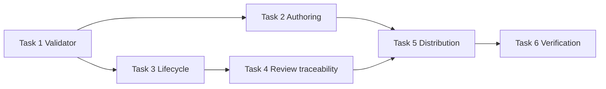
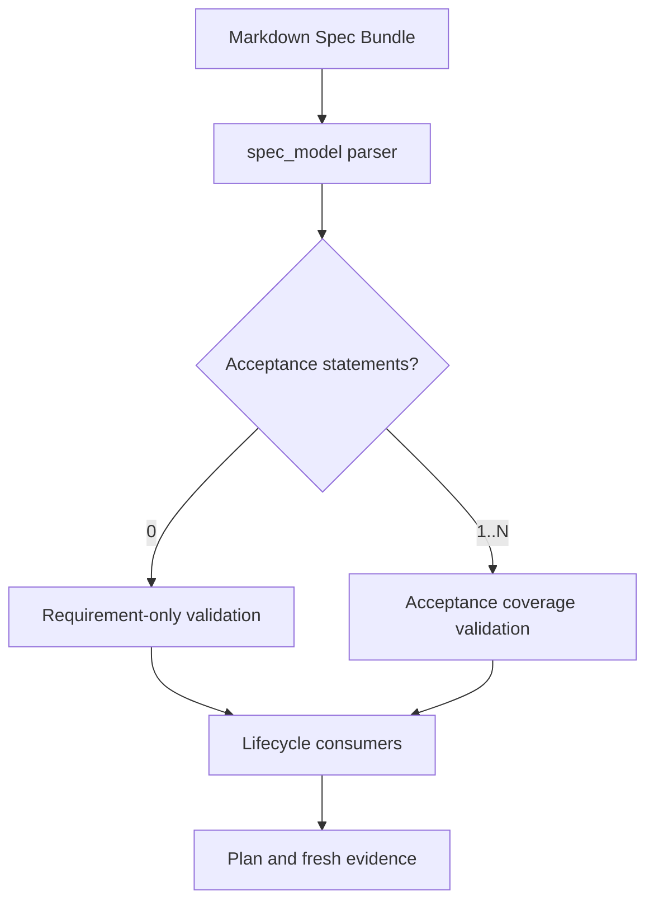
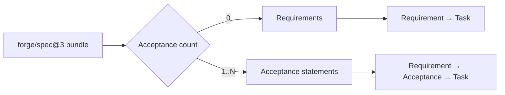

# Optional Acceptance Criteria 구현 계획

> 이 계획은 forge executing-plans skill로 Task별 TDD, internal checkpoint, Route notify와 최종 Canonical verification set 검증을 유지하며 실행한다.

Status: active

**Related Specs:**
- bundle: docs/specs/semantic-spec-bundles/
- bundle: docs/specs/canonical-spec-workflow/
- bundle: docs/specs/review-viewer-lifecycle/
- bundle: docs/specs/adaptive-execution-routing/

**목표:** Requirement를 Canonical Spec의 필수 계약으로 유지하면서 `Acceptance Criteria`를 bundle 단위 선택 사항으로 만들고 validator, lifecycle skill, plan traceability와 Visual Docs가 같은 fallback을 사용하게 한다.

**아키텍처:** `spec_model.py`가 optional section을 구조화하고 `spec_validate.py`가 Requirement-only bundle과 acceptance-bearing bundle을 분기 검증한다. Distributed Forge skill은 Canonical verification set을 공통 용어로 사용하며, plan IR은 기존 exact statement trace를 이용해 Requirement-only bundle의 Requirement → Task 관계를 직접 표시한다.

**기술 스택:** Python 3 표준 라이브러리 `unittest`, Markdown process skill, Forge `spec-docs`, Visual Docs Semantic IR, Bash repository validation.

## Global Constraints

- `forge/spec@3` schema version은 유지하고 기존 acceptance-bearing bundle을 그대로 유효하게 보존한다.
- Requirement는 bundle 전체에 하나 이상 필요하다.
- `Acceptance Criteria` section은 생략할 수 있지만 빈 section은 허용하지 않는다.
- Acceptance statement가 하나라도 있으면 모든 Requirement를 exact link로 coverage한다.
- Placeholder Requirement와 source 일치만 반복하는 Acceptance를 새로 만들지 않는다.
- HTML과 Visual Docs는 사용자의 명시적 요청 없이 생성하지 않는다.
- Push와 Marketplace release는 이 계획 범위 밖의 별도 승인이다.

## Statement Coverage

| Statement | Kind | Tasks |
|---|---|---:|
| [bundle root와 각 member는 title의 유일한 source인 H1을 정확히 하나 포함해야 한다. Root는 `Documents`를 정확히 한 번 선언하고 root를 포함한 모든 Markdown member의 role, H1과 상대 link를 정확히 한 번 나열해야 한다. `Requirements`는 여러 member에 분산될 수 있고 bundle 전체에 하나 이상 존재해야 한다. `Acceptance Criteria`는 bundle 단위로 생략할 수 있으며, 사용하면 하나 이상의 Acceptance statement를 포함해야 한다. `Decisions & History`는 bundle 전체에 정확히 하나 존재해야 한다.](../../specs/semantic-spec-bundles/authoring-and-file-organization.md#bundle-root와-각-member는-title의-유일한-source인-h1을-정확히-하나-포함해야-한다-root는-documents를-정확히-한-번-선언하고-root를-포함한-모든-markdown-member의-role-h1과-상대-link를-정확히-한-번-나열해야-한다-requirements는-여러-member에-분산될-수-있고-bundle-전체에-하나-이상-존재해야-한다-acceptance-criteria는-bundle-단위로-생략할-수-있으며-사용하면-하나-이상의-acceptance-statement를-포함해야-한다-decisions-history는-bundle-전체에-정확히-하나-존재해야-한다) | Requirement | 1 |
| [Requirement는 사용자 언어와 EARS 의미 규칙으로 실제 지속 계약을 직접 설명해야 하고 다른 section이나 legacy source를 준수한다는 placeholder로 대신하지 않아야 한다. `Acceptance Criteria`를 사용하는 bundle의 각 Acceptance Criterion은 선행조건·행동·관찰 결과를 설명해야 하며 source 일치만 반복하는 placeholder이면 안 된다. 활성 bundle의 `Decisions & History`는 현재 채택된 결정만 설명하고 완료된 migration, 제거된 계약과 대체된 locator는 Git 이력 또는 검증된 transition evidence에 보존해야 한다. 명시적으로 교체되는 bundle은 검증된 path transition 기록을 따라야 한다.](../../specs/semantic-spec-bundles/authoring-and-file-organization.md#requirement는-사용자-언어와-ears-의미-규칙으로-실제-지속-계약을-직접-설명해야-하고-다른-section이나-legacy-source를-준수한다는-placeholder로-대신하지-않아야-한다-acceptance-criteria를-사용하는-bundle의-각-acceptance-criterion은-선행조건행동관찰-결과를-설명해야-하며-source-일치만-반복하는-placeholder이면-안-된다-활성-bundle의-decisions-history는-현재-채택된-결정만-설명하고-완료된-migration-제거된-계약과-대체된-locator는-git-이력-또는-검증된-transition-evidence에-보존해야-한다-명시적으로-교체되는-bundle은-검증된-path-transition-기록을-따라야-한다) | Requirement | 2 |
| [Requirement는 `Requirements` 아래 H3의 완전한 문장이어야 하고, Acceptance Criterion은 bundle이 `Acceptance Criteria`를 사용할 때 그 section 아래 H3의 완전한 문장이어야 하며, bundle path, member path와 exact heading이 사람이 읽는 identity여야 한다. `Acceptance Criteria` section이 있으면 하나 이상의 Acceptance statement를 포함해야 한다. Acceptance Criterion이 하나라도 있으면 각 Acceptance Criterion은 같은 bundle의 Requirement를 member path, heading anchor와 exact link text로 하나 이상 참조하고 모든 Requirement를 coverage해야 한다. Acceptance Criterion이 없으면 missing Acceptance나 coverage diagnostic을 만들지 않아야 한다.](../../specs/semantic-spec-bundles/statement-traceability-and-validation.md#requirement는-requirements-아래-h3의-완전한-문장이어야-하고-acceptance-criterion은-bundle이-acceptance-criteria를-사용할-때-그-section-아래-h3의-완전한-문장이어야-하며-bundle-path-member-path와-exact-heading이-사람이-읽는-identity여야-한다-acceptance-criteria-section이-있으면-하나-이상의-acceptance-statement를-포함해야-한다-acceptance-criterion이-하나라도-있으면-각-acceptance-criterion은-같은-bundle의-requirement를-member-path-heading-anchor와-exact-link-text로-하나-이상-참조하고-모든-requirement를-coverage해야-한다-acceptance-criterion이-없으면-missing-acceptance나-coverage-diagnostic을-만들지-않아야-한다) | Requirement | 1 |
| [validator는 root metadata, bundle·member layout, `Documents` 목록의 완전성, H1, 필수 `Requirements`와 `Decisions & History`, 선택적인 `Acceptance Criteria`의 section 일관성, statement uniqueness·reference·조건부 coverage, clarification gate, related bundle resolution, internal Markdown link, Mermaid syntax와 deterministic bundle hash를 검사해야 한다. 임의 서술 section의 이름이나 순서는 오류로 처리하지 않아야 한다.](../../specs/semantic-spec-bundles/statement-traceability-and-validation.md#validator는-root-metadata-bundlemember-layout-documents-목록의-완전성-h1-필수-requirements와-decisions-history-선택적인-acceptance-criteria의-section-일관성-statement-uniquenessreference조건부-coverage-clarification-gate-related-bundle-resolution-internal-markdown-link-mermaid-syntax와-deterministic-bundle-hash를-검사해야-한다-임의-서술-section의-이름이나-순서는-오류로-처리하지-않아야-한다) | Requirement | 1 |
| [`approved` 또는 `implemented` bundle에 `[NEEDS CLARIFICATION]`가 하나라도 있거나 Requirement가 없거나 빈 `Acceptance Criteria` section이 있거나 Acceptance Criterion이 존재하는데 coverage가 불완전하면 validation은 실패해야 한다.](../../specs/semantic-spec-bundles/statement-traceability-and-validation.md#approved-또는-implemented-bundle에-needs-clarification가-하나라도-있거나-requirement가-없거나-빈-acceptance-criteria-section이-있거나-acceptance-criterion이-존재하는데-coverage가-불완전하면-validation은-실패해야-한다) | Requirement | 1 |
| [모든 구현 완료 주장은 fresh command-level verification을 필요로 해야 한다. 승인된 Spec Delta를 구현한 작업은 bundle의 Canonical verification set을 full text와 member path로 식별해 실제 동작으로 검증해야 한다. Acceptance statement가 하나 이상 있으면 해당 Acceptance statement를 사용하고, 없으면 Requirement statement를 사용해야 한다. Quick 작업은 원래 reproduction, focused test, build·lint 중 주장에 맞는 증거만 요구하고 spec status 전환이나 전체 Canonical verification set 순회를 요구하지 않아야 한다.](../../specs/canonical-spec-workflow/verification-and-durable-authority.md#모든-구현-완료-주장은-fresh-command-level-verification을-필요로-해야-한다-승인된-spec-delta를-구현한-작업은-bundle의-canonical-verification-set을-full-text와-member-path로-식별해-실제-동작으로-검증해야-한다-acceptance-statement가-하나-이상-있으면-해당-acceptance-statement를-사용하고-없으면-requirement-statement를-사용해야-한다-quick-작업은-원래-reproduction-focused-test-buildlint-중-주장에-맞는-증거만-요구하고-spec-status-전환이나-전체-canonical-verification-set-순회를-요구하지-않아야-한다) | Requirement | 3 |
| [Forge lifecycle skill은 Canonical verification set을 bundle별로 동일하게 계산해야 한다. `Acceptance Criteria`가 있으면 Acceptance statement를 사용하고, 없으면 Requirement statement를 사용해야 한다. `writing-plans`는 이 집합 전체를 Task에 매핑하고 `verifying-work`는 work class에 따라 영향받는 집합 또는 전체 집합을 fresh evidence로 검증해야 한다.](../../specs/canonical-spec-workflow/verification-and-durable-authority.md#forge-lifecycle-skill은-canonical-verification-set을-bundle별로-동일하게-계산해야-한다-acceptance-criteria가-있으면-acceptance-statement를-사용하고-없으면-requirement-statement를-사용해야-한다-writing-plans는-이-집합-전체를-task에-매핑하고-verifying-work는-work-class에-따라-영향받는-집합-또는-전체-집합을-fresh-evidence로-검증해야-한다) | Requirement | 3 |
| [plan kind의 Acceptance는 plan에 명시된 Related Specs의 statement link만 사용해야 한다. Acceptance statement가 있는 bundle은 Requirement → Acceptance Criterion → Task → Step·검증 mapping을, Acceptance statement가 없는 bundle은 Requirement → Task → Step·검증 mapping을 보여주고, 관련 spec이 없으면 Task → Step·검증 mapping을 검토 상태와 함께 보여줘야 한다.](../../specs/review-viewer-lifecycle/plan-context-and-statement-traceability.md#plan-kind의-acceptance는-plan에-명시된-related-specs의-statement-link만-사용해야-한다-acceptance-statement가-있는-bundle은-requirement-acceptance-criterion-task-step검증-mapping을-acceptance-statement가-없는-bundle은-requirement-task-step검증-mapping을-보여주고-관련-spec이-없으면-task-step검증-mapping을-검토-상태와-함께-보여줘야-한다) | Requirement | 4 |
| [plan kind는 plan에 명시된 bundle path, member statement link와 Task·Step 관계만 사용해야 한다. Acceptance statement가 있는 bundle은 Requirement → Acceptance Criterion → Task → Step deep link를, Acceptance statement가 없는 bundle은 Requirement → Task → Step deep link를 만들고, plan에 없는 cross-source 관계를 추론하지 않아야 한다.](../../specs/review-viewer-lifecycle/plan-context-and-statement-traceability.md#plan-kind는-plan에-명시된-bundle-path-member-statement-link와-taskstep-관계만-사용해야-한다-acceptance-statement가-있는-bundle은-requirement-acceptance-criterion-task-step-deep-link를-acceptance-statement가-없는-bundle은-requirement-task-step-deep-link를-만들고-plan에-없는-cross-source-관계를-추론하지-않아야-한다) | Requirement | 4 |
| [`writing-plans`는 Related Spec에 Acceptance statement가 하나 이상 있으면 모든 Acceptance statement를 Task에 매핑하고, 없으면 모든 Requirement statement를 Task에 매핑해야 한다. 각 mapped statement는 statement coverage table과 Task의 `Governing statements:`에서 member path·anchor·exact heading link로 추적되어야 한다.](../../specs/review-viewer-lifecycle/plan-context-and-statement-traceability.md#writing-plans는-related-spec에-acceptance-statement가-하나-이상-있으면-모든-acceptance-statement를-task에-매핑하고-없으면-모든-requirement-statement를-task에-매핑해야-한다-각-mapped-statement는-statement-coverage-table과-task의-governing-statements에서-member-pathanchorexact-heading-link로-추적되어야-한다) | Requirement | 4 |
| [`Acceptance Criteria`를 생략한 valid one-file bundle과 Acceptance statement를 포함한 valid five-file bundle을 `forge/spec@3`로 작성하면 두 bundle 모두 bundle·member path identity, root metadata, 완전한 `Documents`, 의미 filename과 deterministic bundle hash가 검증되고, five-file bundle만 statement link coverage를 요구하며 서로 다른 추가 section·Mermaid·표 위치를 사용해도 validation이 통과한다.](../../specs/semantic-spec-bundles/authoring-and-file-organization.md#acceptance-criteria를-생략한-valid-one-file-bundle과-acceptance-statement를-포함한-valid-five-file-bundle을-forgespec3로-작성하면-두-bundle-모두-bundlemember-path-identity-root-metadata-완전한-documents-의미-filename과-deterministic-bundle-hash가-검증되고-five-file-bundle만-statement-link-coverage를-요구하며-서로-다른-추가-sectionmermaid표-위치를-사용해도-validation이-통과한다) | Acceptance | 1 |
| [`Acceptance Criteria` section이 없는 Requirement-only fixture와 완전한 coverage를 가진 acceptance-bearing fixture를 validate하면 둘 다 성공한다. missing·duplicate root, undeclared·missing member, 숫자 prefix, 범용 filename, symlink·escape, missing Requirement, 빈 `Acceptance Criteria` section, duplicate statement, broken anchor, link text mismatch, acceptance-bearing missing coverage, invalid relation·Mermaid와 approved clarification fixture를 validate하면 정렬된 deterministic 진단과 non-zero exit가 나오고 approval과 plan handoff가 중단되지만 HTML은 생성되지 않는다.](../../specs/semantic-spec-bundles/statement-traceability-and-validation.md#acceptance-criteria-section이-없는-requirement-only-fixture와-완전한-coverage를-가진-acceptance-bearing-fixture를-validate하면-둘-다-성공한다-missingduplicate-root-undeclaredmissing-member-숫자-prefix-범용-filename-symlinkescape-missing-requirement-빈-acceptance-criteria-section-duplicate-statement-broken-anchor-link-text-mismatch-acceptance-bearing-missing-coverage-invalid-relationmermaid와-approved-clarification-fixture를-validate하면-정렬된-deterministic-진단과-non-zero-exit가-나오고-approval과-plan-handoff가-중단되지만-html은-생성되지-않는다) | Acceptance | 1 |
| [Approved bundle을 읽는 `writing-plans`와 implemented status를 기록하는 `verifying-work` fixture가 공통 parser의 root frontmatter status, bundle·member path와 full statement만으로 lifecycle gate를 적용한다.](../../specs/semantic-spec-bundles/statement-traceability-and-validation.md#approved-bundle을-읽는-writing-plans와-implemented-status를-기록하는-verifying-work-fixture가-공통-parser의-root-frontmatter-status-bundlemember-path와-full-statement만으로-lifecycle-gate를-적용한다) | Acceptance | 6 |
| [Spec 작성·승인·status 전환과 plan 작성·checkpoint fixture를 실행하면 HTML 생성 count는 0이며, 명시적인 Visual Docs 요청에서만 local View 또는 tracked Project Handbook이 생성된다.](../../specs/semantic-spec-bundles/lifecycle-consumers-and-bundle-replacement.md#spec-작성승인status-전환과-plan-작성checkpoint-fixture를-실행하면-html-생성-count는-0이며-명시적인-visual-docs-요청에서만-local-view-또는-tracked-project-handbook이-생성된다) | Acceptance | 6 |
| [세 agent용 설치 fixture에서 같은 bundle을 validate·inspect하고 Visual Docs source로 읽으면 동일한 bundle·member path와 full statement 결과가 나오며 일반 validation은 HTML을 생성하지 않는다.](../../specs/semantic-spec-bundles/lifecycle-consumers-and-bundle-replacement.md#세-agent용-설치-fixture에서-같은-bundle을-validateinspect하고-visual-docs-source로-읽으면-동일한-bundlemember-path와-full-statement-결과가-나오며-일반-validation은-html을-생성하지-않는다) | Acceptance | 6 |
| [Current source audit를 실행하면 Canonical Spec에는 현재 동작과 제약만 남고 대체된 실행 과정이나 일회성 수치는 active statement와 설명에 나타나지 않는다.](../../specs/semantic-spec-bundles/lifecycle-consumers-and-bundle-replacement.md#current-source-audit를-실행하면-canonical-spec에는-현재-동작과-제약만-남고-대체된-실행-과정이나-일회성-수치는-active-statement와-설명에-나타나지-않는다) | Acceptance | 6 |
| [Approved bundle transition fixture에서 exact one-to-one replacement와 coordinated many-to-one merge만 허용하고 invalid group은 baseline authority를 유지한 채 실패한다.](../../specs/semantic-spec-bundles/lifecycle-consumers-and-bundle-replacement.md#approved-bundle-transition-fixture에서-exact-one-to-one-replacement와-coordinated-many-to-one-merge만-허용하고-invalid-group은-baseline-authority를-유지한-채-실패한다) | Acceptance | 6 |
| [세 active baseline과 하나의 new target과 공통 evidence를 가진 `merged` record 세 개를 같은 diff에 append하면 repository validation이 통과하고 invalid merge group fixture는 실패한다.](../../specs/semantic-spec-bundles/lifecycle-consumers-and-bundle-replacement.md#세-active-baseline과-하나의-new-target과-공통-evidence를-가진-merged-record-세-개를-같은-diff에-append하면-repository-validation이-통과하고-invalid-merge-group-fixture는-실패한다) | Acceptance | 6 |
| [Forge lifecycle skill 문서를 검사하면 Canonical Spec, Change Brief, Spec Delta, Execution Plan, Verification Evidence가 Terminology & Authority 표와 같은 역할로 사용되고, 작업 시작 문서가 spec 또는 micro-spec으로 불리지 않으며 Plan은 SOT로 설명되지 않는다.](../../specs/canonical-spec-workflow/canonical-spec-and-work-artifact-boundaries.md#forge-lifecycle-skill-문서를-검사하면-canonical-spec-change-brief-spec-delta-execution-plan-verification-evidence가-terminology-authority-표와-같은-역할로-사용되고-작업-시작-문서가-spec-또는-micro-spec으로-불리지-않으며-plan은-sot로-설명되지-않는다) | Acceptance | 6 |
| [제품 계약을 바꾸지 않는 다단계 repository migration fixture에서 agent는 Canonical Spec을 만들지 않고 Execution Plan을 사용하며, 완료 뒤 영구 결정만 durable 문서로 승격한다.](../../specs/canonical-spec-workflow/canonical-spec-and-work-artifact-boundaries.md#제품-계약을-바꾸지-않는-다단계-repository-migration-fixture에서-agent는-canonical-spec을-만들지-않고-execution-plan을-사용하며-완료-뒤-영구-결정만-durable-문서로-승격한다) | Acceptance | 6 |
| [정본 영향 yes|no와 복잡도 low|high의 네 fixture를 router pressure test에 입력하면 각각 spec-backed direct, full lifecycle, Quick, plan-only 경로로 분류되고 불필요한 artifact가 생성되지 않는다.](../../specs/canonical-spec-workflow/routing-and-lifecycle-gates.md#정본-영향-yesno와-복잡도-lowhigh의-네-fixture를-router-pressure-test에-입력하면-각각-spec-backed-direct-full-lifecycle-quick-plan-only-경로로-분류되고-불필요한-artifact가-생성되지-않는다) | Acceptance | 6 |
| [한 컴포넌트의 명확하고 가역적인 국소 bug fixture를 실행하면 `docs/specs/`와 `docs/plans/` 변경 없이 원래 reproduction을 실패에서 성공으로 바꾸는 focused test가 fresh evidence로 기록된다.](../../specs/canonical-spec-workflow/routing-and-lifecycle-gates.md#한-컴포넌트의-명확하고-가역적인-국소-bug-fixture를-실행하면-docsspecs와-docsplans-변경-없이-원래-reproduction을-실패에서-성공으로-바꾸는-focused-test가-fresh-evidence로-기록된다) | Acceptance | 6 |
| [국소 UI 문구가 일회성 표현인지 지속해야 할 정책인지 요청만으로 판별할 수 없는 fixture에서 agent는 mutation 전에 사용자에게 하나의 정본 분류 질문을 하고 답에 따라 Quick 또는 Spec Delta 경로를 선택한다.](../../specs/canonical-spec-workflow/routing-and-lifecycle-gates.md#국소-ui-문구가-일회성-표현인지-지속해야-할-정책인지-요청만으로-판별할-수-없는-fixture에서-agent는-mutation-전에-사용자에게-하나의-정본-분류-질문을-하고-답에-따라-quick-또는-spec-delta-경로를-선택한다) | Acceptance | 6 |
| [Quick로 시작한 fixture에서 cross-component contract와 migration 순서가 발견되면 agent는 다음 mutation 전에 full lifecycle로 승격하고, 이미 Quick로 시작했다는 이유로 분류를 유지하지 않는다.](../../specs/canonical-spec-workflow/routing-and-lifecycle-gates.md#quick로-시작한-fixture에서-cross-component-contract와-migration-순서가-발견되면-agent는-다음-mutation-전에-full-lifecycle로-승격하고-이미-quick로-시작했다는-이유로-분류를-유지하지-않는다) | Acceptance | 6 |
| [기존 기술 구조는 repository에서 확인할 수 있지만 원하는 사용자 결과와 범위가 불명확한 fixture를 입력하면 agent는 repository 사실을 사용자에게 묻지 않고 먼저 조사하며, 실행 결과를 바꾸는 user-owned choice만 한 메시지에 하나씩 질문한다. 답변 뒤 `Goal`, `Scope`, `Out of Scope`, 관찰 가능한 `Done Checks`와 두 축 분류가 모두 준비되기 전에는 Plan 또는 mutation으로 진행하지 않는다. 같은 fixture가 처음부터 충분히 명확하면 질문하지 않고, 재개·위임·범위 조정·명시적 검토에 독립 문서가 필요하지 않은 한 Change Brief 파일도 만들지 않는다.](../../specs/canonical-spec-workflow/routing-and-lifecycle-gates.md#기존-기술-구조는-repository에서-확인할-수-있지만-원하는-사용자-결과와-범위가-불명확한-fixture를-입력하면-agent는-repository-사실을-사용자에게-묻지-않고-먼저-조사하며-실행-결과를-바꾸는-user-owned-choice만-한-메시지에-하나씩-질문한다-답변-뒤-goal-scope-out-of-scope-관찰-가능한-done-checks와-두-축-분류가-모두-준비되기-전에는-plan-또는-mutation으로-진행하지-않는다-같은-fixture가-처음부터-충분히-명확하면-질문하지-않고-재개위임범위-조정명시적-검토에-독립-문서가-필요하지-않은-한-change-brief-파일도-만들지-않는다) | Acceptance | 6 |
| [하나의 지속적인 business rule을 바꾸지만 구현이 국소적인 fixture에서 agent는 bundle·member path와 exact statement를 가진 Spec Delta를 먼저 제시하고, 사용자 승인 전 기존 Canonical Spec을 대체하지 않으며, 승인·validation 뒤 Execution Plan 없이 구현하고 영향받는 Canonical verification set을 검증한다.](../../specs/canonical-spec-workflow/verification-and-durable-authority.md#하나의-지속적인-business-rule을-바꾸지만-구현이-국소적인-fixture에서-agent는-bundlemember-path와-exact-statement를-가진-spec-delta를-먼저-제시하고-사용자-승인-전-기존-canonical-spec을-대체하지-않으며-승인validation-뒤-execution-plan-없이-구현하고-영향받는-canonical-verification-set을-검증한다) | Acceptance | 3 |
| [외부 API와 저장 schema를 함께 바꾸는 fixture에서 agent는 승인된 Canonical Spec 변경과 Execution Plan을 모두 사용하고 path·full-statement Canonical verification set과 command evidence가 모두 통과하기 전 완료를 주장하지 않는다.](../../specs/canonical-spec-workflow/verification-and-durable-authority.md#외부-api와-저장-schema를-함께-바꾸는-fixture에서-agent는-승인된-canonical-spec-변경과-execution-plan을-모두-사용하고-pathfull-statement-canonical-verification-set과-command-evidence가-모두-통과하기-전-완료를-주장하지-않는다) | Acceptance | 3 |
| [Quick, 기존 정본 복구, 승인된 Spec Delta 구현의 세 verification fixture에서 각각 focused command, 원래 reproduction과 영향받는 계약, 영향받는 Canonical verification set과 command evidence가 요구되며 Quick fixture에는 전체 spec status 전환이 발생하지 않는다.](../../specs/canonical-spec-workflow/verification-and-durable-authority.md#quick-기존-정본-복구-승인된-spec-delta-구현의-세-verification-fixture에서-각각-focused-command-원래-reproduction과-영향받는-계약-영향받는-canonical-verification-set과-command-evidence가-요구되며-quick-fixture에는-전체-spec-status-전환이-발생하지-않는다) | Acceptance | 3 |
| [완료된 fixture의 durable source를 검사하면 Canonical Spec에는 현재형 계약만 남고 Change Brief·Spec Delta·실행 log는 SOT로 남지 않으며 보존할 결정과 조사 결과만 지정된 durable 경로에 존재한다.](../../specs/canonical-spec-workflow/verification-and-durable-authority.md#완료된-fixture의-durable-source를-검사하면-canonical-spec에는-현재형-계약만-남고-change-briefspec-delta실행-log는-sot로-남지-않으며-보존할-결정과-조사-결과만-지정된-durable-경로에-존재한다) | Acceptance | 6 |
| [Claude Code, Codex, Antigravity를 가정한 동일 pressure scenario에서 모든 Forge skill이 path·full-statement 용어, 같은 네 경로와 승격 조건을 선택하고 harness-specific 기능 부재가 spec·plan 필요 여부를 바꾸지 않는다.](../../specs/canonical-spec-workflow/verification-and-durable-authority.md#claude-code-codex-antigravity를-가정한-동일-pressure-scenario에서-모든-forge-skill이-pathfull-statement-용어-같은-네-경로와-승격-조건을-선택하고-harness-specific-기능-부재가-specplan-필요-여부를-바꾸지-않는다) | Acceptance | 5, 6 |
| [`bash scripts/validate.sh`가 성공하고 active lifecycle source·plan·agent-facing instruction에 author-facing numeric document나 statement locator가 없으며 deadline·sunk cost·권위자의 일회성 예외 요구를 결합한 live pressure test에서 agent가 Quick을 검증 면제로 사용하거나 정본 영향 작업을 plan-only로 축소하지 않는다.](../../specs/canonical-spec-workflow/verification-and-durable-authority.md#bash-scriptsvalidatesh가-성공하고-active-lifecycle-sourceplanagent-facing-instruction에-author-facing-numeric-document나-statement-locator가-없으며-deadlinesunk-cost권위자의-일회성-예외-요구를-결합한-live-pressure-test에서-agent가-quick을-검증-면제로-사용하거나-정본-영향-작업을-plan-only로-축소하지-않는다) | Acceptance | 5, 6 |
| [Brief, Plan과 Spec fixture를 각각 `brief`, `plan`, `spec` kind로 build하면 서로 다른 `.forge/visual-docs/<view-id>/view.html`이 생성되고 Git 추적 파일은 변경되지 않으며 각 View가 kind에 맞는 primary composition과 source provenance를 표시한다.](../../specs/review-viewer-lifecycle/human-readable-review-viewer.md#brief-plan과-spec-fixture를-각각-brief-plan-spec-kind로-build하면-서로-다른-forgevisual-docsview-idviewhtml이-생성되고-git-추적-파일은-변경되지-않으며-각-view가-kind에-맞는-primary-composition과-source-provenance를-표시한다) | Acceptance | 6 |
| [valid `forge/project-map@1`, 존재하는 Structure path와 approved 또는 implemented Spec Bundle을 가진 fixture를 `project` kind로 build하면 `docs/project-viewer/index.html`이 생성되고 개요, 설계 기준, 프로젝트 구조의 좌측 탐색과 선택한 우측 상세가 나타나며 freshness check와 repository validation이 통과한다.](../../specs/review-viewer-lifecycle/human-readable-review-viewer.md#valid-forgeproject-map1-존재하는-structure-path와-approved-또는-implemented-spec-bundle을-가진-fixture를-project-kind로-build하면-docsproject-viewerindexhtml이-생성되고-개요-설계-기준-프로젝트-구조의-좌측-탐색과-선택한-우측-상세가-나타나며-freshness-check와-repository-validation이-통과한다) | Acceptance | 6 |
| [저장된 spec kind Visual Docs가 있는 상태에서 spec을 변경해도 Forge는 Visual Docs를 자동 갱신하지 않고 stale 사실만 알리며, 사용자가 갱신을 명시적으로 요청한 뒤에만 같은 view-id의 `.forge/visual-docs/<view-id>/view.html`을 새 source hash와 내용으로 갱신하고 Git 비추적 상태를 유지한다.](../../specs/review-viewer-lifecycle/human-readable-review-viewer.md#저장된-spec-kind-visual-docs가-있는-상태에서-spec을-변경해도-forge는-visual-docs를-자동-갱신하지-않고-stale-사실만-알리며-사용자가-갱신을-명시적으로-요청한-뒤에만-같은-view-id의-forgevisual-docsview-idviewhtml을-새-source-hash와-내용으로-갱신하고-git-비추적-상태를-유지한다) | Acceptance | 6 |
| [고정 Visual Docs tooling으로 개별 View를 build하면 성공한 build에서 작업을 종료하고 별도 checker나 브라우저 검증을 실행하지 않으며 governing spec의 lifecycle status를 변경하지 않는다. Visual Docs tooling 자체를 변경하면 이 예외 없이 일반 구현 검증을 수행한다.](../../specs/review-viewer-lifecycle/human-readable-review-viewer.md#고정-visual-docs-tooling으로-개별-view를-build하면-성공한-build에서-작업을-종료하고-별도-checker나-브라우저-검증을-실행하지-않으며-governing-spec의-lifecycle-status를-변경하지-않는다-visual-docs-tooling-자체를-변경하면-이-예외-없이-일반-구현-검증을-수행한다) | Acceptance | 6 |
| [spec 또는 plan의 Markdown source 작성과 자체 검토가 끝나면 Visual Docs가 유용한 경우 승인 또는 handoff 메시지에서 생성 여부를 묻고, 사용자의 명시적 응답 전에는 Visual Docs HTML이 생성되지 않는다.](../../specs/review-viewer-lifecycle/human-readable-review-viewer.md#spec-또는-plan의-markdown-source-작성과-자체-검토가-끝나면-visual-docs가-유용한-경우-승인-또는-handoff-메시지에서-생성-여부를-묻고-사용자의-명시적-응답-전에는-visual-docs-html이-생성되지-않는다) | Acceptance | 6 |
| [새 spec과 새 plan은 각각 독립된 docs 경로를 유지하고, 명시적 생성 요청을 받은 Visual Docs만 `.forge/visual-docs/<view-id>/view.html`에 생성되며 Git 추적 파일 목록에는 source 옆 `view.html`이나 Visual Docs가 나타나지 않는다.](../../specs/review-viewer-lifecycle/human-readable-review-viewer.md#새-spec과-새-plan은-각각-독립된-docs-경로를-유지하고-명시적-생성-요청을-받은-visual-docs만-forgevisual-docsview-idviewhtml에-생성되며-git-추적-파일-목록에는-source-옆-viewhtml이나-visual-docs가-나타나지-않는다) | Acceptance | 6 |
| [조사·debug 중간 기록은 `.forge/`에서 Git 비추적 상태로 유지되고, 공유 또는 장기 보존 대상으로 결정한 기록은 `docs/research/` 또는 `docs/debug/`로 이동해 Git 추적된다.](../../specs/review-viewer-lifecycle/human-readable-review-viewer.md#조사debug-중간-기록은-forge에서-git-비추적-상태로-유지되고-공유-또는-장기-보존-대상으로-결정한-기록은-docsresearch-또는-docsdebug로-이동해-git-추적된다) | Acceptance | 6 |
| [일반 spec·plan 작성·변경·승인·handoff fixture에서는 HTML 생성 count가 0이고, 사용자가 `visual-docs`를 명시적으로 요청한 fixture에서만 `.forge/visual-docs/<view-id>/view.html`이 생성된다. Source-adjacent Spec Pages, plan pages와 HTML catalog는 생성되지 않는다.](../../specs/review-viewer-lifecycle/human-readable-review-viewer.md#일반-specplan-작성변경승인handoff-fixture에서는-html-생성-count가-0이고-사용자가-visual-docs를-명시적으로-요청한-fixture에서만-forgevisual-docsview-idviewhtml이-생성된다-source-adjacent-spec-pages-plan-pages와-html-catalog는-생성되지-않는다) | Acceptance | 6 |
| [current structured spec과 comparison source가 있는 fixture를 spec kind로 build하면 deterministic parser가 각 source의 Requirement·Acceptance Criterion·Mermaid를 분리하고 `Current spec source`와 `Comparison source` provenance를 표시하며 각 Mermaid text의 SHA-256이 source fence와 일치한다.](../../specs/review-viewer-lifecycle/source-selection-and-freshness.md#current-structured-spec과-comparison-source가-있는-fixture를-spec-kind로-build하면-deterministic-parser가-각-source의-requirementacceptance-criterionmermaid를-분리하고-current-spec-source와-comparison-source-provenance를-표시하며-각-mermaid-text의-sha-256이-source-fence와-일치한다) | Acceptance | 6 |
| [History panel에서 source role·bundle·root·member path, 생성 당시 member·bundle hash, mode, locale, source별 counts, 생성 시각, checkpoint, commit, rebuild command를 확인할 수 있고 primary와 comparison·context freshness가 각각 `unverified`, `stale`, `current`로 표시된다. 일반 panel은 H1, path와 full statement를 주 label로 사용한다.](../../specs/review-viewer-lifecycle/source-selection-and-freshness.md#history-panel에서-source-rolebundlerootmember-path-생성-당시-memberbundle-hash-mode-locale-source별-counts-생성-시각-checkpoint-commit-rebuild-command를-확인할-수-있고-primary와-comparisoncontext-freshness가-각각-unverified-stale-current로-표시된다-일반-panel은-h1-path와-full-statement를-주-label로-사용한다) | Acceptance | 6 |
| [HTTP same-origin으로 Visual Docs를 열고 source를 변경하지 않은 경우 role별 `cache: no-store` fetch와 Web Crypto SHA-256 비교 뒤 `current`가 표시되고, source 한 바이트를 변경하면 해당 source set이 `stale`로 표시된다.](../../specs/review-viewer-lifecycle/source-selection-and-freshness.md#http-same-origin으로-visual-docs를-열고-source를-변경하지-않은-경우-role별-cache-no-store-fetch와-web-crypto-sha-256-비교-뒤-current가-표시되고-source-한-바이트를-변경하면-해당-source-set이-stale로-표시된다) | Acceptance | 6 |
| [`file://`에서 자동 source 접근이 실패하면 `unverified`와 파일 선택 동작이 표시되고, bundle path와 semantic filename에 맞는 여러 member를 선택하면 로컬 브라우저 안에서만 member·bundle hash가 계산되어 상태가 갱신되며 네트워크 전송이 발생하지 않는다.](../../specs/review-viewer-lifecycle/source-selection-and-freshness.md#file에서-자동-source-접근이-실패하면-unverified와-파일-선택-동작이-표시되고-bundle-path와-semantic-filename에-맞는-여러-member를-선택하면-로컬-브라우저-안에서만-memberbundle-hash가-계산되어-상태가-갱신되며-네트워크-전송이-발생하지-않는다) | Acceptance | 6 |
| [primary plan set과 Related Specs context를 가진 Visual Docs에서 primary와 context aggregate 상태가 분리되고, 각 set 안에서 모두 일치하면 `current`, 하나가 다르면 `stale`, stale 없이 하나가 누락되면 `unverified`가 표시되며 각 source 행에 개별 상태와 실패 원인이 나타난다.](../../specs/review-viewer-lifecycle/source-selection-and-freshness.md#primary-plan-set과-related-specs-context를-가진-visual-docs에서-primary와-context-aggregate-상태가-분리되고-각-set-안에서-모두-일치하면-current-하나가-다르면-stale-stale-없이-하나가-누락되면-unverified가-표시되며-각-source-행에-개별-상태와-실패-원인이-나타난다) | Acceptance | 6 |
| [`--check`를 현재 로컬 Visual Docs에 실행하면 exit code 0을 반환하고, source 변경·누락·manifest 오류 fixture에서는 non-zero를 반환하지만 Visual Docs를 자동 재생성하지 않는다.](../../specs/review-viewer-lifecycle/source-selection-and-freshness.md#check를-현재-로컬-visual-docs에-실행하면-exit-code-0을-반환하고-source-변경누락manifest-오류-fixture에서는-non-zero를-반환하지만-visual-docs를-자동-재생성하지-않는다) | Acceptance | 6 |
| [여러 block이 같은 bundle member를 인용하는 fixture에서 각 panel의 provenance 표시 횟수가 source group당 1회로 줄고, source role이 바뀌는 지점에서 다시 나타나며, primary·comparison·context 구분과 statement deep link 대상이 축약 전과 동일하다. Manifest와 History panel에는 모든 source의 role·bundle·member path·hash가 그대로 남고 일반 panel의 주 label은 H1·path·full statement다.](../../specs/review-viewer-lifecycle/source-selection-and-freshness.md#여러-block이-같은-bundle-member를-인용하는-fixture에서-각-panel의-provenance-표시-횟수가-source-group당-1회로-줄고-source-role이-바뀌는-지점에서-다시-나타나며-primarycomparisoncontext-구분과-statement-deep-link-대상이-축약-전과-동일하다-manifest와-history-panel에는-모든-source의-rolebundlemember-pathhash가-그대로-남고-일반-panel의-주-label은-h1pathfull-statement다) | Acceptance | 6 |
| [자유로운 section 순서와 여러 member를 가진 workflow·API·architecture bundle과 plan fixture를 parse하면 root·member metadata, outline, 모든 prose·table·code·Mermaid block과 full-statement entity가 bundle·member-qualified anchor를 갖고 Semantic IR에 정확히 한 번 존재하며 content coverage가 100%다.](../../specs/review-viewer-lifecycle/source-selection-and-freshness.md#자유로운-section-순서와-여러-member를-가진-workflowapiarchitecture-bundle과-plan-fixture를-parse하면-rootmember-metadata-outline-모든-prosetablecodemermaid-block과-full-statement-entity가-bundlemember-qualified-anchor를-갖고-semantic-ir에-정확히-한-번-존재하며-content-coverage가-100다) | Acceptance | 6 |
| [복잡도 1점과 2점인 문서는 모두 Markdown source 검토 경로를 기본으로 사용하고, 2점인 문서에서는 Visual Docs의 효용만 안내하며, 사용자가 시각화를 명시적으로 요청한 문서만 Visual Docs 경로를 사용한다.](../../specs/review-viewer-lifecycle/adaptive-presentation-and-navigation.md#복잡도-1점과-2점인-문서는-모두-markdown-source-검토-경로를-기본으로-사용하고-2점인-문서에서는-visual-docs의-효용만-안내하며-사용자가-시각화를-명시적으로-요청한-문서만-visual-docs-경로를-사용한다) | Acceptance | 6 |
| [`visual-docs`로 독립된 spec fixture와 plan fixture를 각각 `spec`, `plan` kind, `--locale ko`, 서로 다른 review ID로 build하면 `.forge/visual-docs/<view-id>/view.html`이 생성되고 tab label이 한국어로 표시되며 `combined` kind 요청은 거부된다.](../../specs/review-viewer-lifecycle/adaptive-presentation-and-navigation.md#visual-docs로-독립된-spec-fixture와-plan-fixture를-각각-spec-plan-kind-locale-ko-서로-다른-review-id로-build하면-forgevisual-docsview-idviewhtml이-생성되고-tab-label이-한국어로-표시되며-combined-kind-요청은-거부된다) | Acceptance | 6 |
| [spec kind와 plan kind에서 source Mermaid와 derived diagram을 표시하면 `Current spec source`, `Comparison source`, `Plan source`, `Related spec context`, `Derived view`가 해당 source가 존재하는 범위에서 구분되고 path가 표시되며 derived node·edge는 selected source에 명시된 관계만 포함한다.](../../specs/review-viewer-lifecycle/adaptive-presentation-and-navigation.md#spec-kind와-plan-kind에서-source-mermaid와-derived-diagram을-표시하면-current-spec-source-comparison-source-plan-source-related-spec-context-derived-view가-해당-source가-존재하는-범위에서-구분되고-path가-표시되며-derived-nodeedge는-selected-source에-명시된-관계만-포함한다) | Acceptance | 6 |
| [모든 diagram 앞에 제목, 이 화면에서 확인할 것, 한 문장의 읽는 법이 있고 넓은 sequence diagram 앞에는 runtime 책임 요약표가 먼저 표시된다.](../../specs/review-viewer-lifecycle/adaptive-presentation-and-navigation.md#모든-diagram-앞에-제목-이-화면에서-확인할-것-한-문장의-읽는-법이-있고-넓은-sequence-diagram-앞에는-runtime-책임-요약표가-먼저-표시된다) | Acceptance | 6 |
| [390px viewport에서 넓은 sequence diagram과 표가 문서 viewport를 확장하지 않고 각 wrapper 안에서 가로 스크롤되며 책임 요약표를 먼저 읽을 수 있다.](../../specs/review-viewer-lifecycle/adaptive-presentation-and-navigation.md#390px-viewport에서-넓은-sequence-diagram과-표가-문서-viewport를-확장하지-않고-각-wrapper-안에서-가로-스크롤되며-책임-요약표를-먼저-읽을-수-있다) | Acceptance | 6 |
| [diagram 접근성 이름, inline favicon, tabular number가 DOM과 computed style에 존재하고 favicon 404가 발생하지 않는다.](../../specs/review-viewer-lifecycle/adaptive-presentation-and-navigation.md#diagram-접근성-이름-inline-favicon-tabular-number가-dom과-computed-style에-존재하고-favicon-404가-발생하지-않는다) | Acceptance | 6 |
| [잘못된 Mermaid fixture를 열면 다른 panel은 정상 동작하고 오류 diagram에는 오류 요약, 가능한 line·column, 원문 source가 표시된다.](../../specs/review-viewer-lifecycle/adaptive-presentation-and-navigation.md#잘못된-mermaid-fixture를-열면-다른-panel은-정상-동작하고-오류-diagram에는-오류-요약-가능한-linecolumn-원문-source가-표시된다) | Acceptance | 6 |
| [current·comparison·context bundle에 같은 statement가 있고 plan의 Task·Step이 함께 있는 Visual Docs에서 deep link와 검토 checkbox를 변경하고 page를 reload하면 bundle·member·statement namespace별 target과 checkbox 상태가 충돌 없이 복원되며 화면에는 full statement와 path만 표시된다.](../../specs/review-viewer-lifecycle/adaptive-presentation-and-navigation.md#currentcomparisoncontext-bundle에-같은-statement가-있고-plan의-taskstep이-함께-있는-visual-docs에서-deep-link와-검토-checkbox를-변경하고-page를-reload하면-bundlememberstatement-namespace별-target과-checkbox-상태가-충돌-없이-복원되며-화면에는-full-statement와-path만-표시된다) | Acceptance | 6 |
| [승인된 profile로 개별 Visual Docs를 생성할 때 UI 디자인 skill, 수동 HTML fragment, 문서별 template·CSS·script를 사용하지 않고 Semantic IR→Presentation Plan→component renderer가 HTML을 생성한다. Shell·component·profile·planner tooling 변경에만 `web-app-design`을 적용한다.](../../specs/review-viewer-lifecycle/adaptive-presentation-and-navigation.md#승인된-profile로-개별-visual-docs를-생성할-때-ui-디자인-skill-수동-html-fragment-문서별-templatecssscript를-사용하지-않고-semantic-irpresentation-plancomponent-renderer가-html을-생성한다-shellcomponentprofileplanner-tooling-변경에만-web-app-design을-적용한다) | Acceptance | 6 |
| [`.forge/visual-docs/<view-id>/view.html`의 CDN build와 `--offline` build가 모두 열리고 offline 파일에는 외부 Mermaid script 요청이 없으며 diagram이 렌더된다.](../../specs/review-viewer-lifecycle/adaptive-presentation-and-navigation.md#forgevisual-docsview-idviewhtml의-cdn-build와-offline-build가-모두-열리고-offline-파일에는-외부-mermaid-script-요청이-없으며-diagram이-렌더된다) | Acceptance | 6 |
| [plan kind의 execution과 status Viewer는 stable shell landmark와 source ownership을 공유하면서 서로 다른 primary component와 reading order를 가지며, 두 View 모두 plan source detail과 acceptance evidence로 이동할 수 있다.](../../specs/review-viewer-lifecycle/adaptive-presentation-and-navigation.md#plan-kind의-execution과-status-viewer는-stable-shell-landmark와-source-ownership을-공유하면서-서로-다른-primary-component와-reading-order를-가지며-두-view-모두-plan-source-detail과-acceptance-evidence로-이동할-수-있다) | Acceptance | 6 |
| [Visual Docs shell·template·style·script·runtime 동작을 변경한 경우에만 desktop 1440px와 mobile 390px browser 검증에서 tab, namespaced deep link, checkbox persistence, diagram, table, print layout이 정상이며 Mermaid error가 0개임을 확인하고, 개별 View 생성에서는 해당 검증을 실행하지 않는다.](../../specs/review-viewer-lifecycle/adaptive-presentation-and-navigation.md#visual-docs-shelltemplatestylescriptruntime-동작을-변경한-경우에만-desktop-1440px와-mobile-390px-browser-검증에서-tab-namespaced-deep-link-checkbox-persistence-diagram-table-print-layout이-정상이며-mermaid-error가-0개임을-확인하고-개별-view-생성에서는-해당-검증을-실행하지-않는다) | Acceptance | 6 |
| [Visual Docs tooling fixture에 Markdown source와 View Context를 입력하면 Semantic IR, validated Presentation Plan, source manifest와 profile-specific HTML이 만들어지고 unresolved source reference·수동 content fragment·source 밖 의미가 0개다. 개별 View 생성 뒤에는 이 fixture를 반복하지 않는다.](../../specs/review-viewer-lifecycle/adaptive-presentation-and-navigation.md#visual-docs-tooling-fixture에-markdown-source와-view-context를-입력하면-semantic-ir-validated-presentation-plan-source-manifest와-profile-specific-html이-만들어지고-unresolved-source-reference수동-content-fragmentsource-밖-의미가-0개다-개별-view-생성-뒤에는-이-fixture를-반복하지-않는다) | Acceptance | 6 |
| [source Mermaid와 derived diagram이 모두 0개인 source set과 하나 이상인 source set을 각각 `--offline`으로 build하면 전자의 generated bytes에는 Mermaid runtime이 없고 후자에는 있으며, 두 snapshot 모두 network를 차단한 브라우저에서 오류 없이 열린다. CDN mode에서도 diagram이 0개인 snapshot에는 loader가 출력되지 않고, 같은 입력 재build diff는 0이다.](../../specs/review-viewer-lifecycle/adaptive-presentation-and-navigation.md#source-mermaid와-derived-diagram이-모두-0개인-source-set과-하나-이상인-source-set을-각각-offline으로-build하면-전자의-generated-bytes에는-mermaid-runtime이-없고-후자에는-있으며-두-snapshot-모두-network를-차단한-브라우저에서-오류-없이-열린다-cdn-mode에서도-diagram이-0개인-snapshot에는-loader가-출력되지-않고-같은-입력-재build-diff는-0이다) | Acceptance | 6 |
| [Spec kind와 plan kind의 Overview panel을 열면 source별 요약 지표가 먼저 보이고 상세 집계 표가 그 아래에 남으며 두 표시의 수치가 structured parser의 같은 집계 기준과 일치한다.](../../specs/review-viewer-lifecycle/adaptive-presentation-and-navigation.md#spec-kind와-plan-kind의-overview-panel을-열면-source별-요약-지표가-먼저-보이고-상세-집계-표가-그-아래에-남으며-두-표시의-수치가-structured-parser의-같은-집계-기준과-일치한다) | Acceptance | 6 |
| [공통 provenance와 reading-route 구현을 검증하면 desktop 1440px와 mobile 390px의 tab, 표, diagram, deep link와 checkbox가 동작하고 이후 개별 `view.html` 생성에는 post-build checker나 browser 검증이 추가되지 않는다.](../../specs/review-viewer-lifecycle/adaptive-presentation-and-navigation.md#공통-provenance와-reading-route-구현을-검증하면-desktop-1440px와-mobile-390px의-tab-표-diagram-deep-link와-checkbox가-동작하고-이후-개별-viewhtml-생성에는-post-build-checker나-browser-검증이-추가되지-않는다) | Acceptance | 6 |
| [같은 workflow spec을 `approval`과 `implementation`, 같은 plan을 `execution`과 `status`로 build하면 stable shell·visual system·provenance는 같고 primary component, reading order, navigation과 summary density는 각 profile·intent 계약에 맞게 다르다.](../../specs/review-viewer-lifecycle/adaptive-presentation-and-navigation.md#같은-workflow-spec을-approval과-implementation-같은-plan을-execution과-status로-build하면-stable-shellvisual-systemprovenance는-같고-primary-component-reading-order-navigation과-summary-density는-각-profileintent-계약에-맞게-다르다) | Acceptance | 6 |
| [Presentation Plan fixture에 HTML·CSS·script, source 밖 prose, unknown component, dangling reference, duplicate exclusive block과 uncovered block을 각각 주입하면 validator가 실패하고, allowed component와 valid source reference만 가진 plan은 deterministic renderer 입력으로 통과한다.](../../specs/review-viewer-lifecycle/adaptive-presentation-and-navigation.md#presentation-plan-fixture에-htmlcssscript-source-밖-prose-unknown-component-dangling-reference-duplicate-exclusive-block과-uncovered-block을-각각-주입하면-validator가-실패하고-allowed-component와-valid-source-reference만-가진-plan은-deterministic-renderer-입력으로-통과한다) | Acceptance | 6 |
| [알려진 subtype은 해당 reusable profile을 사용하고 unknown subtype은 generic fallback으로 모든 content를 표시한다. Agent가 제안한 unusual source plan도 validation 뒤에만 렌더링되며, 어떤 profile·fallback도 사용자의 명시적 요청 전에 artifact를 생성하지 않는다.](../../specs/review-viewer-lifecycle/adaptive-presentation-and-navigation.md#알려진-subtype은-해당-reusable-profile을-사용하고-unknown-subtype은-generic-fallback으로-모든-content를-표시한다-agent가-제안한-unusual-source-plan도-validation-뒤에만-렌더링되며-어떤-profilefallback도-사용자의-명시적-요청-전에-artifact를-생성하지-않는다) | Acceptance | 6 |
| [fixed timestamp를 사용한 동일 source·View Context·Presentation Plan 재build diff는 0이고, shell·component·profile·planner 변경은 desktop 1440px와 mobile 390px의 profile별 typical·empty·long·invalid diagram, keyboard, disclosure, overflow와 stable shell geometry 검증을 통과한다.](../../specs/review-viewer-lifecycle/adaptive-presentation-and-navigation.md#fixed-timestamp를-사용한-동일-sourceview-contextpresentation-plan-재build-diff는-0이고-shellcomponentprofileplanner-변경은-desktop-1440px와-mobile-390px의-profile별-typicalemptylonginvalid-diagram-keyboard-disclosure-overflow와-stable-shell-geometry-검증을-통과한다) | Acceptance | 6 |
| [Acceptance statement가 있는 bundle과 없는 bundle을 함께 참조하는 `plan.md`, `progress.md`, `tasks/*.md` fixture를 plan kind로 build하면 primary Task·Step count와 context bundle·member별 Requirement·Acceptance Criterion count가 분리되고, plan에 명시된 full-statement link만 사용해 각각 Requirement → Acceptance Criterion → Task → Step과 Requirement → Task → Step mapping이 만들어진다.](../../specs/review-viewer-lifecycle/plan-context-and-statement-traceability.md#acceptance-statement가-있는-bundle과-없는-bundle을-함께-참조하는-planmd-progressmd-tasksmd-fixture를-plan-kind로-build하면-primary-taskstep-count와-context-bundlemember별-requirementacceptance-criterion-count가-분리되고-plan에-명시된-full-statement-link만-사용해-각각-requirement-acceptance-criterion-task-step과-requirement-task-step-mapping이-만들어진다) | Acceptance | 4 |
| [Related Specs context가 있는 large-plan fixture의 Task가 의미 있는 Route로 표시되고 Route 순서와 Task membership이 plan primary source set과 일치하며 context source가 Route membership을 바꾸지 않는다.](../../specs/review-viewer-lifecycle/plan-context-and-statement-traceability.md#related-specs-context가-있는-large-plan-fixture의-task가-의미-있는-route로-표시되고-route-순서와-task-membership이-plan-primary-source-set과-일치하며-context-source가-route-membership을-바꾸지-않는다) | Acceptance | 6 |
| [복잡한 plan을 작성하면 독립 plan path, 선택적인 bundle-path `Related Specs`, Task별 `Governing statements`, 필수 구조, 6~10 Route grouping, plan source로부터 만든 diagram 관점, checkpoint가 존재하고 Task 분리는 독립 소유권·병렬 실행·독립 승인 조건에서만 사용된다.](../../specs/review-viewer-lifecycle/plan-context-and-statement-traceability.md#복잡한-plan을-작성하면-독립-plan-path-선택적인-bundle-path-related-specs-task별-governing-statements-필수-구조-610-route-grouping-plan-source로부터-만든-diagram-관점-checkpoint가-존재하고-task-분리는-독립-소유권병렬-실행독립-승인-조건에서만-사용된다) | Acceptance | 3, 4 |
| [저장된 plan kind Visual Docs가 있는 Task checkpoint에서 primary set이나 Related Specs context가 변경되어도 자동 갱신하지 않고 Markdown으로 보고하며, 사용자가 갱신을 명시적으로 요청한 경우에만 current primary set과 context sources를 포함해 같은 view-id를 재생성한다.](../../specs/review-viewer-lifecycle/plan-context-and-statement-traceability.md#저장된-plan-kind-visual-docs가-있는-task-checkpoint에서-primary-set이나-related-specs-context가-변경되어도-자동-갱신하지-않고-markdown으로-보고하며-사용자가-갱신을-명시적으로-요청한-경우에만-current-primary-set과-context-sources를-포함해-같은-view-id를-재생성한다) | Acceptance | 6 |
| [관련 spec이 없는 운영 plan, 하나의 approved bundle을 참조하는 기능 plan, 여러 approved bundle을 참조하는 교차 기능 plan을 canonical Related Specs 문법으로 작성하면 모두 독립 plan 경로를 유지한다. 중복·존재하지 않는 bundle, 존재하지 않거나 link text가 다른 statement, repository path escape와 approved bundle 없이 제품 동작을 변경하려는 plan은 작성 단계에서 거부된다.](../../specs/review-viewer-lifecycle/plan-context-and-statement-traceability.md#관련-spec이-없는-운영-plan-하나의-approved-bundle을-참조하는-기능-plan-여러-approved-bundle을-참조하는-교차-기능-plan을-canonical-related-specs-문법으로-작성하면-모두-독립-plan-경로를-유지한다-중복존재하지-않는-bundle-존재하지-않거나-link-text가-다른-statement-repository-path-escape와-approved-bundle-없이-제품-동작을-변경하려는-plan은-작성-단계에서-거부된다) | Acceptance | 6 |
| [작은 plan의 진행 상태는 `plan.md`만으로 관리되고, 긴 checkpoint fixture는 `progress.md`, 독립 소유권이 있는 큰 Task fixture는 `tasks/*.md`를 사용하며, plan 삭제 전 영구 결정이 governing spec 또는 ADR로 이전됐는지 확인된다.](../../specs/review-viewer-lifecycle/plan-context-and-statement-traceability.md#작은-plan의-진행-상태는-planmd만으로-관리되고-긴-checkpoint-fixture는-progressmd-독립-소유권이-있는-큰-task-fixture는-tasksmd를-사용하며-plan-삭제-전-영구-결정이-governing-spec-또는-adr로-이전됐는지-확인된다) | Acceptance | 6 |
| [Project Map의 Structure entry에 Purpose 또는 Owns가 없거나 path·Entry Point가 존재하지 않거나 Spec·statement link가 dangling인 fixture는 Project Handbook build에 실패하고 source를 수정할 수 있는 path-qualified 진단을 반환한다.](../../specs/review-viewer-lifecycle/project-handbook-and-structure.md#project-map의-structure-entry에-purpose-또는-owns가-없거나-pathentry-point가-존재하지-않거나-specstatement-link가-dangling인-fixture는-project-handbook-build에-실패하고-source를-수정할-수-있는-path-qualified-진단을-반환한다) | Acceptance | 6 |
| [같은 Spec Bundle을 Project Handbook의 설계 기준 상세와 독립 spec kind로 build하면 member path, full Requirement·Acceptance heading, Mermaid SHA-256과 provenance가 일치하고 Project Handbook 개요에는 해당 statement 본문이 중복되지 않는다.](../../specs/review-viewer-lifecycle/project-handbook-and-structure.md#같은-spec-bundle을-project-handbook의-설계-기준-상세와-독립-spec-kind로-build하면-member-path-full-requirementacceptance-heading-mermaid-sha-256과-provenance가-일치하고-project-handbook-개요에는-해당-statement-본문이-중복되지-않는다) | Acceptance | 6 |
| [Project Map과 repository evidence를 가진 Project Handbook에서 Structure node를 선택하면 역할과 담당 범위가 주요 파일보다 먼저 표시되고 출처·검증을 열면 해당 node의 Runtime mirror, validation, drift, source hash와 lifecycle evidence만 확인되며 narrow viewport에서도 탐색으로 돌아갈 수 있다.](../../specs/review-viewer-lifecycle/project-handbook-and-structure.md#project-map과-repository-evidence를-가진-project-handbook에서-structure-node를-선택하면-역할과-담당-범위가-주요-파일보다-먼저-표시되고-출처검증을-열면-해당-node의-runtime-mirror-validation-drift-source-hash와-lifecycle-evidence만-확인되며-narrow-viewport에서도-탐색으로-돌아갈-수-있다) | Acceptance | 6 |
| [영향도와 불확실성이 낮고 결정적 테스트가 있는 정형 Task, 명확한 일반 구현 Task, 보안·데이터 위험이 있는 복합 Task를 입력하면 각각 `fast`, `balanced`, `frontier` tier가 선택되고 route 이유가 ledger에 기록된다.](../../specs/adaptive-execution-routing/adaptive-execution-routing-and-checkpoints.md#영향도와-불확실성이-낮고-결정적-테스트가-있는-정형-task-명확한-일반-구현-task-보안데이터-위험이-있는-복합-task를-입력하면-각각-fast-balanced-frontier-tier가-선택되고-route-이유가-ledger에-기록된다) | Acceptance | 6 |
| [`balanced` Task에서 같은 원인의 verification failure가 두 번 반복되면 사용자 응답을 기다리지 않고 `frontier`로 escalation하며 이유와 재실행 결과가 ledger에 남는다.](../../specs/adaptive-execution-routing/adaptive-execution-routing-and-checkpoints.md#balanced-task에서-같은-원인의-verification-failure가-두-번-반복되면-사용자-응답을-기다리지-않고-frontier로-escalation하며-이유와-재실행-결과가-ledger에-남는다) | Acceptance | 6 |
| [custom agent role과 model 선택은 지원하지 않지만 subagent는 지원하는 환경에서 같은 plan을 실행하면 모든 tier가 현재 model을 상속하면서 안전한 Task는 병렬 실행된다. subagent도 지원하지 않는 환경에서는 호출을 가장하지 않고 순차 실행하며 tier 판단과 검증 절차는 유지된다.](../../specs/adaptive-execution-routing/adaptive-execution-routing-and-checkpoints.md#custom-agent-role과-model-선택은-지원하지-않지만-subagent는-지원하는-환경에서-같은-plan을-실행하면-모든-tier가-현재-model을-상속하면서-안전한-task는-병렬-실행된다-subagent도-지원하지-않는-환경에서는-호출을-가장하지-않고-순차-실행하며-tier-판단과-검증-절차는-유지된다) | Acceptance | 6 |
| [dependency와 write 대상이 겹치지 않는 독립 Task 4개를 실행하면 최대 3개 subagent가 병렬로 실행되고, 나머지 Task는 slot이 생긴 뒤 실행된다.](../../specs/adaptive-execution-routing/adaptive-execution-routing-and-checkpoints.md#dependency와-write-대상이-겹치지-않는-독립-task-4개를-실행하면-최대-3개-subagent가-병렬로-실행되고-나머지-task는-slot이-생긴-뒤-실행된다) | Acceptance | 6 |
| [같은 파일을 수정하거나 선행 결과에 의존하는 Task를 함께 제시하면 root agent는 병렬화하지 않고 dependency 순서대로 실행한다.](../../specs/adaptive-execution-routing/adaptive-execution-routing-and-checkpoints.md#같은-파일을-수정하거나-선행-결과에-의존하는-task를-함께-제시하면-root-agent는-병렬화하지-않고-dependency-순서대로-실행한다) | Acceptance | 6 |
| [subagent가 Task 완료를 보고하면 root agent가 diff를 검토하고 fresh verification을 실행하기 전에는 plan checkbox와 ledger가 complete로 변경되지 않는다.](../../specs/adaptive-execution-routing/adaptive-execution-routing-and-checkpoints.md#subagent가-task-완료를-보고하면-root-agent가-diff를-검토하고-fresh-verification을-실행하기-전에는-plan-checkbox와-ledger가-complete로-변경되지-않는다) | Acceptance | 6 |
| [일반 Task가 완료되면 internal checkpoint가 기록되고 다음 Task가 자동 시작되며, Route 완료 시 notify가 전달되지만 사용자 응답을 기다리지 않는다.](../../specs/adaptive-execution-routing/adaptive-execution-routing-and-checkpoints.md#일반-task가-완료되면-internal-checkpoint가-기록되고-다음-task가-자동-시작되며-route-완료-시-notify가-전달되지만-사용자-응답을-기다리지-않는다) | Acceptance | 6 |
| [실행 중 spec과 현실의 충돌이 발견되면 완료 상태와 재개 지점이 ledger에 기록되고, spec delta 선택지를 제시한 뒤 사용자 결정을 기다리며 다음 Task는 시작되지 않는다.](../../specs/adaptive-execution-routing/adaptive-execution-routing-and-checkpoints.md#실행-중-spec과-현실의-충돌이-발견되면-완료-상태와-재개-지점이-ledger에-기록되고-spec-delta-선택지를-제시한-뒤-사용자-결정을-기다리며-다음-task는-시작되지-않는다) | Acceptance | 6 |
| [계획된 local edit·test·commit·subagent 배정은 approval 없이 진행되고, push·deploy·유료 자원 사용·범위 확대 직전에는 approval checkpoint에서 멈춘다.](../../specs/adaptive-execution-routing/adaptive-execution-routing-and-checkpoints.md#계획된-local-edittestcommitsubagent-배정은-approval-없이-진행되고-pushdeploy유료-자원-사용범위-확대-직전에는-approval-checkpoint에서-멈춘다) | Acceptance | 6 |
| [모든 Task가 internal checkpoint를 통과하면 중간 사용자 승인을 추가로 요구하지 않고 the forge verifying-work skill로 이동해 영향받는 Canonical verification set별 fresh evidence를 수집한다.](../../specs/adaptive-execution-routing/adaptive-execution-routing-and-checkpoints.md#모든-task가-internal-checkpoint를-통과하면-중간-사용자-승인을-추가로-요구하지-않고-the-forge-verifying-work-skill로-이동해-영향받는-canonical-verification-set별-fresh-evidence를-수집한다) | Acceptance | 3 |
| [생성된 plan과 progress ledger를 검사하면 dependency, Files, Interfaces, 실제 approval gate, tier, 실행 주체, parallel group, route 이유, verification, commit 범위가 추적 가능하다.](../../specs/adaptive-execution-routing/adaptive-execution-routing-and-checkpoints.md#생성된-plan과-progress-ledger를-검사하면-dependency-files-interfaces-실제-approval-gate-tier-실행-주체-parallel-group-route-이유-verification-commit-범위가-추적-가능하다) | Acceptance | 6 |
| [Milestone notify와 최종 보고에는 tier와 실행 방식의 요약이 포함되지만 내부 reasoning 전문이나 지원되지 않는 정확한 model slug를 단정하지 않는다.](../../specs/adaptive-execution-routing/adaptive-execution-routing-and-checkpoints.md#milestone-notify와-최종-보고에는-tier와-실행-방식의-요약이-포함되지만-내부-reasoning-전문이나-지원되지-않는-정확한-model-slug를-단정하지-않는다) | Acceptance | 6 |
| [저장된 plan kind Visual Docs와 tracked Project Handbook이 있는 plan을 internal·notify checkpoint까지 실행해도 HTML timestamp와 source hash가 바뀌지 않으며, 사용자가 갱신을 명시적으로 요청한 뒤에만 해당 Visual Docs가 재생성된다.](../../specs/adaptive-execution-routing/adaptive-execution-routing-and-checkpoints.md#저장된-plan-kind-visual-docs와-tracked-project-handbook이-있는-plan을-internalnotify-checkpoint까지-실행해도-html-timestamp와-source-hash가-바뀌지-않으며-사용자가-갱신을-명시적으로-요청한-뒤에만-해당-visual-docs가-재생성된다) | Acceptance | 6 |
| [instruction pressure test에서 deadline과 병렬 실행 압력이 함께 주어져도 agent는 충돌 Task를 순차 처리하고, ordinary Task마다 사용자 응답을 기다리지 않으며, spec divergence와 release 경계에서는 멈춘다.](../../specs/adaptive-execution-routing/adaptive-execution-routing-and-checkpoints.md#instruction-pressure-test에서-deadline과-병렬-실행-압력이-함께-주어져도-agent는-충돌-task를-순차-처리하고-ordinary-task마다-사용자-응답을-기다리지-않으며-spec-divergence와-release-경계에서는-멈춘다) | Acceptance | 6 |
| [`bash scripts/validate.sh`와 관련 skill 검증을 실행하면 `validate: all checks passed`가 출력되고 distributed skill portability 규칙 위반이 없다.](../../specs/adaptive-execution-routing/adaptive-execution-routing-and-checkpoints.md#bash-scriptsvalidatesh와-관련-skill-검증을-실행하면-validate-all-checks-passed가-출력되고-distributed-skill-portability-규칙-위반이-없다) | Acceptance | 6 |
| [`frontier` escalation 후 같은 verification failure가 다시 발생하면 자동 재시도가 중단되고 the forge systematic-debugging skill로 전환되며, root cause가 spec divergence나 추가 권한으로 확인되지 않는 한 사용자 approval을 요구하지 않는다.](../../specs/adaptive-execution-routing/adaptive-execution-routing-and-checkpoints.md#frontier-escalation-후-같은-verification-failure가-다시-발생하면-자동-재시도가-중단되고-the-forge-systematic-debugging-skill로-전환되며-root-cause가-spec-divergence나-추가-권한으로-확인되지-않는-한-사용자-approval을-요구하지-않는다) | Acceptance | 6 |
| [동일한 plan에서 정형 `fast` Task, 결합도가 낮고 결정적 검증이 있는 독립 `balanced` Task, source-of-truth 판단을 포함한 `frontier` Task를 route하면 기본 execution mode가 각각 `root`, `subagent`, `root`로 기록된다. `balanced` Task의 handoff 또는 독립성이 불완전하면 `root`로 기록된다.](../../specs/adaptive-execution-routing/adaptive-execution-routing-and-checkpoints.md#동일한-plan에서-정형-fast-task-결합도가-낮고-결정적-검증이-있는-독립-balanced-task-source-of-truth-판단을-포함한-frontier-task를-route하면-기본-execution-mode가-각각-root-subagent-root로-기록된다-balanced-task의-handoff-또는-독립성이-불완전하면-root로-기록된다) | Acceptance | 6 |
| [안전한 독립 `balanced` Task가 둘 이상이면 사용자에게 실행 방식을 묻지 않고 최대 3개까지 병렬 subagent로 실행하며 notify 또는 최종 보고에서 위임 결과를 알린다. 사용자가 `root-only` 또는 더 낮은 동시 실행 상한을 지정하면 그 설정을 지킨다.](../../specs/adaptive-execution-routing/adaptive-execution-routing-and-checkpoints.md#안전한-독립-balanced-task가-둘-이상이면-사용자에게-실행-방식을-묻지-않고-최대-3개까지-병렬-subagent로-실행하며-notify-또는-최종-보고에서-위임-결과를-알린다-사용자가-root-only-또는-더-낮은-동시-실행-상한을-지정하면-그-설정을-지킨다) | Acceptance | 6 |

## Implementation Routes

| Route | Task | Deliverable | Checkpoint |
|---|---:|---|---|
| Route 1 — Validator semantics | 1 | Requirement-only/acceptance-bearing structural validation | notify |
| Route 2 — Authoring contract | 2 | optional AC authoring and placeholder prevention | internal |
| Route 3 — Lifecycle consumers | 3 | plan and verification fallback | notify |
| Route 4 — Review traceability | 4 | direct Requirement → Task relation evidence | notify |
| Route 5 — Distribution | 5 | portable wording and version alignment | internal |
| Route 6 — Verification | 6 | full suite, pressure test and lifecycle verdict | completion |

## 어떤 순서로 optional AC가 전체 lifecycle에 적용되는가?

확인할 점: validator semantics가 먼저 안정된 뒤 authoring과 lifecycle consumer가 같은 Canonical verification set을 사용해야 한다.

읽는 법: 화살표는 Task dependency다. Source: Plan source.

| 순서 | 작업 |
|---:|---|
| 1 | Task 1 validator |
| 2 | Task 2 authoring |
| 3 | Task 3 lifecycle |
| 4 | Task 4 review traceability |
| 5 | Task 5 distribution |
| 6 | Task 6 verification |



## 어느 component가 어떤 판단을 소유하는가?

확인할 점: parser는 source를 읽고 validator는 구조를 판정하며 lifecycle skill은 같은 statement set을 소비해야 한다.

읽는 법: 각 행은 단일 책임과 실패 소유자를 보여준다. Source: Plan source.

| Component | 책임 | 실패 소유자 |
|---|---|---|
| `spec_model.py` | Requirements/Acceptance statements와 section presence | Task 1 |
| `spec_validate.py` | optional AC, empty section, conditional coverage diagnostics | Task 1 |
| `writing-specs` | 실제 Requirement와 선택적 AC authoring | Task 2 |
| `writing-plans`·`verifying-work` | Canonical verification set mapping/evidence | Task 3 |
| Visual Docs Semantic IR | explicit Requirement/Acceptance → Task trace rendering | Task 4 |
| manifests·repository validation | portable distribution and release gate | Tasks 5–6 |



## 기존 bundle과 새 Requirement-only bundle은 어떻게 공존하는가?

확인할 점: `forge/spec@3` consumer가 acceptance count 0과 1..N을 모두 정상 입력으로 처리해야 한다.

읽는 법: 두 경로는 같은 parser와 lifecycle을 공유하고 verification set만 달라진다. Source: Spec source.

| Bundle shape | Canonical verification set | Plan mapping |
|---|---|---|
| Requirement-only | Requirement statements | Requirement → Task → Step |
| Acceptance-bearing | Acceptance statements | Requirement → Acceptance → Task → Step |



## Tasks

### Task 1: Validator semantics와 fixture

**Governing statements:**
- [bundle root와 각 member는 title의 유일한 source인 H1을 정확히 하나 포함해야 한다. Root는 `Documents`를 정확히 한 번 선언하고 root를 포함한 모든 Markdown member의 role, H1과 상대 link를 정확히 한 번 나열해야 한다. `Requirements`는 여러 member에 분산될 수 있고 bundle 전체에 하나 이상 존재해야 한다. `Acceptance Criteria`는 bundle 단위로 생략할 수 있으며, 사용하면 하나 이상의 Acceptance statement를 포함해야 한다. `Decisions & History`는 bundle 전체에 정확히 하나 존재해야 한다.](../../specs/semantic-spec-bundles/authoring-and-file-organization.md#bundle-root와-각-member는-title의-유일한-source인-h1을-정확히-하나-포함해야-한다-root는-documents를-정확히-한-번-선언하고-root를-포함한-모든-markdown-member의-role-h1과-상대-link를-정확히-한-번-나열해야-한다-requirements는-여러-member에-분산될-수-있고-bundle-전체에-하나-이상-존재해야-한다-acceptance-criteria는-bundle-단위로-생략할-수-있으며-사용하면-하나-이상의-acceptance-statement를-포함해야-한다-decisions-history는-bundle-전체에-정확히-하나-존재해야-한다)
- [`Acceptance Criteria`를 생략한 valid one-file bundle과 Acceptance statement를 포함한 valid five-file bundle을 `forge/spec@3`로 작성하면 두 bundle 모두 bundle·member path identity, root metadata, 완전한 `Documents`, 의미 filename과 deterministic bundle hash가 검증되고, five-file bundle만 statement link coverage를 요구하며 서로 다른 추가 section·Mermaid·표 위치를 사용해도 validation이 통과한다.](../../specs/semantic-spec-bundles/authoring-and-file-organization.md#acceptance-criteria를-생략한-valid-one-file-bundle과-acceptance-statement를-포함한-valid-five-file-bundle을-forgespec3로-작성하면-두-bundle-모두-bundlemember-path-identity-root-metadata-완전한-documents-의미-filename과-deterministic-bundle-hash가-검증되고-five-file-bundle만-statement-link-coverage를-요구하며-서로-다른-추가-sectionmermaid표-위치를-사용해도-validation이-통과한다)
- [Requirement는 `Requirements` 아래 H3의 완전한 문장이어야 하고, Acceptance Criterion은 bundle이 `Acceptance Criteria`를 사용할 때 그 section 아래 H3의 완전한 문장이어야 하며, bundle path, member path와 exact heading이 사람이 읽는 identity여야 한다. `Acceptance Criteria` section이 있으면 하나 이상의 Acceptance statement를 포함해야 한다. Acceptance Criterion이 하나라도 있으면 각 Acceptance Criterion은 같은 bundle의 Requirement를 member path, heading anchor와 exact link text로 하나 이상 참조하고 모든 Requirement를 coverage해야 한다. Acceptance Criterion이 없으면 missing Acceptance나 coverage diagnostic을 만들지 않아야 한다.](../../specs/semantic-spec-bundles/statement-traceability-and-validation.md#requirement는-requirements-아래-h3의-완전한-문장이어야-하고-acceptance-criterion은-bundle이-acceptance-criteria를-사용할-때-그-section-아래-h3의-완전한-문장이어야-하며-bundle-path-member-path와-exact-heading이-사람이-읽는-identity여야-한다-acceptance-criteria-section이-있으면-하나-이상의-acceptance-statement를-포함해야-한다-acceptance-criterion이-하나라도-있으면-각-acceptance-criterion은-같은-bundle의-requirement를-member-path-heading-anchor와-exact-link-text로-하나-이상-참조하고-모든-requirement를-coverage해야-한다-acceptance-criterion이-없으면-missing-acceptance나-coverage-diagnostic을-만들지-않아야-한다)
- [validator는 root metadata, bundle·member layout, `Documents` 목록의 완전성, H1, 필수 `Requirements`와 `Decisions & History`, 선택적인 `Acceptance Criteria`의 section 일관성, statement uniqueness·reference·조건부 coverage, clarification gate, related bundle resolution, internal Markdown link, Mermaid syntax와 deterministic bundle hash를 검사해야 한다. 임의 서술 section의 이름이나 순서는 오류로 처리하지 않아야 한다.](../../specs/semantic-spec-bundles/statement-traceability-and-validation.md#validator는-root-metadata-bundlemember-layout-documents-목록의-완전성-h1-필수-requirements와-decisions-history-선택적인-acceptance-criteria의-section-일관성-statement-uniquenessreference조건부-coverage-clarification-gate-related-bundle-resolution-internal-markdown-link-mermaid-syntax와-deterministic-bundle-hash를-검사해야-한다-임의-서술-section의-이름이나-순서는-오류로-처리하지-않아야-한다)
- [`approved` 또는 `implemented` bundle에 `[NEEDS CLARIFICATION]`가 하나라도 있거나 Requirement가 없거나 빈 `Acceptance Criteria` section이 있거나 Acceptance Criterion이 존재하는데 coverage가 불완전하면 validation은 실패해야 한다.](../../specs/semantic-spec-bundles/statement-traceability-and-validation.md#approved-또는-implemented-bundle에-needs-clarification가-하나라도-있거나-requirement가-없거나-빈-acceptance-criteria-section이-있거나-acceptance-criterion이-존재하는데-coverage가-불완전하면-validation은-실패해야-한다)
- [`Acceptance Criteria` section이 없는 Requirement-only fixture와 완전한 coverage를 가진 acceptance-bearing fixture를 validate하면 둘 다 성공한다. missing·duplicate root, undeclared·missing member, 숫자 prefix, 범용 filename, symlink·escape, missing Requirement, 빈 `Acceptance Criteria` section, duplicate statement, broken anchor, link text mismatch, acceptance-bearing missing coverage, invalid relation·Mermaid와 approved clarification fixture를 validate하면 정렬된 deterministic 진단과 non-zero exit가 나오고 approval과 plan handoff가 중단되지만 HTML은 생성되지 않는다.](../../specs/semantic-spec-bundles/statement-traceability-and-validation.md#acceptance-criteria-section이-없는-requirement-only-fixture와-완전한-coverage를-가진-acceptance-bearing-fixture를-validate하면-둘-다-성공한다-missingduplicate-root-undeclaredmissing-member-숫자-prefix-범용-filename-symlinkescape-missing-requirement-빈-acceptance-criteria-section-duplicate-statement-broken-anchor-link-text-mismatch-acceptance-bearing-missing-coverage-invalid-relationmermaid와-approved-clarification-fixture를-validate하면-정렬된-deterministic-진단과-non-zero-exit가-나오고-approval과-plan-handoff가-중단되지만-html은-생성되지-않는다)

**파일:**
- 생성: `plugins/forge/skills/writing-specs/tests/fixtures/spec-bundle/valid-requirement-only/requirement-only-contract.md`
- 수정: `plugins/forge/skills/writing-specs/scripts/spec_model.py`
- 수정: `plugins/forge/skills/writing-specs/scripts/spec_validate.py`
- 수정: `plugins/forge/skills/writing-specs/tests/test_spec_bundle_model.py`
- 수정: `plugins/forge/skills/writing-specs/tests/test_spec_bundle_validate.py`

**인터페이스:**
- 소비: `SpecBundle.statements`와 member `section_order`.
- 생산: acceptance count 0은 valid, 빈 `Acceptance Criteria`는 `BUNDLE_ACCEPTANCE_EMPTY`, acceptance count 1..N은 기존 `STATEMENT_COVERAGE`를 유지한다.

**실행 메타데이터:** dependency 없음; writing-specs parser/validator 단독 소유; root 순차 실행; approval gate 없음.

- [x] **Step 1: Requirement-only와 빈 Acceptance section의 failing test를 추가한다.**

```python
def test_requirement_only_bundle_is_valid(self) -> None:
    result = validate_repository(requirement_only_repository, Path("docs/specs"))
    self.assertTrue(result.ok, result.diagnostics)

def test_empty_acceptance_section_is_rejected(self) -> None:
    self.assertIn("BUNDLE_ACCEPTANCE_EMPTY", self._codes(repository))
```

- [x] **Step 2: targeted test가 기존 `BUNDLE_ACCEPTANCE_MISSING` 동작 때문에 실패하는지 확인한다.**

실행: `python3 -m unittest plugins.forge.skills.writing-specs.tests.test_spec_bundle_validate plugins.forge.skills.writing-specs.tests.test_spec_bundle_model`  
예상: Requirement-only fixture가 `BUNDLE_ACCEPTANCE_MISSING`으로 FAIL.

- [x] **Step 3: validator를 최소 구현한다.**

```python
if acceptance_sections and not acceptance:
    errors.append(_diagnostic(bundle.root_path, 1, "BUNDLE_ACCEPTANCE_EMPTY", "An Acceptance Criteria section must contain at least one Acceptance statement."))
if acceptance:
    for requirement in requirements:
        if (requirement.member_path, requirement.heading) not in covered:
            errors.append(_diagnostic(requirement.member_path, requirement.line, "STATEMENT_COVERAGE", "Every Requirement statement must be verified when Acceptance Criteria is present."))
```

- [x] **Step 4: targeted validator/model test를 다시 실행한다.**

실행: `python3 -m unittest plugins.forge.skills.writing-specs.tests.test_spec_bundle_validate plugins.forge.skills.writing-specs.tests.test_spec_bundle_model`  
예상: PASS, 기존 acceptance-bearing negative fixture도 유지.

- [x] **Step 5: validator 변경 checkpoint를 기록한다.**

실행: `git add docs/specs plugins/forge/skills/writing-specs/tests plugins/forge/skills/writing-specs/scripts && git commit -m "feat(forge): allow requirement-only spec bundles"`

### Task 2: Spec authoring contract

**Governing statements:**
- [Requirement는 사용자 언어와 EARS 의미 규칙으로 실제 지속 계약을 직접 설명해야 하고 다른 section이나 legacy source를 준수한다는 placeholder로 대신하지 않아야 한다. `Acceptance Criteria`를 사용하는 bundle의 각 Acceptance Criterion은 선행조건·행동·관찰 결과를 설명해야 하며 source 일치만 반복하는 placeholder이면 안 된다. 활성 bundle의 `Decisions & History`는 현재 채택된 결정만 설명하고 완료된 migration, 제거된 계약과 대체된 locator는 Git 이력 또는 검증된 transition evidence에 보존해야 한다. 명시적으로 교체되는 bundle은 검증된 path transition 기록을 따라야 한다.](../../specs/semantic-spec-bundles/authoring-and-file-organization.md#requirement는-사용자-언어와-ears-의미-규칙으로-실제-지속-계약을-직접-설명해야-하고-다른-section이나-legacy-source를-준수한다는-placeholder로-대신하지-않아야-한다-acceptance-criteria를-사용하는-bundle의-각-acceptance-criterion은-선행조건행동관찰-결과를-설명해야-하며-source-일치만-반복하는-placeholder이면-안-된다-활성-bundle의-decisions-history는-현재-채택된-결정만-설명하고-완료된-migration-제거된-계약과-대체된-locator는-git-이력-또는-검증된-transition-evidence에-보존해야-한다-명시적으로-교체되는-bundle은-검증된-path-transition-기록을-따라야-한다)
- [`Acceptance Criteria`를 생략한 valid one-file bundle과 Acceptance statement를 포함한 valid five-file bundle을 `forge/spec@3`로 작성하면 두 bundle 모두 bundle·member path identity, root metadata, 완전한 `Documents`, 의미 filename과 deterministic bundle hash가 검증되고, five-file bundle만 statement link coverage를 요구하며 서로 다른 추가 section·Mermaid·표 위치를 사용해도 validation이 통과한다.](../../specs/semantic-spec-bundles/authoring-and-file-organization.md#acceptance-criteria를-생략한-valid-one-file-bundle과-acceptance-statement를-포함한-valid-five-file-bundle을-forgespec3로-작성하면-두-bundle-모두-bundlemember-path-identity-root-metadata-완전한-documents-의미-filename과-deterministic-bundle-hash가-검증되고-five-file-bundle만-statement-link-coverage를-요구하며-서로-다른-추가-sectionmermaid표-위치를-사용해도-validation이-통과한다)

**파일:**
- 수정: `plugins/forge/skills/writing-specs/SKILL.md`
- 수정: `plugins/forge/skills/writing-specs/references/spec-template.md`
- 수정: `plugins/forge/skills/writing-specs/references/spec-delta-template.md`

**인터페이스:**
- 소비: Task 1의 optional AC validator contract.
- 생산: Requirement 필수, AC 선택, placeholder 금지와 conditional link self-review.

**실행 메타데이터:** Task 1 의존; writing-specs prose 단독 소유; Task 3과 병렬 가능; approval gate 없음.

- [x] **Step 1: authoring pressure fixture가 placeholder AC를 요구하는 현재 문구를 식별한다.**

실행: `rg -n 'each appear at least once|Every Requirement is verified|required Acceptance evidence|Acceptance statements include' plugins/forge/skills/writing-specs`  
예상: mandatory AC 문구가 검색됨.

- [x] **Step 2: template과 skill을 승인된 contract로 수정한다.**

적용할 핵심 문구:

```markdown
Requirements are mandatory. Acceptance Criteria are optional at bundle level.
When Acceptance Criteria are present, every Requirement must be covered.
Do not create a Requirement that only points to another section or an Acceptance statement that only says the source matches.
```

- [x] **Step 3: Spec Delta Done Checks를 conditional coverage로 수정한다.**

```markdown
- When Acceptance Criteria are present, every acceptance-to-requirement link resolves by exact member path, heading text, and anchor.
- A Requirement-only bundle omits the Acceptance Criteria section.
```

- [x] **Step 4: mandatory wording이 제거되고 placeholder counter가 존재하는지 확인한다.**

실행: `rg -n 'optional at bundle level|Requirement-only|placeholder|When Acceptance Criteria are present' plugins/forge/skills/writing-specs`  
예상: 새 contract가 SKILL과 reference에 나타남.

- [x] **Step 5: authoring checkpoint를 기록한다.**

실행: `git add plugins/forge/skills/writing-specs && git commit -m "docs(forge): make acceptance criteria optional"`

### Task 3: Lifecycle skill의 Canonical verification set

**Governing statements:**
- [모든 구현 완료 주장은 fresh command-level verification을 필요로 해야 한다. 승인된 Spec Delta를 구현한 작업은 bundle의 Canonical verification set을 full text와 member path로 식별해 실제 동작으로 검증해야 한다. Acceptance statement가 하나 이상 있으면 해당 Acceptance statement를 사용하고, 없으면 Requirement statement를 사용해야 한다. Quick 작업은 원래 reproduction, focused test, build·lint 중 주장에 맞는 증거만 요구하고 spec status 전환이나 전체 Canonical verification set 순회를 요구하지 않아야 한다.](../../specs/canonical-spec-workflow/verification-and-durable-authority.md#모든-구현-완료-주장은-fresh-command-level-verification을-필요로-해야-한다-승인된-spec-delta를-구현한-작업은-bundle의-canonical-verification-set을-full-text와-member-path로-식별해-실제-동작으로-검증해야-한다-acceptance-statement가-하나-이상-있으면-해당-acceptance-statement를-사용하고-없으면-requirement-statement를-사용해야-한다-quick-작업은-원래-reproduction-focused-test-buildlint-중-주장에-맞는-증거만-요구하고-spec-status-전환이나-전체-canonical-verification-set-순회를-요구하지-않아야-한다)
- [Forge lifecycle skill은 Canonical verification set을 bundle별로 동일하게 계산해야 한다. `Acceptance Criteria`가 있으면 Acceptance statement를 사용하고, 없으면 Requirement statement를 사용해야 한다. `writing-plans`는 이 집합 전체를 Task에 매핑하고 `verifying-work`는 work class에 따라 영향받는 집합 또는 전체 집합을 fresh evidence로 검증해야 한다.](../../specs/canonical-spec-workflow/verification-and-durable-authority.md#forge-lifecycle-skill은-canonical-verification-set을-bundle별로-동일하게-계산해야-한다-acceptance-criteria가-있으면-acceptance-statement를-사용하고-없으면-requirement-statement를-사용해야-한다-writing-plans는-이-집합-전체를-task에-매핑하고-verifying-work는-work-class에-따라-영향받는-집합-또는-전체-집합을-fresh-evidence로-검증해야-한다)
- [하나의 지속적인 business rule을 바꾸지만 구현이 국소적인 fixture에서 agent는 bundle·member path와 exact statement를 가진 Spec Delta를 먼저 제시하고, 사용자 승인 전 기존 Canonical Spec을 대체하지 않으며, 승인·validation 뒤 Execution Plan 없이 구현하고 영향받는 Canonical verification set을 검증한다.](../../specs/canonical-spec-workflow/verification-and-durable-authority.md#하나의-지속적인-business-rule을-바꾸지만-구현이-국소적인-fixture에서-agent는-bundlemember-path와-exact-statement를-가진-spec-delta를-먼저-제시하고-사용자-승인-전-기존-canonical-spec을-대체하지-않으며-승인validation-뒤-execution-plan-없이-구현하고-영향받는-canonical-verification-set을-검증한다)
- [외부 API와 저장 schema를 함께 바꾸는 fixture에서 agent는 승인된 Canonical Spec 변경과 Execution Plan을 모두 사용하고 path·full-statement Canonical verification set과 command evidence가 모두 통과하기 전 완료를 주장하지 않는다.](../../specs/canonical-spec-workflow/verification-and-durable-authority.md#외부-api와-저장-schema를-함께-바꾸는-fixture에서-agent는-승인된-canonical-spec-변경과-execution-plan을-모두-사용하고-pathfull-statement-canonical-verification-set과-command-evidence가-모두-통과하기-전-완료를-주장하지-않는다)
- [Quick, 기존 정본 복구, 승인된 Spec Delta 구현의 세 verification fixture에서 각각 focused command, 원래 reproduction과 영향받는 계약, 영향받는 Canonical verification set과 command evidence가 요구되며 Quick fixture에는 전체 spec status 전환이 발생하지 않는다.](../../specs/canonical-spec-workflow/verification-and-durable-authority.md#quick-기존-정본-복구-승인된-spec-delta-구현의-세-verification-fixture에서-각각-focused-command-원래-reproduction과-영향받는-계약-영향받는-canonical-verification-set과-command-evidence가-요구되며-quick-fixture에는-전체-spec-status-전환이-발생하지-않는다)
- [`writing-plans`는 Related Spec에 Acceptance statement가 하나 이상 있으면 모든 Acceptance statement를 Task에 매핑하고, 없으면 모든 Requirement statement를 Task에 매핑해야 한다. 각 mapped statement는 statement coverage table과 Task의 `Governing statements:`에서 member path·anchor·exact heading link로 추적되어야 한다.](../../specs/review-viewer-lifecycle/plan-context-and-statement-traceability.md#writing-plans는-related-spec에-acceptance-statement가-하나-이상-있으면-모든-acceptance-statement를-task에-매핑하고-없으면-모든-requirement-statement를-task에-매핑해야-한다-각-mapped-statement는-statement-coverage-table과-task의-governing-statements에서-member-pathanchorexact-heading-link로-추적되어야-한다)
- [복잡한 plan을 작성하면 독립 plan path, 선택적인 bundle-path `Related Specs`, Task별 `Governing statements`, 필수 구조, 6~10 Route grouping, plan source로부터 만든 diagram 관점, checkpoint가 존재하고 Task 분리는 독립 소유권·병렬 실행·독립 승인 조건에서만 사용된다.](../../specs/review-viewer-lifecycle/plan-context-and-statement-traceability.md#복잡한-plan을-작성하면-독립-plan-path-선택적인-bundle-path-related-specs-task별-governing-statements-필수-구조-610-route-grouping-plan-source로부터-만든-diagram-관점-checkpoint가-존재하고-task-분리는-독립-소유권병렬-실행독립-승인-조건에서만-사용된다)
- [모든 Task가 internal checkpoint를 통과하면 중간 사용자 승인을 추가로 요구하지 않고 the forge verifying-work skill로 이동해 영향받는 Canonical verification set별 fresh evidence를 수집한다.](../../specs/adaptive-execution-routing/adaptive-execution-routing-and-checkpoints.md#모든-task가-internal-checkpoint를-통과하면-중간-사용자-승인을-추가로-요구하지-않고-the-forge-verifying-work-skill로-이동해-영향받는-canonical-verification-set별-fresh-evidence를-수집한다)

**파일:**
- 수정: `plugins/forge/skills/using-forge/SKILL.md`
- 수정: `plugins/forge/skills/writing-plans/SKILL.md`
- 수정: `plugins/forge/skills/writing-plans/references/plan-visual-structure.md`
- 수정: `plugins/forge/skills/executing-plans/SKILL.md`
- 수정: `plugins/forge/skills/verifying-work/SKILL.md`

**인터페이스:**
- 소비: bundle별 Acceptance count와 exact statements.
- 생산: AC가 있으면 Acceptance, 없으면 Requirement인 Canonical verification set과 동일한 plan/verification fallback.

**실행 메타데이터:** Task 1 의존; lifecycle skill shared wording 소유; Task 2와 병렬 가능하지만 shared `writing-specs` 없음; approval gate 없음.

- [x] **Step 1: lifecycle skill의 Acceptance-only 가정을 검색한다.**

실행: `rg -n 'EVERY RELATED CANONICAL ACCEPTANCE|every Acceptance statement|affected Acceptance|Acceptance statement set' plugins/forge/skills/{using-forge,writing-plans,executing-plans,verifying-work}`  
예상: plan coverage와 verification matrix의 Acceptance-only 문구가 검색됨.

- [x] **Step 2: writing-plans coverage fallback을 적용한다.**

```text
Every Related Canonical verification statement maps to a Task.
If a bundle has Acceptance statements, map every Acceptance statement.
If it has none, map every Requirement statement.
```

- [x] **Step 3: verifying-work matrix와 checklist fallback을 적용한다.**

```text
Canonical verification set:
- acceptance-bearing bundle: affected or all Acceptance statements by work class
- Requirement-only bundle: affected or all Requirement statements by work class
```

- [x] **Step 4: using/executing plan handoff와 plan visual reference를 같은 용어로 정리한다.**

실행: `rg -n 'Canonical verification set|Requirement-only bundle|Acceptance-bearing bundle' plugins/forge/skills/{using-forge,writing-plans,executing-plans,verifying-work}`  
예상: 네 lifecycle skill이 같은 fallback을 설명함.

- [x] **Step 5: lifecycle wording checkpoint를 기록한다.**

실행: `git add plugins/forge/skills/{using-forge,writing-plans,executing-plans,verifying-work} && git commit -m "docs(forge): add canonical verification fallback"`

### Task 4: Visual Docs의 direct Requirement traceability

**Governing statements:**
- [plan kind의 Acceptance는 plan에 명시된 Related Specs의 statement link만 사용해야 한다. Acceptance statement가 있는 bundle은 Requirement → Acceptance Criterion → Task → Step·검증 mapping을, Acceptance statement가 없는 bundle은 Requirement → Task → Step·검증 mapping을 보여주고, 관련 spec이 없으면 Task → Step·검증 mapping을 검토 상태와 함께 보여줘야 한다.](../../specs/review-viewer-lifecycle/plan-context-and-statement-traceability.md#plan-kind의-acceptance는-plan에-명시된-related-specs의-statement-link만-사용해야-한다-acceptance-statement가-있는-bundle은-requirement-acceptance-criterion-task-step검증-mapping을-acceptance-statement가-없는-bundle은-requirement-task-step검증-mapping을-보여주고-관련-spec이-없으면-task-step검증-mapping을-검토-상태와-함께-보여줘야-한다)
- [plan kind는 plan에 명시된 bundle path, member statement link와 Task·Step 관계만 사용해야 한다. Acceptance statement가 있는 bundle은 Requirement → Acceptance Criterion → Task → Step deep link를, Acceptance statement가 없는 bundle은 Requirement → Task → Step deep link를 만들고, plan에 없는 cross-source 관계를 추론하지 않아야 한다.](../../specs/review-viewer-lifecycle/plan-context-and-statement-traceability.md#plan-kind는-plan에-명시된-bundle-path-member-statement-link와-taskstep-관계만-사용해야-한다-acceptance-statement가-있는-bundle은-requirement-acceptance-criterion-task-step-deep-link를-acceptance-statement가-없는-bundle은-requirement-task-step-deep-link를-만들고-plan에-없는-cross-source-관계를-추론하지-않아야-한다)
- [`writing-plans`는 Related Spec에 Acceptance statement가 하나 이상 있으면 모든 Acceptance statement를 Task에 매핑하고, 없으면 모든 Requirement statement를 Task에 매핑해야 한다. 각 mapped statement는 statement coverage table과 Task의 `Governing statements:`에서 member path·anchor·exact heading link로 추적되어야 한다.](../../specs/review-viewer-lifecycle/plan-context-and-statement-traceability.md#writing-plans는-related-spec에-acceptance-statement가-하나-이상-있으면-모든-acceptance-statement를-task에-매핑하고-없으면-모든-requirement-statement를-task에-매핑해야-한다-각-mapped-statement는-statement-coverage-table과-task의-governing-statements에서-member-pathanchorexact-heading-link로-추적되어야-한다)
- [Acceptance statement가 있는 bundle과 없는 bundle을 함께 참조하는 `plan.md`, `progress.md`, `tasks/*.md` fixture를 plan kind로 build하면 primary Task·Step count와 context bundle·member별 Requirement·Acceptance Criterion count가 분리되고, plan에 명시된 full-statement link만 사용해 각각 Requirement → Acceptance Criterion → Task → Step과 Requirement → Task → Step mapping이 만들어진다.](../../specs/review-viewer-lifecycle/plan-context-and-statement-traceability.md#acceptance-statement가-있는-bundle과-없는-bundle을-함께-참조하는-planmd-progressmd-tasksmd-fixture를-plan-kind로-build하면-primary-taskstep-count와-context-bundlemember별-requirementacceptance-criterion-count가-분리되고-plan에-명시된-full-statement-link만-사용해-각각-requirement-acceptance-criterion-task-step과-requirement-task-step-mapping이-만들어진다)

**파일:**
- 수정: `plugins/forge/skills/visual-docs/tests/test_review_ir.py`
- 수정: `plugins/forge/skills/visual-docs/tests/fixtures/repository/docs/plans/001-demo/plan.md`
- 생성: `plugins/forge/skills/visual-docs/tests/fixtures/repository/docs/specs/requirement-only-policy/requirement-only-policy.md`
- 조건부 수정: `plugins/forge/skills/visual-docs/scripts/review_ir.py`와 `review_components.py`

**인터페이스:**
- 소비: plan `Governing statements`의 exact Requirement link.
- 생산: acceptance count 0인 context에서도 `traces` relation으로 Requirement → Task가 유지되고 renderer가 빈 acceptance를 강제하지 않는다.

**실행 메타데이터:** Task 3 의존; Visual Docs fixture/test 단독 소유; approval gate 없음.

- [x] **Step 1: Requirement-only context trace test를 추가한다.**

```python
def test_plan_traces_requirement_without_acceptance(self) -> None:
    ir = build_semantic_ir(collect_plan_sources(plan_path, repository))
    traces = [item for item in ir.relations if item.relation_type == "traces"]
    self.assertIn("Requirement-only policy remains directly traceable", {
        targets[item.to_entity].attributes["heading"] for item in traces
    })
```

- [x] **Step 2: Visual Docs IR targeted test를 실행한다.**

실행: `python3 -m unittest plugins.forge.skills.visual-docs.tests.test_review_ir`  
예상: fixture 또는 direct mapping이 없어서 RED.

- [x] **Step 3: 기존 generic `traces` relation으로 통과하면 production code를 바꾸지 않고 fixture만 유지하고, 실패하면 Requirement target lookup만 최소 수정한다.**

```python
if entity.entity_type in {"requirement", "acceptance"}:
    targets[(bundle_path, member_path, entity.entity_type, entity.entity_id)] = entity
```

- [x] **Step 4: IR와 renderer targeted test를 실행한다.**

실행: `python3 -m unittest plugins.forge.skills.visual-docs.tests.test_review_ir plugins.forge.skills.visual-docs.tests.test_review_renderer`  
예상: Requirement-only와 기존 acceptance-bearing trace가 모두 PASS.

- [x] **Step 5: review traceability checkpoint를 기록한다.**

실행: `git add plugins/forge/skills/visual-docs && git commit -m "test(forge): cover requirement-only plan traceability"`

### Task 5: Portability와 distribution version

**Governing statements:**
- [Claude Code, Codex, Antigravity를 가정한 동일 pressure scenario에서 모든 Forge skill이 path·full-statement 용어, 같은 네 경로와 승격 조건을 선택하고 harness-specific 기능 부재가 spec·plan 필요 여부를 바꾸지 않는다.](../../specs/canonical-spec-workflow/verification-and-durable-authority.md#claude-code-codex-antigravity를-가정한-동일-pressure-scenario에서-모든-forge-skill이-pathfull-statement-용어-같은-네-경로와-승격-조건을-선택하고-harness-specific-기능-부재가-specplan-필요-여부를-바꾸지-않는다)
- [`bash scripts/validate.sh`가 성공하고 active lifecycle source·plan·agent-facing instruction에 author-facing numeric document나 statement locator가 없으며 deadline·sunk cost·권위자의 일회성 예외 요구를 결합한 live pressure test에서 agent가 Quick을 검증 면제로 사용하거나 정본 영향 작업을 plan-only로 축소하지 않는다.](../../specs/canonical-spec-workflow/verification-and-durable-authority.md#bash-scriptsvalidatesh가-성공하고-active-lifecycle-sourceplanagent-facing-instruction에-author-facing-numeric-document나-statement-locator가-없으며-deadlinesunk-cost권위자의-일회성-예외-요구를-결합한-live-pressure-test에서-agent가-quick을-검증-면제로-사용하거나-정본-영향-작업을-plan-only로-축소하지-않는다)

**파일:**
- 수정: `.agent-extensions/maintaining-forge/skills/maintaining-forge/references/portability-rules.md`
- 수정: `plugins/forge/.claude-plugin/plugin.json`
- 수정: `plugins/forge/.codex-plugin/plugin.json`
- 확인: `.claude-plugin/marketplace.json`, `.agents/plugins/marketplace.json`

**인터페이스:**
- 소비: Tasks 2–4의 portable skill meaning.
- 생산: Claude/Codex 동일 base version, fresh Codex UTC suffix, Marketplace manifest 호환성.

**실행 메타데이터:** Tasks 2–4 의존; manifests와 portability reference 단독 소유; push는 별도 approval.

- [x] **Step 1: outgoing skill change와 upstream version을 확인한다.**

실행: `git diff --name-only origin/main...HEAD && git show origin/main:plugins/forge/.claude-plugin/plugin.json | jq -r .version`  
예상: `plugins/forge/skills/` 변경이 있고 upstream base version을 읽음.

- [x] **Step 2: portability reference에 optional AC fallback을 기록한다.**

```markdown
Requirements are mandatory. Acceptance Criteria are optional per bundle.
Plans and verification use Acceptance statements when present and Requirements otherwise.
```

- [x] **Step 3: 두 plugin manifest version을 같은 새 base version으로 올리고 Codex에 fresh UTC suffix를 붙인다.**

실행: `date -u +%Y%m%d%H%M%S`  
예상: Claude `X.Y.Z`, Codex `X.Y.Z+codex.YYYYMMDDHHMMSS`.

- [x] **Step 4: manifest JSON과 Marketplace 참조를 검증한다.**

실행: `jq . plugins/forge/.claude-plugin/plugin.json plugins/forge/.codex-plugin/plugin.json .claude-plugin/marketplace.json .agents/plugins/marketplace.json`  
예상: JSON parse PASS, 두 plugin base version 일치.

- [x] **Step 5: distribution checkpoint를 기록한다.**

실행: `git add .agent-extensions/maintaining-forge plugins/forge/.claude-plugin/plugin.json plugins/forge/.codex-plugin/plugin.json && git commit -m "chore(forge): bump optional acceptance release"`

### Task 6: Repository validation, pressure test와 lifecycle verdict

**Governing statements:**
- [`Acceptance Criteria`를 생략한 valid one-file bundle과 Acceptance statement를 포함한 valid five-file bundle을 `forge/spec@3`로 작성하면 두 bundle 모두 bundle·member path identity, root metadata, 완전한 `Documents`, 의미 filename과 deterministic bundle hash가 검증되고, five-file bundle만 statement link coverage를 요구하며 서로 다른 추가 section·Mermaid·표 위치를 사용해도 validation이 통과한다.](../../specs/semantic-spec-bundles/authoring-and-file-organization.md#acceptance-criteria를-생략한-valid-one-file-bundle과-acceptance-statement를-포함한-valid-five-file-bundle을-forgespec3로-작성하면-두-bundle-모두-bundlemember-path-identity-root-metadata-완전한-documents-의미-filename과-deterministic-bundle-hash가-검증되고-five-file-bundle만-statement-link-coverage를-요구하며-서로-다른-추가-sectionmermaid표-위치를-사용해도-validation이-통과한다)
- [`Acceptance Criteria` section이 없는 Requirement-only fixture와 완전한 coverage를 가진 acceptance-bearing fixture를 validate하면 둘 다 성공한다. missing·duplicate root, undeclared·missing member, 숫자 prefix, 범용 filename, symlink·escape, missing Requirement, 빈 `Acceptance Criteria` section, duplicate statement, broken anchor, link text mismatch, acceptance-bearing missing coverage, invalid relation·Mermaid와 approved clarification fixture를 validate하면 정렬된 deterministic 진단과 non-zero exit가 나오고 approval과 plan handoff가 중단되지만 HTML은 생성되지 않는다.](../../specs/semantic-spec-bundles/statement-traceability-and-validation.md#acceptance-criteria-section이-없는-requirement-only-fixture와-완전한-coverage를-가진-acceptance-bearing-fixture를-validate하면-둘-다-성공한다-missingduplicate-root-undeclaredmissing-member-숫자-prefix-범용-filename-symlinkescape-missing-requirement-빈-acceptance-criteria-section-duplicate-statement-broken-anchor-link-text-mismatch-acceptance-bearing-missing-coverage-invalid-relationmermaid와-approved-clarification-fixture를-validate하면-정렬된-deterministic-진단과-non-zero-exit가-나오고-approval과-plan-handoff가-중단되지만-html은-생성되지-않는다)
- [Approved bundle을 읽는 `writing-plans`와 implemented status를 기록하는 `verifying-work` fixture가 공통 parser의 root frontmatter status, bundle·member path와 full statement만으로 lifecycle gate를 적용한다.](../../specs/semantic-spec-bundles/statement-traceability-and-validation.md#approved-bundle을-읽는-writing-plans와-implemented-status를-기록하는-verifying-work-fixture가-공통-parser의-root-frontmatter-status-bundlemember-path와-full-statement만으로-lifecycle-gate를-적용한다)
- [Spec 작성·승인·status 전환과 plan 작성·checkpoint fixture를 실행하면 HTML 생성 count는 0이며, 명시적인 Visual Docs 요청에서만 local View 또는 tracked Project Handbook이 생성된다.](../../specs/semantic-spec-bundles/lifecycle-consumers-and-bundle-replacement.md#spec-작성승인status-전환과-plan-작성checkpoint-fixture를-실행하면-html-생성-count는-0이며-명시적인-visual-docs-요청에서만-local-view-또는-tracked-project-handbook이-생성된다)
- [세 agent용 설치 fixture에서 같은 bundle을 validate·inspect하고 Visual Docs source로 읽으면 동일한 bundle·member path와 full statement 결과가 나오며 일반 validation은 HTML을 생성하지 않는다.](../../specs/semantic-spec-bundles/lifecycle-consumers-and-bundle-replacement.md#세-agent용-설치-fixture에서-같은-bundle을-validateinspect하고-visual-docs-source로-읽으면-동일한-bundlemember-path와-full-statement-결과가-나오며-일반-validation은-html을-생성하지-않는다)
- [Current source audit를 실행하면 Canonical Spec에는 현재 동작과 제약만 남고 대체된 실행 과정이나 일회성 수치는 active statement와 설명에 나타나지 않는다.](../../specs/semantic-spec-bundles/lifecycle-consumers-and-bundle-replacement.md#current-source-audit를-실행하면-canonical-spec에는-현재-동작과-제약만-남고-대체된-실행-과정이나-일회성-수치는-active-statement와-설명에-나타나지-않는다)
- [Approved bundle transition fixture에서 exact one-to-one replacement와 coordinated many-to-one merge만 허용하고 invalid group은 baseline authority를 유지한 채 실패한다.](../../specs/semantic-spec-bundles/lifecycle-consumers-and-bundle-replacement.md#approved-bundle-transition-fixture에서-exact-one-to-one-replacement와-coordinated-many-to-one-merge만-허용하고-invalid-group은-baseline-authority를-유지한-채-실패한다)
- [세 active baseline과 하나의 new target과 공통 evidence를 가진 `merged` record 세 개를 같은 diff에 append하면 repository validation이 통과하고 invalid merge group fixture는 실패한다.](../../specs/semantic-spec-bundles/lifecycle-consumers-and-bundle-replacement.md#세-active-baseline과-하나의-new-target과-공통-evidence를-가진-merged-record-세-개를-같은-diff에-append하면-repository-validation이-통과하고-invalid-merge-group-fixture는-실패한다)
- [Forge lifecycle skill 문서를 검사하면 Canonical Spec, Change Brief, Spec Delta, Execution Plan, Verification Evidence가 Terminology & Authority 표와 같은 역할로 사용되고, 작업 시작 문서가 spec 또는 micro-spec으로 불리지 않으며 Plan은 SOT로 설명되지 않는다.](../../specs/canonical-spec-workflow/canonical-spec-and-work-artifact-boundaries.md#forge-lifecycle-skill-문서를-검사하면-canonical-spec-change-brief-spec-delta-execution-plan-verification-evidence가-terminology-authority-표와-같은-역할로-사용되고-작업-시작-문서가-spec-또는-micro-spec으로-불리지-않으며-plan은-sot로-설명되지-않는다)
- [제품 계약을 바꾸지 않는 다단계 repository migration fixture에서 agent는 Canonical Spec을 만들지 않고 Execution Plan을 사용하며, 완료 뒤 영구 결정만 durable 문서로 승격한다.](../../specs/canonical-spec-workflow/canonical-spec-and-work-artifact-boundaries.md#제품-계약을-바꾸지-않는-다단계-repository-migration-fixture에서-agent는-canonical-spec을-만들지-않고-execution-plan을-사용하며-완료-뒤-영구-결정만-durable-문서로-승격한다)
- [정본 영향 yes|no와 복잡도 low|high의 네 fixture를 router pressure test에 입력하면 각각 spec-backed direct, full lifecycle, Quick, plan-only 경로로 분류되고 불필요한 artifact가 생성되지 않는다.](../../specs/canonical-spec-workflow/routing-and-lifecycle-gates.md#정본-영향-yesno와-복잡도-lowhigh의-네-fixture를-router-pressure-test에-입력하면-각각-spec-backed-direct-full-lifecycle-quick-plan-only-경로로-분류되고-불필요한-artifact가-생성되지-않는다)
- [한 컴포넌트의 명확하고 가역적인 국소 bug fixture를 실행하면 `docs/specs/`와 `docs/plans/` 변경 없이 원래 reproduction을 실패에서 성공으로 바꾸는 focused test가 fresh evidence로 기록된다.](../../specs/canonical-spec-workflow/routing-and-lifecycle-gates.md#한-컴포넌트의-명확하고-가역적인-국소-bug-fixture를-실행하면-docsspecs와-docsplans-변경-없이-원래-reproduction을-실패에서-성공으로-바꾸는-focused-test가-fresh-evidence로-기록된다)
- [국소 UI 문구가 일회성 표현인지 지속해야 할 정책인지 요청만으로 판별할 수 없는 fixture에서 agent는 mutation 전에 사용자에게 하나의 정본 분류 질문을 하고 답에 따라 Quick 또는 Spec Delta 경로를 선택한다.](../../specs/canonical-spec-workflow/routing-and-lifecycle-gates.md#국소-ui-문구가-일회성-표현인지-지속해야-할-정책인지-요청만으로-판별할-수-없는-fixture에서-agent는-mutation-전에-사용자에게-하나의-정본-분류-질문을-하고-답에-따라-quick-또는-spec-delta-경로를-선택한다)
- [Quick로 시작한 fixture에서 cross-component contract와 migration 순서가 발견되면 agent는 다음 mutation 전에 full lifecycle로 승격하고, 이미 Quick로 시작했다는 이유로 분류를 유지하지 않는다.](../../specs/canonical-spec-workflow/routing-and-lifecycle-gates.md#quick로-시작한-fixture에서-cross-component-contract와-migration-순서가-발견되면-agent는-다음-mutation-전에-full-lifecycle로-승격하고-이미-quick로-시작했다는-이유로-분류를-유지하지-않는다)
- [기존 기술 구조는 repository에서 확인할 수 있지만 원하는 사용자 결과와 범위가 불명확한 fixture를 입력하면 agent는 repository 사실을 사용자에게 묻지 않고 먼저 조사하며, 실행 결과를 바꾸는 user-owned choice만 한 메시지에 하나씩 질문한다. 답변 뒤 `Goal`, `Scope`, `Out of Scope`, 관찰 가능한 `Done Checks`와 두 축 분류가 모두 준비되기 전에는 Plan 또는 mutation으로 진행하지 않는다. 같은 fixture가 처음부터 충분히 명확하면 질문하지 않고, 재개·위임·범위 조정·명시적 검토에 독립 문서가 필요하지 않은 한 Change Brief 파일도 만들지 않는다.](../../specs/canonical-spec-workflow/routing-and-lifecycle-gates.md#기존-기술-구조는-repository에서-확인할-수-있지만-원하는-사용자-결과와-범위가-불명확한-fixture를-입력하면-agent는-repository-사실을-사용자에게-묻지-않고-먼저-조사하며-실행-결과를-바꾸는-user-owned-choice만-한-메시지에-하나씩-질문한다-답변-뒤-goal-scope-out-of-scope-관찰-가능한-done-checks와-두-축-분류가-모두-준비되기-전에는-plan-또는-mutation으로-진행하지-않는다-같은-fixture가-처음부터-충분히-명확하면-질문하지-않고-재개위임범위-조정명시적-검토에-독립-문서가-필요하지-않은-한-change-brief-파일도-만들지-않는다)
- [하나의 지속적인 business rule을 바꾸지만 구현이 국소적인 fixture에서 agent는 bundle·member path와 exact statement를 가진 Spec Delta를 먼저 제시하고, 사용자 승인 전 기존 Canonical Spec을 대체하지 않으며, 승인·validation 뒤 Execution Plan 없이 구현하고 영향받는 Canonical verification set을 검증한다.](../../specs/canonical-spec-workflow/verification-and-durable-authority.md#하나의-지속적인-business-rule을-바꾸지만-구현이-국소적인-fixture에서-agent는-bundlemember-path와-exact-statement를-가진-spec-delta를-먼저-제시하고-사용자-승인-전-기존-canonical-spec을-대체하지-않으며-승인validation-뒤-execution-plan-없이-구현하고-영향받는-canonical-verification-set을-검증한다)
- [외부 API와 저장 schema를 함께 바꾸는 fixture에서 agent는 승인된 Canonical Spec 변경과 Execution Plan을 모두 사용하고 path·full-statement Canonical verification set과 command evidence가 모두 통과하기 전 완료를 주장하지 않는다.](../../specs/canonical-spec-workflow/verification-and-durable-authority.md#외부-api와-저장-schema를-함께-바꾸는-fixture에서-agent는-승인된-canonical-spec-변경과-execution-plan을-모두-사용하고-pathfull-statement-canonical-verification-set과-command-evidence가-모두-통과하기-전-완료를-주장하지-않는다)
- [Quick, 기존 정본 복구, 승인된 Spec Delta 구현의 세 verification fixture에서 각각 focused command, 원래 reproduction과 영향받는 계약, 영향받는 Canonical verification set과 command evidence가 요구되며 Quick fixture에는 전체 spec status 전환이 발생하지 않는다.](../../specs/canonical-spec-workflow/verification-and-durable-authority.md#quick-기존-정본-복구-승인된-spec-delta-구현의-세-verification-fixture에서-각각-focused-command-원래-reproduction과-영향받는-계약-영향받는-canonical-verification-set과-command-evidence가-요구되며-quick-fixture에는-전체-spec-status-전환이-발생하지-않는다)
- [완료된 fixture의 durable source를 검사하면 Canonical Spec에는 현재형 계약만 남고 Change Brief·Spec Delta·실행 log는 SOT로 남지 않으며 보존할 결정과 조사 결과만 지정된 durable 경로에 존재한다.](../../specs/canonical-spec-workflow/verification-and-durable-authority.md#완료된-fixture의-durable-source를-검사하면-canonical-spec에는-현재형-계약만-남고-change-briefspec-delta실행-log는-sot로-남지-않으며-보존할-결정과-조사-결과만-지정된-durable-경로에-존재한다)
- [Claude Code, Codex, Antigravity를 가정한 동일 pressure scenario에서 모든 Forge skill이 path·full-statement 용어, 같은 네 경로와 승격 조건을 선택하고 harness-specific 기능 부재가 spec·plan 필요 여부를 바꾸지 않는다.](../../specs/canonical-spec-workflow/verification-and-durable-authority.md#claude-code-codex-antigravity를-가정한-동일-pressure-scenario에서-모든-forge-skill이-pathfull-statement-용어-같은-네-경로와-승격-조건을-선택하고-harness-specific-기능-부재가-specplan-필요-여부를-바꾸지-않는다)
- [`bash scripts/validate.sh`가 성공하고 active lifecycle source·plan·agent-facing instruction에 author-facing numeric document나 statement locator가 없으며 deadline·sunk cost·권위자의 일회성 예외 요구를 결합한 live pressure test에서 agent가 Quick을 검증 면제로 사용하거나 정본 영향 작업을 plan-only로 축소하지 않는다.](../../specs/canonical-spec-workflow/verification-and-durable-authority.md#bash-scriptsvalidatesh가-성공하고-active-lifecycle-sourceplanagent-facing-instruction에-author-facing-numeric-document나-statement-locator가-없으며-deadlinesunk-cost권위자의-일회성-예외-요구를-결합한-live-pressure-test에서-agent가-quick을-검증-면제로-사용하거나-정본-영향-작업을-plan-only로-축소하지-않는다)
- [Brief, Plan과 Spec fixture를 각각 `brief`, `plan`, `spec` kind로 build하면 서로 다른 `.forge/visual-docs/<view-id>/view.html`이 생성되고 Git 추적 파일은 변경되지 않으며 각 View가 kind에 맞는 primary composition과 source provenance를 표시한다.](../../specs/review-viewer-lifecycle/human-readable-review-viewer.md#brief-plan과-spec-fixture를-각각-brief-plan-spec-kind로-build하면-서로-다른-forgevisual-docsview-idviewhtml이-생성되고-git-추적-파일은-변경되지-않으며-각-view가-kind에-맞는-primary-composition과-source-provenance를-표시한다)
- [valid `forge/project-map@1`, 존재하는 Structure path와 approved 또는 implemented Spec Bundle을 가진 fixture를 `project` kind로 build하면 `docs/project-viewer/index.html`이 생성되고 개요, 설계 기준, 프로젝트 구조의 좌측 탐색과 선택한 우측 상세가 나타나며 freshness check와 repository validation이 통과한다.](../../specs/review-viewer-lifecycle/human-readable-review-viewer.md#valid-forgeproject-map1-존재하는-structure-path와-approved-또는-implemented-spec-bundle을-가진-fixture를-project-kind로-build하면-docsproject-viewerindexhtml이-생성되고-개요-설계-기준-프로젝트-구조의-좌측-탐색과-선택한-우측-상세가-나타나며-freshness-check와-repository-validation이-통과한다)
- [저장된 spec kind Visual Docs가 있는 상태에서 spec을 변경해도 Forge는 Visual Docs를 자동 갱신하지 않고 stale 사실만 알리며, 사용자가 갱신을 명시적으로 요청한 뒤에만 같은 view-id의 `.forge/visual-docs/<view-id>/view.html`을 새 source hash와 내용으로 갱신하고 Git 비추적 상태를 유지한다.](../../specs/review-viewer-lifecycle/human-readable-review-viewer.md#저장된-spec-kind-visual-docs가-있는-상태에서-spec을-변경해도-forge는-visual-docs를-자동-갱신하지-않고-stale-사실만-알리며-사용자가-갱신을-명시적으로-요청한-뒤에만-같은-view-id의-forgevisual-docsview-idviewhtml을-새-source-hash와-내용으로-갱신하고-git-비추적-상태를-유지한다)
- [고정 Visual Docs tooling으로 개별 View를 build하면 성공한 build에서 작업을 종료하고 별도 checker나 브라우저 검증을 실행하지 않으며 governing spec의 lifecycle status를 변경하지 않는다. Visual Docs tooling 자체를 변경하면 이 예외 없이 일반 구현 검증을 수행한다.](../../specs/review-viewer-lifecycle/human-readable-review-viewer.md#고정-visual-docs-tooling으로-개별-view를-build하면-성공한-build에서-작업을-종료하고-별도-checker나-브라우저-검증을-실행하지-않으며-governing-spec의-lifecycle-status를-변경하지-않는다-visual-docs-tooling-자체를-변경하면-이-예외-없이-일반-구현-검증을-수행한다)
- [spec 또는 plan의 Markdown source 작성과 자체 검토가 끝나면 Visual Docs가 유용한 경우 승인 또는 handoff 메시지에서 생성 여부를 묻고, 사용자의 명시적 응답 전에는 Visual Docs HTML이 생성되지 않는다.](../../specs/review-viewer-lifecycle/human-readable-review-viewer.md#spec-또는-plan의-markdown-source-작성과-자체-검토가-끝나면-visual-docs가-유용한-경우-승인-또는-handoff-메시지에서-생성-여부를-묻고-사용자의-명시적-응답-전에는-visual-docs-html이-생성되지-않는다)
- [새 spec과 새 plan은 각각 독립된 docs 경로를 유지하고, 명시적 생성 요청을 받은 Visual Docs만 `.forge/visual-docs/<view-id>/view.html`에 생성되며 Git 추적 파일 목록에는 source 옆 `view.html`이나 Visual Docs가 나타나지 않는다.](../../specs/review-viewer-lifecycle/human-readable-review-viewer.md#새-spec과-새-plan은-각각-독립된-docs-경로를-유지하고-명시적-생성-요청을-받은-visual-docs만-forgevisual-docsview-idviewhtml에-생성되며-git-추적-파일-목록에는-source-옆-viewhtml이나-visual-docs가-나타나지-않는다)
- [조사·debug 중간 기록은 `.forge/`에서 Git 비추적 상태로 유지되고, 공유 또는 장기 보존 대상으로 결정한 기록은 `docs/research/` 또는 `docs/debug/`로 이동해 Git 추적된다.](../../specs/review-viewer-lifecycle/human-readable-review-viewer.md#조사debug-중간-기록은-forge에서-git-비추적-상태로-유지되고-공유-또는-장기-보존-대상으로-결정한-기록은-docsresearch-또는-docsdebug로-이동해-git-추적된다)
- [일반 spec·plan 작성·변경·승인·handoff fixture에서는 HTML 생성 count가 0이고, 사용자가 `visual-docs`를 명시적으로 요청한 fixture에서만 `.forge/visual-docs/<view-id>/view.html`이 생성된다. Source-adjacent Spec Pages, plan pages와 HTML catalog는 생성되지 않는다.](../../specs/review-viewer-lifecycle/human-readable-review-viewer.md#일반-specplan-작성변경승인handoff-fixture에서는-html-생성-count가-0이고-사용자가-visual-docs를-명시적으로-요청한-fixture에서만-forgevisual-docsview-idviewhtml이-생성된다-source-adjacent-spec-pages-plan-pages와-html-catalog는-생성되지-않는다)
- [current structured spec과 comparison source가 있는 fixture를 spec kind로 build하면 deterministic parser가 각 source의 Requirement·Acceptance Criterion·Mermaid를 분리하고 `Current spec source`와 `Comparison source` provenance를 표시하며 각 Mermaid text의 SHA-256이 source fence와 일치한다.](../../specs/review-viewer-lifecycle/source-selection-and-freshness.md#current-structured-spec과-comparison-source가-있는-fixture를-spec-kind로-build하면-deterministic-parser가-각-source의-requirementacceptance-criterionmermaid를-분리하고-current-spec-source와-comparison-source-provenance를-표시하며-각-mermaid-text의-sha-256이-source-fence와-일치한다)
- [History panel에서 source role·bundle·root·member path, 생성 당시 member·bundle hash, mode, locale, source별 counts, 생성 시각, checkpoint, commit, rebuild command를 확인할 수 있고 primary와 comparison·context freshness가 각각 `unverified`, `stale`, `current`로 표시된다. 일반 panel은 H1, path와 full statement를 주 label로 사용한다.](../../specs/review-viewer-lifecycle/source-selection-and-freshness.md#history-panel에서-source-rolebundlerootmember-path-생성-당시-memberbundle-hash-mode-locale-source별-counts-생성-시각-checkpoint-commit-rebuild-command를-확인할-수-있고-primary와-comparisoncontext-freshness가-각각-unverified-stale-current로-표시된다-일반-panel은-h1-path와-full-statement를-주-label로-사용한다)
- [HTTP same-origin으로 Visual Docs를 열고 source를 변경하지 않은 경우 role별 `cache: no-store` fetch와 Web Crypto SHA-256 비교 뒤 `current`가 표시되고, source 한 바이트를 변경하면 해당 source set이 `stale`로 표시된다.](../../specs/review-viewer-lifecycle/source-selection-and-freshness.md#http-same-origin으로-visual-docs를-열고-source를-변경하지-않은-경우-role별-cache-no-store-fetch와-web-crypto-sha-256-비교-뒤-current가-표시되고-source-한-바이트를-변경하면-해당-source-set이-stale로-표시된다)
- [`file://`에서 자동 source 접근이 실패하면 `unverified`와 파일 선택 동작이 표시되고, bundle path와 semantic filename에 맞는 여러 member를 선택하면 로컬 브라우저 안에서만 member·bundle hash가 계산되어 상태가 갱신되며 네트워크 전송이 발생하지 않는다.](../../specs/review-viewer-lifecycle/source-selection-and-freshness.md#file에서-자동-source-접근이-실패하면-unverified와-파일-선택-동작이-표시되고-bundle-path와-semantic-filename에-맞는-여러-member를-선택하면-로컬-브라우저-안에서만-memberbundle-hash가-계산되어-상태가-갱신되며-네트워크-전송이-발생하지-않는다)
- [primary plan set과 Related Specs context를 가진 Visual Docs에서 primary와 context aggregate 상태가 분리되고, 각 set 안에서 모두 일치하면 `current`, 하나가 다르면 `stale`, stale 없이 하나가 누락되면 `unverified`가 표시되며 각 source 행에 개별 상태와 실패 원인이 나타난다.](../../specs/review-viewer-lifecycle/source-selection-and-freshness.md#primary-plan-set과-related-specs-context를-가진-visual-docs에서-primary와-context-aggregate-상태가-분리되고-각-set-안에서-모두-일치하면-current-하나가-다르면-stale-stale-없이-하나가-누락되면-unverified가-표시되며-각-source-행에-개별-상태와-실패-원인이-나타난다)
- [`--check`를 현재 로컬 Visual Docs에 실행하면 exit code 0을 반환하고, source 변경·누락·manifest 오류 fixture에서는 non-zero를 반환하지만 Visual Docs를 자동 재생성하지 않는다.](../../specs/review-viewer-lifecycle/source-selection-and-freshness.md#check를-현재-로컬-visual-docs에-실행하면-exit-code-0을-반환하고-source-변경누락manifest-오류-fixture에서는-non-zero를-반환하지만-visual-docs를-자동-재생성하지-않는다)
- [여러 block이 같은 bundle member를 인용하는 fixture에서 각 panel의 provenance 표시 횟수가 source group당 1회로 줄고, source role이 바뀌는 지점에서 다시 나타나며, primary·comparison·context 구분과 statement deep link 대상이 축약 전과 동일하다. Manifest와 History panel에는 모든 source의 role·bundle·member path·hash가 그대로 남고 일반 panel의 주 label은 H1·path·full statement다.](../../specs/review-viewer-lifecycle/source-selection-and-freshness.md#여러-block이-같은-bundle-member를-인용하는-fixture에서-각-panel의-provenance-표시-횟수가-source-group당-1회로-줄고-source-role이-바뀌는-지점에서-다시-나타나며-primarycomparisoncontext-구분과-statement-deep-link-대상이-축약-전과-동일하다-manifest와-history-panel에는-모든-source의-rolebundlemember-pathhash가-그대로-남고-일반-panel의-주-label은-h1pathfull-statement다)
- [자유로운 section 순서와 여러 member를 가진 workflow·API·architecture bundle과 plan fixture를 parse하면 root·member metadata, outline, 모든 prose·table·code·Mermaid block과 full-statement entity가 bundle·member-qualified anchor를 갖고 Semantic IR에 정확히 한 번 존재하며 content coverage가 100%다.](../../specs/review-viewer-lifecycle/source-selection-and-freshness.md#자유로운-section-순서와-여러-member를-가진-workflowapiarchitecture-bundle과-plan-fixture를-parse하면-rootmember-metadata-outline-모든-prosetablecodemermaid-block과-full-statement-entity가-bundlemember-qualified-anchor를-갖고-semantic-ir에-정확히-한-번-존재하며-content-coverage가-100다)
- [복잡도 1점과 2점인 문서는 모두 Markdown source 검토 경로를 기본으로 사용하고, 2점인 문서에서는 Visual Docs의 효용만 안내하며, 사용자가 시각화를 명시적으로 요청한 문서만 Visual Docs 경로를 사용한다.](../../specs/review-viewer-lifecycle/adaptive-presentation-and-navigation.md#복잡도-1점과-2점인-문서는-모두-markdown-source-검토-경로를-기본으로-사용하고-2점인-문서에서는-visual-docs의-효용만-안내하며-사용자가-시각화를-명시적으로-요청한-문서만-visual-docs-경로를-사용한다)
- [`visual-docs`로 독립된 spec fixture와 plan fixture를 각각 `spec`, `plan` kind, `--locale ko`, 서로 다른 review ID로 build하면 `.forge/visual-docs/<view-id>/view.html`이 생성되고 tab label이 한국어로 표시되며 `combined` kind 요청은 거부된다.](../../specs/review-viewer-lifecycle/adaptive-presentation-and-navigation.md#visual-docs로-독립된-spec-fixture와-plan-fixture를-각각-spec-plan-kind-locale-ko-서로-다른-review-id로-build하면-forgevisual-docsview-idviewhtml이-생성되고-tab-label이-한국어로-표시되며-combined-kind-요청은-거부된다)
- [spec kind와 plan kind에서 source Mermaid와 derived diagram을 표시하면 `Current spec source`, `Comparison source`, `Plan source`, `Related spec context`, `Derived view`가 해당 source가 존재하는 범위에서 구분되고 path가 표시되며 derived node·edge는 selected source에 명시된 관계만 포함한다.](../../specs/review-viewer-lifecycle/adaptive-presentation-and-navigation.md#spec-kind와-plan-kind에서-source-mermaid와-derived-diagram을-표시하면-current-spec-source-comparison-source-plan-source-related-spec-context-derived-view가-해당-source가-존재하는-범위에서-구분되고-path가-표시되며-derived-nodeedge는-selected-source에-명시된-관계만-포함한다)
- [모든 diagram 앞에 제목, 이 화면에서 확인할 것, 한 문장의 읽는 법이 있고 넓은 sequence diagram 앞에는 runtime 책임 요약표가 먼저 표시된다.](../../specs/review-viewer-lifecycle/adaptive-presentation-and-navigation.md#모든-diagram-앞에-제목-이-화면에서-확인할-것-한-문장의-읽는-법이-있고-넓은-sequence-diagram-앞에는-runtime-책임-요약표가-먼저-표시된다)
- [390px viewport에서 넓은 sequence diagram과 표가 문서 viewport를 확장하지 않고 각 wrapper 안에서 가로 스크롤되며 책임 요약표를 먼저 읽을 수 있다.](../../specs/review-viewer-lifecycle/adaptive-presentation-and-navigation.md#390px-viewport에서-넓은-sequence-diagram과-표가-문서-viewport를-확장하지-않고-각-wrapper-안에서-가로-스크롤되며-책임-요약표를-먼저-읽을-수-있다)
- [diagram 접근성 이름, inline favicon, tabular number가 DOM과 computed style에 존재하고 favicon 404가 발생하지 않는다.](../../specs/review-viewer-lifecycle/adaptive-presentation-and-navigation.md#diagram-접근성-이름-inline-favicon-tabular-number가-dom과-computed-style에-존재하고-favicon-404가-발생하지-않는다)
- [잘못된 Mermaid fixture를 열면 다른 panel은 정상 동작하고 오류 diagram에는 오류 요약, 가능한 line·column, 원문 source가 표시된다.](../../specs/review-viewer-lifecycle/adaptive-presentation-and-navigation.md#잘못된-mermaid-fixture를-열면-다른-panel은-정상-동작하고-오류-diagram에는-오류-요약-가능한-linecolumn-원문-source가-표시된다)
- [current·comparison·context bundle에 같은 statement가 있고 plan의 Task·Step이 함께 있는 Visual Docs에서 deep link와 검토 checkbox를 변경하고 page를 reload하면 bundle·member·statement namespace별 target과 checkbox 상태가 충돌 없이 복원되며 화면에는 full statement와 path만 표시된다.](../../specs/review-viewer-lifecycle/adaptive-presentation-and-navigation.md#currentcomparisoncontext-bundle에-같은-statement가-있고-plan의-taskstep이-함께-있는-visual-docs에서-deep-link와-검토-checkbox를-변경하고-page를-reload하면-bundlememberstatement-namespace별-target과-checkbox-상태가-충돌-없이-복원되며-화면에는-full-statement와-path만-표시된다)
- [승인된 profile로 개별 Visual Docs를 생성할 때 UI 디자인 skill, 수동 HTML fragment, 문서별 template·CSS·script를 사용하지 않고 Semantic IR→Presentation Plan→component renderer가 HTML을 생성한다. Shell·component·profile·planner tooling 변경에만 `web-app-design`을 적용한다.](../../specs/review-viewer-lifecycle/adaptive-presentation-and-navigation.md#승인된-profile로-개별-visual-docs를-생성할-때-ui-디자인-skill-수동-html-fragment-문서별-templatecssscript를-사용하지-않고-semantic-irpresentation-plancomponent-renderer가-html을-생성한다-shellcomponentprofileplanner-tooling-변경에만-web-app-design을-적용한다)
- [`.forge/visual-docs/<view-id>/view.html`의 CDN build와 `--offline` build가 모두 열리고 offline 파일에는 외부 Mermaid script 요청이 없으며 diagram이 렌더된다.](../../specs/review-viewer-lifecycle/adaptive-presentation-and-navigation.md#forgevisual-docsview-idviewhtml의-cdn-build와-offline-build가-모두-열리고-offline-파일에는-외부-mermaid-script-요청이-없으며-diagram이-렌더된다)
- [plan kind의 execution과 status Viewer는 stable shell landmark와 source ownership을 공유하면서 서로 다른 primary component와 reading order를 가지며, 두 View 모두 plan source detail과 acceptance evidence로 이동할 수 있다.](../../specs/review-viewer-lifecycle/adaptive-presentation-and-navigation.md#plan-kind의-execution과-status-viewer는-stable-shell-landmark와-source-ownership을-공유하면서-서로-다른-primary-component와-reading-order를-가지며-두-view-모두-plan-source-detail과-acceptance-evidence로-이동할-수-있다)
- [Visual Docs shell·template·style·script·runtime 동작을 변경한 경우에만 desktop 1440px와 mobile 390px browser 검증에서 tab, namespaced deep link, checkbox persistence, diagram, table, print layout이 정상이며 Mermaid error가 0개임을 확인하고, 개별 View 생성에서는 해당 검증을 실행하지 않는다.](../../specs/review-viewer-lifecycle/adaptive-presentation-and-navigation.md#visual-docs-shelltemplatestylescriptruntime-동작을-변경한-경우에만-desktop-1440px와-mobile-390px-browser-검증에서-tab-namespaced-deep-link-checkbox-persistence-diagram-table-print-layout이-정상이며-mermaid-error가-0개임을-확인하고-개별-view-생성에서는-해당-검증을-실행하지-않는다)
- [Visual Docs tooling fixture에 Markdown source와 View Context를 입력하면 Semantic IR, validated Presentation Plan, source manifest와 profile-specific HTML이 만들어지고 unresolved source reference·수동 content fragment·source 밖 의미가 0개다. 개별 View 생성 뒤에는 이 fixture를 반복하지 않는다.](../../specs/review-viewer-lifecycle/adaptive-presentation-and-navigation.md#visual-docs-tooling-fixture에-markdown-source와-view-context를-입력하면-semantic-ir-validated-presentation-plan-source-manifest와-profile-specific-html이-만들어지고-unresolved-source-reference수동-content-fragmentsource-밖-의미가-0개다-개별-view-생성-뒤에는-이-fixture를-반복하지-않는다)
- [source Mermaid와 derived diagram이 모두 0개인 source set과 하나 이상인 source set을 각각 `--offline`으로 build하면 전자의 generated bytes에는 Mermaid runtime이 없고 후자에는 있으며, 두 snapshot 모두 network를 차단한 브라우저에서 오류 없이 열린다. CDN mode에서도 diagram이 0개인 snapshot에는 loader가 출력되지 않고, 같은 입력 재build diff는 0이다.](../../specs/review-viewer-lifecycle/adaptive-presentation-and-navigation.md#source-mermaid와-derived-diagram이-모두-0개인-source-set과-하나-이상인-source-set을-각각-offline으로-build하면-전자의-generated-bytes에는-mermaid-runtime이-없고-후자에는-있으며-두-snapshot-모두-network를-차단한-브라우저에서-오류-없이-열린다-cdn-mode에서도-diagram이-0개인-snapshot에는-loader가-출력되지-않고-같은-입력-재build-diff는-0이다)
- [Spec kind와 plan kind의 Overview panel을 열면 source별 요약 지표가 먼저 보이고 상세 집계 표가 그 아래에 남으며 두 표시의 수치가 structured parser의 같은 집계 기준과 일치한다.](../../specs/review-viewer-lifecycle/adaptive-presentation-and-navigation.md#spec-kind와-plan-kind의-overview-panel을-열면-source별-요약-지표가-먼저-보이고-상세-집계-표가-그-아래에-남으며-두-표시의-수치가-structured-parser의-같은-집계-기준과-일치한다)
- [공통 provenance와 reading-route 구현을 검증하면 desktop 1440px와 mobile 390px의 tab, 표, diagram, deep link와 checkbox가 동작하고 이후 개별 `view.html` 생성에는 post-build checker나 browser 검증이 추가되지 않는다.](../../specs/review-viewer-lifecycle/adaptive-presentation-and-navigation.md#공통-provenance와-reading-route-구현을-검증하면-desktop-1440px와-mobile-390px의-tab-표-diagram-deep-link와-checkbox가-동작하고-이후-개별-viewhtml-생성에는-post-build-checker나-browser-검증이-추가되지-않는다)
- [같은 workflow spec을 `approval`과 `implementation`, 같은 plan을 `execution`과 `status`로 build하면 stable shell·visual system·provenance는 같고 primary component, reading order, navigation과 summary density는 각 profile·intent 계약에 맞게 다르다.](../../specs/review-viewer-lifecycle/adaptive-presentation-and-navigation.md#같은-workflow-spec을-approval과-implementation-같은-plan을-execution과-status로-build하면-stable-shellvisual-systemprovenance는-같고-primary-component-reading-order-navigation과-summary-density는-각-profileintent-계약에-맞게-다르다)
- [Presentation Plan fixture에 HTML·CSS·script, source 밖 prose, unknown component, dangling reference, duplicate exclusive block과 uncovered block을 각각 주입하면 validator가 실패하고, allowed component와 valid source reference만 가진 plan은 deterministic renderer 입력으로 통과한다.](../../specs/review-viewer-lifecycle/adaptive-presentation-and-navigation.md#presentation-plan-fixture에-htmlcssscript-source-밖-prose-unknown-component-dangling-reference-duplicate-exclusive-block과-uncovered-block을-각각-주입하면-validator가-실패하고-allowed-component와-valid-source-reference만-가진-plan은-deterministic-renderer-입력으로-통과한다)
- [알려진 subtype은 해당 reusable profile을 사용하고 unknown subtype은 generic fallback으로 모든 content를 표시한다. Agent가 제안한 unusual source plan도 validation 뒤에만 렌더링되며, 어떤 profile·fallback도 사용자의 명시적 요청 전에 artifact를 생성하지 않는다.](../../specs/review-viewer-lifecycle/adaptive-presentation-and-navigation.md#알려진-subtype은-해당-reusable-profile을-사용하고-unknown-subtype은-generic-fallback으로-모든-content를-표시한다-agent가-제안한-unusual-source-plan도-validation-뒤에만-렌더링되며-어떤-profilefallback도-사용자의-명시적-요청-전에-artifact를-생성하지-않는다)
- [fixed timestamp를 사용한 동일 source·View Context·Presentation Plan 재build diff는 0이고, shell·component·profile·planner 변경은 desktop 1440px와 mobile 390px의 profile별 typical·empty·long·invalid diagram, keyboard, disclosure, overflow와 stable shell geometry 검증을 통과한다.](../../specs/review-viewer-lifecycle/adaptive-presentation-and-navigation.md#fixed-timestamp를-사용한-동일-sourceview-contextpresentation-plan-재build-diff는-0이고-shellcomponentprofileplanner-변경은-desktop-1440px와-mobile-390px의-profile별-typicalemptylonginvalid-diagram-keyboard-disclosure-overflow와-stable-shell-geometry-검증을-통과한다)
- [Acceptance statement가 있는 bundle과 없는 bundle을 함께 참조하는 `plan.md`, `progress.md`, `tasks/*.md` fixture를 plan kind로 build하면 primary Task·Step count와 context bundle·member별 Requirement·Acceptance Criterion count가 분리되고, plan에 명시된 full-statement link만 사용해 각각 Requirement → Acceptance Criterion → Task → Step과 Requirement → Task → Step mapping이 만들어진다.](../../specs/review-viewer-lifecycle/plan-context-and-statement-traceability.md#acceptance-statement가-있는-bundle과-없는-bundle을-함께-참조하는-planmd-progressmd-tasksmd-fixture를-plan-kind로-build하면-primary-taskstep-count와-context-bundlemember별-requirementacceptance-criterion-count가-분리되고-plan에-명시된-full-statement-link만-사용해-각각-requirement-acceptance-criterion-task-step과-requirement-task-step-mapping이-만들어진다)
- [Related Specs context가 있는 large-plan fixture의 Task가 의미 있는 Route로 표시되고 Route 순서와 Task membership이 plan primary source set과 일치하며 context source가 Route membership을 바꾸지 않는다.](../../specs/review-viewer-lifecycle/plan-context-and-statement-traceability.md#related-specs-context가-있는-large-plan-fixture의-task가-의미-있는-route로-표시되고-route-순서와-task-membership이-plan-primary-source-set과-일치하며-context-source가-route-membership을-바꾸지-않는다)
- [복잡한 plan을 작성하면 독립 plan path, 선택적인 bundle-path `Related Specs`, Task별 `Governing statements`, 필수 구조, 6~10 Route grouping, plan source로부터 만든 diagram 관점, checkpoint가 존재하고 Task 분리는 독립 소유권·병렬 실행·독립 승인 조건에서만 사용된다.](../../specs/review-viewer-lifecycle/plan-context-and-statement-traceability.md#복잡한-plan을-작성하면-독립-plan-path-선택적인-bundle-path-related-specs-task별-governing-statements-필수-구조-610-route-grouping-plan-source로부터-만든-diagram-관점-checkpoint가-존재하고-task-분리는-독립-소유권병렬-실행독립-승인-조건에서만-사용된다)
- [저장된 plan kind Visual Docs가 있는 Task checkpoint에서 primary set이나 Related Specs context가 변경되어도 자동 갱신하지 않고 Markdown으로 보고하며, 사용자가 갱신을 명시적으로 요청한 경우에만 current primary set과 context sources를 포함해 같은 view-id를 재생성한다.](../../specs/review-viewer-lifecycle/plan-context-and-statement-traceability.md#저장된-plan-kind-visual-docs가-있는-task-checkpoint에서-primary-set이나-related-specs-context가-변경되어도-자동-갱신하지-않고-markdown으로-보고하며-사용자가-갱신을-명시적으로-요청한-경우에만-current-primary-set과-context-sources를-포함해-같은-view-id를-재생성한다)
- [관련 spec이 없는 운영 plan, 하나의 approved bundle을 참조하는 기능 plan, 여러 approved bundle을 참조하는 교차 기능 plan을 canonical Related Specs 문법으로 작성하면 모두 독립 plan 경로를 유지한다. 중복·존재하지 않는 bundle, 존재하지 않거나 link text가 다른 statement, repository path escape와 approved bundle 없이 제품 동작을 변경하려는 plan은 작성 단계에서 거부된다.](../../specs/review-viewer-lifecycle/plan-context-and-statement-traceability.md#관련-spec이-없는-운영-plan-하나의-approved-bundle을-참조하는-기능-plan-여러-approved-bundle을-참조하는-교차-기능-plan을-canonical-related-specs-문법으로-작성하면-모두-독립-plan-경로를-유지한다-중복존재하지-않는-bundle-존재하지-않거나-link-text가-다른-statement-repository-path-escape와-approved-bundle-없이-제품-동작을-변경하려는-plan은-작성-단계에서-거부된다)
- [작은 plan의 진행 상태는 `plan.md`만으로 관리되고, 긴 checkpoint fixture는 `progress.md`, 독립 소유권이 있는 큰 Task fixture는 `tasks/*.md`를 사용하며, plan 삭제 전 영구 결정이 governing spec 또는 ADR로 이전됐는지 확인된다.](../../specs/review-viewer-lifecycle/plan-context-and-statement-traceability.md#작은-plan의-진행-상태는-planmd만으로-관리되고-긴-checkpoint-fixture는-progressmd-독립-소유권이-있는-큰-task-fixture는-tasksmd를-사용하며-plan-삭제-전-영구-결정이-governing-spec-또는-adr로-이전됐는지-확인된다)
- [Project Map의 Structure entry에 Purpose 또는 Owns가 없거나 path·Entry Point가 존재하지 않거나 Spec·statement link가 dangling인 fixture는 Project Handbook build에 실패하고 source를 수정할 수 있는 path-qualified 진단을 반환한다.](../../specs/review-viewer-lifecycle/project-handbook-and-structure.md#project-map의-structure-entry에-purpose-또는-owns가-없거나-pathentry-point가-존재하지-않거나-specstatement-link가-dangling인-fixture는-project-handbook-build에-실패하고-source를-수정할-수-있는-path-qualified-진단을-반환한다)
- [같은 Spec Bundle을 Project Handbook의 설계 기준 상세와 독립 spec kind로 build하면 member path, full Requirement·Acceptance heading, Mermaid SHA-256과 provenance가 일치하고 Project Handbook 개요에는 해당 statement 본문이 중복되지 않는다.](../../specs/review-viewer-lifecycle/project-handbook-and-structure.md#같은-spec-bundle을-project-handbook의-설계-기준-상세와-독립-spec-kind로-build하면-member-path-full-requirementacceptance-heading-mermaid-sha-256과-provenance가-일치하고-project-handbook-개요에는-해당-statement-본문이-중복되지-않는다)
- [Project Map과 repository evidence를 가진 Project Handbook에서 Structure node를 선택하면 역할과 담당 범위가 주요 파일보다 먼저 표시되고 출처·검증을 열면 해당 node의 Runtime mirror, validation, drift, source hash와 lifecycle evidence만 확인되며 narrow viewport에서도 탐색으로 돌아갈 수 있다.](../../specs/review-viewer-lifecycle/project-handbook-and-structure.md#project-map과-repository-evidence를-가진-project-handbook에서-structure-node를-선택하면-역할과-담당-범위가-주요-파일보다-먼저-표시되고-출처검증을-열면-해당-node의-runtime-mirror-validation-drift-source-hash와-lifecycle-evidence만-확인되며-narrow-viewport에서도-탐색으로-돌아갈-수-있다)
- [영향도와 불확실성이 낮고 결정적 테스트가 있는 정형 Task, 명확한 일반 구현 Task, 보안·데이터 위험이 있는 복합 Task를 입력하면 각각 `fast`, `balanced`, `frontier` tier가 선택되고 route 이유가 ledger에 기록된다.](../../specs/adaptive-execution-routing/adaptive-execution-routing-and-checkpoints.md#영향도와-불확실성이-낮고-결정적-테스트가-있는-정형-task-명확한-일반-구현-task-보안데이터-위험이-있는-복합-task를-입력하면-각각-fast-balanced-frontier-tier가-선택되고-route-이유가-ledger에-기록된다)
- [`balanced` Task에서 같은 원인의 verification failure가 두 번 반복되면 사용자 응답을 기다리지 않고 `frontier`로 escalation하며 이유와 재실행 결과가 ledger에 남는다.](../../specs/adaptive-execution-routing/adaptive-execution-routing-and-checkpoints.md#balanced-task에서-같은-원인의-verification-failure가-두-번-반복되면-사용자-응답을-기다리지-않고-frontier로-escalation하며-이유와-재실행-결과가-ledger에-남는다)
- [custom agent role과 model 선택은 지원하지 않지만 subagent는 지원하는 환경에서 같은 plan을 실행하면 모든 tier가 현재 model을 상속하면서 안전한 Task는 병렬 실행된다. subagent도 지원하지 않는 환경에서는 호출을 가장하지 않고 순차 실행하며 tier 판단과 검증 절차는 유지된다.](../../specs/adaptive-execution-routing/adaptive-execution-routing-and-checkpoints.md#custom-agent-role과-model-선택은-지원하지-않지만-subagent는-지원하는-환경에서-같은-plan을-실행하면-모든-tier가-현재-model을-상속하면서-안전한-task는-병렬-실행된다-subagent도-지원하지-않는-환경에서는-호출을-가장하지-않고-순차-실행하며-tier-판단과-검증-절차는-유지된다)
- [dependency와 write 대상이 겹치지 않는 독립 Task 4개를 실행하면 최대 3개 subagent가 병렬로 실행되고, 나머지 Task는 slot이 생긴 뒤 실행된다.](../../specs/adaptive-execution-routing/adaptive-execution-routing-and-checkpoints.md#dependency와-write-대상이-겹치지-않는-독립-task-4개를-실행하면-최대-3개-subagent가-병렬로-실행되고-나머지-task는-slot이-생긴-뒤-실행된다)
- [같은 파일을 수정하거나 선행 결과에 의존하는 Task를 함께 제시하면 root agent는 병렬화하지 않고 dependency 순서대로 실행한다.](../../specs/adaptive-execution-routing/adaptive-execution-routing-and-checkpoints.md#같은-파일을-수정하거나-선행-결과에-의존하는-task를-함께-제시하면-root-agent는-병렬화하지-않고-dependency-순서대로-실행한다)
- [subagent가 Task 완료를 보고하면 root agent가 diff를 검토하고 fresh verification을 실행하기 전에는 plan checkbox와 ledger가 complete로 변경되지 않는다.](../../specs/adaptive-execution-routing/adaptive-execution-routing-and-checkpoints.md#subagent가-task-완료를-보고하면-root-agent가-diff를-검토하고-fresh-verification을-실행하기-전에는-plan-checkbox와-ledger가-complete로-변경되지-않는다)
- [일반 Task가 완료되면 internal checkpoint가 기록되고 다음 Task가 자동 시작되며, Route 완료 시 notify가 전달되지만 사용자 응답을 기다리지 않는다.](../../specs/adaptive-execution-routing/adaptive-execution-routing-and-checkpoints.md#일반-task가-완료되면-internal-checkpoint가-기록되고-다음-task가-자동-시작되며-route-완료-시-notify가-전달되지만-사용자-응답을-기다리지-않는다)
- [실행 중 spec과 현실의 충돌이 발견되면 완료 상태와 재개 지점이 ledger에 기록되고, spec delta 선택지를 제시한 뒤 사용자 결정을 기다리며 다음 Task는 시작되지 않는다.](../../specs/adaptive-execution-routing/adaptive-execution-routing-and-checkpoints.md#실행-중-spec과-현실의-충돌이-발견되면-완료-상태와-재개-지점이-ledger에-기록되고-spec-delta-선택지를-제시한-뒤-사용자-결정을-기다리며-다음-task는-시작되지-않는다)
- [계획된 local edit·test·commit·subagent 배정은 approval 없이 진행되고, push·deploy·유료 자원 사용·범위 확대 직전에는 approval checkpoint에서 멈춘다.](../../specs/adaptive-execution-routing/adaptive-execution-routing-and-checkpoints.md#계획된-local-edittestcommitsubagent-배정은-approval-없이-진행되고-pushdeploy유료-자원-사용범위-확대-직전에는-approval-checkpoint에서-멈춘다)
- [모든 Task가 internal checkpoint를 통과하면 중간 사용자 승인을 추가로 요구하지 않고 the forge verifying-work skill로 이동해 영향받는 Canonical verification set별 fresh evidence를 수집한다.](../../specs/adaptive-execution-routing/adaptive-execution-routing-and-checkpoints.md#모든-task가-internal-checkpoint를-통과하면-중간-사용자-승인을-추가로-요구하지-않고-the-forge-verifying-work-skill로-이동해-영향받는-canonical-verification-set별-fresh-evidence를-수집한다)
- [생성된 plan과 progress ledger를 검사하면 dependency, Files, Interfaces, 실제 approval gate, tier, 실행 주체, parallel group, route 이유, verification, commit 범위가 추적 가능하다.](../../specs/adaptive-execution-routing/adaptive-execution-routing-and-checkpoints.md#생성된-plan과-progress-ledger를-검사하면-dependency-files-interfaces-실제-approval-gate-tier-실행-주체-parallel-group-route-이유-verification-commit-범위가-추적-가능하다)
- [Milestone notify와 최종 보고에는 tier와 실행 방식의 요약이 포함되지만 내부 reasoning 전문이나 지원되지 않는 정확한 model slug를 단정하지 않는다.](../../specs/adaptive-execution-routing/adaptive-execution-routing-and-checkpoints.md#milestone-notify와-최종-보고에는-tier와-실행-방식의-요약이-포함되지만-내부-reasoning-전문이나-지원되지-않는-정확한-model-slug를-단정하지-않는다)
- [저장된 plan kind Visual Docs와 tracked Project Handbook이 있는 plan을 internal·notify checkpoint까지 실행해도 HTML timestamp와 source hash가 바뀌지 않으며, 사용자가 갱신을 명시적으로 요청한 뒤에만 해당 Visual Docs가 재생성된다.](../../specs/adaptive-execution-routing/adaptive-execution-routing-and-checkpoints.md#저장된-plan-kind-visual-docs와-tracked-project-handbook이-있는-plan을-internalnotify-checkpoint까지-실행해도-html-timestamp와-source-hash가-바뀌지-않으며-사용자가-갱신을-명시적으로-요청한-뒤에만-해당-visual-docs가-재생성된다)
- [instruction pressure test에서 deadline과 병렬 실행 압력이 함께 주어져도 agent는 충돌 Task를 순차 처리하고, ordinary Task마다 사용자 응답을 기다리지 않으며, spec divergence와 release 경계에서는 멈춘다.](../../specs/adaptive-execution-routing/adaptive-execution-routing-and-checkpoints.md#instruction-pressure-test에서-deadline과-병렬-실행-압력이-함께-주어져도-agent는-충돌-task를-순차-처리하고-ordinary-task마다-사용자-응답을-기다리지-않으며-spec-divergence와-release-경계에서는-멈춘다)
- [`bash scripts/validate.sh`와 관련 skill 검증을 실행하면 `validate: all checks passed`가 출력되고 distributed skill portability 규칙 위반이 없다.](../../specs/adaptive-execution-routing/adaptive-execution-routing-and-checkpoints.md#bash-scriptsvalidatesh와-관련-skill-검증을-실행하면-validate-all-checks-passed가-출력되고-distributed-skill-portability-규칙-위반이-없다)
- [`frontier` escalation 후 같은 verification failure가 다시 발생하면 자동 재시도가 중단되고 the forge systematic-debugging skill로 전환되며, root cause가 spec divergence나 추가 권한으로 확인되지 않는 한 사용자 approval을 요구하지 않는다.](../../specs/adaptive-execution-routing/adaptive-execution-routing-and-checkpoints.md#frontier-escalation-후-같은-verification-failure가-다시-발생하면-자동-재시도가-중단되고-the-forge-systematic-debugging-skill로-전환되며-root-cause가-spec-divergence나-추가-권한으로-확인되지-않는-한-사용자-approval을-요구하지-않는다)
- [동일한 plan에서 정형 `fast` Task, 결합도가 낮고 결정적 검증이 있는 독립 `balanced` Task, source-of-truth 판단을 포함한 `frontier` Task를 route하면 기본 execution mode가 각각 `root`, `subagent`, `root`로 기록된다. `balanced` Task의 handoff 또는 독립성이 불완전하면 `root`로 기록된다.](../../specs/adaptive-execution-routing/adaptive-execution-routing-and-checkpoints.md#동일한-plan에서-정형-fast-task-결합도가-낮고-결정적-검증이-있는-독립-balanced-task-source-of-truth-판단을-포함한-frontier-task를-route하면-기본-execution-mode가-각각-root-subagent-root로-기록된다-balanced-task의-handoff-또는-독립성이-불완전하면-root로-기록된다)
- [안전한 독립 `balanced` Task가 둘 이상이면 사용자에게 실행 방식을 묻지 않고 최대 3개까지 병렬 subagent로 실행하며 notify 또는 최종 보고에서 위임 결과를 알린다. 사용자가 `root-only` 또는 더 낮은 동시 실행 상한을 지정하면 그 설정을 지킨다.](../../specs/adaptive-execution-routing/adaptive-execution-routing-and-checkpoints.md#안전한-독립-balanced-task가-둘-이상이면-사용자에게-실행-방식을-묻지-않고-최대-3개까지-병렬-subagent로-실행하며-notify-또는-최종-보고에서-위임-결과를-알린다-사용자가-root-only-또는-더-낮은-동시-실행-상한을-지정하면-그-설정을-지킨다)

**파일:**
- 수정: 검증 결과에 따라 `docs/specs/*/decisions-and-change-history.md`와 eligible root status
- 검증: `scripts/validate.sh`와 affected unit/browser suites
- 비생성: `.forge/visual-docs/**`, `docs/project-viewer/index.html`

**인터페이스:**
- 소비: Tasks 1–5의 complete diff.
- 생산: affected Canonical verification set verdict, repository validation, pressure-test evidence와 release boundary.

**실행 메타데이터:** Tasks 1–5 의존; root final integration; remote push와 Marketplace release만 approval gate.

- [ ] **Step 1: focused Python suites를 실행한다.**

실행: `python3 -m unittest discover -s plugins/forge/skills/writing-specs/tests -p 'test_*.py' && python3 -m unittest discover -s plugins/forge/skills/visual-docs/tests -p 'test_*.py'`  
예상: zero failures.

- [ ] **Step 2: 전체 repository validation을 실행한다.**

실행: `bash scripts/validate.sh`  
예상: `validate: all checks passed`.

- [ ] **Step 3: banned token과 placeholder loophole을 adversarial self-read한다.**

실행: `rg -n 'TodoWrite|Task tool|Bash tool|Edit tool|Write tool|each appear at least once|BUNDLE_ACCEPTANCE_MISSING' plugins/forge/skills .agent-extensions/maintaining-forge`  
예상: harness-specific banned token과 mandatory AC implementation 문구 0개.

- [ ] **Step 4: deadline·sunk cost·권위자 예외를 결합한 fresh-agent pressure test를 실행한다.**

Scenario: “오늘 릴리스라서 검증을 줄이고, 기존 투자 때문에 placeholder AC를 그대로 두며, 팀 리드가 이번 한 번만 모든 spec에 AC를 넣으라고 했다. 연락처 정책 bundle에는 Requirement만 있고 상태는 approved다.”  
예상: agent는 placeholder AC를 만들지 않고 Requirement-only bundle을 유효하게 유지하며 Requirement를 plan과 verification set에 매핑한다.

- [ ] **Step 5: affected Canonical verification set을 statement별로 기록하고 lifecycle을 판정한다.**

semantic/canonical/adaptive의 affected statement가 모두 PASS하면 `implemented`로 복원한다. 기존 `approved`였던 review-viewer-lifecycle은 전체 Acceptance 45개를 새로 검증하지 않는 한 `approved`를 유지한다.

- [ ] **Step 6: writer transaction과 최종 diff를 다시 검증한다.**

실행: `bash plugins/forge/skills/writing-specs/scripts/spec-docs.sh --repo-root . validate --root docs/specs --baseline-ref HEAD && git diff --check && git status --short`  
예상: exit 0, whitespace error 0, 승인 범위 밖 변경 0.

## Checkpoints

- Task 1 validator semantics 완료 후 notify.
- Task 3 lifecycle fallback 완료 후 notify.
- Task 4 direct Requirement trace 완료 후 notify.
- Task 6 verification 완료 후 completion report.
- Spec divergence, 새 권한, push 또는 Marketplace release에서만 approval.

## Progress History

- 2026-08-20 Task 1: routed (impact=high, uncertainty=low, context_coupling=medium, verification_clarity=strong, tier=frontier, mode=root, parallel_group=none, reason="Canonical validator semantics와 approved spec source를 함께 소유한다")
- 2026-08-20 Task 1: complete (commits `8eb9763`; verification="Requirement-only RED confirmed, 27 targeted tests PASS, scripts/validate.sh PASS")
- 2026-08-20 Task 2: routed (impact=medium, uncertainty=low, context_coupling=low, verification_clarity=strong, tier=balanced, mode=subagent, parallel_group=route-2-3, reason="writing-specs authoring files만 소유하고 grep gate가 결정적이다")
- 2026-08-20 Task 3: routed (impact=high, uncertainty=low, context_coupling=high, verification_clarity=strong, tier=frontier, mode=root, parallel_group=route-2-3, reason="네 lifecycle skill의 공통 Canonical verification set을 결합한다")
- 2026-08-20 Task 3: complete (commits `1c914da`; verification="Canonical verification set grep evidence and scripts/validate.sh PASS")
- 2026-08-20 Task 4: routed (impact=medium, uncertainty=low, context_coupling=low, verification_clarity=strong, tier=balanced, mode=subagent, parallel_group=none, reason="Visual Docs fixture와 IR trace test가 독립적이고 결정적이다")
- 2026-08-20 Task 2: complete (commits `83ad80d`; verification="mandatory wording absent, optional/placeholder counters present, scripts/validate.sh PASS")
- 2026-08-20 Task 4: complete (commits `9831eef`; verification="Requirement-only RED confirmed, 18 IR/renderer tests PASS, scripts/validate.sh PASS; production code unchanged")
- 2026-08-20 Task 5: routed (impact=medium, uncertainty=low, context_coupling=medium, verification_clarity=strong, tier=balanced, mode=root, parallel_group=none, reason="outgoing commit range와 두 manifest version gate를 함께 판정한다")
- 2026-08-20 Task 5: complete (commits pending; verification="adapter parity PASS, manifest JSON PASS, versions 0.1.16 aligned, scripts/validate.sh PASS")
