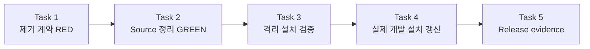

# Forge `ui-design` 최종 제거 구현 계획

> 이 계획은 forge executing-plans skill로 Task를 순서대로 실행하고, 내부 검증 checkpoint를 연속 통과한 뒤 release 승인 경계에서만 대기한다.

Status: complete

**Related Specs:**
- id: 007-ui-design-removal
  path: docs/specs/007-ui-design-removal/spec.md
  requirements: [R1, R2, R3, R4, R5, R6, R7, R8]
  acceptance: [AC1, AC2, AC3, AC4, AC5, AC6, AC7]
- id: 006-ui-design-skill-split
  path: docs/specs/006-ui-design-skill-split/spec.md
  requirements: [R10, R13]
  acceptance: [AC9, AC12]

**목표:** Forge의 deprecated `ui-design` source와 활성 runtime 참조를 제거하고, Codex·Claude Code 개발 설치에서 `web-app-design`과 `website-design`만 재현 가능하게 설치한다.

**아키텍처:** active repository contract는 legacy skill의 부재와 두 신규 skill의 routing을 함께 검증한다. 설치 contract는 격리된 임시 HOME에서 stale Codex copy의 복구 이동, Codex 반복 설치, Claude 전체-tree 반복 설치를 검증한다. 실제 사용자 HOME은 동일한 순서로 갱신하되 Claude Marketplace cache는 공식 plugin manager만 변경한다.

**기술 스택:** Markdown Agent Skills, Bash contract tests, `jq`, GitHub Actions, Codex per-skill development install, Claude Code skills-directory plugin과 Marketplace plugin

## Global Constraints

- Forge 0.1.4 이상의 migration release가 원격 기본 브랜치에 존재해야 한다.
- 역사 문서인 `docs/specs/006-ui-design-skill-split/`과 완료된 `docs/plans/`의 migration 기록은 수정하지 않는다.
- `web-app-design`은 browser·PWA application, `website-design`은 공개 콘텐츠 website만 소유한다.
- fixed Viewer 생성은 `spec-viewer`, Viewer tooling 변경은 `web-app-design`이 소유한다.
- `~/.agents/skills/ui-design`은 Forge stale copy임을 확인한 뒤 복구 가능한 위치로 이동한다.
- `~/.claude/plugins/cache/hope1026/forge/<version>`은 수동 삭제하거나 수정하지 않는다.
- Forge 범위 밖의 사용자 skill과 plugin은 삭제하거나 덮어쓰지 않는다.
- commit, push, Marketplace update는 release 승인 전에는 수행하지 않는다.

## 구현 Routes

| Route | Tasks | 산출물 | Checkpoint |
|---|---:|---|---|
| Route 1 — 제거 계약 | 1 | legacy 부재를 요구하는 RED test | internal |
| Route 2 — Source 정리 | 2 | compatibility router와 활성 참조 제거 | notify |
| Route 3 — 설치 재현성 | 3 | 격리 HOME 반복 설치 regression | internal |
| Route 4 — Machine 갱신 | 4 | Codex·Claude 개발 설치의 신규 catalog | notify |
| Route 5 — Release 증거 | 5 | 전체 PASS, version bump, release 승인 경계 | approval before commit·push |

## 어떤 순서로 제거와 설치를 검증하는가?

확인할 내용: source 부재 계약을 먼저 실패시킨 뒤 repository와 격리 설치를 GREEN으로 만들고, 실제 HOME 갱신은 그 검증 결과를 사용해야 한다.

읽는 법: 각 화살표는 다음 Task가 앞 Task의 검증된 산출물에 의존함을 뜻한다.

Source: Plan source

| 먼저 | 다음 | 이유 |
|---|---|---|
| Task 1 | Task 2 | legacy 부재와 catalog 변경을 RED로 고정 |
| Task 2 | Task 3 | 제거된 source를 대상으로 설치 재현성 검증 |
| Task 3 | Task 4 | 임시 HOME에서 검증된 절차만 실제 HOME에 적용 |
| Task 4 | Task 5 | 실제 설치 상태까지 포함해 release evidence 수집 |



## AC Coverage

| AC | Tasks |
|---|---|
| 007-AC1 | 1, 2, 5 |
| 007-AC2 | 1, 2, 5 |
| 007-AC3 | 3, 4 |
| 007-AC4 | 3, 4 |
| 007-AC5 | 5 |
| 007-AC6 | 1, 3, 5 |
| 007-AC7 | 5 |
| 006-AC9 | 1, 2, 5 |
| 006-AC12 | 3, 4, 5 |

### Task 1: `ui-design` 부재 contract를 RED로 고정 (007 R1–R3, R7, AC1–AC2, AC6 · 006 R10, AC9)

**파일:**
- 수정: `scripts/tests/test-ui-design-skill-routing.sh`
- 수정: `scripts/tests/test-forge-artifact-contract.sh`
- 참조: `docs/specs/007-ui-design-removal/spec.md`
- 참조: `docs/specs/006-ui-design-skill-split/spec.md`

**인터페이스:**
- 입력: approved removal lifecycle, active surface taxonomy, historical-document exclusion
- 출력: legacy directory와 catalog 노출은 금지하고 두 active skill·Viewer routing은 요구하는 executable contract

**실행 메타데이터:**
- Route: route-1
- 의존성: none
- 쓰기 소유권: `scripts/tests/test-ui-design-skill-routing.sh`, `scripts/tests/test-forge-artifact-contract.sh`
- 병렬 안전성: sequential — Task 2가 구현할 RED 기준이다.
- 승인 gate: none

- [x] **Step 1: routing test에서 legacy positive contract를 제거하고 source 부재와 active catalog만 검증하도록 수정한다.**

적용할 핵심 diff:

```diff
-LEGACY="$ROOT/plugins/forge/skills/ui-design/SKILL.md"
+REMOVED="$ROOT/plugins/forge/skills/ui-design"
 ROUTER="$ROOT/plugins/forge/skills/using-forge/SKILL.md"

-for file in "$APP" "$SITE" "$LEGACY"; do
+for file in "$APP" "$SITE"; do
   [[ -f "$file" ]] || fail "missing skill: $file"
 done
+[[ ! -e "$REMOVED" ]] || fail "removed skill still exists: $REMOVED"

-assert_has '^name: ui-design$' "$LEGACY"
-assert_has 'DEPRECATED' "$LEGACY"
-assert_has 'DO NOT DESIGN' "$LEGACY"
-assert_has 'web-app-design' "$LEGACY"
-assert_has 'website-design' "$LEGACY"
-assert_not_has 'VISUAL SYSTEM —' "$LEGACY"
-assert_has 'Create one checklist item per numbered step' "$LEGACY"
-legacy_red_flags="$(
-  awk '
-    /^## Red Flags$/ { in_red_flags = 1; next }
-    in_red_flags && /^## / { in_red_flags = 0 }
-    in_red_flags && /^\| "/ { count++ }
-    END { print count + 0 }
-  ' "$LEGACY"
-)"
-[[ "$legacy_red_flags" -ge 5 ]] ||
-  fail "$LEGACY must contain at least five Red Flags rows"
-
 assert_has 'Browser application UI.*web-app-design' "$ROUTER"
 assert_has 'Public website.*website-design' "$ROUTER"
 assert_has 'one classification question' "$ROUTER"
 assert_has 'Native mobile or desktop app.*specialist skill is not available' "$ROUTER"
 assert_has 'Viewer shell.*web-app-design' "$ROUTER"
+assert_not_has 'ui-design' "$ROUTER"

 assert_has '\| `web-app-design` \|' "$MAINTAINER"
 assert_has '\| `website-design` \|' "$MAINTAINER"
-assert_has '\| `ui-design` \| Deprecated compatibility router' "$MAINTAINER"
+assert_not_has '\| `ui-design` \|' "$MAINTAINER"

 assert_has '\| `web-app-design` \|' "$ROOT/README.md"
 assert_has '\| `website-design` \|' "$ROOT/README.md"
-assert_has '14 active user-execution skills plus 1 deprecated compatibility router' "$ROOT/README.md"
+assert_has '14 active user-execution skills listed above' "$ROOT/README.md"
+assert_not_has '\| `ui-design` \|' "$ROOT/README.md"

 jq -e '.keywords | index("website-design") != null' \
   "$ROOT/plugins/forge/.claude-plugin/plugin.json" >/dev/null ||
   fail "Claude manifest is missing website-design keyword"
+jq -e '.keywords | index("ui-design") == null' \
+  "$ROOT/plugins/forge/.claude-plugin/plugin.json" >/dev/null ||
+  fail "Claude manifest still exposes ui-design keyword"
```

- [x] **Step 2: artifact contract가 removed directory와 14개 active skill catalog를 요구하도록 수정한다.**

적용할 diff:

```diff
-grep -q '14 active user-execution skills plus 1 deprecated compatibility router' "$ROOT/README.md"
+grep -q '14 active user-execution skills listed above' "$ROOT/README.md"
 grep -q '| `creating-agent-extensions` |' "$ROOT/README.md"
+[[ ! -e "$ROOT/plugins/forge/skills/ui-design" ]]
@@
-grep -q 'DO NOT DESIGN' "$ROOT/plugins/forge/skills/ui-design/SKILL.md"
```

- [x] **Step 3: 두 contract가 기존 compatibility router 때문에 실패하는지 확인한다.**

실행:

```bash
bash scripts/tests/test-ui-design-skill-routing.sh
bash scripts/tests/test-forge-artifact-contract.sh
```

예상: 첫 명령은 exit 1과 `FAIL: removed skill still exists:`를 출력하고, 두 번째 명령은 non-zero로 종료한다.

### Task 2: compatibility source와 활성 catalog 제거 (007 R2–R3, AC1–AC2 · 006 R10, AC9)

**파일:**
- 삭제: `plugins/forge/skills/ui-design/SKILL.md`
- 수정: `README.md`
- 수정: `.agent-extensions/maintaining-forge/skills/maintaining-forge/SKILL.md`
- 수정: `.agent-extensions/maintaining-forge/adapters/codex/state.json`
- 수정: `.agent-extensions/maintaining-forge/adapters/claude-code/state.json`
- 수정: `.agent-extensions/maintaining-forge/adapters/antigravity/state.json`
- 수정: `plugins/forge/.claude-plugin/plugin.json`
- 테스트: `scripts/tests/test-ui-design-skill-routing.sh`
- 테스트: `scripts/tests/test-forge-artifact-contract.sh`

**인터페이스:**
- 입력: Task 1의 removed-source contract
- 출력: active catalog가 `web-app-design`, `website-design`만 노출하는 Forge source tree

**실행 메타데이터:**
- Route: route-2
- 의존성: Task 1
- 쓰기 소유권: `plugins/forge/skills/ui-design/`, `README.md`, `.agent-extensions/maintaining-forge/skills/maintaining-forge/SKILL.md`, `.agent-extensions/maintaining-forge/adapters/*/state.json`, `plugins/forge/.claude-plugin/plugin.json`
- 병렬 안전성: sequential — 같은 catalog를 두 test가 함께 읽는다.
- 승인 gate: native app 또는 fixed Viewer routing을 변경해야 하면 spec delta 승인을 받는다.

- [x] **Step 1: `plugins/forge/skills/ui-design/SKILL.md`를 삭제한다.**

적용할 patch:

```diff
*** Delete File: plugins/forge/skills/ui-design/SKILL.md
```

- [x] **Step 2: README에서 deprecated row와 compatibility 문구를 제거한다.**

적용할 diff:

```diff
-| `ui-design` | Deprecated one-release compatibility router for explicit legacy calls |
@@
-the 14 active user-execution skills plus 1 deprecated compatibility router listed above.
+the 14 active user-execution skills listed above.
```

- [x] **Step 3: maintainer catalog에서 deprecated row를 제거한다.**

적용할 diff:

```diff
-| `ui-design` | Deprecated compatibility router for explicit legacy calls |
```

- [x] **Step 4: Claude manifest keyword에서 `ui-design`을 제거한다.**

결과 배열:

```json
["spec-first", "process", "tdd", "debugging", "agent-skills", "mcp", "web-app-design", "website-design", "tone", "marketing", "operations", "customer-support", "korean", "codex", "claude-code", "antigravity"]
```

- [x] **Step 5: active repository에서 legacy 참조 범위를 검사한다.**

실행:

```bash
rg -n --hidden \
  --glob '!docs/specs/**' \
  --glob '!docs/plans/**' \
  --glob '!CHANGELOG*' \
  --glob '!**/.git/**' \
  'ui-design' \
  README.md plugins/forge .agent-extensions scripts/tests
```

예상: negative regression assertion과 test 파일명·출력 label 외에는 active runtime 참조가 없다.

- [x] **Step 6: Task 1의 contract를 다시 실행한다.**

실행:

```bash
bash scripts/tests/test-ui-design-skill-routing.sh
bash scripts/tests/test-forge-artifact-contract.sh
```

예상: 두 명령 모두 PASS.

- [x] **Step 7: canonical runbook 변경을 세 repository adapter state에 렌더하고 parity를 검증한다.**

실행:

```bash
python3 plugins/forge/skills/creating-agent-extensions/scripts/manage_extension.py \
  render --extension .agent-extensions/maintaining-forge
python3 plugins/forge/skills/creating-agent-extensions/scripts/manage_extension.py \
  validate --extension .agent-extensions/maintaining-forge
```

예상: render가 codex·claude-code·antigravity adapter update를 기록하고 validate가 `"status": "PASS"`를 출력한다.

### Task 3: 반복 설치와 stale-path 처리 regression 구현 (007 R4–R7, AC3–AC4, AC6 · 006 R13, AC12)

**파일:**
- 생성: `scripts/tests/test-forge-ui-skill-install.sh`
- 수정: `.github/workflows/validate.yml`
- 참조: `scripts/install.sh`

**인터페이스:**
- 입력: 제거된 Forge source tree, `scripts/install.sh --agent codex|claude --mode copy --plugin forge`
- 출력: 임시 HOME에서 Codex stale copy 복구 이동, non-Forge 보존, 두 target 반복 설치를 증명하는 regression

**실행 메타데이터:**
- Route: route-3
- 의존성: Task 2
- 쓰기 소유권: `scripts/tests/test-forge-ui-skill-install.sh`, `.github/workflows/validate.yml`
- 병렬 안전성: sequential — source 제거 후의 installer 결과를 검증한다.
- 승인 gate: installer가 Forge 범위 밖 skill을 prune해야만 통과할 수 있으면 중단하고 spec delta 승인을 받는다.

- [x] **Step 1: 다음 격리 설치 test를 생성한다.**

```bash
#!/usr/bin/env bash
set -euo pipefail

ROOT="$(cd "$(dirname "${BASH_SOURCE[0]}")/../.." && pwd)"
TEST_HOME="$(mktemp -d)"
trap 'rm -rf "$TEST_HOME"' EXIT

fail() {
  echo "FAIL: $1" >&2
  exit 1
}

mkdir -p "$TEST_HOME/.agents/skills/ui-design"
printf 'stale forge copy\n' >"$TEST_HOME/.agents/skills/ui-design/SKILL.md"
mkdir -p "$TEST_HOME/.agents/skills/user-owned"
printf 'preserve\n' >"$TEST_HOME/.agents/skills/user-owned/marker"

RECOVERY="$TEST_HOME/recovery/ui-design"
mkdir -p "$(dirname "$RECOVERY")"
mv "$TEST_HOME/.agents/skills/ui-design" "$RECOVERY"

for _ in 1 2; do
  HOME="$TEST_HOME" bash "$ROOT/scripts/install.sh" \
    --agent codex --mode copy --plugin forge >/dev/null
done

[[ -f "$TEST_HOME/.agents/skills/web-app-design/SKILL.md" ]] ||
  fail "Codex web-app-design was not installed"
[[ -f "$TEST_HOME/.agents/skills/website-design/SKILL.md" ]] ||
  fail "Codex website-design was not installed"
[[ ! -e "$TEST_HOME/.agents/skills/ui-design" ]] ||
  fail "Codex ui-design was recreated"
[[ -f "$RECOVERY/SKILL.md" ]] ||
  fail "Codex stale skill recovery copy is missing"
[[ -f "$TEST_HOME/.agents/skills/user-owned/marker" ]] ||
  fail "Codex user-owned skill was modified"

mkdir -p "$TEST_HOME/.claude/skills/forge/skills/ui-design"
printf 'stale forge copy\n' \
  >"$TEST_HOME/.claude/skills/forge/skills/ui-design/SKILL.md"

for _ in 1 2; do
  HOME="$TEST_HOME" bash "$ROOT/scripts/install.sh" \
    --agent claude --mode copy --plugin forge >/dev/null
done

[[ -f "$TEST_HOME/.claude/skills/forge/skills/web-app-design/SKILL.md" ]] ||
  fail "Claude web-app-design was not installed"
[[ -f "$TEST_HOME/.claude/skills/forge/skills/website-design/SKILL.md" ]] ||
  fail "Claude website-design was not installed"
[[ ! -e "$TEST_HOME/.claude/skills/forge/skills/ui-design" ]] ||
  fail "Claude ui-design was recreated"

echo "forge-ui-skill-install: all checks passed"
```

- [x] **Step 2: test에 실행 권한을 부여한다.**

실행: `chmod +x scripts/tests/test-forge-ui-skill-install.sh`

예상: `test -x scripts/tests/test-forge-ui-skill-install.sh`가 exit 0.

- [x] **Step 3: CI validate job에 설치 regression을 추가한다.**

적용할 diff:

```diff
           bash scripts/tests/test-ui-design-skill-routing.sh
+          bash scripts/tests/test-forge-ui-skill-install.sh
           node plugins/forge/skills/spec-viewer/tests/test-viewer-freshness.mjs
```

- [x] **Step 4: 격리 설치 test를 실행한다.**

실행: `bash scripts/tests/test-forge-ui-skill-install.sh`

예상: `forge-ui-skill-install: all checks passed`.

### Task 4: 실제 Codex·Claude 개발 설치 갱신 (007 R4–R6, AC3–AC4 · 006 R13, AC12)

**파일:**
- 이동: `~/.agents/skills/ui-design` → `~/.Trash/forge-ui-design-stale-20260731`
- 생성 또는 교체: `~/.agents/skills/web-app-design`
- 생성 또는 교체: `~/.agents/skills/website-design`
- 교체: `~/.claude/skills/forge`
- 보존: `~/.claude/plugins/cache/hope1026/forge/`

**인터페이스:**
- 입력: Task 3에서 검증된 local development install 절차
- 출력: 실제 machine에서 신규 두 skill을 발견하고 deprecated skill은 발견하지 않는 Codex·Claude 개발 설치 상태

**실행 메타데이터:**
- Route: route-4
- 의존성: Task 3
- 쓰기 소유권: 정확히 확인된 Forge stale copy와 Forge 개발 설치 경로
- 병렬 안전성: sequential — exact target 확인, 복구 이동, install, discovery 순서가 필요하다.
- 승인 gate: resolved path가 Forge copy가 아니거나 recovery target이 이미 다른 내용으로 존재하면 중단하고 사용자에게 보고한다.

- [x] **Step 1: Codex stale path의 실제 파일이 Forge 개발 설치본인지 확인한다.**

실행:

```bash
test -f /Users/han-byeol/.agents/skills/ui-design/SKILL.md
rg -n '^name: ui-design$|# UI Design' \
  /Users/han-byeol/.agents/skills/ui-design/SKILL.md
cmp -s \
  /Users/han-byeol/.agents/skills/ui-design/SKILL.md \
  /Users/han-byeol/.claude/skills/forge/skills/ui-design/SKILL.md
jq -e '.name == "forge" and .version == "0.1.2"' \
  /Users/han-byeol/.claude/skills/forge/.claude-plugin/plugin.json
```

예상: standalone skill이 Forge 0.1.2 개발 설치 tree의 `ui-design`과 byte 단위로 동일하다.

- [x] **Step 2: recovery target 충돌이 없는지 확인한다.**

실행:

```bash
test ! -e /Users/han-byeol/.Trash/forge-ui-design-stale-20260731
```

예상: exit 0.

- [x] **Step 3: 확인된 Codex stale copy를 복구 가능한 Trash 위치로 이동한다.**

실행:

```bash
mv /Users/han-byeol/.agents/skills/ui-design \
  /Users/han-byeol/.Trash/forge-ui-design-stale-20260731
```

예상: 원래 경로는 없고 recovery 경로에 `SKILL.md`가 있다.

- [x] **Step 4: Codex Forge 개발 설치를 두 번 갱신한다.**

실행:

```bash
bash scripts/install.sh --agent codex --mode copy --plugin forge
bash scripts/install.sh --agent codex --mode copy --plugin forge
```

예상: 두 번 모두 `install complete`이고 `web-app-design`, `website-design` 설치 메시지가 있으며 `ui-design` 설치 메시지는 없다.

- [x] **Step 5: Claude Code Forge 개발 설치본을 두 번 갱신한다.**

실행:

```bash
bash scripts/install.sh --agent claude --mode copy --plugin forge
bash scripts/install.sh --agent claude --mode copy --plugin forge
```

예상: 두 번 모두 `installed Claude Code skills-directory plugin`과 `install complete`.

- [x] **Step 6: 실제 개발 설치 결과와 manager cache 보존 상태를 확인한다.**

실행:

```bash
test -f /Users/han-byeol/.agents/skills/web-app-design/SKILL.md
test -f /Users/han-byeol/.agents/skills/website-design/SKILL.md
test ! -e /Users/han-byeol/.agents/skills/ui-design
test -f /Users/han-byeol/.claude/skills/forge/skills/web-app-design/SKILL.md
test -f /Users/han-byeol/.claude/skills/forge/skills/website-design/SKILL.md
test ! -e /Users/han-byeol/.claude/skills/forge/skills/ui-design
test -d /Users/han-byeol/.claude/plugins/cache/hope1026/forge/0.1.3
```

예상: 모든 명령이 exit 0.

### Task 5: 전체 검증, version 갱신과 release 경계 (007 R1, R5, R7–R8, AC1–AC2, AC5–AC7 · 006 R10, R13, AC9, AC12)

**파일:**
- 수정: `plugins/forge/.claude-plugin/plugin.json`
- 수정: `plugins/forge/.codex-plugin/plugin.json`
- 수정: `docs/plans/006-ui-design-removal/plan.md`
- release 후 외부 갱신: `forge@hope1026`

**인터페이스:**
- 입력: GREEN repository, 격리 설치 evidence, 실제 개발 설치 evidence
- 출력: 동일 base version의 release candidate와 사용자 승인 후 commit·push·Marketplace update evidence

**실행 메타데이터:**
- Route: route-5
- 의존성: Task 4
- 쓰기 소유권: 두 Forge manifest, 이 plan의 checkbox와 progress, 승인 후 Git branch와 공식 plugin manager 상태
- 병렬 안전성: sequential — version freshness와 외부 update는 release 순서에 의존한다.
- 승인 gate: commit·push와 Marketplace update 직전에 release 승인을 요청한다.

- [x] **Step 1: Claude와 Codex manifest를 제거 release version으로 갱신한다.**

적용할 값:

```text
Claude version: 0.1.5
Codex base version: 0.1.5
Codex suffix: 실행 시점의 date -u +%Y%m%d%H%M%S
```

그 뒤 실제 개발 설치본도 version 변경이 반영된 현재 source로 한 번 더 갱신한다.

실행:

```bash
bash scripts/install.sh --agent all --mode copy --plugin forge
```

예상: 두 manifest의 base version이 `0.1.5`로 동일하고 Codex suffix가 현재 실행의 fresh UTC 값이며, Claude 개발 설치본도 version `0.1.5`다.

- [x] **Step 2: repository 검증 suite를 실행한다.**

실행:

```bash
bash scripts/tests/test-maintaining-forge-layout.sh
bash scripts/tests/test-validator-skill-roots.sh
bash scripts/tests/test-forge-artifact-contract.sh
bash scripts/tests/test-ui-design-skill-routing.sh
bash scripts/tests/test-forge-ui-skill-install.sh
node plugins/forge/skills/spec-viewer/tests/test-viewer-freshness.mjs
bash plugins/forge/skills/spec-viewer/tests/test-build-viewer.sh
bash scripts/validate.sh
```

예상: 모든 명령이 PASS.

- [x] **Step 3: active reference와 version gate를 검사한다.**

실행:

```bash
rg -n --hidden \
  --glob '!docs/specs/**' \
  --glob '!docs/plans/**' \
  --glob '!CHANGELOG*' \
  --glob '!**/.git/**' \
  'ui-design' \
  README.md plugins/forge .agent-extensions scripts/tests
upstream_claude="$(git show origin/main:plugins/forge/.claude-plugin/plugin.json | jq -r '.version')"
upstream_codex="$(git show origin/main:plugins/forge/.codex-plugin/plugin.json | jq -r '.version')"
local_claude="$(jq -r '.version' plugins/forge/.claude-plugin/plugin.json)"
local_codex="$(jq -r '.version' plugins/forge/.codex-plugin/plugin.json)"
printf 'upstream=%s,%s\nlocal=%s,%s\n' \
  "$upstream_claude" "$upstream_codex" "$local_claude" "$local_codex"
test "$local_claude" = "0.1.5"
case "$local_codex" in
  0.1.5+codex.20????????????) ;;
  *) exit 1 ;;
esac
```

예상: 첫 검색은 negative regression assertion과 test label 외 runtime 참조가 없고, upstream `0.1.4`보다 높은 동일 base version `0.1.5`와 fresh Codex suffix가 출력된다.

- [x] **Step 4: available runtime에서 routing pressure scenario를 실행하거나 static evidence를 기록한다.**

검증 matrix:

```text
dashboard/settings/PWA -> web-app-design
landing/marketing/public docs -> website-design
맥락 없는 UI 요청 -> app 또는 website를 묻는 한 가지 질문
iOS/Android/Electron/Tauri -> web skill 강제 라우팅 없음
fixed spec/plan Viewer -> spec-viewer
Viewer shell/tooling change -> web-app-design
explicit ui-design -> skill not found; using-forge의 active taxonomy 사용
```

예상: available runtime은 신규 두 skill을 발견하고 제거된 skill을 발견하지 않는다. 실행할 수 없는 runtime은 frontmatter·경로·금지 token static 검증 결과를 남긴다.

- [x] **Step 5: release 승인 전 상태를 사용자에게 보고하고 대기한다.**

보고할 내용:

```text
source removal: PASS
isolated repeat install: PASS
Codex dev install: PASS
Claude dev install: PASS
repository validation: PASS
version gate: PASS
pending authority: commit, push, Claude Marketplace/plugin update
```

예상: 사용자의 명시적 release 승인 전에는 `git commit`, `git push`, `claude plugin marketplace update`, `claude plugin update`를 실행하지 않는다.

- [x] **Step 6: release 승인 후 변경을 commit하고 push한다.**

실행:

```bash
git add README.md \
  .agent-extensions/maintaining-forge/skills/maintaining-forge/SKILL.md \
  .agent-extensions/maintaining-forge/adapters/antigravity/state.json \
  .agent-extensions/maintaining-forge/adapters/claude-code/state.json \
  .agent-extensions/maintaining-forge/adapters/codex/state.json \
  .github/workflows/validate.yml \
  docs/specs/007-ui-design-removal/spec.md \
  docs/plans/006-ui-design-removal/plan.md \
  plugins/forge/.claude-plugin/plugin.json \
  plugins/forge/.codex-plugin/plugin.json \
  scripts/tests/test-forge-artifact-contract.sh \
  scripts/tests/test-ui-design-skill-routing.sh \
  scripts/tests/test-forge-ui-skill-install.sh
git add -u plugins/forge/skills/ui-design
git commit -m "refactor(forge): remove legacy ui-design skill"
git push origin main
```

예상: focused commit 하나가 생성되고 `origin/main` push가 성공한다.

- [x] **Step 7: release 승인 후 Claude Marketplace와 active plugin을 공식 명령으로 갱신한다.**

실행:

```bash
claude plugin marketplace update hope1026
claude plugin update forge@hope1026 --scope user
claude plugin list
```

예상: `forge@hope1026` active version이 `0.1.5`다. 인증 또는 외부 오류가 발생하면 error와 현재 active version을 기록하고 `~/.claude/plugins/cache/hope1026/forge/`를 직접 수정하지 않는다.

- [x] **Step 8: GitHub Actions와 원격 version을 확인한다.**

실행:

```bash
gh run list --workflow validate --branch main --limit 1
git show origin/main:plugins/forge/.claude-plugin/plugin.json | jq -r '.version'
git show origin/main:plugins/forge/.codex-plugin/plugin.json | jq -r '.version'
```

예상: 최신 validate run이 `success`, Claude version이 `0.1.5`, Codex base version이 `0.1.5`.

## Progress History

- 2026-07-31 Task 1: routed (impact=high, uncertainty=low, context_coupling=medium, verification_clarity=strong, tier=frontier, mode=root, parallel_group=none, reason="approved removal lifecycle과 repository contract를 함께 변경하는 source-of-truth 작업")
- 2026-07-31 Task 1: complete (commits none—release gate; verification="routing test가 removed skill still exists로 exit 1, artifact contract가 exit 1인 RED 확인")
- 2026-07-31 Task 2: routed (impact=high, uncertainty=low, context_coupling=medium, verification_clarity=strong, tier=frontier, mode=root, parallel_group=none, reason="distributed source 삭제와 README·maintainer·manifest catalog의 일관성을 root가 함께 소유")
- 2026-07-31 Task 2: complete (commits none—release gate; verification="active runtime 참조는 negative regression만 남고 routing·artifact contract PASS")
- 2026-07-31 Task 3: routed (impact=medium, uncertainty=low, context_coupling=low, verification_clarity=strong, tier=balanced, mode=root, parallel_group=none, reason="임시 HOME 하나와 CI 한 줄로 제한되고 직접 실행 검토가 dispatch보다 저렴")
- 2026-07-31 Task 3: complete (commits none—release gate; verification="격리 HOME에서 Codex·Claude 반복 설치, stale recovery, user-owned skill 보존 PASS")
- 2026-07-31 Task 4: routed (impact=high, uncertainty=low, context_coupling=medium, verification_clarity=strong, tier=frontier, mode=root, parallel_group=none, reason="사용자 HOME의 exact stale path를 복구 이동하고 두 agent 개발 설치를 교체하는 data-safety 작업")
- 2026-07-31 Task 4: plan correction (Step 1의 compatibility-router 기대를 실제 설치 version 0.1.2에 맞춰 동일한 Forge 개발 tree와의 byte comparison으로 교체; spec scope와 제거 대상은 불변)
- 2026-07-31 Task 4: complete (commits none—release gate; verification="stale Codex copy를 ~/.Trash/forge-ui-design-stale-20260731로 이동, 두 agent 반복 설치 후 신규 두 skill만 존재, Claude manager cache 0.1.3 보존")
- 2026-07-31 Task 5: routed (impact=high, uncertainty=medium, context_coupling=high, verification_clarity=strong, tier=frontier, mode=root, parallel_group=none, reason="전체 repository·실제 설치·version gate를 통합 판단하고 release authority 경계를 소유")
- 2026-07-31 Task 5: plan correction (존재하지 않는 version-gate helper 경로를 maintaining-forge runbook의 실제 수동 gate와 동일한 upstream·base·suffix 검사로 교체)
- 2026-07-31 Task 5: checkpoint (commits none—release gate; verification="repository suite PASS, version 0.1.5 gate PASS, Codex live 7-scenario routing PASS, Claude Marketplace update는 release 이후 pending")
- 2026-07-31 Task 5: approval checkpoint (resume at Step 6; verification="17 extension unit tests와 모든 repository shell·Viewer·validator test PASS, 실제 Codex·Claude dev install 0.1.5 확인, git diff --check PASS"; pending authority="commit, origin/main push, Claude Marketplace/plugin update")
- 2026-07-31 Task 5: release approved (사용자가 commit, origin/main push, Claude Marketplace/plugin update 진행을 승인)
- 2026-07-31 Task 5: complete (commit `8cf0fbb`; verification="origin/main push, Claude Marketplace forge 0.1.5 update, managed cache 신규 두 skill만 존재, GitHub Actions run 30597214271 success, Spec 007 AC1–AC7 PASS")
