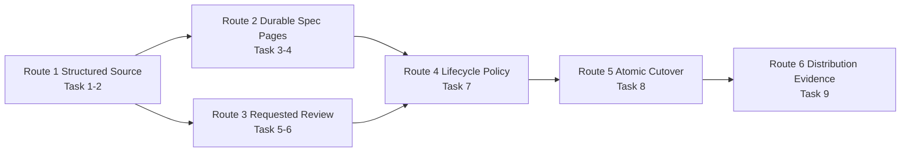
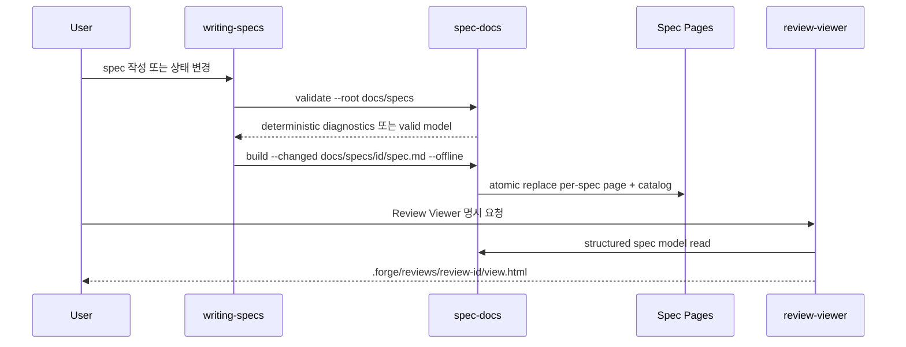
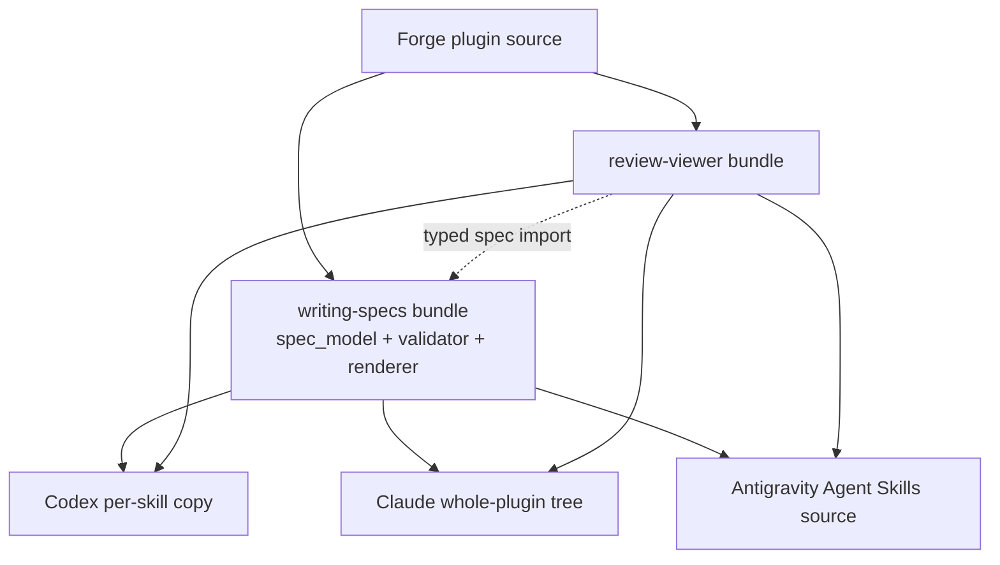

# 구조화 Spec Pages와 요청형 Review Viewer 구현 계획

> 이 계획은 forge executing-plans skill로 Task 단위 실행하고, 각 Task의 red→green 검증과 내부 checkpoint를 기록한 뒤 release 경계에서만 사용자 승인을 기다린다.

Status: active

**Related Specs:**
- id: 008-structured-spec-pages
  path: docs/specs/008-structured-spec-pages/spec.md
  requirements: [R1, R2, R3, R4, R5, R6, R7, R8, R9, R10, R11, R12, R13, R14, R15, R16, R17, R18, R19, R20, R21, R22, R23, R24, R25, R26, R27, R28, R29, R30, R31, R32, R33, R34]
  acceptance: [AC1, AC2, AC3, AC4, AC5, AC6, AC7, AC8, AC9, AC10, AC11, AC12]
- id: 002-lifecycle-review-viewer
  path: docs/specs/002-lifecycle-review-viewer/spec.md
  requirements: [R1, R2, R3, R4, R5, R6, R7, R8, R9, R10, R11, R12, R13, R14, R15, R16, R18, R19, R20, R21, R22, R23, R24, R25, R26, R27, R28, R29, R30, R31, R32, R33, R34, R35, R36, R37, R38, R39, R40, R41, R42, R43, R44, R45, R46, R47, R48, R49, R50, R51, R52, R53, R54, R55, R56, R57, R58, R59, R60, R61, R62, R63, R64, R65, R66, R67, R68, R69, R70, R71, R72, R73, R74, R75, R76, R77, R78, R79, R80, R81, R82, R83, R84, R85, R86]
  acceptance: [AC1, AC2, AC3, AC4, AC5, AC6, AC7, AC8, AC9, AC10, AC11, AC12, AC13, AC14, AC15, AC16, AC17, AC18, AC19, AC20, AC21, AC22, AC23, AC24, AC25, AC26, AC27, AC28, AC29, AC30, AC31]

**목표:** Forge의 Markdown spec을 `forge/spec@1`으로 구조화·검증하고 항상 최신인 committed Spec Pages를 생성하면서, 기존 `spec-viewer`를 사용자가 요청할 때만 `.forge/reviews/`에 생성되는 `review-viewer`로 일괄 전환한다.

**아키텍처:** `writing-specs` bundle이 dependency-free Python 공통 parser, repository validator, deterministic Spec Pages builder와 offline asset을 소유한다. `review-viewer`는 이 공통 parser가 만든 typed spec model과 별도의 plan source model을 결합해 여섯 panel을 생성하되 primary·comparison·context provenance를 분리한다. Forge repository의 8개 활성 spec, lifecycle skill, contract test와 generated page는 마지막 cutover Task에서 한 번에 전환하며 legacy parser branch와 임시 converter는 남기지 않는다.

**기술 스택:** Python 3 표준 라이브러리, Bash, HTML/CSS, ECMAScript module, Web Crypto API, Mermaid 11.16.0 offline bundle, Node.js contract test, pinned Playwright browser harness, GitHub Actions

## Global Constraints

- Markdown `spec.md`만 요구사항과 lifecycle status의 source of truth이며 generated HTML은 읽기 전용이다.
- `forge/spec@1` frontmatter는 scalar와 JSON-compatible 한 줄 collection만 사용하고 v1 locale은 `en`, `ko`다.
- 공통 parser·validator·renderer는 외부 Python package, network, machine locale과 agent 추론에 의존하지 않는다.
- Spec Pages는 spec body·metadata·status와 generator/template/asset 변경 시 함께 갱신하고 Git에 commit한다.
- Review Viewer는 사용자의 명시적 요청에서만 생성·갱신하고 `.forge/reviews/<review-id>/view.html`에 Git 비추적 상태로 둔다.
- `review-viewer`는 `writing-specs/scripts/spec_model.py`를 import하고 spec parser를 복제하지 않는다.
- source Mermaid와 explicit plan relation만 시각화하며 source 밖 의미나 cross-source 관계를 추론하지 않는다.
- Spec Pages output은 absolute path와 volatile timestamp를 포함하지 않고 같은 input과 generator version에서 byte-for-byte 동일하다. Review Viewer는 `generated_at`을 manifest에 명시적으로 저장하며 source bytes, review option, generator version, `generated_at`이 같으면 같은 bytes를 생성한다.
- `weppy-roblox-mcp-private`는 이 계획의 write scope가 아니며 해당 repository migration은 별도 governing spec과 plan이 소유한다.
- distributed Forge skill은 Claude Code, Codex, Antigravity에서 같은 계약을 사용하고 `SKILL.md` 500줄 및 portability gate를 지킨다.
- 개별 Review Viewer 생성에는 post-build QA를 추가하지 않지만 Viewer tooling 변경 Task는 desktop 1440px·mobile 390px 브라우저 검증을 수행한다.
- push는 release이므로 이 계획은 local commit과 version gate까지만 수행하며 사용자 승인 없이 push하지 않는다.

## AC Coverage

### `008-structured-spec-pages`

| AC | Tasks |
|---|---|
| AC1 | 1, 2 |
| AC2 | 1, 2 |
| AC3 | 2, 7 |
| AC4 | 3, 4, 7 |
| AC5 | 3 |
| AC6 | 3, 4 |
| AC7 | 3, 4 |
| AC8 | 4 |
| AC9 | 5, 7 |
| AC10 | 7, 8 |
| AC11 | 8 |
| AC12 | 9 |

### `002-lifecycle-review-viewer`

| AC | Tasks |
|---|---|
| AC1 | 5, 7 |
| AC2 | 7 |
| AC3 | 5 |
| AC4 | 5, 6 |
| AC5 | 5, 6 |
| AC6 | 6 |
| AC7 | 6 |
| AC8 | 6 |
| AC9 | 6 |
| AC10 | 6 |
| AC11 | 6 |
| AC12 | 5, 6 |
| AC13 | 7 |
| AC14 | 5, 6 |
| AC15 | 5, 7 |
| AC16 | 6 |
| AC17 | 6 |
| AC18 | 5, 6 |
| AC19 | 6, 9 |
| AC20 | 5, 6 |
| AC21 | 7 |
| AC22 | 5, 7 |
| AC23 | 5, 7, 8 |
| AC24 | 2, 7 |
| AC25 | 7 |
| AC26 | 6 |
| AC27 | 6 |
| AC28 | 6 |
| AC29 | 5, 6 |
| AC30 | 7, 8 |
| AC31 | 3, 5, 7, 8 |

## 구현 Routes

| Route | Tasks | 독립 산출물 | Checkpoint |
|---|---:|---|---|
| Route 1 — Structured Source | 1–2 | typed parser, repository validator, CLI | 진단 fixture 통과 후 notify |
| Route 2 — Durable Spec Pages | 3–4 | deterministic per-spec page와 catalog | desktop·390px 검증 후 notify |
| Route 3 — Requested Review | 5–6 | `review-viewer` source model, renderer, freshness | scale·browser matrix 통과 후 notify |
| Route 4 — Lifecycle Policy | 7 | 모든 Forge writer·reader·contract의 새 규칙 | pressure scenario 통과 후 internal |
| Route 5 — Atomic Cutover | 8 | 8개 spec과 generated pages의 한 번 전환 | rollback gate 후 notify |
| Route 6 — Distribution Evidence | 9 | install·CI·manifest·전체 AC evidence | push 직전 approval gate |

## 어떤 순서로 구현되어야 하는가?

확인할 것: 공통 parser가 먼저 고정되고 durable page와 Review Viewer가 독립적으로 발전한 뒤 lifecycle과 repository cutover가 합류하는지 확인한다.

읽는 법: 화살표는 명시적인 Task 선행 의존성이고 같은 열의 Task는 write ownership이 겹치지 않을 때만 병렬 실행할 수 있다.

Source: Plan source

| 먼저 | 다음 | 이유 |
|---|---|---|
| Task 1 | Task 2 | repository validator가 typed model을 소비한다. |
| Task 2 | Task 3, Task 5 | 두 renderer가 validated model과 canonical relation을 소비한다. |
| Task 3 | Task 4 | stable bytes 뒤에 UI shell을 검증한다. |
| Task 3, Task 4, Task 5 | Task 6 | Review Viewer가 shared Markdown rendering, pinned Mermaid/browser harness, source model을 소비한다. |
| Task 4, Task 6 | Task 7 | lifecycle 문구가 실제 command와 artifact 경로를 가리킨다. |
| Task 7 | Task 8 | active writer·reader를 모두 바꾼 뒤 atomic migration을 수행한다. |
| Task 8 | Task 9 | strict repository state에서만 release evidence를 수집한다. |



## 실행 중 누가 어떤 정본을 책임지는가?

확인할 것: Markdown source, generated pages, 요청형 snapshot과 freshness 판정의 책임이 섞이지 않는지 확인한다.

읽는 법: 왼쪽 actor가 오른쪽 artifact를 만들거나 검증하며, browser는 Markdown을 수정하지 않는다.

Source: Plan source

| Actor | 입력 | 책임 | 실패 소유자 |
|---|---|---|---|
| `writing-specs` | 사용자 요구와 current spec | structured source 작성, validate, Spec Pages build/check | spec author |
| `verifying-work` | fresh AC evidence | frontmatter status 전환과 같은 작업의 Spec Pages 갱신 | verifier |
| `spec-docs` CLI | repository spec set | schema·relation·link·coverage 진단, expected HTML bytes | CLI caller |
| Spec Pages runtime | committed HTML | tab·filter·Mermaid·offline read state | Spec Pages tooling |
| `review-viewer` | 명시적으로 선택된 spec 또는 plan set | provenance가 있는 local snapshot 생성 | Viewer builder |
| Review Viewer runtime | manifest와 현재 local source | source별·set별 freshness 판정 | Viewer runtime |
| project validator | source와 committed HTML | stale·manual edit·orphan·legacy branch 차단 | repository maintainer |



## 배포 환경에서는 도구가 어디에서 확장되는가?

확인할 것: 공통 runtime이 `writing-specs` bundle 안에 있어 Codex per-skill copy와 Claude whole-plugin install 모두에서 발견되는지 확인한다.

읽는 법: 실선은 배포되는 소유 파일이고 점선은 runtime sibling lookup이다.

Source: Plan source

| 환경 | `writing-specs` | `review-viewer` | 공통 parser 접근 |
|---|---|---|---|
| Repository | `plugins/forge/skills/writing-specs/` | `plugins/forge/skills/review-viewer/` | sibling skill path |
| Codex dev install | `~/.agents/skills/writing-specs/` | `~/.agents/skills/review-viewer/` | `../writing-specs/scripts/` |
| Claude dev install | `~/.claude/skills/forge/skills/writing-specs/` | `~/.claude/skills/forge/skills/review-viewer/` | plugin-local sibling path |
| Antigravity | Agent Skills source | Agent Skills source | source-local sibling path |



## 데이터 흐름과 검토 경계

| 데이터 | Producer | Consumer | 영속성 |
|---|---|---|---|
| `SpecDocument` | `spec_model.load_spec()` | validator, Spec Pages, Review Viewer | memory only |
| sorted `Diagnostic[]` | `spec_validate.validate_repository()` | CLI, lifecycle skill, CI | stdout/exit code |
| expected output map | `spec_render.expected_outputs()` | build, check | memory then atomic write |
| committed Spec Pages | `spec-docs build` | 사람, catalog runtime, CI check | Git tracked |
| `ReviewSource[]` | `review_sources.collect_sources()` | review renderer, freshness manifest | local build memory |
| Review Viewer snapshot | `build-review-viewer.sh` | 요청한 사용자 | `.forge/reviews/`, untracked |
| migration map | Task 8 | reviewer, rollback operator | plan directory, Git tracked |
| acceptance evidence | Tasks 8–9 | verifier, release reviewer | `docs/plans/007-structured-spec-review-experience/acceptance-evidence.md`, Git tracked |

## Checkpoint와 승인 경계

| 경계 | 종류 | 동작 |
|---|---|---|
| Task 2 deterministic diagnostics 통과 | notify | parser/validator interface와 발견된 drift를 보고하고 계속한다. |
| Task 4 Spec Pages browser matrix 통과 | notify | durable page UX evidence를 보고하고 계속한다. |
| Task 6 Review Viewer scale·browser matrix 통과 | notify | 요청 gate와 provenance evidence를 보고하고 계속한다. |
| Task 8 cutover 전 strict validate 실패 | internal recovery | generated staging을 폐기하고 기존 tracked tree를 유지한다. |
| 승인 spec과 구현 가능성의 불일치 | approval | writing-specs change mode로 돌아가 사용자 결정을 기다린다. |
| Task 9 local release evidence 완료 후 push | approval | push가 Marketplace release이므로 사용자 승인 전 중단한다. |

## Tasks

### Task 1: `forge/spec@1` typed parser (008 R1–R9, R15 · 008 AC1–AC2)

**파일:**
- 생성: `.gitattributes` — exact-checksum vendor/generated Mermaid assets 세 파일만 upstream whitespace를 보존하도록 표시
- 생성: `plugins/forge/skills/writing-specs/scripts/spec_model.py`
- 생성: `plugins/forge/skills/writing-specs/scripts/mermaid_validate.mjs`
- 생성: `plugins/forge/skills/writing-specs/scripts/build-mermaid-validator.sh`
- 생성: `plugins/forge/skills/writing-specs/scripts/boolbase.LICENSE` — npm tarball에 license file이 없는 bundled `boolbase@1.0.0`의 upstream ISC text
- 생성: `plugins/forge/skills/writing-specs/assets/mermaid.min.js`
- 생성: `plugins/forge/skills/writing-specs/assets/mermaid-validator.bundle.mjs`
- 생성: `plugins/forge/skills/writing-specs/assets/mermaid.LICENSE`
- 생성: `plugins/forge/skills/writing-specs/assets/mermaid-validator-THIRD-PARTY.txt`
- 생성: `plugins/forge/skills/writing-specs/assets/mermaid.sha256`
- 생성: `plugins/forge/skills/writing-specs/scripts/package.json`
- 생성: `plugins/forge/skills/writing-specs/scripts/package-lock.json`
- 생성: `plugins/forge/skills/writing-specs/tests/test_spec_model.py`
- 생성: `plugins/forge/skills/writing-specs/tests/test_mermaid_validate.mjs`
- 생성: `plugins/forge/skills/writing-specs/tests/fixtures/spec-model/001-valid-ko/spec.md`
- 생성: `plugins/forge/skills/writing-specs/tests/fixtures/spec-model/invalid/` — 각 case가 `invalid/<case>/001-valid-ko/spec.md`의 valid enclosing path를 사용하고 wrong schema/id-path, extra/missing heading, implicit YAML, anchor, tag, block scalar, duplicate R/AC, bad tombstone, unsupported locale, implemented clarification, malformed Mermaid를 한 진단씩 격리

**Interfaces:**
- 소비: UTF-8 `docs/specs/NNN-<slug>/spec.md` bytes와 repository-relative path
- 생산: `SpecDocument`, `SpecMetadata`, `Requirement`, `AcceptanceCriterion`, `MermaidBlock`, `Diagnostic`
- 고정 signature: `load_spec(path: Path, root: Path) -> tuple[SpecDocument | None, tuple[Diagnostic, ...]]`
- 고정 signature: `parse_frontmatter(text: str, path: Path) -> tuple[dict[str, object], int, tuple[Diagnostic, ...]]`
- 고정 CLI: `node assets/mermaid-validator.bundle.mjs --stdin --format json`; vendored Node bundle의 Mermaid 11.16.0 parser로 한 diagram을 검증하고 normalized diagnostic JSON만 출력한다.

**실행 metadata:**
- Route: foundation
- 의존성: none
- Write ownership: `.gitattributes`의 exact Mermaid asset 세 줄, `plugins/forge/skills/writing-specs/scripts/spec_model.py`, Mermaid validator source/build script, pinned browser/Node Mermaid asset·license·checksum·tool lock, `plugins/forge/skills/writing-specs/tests/test_spec_model.py`, `test_mermaid_validate.mjs`, `plugins/forge/skills/writing-specs/tests/fixtures/spec-model/`
- 병렬 안전성: 단독 시작 Task; 다른 Task는 이 interface를 소비한다.
- 승인 gate: 지원 locale이나 schema field를 `008`과 다르게 바꿔야 하면 중단한다.

- [x] **Step 1: parser fixture와 failing unit test를 작성한다.**

```python
from pathlib import Path
import unittest

from spec_model import load_spec

ROOT = Path(__file__).parent / "fixtures/spec-model"

class SpecModelTest(unittest.TestCase):
    def test_valid_ko_contract(self):
        doc, errors = load_spec(ROOT / "001-valid-ko/spec.md", ROOT)
        self.assertEqual(errors, ())
        self.assertEqual(doc.metadata.schema, "forge/spec@1")
        self.assertEqual(doc.metadata.language, "ko")
        self.assertEqual([item.id for item in doc.requirements], ["R1", "R2"])
        self.assertEqual(doc.acceptance[0].requirements, ("R1", "R2"))

    def test_invalid_matrix_has_stable_codes(self):
        expected = {
            "extra-h2": "SPEC_HEADING_EXTRA",
            "implicit-yaml": "SPEC_FRONTMATTER_VALUE",
            "anchor": "SPEC_FRONTMATTER_VALUE",
            "tag": "SPEC_FRONTMATTER_VALUE",
            "block-scalar": "SPEC_FRONTMATTER_VALUE",
            "duplicate-ac": "SPEC_AC_DUPLICATE",
            "bad-tombstone": "SPEC_REQUIREMENT_TOMBSTONE",
            "implemented-clarification": "SPEC_CLARIFICATION_STATUS",
            "unsupported-locale": "SPEC_LANGUAGE",
        }
        for case, code in expected.items():
            _, errors = load_spec(ROOT / "invalid" / case / "001-valid-ko/spec.md", ROOT / "invalid" / case)
            self.assertIn(code, {error.code for error in errors})
```

- [x] **Step 2: unit test를 실행해 module 부재로 실패하는지 확인한다.**

실행: `PYTHONPATH=plugins/forge/skills/writing-specs/scripts python3 -m unittest plugins/forge/skills/writing-specs/tests/test_spec_model.py -v`

예상: `ModuleNotFoundError: No module named 'spec_model'`

- [x] **Step 3: immutable typed model과 restricted frontmatter parser를 구현한다.**

```python
from dataclasses import dataclass
from pathlib import Path
from typing import Mapping

@dataclass(frozen=True, order=True)
class Diagnostic:
    path: str
    line: int
    code: str
    message: str

@dataclass(frozen=True)
class RelatedSpec:
    id: str
    relation: str

@dataclass(frozen=True)
class SpecMetadata:
    schema: str
    id: str
    status: str
    language: str
    kind: str
    areas: tuple[str, ...]
    components: tuple[str, ...]
    related_specs: tuple[RelatedSpec, ...]

@dataclass(frozen=True)
class Requirement:
    id: str
    text: str
    line: int
    removed: bool

@dataclass(frozen=True)
class AcceptanceCriterion:
    id: str
    requirements: tuple[str, ...]
    text: str
    line: int

@dataclass(frozen=True)
class MermaidBlock:
    text: str
    line: int
    section: str

@dataclass(frozen=True)
class SpecDocument:
    path: Path
    metadata: SpecMetadata
    title: str
    sections: Mapping[str, str]
    requirements: tuple[Requirement, ...]
    acceptance: tuple[AcceptanceCriterion, ...]
    mermaid: tuple[MermaidBlock, ...]
    source_sha256: str
```

Parser는 첫 `---` pair 안의 top-level `key: value`만 읽고 scalar를 문자열로, `[` 또는 `{`로 시작하는 값은 `json.loads()`로 읽는다. 정확한 8개 key, H1 한 개, canonical `##` 여섯 개, directory-matching id, 순번을 검증한다. Requirement와 AC는 ID, non-empty raw text, AC reference header를 typed field로 보존하고 EARS·선행조건·행동·관찰 결과의 자연어 의미를 agent 추론으로 판정하지 않는다. 그 semantic discipline은 Task 7의 writer self-review·pressure fixture가 소유한다. `REMOVED — <reason>`만 tombstone으로 인정하고 `implemented`의 미해결 clarification은 오류다. Existing `Decisions & History` append-only는 stateless current bytes가 아니라 Task 2의 explicit Git baseline 비교가 검증한다.

같은 Task에서 browser용 Mermaid 11.16.0 JS와 Node validator bundle을 고정 checksum으로 vendoring한다. 허용된 one-level support 경계인 `scripts/package.json`·`scripts/package-lock.json`의 exact lock은 `mermaid@11.16.0`, `linkedom@0.18.12`, build-only `esbuild@0.25.9`를 선언한다. Build script는 package/lock, entry와 explicit boolbase license override를 isolated temp dependency root로 copy한 뒤 `npm ci`하고 `--platform=node --format=esm --target=node20`으로 bundle을 만든다. Esbuild metafile에서 실제 distributed bundle에 포함된 package instance만 열거하고 각 package root의 license/copyright/NOTICE text를 deterministic third-party notice에 포함한다. License text가 없고 exact reviewed override도 없으면 build를 hard-fail하며 `UNKNOWN` 표기를 배포하지 않는다. Skill source에 `tools/`, nested support hierarchy 또는 `node_modules`를 만들지 않는다. Entry는 `linkedom`의 actual `window`·`document`·Element globals를 먼저 초기화한 뒤 dynamic import한 Mermaid default npm export의 authoritative `parse` API를 호출한다. Browser bundle을 DOM 없는 VM에 직접 load하는 경로는 금지한다. Production skill에는 약 8 MB의 generated single-file validator와 full third-party notice만 배포하고 runtime `node_modules`나 install-time network를 요구하지 않는다.

Build test는 서로 다른 두 `mktemp` path에서 lockfile로 bundle을 재생성해 byte-identical SHA-256를 확인하고 committed bundle과 비교한다. Current 004/006 source에서 추출한 한국어 label의 flowchart·`stateDiagram-v2` 네 block을 실제 generated subprocess에 통과시키며, malformed diagram은 `SPEC_MERMAID_SYNTAX`로 거부한다. Engine error는 source fence-relative line과 stable code로 normalize하고 raw stack·absolute path·locale text를 버린다. 이 방식은 승인 spec에 없는 diagram/statement allowlist를 만들지 않는다.

실행: `curl -fsSL https://cdn.jsdelivr.net/npm/mermaid@11.16.0/dist/mermaid.min.js -o plugins/forge/skills/writing-specs/assets/mermaid.min.js && curl -fsSL https://cdn.jsdelivr.net/npm/mermaid@11.16.0/LICENSE -o plugins/forge/skills/writing-specs/assets/mermaid.LICENSE && bash plugins/forge/skills/writing-specs/scripts/build-mermaid-validator.sh --refresh && cd plugins/forge/skills/writing-specs/assets && shasum -a 256 --strict -c mermaid.sha256`

`mermaid.sha256`는 `shasum -c` 자체 형식인 `74d7c46dabca328c2294733910a8aa1ed0c37451776e8d5295da38a2b758fb9b  mermaid.min.js`와 `ec9fb67dcb25eccc416ed56e1aab819222c805a2a4bfe4cb19e7556bf2ffde80  mermaid.LICENSE`를 포함하고, generated validator bundle·third-party notice의 implementation-time exact SHA-256 두 줄을 함께 고정한다.

- [x] **Step 4: parser unit test를 다시 실행해 통과시킨다.**

실행: `PYTHONPATH=plugins/forge/skills/writing-specs/scripts python3 -m unittest plugins/forge/skills/writing-specs/tests/test_spec_model.py -v && node plugins/forge/skills/writing-specs/tests/test_mermaid_validate.mjs`

예상: `OK`

- [x] **Step 5: Task 1 변경을 commit한다.**

실행: `git add .gitattributes plugins/forge/skills/writing-specs/scripts plugins/forge/skills/writing-specs/assets/mermaid.min.js plugins/forge/skills/writing-specs/assets/mermaid-validator.bundle.mjs plugins/forge/skills/writing-specs/assets/mermaid.LICENSE plugins/forge/skills/writing-specs/assets/mermaid-validator-THIRD-PARTY.txt plugins/forge/skills/writing-specs/assets/mermaid.sha256 plugins/forge/skills/writing-specs/tests && git commit -m "feat(forge): parse structured specs"`

### Task 2: repository validator와 canonical relation CLI (008 R6–R15, R30–R32 · 008 AC1–AC3 · 002 R72–R73 · 002 AC24)

**파일:**
- 생성: `plugins/forge/skills/writing-specs/scripts/spec_validate.py`
- 생성: `plugins/forge/skills/writing-specs/scripts/spec_docs.py`
- 생성: `plugins/forge/skills/writing-specs/scripts/spec-docs.sh`
- 생성: `plugins/forge/skills/writing-specs/tests/test_spec_validate.py`
- 생성: `plugins/forge/skills/writing-specs/tests/test_spec_docs_cli.py`
- 생성: `plugins/forge/skills/writing-specs/tests/fixtures/repository/`

**Interfaces:**
- 소비: Task 1 `SpecDocument`와 repository root
- 생산: `validate_repository(repo_root: Path, spec_root: Path = Path("docs/specs"), baseline_ref: str | None = None) -> ValidationResult`, `parse_plan_related_specs(plan: Path, repo_root: Path) -> tuple[tuple[PlanSpecRef, ...], tuple[Diagnostic, ...]]`
- CLI: `spec-docs.sh [--repo-root <path>] validate --root docs/specs [--baseline-ref <git-ref>]`, `spec-docs.sh [--repo-root <path>] inspect --spec docs/specs/<id>/spec.md --format json`; exit 0 valid, 1 contract failure, 2 usage failure
- `inspect` JSON: `schema`, `id`, `status`, `language`, `kind`, `path`, `sourceSha256`, `requirements[]`, `acceptance[]`, `diagnostics[]`; key order와 array order는 deterministic하다. `requirements[]` entry는 `id`, `text`, `line`, `removed`, `acceptance[]` entry는 `id`, `requirements`, `text`, `line`, `diagnostics[]` entry는 `path`, `line`, `code`, `message`를 exact order로 갖는다. Parse 불가능한 source는 문서 scalar를 `null`, 배열을 `[]`로 유지한 JSON과 exit 1을 반환한다.
- stdout: `path:line: CODE message`, `(path, line, code)` 정렬

**실행 metadata:**
- Route: foundation
- 의존성: Task 1
- Write ownership: `plugins/forge/skills/writing-specs/scripts/spec_validate.py`, `spec_docs.py`, `spec-docs.sh`, 해당 tests/fixtures
- 병렬 안전성: Task 1 후 단독; Task 3과 Task 5가 이 CLI와 parser를 소비한다.
- 승인 gate: repository 밖 relation 허용이나 legacy schema compatibility가 필요하면 중단한다.

- [x] **Step 1: repository와 plan relation failure matrix test를 작성한다.**

Repository fixture는 wrong schema, id/path mismatch, duplicate id, missing/self relation, broken internal link, uncovered active R, duplicate AC, removed-R reference, approved clarification·implemented unresolved clarification, invalid Mermaid runtime parse를 각각 담는다. Git baseline fixture는 approved/implemented spec의 기존 `Decisions & History` line 수정·삭제와 approved/implemented source 전체 삭제를 거부하고 exact prefix 뒤 append만 허용한다. Plan fixture는 path escape, id mismatch, missing spec, draft status, explicit-ID 대신 range token을 각각 담고 approved와 implemented status는 모두 canonical reader에서 허용한다. CLI fixture는 repository-invalid source의 `inspect` JSON 진단, parse 불가능한 source의 null/empty schema, key/order와 usage/contract exit code를 검증한다.

```python
from pathlib import Path
import unittest

from spec_validate import parse_plan_related_specs, validate_repository

FIXTURES = Path(__file__).parent / "fixtures/repository"

class RepositoryValidationTest(unittest.TestCase):
    def test_diagnostics_are_sorted_and_complete(self):
        result = validate_repository(FIXTURES / "invalid-repository", Path("docs/specs"))
        self.assertEqual(list(result.diagnostics), sorted(result.diagnostics))
        self.assertEqual(
            {item.code for item in result.diagnostics},
            {"SPEC_DUPLICATE_ID", "SPEC_RELATED_MISSING", "SPEC_LINK_BROKEN", "SPEC_REQUIREMENT_UNCOVERED"},
        )

    def test_related_specs_reject_escape_and_id_mismatch(self):
        refs, errors = parse_plan_related_specs(FIXTURES / "bad-plan/plan.md", FIXTURES)
        self.assertEqual(refs, ())
        self.assertEqual(
            {item.code for item in errors},
            {"PLAN_SPEC_PATH_ESCAPE", "PLAN_SPEC_ID_PATH_MISMATCH"},
        )

    def test_related_specs_require_explicit_ids(self):
        refs, errors = parse_plan_related_specs(FIXTURES / "range-plan/plan.md", FIXTURES)
        self.assertEqual(refs, ())
        self.assertIn("PLAN_SPEC_RANGE_FORBIDDEN", {item.code for item in errors})
```

- [x] **Step 2: validator tests를 실행해 undefined interface 실패를 확인한다.**

실행: `PYTHONPATH=plugins/forge/skills/writing-specs/scripts python3 -m unittest plugins/forge/skills/writing-specs/tests/test_spec_validate.py plugins/forge/skills/writing-specs/tests/test_spec_docs_cli.py -v`

예상: `ImportError`로 실패한다.

- [x] **Step 3: repository validation과 canonical Related Specs parser를 구현한다.**

```python
@dataclass(frozen=True)
class PlanSpecRef:
    id: str
    path: Path
    requirements: tuple[str, ...]
    acceptance: tuple[str, ...]

@dataclass(frozen=True)
class ValidationResult:
    documents: tuple[SpecDocument, ...]
    diagnostics: tuple[Diagnostic, ...]

    @property
    def ok(self) -> bool:
        return not self.diagnostics
```

`validate_repository()`는 명시적인 repository root와 그 기준 상대 spec root를 분리하고, 반환하는 모든 `SpecDocument.path`와 진단 path를 repository-relative POSIX path로 고정한다. 이어 ID·path uniqueness, typed relation resolution, self-reference, internal Markdown link, R·AC reference·coverage와 approved clarification을 검사한다. 각 Mermaid block은 Task 1의 exact deployed `assets/mermaid-validator.bundle.mjs`를 `node`로 spawn하고 UTF-8 bytes를 stdin으로 전달해 vendored Mermaid 11.16.0 authoritative parser로 검증한다. Build source `scripts/mermaid_validate.mjs`를 production에서 직접 실행하지 않는다. Node/runtime 또는 deployed bundle이 없으면 silent skip하지 않고 `SPEC_MERMAID_RUNTIME_UNAVAILABLE`, parse rejection은 normalized `SPEC_MERMAID_SYNTAX`를 반환한다. 자체 diagram/statement allowlist는 두지 않는다.

`--baseline-ref`는 같은 `forge/spec@1` schema의 Git object bytes만 읽는다. Baseline의 spec root tree도 열거해 이전 approved/implemented source가 current tree에서 통째로 삭제·rename된 경우를 `SPEC_HISTORY_NOT_APPEND_ONLY`로 거부한다. Baseline과 current에 모두 존재하며 이전 status가 approved/implemented인 structured spec은 기존 `Decisions & History` section의 normalized line sequence가 current section의 exact prefix여야 하고 수정·삭제·중간 삽입을 같은 code로 거부한다. Normalization은 EOL만 통일하고 각 line의 공백과 내용은 그대로 보존한다. New spec 또는 Git 없는 install fixture는 명시적 baseline이 없을 때 current-byte structural validation만 수행하며 append-only라고 거짓 보고하지 않는다. Normal repository writer는 existing structured spec 변경 시 `--baseline-ref HEAD`를 사용한다. Legacy→v1 cutover evidence는 production parser의 compatibility branch가 아니라 Task 8 temporary migration checker가 별도로 소유한다.

`parse_plan_related_specs()`는 canonical block의 `id`, `path`, `requirements`, `acceptance`를 읽고 `None — reason`, 0/1/N, realpath containment, spec status와 referenced ID 존재 여부를 판정한다. Canonical reader는 completed historical plan도 계속 읽을 수 있도록 `approved`와 `implemented` spec을 허용하고 `draft`를 거부한다. 새 제품 plan을 시작할 때 `approved`만 허용하는 lifecycle gate는 Task 7의 `writing-plans` writer가 별도로 적용한다. Top-level canonical array는 `R1`, `AC1`처럼 개별 ID만 허용하고 range token은 거부한다. 별도의 Task trace grammar은 heading 끝 괄호에 `<spec-prefix> <item-list>` clause를 ` · `로 구분해 쓴다. `spec-prefix`는 Related Specs id의 unique 3자리 접두어여야 하고 item은 `R1`, `AC1`, 또는 같은 prefix의 ascending `R1–R9`, `AC1–AC3`이며 parser가 개별 `SpecItemRef(spec_id, item_id)`로 확장한다. Unknown/ambiguous prefix, mixed-prefix range, descending range는 plan 오류다. 이 plan의 top-level Related Specs는 bootstrap 검증을 위해 개별 ID를 모두 열거하고 Task heading만 위 별도 trace grammar을 사용한다.

- [x] **Step 4: `validate` CLI와 portable wrapper를 구현한다.**

```bash
#!/usr/bin/env bash
set -euo pipefail
SCRIPT_DIR="$(cd "$(dirname "${BASH_SOURCE[0]}")" && pwd)"
exec python3 "$SCRIPT_DIR/spec_docs.py" "$@"
```

`spec_docs.py`는 `argparse` global option `--repo-root`와 subcommand `validate`, `inspect`, 이후 Task가 추가할 `build`, `check`를 소유하고 contract failure를 exit 1, usage failure를 exit 2로 반환한다. `--repo-root`가 없으면 current directory에서 `.git`을 위로 찾고, 있으면 그 exact path를 root로 사용하며 `.git` 존재를 요구하지 않는다. 두 경우 모두 입력·진단 path를 그 root 기준 POSIX 상대 경로로 정규화하고 containment를 검증한다. `--baseline-ref`는 resolved repository에 Git이 있고 baseline source도 `forge/spec@1`일 때만 허용한다. Overlay·install fixture는 반드시 `--repo-root .`를 사용해 부모 production `.git`을 발견하지 않는다. `inspect`는 동일 spec root에 `validate_repository()`를 실행해 요청 spec에 귀속된 repository 진단을 JSON에 포함하며 relation·coverage·link·Mermaid 검증을 우회하지 않는다. 이 command는 lifecycle skill이 shell에서 호출할 수 있는 stable public interface이며 sibling Python import에 의존하지 않는다. Wrapper에 `chmod +x`를 적용하고 executable bit를 unit/install test로 검증한다.

- [x] **Step 5: unit·CLI test를 다시 실행해 통과시킨다.**

실행: `PYTHONPATH=plugins/forge/skills/writing-specs/scripts python3 -m unittest plugins/forge/skills/writing-specs/tests/test_spec_validate.py plugins/forge/skills/writing-specs/tests/test_spec_docs_cli.py -v`

예상: `OK`

- [x] **Step 6: Task 2 변경을 commit한다.**

실행: `git add plugins/forge/skills/writing-specs/scripts plugins/forge/skills/writing-specs/tests && git commit -m "feat(forge): validate structured spec repositories"`

### Task 3: deterministic Spec Pages builder와 checker (008 R16–R24, R26 · 008 AC4–AC7 · 002 R86 · 002 AC31)

**파일:**
- 생성: `plugins/forge/skills/writing-specs/scripts/markdown_render.py`
- 생성: `plugins/forge/skills/writing-specs/scripts/spec_render.py`
- 생성: `plugins/forge/skills/writing-specs/assets/spec-page-template.html`
- 생성: `plugins/forge/skills/writing-specs/assets/spec-catalog-template.html`
- 생성: `plugins/forge/skills/writing-specs/tests/test_spec_render.py`
- 생성: `plugins/forge/skills/writing-specs/tests/fixtures/pages-repository/`
- 수정: `plugins/forge/skills/writing-specs/scripts/spec_docs.py`

**Interfaces:**
- 소비: Task 2 `ValidationResult`
- 생산: `render_markdown(text: str) -> str` — pure, escape-first, I/O·locale·path 비의존 shared fragment renderer; R/AC anchor와 namespace는 상위 renderer가 소유
- 생산: `expected_outputs(root: Path, documents: Sequence[SpecDocument]) -> Mapping[Path, bytes]`
- 생산: `build_pages(repo_root: Path, spec_root: Path, changed: Path | None, offline: bool) -> tuple[Path, ...]`
- 생산: `check_pages(repo_root: Path, spec_root: Path) -> tuple[Diagnostic, ...]`
- CLI: `spec-docs.sh [--repo-root <path>] build --root docs/specs [--changed docs/specs/<id>/spec.md] --offline`, `spec-docs.sh [--repo-root <path>] check --root docs/specs`. `--root`와 `--changed`는 모두 selected repository root 기준 상대 path이며 escape·absolute path는 exit 2다.

**실행 metadata:**
- Route: spec-pages
- 의존성: Task 2
- Write ownership: `writing-specs/scripts/markdown_render.py`, `spec_render.py`, `spec_docs.py`, `writing-specs/assets/spec-*-template.html`, page tests/fixtures
- 병렬 안전성: Task 5와 병렬 가능; Task 5는 shared parser를 read-only로 소비하고 다른 directory를 쓴다.
- 승인 gate: generated HTML을 별도 정본이나 editable source로 만들어야 하면 중단한다.

- [x] **Step 1: deterministic build/check의 failing test를 작성한다.**

```python
import shutil
import tempfile
import unittest
from pathlib import Path

from spec_render import RenderFailure, build_pages, check_pages

FIXTURE_ROOT = Path(__file__).parent / "fixtures/pages-repository"

def snapshot_tree(root):
    return {
        path.relative_to(root).as_posix(): path.read_bytes()
        for path in sorted(root.rglob('*'))
        if path.is_file()
    }

class SpecRenderTest(unittest.TestCase):
    def setUp(self):
        self.temporary = tempfile.TemporaryDirectory()
        self.repo_root = Path(self.temporary.name) / "repository"
        shutil.copytree(FIXTURE_ROOT, self.repo_root)
        self.root = self.repo_root / "docs/specs"

    def tearDown(self):
        self.temporary.cleanup()

    def test_build_is_stable_and_check_detects_every_drift(self):
        first = build_pages(self.repo_root, Path("docs/specs"), changed=None, offline=True)
        bytes_one = {path: path.read_bytes() for path in first}
        second = build_pages(self.repo_root, Path("docs/specs"), changed=None, offline=True)
        self.assertEqual(bytes_one, {path: path.read_bytes() for path in second})
        page = self.root / "001-basic/index.html"
        page.write_text(page.read_text() + "manual", encoding="utf-8")
        self.assertIn("SPEC_PAGE_STALE", {item.code for item in check_pages(self.repo_root, Path("docs/specs"))})

    def test_build_computes_all_bytes_before_atomic_replace(self):
        before = snapshot_tree(self.root)
        with patch("spec_render.render_spec_page", side_effect=[b"first", RenderFailure("injected render failure")]):
            with self.assertRaises(RenderFailure):
                build_pages(self.repo_root, Path("docs/specs"), changed=None, offline=True)
        self.assertEqual(before, snapshot_tree(self.root))
```

위 예제는 `from unittest.mock import patch`를 함께 import한다. 같은 test module에 source 1 byte 변경, missing page, source가 없는 orphan, manual HTML edit, template 1 byte 변경, generator version 변경을 독립 case로 추가한다. 각 case는 `check_pages()`의 stable diagnostic code를 검증하고 full rebuild 후만 PASS한다. Runtime·Mermaid asset 1 byte 변경과 shared fingerprint의 full rebuild 검증은 해당 runtime을 실제로 생성하는 Task 4가 이 test module에 추가한다. Generated bytes에 temp root, cwd, hostname, ISO timestamp pattern이 없는지도 assert한다.

- [x] **Step 2: renderer test를 실행해 failure를 확인한다.**

실행: `PYTHONPATH=plugins/forge/skills/writing-specs/scripts python3 -m unittest plugins/forge/skills/writing-specs/tests/test_spec_render.py -v`

예상: `ImportError`로 실패한다.

- [x] **Step 3: escaped canonical Markdown renderer와 stable manifest를 구현한다.**

```python
GENERATOR_VERSION = "forge-spec-pages/1"

@dataclass(frozen=True)
class PageManifest:
    schema: str
    generator: str
    source_path: str
    source_sha256: str
    locale: str
    asset_fingerprint: str
```

`markdown_render.py`의 public `render_markdown(text: str) -> str`는 heading, paragraph, ordered·unordered list, fenced code, Mermaid, inline code, link와 table만 escape-first 방식으로 변환한다. 함수는 I/O, locale, source path와 namespace를 읽지 않고 unsafe href scheme을 제거하며 Mermaid source text를 정확히 보존한다. Spec Page manifest에는 timestamp, absolute path, cwd, hostname을 넣지 않는다.

- [x] **Step 4: expected output map과 atomic replace를 구현한다.**

```python
def atomic_write(path: Path, content: bytes) -> None:
    path.parent.mkdir(parents=True, exist_ok=True)
    fd, temporary = tempfile.mkstemp(prefix=f".{path.name}.", dir=path.parent)
    try:
        with os.fdopen(fd, "wb") as stream:
            stream.write(content)
            stream.flush()
            os.fsync(stream.fileno())
        os.replace(temporary, path)
    finally:
        if os.path.exists(temporary):
            os.unlink(temporary)
```

Builder는 모든 expected bytes를 memory에 만든 후 changed page+catalog 또는 template·asset·generator fingerprint 변경 시 전체 page를 atomic replace한다. Checker는 expected bytes 재생성으로 missing, stale/manual edit, source 없는 orphan을 구분한다. `--changed`는 repository-relative input을 spec root 안의 exact `spec.md`로 정규화한 후 해당 page와 catalog만 바꾸되, shared fingerprint 변경은 전체 rebuild를 강제한다.

- [x] **Step 5: `build`와 `check` CLI subcommand를 연결하고 test를 통과시킨다.**

실행: `PYTHONPATH=plugins/forge/skills/writing-specs/scripts python3 -m unittest plugins/forge/skills/writing-specs/tests/test_spec_render.py plugins/forge/skills/writing-specs/tests/test_spec_docs_cli.py -v`

예상: `OK`

- [x] **Step 6: Task 3 변경을 commit한다.**

실행: `git add plugins/forge/skills/writing-specs && git commit -m "feat(forge): build deterministic spec pages"`

### Task 4: Spec Pages shell, offline runtime와 browser matrix (008 R19–R26, R34 · 008 AC4, AC6–AC8)

**파일:**
- 생성: `plugins/forge/skills/writing-specs/assets/spec-pages-runtime.mjs`
- 생성: `plugins/forge/skills/writing-specs/tests/test_spec_pages_runtime.mjs`
- 생성: `plugins/forge/skills/writing-specs/tests/browser/package.json`
- 생성: `plugins/forge/skills/writing-specs/tests/browser/package-lock.json`
- 생성: `plugins/forge/skills/writing-specs/tests/browser/spec-pages.spec.mjs`
- 생성: `plugins/forge/skills/writing-specs/tests/run-spec-pages-browser.sh`
- 수정: `plugins/forge/skills/writing-specs/scripts/spec_render.py` — Task 4 runtime·Mermaid asset fingerprint와 inline placeholder seam만
- 수정: `plugins/forge/skills/writing-specs/assets/spec-page-template.html`
- 수정: `plugins/forge/skills/writing-specs/assets/spec-catalog-template.html`
- 수정: `plugins/forge/skills/writing-specs/tests/test_spec_render.py`

**Interfaces:**
- 소비: Task 3 embedded page manifest와 semantic HTML
- 생산: offline tab/filter/relation/Mermaid runtime, keyboard focus, render error fallback
- browser state: 1440px desktop와 390px narrow width

**실행 metadata:**
- Route: spec-pages
- 의존성: Task 3
- Write ownership: `writing-specs/assets/`, `writing-specs/scripts/spec_render.py`의 asset seam, `test_spec_pages_runtime.mjs`, `writing-specs/tests/browser/`, `run-spec-pages-browser.sh`, renderer UI assertions
- 병렬 안전성: Task 5와 병렬 가능; directory ownership이 다르다.
- 승인 gate: CDN 또는 runtime network가 필수가 되면 중단한다.

- [x] **Step 1: DOM-independent runtime contract test를 먼저 작성한다.**

```javascript
import assert from 'node:assert/strict';
import { filterCatalog, aggregateRelationTargets, normalizeHashTarget } from '../assets/spec-pages-runtime.mjs';

assert.deepEqual(
  filterCatalog([
    { id: '001-a', title: 'Alpha', status: 'approved', kind: 'feature', areas: ['forge'], components: ['parser'] },
    { id: '002-b', title: 'Beta', status: 'draft', kind: 'policy', areas: ['docs'], components: ['viewer'] }
  ], { query: 'alpha', status: 'approved', kind: '', area: '', component: '' }).map(item => item.id),
  ['001-a']
);
assert.equal(normalizeHashTarget('#acceptance'), 'acceptance');
assert.deepEqual(aggregateRelationTargets([{ id: '001-a' }, { id: '001-a' }, { id: '002-b' }]), ['001-a', '002-b']);
```

- [x] **Step 2: runtime test를 실행해 export 부재 실패를 확인한다.**

실행: `node plugins/forge/skills/writing-specs/tests/test_spec_pages_runtime.mjs`

예상: `ERR_MODULE_NOT_FOUND` 또는 missing export로 실패한다.

- [x] **Step 3: utilitarian page·catalog shell과 runtime을 구현한다.**

Per-spec page는 sticky six-section navigation, status/kind/area/component chips, relation links, source hash, Overview→Mermaid→R·Data→AC→History 순서를 갖는다. Catalog는 search와 status·kind·area·component select를 갖고 filter 결과 수를 `aria-live`로 알린다. 모든 table과 wide diagram은 독립 overflow wrapper를 쓰고 invalid runtime render는 source를 보존한 error block으로 교체한다.

- [x] **Step 4: Task 1의 고정 Mermaid 11.16.0 bundle checksum을 재검증하고 template에 inline한다.**

실행: `cd plugins/forge/skills/writing-specs/assets && shasum -a 256 --strict -c mermaid.sha256`

예상: `mermaid.sha256`의 known browser/license 줄 `74d7c46dabca328c2294733910a8aa1ed0c37451776e8d5295da38a2b758fb9b  mermaid.min.js`, `ec9fb67dcb25eccc416ed56e1aab819222c805a2a4bfe4cb19e7556bf2ffde80  mermaid.LICENSE`와 Task 1에서 고정한 validator bundle/notice 줄이 모두 PASS한다. Generated HTML의 external `src=`·`fetch(` request는 0개고 license를 함께 배포한다.

- [x] **Step 5: runtime·Mermaid asset fingerprint와 renderer regression을 실행한다.**

`test_spec_render.py`에 runtime asset과 Mermaid browser bundle을 각각 1 byte 바꾼 isolated asset-root case를 추가해 `check_pages()`가 stale을 판정하고 `--changed` build도 shared fingerprint 변경에서는 전체 page를 재생성하는지 검증한다.

실행: `node plugins/forge/skills/writing-specs/tests/test_spec_pages_runtime.mjs && PYTHONPATH=plugins/forge/skills/writing-specs/scripts python3 -m unittest plugins/forge/skills/writing-specs/tests/test_spec_render.py -v`

예상: 모든 test가 PASS하고 두 번 build한 output diff가 0이다.

- [x] **Step 6: fixture를 build하고 재현 가능한 browser harness를 준비한다.**

`tests/browser/package-lock.json`은 `@playwright/test` 1.55.0을 exact version으로 고정하고 CI browser job은 matching `mcr.microsoft.com/playwright:v1.55.0-noble`을 사용한다. `run-spec-pages-browser.sh`는 `mktemp -d`의 isolated dependency root에 package/lock을 copy한 뒤 `npm ci --prefix <temp>`를 실행하여 worktree에 `node_modules/`를 만들지 않는다. Pinned container 밖 local 실행에서는 `PLAYWRIGHT_BROWSERS_PATH=<temp>/browsers npm exec --prefix <temp> playwright install chromium`으로 exact temporary browser binary를 준비한다. 이어 fixture repository를 `spec-docs build --offline`로 재생성하고 `python3 -m http.server 4173 --directory <fixture-root>`를 background로 실행한 뒤 PID·browser·temp cleanup trap을 등록하고 isolated Playwright binary로 test를 실행한다. 서버 ready check는 10초 내 bounded retry로 제한한다.

- [x] **Step 7: web-app-design 규칙으로 1440px·390px browser matrix를 검증한다.**

실행: `bash plugins/forge/skills/writing-specs/tests/run-spec-pages-browser.sh`

Browser assertions는 desktop 1440×1000, mobile 390×844에서 keyboard navigation, focus indicator, search/filter, relation link, wide table·diagram overflow, empty·long state, 실제 Mermaid parser의 valid syntax, runtime-only `mermaid.render` rejection으로 만든 failure fallback과 network request 0개를 검사한다. Syntax-invalid source를 builder에 통과시키지 않으며 valid source로 생성한 page의 runtime failure만 주입한다.

예상: 문서 viewport horizontal overflow 0, focus indicator visible, filter count 일치, source content와 Mermaid text 일치, runtime error가 다른 section을 가리지 않는다.

- [x] **Step 8: Task 4 변경을 commit한다.**

실행: `git add plugins/forge/skills/writing-specs && git commit -m "feat(forge): add offline spec page experience"`

### Task 5: `review-viewer` source model, rename와 요청형 CLI (002 R1–R16, R18–R20, R29–R41, R58, R64–R73, R77–R86 · 002 AC1, AC3–AC5, AC12, AC14–AC15, AC18, AC20, AC22–AC23, AC29, AC31 · 008 R27–R29 · 008 AC9)

**파일:**
- 수정: `.gitattributes` — exact-copy dormant Mermaid stub 두 경로의 기존 EOF whitespace만 예외
- 생성: `plugins/forge/skills/review-viewer/` — current `spec-viewer` source를 기반으로 한 병존 implementation; old skill은 Task 8 cutover까지 유지
- 이동: `plugins/forge/skills/review-viewer/scripts/build-viewer.sh` → `plugins/forge/skills/review-viewer/scripts/build-review-viewer.sh`
- 이동: `plugins/forge/skills/review-viewer/scripts/build_viewer.py` → `plugins/forge/skills/review-viewer/scripts/build_review_viewer.py`
- 이동: `plugins/forge/skills/review-viewer/tests/test-build-viewer.sh` → `plugins/forge/skills/review-viewer/tests/test-build-review-viewer.sh`
- 생성: `plugins/forge/skills/review-viewer/scripts/review_sources.py`
- 생성: `plugins/forge/skills/review-viewer/scripts/review_freshness.py`
- 생성: `plugins/forge/skills/review-viewer/tests/test_review_sources.py`
- 생성: `plugins/forge/skills/review-viewer/tests/fixtures/repository/`
- 수정: `plugins/forge/skills/review-viewer/SKILL.md`
- 수정: `plugins/forge/skills/review-viewer/tests/fixtures/basic-spec.md`
- 수정: `plugins/forge/skills/review-viewer/tests/fixtures/basic-plan.md`

**Interfaces:**
- 소비: Task 1 `SpecDocument`, Task 2 `PlanSpecRef`, spec/plan/progress/tasks Markdown
- 생산: `ReviewSource`, `ReviewBundle`, role별 count와 source-qualified traceability
- 고정 signature: `collect_spec_sources(primary: Path, comparisons: Sequence[Path], repo_root: Path) -> ReviewBundle`
- 고정 signature: `collect_plan_sources(plan: Path, repo_root: Path) -> ReviewBundle`
- 고정 signature: `find_repository_root(start: Path) -> Path`, `check_review(viewer: Path, repo_root: Path) -> CheckResult`
- spec CLI: `build-review-viewer.sh --mode spec --spec <path> [--comparison <path> ...] --review-id <id> [--locale en|ko] [--checkpoint <label>] [--generated-at <RFC3339>] [--offline]`
- plan CLI: `build-review-viewer.sh --mode plan --plan <path> [--progress <path>] [--tasks-dir <path>] --review-id <id> [--locale en|ko] [--checkpoint <label>] [--generated-at <RFC3339>] [--offline]`
- CLI defaults: locale `en`, checkpoint `working-tree`, generated-at current UTC, repository root는 cwd에서 `.git`을 위로 찾아 결정, commit은 current `git rev-parse HEAD`, default Mermaid URL은 exact `https://cdn.jsdelivr.net/npm/mermaid@11.16.0/dist/mermaid.min.js`, `--offline`은 checksum-verified vendored Mermaid inline. 입력 path는 repository-relative 또는 그 안의 absolute path만 허용하고 manifest에는 repository-relative POSIX path만 쓴다. `--generated-at`은 repeatable install/fixture test를 위한 explicit metadata input이다. Rebuild command는 normalized option을 shell-safe quoting한 exact command로 생성한다.
- checker CLI: `build-review-viewer.sh --check .forge/reviews/<review-id>/view.html [--repo-root <path>] [--format json]`; exit 0은 모든 source current, 1은 stale/missing/malformed/unverified, 2는 usage failure며 file write는 0개다.
- output: repository root의 `.forge/reviews/<review-id>/view.html`

**실행 metadata:**
- Route: review-viewer
- 의존성: Task 2
- Write ownership: `plugins/forge/skills/review-viewer/`를 생성·수정하고 exact dormant stub 두 경로만 root `.gitattributes`에 whitespace 예외로 추가한다; `plugins/forge/skills/spec-viewer/`는 Task 8 전까지 변경·삭제하지 않는다.
- 병렬 안전성: Task 3–4와 병렬 가능; shared parser는 read-only로 소비한다.
- 승인 gate: source similarity 추론이나 요청 없는 생성이 필요하면 중단한다.

- [x] **Step 1: old skill을 새 비활성 directory에 exact copy한 뒤 source role failing test를 작성한다.**

실행: `test ! -e plugins/forge/skills/review-viewer && cp -R plugins/forge/skills/spec-viewer plugins/forge/skills/review-viewer`

예상: copy 직후 tree hash inventory가 old skill과 같고, 이후 Task 5의 exact file list밖에서 덮어쓰기·삭제하지 않는다. 그 상태에서 아래 test를 추가한다.

```python
from pathlib import Path
import unittest

from review_sources import collect_plan_sources, repository_relative, validate_review_id

REPO = Path(__file__).parent / "fixtures/repository"

class ReviewSourcesTest(unittest.TestCase):
    def test_plan_primary_and_context_are_separate(self):
        bundle = collect_plan_sources(REPO / "docs/plans/001-demo/plan.md", REPO)
        self.assertEqual([source.role for source in bundle.primary], ["primary_plan", "plan_progress", "plan_task"])
        self.assertEqual([source.role for source in bundle.context], ["related_spec_context", "related_spec_context"])
        self.assertEqual(bundle.counts["primary"]["task"], 2)
        self.assertEqual(bundle.counts["context"]["001-alpha"]["requirement"], 1)

    def test_invalid_review_id_and_path_escape_fail(self):
        with self.assertRaisesRegex(ValueError, "review-id"):
            validate_review_id("../escape")
        with self.assertRaisesRegex(ValueError, "repository"):
            repository_relative(REPO / "../outside.md", REPO)
```

Shell contract는 `--spec`·`--comparison`·`--plan`·`--progress`·`--tasks-dir`의 mode 조합, default `en`, CDN/offline flag, repository-root discovery를 table-driven case로 검증하고 `--dry-run --format json`이 normalized source manifest만 stdout으로 내는지 확인한다. Task 5에서는 renderer E2E나 final HTML 생성을 PASS 조건으로 삼지 않는다.

Plan parser test는 `008 R1–R3 · 002 AC4, AC6`를 full spec id가 든 `SpecItemRef` 5개로 확장하고 unknown prefix·descending/mixed range를 거부한다. Task 실행 metadata fixture는 exact `- Route: <route-id>`, 한국어 `- 의존성: Task 1, Task 2`와 영어 `- Dependencies: Task 1, Task 2`, `Tasks 1–3`, annotation이 붙은 `Task 1; <reason>`, 그리고 `없음|none`을 같은 graph로 정규화한다. 각 prerequisite에서 현재 Task로 향하는 `PlanDependency`를 만들고 missing Task·self edge·cycle을 거부한다. Task section의 direct `실행:`/`Run:` command와 뒤이은 `예상:`/`Expected:`를 source order의 `VerificationEvidence`로 보존하며, label이 없는 historical Task는 추론하지 않고 empty verification으로 유지한다.

- [x] **Step 2: new-path source·CLI contract를 실행해 실패를 확인한다.**

실행: `python3 plugins/forge/skills/review-viewer/tests/test_review_sources.py`

예상: rename 전 path 또는 module 부재로 실패한다.

- [x] **Step 3: copied directory의 executable과 frontmatter를 `review-viewer`로 바꾸고 old skill은 병존시킨다.**

복사본 안의 `scripts/build-viewer.sh`, `scripts/build_viewer.py`, `tests/test-build-viewer.sh`는 각각 새 `review-viewer` 이름으로 이동하고 old path가 모두 absent인지 contract test로 확인한다. `SKILL.md`의 entry contract를 explicit request 확인→source 선택→single build→handoff로 고정하고 Working Files는 `.forge/reviews/<review-id>/view.html`을 untracked로 선언한다. Task 5에서는 old renderer·manual fragment fixture를 dormant compatibility input으로 남기고 final build test에서 사용하지 않는다. 이들의 삭제와 no-fragment E2E는 Task 6이 소유한다.

- [x] **Step 4: source dataclass와 repository containment를 구현한다.**

```python
@dataclass(frozen=True)
class PlanStep:
    id: str
    text: str
    checked: bool

@dataclass(frozen=True)
class SpecItemRef:
    spec_id: str
    item_id: str

@dataclass(frozen=True)
class PlanTask:
    id: str
    title: str
    route: str | None
    requirements: tuple[SpecItemRef, ...]
    acceptance: tuple[SpecItemRef, ...]
    steps: tuple[PlanStep, ...]

@dataclass(frozen=True)
class PlanRoute:
    id: str
    title: str
    dependencies: tuple[str, ...]
    task_ids: tuple[str, ...]

@dataclass(frozen=True)
class PlanDependency:
    from_task: str
    to_task: str
    reason: str

@dataclass(frozen=True)
class VerificationEvidence:
    id: str
    task_ids: tuple[str, ...]
    acceptance: tuple[SpecItemRef, ...]
    command: str
    expected: str

@dataclass(frozen=True)
class PlanDocument:
    path: str
    plan_id: str
    title: str
    status: str
    sections: Mapping[str, str]
    related_specs: tuple[PlanSpecRef, ...]
    routes: tuple[PlanRoute, ...]
    tasks: tuple[PlanTask, ...]
    dependencies: tuple[PlanDependency, ...]
    checkpoints: tuple[str, ...]
    verification: tuple[VerificationEvidence, ...]
    progress_path: str | None
    task_paths: tuple[str, ...]
    mermaid: tuple[MermaidBlock, ...]

@dataclass(frozen=True)
class PlanAuxiliaryDocument:
    path: str
    mermaid: tuple[MermaidBlock, ...]

@dataclass(frozen=True)
class ReviewSource:
    role: str
    path: str
    namespace: str
    sha256: str
    requirements: tuple[str, ...] = ()
    acceptance: tuple[str, ...] = ()
    status: str = ""
    document: SpecDocument | PlanDocument | PlanAuxiliaryDocument | None = None

@dataclass(frozen=True)
class ReviewBundle:
    mode: str
    primary: tuple[ReviewSource, ...]
    comparison: tuple[ReviewSource, ...]
    context: tuple[ReviewSource, ...]
    counts: Mapping[str, object]

    @property
    def mermaid(self) -> tuple[MermaidBlock, ...]:
        return tuple(
            block
            for source in (*self.primary, *self.comparison, *self.context)
            if source.document is not None
            for block in source.document.mermaid
        )

@dataclass(frozen=True)
class CheckResult:
    viewer: str
    sources: tuple[tuple[str, str, str], ...]  # namespace, path, state
    aggregates: Mapping[str, str]
    overall: str
    diagnostics: tuple[str, ...]
```

Spec mode는 `primary_spec`과 반복 가능한 `comparison_spec`, plan mode는 `primary_plan`, `plan_progress`, `plan_task`, `related_spec_context`를 사용한다. Task heading의 separate trace grammar에서 source-qualified `SpecItemRef`를 만든다. 새 plan의 canonical Task metadata는 exact `- Route: <route-id>`와 `- 의존성:` 또는 `- Dependencies:`를 사용한다. `없음|none`은 empty set, `Task N`·ascending `Tasks N–M`·`;` 뒤 reason이 붙은 prerequisite는 현재 Task로 향하는 `PlanDependency`로 정규화한다. 미정의 Task·self edge·cycle은 오류로 보고하며, 요약 dependency table의 언어나 열 이름에는 parser correctness를 의존하지 않는다. `PlanRoute`는 explicit Route label로 Task를 grouping하고 cross-route Task dependency에서 route dependency를 계산한다. Canonical metadata 도입 전 historical Task의 route·verification은 optional empty로 보존하고 table 문구로 추론하지 않는다. Task section의 direct `실행:`/`Run:`과 뒤이은 `예상:`/`Expected:`만 `VerificationEvidence`로 적재한다. CLI checkpoint는 `PlanDocument.checkpoints`에 보존한다. Primary `plan.md`의 Mermaid는 `PlanDocument`, `progress.md`·`tasks/*.md`의 Mermaid는 source-specific `PlanAuxiliaryDocument`에 보존해 Task 6이 각 `ReviewSource.path`와 결합할 수 있게 한다. Outer fenced example 안의 literal Mermaid는 diagram으로 집계하지 않는다. Source path는 symlink resolution 뒤 repository root containment를 확인하고 manifest에는 repository-relative POSIX path만 기록하며, primary·progress·task 간 resolved path alias를 거부한다. Related Specs의 selected R·AC는 source order unique여야 하고 중복을 거부한다. `review_sources.py`는 `Path(__file__).resolve().parents[1].parent / "writing-specs/scripts"`를 통한 exact sibling lookup helper로 shared parser를 import하며 repository·Codex·Claude layout fixture로 경로를 검증한다.

- [x] **Step 5: CLI argument, dry-run source manifest와 command-line freshness checker를 구현한다.**

`--review-id`는 `^[a-z0-9][a-z0-9-]{0,63}$`, `--comparison`은 spec mode에서 반복 가능하다. Plan mode는 spec 002 R16의 sibling convention을 정본으로 삼아 같은 plan directory의 존재하는 `progress.md`와 lexical path order의 `tasks/*.md`를 기본으로 수집하고, explicit `--progress`·`--tasks-dir`로만 override한다. `--dry-run --format json`은 source role/path/hash/count를 출력하고 file을 쓰지 않는다. Task 5 checkpoint에서 non-dry-run build는 Task 6 renderer가 아직 없으므로 usage exit 2와 write 0으로 fail closed하고, Task 6에서 atomic build를 활성화한다. `check_review(viewer, repo_root)`는 embedded manifest를 repo root 기준으로 해석해 `current|stale|missing|malformed` source rows와 aggregate를 반환하고 file을 재생성하지 않는다. Checker는 output이 exact `.forge/reviews/<review-id>/view.html`이고 manifest `review_id`와 path가 일치하는지, Task 6의 required top-level field type과 source row shape, `mode`별 exact primary role cardinality와 허용 role를 hash 비교 전에 검사한다. `combined`, `-c/--content`, source-adjacent output을 거부한다.

- [x] **Step 6: source model과 CLI contract test를 통과시킨다.**

실행: `python3 plugins/forge/skills/review-viewer/tests/test_review_sources.py && bash plugins/forge/skills/review-viewer/tests/test-build-review-viewer.sh`

예상: spec·plan dry-run의 normalized manifest가 deterministic하고 file write가 0개다. Current/stale/missing/malformed checker fixture와 no-regeneration snapshot이 PASS하고 manual fragment·combined mode는 실패한다. Final build/E2E는 Task 6에서 renderer와 함께 연결한다.

- [x] **Step 7: Task 5 변경을 commit한다.**

실행: `git add plugins/forge/skills/review-viewer && git commit -m "feat(forge): prepare requested review viewer"`

### Task 6: deterministic Review Viewer renderer, provenance와 freshness UX (002 R21–R52, R59–R63, R77–R85 · 002 AC4–AC12, AC14, AC16–AC20, AC26–AC29)

**파일:**
- 생성: `plugins/forge/skills/review-viewer/scripts/review_renderer.py`
- 생성: `plugins/forge/skills/review-viewer/tests/test_review_renderer.py`
- 생성: `plugins/forge/skills/review-viewer/references/rendering-contract.md`
- 생성: `plugins/forge/skills/review-viewer/tests/browser/review-viewer.spec.mjs`
- 생성: `plugins/forge/skills/review-viewer/tests/run-review-viewer-browser.sh`
- 수정: `plugins/forge/skills/review-viewer/scripts/build_review_viewer.py`
- 수정: `plugins/forge/skills/review-viewer/scripts/review_freshness.py`
- 수정: `plugins/forge/skills/review-viewer/scripts/review_sources.py`
- 수정: `plugins/forge/skills/review-viewer/assets/viewer-template.html`
- 수정: `plugins/forge/skills/review-viewer/assets/viewer-freshness.mjs`
- 수정: `plugins/forge/skills/review-viewer/tests/test-viewer-freshness.mjs`
- 수정: `plugins/forge/skills/review-viewer/tests/test_review_sources.py`
- 수정: `plugins/forge/skills/review-viewer/tests/fixtures/generate-scale-fixture.py`
- 수정: `plugins/forge/skills/review-viewer/tests/fixtures/verify-mermaid-equality.py`
- 수정: `plugins/forge/skills/review-viewer/tests/test-build-review-viewer.sh`
- 삭제: `plugins/forge/skills/review-viewer/tests/fixtures/basic-fragment.html`
- 삭제: `plugins/forge/skills/review-viewer/tests/fixtures/invalid-fragment.html`
- 삭제: `plugins/forge/skills/review-viewer/references/content-patterns.md`

**Interfaces:**
- 소비: Task 5 `ReviewBundle`, Task 3 escaped Markdown renderer, selected source Mermaid
- 생산: `render_review(bundle: ReviewBundle, review_id: str, locale: str, generated_at: str, checkpoint: str, commit: str | None, rebuild_command: str, source_base: str, offline: bool) -> str`
- manifest: `review_id`, `mode`, `locale`, `generated_at`, `checkpoint`, `commit`, `rebuild_command`, `source_base`, `offline`, `counts`, 생성 시 `freshness: unverified`, role/namespace/path/hash/selected `requirements[]`/selected `acceptance[]`를 갖는 ordered `sources[]`
- manifest freshness: source별 상태와 `primary`, `comparison`, `context` aggregate를 각각 계산
- deep link: `<spec-namespace>-R1`, `<spec-namespace>-AC1`, `<plan-namespace>-Task1`, `<plan-namespace>-Task1-Step1`; DOM id, hash link, localStorage key가 같은 namespace 함수를 사용
- HTTP source URL: `new URL(source.path, new URL(manifest.source_base, location.href))`; fixed output layout의 `source_base`는 `../../../`이고 `file://`는 fetch 대신 picker만 사용

**실행 metadata:**
- Route: review-viewer
- 의존성: Task 3, Task 4, Task 5
- Write ownership: `review-viewer/scripts/review_renderer.py`, `review-viewer/scripts/build_review_viewer.py`, `review-viewer/scripts/review_freshness.py`, `review-viewer/scripts/review_sources.py`, assets, references, source-model/renderer/freshness/scale tests, `review-viewer/tests/browser/`, `run-review-viewer-browser.sh`
- 병렬 안전성: Task 4의 vendored Mermaid·browser harness와 Task 5 source model을 소비하므로 두 Task 완료 후 순차 실행한다.
- 승인 gate: source에 없는 relation 또는 설계 문장을 panel에 추가해야 하면 중단한다.

- [x] **Step 1: six-panel·namespace·provenance failing test를 작성한다.**

```python
from html import escape
from pathlib import Path
import unittest

from review_renderer import render_review
from review_sources import collect_plan_sources, collect_spec_sources

FIXTURES = Path(__file__).parent / "fixtures/repository"

def load_fixture(name):
    root = FIXTURES / name
    if name.startswith("plan-"):
        return collect_plan_sources(root / "docs/plans/001-demo/plan.md", root)
    return collect_spec_sources(
        root / "docs/specs/001-current/spec.md",
        [root / "docs/specs/002-comparison/spec.md"],
        root,
    )

class ReviewRendererTest(unittest.TestCase):
    def test_renderer_uses_exactly_six_panels_and_namespaces_context(self):
        document_html = render_review(
            load_fixture("plan-with-two-contexts"),
            review_id="plan-demo", locale="ko", generated_at="2026-08-01T00:00:00Z",
            checkpoint="approved-plan", commit="0123456789abcdef", rebuild_command="build-review-viewer.sh --mode plan ...",
            source_base="../../../", offline=True,
        )
        self.assertEqual(document_html.count('class="tab-panel"'), 6)
        self.assertIn('id="001-alpha-R1"', document_html)
        self.assertIn('id="002-beta-R1"', document_html)
        self.assertIn('id="plan-001-demo-Task1-Step1"', document_html)
        self.assertIn('data-origin="Related spec context"', document_html)
        self.assertNotIn("inferred", document_html)

    def test_source_mermaid_is_byte_identical(self):
        bundle = load_fixture("spec-comparison")
        document_html = render_review(
            bundle, review_id="spec-demo", locale="en", generated_at="2026-08-01T00:00:00Z",
            checkpoint="working-tree", commit=None, rebuild_command="build-review-viewer.sh --mode spec ...",
            source_base="../../../", offline=False,
        )
        for block in bundle.mermaid:
            self.assertIn(escape(block.text), document_html)
```

- [x] **Step 2: renderer와 freshness tests를 실행해 failure를 확인한다.**

실행: `python3 plugins/forge/skills/review-viewer/tests/test_review_renderer.py && node plugins/forge/skills/review-viewer/tests/test-viewer-freshness.mjs`

예상: renderer module과 새 aggregate state가 없어 실패한다.

- [x] **Step 3: source-owned six-panel renderer를 구현한다.**

Spec mode는 current·comparison의 Overview/R/flow/data/AC/history를 source별로 분리한다. Plan mode는 목표·Route·Task·Step을 primary로, Related Specs R·AC를 context로 표시하고 plan에 명시된 source-qualified mapping만 R→AC→Task→Step deep link로 만든다. 모든 diagram은 `Current spec source`, `Comparison source`, `Plan source`, `Related spec context`, `Derived view` 중 하나와 path를 가진다.

- [x] **Step 4: source-set freshness runtime과 local file matching을 구현한다.**

```javascript
export function aggregate(states) {
  if (states.length === 0) return 'unverified';
  if (states.some(state => state === 'stale')) return 'stale';
  if (states.some(state => state !== 'current')) return 'unverified';
  return 'current';
}

export function sourceKey(source) {
  return `${source.namespace}:${source.path}`;
}
```

Same-origin fetch는 manifest `source_base`와 `cache: 'no-store'`를 사용하고 `file://` picker는 source row별 선택과 namespace+path match를 사용한다. 선택 bytes는 Web Crypto SHA-256만 계산하고 network로 전송하지 않는다. CLI checker와 browser runtime은 source별 current/stale/missing/malformed와 `aggregate([]) == unverified`를 같게 판정하며 checker는 어떤 output도 재생성하지 않는다.

- [x] **Step 5: shell 접근성·mobile·error fallback을 완성한다.**

Tab, table wrapper, diagram wrapper, inline favicon, tabular number, localStorage key에 review-id+namespace+kind를 적용한다. Mermaid parse/render failure는 오류 요약, line·column과 원문을 표시하고 다른 panel을 계속 동작시킨다.

- [x] **Step 6: final builder transaction과 no-fragment E2E, Spec Pages 불변, unit·scale contract를 통과시킨다.**

실행: `python3 plugins/forge/skills/review-viewer/tests/test_review_renderer.py && node plugins/forge/skills/review-viewer/tests/test-viewer-freshness.mjs && bash plugins/forge/skills/review-viewer/tests/test-build-review-viewer.sh`

예상: `--mode spec`/`--mode plan`이 manual fragment input 없이 atomic `view.html`을 생성하고 legacy fragment fixture·`content-patterns.md`는 존재하지 않는다. Build 전후 fixture `docs/specs/**/index.html`과 `docs/specs/index.html`의 path·SHA-256 map은 완전히 같아 Review Viewer가 Spec Pages를 쓰지 않는다. R190/AC105/Mermaid9 spec, Task22/Step110/Route8 plan과 same-ID context fixture가 정확한 source별 count, namespaced Task/Step, provenance, Mermaid hash를 가진다. `check_review()`의 current/stale/missing/malformed/no-regeneration matrix도 PASS한다.

- [x] **Step 7: web-app-design 규칙으로 1440px·390px browser matrix를 검증한다.**

실행: `bash plugins/forge/skills/review-viewer/tests/run-review-viewer-browser.sh`

Harness는 Task 4의 exact package/lock을 새 `mktemp -d` dependency root에 설치해 pinned Playwright를 재사용하고 worktree `node_modules/`를 만들지 않는다. Repository root HTTP server는 background PID/temp cleanup trap으로 관리한다. Matrix는 (1) HTTP CDN build, (2) HTTP offline build, (3) `file://` offline build을 별도 case로 실행한다. CDN case는 exact pinned URL request만 허용하고 Playwright route가 checksum-verified vendored bytes로 fulfill해 CI network에 의존하지 않는다. HTTP offline과 `file://` offline case는 Mermaid/CDN을 포함한 external request 0개를 assert한다. Tab, namespaced deep link, checkbox reload persistence, source picker, basename이 같은 두 source의 namespace+path match, primary/context freshness, source 1 byte 변경 전 current→stale, wide table·diagram overflow, print layout, invalid Mermaid fallback을 모두 검증한다.

예상: desktop·mobile에서 문서 viewport overflow 0, Mermaid error 0인 valid fixture, invalid fixture의 isolated fallback, primary/context aggregate 상태 일치가 확인된다.

- [x] **Step 8: Task 6 변경을 commit한다.**

실행: `git add plugins/forge/skills/review-viewer && git commit -m "feat(forge): render provenance-aware review views"`

### Task 7: lifecycle writer·reader와 artifact policy 통합 (008 R10, R13–R18, R27–R34 · 008 AC3–AC4, AC9–AC10 · 002 R7–R13, R53–R76, R84, R86 · 002 AC1–AC2, AC13, AC15, AC21–AC25, AC30–AC31)

**파일:**
- 수정: `plugins/forge/skills/using-forge/SKILL.md`
- 수정: `plugins/forge/skills/writing-specs/SKILL.md`
- 수정: `plugins/forge/skills/writing-specs/references/spec-template.md`
- 수정: `plugins/forge/skills/writing-plans/SKILL.md`
- 수정: `plugins/forge/skills/writing-plans/references/plan-visual-structure.md`
- 수정: `plugins/forge/skills/executing-plans/SKILL.md`
- 수정: `plugins/forge/skills/verifying-work/SKILL.md`
- 수정: `plugins/forge/skills/web-app-design/SKILL.md`
- 수정: `plugins/forge/skills/website-design/SKILL.md`
- 수정: `plugins/forge/skills/writing-tone/SKILL.md`
- 수정: `plugins/forge/skills/systematic-debugging/SKILL.md`
- 수정: `.agent-extensions/maintaining-forge/skills/maintaining-forge/SKILL.md`
- 수정: `.agent-extensions/maintaining-forge/skills/maintaining-forge/references/portability-rules.md`
- 수정: `.agent-extensions/maintaining-forge/adapters/codex/state.json`
- 수정: `.agent-extensions/maintaining-forge/adapters/claude-code/state.json`
- 수정: `.agent-extensions/maintaining-forge/adapters/antigravity/state.json`
- 수정: `.agents/skills/maintaining-forge/SKILL.md`
- 수정: `.claude/skills/maintaining-forge/SKILL.md`
- 수정: `README.md`
- 수정: `.gitignore`
- 수정: `scripts/tests/test-forge-artifact-contract.sh`
- 수정: `scripts/tests/test-forge-lifecycle-policy.sh`
- 수정: `scripts/tests/test-ui-design-skill-routing.sh`
- 생성: `scripts/tests/test-forge-spec-docs-policy.sh`
- 수정: `.github/workflows/validate.yml`
- 수정: `scripts/validate.sh`
- overlay에서 수정: `docs/plans/007-structured-spec-review-experience/plan.md`, `progress.md` — Task 7·8 실행 증거를 누적하고 production apply·stage는 Task 8이 소유
- 임시 생성: `.forge/viewer-build/forge-spec-cutover/build_report.py`, `test_build_report.py`, `cutover-declaration.json`, `report.json`, `root-status-after-overlay.txt`, `baseline/` — ignored transaction metadata
- 삭제: `plugins/forge/skills/spec-viewer/` — overlay에서만 삭제하고 root에는 Task 8까지 병존

**Interfaces:**
- 소비: Task 2 `spec-docs validate`, Task 3 `build/check`, Task 5 `review-viewer`
- 생산: 모든 lifecycle writer의 동일 status/page transaction, canonical Related Specs와 explicit Review Viewer gate
- root policy: `/.forge/` ignored, Spec Pages tracked, Review Viewer untracked

**실행 metadata:**
- Route: lifecycle
- 의존성: Task 4, Task 6
- Write ownership: `.forge/viewer-build/forge-spec-cutover/overlay/`, `build_report.py`, `test_build_report.py`, `cutover-declaration.json`, `report.json`, `root-status-after-overlay.txt`, `baseline/`만; overlay 안에서는 파일 목록의 lifecycle source, three adapter `state.json`, Codex·Claude native thin entry, README/ignore/test/CI path와 Task 7·8 실행 ledger `plan.md`·`progress.md`만 쓴다. Repository root production path는 Task 8이 단독 소유한다.
- 병렬 안전성: 단독; 여러 lifecycle 문서와 contract test의 wording을 함께 바꾼다.
- 승인 gate: 현재 승인 spec과 다른 lifecycle gate가 필요하면 중단한다.

- [x] **Step 1: immutable cutover baseline을 test-first로 고정하고 새 artifact·status·request policy의 failing contract를 작성한다.**

먼저 Task 7–8의 union exact production path를 `cutover-declaration.json`에 열거하고 `build_report.py`와 `test_build_report.py`를 작성한다. Test는 temporary repository/overlay에서 path escape·undeclared diff를 거부하고 file/symlink/absent baseline의 bytes·mode·SHA-256·symlink target과 각 target의 exact Git index entries를 보존하는지 확인한다. `--fingerprint-repository` fixture는 Git tracked와 non-ignored untracked path의 union을 NUL-safe하게 수집하고 각 file/symlink의 repository-relative path, type, mode, SHA-256 또는 symlink target 및 index entry를 stable JSON으로 만든다. Repository-level field에는 exact `headOid`, symbolic `headRef|null`, raw `git ls-files --stage -z` bytes의 `indexSha256`, raw `git ls-files -v -z` bytes의 `indexFlagsSha256`를 포함한다. Dirty tracked 1 byte 변경, existing untracked file 1 byte 변경, symlink target 변경, staged bytes와 HEAD/ref 변경뿐 아니라 assume-unchanged 또는 skip-worktree bit 변경도 각각 fingerprint를 바꿔야 한다. 또한 최초 snapshot 뒤 target root를 1 byte 바꾸거나 index flag를 바꾼 `--reuse-baseline`이 report와 baseline을 갱신하지 않고 실패하는지 검증한다. 이 test가 성공하기 전 실제 root 또는 sibling fingerprint를 만들지 않는다.

Helper는 supplied repository path가 `git rev-parse --show-toplevel`의 exact realpath와 같을 때만 완전한 fingerprint로 인정한다. Report의 기본 모드는 final strict로 `copy`·`new`의 final path가 존재하고 `delete`의 final path가 absent인지 강제한다. Task 7의 중간 report만 explicit `--allow-pending-actions`를 써서 아직 absent인 `new`과 아직 present인 `delete`를 stable-sorted `pendingPaths[]`로 기록할 수 있다. `copy` absent는 중간 모드에서도 항상 hard failure이며, Task 8의 final report는 기본 strict mode로 `pendingPaths[]` 0을 강제한다. 어떤 action mismatch 실패도 기존 report와 immutable baseline을 다시 쓰지 않는다.

실행: `python3 .forge/viewer-build/forge-spec-cutover/test_build_report.py -v`

Production baseline 전 `git diff --cached --quiet`를 실행해 index가 완전히 비어 있지 않으면 중단한다. Cutover는 기존 staged 변경을 보존한 채 일반 commit에 섞지 않으며, 사용자가 stage한 변경은 먼저 별도 commit 또는 unstage해야 한다. Helper의 pre-staged rollback fixture는 방어적 restore correctness를 검증하지만 production coordinator의 empty-index precondition을 완화하지 않는다.

실행: `python3 .forge/viewer-build/forge-spec-cutover/build_report.py --repo-root . --declaration .forge/viewer-build/forge-spec-cutover/cutover-declaration.json --baseline-dir .forge/viewer-build/forge-spec-cutover/baseline --output .forge/viewer-build/forge-spec-cutover/report.json --snapshot-only --refresh-baseline`

이 command만 baseline을 생성할 수 있다. 기존 baseline이 있으면 `--refresh-baseline`도 실패하며, 이후 모든 report 생성은 `--reuse-baseline`만 사용한다. Snapshot 성공 후에만 overlay를 만든다.

실행: `CUTOVER_OVERLAY="$PWD/.forge/viewer-build/forge-spec-cutover/overlay" && mkdir -p "$CUTOVER_OVERLAY" && rsync -a --delete --exclude '.git/' --exclude '.forge/' ./ "$CUTOVER_OVERLAY/"`

예상: 승인된 spec과 plan을 포함한 current working-tree bytes가 overlay에 복제되고 repository root production file은 바뀌지 않는다.

```bash
#!/usr/bin/env bash
set -euo pipefail
ROOT="$(cd "$(dirname "${BASH_SOURCE[0]}")/../.." && pwd)"
WRITING_SPECS="$ROOT/plugins/forge/skills/writing-specs/SKILL.md"
VERIFYING_WORK="$ROOT/plugins/forge/skills/verifying-work/SKILL.md"
USING_FORGE="$ROOT/plugins/forge/skills/using-forge/SKILL.md"

grep -q 'schema: forge/spec@1' "$WRITING_SPECS"
grep -q 'spec-docs.sh validate' "$WRITING_SPECS"
grep -q 'spec-docs.sh build' "$WRITING_SPECS"
grep -q 'frontmatter.*status' "$VERIFYING_WORK"
grep -q 'review-viewer' "$USING_FORGE"
grep -q '.forge/reviews/<review-id>/view.html' "$USING_FORGE"
! rg -n 'forge spec-viewer skill|docs/specs/NNN-<slug>/view.html|docs/plans/PPP-<slug>/view.html' \
  "$ROOT/plugins/forge/skills" "$ROOT/README.md"
grep -qx '/.forge/' "$ROOT/.gitignore"
```

- [x] **Step 2: root lifecycle contract tests를 실행해 current wording으로 실패하는지 확인한다.**

실행: `cd .forge/viewer-build/forge-spec-cutover/overlay && bash scripts/tests/test-forge-spec-docs-policy.sh && bash scripts/tests/test-forge-artifact-contract.sh && bash scripts/tests/test-forge-lifecycle-policy.sh`

예상: legacy `Status:`, `spec-viewer`, source-adjacent `view.html` assertion 때문에 실패한다.

- [x] **Step 3: `writing-specs`와 template을 structured writer transaction으로 바꾼다.**

Overlay의 New/change/clarify/sync는 restricted frontmatter와 six canonical section을 작성하고 approval request 전에 existing source는 `spec-docs.sh --repo-root . validate --root docs/specs --baseline-ref HEAD`로 repository validate를 실행한다. Writer self-review fixture는 EARS discipline과 AC의 선행조건·행동·관찰 결과를 확인하되 machine validator가 자연어 의미를 판정했다고 주장하지 않는다. Spec body·metadata·status 변경은 `spec-docs.sh --repo-root . build --root docs/specs --changed docs/specs/NNN-<slug>/spec.md --offline`과 `spec-docs.sh --repo-root . check --root docs/specs` 성공 전 완료로 보고하지 않는다. Root `scripts/validate.sh`도 내부에서 `spec-docs.sh --repo-root "$ROOT_DIR"`를 호출해 overlay가 parent production `.git`을 사용하지 않는다. Review Viewer는 유용성을 알린 뒤 explicit request에서만 `review-viewer`에 handoff한다.

- [x] **Step 4: plan·execution·verification status reader와 Related Specs 문법을 바꾼다.**

`writing-plans`, `executing-plans`, `verifying-work`는 literal body `Status:`를 찾지 않고 `spec-docs.sh inspect --spec <repo-relative-path> --format json`의 `schema`·`status`·`diagnostics`를 사용한다. `verifying-work`가 `implemented`를 기록하면 per-spec page와 catalog를 같은 작업에서 build/check한다. Plan canonical Related Specs의 requirements/acceptance array는 explicit ID만 쓰고 source-qualified R·AC mapping, plan deletion/promotion 기준을 유지한다.

- [x] **Step 5: Viewer·UI·tone·debug·maintainer artifact 경계를 바꾼다.**

모든 active instruction은 `review-viewer`, `.forge/reviews/`, 요청형 generation과 durable Spec Pages를 구분한다. Fixed Review Viewer 생성은 UI design과 verifying-work에서 제외하지만 Viewer tooling과 Spec Pages tooling 변경에는 `web-app-design` 및 full verification을 적용한다. Overlay의 old `plugins/forge/skills/spec-viewer/`를 제거하고 GitHub Actions와 root validator의 Viewer path를 `review-viewer`로 바꾸며 `spec-docs check`를 연결한다. 이 Task의 `test-forge-artifact-contract.sh` 변경은 lifecycle·Viewer·artifact policy assertion만 소유하고, historical path와 migration-result assertion 변경은 Task 8에 남긴다.

- [x] **Step 6: root docs와 ignore policy를 갱신하고 canonical extension adapter를 render한다.**

`.gitignore`에 `/.forge/`를 추가하고 README·portability table을 Spec Pages tracked/Review Viewer untracked로 수정한다. `creating-agent-extensions` manager의 render command로 maintaining-forge Codex·Claude Code·Antigravity adapter state와 `.agents/skills/maintaining-forge/SKILL.md`, `.claude/skills/maintaining-forge/SKILL.md` thin entry parity를 갱신한다. Render report의 write set이 이 다섯 generated path밖에 없는지 검증한다.

`docs/specs/2026-07-04-forge-plugin-design.md`의 historical path assertion은 이 Task에서 유지하고 Task 8이 문서 이동과 assertion 변경을 한 transaction으로 적용한다.

실행: `cd .forge/viewer-build/forge-spec-cutover/overlay && python3 plugins/forge/skills/creating-agent-extensions/scripts/manage_extension.py render --extension .agent-extensions/maintaining-forge && python3 plugins/forge/skills/creating-agent-extensions/scripts/manage_extension.py validate --extension .agent-extensions/maintaining-forge`

예상: 세 adapter state와 native thin entry가 canonical maintaining-forge source hash와 일치한다.

- [x] **Step 7: lifecycle contract와 pressure scenario를 통과시키고 strict spec migration을 pending으로 고정한다.**

실행: `cd .forge/viewer-build/forge-spec-cutover/overlay && bash scripts/tests/test-forge-spec-docs-policy.sh && bash scripts/tests/test-forge-artifact-contract.sh && bash scripts/tests/test-forge-lifecycle-policy.sh && bash scripts/tests/test-ui-design-skill-routing.sh && bash -n scripts/validate.sh && python3 plugins/forge/skills/creating-agent-extensions/scripts/manage_extension.py validate --extension .agent-extensions/maintaining-forge`

Task 7은 `scripts/validate.sh`가 `spec-docs.sh --repo-root "$ROOT_DIR"` validate/check를 호출하는지 contract test로 고정하지만, 아직 legacy인 8개 spec과 absent Spec Pages를 현 단계에서 전체 PASS로 위장하지 않는다. Compatibility parser·conditional skip은 만들지 않는다. Production parser의 strict validate를 overlay에서 별도 실행해 exit 1과 exact 8개 `SPEC_FRONTMATTER_MISSING`만 나오는지 확인하고, Task 8 atomic migration 후에 첫 full `bash scripts/validate.sh` PASS를 요구한다.

Pressure scenario는 negative와 positive를 분리한다. Negative인 “마감이 임박했고 기존 Viewer는 알아서 최신일 테니 spec status만 바꾸자”에서 fresh agent는 status change와 Spec Pages를 같은 transaction으로 처리하되 `.forge/reviews/`를 생성·갱신하거나 최신이라고 가정하지 않아야 한다. Positive인 “현재 스펙 Review Viewer 만들어줘”처럼 명시적인 create/refresh intent가 있을 때만 agent가 현재 context에서 source·mode·review-id를 resolve해 `review-viewer`에 1회 handoff할 수 있다. 과거 Viewer의 존재나 spec/status 변경 자체는 explicit generation request가 아니다.

예상: lifecycle·artifact·UI routing·adapter·shell contract는 모두 PASS하고, strict spec validate는 이 단계에서 exact 8개 legacy frontmatter 진단만 남기며, negative/positive pressure response가 durable Spec Pages와 request-only Review Viewer lifecycle을 분리한다. 그 외 진단이나 full root validate의 조기 성공은 실패다.

- [x] **Step 8: 검증된 overlay와 working-tree byte snapshot으로 transaction report를 생성한다.**

`cutover-declaration.json`은 Task 7–8의 exact copy/delete/new path, adapter write 경로와 action을 열거한다. Task 7의 `build_report.py ... --reuse-baseline --allow-pending-actions`는 각 target의 `path`, `action`, baseline/overlay `exists`, `type=file|symlink|absent`, mode, SHA-256 또는 symlink target과 baseline `indexEntries[]`의 mode/blob/stage를 기록한다. Baseline file bytes와 symlink target은 exact relative path로 `baseline/`에 보존하고 `cutoverPaths[]`, `deletedPaths[]`, `adapterWrites[]`, `pendingPaths[]`를 stable sort한다. `pendingPaths[]`는 Task 8이 아직 완성해야 할 `new` absent·`delete` present path만 갖고 `copy` absent는 허용하지 않는다. `adapterWrites[]`는 manager가 쓴 세 state와 두 native thin entry의 audit footprint이고, `cutoverPaths[]`는 baseline과 overlay의 bytes·type·mode가 실제로 다른 production path만 가진다. Byte-identical native wrapper는 `adapterWrites[]`에는 남기되 `cutoverPaths[]`·stage path에서는 제외한다. Undeclared overlay diff, path escape, baseline 이후 root/index mismatch가 있으면 report를 쓰지 않고 exit 1한다.

실행: `python3 .forge/viewer-build/forge-spec-cutover/build_report.py --repo-root . --overlay .forge/viewer-build/forge-spec-cutover/overlay --declaration .forge/viewer-build/forge-spec-cutover/cutover-declaration.json --baseline-dir .forge/viewer-build/forge-spec-cutover/baseline --output .forge/viewer-build/forge-spec-cutover/report.json --reuse-baseline --allow-pending-actions && git status --short > .forge/viewer-build/forge-spec-cutover/root-status-after-overlay.txt && git diff --check`

예상: report schema가 `forge/cutover-report@1`이고 `pendingPaths[]`은 Task 8-owned 미완성 action만 갖으며 root에는 Tasks 1–6의 의도된 commit과 현재 plan/spec draft 외 production cutover change가 없다. Lifecycle overlay, report, baseline backup은 commit하지 않은 채 Task 8 입력으로 남는다.

### Task 8: Forge 8개 spec과 active artifact의 atomic cutover (008 R30–R33 · 008 AC10–AC11 · 002 R6, R14, R18, R70, R86 · 002 AC23, AC30–AC31)

**파일:**
- 수정: `docs/plans/007-structured-spec-review-experience/plan.md`
- 수정: `docs/plans/007-structured-spec-review-experience/progress.md`
- 생성: `docs/plans/007-structured-spec-review-experience/migration-map.json`
- 생성: `docs/plans/007-structured-spec-review-experience/acceptance-evidence.md`의 migration evidence section
- 임시 생성: `.forge/viewer-build/forge-spec-cutover/apply_cutover.py`, `emit_pathspec.py`, `verify_index.py`, `verify_legacy_migration.py`, `run_cutover.sh`, `test_cutover_transaction.py`, `test_migration_cutover.py`, `migration-fixtures/`, `transaction-baseline/`, `rollback-head.txt`, `root-status-before.txt`, `root-index-before.txt`, `sibling-fingerprint-before.json`, `sibling-fingerprint-after.json` — ignored, exact cutover allowlist와 full nonignored rollback에만 사용하고 stage하지 않음
- 수정: `docs/specs/001-tone-overlays/spec.md`
- 수정: `docs/specs/002-lifecycle-review-viewer/spec.md`
- 수정: `docs/specs/003-repository-maintenance-runbook/spec.md`
- 수정: `docs/specs/004-adaptive-execution-routing/spec.md`
- 수정: `docs/specs/005-agent-extension-creation/spec.md`
- 수정: `docs/specs/006-ui-design-skill-split/spec.md`
- 수정: `docs/specs/007-ui-design-removal/spec.md`
- 수정: `docs/specs/008-structured-spec-pages/spec.md`
- 생성: `docs/specs/001-tone-overlays/index.html`부터 `docs/specs/008-structured-spec-pages/index.html`
- 생성: `docs/specs/index.html`
- 삭제: `docs/plans/001-viewer-artifact-lifecycle/plan.md`
- 수정: `docs/plans/002-default-subagent-routing/plan.md`부터 `docs/plans/006-ui-design-removal/plan.md` — Related Specs header, Task trace suffix, direct Route/dependency metadata만 canonical form으로 전환하고 나머지 historical Task body 보존
- 이동: `docs/specs/2026-07-04-forge-plugin-design.md` → `docs/research/2026-07-04-forge-plugin-design.md`
- 이동: `.forge/debug/2026-07-12-codex-hooks-manifest.md` → `docs/debug/2026-07-12-codex-hooks-manifest.md`
- 이동: `.forge/debug/2026-07-12-offline-mermaid-template-token.md` → `docs/debug/2026-07-12-offline-mermaid-template-token.md`
- 삭제: `.forge/plans/001-forge-plugin.md`
- 삭제: `.forge/plans/001-tone-overlays.md`
- 삭제: `.forge/plans/002-lifecycle-review-viewer.md`
- 삭제: `.forge/plans/003-repository-maintenance-runbook.md`
- 삭제: `.forge/plans/004-adaptive-execution-routing.md`
- inventory only: `docs/specs/005-portable-skill-creation/` — untracked·empty이고 Git artifact가 아니므로 cutover target에서 제외하고 그대로 둔다.
- 수정: `scripts/tests/test-forge-artifact-contract.sh` — Task 7의 lifecycle assertion은 보존하고 historical path·migration-result assertion만 이 Task가 소유
- 삭제: `plugins/forge/skills/spec-viewer/`
- 수정: Task 7 overlay가 검증한 모든 lifecycle skill, maintaining-forge canonical/adapters, README, `.gitignore`, root contract test, `.github/workflows/validate.yml`, `scripts/validate.sh`

**Interfaces:**
- 소비: Task 2 strict validator, Task 3 builder/check, Task 7 lifecycle instructions
- 생산: legacy active format 0개, current source와 byte-identical generated pages, rollback 가능한 migration map
- migration scope: Forge repository만; sibling repository write 0개

**실행 metadata:**
- Route: migration
- 의존성: Task 7
- Write ownership: migration map의 `entries[].oldPath/newSpecIds`, `nonSpecDocuments[]`, `artifactDispositions[]`, Task 7 `report.json.cutoverPaths[]`에 정확히 열거된 production path와 Task 7·8 실행 ledger `plan.md`·`progress.md`, `.forge/viewer-build/forge-spec-cutover/`의 열거된 helper/test/fixture·rollback/status/index/sibling fingerprint metadata 및 exact ignored `transaction-baseline/`만. Directory-level wildcard production write/stage는 금지하고 untracked `.forge/viewer/`·`.forge/scratch/`는 제외한다.
- 병렬 안전성: 단독 atomic cutover; spec·plan·generated page를 다른 Task가 동시에 수정하지 않는다.
- 승인 gate: legacy status 근거가 없거나 split/merge/discard 판단이 새 제품 결정을 요구하면 중단한다.

- [x] **Step 1: exact migration map을 먼저 작성한다.**

Migration map은 production root가 아니라 `.forge/viewer-build/forge-spec-cutover/overlay/docs/plans/007-structured-spec-review-experience/migration-map.json`에 먼저 작성한다. 이 path의 root baseline은 `absent`이며, validated coordinator apply 전에는 root에 materialize하지 않는다.

실행: `mkdir -p .forge/viewer-build/forge-spec-cutover && git rev-parse HEAD > .forge/viewer-build/forge-spec-cutover/rollback-head.txt && git status --short > .forge/viewer-build/forge-spec-cutover/root-status-before.txt && git ls-files -s docs/specs docs/plans plugins/forge/skills .agent-extensions .agents .claude README.md .gitignore .github scripts .forge/debug .forge/plans > .forge/viewer-build/forge-spec-cutover/root-index-before.txt && python3 .forge/viewer-build/forge-spec-cutover/build_report.py --fingerprint-repository ../weppy-roblox-mcp-private --output .forge/viewer-build/forge-spec-cutover/sibling-fingerprint-before.json`

Step 1은 immutable declaration을 보완하지 않는다. Existing Task 7 pending report의 schema, baseline에 기록된 declaration whole-file SHA-256, exact 80-path set과 action·adapter marker·order를 읽기 전용으로 검증한다. 어떤 byte나 path set 차이도 report 또는 baseline을 덮어쓰지 않고 staging directory 전체를 폐기한 뒤 Task 7 Step 1부터 다시 시작한다. Baseline root bytes나 index가 바뀐 경우도 동일하게 중단한다.

실행: `python3 .forge/viewer-build/forge-spec-cutover/build_report.py --repo-root . --overlay .forge/viewer-build/forge-spec-cutover/overlay --declaration .forge/viewer-build/forge-spec-cutover/cutover-declaration.json --baseline-dir .forge/viewer-build/forge-spec-cutover/baseline --output .forge/viewer-build/forge-spec-cutover/report.json --reuse-baseline --allow-pending-actions`

예상: Task 7 pending report의 schema, declaration SHA-256, full path set과 exact Task 8-owned `pendingPaths[]`를 확인한다. 이 시점에는 absent `new`와 present `delete`만 pending일 수 있고 `copy` missing은 실패한다. Step 1은 final strict report를 만들지 않는다.

예상: rollback HEAD, exact cutover target index entries·assume-unchanged/skip-worktree flags와 sibling byte/mode/type/index/index-flags fingerprint가 local staging directory에 기록된다. Git ignored path는 시작·종료 모두 scope 밖이며 tracked와 non-ignored untracked path는 기존 dirty 상태까지 content-addressed된다.

`apply_cutover.py`는 `apply_transaction(report, repo_root, overlay, fault_after=None)`와 `restore_transaction(report, repo_root, restore_index=True)`를, `emit_pathspec.py`는 report actual-diff `cutoverPaths[]`만 NUL sorted bytes로 출력하는 `emit_paths(...)`를, `verify_index.py`는 staged path와 각 index blob bytes·mode·delete를 report final state와 비교하는 `verify_index(...)`를 소유한다. Migration map path를 emit 집합에 합치지 않는다. `verify_legacy_migration.py`는 `verify_legacy_migration(report_path, migration_map_path, overlay, staging_root) -> tuple[MigrationDiagnostic, ...]`를 소유하고 CLI `--report <path> --migration-map <path> --overlay <path> --staging-root <path> --format json`에서 0=pass, 1=contract failure, 2=usage를 반환한다. 모든 helper는 path escape·duplicate·undeclared action을 먼저 거부한다. Apply와 restore는 write 직전 모든 target parent realpath가 exact repository root 안인지 다시 확인하고 final symlink는 object 자체로 취급한다. Apply는 모든 output bytes를 memory에 준비한 뒤 temporary file+`os.replace`로 적용한다. Restore는 report `baseline/`과 `indexEntries[]`로 file/symlink/absence 및 pre-existing staged target state를 exact 복원한다.

```python
@dataclass(frozen=True, order=True)
class MigrationDiagnostic:
    path: str
    line: int
    code: str
    message: str
```

Migration diagnostics는 `(path, line, code, message)` 순서로 stable sort한다. JSON은 key order가 고정된 `{"schema":"forge/legacy-migration-check@1","ok":<bool>,"diagnostics":[{"path":...,"line":...,"code":...,"message":...}]}`이며 stdout에는 이 object 하나만 출력한다.

Task 8 시작 시 immutable target baseline과 별도로 tracked와 non-ignored untracked full repository의 byte/type/mode, exact index entries 및 assume-unchanged/skip-worktree flags를 recoverable transaction snapshot으로 staging에 보존한다. Ignored staging 자체와 명시한 local ignored inventory는 제외한다. 각 gate는 non-target drift 0을 요구한다. 실패 시 target만이 아니라 full snapshot을 복원하고 새 non-ignored extra를 제거한 뒤 시작 full fingerprint와 index entries/index-flags equality를 강제한다.

`test_cutover_transaction.py`는 temporary repository에 copy·delete·new·symlink target과 pre-staged target을 두고 success, baseline이 준비 후 1 byte 바뀐 경우 apply-before-write 거부, `fault_after=2` 후 full byte/type/mode/index rollback, undeclared path, staged action mismatch를 검증한다. Apply 후 같은 action을 유지한 채 file 1 byte, mode only, symlink target을 바꾼 fixture는 stage gate와 commit 직후 signal gate 모두에서 실패해야 한다. Validator가 unrelated tracked와 existing untracked의 bytes/mode를 바꾸고 new non-ignored file을 만든 뒤 실패하는 fixture는 full snapshot restore 후 완전한 fingerprint/index equality를 증명한다. Apply와 restore 각각에 intermediate parent symlink escape를 주입해 외부 inode/bytes/mode와 root/index/report가 모두 불변인 rc1도 검증한다.

실행: `python3 .forge/viewer-build/forge-spec-cutover/test_cutover_transaction.py -v`

예상: 모든 transaction/helper test가 PASS하고 실패 case의 repository tree fingerprint가 시작 전과 byte-for-byte 같다.

```json
{
  "schema": "forge/spec-migration@1",
  "sourceRepository": "aiagent-plugins",
  "rollbackPoint": null,
  "cutoverCommit": null,
  "entries": [
    {"oldPath":"docs/specs/001-tone-overlays/spec.md","newSpecIds":["001-tone-overlays"],"status":"implemented","statusEvidence":"body Status: implemented","language":"en","kind":"feature","areas":["forge","writing"],"components":["writing-tone","marketing-tone","operations-tone"],"relatedSpecs":[],"sectionProvenance":[{"from":"Overview","to":"Overview"},{"from":"Requirements","to":"Requirements"},{"from":"Behavior & Flows","to":"Behavior & Flows"},{"from":"Data & Interfaces","to":"Data & Interfaces"},{"from":"Acceptance Criteria","to":"Acceptance Criteria"},{"from":"Decisions & History","to":"Decisions & History"}],"disposition":"whole"},
    {"oldPath":"docs/specs/002-lifecycle-review-viewer/spec.md","newSpecIds":["002-lifecycle-review-viewer"],"status":"approved","statusEvidence":"body Status: approved","language":"ko","kind":"system","areas":["forge","review"],"components":["review-viewer","writing-specs","writing-plans","executing-plans"],"relatedSpecs":[{"id":"008-structured-spec-pages","relation":"relatedTo"}],"sectionProvenance":[{"from":"Overview","to":"Overview"},{"from":"Requirements","to":"Requirements"},{"from":"Behavior & Flows","to":"Behavior & Flows"},{"from":"Data & Interfaces","to":"Data & Interfaces"},{"from":"Acceptance Criteria","to":"Acceptance Criteria"},{"from":"Decisions & History","to":"Decisions & History"}],"disposition":"whole"},
    {"oldPath":"docs/specs/003-repository-maintenance-runbook/spec.md","newSpecIds":["003-repository-maintenance-runbook"],"status":"implemented","statusEvidence":"body Status: implemented","language":"ko","kind":"policy","areas":["forge","maintenance"],"components":["maintaining-forge","extension-manager"],"relatedSpecs":[{"id":"005-agent-extension-creation","relation":"relatedTo"}],"sectionProvenance":[{"from":"Overview","to":"Overview"},{"from":"Requirements","to":"Requirements"},{"from":"Behavior & Flows","to":"Behavior & Flows"},{"from":"Data & Interfaces","to":"Data & Interfaces"},{"from":"Acceptance Criteria","to":"Acceptance Criteria"},{"from":"Decisions & History","to":"Decisions & History"}],"disposition":"whole"},
    {"oldPath":"docs/specs/004-adaptive-execution-routing/spec.md","newSpecIds":["004-adaptive-execution-routing"],"status":"approved","statusEvidence":"body Status: approved","language":"ko","kind":"policy","areas":["forge","execution"],"components":["executing-plans","adaptive-routing"],"relatedSpecs":[],"sectionProvenance":[{"from":"Overview","to":"Overview"},{"from":"Requirements","to":"Requirements"},{"from":"Behavior & Flows","to":"Behavior & Flows"},{"from":"Data & Interfaces","to":"Data & Interfaces"},{"from":"Acceptance Criteria","to":"Acceptance Criteria"},{"from":"Decisions & History","to":"Decisions & History"}],"disposition":"whole"},
    {"oldPath":"docs/specs/005-agent-extension-creation/spec.md","newSpecIds":["005-agent-extension-creation"],"status":"implemented","statusEvidence":"body Status: implemented","language":"ko","kind":"feature","areas":["forge","extensions"],"components":["creating-agent-extensions","extension-manager"],"relatedSpecs":[{"id":"003-repository-maintenance-runbook","relation":"relatedTo"}],"sectionProvenance":[{"from":"Overview","to":"Overview"},{"from":"Requirements","to":"Requirements"},{"from":"Behavior & Flows","to":"Behavior & Flows"},{"from":"Data & Interfaces","to":"Data & Interfaces"},{"from":"Acceptance Criteria","to":"Acceptance Criteria"},{"from":"Decisions & History","to":"Decisions & History"}],"disposition":"whole"},
    {"oldPath":"docs/specs/006-ui-design-skill-split/spec.md","newSpecIds":["006-ui-design-skill-split"],"status":"approved","statusEvidence":"body Status: approved","language":"ko","kind":"feature","areas":["forge","design"],"components":["web-app-design","website-design","using-forge"],"relatedSpecs":[{"id":"002-lifecycle-review-viewer","relation":"relatedTo"}],"sectionProvenance":[{"from":"Overview","to":"Overview"},{"from":"Requirements","to":"Requirements"},{"from":"Behavior & Flows","to":"Behavior & Flows"},{"from":"Data & Interfaces","to":"Data & Interfaces"},{"from":"Acceptance Criteria","to":"Acceptance Criteria"},{"from":"Decisions & History","to":"Decisions & History"}],"disposition":"whole"},
    {"oldPath":"docs/specs/007-ui-design-removal/spec.md","newSpecIds":["007-ui-design-removal"],"status":"implemented","statusEvidence":"body Status: implemented","language":"ko","kind":"feature","areas":["forge","design"],"components":["web-app-design","website-design","using-forge"],"relatedSpecs":[{"id":"006-ui-design-skill-split","relation":"refines"},{"id":"002-lifecycle-review-viewer","relation":"relatedTo"}],"sectionProvenance":[{"from":"Overview","to":"Overview"},{"from":"Requirements","to":"Requirements"},{"from":"Behavior & Flows","to":"Behavior & Flows"},{"from":"Data & Interfaces","to":"Data & Interfaces"},{"from":"Acceptance Criteria","to":"Acceptance Criteria"},{"from":"Decisions & History","to":"Decisions & History"}],"disposition":"whole"},
    {"oldPath":"docs/specs/008-structured-spec-pages/spec.md","newSpecIds":["008-structured-spec-pages"],"status":"approved","statusEvidence":"body Status: approved","language":"ko","kind":"system","areas":["forge","specs"],"components":["writing-specs","spec-docs"],"relatedSpecs":[{"id":"002-lifecycle-review-viewer","relation":"relatedTo"}],"sectionProvenance":[{"from":"Overview","to":"Overview"},{"from":"Requirements","to":"Requirements"},{"from":"Behavior & Flows","to":"Behavior & Flows"},{"from":"Data & Interfaces","to":"Data & Interfaces"},{"from":"Acceptance Criteria","to":"Acceptance Criteria"},{"from":"Decisions & History","to":"Decisions & History"}],"disposition":"whole"}
  ],
  "nonSpecDocuments": [
    {"oldPath":"docs/specs/2026-07-04-forge-plugin-design.md","newPath":"docs/research/2026-07-04-forge-plugin-design.md","disposition":"move"}
  ],
  "artifactDispositions": [
    {"oldPath":"docs/plans/001-viewer-artifact-lifecycle/plan.md","newPath":null,"disposition":"delete","provenanceTarget":["002-lifecycle-review-viewer","008-structured-spec-pages"],"reason":"active legacy plan is superseded by approved specs and plan 007"},
    {"oldPath":"docs/plans/002-default-subagent-routing/plan.md","newPath":"docs/plans/002-default-subagent-routing/plan.md","disposition":"preserve-and-migrate-header-trace-metadata","provenanceTarget":["004-adaptive-execution-routing"],"reason":"completed historical plan remains selectable by the canonical plan parser"},
    {"oldPath":"docs/plans/003-agent-extension-creation/plan.md","newPath":"docs/plans/003-agent-extension-creation/plan.md","disposition":"preserve-and-migrate-header-trace-metadata","provenanceTarget":["005-agent-extension-creation"],"reason":"completed historical plan remains selectable by the canonical plan parser"},
    {"oldPath":"docs/plans/004-forge-skill-version-gate/plan.md","newPath":"docs/plans/004-forge-skill-version-gate/plan.md","disposition":"preserve-and-migrate-header-trace-metadata","provenanceTarget":["003-repository-maintenance-runbook"],"reason":"completed historical plan remains selectable by the canonical plan parser"},
    {"oldPath":"docs/plans/005-ui-design-skill-split/plan.md","newPath":"docs/plans/005-ui-design-skill-split/plan.md","disposition":"preserve-and-migrate-header-trace-metadata","provenanceTarget":["006-ui-design-skill-split"],"reason":"completed historical plan remains selectable by the canonical plan parser"},
    {"oldPath":"docs/plans/006-ui-design-removal/plan.md","newPath":"docs/plans/006-ui-design-removal/plan.md","disposition":"preserve-and-migrate-header-trace-metadata","provenanceTarget":["007-ui-design-removal"],"reason":"completed historical plan remains selectable by the canonical plan parser"},
    {"oldPath":".forge/debug/2026-07-12-codex-hooks-manifest.md","newPath":"docs/debug/2026-07-12-codex-hooks-manifest.md","disposition":"move","provenanceTarget":["003-repository-maintenance-runbook"],"reason":"durable debug evidence leaves the local-only namespace"},
    {"oldPath":".forge/debug/2026-07-12-offline-mermaid-template-token.md","newPath":"docs/debug/2026-07-12-offline-mermaid-template-token.md","disposition":"move","provenanceTarget":["002-lifecycle-review-viewer"],"reason":"durable debug evidence leaves the local-only namespace"},
    {"oldPath":".forge/plans/001-forge-plugin.md","newPath":null,"disposition":"delete","provenanceTarget":["docs/research/2026-07-04-forge-plugin-design.md"],"reason":"implementation decisions are preserved by the promoted design record"},
    {"oldPath":".forge/plans/001-tone-overlays.md","newPath":null,"disposition":"delete","provenanceTarget":["001-tone-overlays"],"reason":"implementation decisions are preserved by the numbered spec"},
    {"oldPath":".forge/plans/002-lifecycle-review-viewer.md","newPath":null,"disposition":"delete","provenanceTarget":["002-lifecycle-review-viewer"],"reason":"implementation decisions are preserved by the numbered spec"},
    {"oldPath":".forge/plans/003-repository-maintenance-runbook.md","newPath":null,"disposition":"delete","provenanceTarget":["003-repository-maintenance-runbook"],"reason":"implementation decisions are preserved by the numbered spec"},
    {"oldPath":".forge/plans/004-adaptive-execution-routing.md","newPath":null,"disposition":"delete","provenanceTarget":["004-adaptive-execution-routing"],"reason":"implementation decisions are preserved by the numbered spec"}
  ]
}
```

`migration-map.json`의 top-level `rollbackPoint`는 Step 시작 직전 `git rev-parse HEAD`가 출력한 exact commit SHA를 기록하고 `cutoverCommit`은 commit 후 exact SHA로 보완한다. `rewrittenLinks`는 `rg`로 확인한 old path, new path와 수정 파일 목록을 담는다. 각 file `artifactDispositions` entry에는 cutover 직전 source SHA-256을 기록한다. Untracked empty directory는 mapping·transaction 바깥 inventory로 남긴다. 현재 8개 status는 `statusEvidence`의 body token을 그대로 옮기며 추론하지 않는다. Migration map은 semantic migration subset만 소유한다. Map이 참조하는 각 path는 report row의 action과 changed state에 일치하고 report actual diff의 subset이어야 하며 report 전체 action set과 같다고 주장하지 않는다. `adapterWrites[]`는 exact 세 state와 두 native entry의 manager audit footprint로 별도 비교하며 byte-identical wrapper를 production apply·stage 집합에 넣지 않는다.

- [x] **Step 2: staging copy에서 8개 spec과 plan relation을 변환한다.**

`mkdir -p .forge/viewer-build/forge-spec-cutover/overlay/docs/research .forge/viewer-build/forge-spec-cutover/overlay/docs/debug`로 move destination을 먼저 만든다. Overlay에 이미 복제된 `docs/specs/2026-07-04-forge-plugin-design.md`는 `overlay/docs/research/2026-07-04-forge-plugin-design.md`로 exact move한다. Task 7 rsync에서 의도적으로 제외된 `.forge/debug` 두 source는 live root가 아니라 immutable baseline backup에서 아래 command로 destination에 materialize하고 old baseline hash가 report와 다르면 실패한다.

실행: `python3 .forge/viewer-build/forge-spec-cutover/build_report.py --repo-root . --declaration .forge/viewer-build/forge-spec-cutover/cutover-declaration.json --baseline-dir .forge/viewer-build/forge-spec-cutover/baseline --materialize-baseline .forge/debug/2026-07-12-codex-hooks-manifest.md --destination .forge/viewer-build/forge-spec-cutover/overlay/docs/debug/2026-07-12-codex-hooks-manifest.md --reuse-baseline && python3 .forge/viewer-build/forge-spec-cutover/build_report.py --repo-root . --declaration .forge/viewer-build/forge-spec-cutover/cutover-declaration.json --baseline-dir .forge/viewer-build/forge-spec-cutover/baseline --materialize-baseline .forge/debug/2026-07-12-offline-mermaid-template-token.md --destination .forge/viewer-build/forge-spec-cutover/overlay/docs/debug/2026-07-12-offline-mermaid-template-token.md --reuse-baseline`

Declaration과 final report는 세 문서 이동을 각각 old-path delete와 new-path add로 기록한다. 완료 plan header의 requirements/acceptance는 range가 아닌 explicit ID list로 바꾼다. Migration map은 plan 002–006마다 baseline old SHA-256, overlay new SHA-256, provenance와 typed `allowedRewrites[]`를 기록한다. 허용 span은 header, Task heading trace, 해당 heading 바로 뒤 Route/dependency metadata뿐이다. Verifier는 baseline/overlay에서 이 span을 제외한 byte sequence exact equality와 Task 순서를 강제한다. Step body 1 byte 변경, Task 삭제·reorder, metadata 밖 변경은 실패하고 세 허용 span만 바뀐 fixture는 통과해야 한다.

Task 8은 Task 7에서 이어받은 overlay 안의 각 spec에 `schema`, directory-matching `id`, mapped `status`, `language`, `kind`, `areas`, `components`, typed `relatedSpecs` frontmatter를 넣고 body `Status:`를 제거한다. 이 spec migration은 Task 8의 단독 write ownership이다. `002↔008`은 `relatedTo`, `003↔005`는 `relatedTo`, `007→006`은 `refines`로 기록한다. 완료된 `docs/plans/002`–`006`은 header를 현재 path·R·AC를 가진 canonical Related Specs entry로 바꾸고, Task heading trace는 selected spec prefix로 source-qualify하며, Task 직접 metadata에 canonical Route/dependency를 넣는다. 이 exact 예외 외 historical Task prose·Step body는 byte-for-byte 보존해 어떤 completed plan도 Review Viewer 입력에서 제외하지 않는다. 충돌하는 active plan 001은 permanent decision이 새 `002`와 `008`에 존재함을 확인한 뒤 overlay에서 삭제한다.

변환·page build 후 immutable `cutover-declaration.json`은 읽기 전용으로 유지하고 Task 7의 `build_report.py`가 report의 overlay SHA-256와 final actual-diff set만 갱신한다. Declaration 누락이나 action 오류를 발견하면 staging 전체를 폐기해 Task 7 Step 1부터 다시 시작한다. Baseline root bytes가 이미 바뀌면 report 갱신 대신 중단하고 overlay를 재생성한다.

실행: `python3 .forge/viewer-build/forge-spec-cutover/build_report.py --repo-root . --overlay .forge/viewer-build/forge-spec-cutover/overlay --declaration .forge/viewer-build/forge-spec-cutover/cutover-declaration.json --baseline-dir .forge/viewer-build/forge-spec-cutover/baseline --output .forge/viewer-build/forge-spec-cutover/report.json --reuse-baseline`

Baseline은 declaration whole-file SHA-256를 고정하므로 action, adapter marker, order를 포함한 bytes는 snapshot 이후 immutable하다. Overlay hash와 changed state는 report만 소유한다. 이 final strict report는 모든 migration, move, page, evidence, deletion이 완료된 뒤 단 한 번 만들고 `pendingPaths[] == []`를 강제한다.

- [x] **Step 3: staging validation 실패 시 tracked tree가 그대로인지 확인한다.**

`.forge/viewer-build/forge-spec-cutover/migration-fixtures/`에 `legacy/one.md`, `maps/split-merge-discard.json`, `expected/001-split-a/spec.md`, `expected/002-split-b/spec.md`, `invalid/002-split-b/spec.md`를 정확히 생성한다. Legacy source에는 status 없는 Overview, R1–R2, AC1과 비정본 Notes를 두고 mapping은 R1/AC1을 `001-split-a`, R2를 `002-split-b`, Notes를 `discard`, missing status를 명시적 근거와 함께 `draft`로 지정한다. 첫 staged output은 `002-split-b` coverage를 누락시켜 실패시키고 source SHA-256이 유지되는지 비교한다. 두 번째 output은 coverage를 보완해 split·merge·discard provenance, `draft` status, link rewrite 뒤 validate/build/check를 통과시킨다.

`test_migration_cutover.py`는 fixture를 isolated temporary repo로 copy한다. Temporary-only `verify_legacy_migration.py`는 report baseline의 raw legacy source와 mapping의 explicit `statusEvidence`를 읽고, exact `## Decisions & History` section의 기존 normalized line sequence가 새 structured section의 prefix인지, split·merge·discard·missing-status provenance가 완전한지 검사한다. Checker는 baseline과 overlay realpath가 같은 marked `.forge/viewer-build/forge-spec-cutover/` staging root의 exact child인지 먼저 확인해 path escape를 거부한다. Legacy body status를 production `spec_model`에 넣거나 compatibility schema branch를 만들지 않는다. Test는 function API와 subprocess CLI 모두 호출한다. Invalid staged output은 이 checker 또는 standard `spec-docs.sh --repo-root <temp> validate --root docs/specs`에서 exit 1, valid output은 migration checker와 validate/build/check에서 exit 0이어야 한다. 두 case 전후 legacy source SHA-256와 production root target fingerprint도 같다.

실행: `python3 .forge/viewer-build/forge-spec-cutover/test_migration_cutover.py -v`

예상: invalid case exit 1, valid case exit 0, source/root fingerprint 불변이 모두 PASS한다.

실행: `cd .forge/viewer-build/forge-spec-cutover/overlay && bash plugins/forge/skills/writing-specs/scripts/spec-docs.sh --repo-root . validate --root docs/specs && bash plugins/forge/skills/writing-specs/scripts/spec-docs.sh --repo-root . build --root docs/specs --offline && bash plugins/forge/skills/writing-specs/scripts/spec-docs.sh --repo-root . check --root docs/specs`

예상: invalid fixture에서는 exit 1이며 root의 `git status --short`와 `git ls-files -s` fingerprint가 Step 1 결과와 동일하다. valid overlay만 build/check까지 PASS하고 성공 전에는 tracked source를 교체하지 않는다.

- [ ] **Step 4: validated source부터 commit 직전까지를 하나의 rollback coordinator로 정의한다.**

`.forge/viewer-build/forge-spec-cutover/run_cutover.sh`는 `set -eEuo pipefail`로 시작하고 exact `START_HEAD`를 기록한다. Apply 호출 전에 restore 책임을 arm하며 `EXIT`, `INT`, `TERM` trap은 shell boolean만 신뢰하지 않고 `git rev-parse HEAD`를 다시 읽는다. Current HEAD가 `START_HEAD`와 같으면 `python3 apply_cutover.py --restore --report ... --repo-root . --restore-index`를 idempotent하게 호출하고 baseline의 full target working-tree/index fingerprint가 정확히 복원됐는지 재검증한다. Current HEAD가 다르면 새 HEAD의 parent가 exact `START_HEAD`이고 commit tree의 changed path/action이 report와 정확히 같은 dedicated cutover commit인지 검증하며, 맞으면 commit 직후 signal로 판정해 pre-cutover bytes를 복원하지 않는다. 그 외 HEAD 변화는 자동 수정하지 않고 hard failure로 보고한다. Coordinator test는 apply 직후, validation failure, post-stage failure, commit 성공 직후 signal을 각각 주입해 HEAD-aware rollback 경로를 먼저 증명한다.

Coordinator는 apply 직전에 final strict `build_report.py --reuse-baseline`을 다시 실행해 `pendingPaths[] == []`를 확인하고 그 다음 command를 apply로 고정한다. 두 command 사이에는 hook, validator, formatter를 포함한 mutable command를 두지 않는다. Apply는 baseline manifest, immutable declaration과 final report의 linkage를 load해 exact repository top-level, HEAD OID/symbolic ref, raw index entries hash, raw index flags hash와 full non-target fingerprint를 첫 write 전에 재검증한다. `manifest.headOid == rollback-head == migration-map.rollbackPoint == START_HEAD`도 강제한다. Final report 이후 unrelated commit, branch/ref switch, index assume-unchanged/skip-worktree flag 드리프트, non-target tracked/untracked byte·mode 변화 fixture는 report/baseline을 바꾸지 않고 첫 write 전에 실패해야 한다.

HEAD가 달라진 trap 성공 판정은 path/action만 비교하지 않는다. 새 HEAD parent가 exact `START_HEAD`인지 확인하고 commit tree의 모든 target blob bytes, mode, symlink target과 delete를 report final state와 exact 비교한다. Process-owned child지만 tree가 다르면 HEAD가 여전히 exact bad child일 때만 compare-and-swap으로 START ref에 복귀한 뒤 full transaction snapshot을 복원한다. 이미 다른 HEAD가 되었다면 hard stop한다.

Coordinator의 첫 production command는 Overlay validation 뒤 `python3 .forge/viewer-build/forge-spec-cutover/verify_legacy_migration.py --report .forge/viewer-build/forge-spec-cutover/report.json --migration-map .forge/viewer-build/forge-spec-cutover/overlay/docs/plans/007-structured-spec-review-experience/migration-map.json --overlay .forge/viewer-build/forge-spec-cutover/overlay --staging-root .forge/viewer-build/forge-spec-cutover --format json`을 실행한다. 이어 empty index 유지, Step 1 이후 root/index target fingerprint 불변을 확인한 뒤 `python3 .forge/viewer-build/forge-spec-cutover/apply_cutover.py --report .forge/viewer-build/forge-spec-cutover/report.json --migration-map .forge/viewer-build/forge-spec-cutover/overlay/docs/plans/007-structured-spec-review-experience/migration-map.json --overlay .forge/viewer-build/forge-spec-cutover/overlay --repo-root .`를 실행한다. Script는 `cutoverPaths[]`의 file만 copy/delete하고 changed path set이 allowlist와 다르면 실패한다. Restore trap은 apply 시작 전에 이미 arm되어 있으므로 apply 반환과 state assignment 사이 signal window가 없으며, 이후 Step 5–8의 command는 모두 같은 shell process와 HEAD-aware rollback trap 안에서 실행한다.

8개 source, generated page, lifecycle skill, old `spec-viewer` 삭제, CI path, research·debug 문서의 old-delete/new-add와 active instruction link rewrite가 한 working-tree cutover를 이룬다. `006` R8, `007` Data & Interfaces의 Viewer routing row와 `007` AC2의 normative `spec-viewer` 표기는 `review-viewer`로 바꾸고 Decisions & History의 과거 명칭은 보존한다. Tracked `.forge/plans/` 5개는 corresponding numbered spec 또는 research design 문서에 permanent decision이 존재함을 migration report에 기록한 뒤 제거한다. Untracked `.forge/viewer/`·`.forge/scratch/`와 `docs/specs/005-portable-skill-creation/` empty directory는 transaction 밖 사용자/local inventory로 그대로 두며 이동·삭제·stage하지 않는다.

- [ ] **Step 5: coordinator 안에서 전체 Spec Pages build와 strict check를 실행한다.**

Coordinator command: `bash plugins/forge/skills/writing-specs/scripts/spec-docs.sh validate --root docs/specs && bash plugins/forge/skills/writing-specs/scripts/spec-docs.sh build --root docs/specs --offline && bash plugins/forge/skills/writing-specs/scripts/spec-docs.sh check --root docs/specs && bash scripts/tests/test-forge-artifact-contract.sh`

예상: exit 0, per-spec page 8개와 catalog 1개가 생성되고 source hash가 일치한다. 하나라도 실패하면 Step 4 trap이 working tree와 index를 pre-cutover 상태로 복원한다.

- [ ] **Step 6: coordinator 안에서 legacy·orphan·temporary artifact zero gate를 실행한다.**

Coordinator command: `test "$(rg -l '^Status:' docs/specs/*/spec.md | wc -l | tr -d ' ')" -eq 0 && test "$(find docs -type f -name view.html | wc -l | tr -d ' ')" -eq 0 && test ! -e .forge/debug/2026-07-12-codex-hooks-manifest.md && test ! -e .forge/debug/2026-07-12-offline-mermaid-template-token.md && test ! -e .forge/plans/001-forge-plugin.md && test ! -e .forge/plans/001-tone-overlays.md && test ! -e .forge/plans/002-lifecycle-review-viewer.md && test ! -e .forge/plans/003-repository-maintenance-runbook.md && test ! -e .forge/plans/004-adaptive-execution-routing.md && test "$(rg -l 'spec-viewer|build-viewer\.sh' plugins/forge/skills README.md scripts/validate.sh .github --glob '!**/tests/**' | wc -l | tr -d ' ')" -eq 0 && bash scripts/tests/test-forge-artifact-contract.sh && git check-ignore .forge/reviews/probe/view.html`

Coordinator command: `python3 .forge/viewer-build/forge-spec-cutover/build_report.py --fingerprint-repository ../weppy-roblox-mcp-private --output .forge/viewer-build/forge-spec-cutover/sibling-fingerprint-after.json && cmp .forge/viewer-build/forge-spec-cutover/sibling-fingerprint-before.json .forge/viewer-build/forge-spec-cutover/sibling-fingerprint-after.json`

예상: active scope count가 0이고 Decisions & History의 historical term만 explicit allowlist에 남으며 `weppy-roblox-mcp-private`의 tracked/untracked fingerprint는 변경 전과 같다. Sibling before/after JSON은 exact `headOid`, `headRef`, `indexSha256`, `indexFlagsSha256`, `paths`, `schema` field contract을 공유하고 index entry bytes와 assume-unchanged/skip-worktree flags를 모두 비교한다. Historical allowlist는 spec parser가 `Decisions & History` section으로 판별하고 root `rg` zero gate의 대상에는 포함하지 않는다. 실패하면 coordinator가 cutover를 복구한다.

- [ ] **Step 7: coordinator 안에서 두 번째 build가 diff 0인지 확인한다.**

Coordinator command: `SPEC_PAGE_SNAPSHOT="$(mktemp -d)" && test -n "$SPEC_PAGE_SNAPSHOT" && cp -R docs/specs "$SPEC_PAGE_SNAPSHOT/specs" && bash plugins/forge/skills/writing-specs/scripts/spec-docs.sh build --root docs/specs --offline && diff -ru "$SPEC_PAGE_SNAPSHOT/specs" docs/specs && rm -rf -- "$SPEC_PAGE_SNAPSHOT"`

예상: 두 번째 build 후 generated page diff가 0이다. Temp cleanup도 coordinator trap과 별도 cleanup function으로 보장한다.

- [ ] **Step 8: coordinator가 exact stage·post-stage gate·commit을 실행한다.**

Coordinator의 마지막 command sequence는 stage 직전 모든 cutover target의 root working-tree exists/type/mode/SHA-256/symlink target을 report overlay state와 exact 비교한다. `emit_pathspec.py`는 report actual-diff `cutoverPaths[]`만 NUL sorted file로 만들고 `git add --pathspec-from-file=... --pathspec-file-nul`로 그 path만 stage한다. Migration map union과 `adapterWrites[]` 전용 byte-identical wrapper는 emit하지 않는다. `verify_index.py`는 staged path/action뿐 아니라 각 index blob bytes와 mode, delete absence를 report final state와 exact 비교한다. Post-stage legacy gate 뒤 commit은 `git -c core.hooksPath=/dev/null commit ...`으로 이미 검증한 index를 사용한다. Commit 직후 commit tree bytes/mode/symlink/delete와 index/worktree exact state를 다시 검증한다. Rogue pre-commit stage/target rewrite와 post-commit dirty fixture는 bad child HEAD와 dirty tree를 0으로 복구해야 한다.

실행: `bash .forge/viewer-build/forge-spec-cutover/run_cutover.sh --repo-root . --report .forge/viewer-build/forge-spec-cutover/report.json --overlay .forge/viewer-build/forge-spec-cutover/overlay --declaration .forge/viewer-build/forge-spec-cutover/cutover-declaration.json --baseline-dir .forge/viewer-build/forge-spec-cutover/baseline --migration-map .forge/viewer-build/forge-spec-cutover/overlay/docs/plans/007-structured-spec-review-experience/migration-map.json`

예상: staged path set이 allowlist와 정확히 같고 unrelated user change는 index에 없다. Apply 이후 validation, zero gate, deterministic build, staging, post-stage 검증, commit 중 어느 단계든 실패하면 commit 전 상태 전체가 byte/index exact rollback된다. Commit 후 SHA는 먼저 ignored local report에 기록한다. Commit이 자신의 SHA를 포함할 수 없으므로 `migration-map.json.cutoverCommit`과 acceptance evidence는 Task 9 release-evidence commit에서 그 stable SHA로 보완한다. Task 9에서 migration defect를 발견하면 보정 commit을 먼저 쌓지 않고 이 dedicated cutover commit 전체를 `git revert --no-edit <cutoverCommit>`로 되돌린 후 재계획한다. Release 전에는 pre-cutover나 complete-cutover 상태만 허용한다.

### Task 9: distribution, CI, install과 release evidence (008 R34 · 008 AC12 · 002 R14, R51, R57, R64–R67, R70, R85–R86 · 002 AC19)

**파일:**
- 수정: `.github/workflows/validate.yml`
- 생성: `scripts/tests/test-forge-review-viewer-install.sh`
- 수정: `scripts/install.sh` — test-only `--target-root` destination contract 추가; option이 없을 때 기존 사용자 설치 동작 유지
- 수정: `scripts/validate.sh`
- 수정: `plugins/forge/.claude-plugin/plugin.json`
- 수정: `plugins/forge/.codex-plugin/plugin.json`
- 수정: `docs/plans/007-structured-spec-review-experience/acceptance-evidence.md`
- 수정: `docs/plans/007-structured-spec-review-experience/migration-map.json` — stable Task 8 `cutoverCommit` SHA만 보완
- 임시 생성: `.forge/viewer-build/forge-release/worktree-path.txt`, `stage-root.txt`, `upstream-ref.txt` — ignored coordination metadata; actual detached worktree는 `mktemp -d` parent 아래에 생성

**Interfaces:**
- 소비: Tasks 1–8의 commands, assets, generated pages와 canonical extension state
- 생산: clean-install discovery, CI regression, manifest version, full AC evidence
- release version: configured upstream의 Claude/Codex manifest base version 최댓값보다 큰 가장 작은 next patch version; Codex는 같은 base에 fresh UTC `+codex.YYYYMMDDHHMMSS` suffix
- evidence schema: `Spec | AC | Task | Evidence type | Command or artifact | Result | Checked at UTC | Commit`; 008 AC1–AC12, 002 AC1–AC31이 각각 exact row를 갖는다.

**실행 metadata:**
- Route: release
- 의존성: Task 8
- Write ownership: detached release worktree 안의 workflow, root validator, `scripts/install.sh`, install test, plugin manifests, `acceptance-evidence.md`, `migration-map.json.cutoverCommit`; current root는 verified release commit cherry-pick 전 read-only
- 병렬 안전성: 마지막 단독 Task; complete outgoing diff와 upstream version을 함께 검사한다.
- 승인 gate: push는 Marketplace release이므로 local evidence 후 사용자 승인 전 중단한다.

- [ ] **Step 1: clean install과 CI path를 요구하는 failing test를 작성한다.**

먼저 current root가 Task 8 dedicated commit을 가리키고 tracked working tree와 index가 clean인지 확인한다. Configured upstream ref를 current root에서 resolve해 ignored metadata에 기록한다. `FORGE_RELEASE_STAGE_ROOT="$(mktemp -d)"` 아래 아직 존재하지 않는 `worktree/` path에 `git worktree add --detach "$FORGE_RELEASE_STAGE_ROOT/worktree" HEAD`를 실행하고 두 exact path를 coordination metadata에 기록한다. Task 9의 모든 edit와 Step 1–7 command는 이 detached worktree 안에서만 수행한다.

```bash
#!/usr/bin/env bash
set -euo pipefail

INSTALL_TARGET_ROOT="$(mktemp -d)"
test -n "$INSTALL_TARGET_ROOT"
trap 'rm -rf -- "$INSTALL_TARGET_ROOT"' EXIT
bash scripts/install.sh --agent all --mode copy --plugin forge --target-root "$INSTALL_TARGET_ROOT"
test -x "$INSTALL_TARGET_ROOT/codex/.agents/skills/writing-specs/scripts/spec-docs.sh"
test -x "$INSTALL_TARGET_ROOT/codex/.agents/skills/review-viewer/scripts/build-review-viewer.sh"
test -f "$INSTALL_TARGET_ROOT/codex/.agents/skills/writing-specs/assets/mermaid.min.js"
test -x "$INSTALL_TARGET_ROOT/claude/.claude/skills/forge/skills/writing-specs/scripts/spec-docs.sh"
test -x "$INSTALL_TARGET_ROOT/claude/.claude/skills/forge/skills/review-viewer/scripts/build-review-viewer.sh"
test -x "$INSTALL_TARGET_ROOT/antigravity/agent-skills/writing-specs/scripts/spec-docs.sh"
test -x "$INSTALL_TARGET_ROOT/antigravity/agent-skills/review-viewer/scripts/build-review-viewer.sh"
test ! -e "$INSTALL_TARGET_ROOT/codex/.agents/skills/spec-viewer"
test ! -e "$INSTALL_TARGET_ROOT/claude/.claude/skills/forge/skills/spec-viewer"
test ! -e "$INSTALL_TARGET_ROOT/antigravity/agent-skills/spec-viewer"
```

`--target-root`가 있는 `--agent all`은 Codex·Claude Code·Antigravity export 세 곳을 모두 isolated root 아래에 생성하고, option이 없는 기존 `all`은 기존 Codex·Claude 사용자 설치 동작을 유지한다. `--agent antigravity`는 `--target-root`가 없으면 usage exit 2로 거부해 이 plan이 사용자 홈의 외부 상태를 새로 만들지 않게 한다. 새 shell file은 implementation에서 `chmod +x`로 executable bit를 명시적으로 설정한다.

- [ ] **Step 2: install test를 실행해 CI·new skill 경로 부재 실패를 확인한다.**

실행: `FORGE_RELEASE_WORKTREE="$(<.forge/viewer-build/forge-release/worktree-path.txt)" && cd "$FORGE_RELEASE_WORKTREE" && bash scripts/tests/test-forge-review-viewer-install.sh`

예상: workflow 또는 renamed executable assertion이 아직 연결되지 않아 실패한다.

- [ ] **Step 3: isolated installer destination contract, root validator와 GitHub Actions를 구현한다.**

`scripts/install.sh`는 `--target-root <path>`를 parse하고 destination 생성 전 target의 absolute realpath를 확정한다. Symlink component나 `..`로 target 밖에 벗어나는 destination을 usage exit 2로 거부하고, 모든 planned write를 먼저 계산해 `codex/`, `claude/`, `antigravity/` exact child인지 확인한 뒤에만 copy한다. `--target-root`가 있는 `--agent all`은 세 export를 모두 생성하고 trace의 모든 destination을 출력한다. Option이 없을 때 기존 Codex·Claude 사용자 설치 동작은 그대로 유지하되, 이 Task의 test와 command는 그 경로를 호출하지 않는다. `--agent antigravity`는 target 없이 거부한다. Invalid relative escape, symlink escape, read-only target, partial-copy fault fixture는 target 밖 write 0개와 actionable exit를 검증한다.

CI는 spec model/validator/renderer tests, Spec Pages runtime, Review Viewer source/renderer/freshness/build tests, root policy/install tests, `spec-docs check`, `scripts/validate.sh`를 모두 실행한다. Browser job은 package-lock과 같은 Playwright 1.55.0의 pinned `mcr.microsoft.com/playwright:v1.55.0-noble` container에서 두 harness를 실행해 clean runner에 browser binary·Linux dependency가 없는 문제를 제거한다. Root validator는 active structured spec과 generated page freshness를 검사한다.

- [ ] **Step 4: fresh install matrix를 Codex·Claude Code·Antigravity 경로에서 실제 실행한다.**

실행: `FORGE_RELEASE_WORKTREE="$(<.forge/viewer-build/forge-release/worktree-path.txt)" && cd "$FORGE_RELEASE_WORKTREE" && bash scripts/tests/test-forge-review-viewer-install.sh`

테스트는 각 install/export의 `spec-docs.sh validate`, `inspect --format json`, `build --offline`, `check`를 같은 copied fixture에서 실행한다. 이어 `build-review-viewer.sh --mode spec --spec ... --review-id install-proof --generated-at 2026-08-01T00:00:00Z --offline`을 실행하고 three destinations의 inspect JSON, Spec Page HTML, Review Viewer HTML SHA-256가 같은지 비교한다.

예상: isolated three destinations에서 commands/assets가 실제로 동작하고 `spec-viewer`가 설치되지 않는다. Installer trace의 모든 destination은 exact `INSTALL_TARGET_ROOT`로 시작하고 실제 `~/.agents`와 `~/.claude`에 write가 0개다.

- [ ] **Step 5: complete outgoing skill diff에 manifest version gate를 적용한다.**

Step 1에서 current root의 `git rev-parse --abbrev-ref --symbolic-full-name '@{upstream}'`로 해결해 둔 configured upstream을 detached worktree에서 읽고 `git show "$UPSTREAM_REF:plugins/forge/.claude-plugin/plugin.json"`, `git show "$UPSTREAM_REF:plugins/forge/.codex-plugin/plugin.json"`의 base version과 current local base를 읽는다. SemVer parser가 최댓값의 patch를 1 증가시킨 값을 Claude base로 쓰고 Codex는 같은 base+fresh UTC suffix를 쓴다. Upstream이 없거나 version을 parse할 수 없으면 worktree 생성 전에 중단하고 임의 버전을 사용하지 않는다.

계산된 두 manifest base는 같아야 하고 Codex suffix는 실행 시각의 `date -u +%Y%m%d%H%M%S`로 생성한다. 두 manifest description/default prompt의 `spec-viewer`를 `Review Viewer`와 Spec Pages 계약으로 바꾼다.

- [ ] **Step 6: 전체 fresh verification을 실행한다.**

실행:

```bash
FORGE_RELEASE_WORKTREE="$(<.forge/viewer-build/forge-release/worktree-path.txt)"
cd "$FORGE_RELEASE_WORKTREE"
PYTHONPATH=plugins/forge/skills/writing-specs/scripts python3 -m unittest discover -s plugins/forge/skills/writing-specs/tests -p 'test_*.py' -v
node plugins/forge/skills/writing-specs/tests/test_mermaid_validate.mjs
node plugins/forge/skills/writing-specs/tests/test_spec_pages_runtime.mjs
bash plugins/forge/skills/writing-specs/tests/run-spec-pages-browser.sh
python3 plugins/forge/skills/review-viewer/tests/test_review_sources.py
python3 plugins/forge/skills/review-viewer/tests/test_review_renderer.py
node plugins/forge/skills/review-viewer/tests/test-viewer-freshness.mjs
bash plugins/forge/skills/review-viewer/tests/test-build-review-viewer.sh
bash plugins/forge/skills/review-viewer/tests/run-review-viewer-browser.sh
bash scripts/tests/test-forge-spec-docs-policy.sh
bash scripts/tests/test-forge-review-viewer-install.sh
bash scripts/tests/test-forge-artifact-contract.sh
bash scripts/tests/test-forge-lifecycle-policy.sh
bash scripts/tests/test-ui-design-skill-routing.sh
bash scripts/tests/test-maintaining-forge-layout.sh
bash scripts/tests/test-validator-skill-roots.sh
bash plugins/forge/skills/writing-specs/scripts/spec-docs.sh validate --root docs/specs --baseline-ref HEAD
bash plugins/forge/skills/writing-specs/scripts/spec-docs.sh inspect --spec docs/specs/008-structured-spec-pages/spec.md --format json
bash plugins/forge/skills/writing-specs/scripts/spec-docs.sh check --root docs/specs
bash scripts/validate.sh
git diff --check
```

예상: 모든 command exit 0, `validate: all checks passed`, current source와 generated page mismatch 0개다.

- [ ] **Step 7: instruction pressure test와 AC evidence table을 기록한다.**

Fresh agent에게 detached worktree source를 제공하고 deadline+sunk-cost scenario에서 structured spec gate, status writer page transaction, explicit Review Viewer request, sibling migration exclusion, no post-build individual Viewer QA를 검사한다. `acceptance-evidence.md`의 고정 table schema에 `008` AC1–AC12와 `002` AC1–AC31 각각 fresh command/browser evidence row를 연결하고, 두 요구사항 set·Task header·AC Coverage table의 정적 traceability audit 결과를 서두에 기록한다. 실패한 AC가 있으면 implemented 전환을 금지한다.

Step 1–7에서 migration 결함이 확인되면 먼저 detached worktree의 `git diff --binary`와 untracked inventory를 ignored root coordination directory에 failure evidence로 보존한다. Metadata의 stage root/worktree path가 exact realpath와 일치하고 OS temp 아래이며, worktree의 `.git` file이 current repository의 registered worktree를 가리키고 HEAD가 시작 Task 8 commit인지 검증한 뒤에만 `git worktree remove --force <exact-worktree-path>`로 이 disposable dirty worktree를 폐기한다. Expected marker가 하나라도 다르면 force removal과 revert를 중단한다. Empty exact `mktemp` parent를 `rmdir`하고 current root가 clean Task 8 state인지 확인한 뒤, Task 8의 dedicated cutover commit을 `git revert --no-edit <cutoverCommit>`로 전체 revert하고 중단한다. 일반 Task 9 tooling failure라면 root와 Task 8 commit은 그대로 두고 detached worktree에서 수정·재검증한다.

- [ ] **Step 8: verified release commit만 current root에 적용하고 push approval gate에서 중단한다.**

Detached worktree에서 exact allowlist만 stage하고 index path set을 검증한 뒤 `git commit -m "chore(forge): release structured spec experience"`로 release commit SHA를 만든다. Current root의 HEAD가 여전히 Task 8 commit이고 tracked tree/index가 clean인지 재확인한 뒤 exact release SHA를 `git cherry-pick <releaseCommit>`한다. Root에서 `bash scripts/validate.sh`, `spec-docs check`, `git diff --check`를 다시 실행한다. Cherry-pick 자체가 실패하면 `git cherry-pick --abort`로 Task 8 clean state를 복원한다. Cherry-pick 후 검증 실패가 Task 9 defect이면 release commit만 revert하고, migration defect이면 release commit을 먼저 revert해 Task 8 clean state로 만든 뒤 cutover commit도 revert한다.

모든 root evidence가 PASS한 후에만 `git worktree remove <exact-worktree-path>`로 detached worktree를 제거하고 empty인 exact `mktemp` parent를 정리한다. Stable cutover SHA가 migration map에 기록된 것도 확인한 뒤 exact ignored root staging `.forge/viewer-build/forge-spec-cutover/`를 임시 transaction artifact로 정리한다. 각 cleanup 전 realpath와 expected marker를 검증하고 `.forge/viewer/`·`.forge/scratch/`는 건드리지 않는다.

예상: local branch에 검증된 commit만 존재하며 push는 수행하지 않는다. 다음 단계는 forge verifying-work skill로 두 approved spec의 AC를 걷고, 모두 PASS일 때 frontmatter status와 Spec Pages를 함께 `implemented`로 전환한 뒤 사용자에게 release 승인을 요청하는 것이다.

## Progress History

- 2026-08-01: `002-lifecycle-review-viewer`와 `008-structured-spec-pages` 사용자 승인을 기록하고 exact file impact·sibling migration inventory·parser portability를 세 서브에이전트로 병렬 조사했다.
- 2026-08-01: 공통 parser는 신규 skill이 아니라 `writing-specs` bundle이 소유하고 `review-viewer`가 sibling path로 재사용하는 architecture를 선택했다.
- 2026-08-01: Review Viewer HTML은 사용자 요청이 없어 생성하지 않았고 Markdown plan을 기본 review source로 유지했다.
- 2026-08-01: 두 차례의 서브에이전트 재감사로 explicit CLI·namespace·freshness·browser·isolated install·atomic cutover 계약을 보강하고 working-tree byte snapshot, fault rollback, exact staging을 추가했다.
- 2026-08-01: 최종 cutover 감사에서 immutable baseline을 최초 한 번만 생성하고 document move를 baseline에서 materialize하며, apply부터 validation·page build·zero gate·stage·commit까지 HEAD-aware rollback coordinator로 묶었다. Production index는 시작 시 empty여야 하므로 unrelated staged change가 dedicated commit에 포함되지 않는다.
- 2026-08-01: schema/runtime 재감사에서 vendored Mermaid 11.16.0 parser와 활성 `stateDiagram-v2` fixture, Playwright 1.55.0 browser/container dependency를 고정하고 한국어·영어 Task metadata를 같은 dependency graph로 정규화했다. 자연어 EARS discipline은 writer self-review로, append-only history는 explicit baseline diff로 분리했다.
- 2026-08-01: release 재감사에서 sibling tracked/untracked bytes fingerprint와 isolated detached worktree release를 추가해 Task 9 failure가 Task 8 cutover root를 오염하지 않도록 했다.
- 2026-08-01: 정적 self-review에서 Task header와 AC Coverage mapping이 정확히 일치하고 `008` 활성 R/AC 46개와 `002` 활성 R/AC 116개가 모두 coverage됨을 확인했다. `bash scripts/validate.sh`와 `git diff --check`도 PASS했다.
- 2026-08-01: Task 5 준비 감사에서 copied legacy entrypoint 세 개가 남는 결함을 발견해 exact rename과 old-path absence gate를 추가했고, Task 6 renderer coordinator의 write ownership을 파일 목록과 일치시켰다. 승인된 제품 동작과 artifact 범위는 변경하지 않았다.
- 2026-08-01: Task 3–4 준비 감사에서 repository/spec root API를 분리하고 shared Markdown renderer signature를 고정했다. Validator가 거부해야 하는 malformed source를 renderer/browser failure fixture로 쓰지 않도록 fault injection 경계를 바꾸고 runtime asset drift 검증을 asset 생성 Task로 이동했다.
- 2026-08-01: Task 2 준비 감사에서 canonical plan reader의 `approved|implemented` status, repository-aware `inspect` JSON schema와 baseline source deletion gate를 고정해 completed plan 선택과 lifecycle validation 우회를 함께 방지했다.
- 2026-08-01: Task 1 독립 code review에서 canonical clarification prefix 누락과 불완전한 third-party notice를 발견했다. Canonical marker fixture를 red→green으로 보강하고 esbuild metafile의 실제 bundled package별 full license/notice text, boolbase upstream ISC override와 missing-text hard fail을 추가했다.
- 2026-08-01: Exact CDN/bundle checksum과 upstream license text를 변형하지 않으면서 `git diff --check`를 유지하기 위해 `.gitattributes`가 세 vendor/generated asset의 upstream whitespace만 명시적으로 허용하도록 했다.
