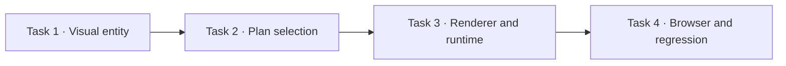
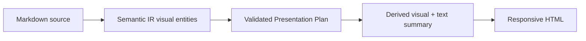

# Source 관계 기반 Visual Docs 구현 계획

> forge executing-plans skill로 Task별 red → green → checkpoint 순서로 실행하고, release boundary 전까지 중단 없이 진행한다.

Status: complete

**Related Specs:**
- bundle: docs/specs/review-viewer-lifecycle/

**목표:** source에 명시된 순서·소유·의존·coverage 관계가 threshold를 충족하면 관계 형태에 맞는 derived visual과 text·table 대체 경로를 함께 렌더링한다.

**아키텍처:** Semantic IR은 source block에서 결정적으로 계산한 visual candidate를 별도 entity로 보존한다. Presentation Plan은 candidate와 View Context로 state flow, responsibility structure, dependency 또는 coverage visual을 선택하고, renderer는 source label을 그대로 사용한 Mermaid 또는 native matrix를 만든다. Mermaid runtime은 source Mermaid가 없어도 실제 derived Mermaid가 plan에 있을 때 포함한다.

**기술 스택:** Python 3 표준 라이브러리, 정적 HTML·CSS·JavaScript, Mermaid 11.16.0, Playwright browser fixture, Forge `forge/spec@3`

## Global Constraints

- source 밖 node, edge, 순서, 책임, dependency 또는 의미를 만들지 않는다.
- 세 ordered node, 세 hierarchy·ownership·dependency node, 두 mapping edge threshold를 적용한다.
- 짧은 prose, 일차원 list와 두 node 이하 연결은 text로 유지한다.
- visual 앞에는 질문형 제목, 확인점, 읽는 법과 source-backed text·table summary를 둔다.
- desktop 1440px, mobile 390px와 print에서 읽기 순서와 overflow를 검증한다.
- 기존 Project Handbook, Spec workspace, source Mermaid bytes와 deterministic build를 회귀시키지 않는다.
- 개별 생성 View 갱신, version bump, commit, push와 release는 범위 밖이다.

## Statement Coverage

| Statement | Kind | Task |
|---|---|---:|
| [Brief, Plan과 Spec fixture를 각각 `brief`, `plan`, `spec` kind로 build하면 서로 다른 `.forge/visual-docs/<view-id>/view.html`이 생성되고 Git 추적 파일은 변경되지 않으며 각 View가 kind에 맞는 primary composition과 source provenance를 표시한다.](../../specs/review-viewer-lifecycle/human-readable-review-viewer.md#brief-plan과-spec-fixture를-각각-brief-plan-spec-kind로-build하면-서로-다른-forgevisual-docsview-idviewhtml이-생성되고-git-추적-파일은-변경되지-않으며-각-view가-kind에-맞는-primary-composition과-source-provenance를-표시한다) | Acceptance | 4 |
| [valid `forge/project-map@1`, 존재하는 Structure path와 approved 또는 implemented Spec Bundle을 가진 fixture를 `project` kind로 build하면 `docs/project-viewer/index.html`이 생성되고 개요, 설계 기준, 프로젝트 구조의 좌측 탐색과 선택한 우측 상세가 나타나며 freshness check와 repository validation이 통과한다.](../../specs/review-viewer-lifecycle/human-readable-review-viewer.md#valid-forgeproject-map1-존재하는-structure-path와-approved-또는-implemented-spec-bundle을-가진-fixture를-project-kind로-build하면-docsproject-viewerindexhtml이-생성되고-개요-설계-기준-프로젝트-구조의-좌측-탐색과-선택한-우측-상세가-나타나며-freshness-check와-repository-validation이-통과한다) | Acceptance | 4 |
| [저장된 spec kind Visual Docs가 있는 상태에서 spec을 변경해도 Forge는 Visual Docs를 자동 갱신하지 않고 stale 사실만 알리며, 사용자가 갱신을 명시적으로 요청한 뒤에만 같은 view-id의 `.forge/visual-docs/<view-id>/view.html`을 새 source hash와 내용으로 갱신하고 Git 비추적 상태를 유지한다.](../../specs/review-viewer-lifecycle/human-readable-review-viewer.md#저장된-spec-kind-visual-docs가-있는-상태에서-spec을-변경해도-forge는-visual-docs를-자동-갱신하지-않고-stale-사실만-알리며-사용자가-갱신을-명시적으로-요청한-뒤에만-같은-view-id의-forgevisual-docsview-idviewhtml을-새-source-hash와-내용으로-갱신하고-git-비추적-상태를-유지한다) | Acceptance | 4 |
| [고정 Visual Docs tooling으로 개별 View를 build하면 성공한 build에서 작업을 종료하고 별도 checker나 브라우저 검증을 실행하지 않으며 governing spec의 lifecycle status를 변경하지 않는다. Visual Docs tooling 자체를 변경하면 이 예외 없이 일반 구현 검증을 수행한다.](../../specs/review-viewer-lifecycle/human-readable-review-viewer.md#고정-visual-docs-tooling으로-개별-view를-build하면-성공한-build에서-작업을-종료하고-별도-checker나-브라우저-검증을-실행하지-않으며-governing-spec의-lifecycle-status를-변경하지-않는다-visual-docs-tooling-자체를-변경하면-이-예외-없이-일반-구현-검증을-수행한다) | Acceptance | 4 |
| [spec 또는 plan의 Markdown source 작성과 자체 검토가 끝나면 Visual Docs가 유용한 경우 승인 또는 handoff 메시지에서 생성 여부를 묻고, 사용자의 명시적 응답 전에는 Visual Docs HTML이 생성되지 않는다.](../../specs/review-viewer-lifecycle/human-readable-review-viewer.md#spec-또는-plan의-markdown-source-작성과-자체-검토가-끝나면-visual-docs가-유용한-경우-승인-또는-handoff-메시지에서-생성-여부를-묻고-사용자의-명시적-응답-전에는-visual-docs-html이-생성되지-않는다) | Acceptance | 4 |
| [새 spec과 새 plan은 각각 독립된 docs 경로를 유지하고, 명시적 생성 요청을 받은 Visual Docs만 `.forge/visual-docs/<view-id>/view.html`에 생성되며 Git 추적 파일 목록에는 source 옆 `view.html`이나 Visual Docs가 나타나지 않는다.](../../specs/review-viewer-lifecycle/human-readable-review-viewer.md#새-spec과-새-plan은-각각-독립된-docs-경로를-유지하고-명시적-생성-요청을-받은-visual-docs만-forgevisual-docsview-idviewhtml에-생성되며-git-추적-파일-목록에는-source-옆-viewhtml이나-visual-docs가-나타나지-않는다) | Acceptance | 4 |
| [조사·debug 중간 기록은 `.forge/`에서 Git 비추적 상태로 유지되고, 공유 또는 장기 보존 대상으로 결정한 기록은 `docs/research/` 또는 `docs/debug/`로 이동해 Git 추적된다.](../../specs/review-viewer-lifecycle/human-readable-review-viewer.md#조사debug-중간-기록은-forge에서-git-비추적-상태로-유지되고-공유-또는-장기-보존-대상으로-결정한-기록은-docsresearch-또는-docsdebug로-이동해-git-추적된다) | Acceptance | 4 |
| [일반 spec·plan 작성·변경·승인·handoff fixture에서는 HTML 생성 count가 0이고, 사용자가 `visual-docs`를 명시적으로 요청한 fixture에서만 `.forge/visual-docs/<view-id>/view.html`이 생성된다. Source-adjacent Spec Pages, plan pages와 HTML catalog는 생성되지 않는다.](../../specs/review-viewer-lifecycle/human-readable-review-viewer.md#일반-specplan-작성변경승인handoff-fixture에서는-html-생성-count가-0이고-사용자가-visual-docs를-명시적으로-요청한-fixture에서만-forgevisual-docsview-idviewhtml이-생성된다-source-adjacent-spec-pages-plan-pages와-html-catalog는-생성되지-않는다) | Acceptance | 4 |
| [current structured spec과 comparison source가 있는 fixture를 spec kind로 build하면 deterministic parser가 각 source의 Requirement·Acceptance Criterion·Mermaid를 분리하고 `Current spec source`와 `Comparison source` provenance를 표시하며 각 Mermaid text의 SHA-256이 source fence와 일치한다.](../../specs/review-viewer-lifecycle/source-selection-and-freshness.md#current-structured-spec과-comparison-source가-있는-fixture를-spec-kind로-build하면-deterministic-parser가-각-source의-requirementacceptance-criterionmermaid를-분리하고-current-spec-source와-comparison-source-provenance를-표시하며-각-mermaid-text의-sha-256이-source-fence와-일치한다) | Acceptance | 4 |
| [History panel에서 source role·bundle·root·member path, 생성 당시 member·bundle hash, mode, locale, source별 counts, 생성 시각, checkpoint, commit, rebuild command를 확인할 수 있고 primary와 comparison·context freshness가 각각 `unverified`, `stale`, `current`로 표시된다. 일반 panel은 H1, path와 full statement를 주 label로 사용한다.](../../specs/review-viewer-lifecycle/source-selection-and-freshness.md#history-panel에서-source-rolebundlerootmember-path-생성-당시-memberbundle-hash-mode-locale-source별-counts-생성-시각-checkpoint-commit-rebuild-command를-확인할-수-있고-primary와-comparisoncontext-freshness가-각각-unverified-stale-current로-표시된다-일반-panel은-h1-path와-full-statement를-주-label로-사용한다) | Acceptance | 4 |
| [HTTP same-origin으로 Visual Docs를 열고 source를 변경하지 않은 경우 role별 `cache: no-store` fetch와 Web Crypto SHA-256 비교 뒤 `current`가 표시되고, source 한 바이트를 변경하면 해당 source set이 `stale`로 표시된다.](../../specs/review-viewer-lifecycle/source-selection-and-freshness.md#http-same-origin으로-visual-docs를-열고-source를-변경하지-않은-경우-role별-cache-no-store-fetch와-web-crypto-sha-256-비교-뒤-current가-표시되고-source-한-바이트를-변경하면-해당-source-set이-stale로-표시된다) | Acceptance | 4 |
| [`file://`에서 자동 source 접근이 실패하면 `unverified`와 파일 선택 동작이 표시되고, bundle path와 semantic filename에 맞는 여러 member를 선택하면 로컬 브라우저 안에서만 member·bundle hash가 계산되어 상태가 갱신되며 네트워크 전송이 발생하지 않는다.](../../specs/review-viewer-lifecycle/source-selection-and-freshness.md#file에서-자동-source-접근이-실패하면-unverified와-파일-선택-동작이-표시되고-bundle-path와-semantic-filename에-맞는-여러-member를-선택하면-로컬-브라우저-안에서만-memberbundle-hash가-계산되어-상태가-갱신되며-네트워크-전송이-발생하지-않는다) | Acceptance | 4 |
| [primary plan set과 Related Specs context를 가진 Visual Docs에서 primary와 context aggregate 상태가 분리되고, 각 set 안에서 모두 일치하면 `current`, 하나가 다르면 `stale`, stale 없이 하나가 누락되면 `unverified`가 표시되며 각 source 행에 개별 상태와 실패 원인이 나타난다.](../../specs/review-viewer-lifecycle/source-selection-and-freshness.md#primary-plan-set과-related-specs-context를-가진-visual-docs에서-primary와-context-aggregate-상태가-분리되고-각-set-안에서-모두-일치하면-current-하나가-다르면-stale-stale-없이-하나가-누락되면-unverified가-표시되며-각-source-행에-개별-상태와-실패-원인이-나타난다) | Acceptance | 4 |
| [`--check`를 현재 로컬 Visual Docs에 실행하면 exit code 0을 반환하고, source 변경·누락·manifest 오류 fixture에서는 non-zero를 반환하지만 Visual Docs를 자동 재생성하지 않는다.](../../specs/review-viewer-lifecycle/source-selection-and-freshness.md#check를-현재-로컬-visual-docs에-실행하면-exit-code-0을-반환하고-source-변경누락manifest-오류-fixture에서는-non-zero를-반환하지만-visual-docs를-자동-재생성하지-않는다) | Acceptance | 4 |
| [여러 block이 같은 bundle member를 인용하는 fixture에서 각 panel의 provenance 표시 횟수가 source group당 1회로 줄고, source role이 바뀌는 지점에서 다시 나타나며, primary·comparison·context 구분과 statement deep link 대상이 축약 전과 동일하다. Manifest와 History panel에는 모든 source의 role·bundle·member path·hash가 그대로 남고 일반 panel의 주 label은 H1·path·full statement다.](../../specs/review-viewer-lifecycle/source-selection-and-freshness.md#여러-block이-같은-bundle-member를-인용하는-fixture에서-각-panel의-provenance-표시-횟수가-source-group당-1회로-줄고-source-role이-바뀌는-지점에서-다시-나타나며-primarycomparisoncontext-구분과-statement-deep-link-대상이-축약-전과-동일하다-manifest와-history-panel에는-모든-source의-rolebundlemember-pathhash가-그대로-남고-일반-panel의-주-label은-h1pathfull-statement다) | Acceptance | 4 |
| [자유로운 section 순서와 여러 member를 가진 workflow·API·architecture bundle과 plan fixture를 parse하면 root·member metadata, outline, 모든 prose·table·code·Mermaid block과 full-statement entity가 bundle·member-qualified anchor를 갖고 Semantic IR에 정확히 한 번 존재하며 content coverage가 100%다.](../../specs/review-viewer-lifecycle/source-selection-and-freshness.md#자유로운-section-순서와-여러-member를-가진-workflowapiarchitecture-bundle과-plan-fixture를-parse하면-rootmember-metadata-outline-모든-prosetablecodemermaid-block과-full-statement-entity가-bundlemember-qualified-anchor를-갖고-semantic-ir에-정확히-한-번-존재하며-content-coverage가-100다) | Acceptance | 4 |
| [복잡도 1점과 2점인 문서는 모두 Markdown source 검토 경로를 기본으로 사용하고, 2점인 문서에서는 Visual Docs의 효용만 안내하며, 사용자가 시각화를 명시적으로 요청한 문서만 Visual Docs 경로를 사용한다.](../../specs/review-viewer-lifecycle/adaptive-presentation-and-navigation.md#복잡도-1점과-2점인-문서는-모두-markdown-source-검토-경로를-기본으로-사용하고-2점인-문서에서는-visual-docs의-효용만-안내하며-사용자가-시각화를-명시적으로-요청한-문서만-visual-docs-경로를-사용한다) | Acceptance | 4 |
| [`visual-docs`로 독립된 spec fixture와 plan fixture를 각각 `spec`, `plan` kind, `--locale ko`, 서로 다른 review ID로 build하면 `.forge/visual-docs/<view-id>/view.html`이 생성되고 tab label이 한국어로 표시되며 `combined` kind 요청은 거부된다.](../../specs/review-viewer-lifecycle/adaptive-presentation-and-navigation.md#visual-docs로-독립된-spec-fixture와-plan-fixture를-각각-spec-plan-kind-locale-ko-서로-다른-review-id로-build하면-forgevisual-docsview-idviewhtml이-생성되고-tab-label이-한국어로-표시되며-combined-kind-요청은-거부된다) | Acceptance | 4 |
| [spec kind와 plan kind에서 source Mermaid와 derived diagram을 표시하면 `Current spec source`, `Comparison source`, `Plan source`, `Related spec context`, `Derived view`가 해당 source가 존재하는 범위에서 구분되고 path가 표시되며 derived node·edge는 selected source에 명시된 관계만 포함한다.](../../specs/review-viewer-lifecycle/adaptive-presentation-and-navigation.md#spec-kind와-plan-kind에서-source-mermaid와-derived-diagram을-표시하면-current-spec-source-comparison-source-plan-source-related-spec-context-derived-view가-해당-source가-존재하는-범위에서-구분되고-path가-표시되며-derived-nodeedge는-selected-source에-명시된-관계만-포함한다) | Acceptance | 4 |
| [모든 diagram 앞에 제목, 이 화면에서 확인할 것, 한 문장의 읽는 법이 있고 넓은 sequence diagram 앞에는 runtime 책임 요약표가 먼저 표시된다.](../../specs/review-viewer-lifecycle/adaptive-presentation-and-navigation.md#모든-diagram-앞에-제목-이-화면에서-확인할-것-한-문장의-읽는-법이-있고-넓은-sequence-diagram-앞에는-runtime-책임-요약표가-먼저-표시된다) | Acceptance | 4 |
| [390px viewport에서 넓은 sequence diagram과 표가 문서 viewport를 확장하지 않고 각 wrapper 안에서 가로 스크롤되며 책임 요약표를 먼저 읽을 수 있다.](../../specs/review-viewer-lifecycle/adaptive-presentation-and-navigation.md#390px-viewport에서-넓은-sequence-diagram과-표가-문서-viewport를-확장하지-않고-각-wrapper-안에서-가로-스크롤되며-책임-요약표를-먼저-읽을-수-있다) | Acceptance | 4 |
| [diagram 접근성 이름, inline favicon, tabular number가 DOM과 computed style에 존재하고 favicon 404가 발생하지 않는다.](../../specs/review-viewer-lifecycle/adaptive-presentation-and-navigation.md#diagram-접근성-이름-inline-favicon-tabular-number가-dom과-computed-style에-존재하고-favicon-404가-발생하지-않는다) | Acceptance | 4 |
| [잘못된 Mermaid fixture를 열면 다른 panel은 정상 동작하고 오류 diagram에는 오류 요약, 가능한 line·column, 원문 source가 표시된다.](../../specs/review-viewer-lifecycle/adaptive-presentation-and-navigation.md#잘못된-mermaid-fixture를-열면-다른-panel은-정상-동작하고-오류-diagram에는-오류-요약-가능한-linecolumn-원문-source가-표시된다) | Acceptance | 4 |
| [current·comparison·context bundle에 같은 statement가 있고 plan의 Task·Step이 함께 있는 Visual Docs에서 deep link와 검토 checkbox를 변경하고 page를 reload하면 bundle·member·statement namespace별 target과 checkbox 상태가 충돌 없이 복원되며 화면에는 full statement와 path만 표시된다.](../../specs/review-viewer-lifecycle/adaptive-presentation-and-navigation.md#currentcomparisoncontext-bundle에-같은-statement가-있고-plan의-taskstep이-함께-있는-visual-docs에서-deep-link와-검토-checkbox를-변경하고-page를-reload하면-bundlememberstatement-namespace별-target과-checkbox-상태가-충돌-없이-복원되며-화면에는-full-statement와-path만-표시된다) | Acceptance | 4 |
| [승인된 profile로 개별 Visual Docs를 생성할 때 UI 디자인 skill, 수동 HTML fragment, 문서별 template·CSS·script를 사용하지 않고 Semantic IR→Presentation Plan→component renderer가 HTML을 생성한다. Shell·component·profile·planner tooling 변경에만 `web-app-design`을 적용한다.](../../specs/review-viewer-lifecycle/adaptive-presentation-and-navigation.md#승인된-profile로-개별-visual-docs를-생성할-때-ui-디자인-skill-수동-html-fragment-문서별-templatecssscript를-사용하지-않고-semantic-irpresentation-plancomponent-renderer가-html을-생성한다-shellcomponentprofileplanner-tooling-변경에만-web-app-design을-적용한다) | Acceptance | 4 |
| [`.forge/visual-docs/<view-id>/view.html`의 CDN build와 `--offline` build가 모두 열리고 offline 파일에는 외부 Mermaid script 요청이 없으며 diagram이 렌더된다.](../../specs/review-viewer-lifecycle/adaptive-presentation-and-navigation.md#forgevisual-docsview-idviewhtml의-cdn-build와-offline-build가-모두-열리고-offline-파일에는-외부-mermaid-script-요청이-없으며-diagram이-렌더된다) | Acceptance | 4 |
| [plan kind의 execution과 status Viewer는 stable shell landmark와 source ownership을 공유하면서 서로 다른 primary component와 reading order를 가지며, 두 View 모두 plan source detail과 acceptance evidence로 이동할 수 있다.](../../specs/review-viewer-lifecycle/adaptive-presentation-and-navigation.md#plan-kind의-execution과-status-viewer는-stable-shell-landmark와-source-ownership을-공유하면서-서로-다른-primary-component와-reading-order를-가지며-두-view-모두-plan-source-detail과-acceptance-evidence로-이동할-수-있다) | Acceptance | 4 |
| [Visual Docs shell·template·style·script·runtime 동작을 변경한 경우에만 desktop 1440px와 mobile 390px browser 검증에서 tab, namespaced deep link, checkbox persistence, diagram, table, print layout이 정상이며 Mermaid error가 0개임을 확인하고, 개별 View 생성에서는 해당 검증을 실행하지 않는다.](../../specs/review-viewer-lifecycle/adaptive-presentation-and-navigation.md#visual-docs-shelltemplatestylescriptruntime-동작을-변경한-경우에만-desktop-1440px와-mobile-390px-browser-검증에서-tab-namespaced-deep-link-checkbox-persistence-diagram-table-print-layout이-정상이며-mermaid-error가-0개임을-확인하고-개별-view-생성에서는-해당-검증을-실행하지-않는다) | Acceptance | 4 |
| [Visual Docs tooling fixture에 Markdown source와 View Context를 입력하면 Semantic IR, validated Presentation Plan, source manifest와 profile-specific HTML이 만들어지고 unresolved source reference·수동 content fragment·source 밖 의미가 0개다. 개별 View 생성 뒤에는 이 fixture를 반복하지 않는다.](../../specs/review-viewer-lifecycle/adaptive-presentation-and-navigation.md#visual-docs-tooling-fixture에-markdown-source와-view-context를-입력하면-semantic-ir-validated-presentation-plan-source-manifest와-profile-specific-html이-만들어지고-unresolved-source-reference수동-content-fragmentsource-밖-의미가-0개다-개별-view-생성-뒤에는-이-fixture를-반복하지-않는다) | Acceptance | 4 |
| [source Mermaid와 derived diagram이 모두 0개인 source set과 하나 이상인 source set을 각각 `--offline`으로 build하면 전자의 generated bytes에는 Mermaid runtime이 없고 후자에는 있으며, 두 snapshot 모두 network를 차단한 브라우저에서 오류 없이 열린다. CDN mode에서도 diagram이 0개인 snapshot에는 loader가 출력되지 않고, 같은 입력 재build diff는 0이다.](../../specs/review-viewer-lifecycle/adaptive-presentation-and-navigation.md#source-mermaid와-derived-diagram이-모두-0개인-source-set과-하나-이상인-source-set을-각각-offline으로-build하면-전자의-generated-bytes에는-mermaid-runtime이-없고-후자에는-있으며-두-snapshot-모두-network를-차단한-브라우저에서-오류-없이-열린다-cdn-mode에서도-diagram이-0개인-snapshot에는-loader가-출력되지-않고-같은-입력-재build-diff는-0이다) | Acceptance | 4 |
| [Spec kind와 plan kind의 Overview panel을 열면 source별 요약 지표가 먼저 보이고 상세 집계 표가 그 아래에 남으며 두 표시의 수치가 structured parser의 같은 집계 기준과 일치한다.](../../specs/review-viewer-lifecycle/adaptive-presentation-and-navigation.md#spec-kind와-plan-kind의-overview-panel을-열면-source별-요약-지표가-먼저-보이고-상세-집계-표가-그-아래에-남으며-두-표시의-수치가-structured-parser의-같은-집계-기준과-일치한다) | Acceptance | 4 |
| [공통 provenance와 reading-route 구현을 검증하면 desktop 1440px와 mobile 390px의 tab, 표, diagram, deep link와 checkbox가 동작하고 이후 개별 `view.html` 생성에는 post-build checker나 browser 검증이 추가되지 않는다.](../../specs/review-viewer-lifecycle/adaptive-presentation-and-navigation.md#공통-provenance와-reading-route-구현을-검증하면-desktop-1440px와-mobile-390px의-tab-표-diagram-deep-link와-checkbox가-동작하고-이후-개별-viewhtml-생성에는-post-build-checker나-browser-검증이-추가되지-않는다) | Acceptance | 4 |
| [같은 workflow spec을 `approval`과 `implementation`, 같은 plan을 `execution`과 `status`로 build하면 stable shell·visual system·provenance는 같고 primary component, reading order, navigation과 summary density는 각 profile·intent 계약에 맞게 다르다.](../../specs/review-viewer-lifecycle/adaptive-presentation-and-navigation.md#같은-workflow-spec을-approval과-implementation-같은-plan을-execution과-status로-build하면-stable-shellvisual-systemprovenance는-같고-primary-component-reading-order-navigation과-summary-density는-각-profileintent-계약에-맞게-다르다) | Acceptance | 4 |
| [Presentation Plan fixture에 HTML·CSS·script, source 밖 prose, unknown component, dangling reference, duplicate exclusive block과 uncovered block을 각각 주입하면 validator가 실패하고, allowed component와 valid source reference만 가진 plan은 deterministic renderer 입력으로 통과한다.](../../specs/review-viewer-lifecycle/adaptive-presentation-and-navigation.md#presentation-plan-fixture에-htmlcssscript-source-밖-prose-unknown-component-dangling-reference-duplicate-exclusive-block과-uncovered-block을-각각-주입하면-validator가-실패하고-allowed-component와-valid-source-reference만-가진-plan은-deterministic-renderer-입력으로-통과한다) | Acceptance | 4 |
| [알려진 subtype은 해당 reusable profile을 사용하고 custom system subtype은 spec.system, 그 밖의 unknown subtype은 generic fallback으로 모든 content를 표시한다. Agent가 제안한 unusual source plan도 validation 뒤에만 렌더링되며, 어떤 profile·fallback도 사용자의 명시적 요청 전에 artifact를 생성하지 않는다.](../../specs/review-viewer-lifecycle/adaptive-presentation-and-navigation.md#알려진-subtype은-해당-reusable-profile을-사용하고-custom-system-subtype은-specsystem-그-밖의-unknown-subtype은-generic-fallback으로-모든-content를-표시한다-agent가-제안한-unusual-source-plan도-validation-뒤에만-렌더링되며-어떤-profilefallback도-사용자의-명시적-요청-전에-artifact를-생성하지-않는다) | Acceptance | 4 |
| [10개 이상의 member, 60개 이상의 Requirement, 15개 이상의 Acceptance와 source Mermaid 0개를 가진 system fixture를 review intent로 build하면 spec.system이 선택되고 system overview, member·section 검색 탐색, source 표에서 계산한 책임·interface, Requirement·Acceptance coverage와 전체 source detail이 중복 없이 표시된다.](../../specs/review-viewer-lifecycle/adaptive-presentation-and-navigation.md#10개-이상의-member-60개-이상의-requirement-15개-이상의-acceptance와-source-mermaid-0개를-가진-system-fixture를-review-intent로-build하면-specsystem이-선택되고-system-overview-membersection-검색-탐색-source-표에서-계산한-책임interface-requirementacceptance-coverage와-전체-source-detail이-중복-없이-표시된다) | Acceptance | 4 |
| [source Mermaid가 없지만 명시된 상태 흐름, ownership table, dependency와 Requirement·Acceptance mapping을 가진 fixture를 build하면 flowchart, structure·responsibility map과 coverage visual이 Derived view로 표시되고 각 node와 edge가 source 값과 일치한다.](../../specs/review-viewer-lifecycle/adaptive-presentation-and-navigation.md#source-mermaid가-없지만-명시된-상태-흐름-ownership-table-dependency와-requirementacceptance-mapping을-가진-fixture를-build하면-flowchart-structureresponsibility-map과-coverage-visual이-derived-view로-표시되고-각-node와-edge가-source-값과-일치한다) | Acceptance | 4 |
| [관계형 source가 없는 prose·short-list fixture를 build하면 장식용 diagram과 Mermaid runtime이 생성되지 않고 기존 text reading path와 content coverage가 유지된다.](../../specs/review-viewer-lifecycle/adaptive-presentation-and-navigation.md#관계형-source가-없는-proseshort-list-fixture를-build하면-장식용-diagram과-mermaid-runtime이-생성되지-않고-기존-text-reading-path와-content-coverage가-유지된다) | Acceptance | 4 |
| [fixed timestamp를 사용한 동일 source·View Context·Presentation Plan 재build diff는 0이고, shell·component·profile·planner 변경은 desktop 1440px와 mobile 390px의 profile별 typical·empty·long·invalid diagram, keyboard, disclosure, overflow와 stable shell geometry 검증을 통과한다.](../../specs/review-viewer-lifecycle/adaptive-presentation-and-navigation.md#fixed-timestamp를-사용한-동일-sourceview-contextpresentation-plan-재build-diff는-0이고-shellcomponentprofileplanner-변경은-desktop-1440px와-mobile-390px의-profile별-typicalemptylonginvalid-diagram-keyboard-disclosure-overflow와-stable-shell-geometry-검증을-통과한다) | Acceptance | 4 |
| [Acceptance statement가 있는 bundle과 없는 bundle을 함께 참조하는 `plan.md`, `progress.md`, `tasks/*.md` fixture를 plan kind로 build하면 primary Task·Step count와 context bundle·member별 Requirement·Acceptance Criterion count가 분리되고, plan에 명시된 full-statement link만 사용해 각각 Requirement → Acceptance Criterion → Task → Step과 Requirement → Task → Step mapping이 만들어진다.](../../specs/review-viewer-lifecycle/plan-context-and-statement-traceability.md#acceptance-statement가-있는-bundle과-없는-bundle을-함께-참조하는-planmd-progressmd-tasksmd-fixture를-plan-kind로-build하면-primary-taskstep-count와-context-bundlemember별-requirementacceptance-criterion-count가-분리되고-plan에-명시된-full-statement-link만-사용해-각각-requirement-acceptance-criterion-task-step과-requirement-task-step-mapping이-만들어진다) | Acceptance | 4 |
| [Related Specs context가 있는 large-plan fixture의 Task가 의미 있는 Route로 표시되고 Route 순서와 Task membership이 plan primary source set과 일치하며 context source가 Route membership을 바꾸지 않는다.](../../specs/review-viewer-lifecycle/plan-context-and-statement-traceability.md#related-specs-context가-있는-large-plan-fixture의-task가-의미-있는-route로-표시되고-route-순서와-task-membership이-plan-primary-source-set과-일치하며-context-source가-route-membership을-바꾸지-않는다) | Acceptance | 4 |
| [복잡한 plan을 작성하면 독립 plan path, 선택적인 bundle-path `Related Specs`, Task별 `Governing statements`, 필수 구조, 6~10 Route grouping, plan source로부터 만든 diagram 관점, checkpoint가 존재하고 Task 분리는 독립 소유권·병렬 실행·독립 승인 조건에서만 사용된다.](../../specs/review-viewer-lifecycle/plan-context-and-statement-traceability.md#복잡한-plan을-작성하면-독립-plan-path-선택적인-bundle-path-related-specs-task별-governing-statements-필수-구조-610-route-grouping-plan-source로부터-만든-diagram-관점-checkpoint가-존재하고-task-분리는-독립-소유권병렬-실행독립-승인-조건에서만-사용된다) | Acceptance | 4 |
| [저장된 plan kind Visual Docs가 있는 Task checkpoint에서 primary set이나 Related Specs context가 변경되어도 자동 갱신하지 않고 Markdown으로 보고하며, 사용자가 갱신을 명시적으로 요청한 경우에만 current primary set과 context sources를 포함해 같은 view-id를 재생성한다.](../../specs/review-viewer-lifecycle/plan-context-and-statement-traceability.md#저장된-plan-kind-visual-docs가-있는-task-checkpoint에서-primary-set이나-related-specs-context가-변경되어도-자동-갱신하지-않고-markdown으로-보고하며-사용자가-갱신을-명시적으로-요청한-경우에만-current-primary-set과-context-sources를-포함해-같은-view-id를-재생성한다) | Acceptance | 4 |
| [관련 spec이 없는 운영 plan, 하나의 approved bundle을 참조하는 기능 plan, 여러 approved bundle을 참조하는 교차 기능 plan을 canonical Related Specs 문법으로 작성하면 모두 독립 plan 경로를 유지한다. 중복·존재하지 않는 bundle, 존재하지 않거나 link text가 다른 statement, repository path escape와 approved bundle 없이 제품 동작을 변경하려는 plan은 작성 단계에서 거부된다.](../../specs/review-viewer-lifecycle/plan-context-and-statement-traceability.md#관련-spec이-없는-운영-plan-하나의-approved-bundle을-참조하는-기능-plan-여러-approved-bundle을-참조하는-교차-기능-plan을-canonical-related-specs-문법으로-작성하면-모두-독립-plan-경로를-유지한다-중복존재하지-않는-bundle-존재하지-않거나-link-text가-다른-statement-repository-path-escape와-approved-bundle-없이-제품-동작을-변경하려는-plan은-작성-단계에서-거부된다) | Acceptance | 4 |
| [작은 plan의 진행 상태는 `plan.md`만으로 관리되고, 긴 checkpoint fixture는 `progress.md`, 독립 소유권이 있는 큰 Task fixture는 `tasks/*.md`를 사용하며, plan 삭제 전 영구 결정이 governing spec 또는 ADR로 이전됐는지 확인된다.](../../specs/review-viewer-lifecycle/plan-context-and-statement-traceability.md#작은-plan의-진행-상태는-planmd만으로-관리되고-긴-checkpoint-fixture는-progressmd-독립-소유권이-있는-큰-task-fixture는-tasksmd를-사용하며-plan-삭제-전-영구-결정이-governing-spec-또는-adr로-이전됐는지-확인된다) | Acceptance | 4 |
| [Project Map의 Structure entry에 Purpose 또는 Owns가 없거나 path·Entry Point가 존재하지 않거나 Spec·statement link가 dangling인 fixture는 Project Handbook build에 실패하고 source를 수정할 수 있는 path-qualified 진단을 반환한다.](../../specs/review-viewer-lifecycle/project-handbook-and-structure.md#project-map의-structure-entry에-purpose-또는-owns가-없거나-pathentry-point가-존재하지-않거나-specstatement-link가-dangling인-fixture는-project-handbook-build에-실패하고-source를-수정할-수-있는-path-qualified-진단을-반환한다) | Acceptance | 4 |
| [같은 Spec Bundle을 Project Handbook의 설계 기준 상세와 독립 spec kind로 build하면 member path, full Requirement·Acceptance heading, Mermaid SHA-256과 provenance가 일치하고 Project Handbook 개요에는 해당 statement 본문이 중복되지 않는다.](../../specs/review-viewer-lifecycle/project-handbook-and-structure.md#같은-spec-bundle을-project-handbook의-설계-기준-상세와-독립-spec-kind로-build하면-member-path-full-requirementacceptance-heading-mermaid-sha-256과-provenance가-일치하고-project-handbook-개요에는-해당-statement-본문이-중복되지-않는다) | Acceptance | 4 |
| [Project Map과 repository evidence를 가진 Project Handbook에서 Structure node를 선택하면 역할과 담당 범위가 주요 파일보다 먼저 표시되고 출처·검증을 열면 해당 node의 Runtime mirror, validation, drift, source hash와 lifecycle evidence만 확인되며 narrow viewport에서도 탐색으로 돌아갈 수 있다.](../../specs/review-viewer-lifecycle/project-handbook-and-structure.md#project-map과-repository-evidence를-가진-project-handbook에서-structure-node를-선택하면-역할과-담당-범위가-주요-파일보다-먼저-표시되고-출처검증을-열면-해당-node의-runtime-mirror-validation-drift-source-hash와-lifecycle-evidence만-확인되며-narrow-viewport에서도-탐색으로-돌아갈-수-있다) | Acceptance | 4 |

## 구현 Route

| Route | Task | 산출물 | Checkpoint |
|---|---:|---|---|
| Route 1 — Extraction | 1 | ordered flow·responsibility visual entities | internal |
| Route 2 — Selection | 2 | threshold 기반 Presentation Plan refs | internal |
| Route 3 — Rendering | 3 | flowchart·structure map·coverage visual | notify |
| Route 4 — Runtime | 3 | derived Mermaid-aware loader | internal |
| Route 5 — Responsive | 4 | desktop·mobile·print visual fallback | internal |
| Route 6 — Regression | 4 | 관계형·비관계형·deterministic full suite | release boundary |

## Task 의존성은 어떻게 이어지는가?

확인할 것: source relation을 먼저 보존하고, plan이 선택한 candidate만 renderer와 runtime이 소비한다.

읽는 법: 화살표는 후속 Task가 소비하는 stable interface다.

## Runtime 책임은 어디에 있는가?

| 주체 | 책임 |
|---|---|
| Source parser | 원문 block과 explicit 관계를 보존 |
| Semantic IR | visual kind, exact node·edge label, source path 기록 |
| Presentation Plan | threshold와 intent에 맞는 component 선택 |
| Renderer | derived visual과 대체 요약 생성 |
| Mermaid loader | 실제 source·derived Mermaid 존재 시에만 runtime 포함 |
| Browser runtime | diagram render, 오류 fallback, overflow와 accessibility |

## 데이터 흐름은 어떻게 유지되는가?

## 확장 지점은 무엇인가?

| Relation shape | 현재 구현 | 확장 규칙 |
|---|---|---|
| ordered | arrow-delimited inline flow | flowchart 또는 sequence |
| ownership | responsibility·owner table | structure map + table |
| mapping | Requirement·Acceptance relation | coverage graph 또는 matrix |
| dependency | plan·Project Map explicit edge | dependency graph |
| none | prose·short list | visual 생성 없음 |

### Task 1: Semantic visual candidate 추출

**Governing statements:**
- [source Mermaid가 없지만 명시된 상태 흐름, ownership table, dependency와 Requirement·Acceptance mapping을 가진 fixture를 build하면 flowchart, structure·responsibility map과 coverage visual이 Derived view로 표시되고 각 node와 edge가 source 값과 일치한다.](../../specs/review-viewer-lifecycle/adaptive-presentation-and-navigation.md#source-mermaid가-없지만-명시된-상태-흐름-ownership-table-dependency와-requirementacceptance-mapping을-가진-fixture를-build하면-flowchart-structure-responsibility-map과-coverage-visual이-derived-view로-표시되고-각-node와-edge가-source-값과-일치한다)
- [관계형 source가 없는 prose·short-list fixture를 build하면 장식용 diagram과 Mermaid runtime이 생성되지 않고 기존 text reading path와 content coverage가 유지된다.](../../specs/review-viewer-lifecycle/adaptive-presentation-and-navigation.md#관계형-source가-없는-proseshort-list-fixture를-build하면-장식용-diagram과-mermaid-runtime이-생성되지-않고-기존-text-reading-path와-content-coverage가-유지된다)

**파일:** 수정 `plugins/forge/skills/visual-docs/scripts/review_ir.py`; 테스트 `plugins/forge/skills/visual-docs/tests/test_review_ir.py`.

**Interfaces:** `SemanticEntity.entity_type in {"ordered-flow", "responsibility-map"}`; attributes는 `nodes`, `edges`, `source_path`, `source_line`을 가진다.

**실행 metadata:** 의존성 없음; parser와 IR test 소유; deterministic unit test가 강함; approval gate 없음.

- [x] **Step 1: 세 node arrow flow와 ownership table은 visual entity가 되고 두 node flow와 prose list는 되지 않는 실패 테스트를 작성한다.**
- [x] **Step 2: IR test를 실행해 `ordered-flow`와 `responsibility-map` 부재로 실패하는지 확인한다.**
- [x] **Step 3: arrow token과 Markdown table header·row만 읽는 최소 extractor를 구현한다.**
- [x] **Step 4: 같은 source를 두 번 parse한 entity attributes가 같고 source label이 보존되는지 확인한다.**

### Task 2: Presentation Plan visual selection

**Governing statements:**
- [source Mermaid가 없지만 명시된 상태 흐름, ownership table, dependency와 Requirement·Acceptance mapping을 가진 fixture를 build하면 flowchart, structure·responsibility map과 coverage visual이 Derived view로 표시되고 각 node와 edge가 source 값과 일치한다.](../../specs/review-viewer-lifecycle/adaptive-presentation-and-navigation.md#source-mermaid가-없지만-명시된-상태-흐름-ownership-table-dependency와-requirementacceptance-mapping을-가진-fixture를-build하면-flowchart-structure-responsibility-map과-coverage-visual이-derived-view로-표시되고-각-node와-edge가-source-값과-일치한다)
- [관계형 source가 없는 prose·short-list fixture를 build하면 장식용 diagram과 Mermaid runtime이 생성되지 않고 기존 text reading path와 content coverage가 유지된다.](../../specs/review-viewer-lifecycle/adaptive-presentation-and-navigation.md#관계형-source가-없는-proseshort-list-fixture를-build하면-장식용-diagram과-mermaid-runtime이-생성되지-않고-기존-text-reading-path와-content-coverage가-유지된다)

**파일:** 수정 `plugins/forge/skills/visual-docs/scripts/review_planner.py`; 테스트 `plugins/forge/skills/visual-docs/tests/test_review_planner.py`.

**Interfaces:** `state-map` accepts source `mermaid` and `ordered-flow`; `runtime-responsibility` accepts `responsibility-map`; coverage keeps explicit `covers` relations.

**실행 metadata:** Task 1 의존; planner/test 소유; IR type coupling 때문에 순차; approval gate 없음.

- [x] **Step 1: Mermaid 0인 system fixture가 non-empty state-map·runtime-responsibility refs를 선택하는 실패 테스트를 작성한다.**
- [x] **Step 2: planner test가 empty state-map refs로 실패하는지 확인한다.**
- [x] **Step 3: component entity registry와 coverage accounting을 새 entity type에 맞게 구현한다.**
- [x] **Step 4: sparse prose fixture는 visual refs 0이고 generic text coverage 100%인지 확인한다.**

### Task 3: Derived visual renderer와 runtime

**Governing statements:**
- [source Mermaid가 없지만 명시된 상태 흐름, ownership table, dependency와 Requirement·Acceptance mapping을 가진 fixture를 build하면 flowchart, structure·responsibility map과 coverage visual이 Derived view로 표시되고 각 node와 edge가 source 값과 일치한다.](../../specs/review-viewer-lifecycle/adaptive-presentation-and-navigation.md#source-mermaid가-없지만-명시된-상태-흐름-ownership-table-dependency와-requirementacceptance-mapping을-가진-fixture를-build하면-flowchart-structure-responsibility-map과-coverage-visual이-derived-view로-표시되고-각-node와-edge가-source-값과-일치한다)
- [관계형 source가 없는 prose·short-list fixture를 build하면 장식용 diagram과 Mermaid runtime이 생성되지 않고 기존 text reading path와 content coverage가 유지된다.](../../specs/review-viewer-lifecycle/adaptive-presentation-and-navigation.md#관계형-source가-없는-proseshort-list-fixture를-build하면-장식용-diagram과-mermaid-runtime이-생성되지-않고-기존-text-reading-path와-content-coverage가-유지된다)

**파일:** 수정 `plugins/forge/skills/visual-docs/scripts/review_components.py`, `plugins/forge/skills/visual-docs/scripts/review_renderer.py`, `plugins/forge/skills/visual-docs/assets/viewer-template.html`; 테스트 `plugins/forge/skills/visual-docs/tests/test_review_renderer.py`.

**Interfaces:** `_derived_visual_markup(entity, document, locale) -> str`; `review_needs_mermaid(bundle, ir, plan) -> bool`.

**실행 metadata:** Task 2 의존; renderer·loader·template 소유; impact high이고 source fidelity와 runtime을 함께 판단하므로 root 실행; approval gate 없음.

- [x] **Step 1: Derived view provenance, exact node·edge, summary-first order와 loader 포함 여부 실패 테스트를 작성한다.**
- [x] **Step 2: renderer test가 diagram 부재와 source Mermaid-only loader 때문에 실패하는지 확인한다.**
- [x] **Step 3: escaped Mermaid ID·label, source-backed summary table, accessibility name과 native coverage visual을 구현한다.**
- [x] **Step 4: invalid diagram fallback과 source Mermaid byte equality 회귀를 확인한다.**

### Task 4: Responsive·비관계형·전체 회귀 검증

**Governing statements:**
- [Brief, Plan과 Spec fixture를 각각 `brief`, `plan`, `spec` kind로 build하면 서로 다른 `.forge/visual-docs/<view-id>/view.html`이 생성되고 Git 추적 파일은 변경되지 않으며 각 View가 kind에 맞는 primary composition과 source provenance를 표시한다.](../../specs/review-viewer-lifecycle/human-readable-review-viewer.md#brief-plan과-spec-fixture를-각각-brief-plan-spec-kind로-build하면-서로-다른-forgevisual-docsview-idviewhtml이-생성되고-git-추적-파일은-변경되지-않으며-각-view가-kind에-맞는-primary-composition과-source-provenance를-표시한다)
- [valid `forge/project-map@1`, 존재하는 Structure path와 approved 또는 implemented Spec Bundle을 가진 fixture를 `project` kind로 build하면 `docs/project-viewer/index.html`이 생성되고 개요, 설계 기준, 프로젝트 구조의 좌측 탐색과 선택한 우측 상세가 나타나며 freshness check와 repository validation이 통과한다.](../../specs/review-viewer-lifecycle/human-readable-review-viewer.md#valid-forgeproject-map1-존재하는-structure-path와-approved-또는-implemented-spec-bundle을-가진-fixture를-project-kind로-build하면-docsproject-viewerindexhtml이-생성되고-개요-설계-기준-프로젝트-구조의-좌측-탐색과-선택한-우측-상세가-나타나며-freshness-check와-repository-validation이-통과한다)
- [저장된 spec kind Visual Docs가 있는 상태에서 spec을 변경해도 Forge는 Visual Docs를 자동 갱신하지 않고 stale 사실만 알리며, 사용자가 갱신을 명시적으로 요청한 뒤에만 같은 view-id의 `.forge/visual-docs/<view-id>/view.html`을 새 source hash와 내용으로 갱신하고 Git 비추적 상태를 유지한다.](../../specs/review-viewer-lifecycle/human-readable-review-viewer.md#저장된-spec-kind-visual-docs가-있는-상태에서-spec을-변경해도-forge는-visual-docs를-자동-갱신하지-않고-stale-사실만-알리며-사용자가-갱신을-명시적으로-요청한-뒤에만-같은-view-id의-forgevisual-docsview-idviewhtml을-새-source-hash와-내용으로-갱신하고-git-비추적-상태를-유지한다)
- [고정 Visual Docs tooling으로 개별 View를 build하면 성공한 build에서 작업을 종료하고 별도 checker나 브라우저 검증을 실행하지 않으며 governing spec의 lifecycle status를 변경하지 않는다. Visual Docs tooling 자체를 변경하면 이 예외 없이 일반 구현 검증을 수행한다.](../../specs/review-viewer-lifecycle/human-readable-review-viewer.md#고정-visual-docs-tooling으로-개별-view를-build하면-성공한-build에서-작업을-종료하고-별도-checker나-브라우저-검증을-실행하지-않으며-governing-spec의-lifecycle-status를-변경하지-않는다-visual-docs-tooling-자체를-변경하면-이-예외-없이-일반-구현-검증을-수행한다)
- [spec 또는 plan의 Markdown source 작성과 자체 검토가 끝나면 Visual Docs가 유용한 경우 승인 또는 handoff 메시지에서 생성 여부를 묻고, 사용자의 명시적 응답 전에는 Visual Docs HTML이 생성되지 않는다.](../../specs/review-viewer-lifecycle/human-readable-review-viewer.md#spec-또는-plan의-markdown-source-작성과-자체-검토가-끝나면-visual-docs가-유용한-경우-승인-또는-handoff-메시지에서-생성-여부를-묻고-사용자의-명시적-응답-전에는-visual-docs-html이-생성되지-않는다)
- [새 spec과 새 plan은 각각 독립된 docs 경로를 유지하고, 명시적 생성 요청을 받은 Visual Docs만 `.forge/visual-docs/<view-id>/view.html`에 생성되며 Git 추적 파일 목록에는 source 옆 `view.html`이나 Visual Docs가 나타나지 않는다.](../../specs/review-viewer-lifecycle/human-readable-review-viewer.md#새-spec과-새-plan은-각각-독립된-docs-경로를-유지하고-명시적-생성-요청을-받은-visual-docs만-forgevisual-docsview-idviewhtml에-생성되며-git-추적-파일-목록에는-source-옆-viewhtml이나-visual-docs가-나타나지-않는다)
- [조사·debug 중간 기록은 `.forge/`에서 Git 비추적 상태로 유지되고, 공유 또는 장기 보존 대상으로 결정한 기록은 `docs/research/` 또는 `docs/debug/`로 이동해 Git 추적된다.](../../specs/review-viewer-lifecycle/human-readable-review-viewer.md#조사debug-중간-기록은-forge에서-git-비추적-상태로-유지되고-공유-또는-장기-보존-대상으로-결정한-기록은-docsresearch-또는-docsdebug로-이동해-git-추적된다)
- [일반 spec·plan 작성·변경·승인·handoff fixture에서는 HTML 생성 count가 0이고, 사용자가 `visual-docs`를 명시적으로 요청한 fixture에서만 `.forge/visual-docs/<view-id>/view.html`이 생성된다. Source-adjacent Spec Pages, plan pages와 HTML catalog는 생성되지 않는다.](../../specs/review-viewer-lifecycle/human-readable-review-viewer.md#일반-specplan-작성변경승인handoff-fixture에서는-html-생성-count가-0이고-사용자가-visual-docs를-명시적으로-요청한-fixture에서만-forgevisual-docsview-idviewhtml이-생성된다-source-adjacent-spec-pages-plan-pages와-html-catalog는-생성되지-않는다)
- [current structured spec과 comparison source가 있는 fixture를 spec kind로 build하면 deterministic parser가 각 source의 Requirement·Acceptance Criterion·Mermaid를 분리하고 `Current spec source`와 `Comparison source` provenance를 표시하며 각 Mermaid text의 SHA-256이 source fence와 일치한다.](../../specs/review-viewer-lifecycle/source-selection-and-freshness.md#current-structured-spec과-comparison-source가-있는-fixture를-spec-kind로-build하면-deterministic-parser가-각-source의-requirementacceptance-criterionmermaid를-분리하고-current-spec-source와-comparison-source-provenance를-표시하며-각-mermaid-text의-sha-256이-source-fence와-일치한다)
- [History panel에서 source role·bundle·root·member path, 생성 당시 member·bundle hash, mode, locale, source별 counts, 생성 시각, checkpoint, commit, rebuild command를 확인할 수 있고 primary와 comparison·context freshness가 각각 `unverified`, `stale`, `current`로 표시된다. 일반 panel은 H1, path와 full statement를 주 label로 사용한다.](../../specs/review-viewer-lifecycle/source-selection-and-freshness.md#history-panel에서-source-rolebundlerootmember-path-생성-당시-memberbundle-hash-mode-locale-source별-counts-생성-시각-checkpoint-commit-rebuild-command를-확인할-수-있고-primary와-comparisoncontext-freshness가-각각-unverified-stale-current로-표시된다-일반-panel은-h1-path와-full-statement를-주-label로-사용한다)
- [HTTP same-origin으로 Visual Docs를 열고 source를 변경하지 않은 경우 role별 `cache: no-store` fetch와 Web Crypto SHA-256 비교 뒤 `current`가 표시되고, source 한 바이트를 변경하면 해당 source set이 `stale`로 표시된다.](../../specs/review-viewer-lifecycle/source-selection-and-freshness.md#http-same-origin으로-visual-docs를-열고-source를-변경하지-않은-경우-role별-cache-no-store-fetch와-web-crypto-sha-256-비교-뒤-current가-표시되고-source-한-바이트를-변경하면-해당-source-set이-stale로-표시된다)
- [`file://`에서 자동 source 접근이 실패하면 `unverified`와 파일 선택 동작이 표시되고, bundle path와 semantic filename에 맞는 여러 member를 선택하면 로컬 브라우저 안에서만 member·bundle hash가 계산되어 상태가 갱신되며 네트워크 전송이 발생하지 않는다.](../../specs/review-viewer-lifecycle/source-selection-and-freshness.md#file에서-자동-source-접근이-실패하면-unverified와-파일-선택-동작이-표시되고-bundle-path와-semantic-filename에-맞는-여러-member를-선택하면-로컬-브라우저-안에서만-memberbundle-hash가-계산되어-상태가-갱신되며-네트워크-전송이-발생하지-않는다)
- [primary plan set과 Related Specs context를 가진 Visual Docs에서 primary와 context aggregate 상태가 분리되고, 각 set 안에서 모두 일치하면 `current`, 하나가 다르면 `stale`, stale 없이 하나가 누락되면 `unverified`가 표시되며 각 source 행에 개별 상태와 실패 원인이 나타난다.](../../specs/review-viewer-lifecycle/source-selection-and-freshness.md#primary-plan-set과-related-specs-context를-가진-visual-docs에서-primary와-context-aggregate-상태가-분리되고-각-set-안에서-모두-일치하면-current-하나가-다르면-stale-stale-없이-하나가-누락되면-unverified가-표시되며-각-source-행에-개별-상태와-실패-원인이-나타난다)
- [`--check`를 현재 로컬 Visual Docs에 실행하면 exit code 0을 반환하고, source 변경·누락·manifest 오류 fixture에서는 non-zero를 반환하지만 Visual Docs를 자동 재생성하지 않는다.](../../specs/review-viewer-lifecycle/source-selection-and-freshness.md#check를-현재-로컬-visual-docs에-실행하면-exit-code-0을-반환하고-source-변경누락manifest-오류-fixture에서는-non-zero를-반환하지만-visual-docs를-자동-재생성하지-않는다)
- [여러 block이 같은 bundle member를 인용하는 fixture에서 각 panel의 provenance 표시 횟수가 source group당 1회로 줄고, source role이 바뀌는 지점에서 다시 나타나며, primary·comparison·context 구분과 statement deep link 대상이 축약 전과 동일하다. Manifest와 History panel에는 모든 source의 role·bundle·member path·hash가 그대로 남고 일반 panel의 주 label은 H1·path·full statement다.](../../specs/review-viewer-lifecycle/source-selection-and-freshness.md#여러-block이-같은-bundle-member를-인용하는-fixture에서-각-panel의-provenance-표시-횟수가-source-group당-1회로-줄고-source-role이-바뀌는-지점에서-다시-나타나며-primarycomparisoncontext-구분과-statement-deep-link-대상이-축약-전과-동일하다-manifest와-history-panel에는-모든-source의-rolebundlemember-pathhash가-그대로-남고-일반-panel의-주-label은-h1pathfull-statement다)
- [자유로운 section 순서와 여러 member를 가진 workflow·API·architecture bundle과 plan fixture를 parse하면 root·member metadata, outline, 모든 prose·table·code·Mermaid block과 full-statement entity가 bundle·member-qualified anchor를 갖고 Semantic IR에 정확히 한 번 존재하며 content coverage가 100%다.](../../specs/review-viewer-lifecycle/source-selection-and-freshness.md#자유로운-section-순서와-여러-member를-가진-workflowapiarchitecture-bundle과-plan-fixture를-parse하면-rootmember-metadata-outline-모든-prosetablecodemermaid-block과-full-statement-entity가-bundlemember-qualified-anchor를-갖고-semantic-ir에-정확히-한-번-존재하며-content-coverage가-100다)
- [복잡도 1점과 2점인 문서는 모두 Markdown source 검토 경로를 기본으로 사용하고, 2점인 문서에서는 Visual Docs의 효용만 안내하며, 사용자가 시각화를 명시적으로 요청한 문서만 Visual Docs 경로를 사용한다.](../../specs/review-viewer-lifecycle/adaptive-presentation-and-navigation.md#복잡도-1점과-2점인-문서는-모두-markdown-source-검토-경로를-기본으로-사용하고-2점인-문서에서는-visual-docs의-효용만-안내하며-사용자가-시각화를-명시적으로-요청한-문서만-visual-docs-경로를-사용한다)
- [`visual-docs`로 독립된 spec fixture와 plan fixture를 각각 `spec`, `plan` kind, `--locale ko`, 서로 다른 review ID로 build하면 `.forge/visual-docs/<view-id>/view.html`이 생성되고 tab label이 한국어로 표시되며 `combined` kind 요청은 거부된다.](../../specs/review-viewer-lifecycle/adaptive-presentation-and-navigation.md#visual-docs로-독립된-spec-fixture와-plan-fixture를-각각-spec-plan-kind-locale-ko-서로-다른-review-id로-build하면-forgevisual-docsview-idviewhtml이-생성되고-tab-label이-한국어로-표시되며-combined-kind-요청은-거부된다)
- [spec kind와 plan kind에서 source Mermaid와 derived diagram을 표시하면 `Current spec source`, `Comparison source`, `Plan source`, `Related spec context`, `Derived view`가 해당 source가 존재하는 범위에서 구분되고 path가 표시되며 derived node·edge는 selected source에 명시된 관계만 포함한다.](../../specs/review-viewer-lifecycle/adaptive-presentation-and-navigation.md#spec-kind와-plan-kind에서-source-mermaid와-derived-diagram을-표시하면-current-spec-source-comparison-source-plan-source-related-spec-context-derived-view가-해당-source가-존재하는-범위에서-구분되고-path가-표시되며-derived-nodeedge는-selected-source에-명시된-관계만-포함한다)
- [모든 diagram 앞에 제목, 이 화면에서 확인할 것, 한 문장의 읽는 법이 있고 넓은 sequence diagram 앞에는 runtime 책임 요약표가 먼저 표시된다.](../../specs/review-viewer-lifecycle/adaptive-presentation-and-navigation.md#모든-diagram-앞에-제목-이-화면에서-확인할-것-한-문장의-읽는-법이-있고-넓은-sequence-diagram-앞에는-runtime-책임-요약표가-먼저-표시된다)
- [390px viewport에서 넓은 sequence diagram과 표가 문서 viewport를 확장하지 않고 각 wrapper 안에서 가로 스크롤되며 책임 요약표를 먼저 읽을 수 있다.](../../specs/review-viewer-lifecycle/adaptive-presentation-and-navigation.md#390px-viewport에서-넓은-sequence-diagram과-표가-문서-viewport를-확장하지-않고-각-wrapper-안에서-가로-스크롤되며-책임-요약표를-먼저-읽을-수-있다)
- [diagram 접근성 이름, inline favicon, tabular number가 DOM과 computed style에 존재하고 favicon 404가 발생하지 않는다.](../../specs/review-viewer-lifecycle/adaptive-presentation-and-navigation.md#diagram-접근성-이름-inline-favicon-tabular-number가-dom과-computed-style에-존재하고-favicon-404가-발생하지-않는다)
- [잘못된 Mermaid fixture를 열면 다른 panel은 정상 동작하고 오류 diagram에는 오류 요약, 가능한 line·column, 원문 source가 표시된다.](../../specs/review-viewer-lifecycle/adaptive-presentation-and-navigation.md#잘못된-mermaid-fixture를-열면-다른-panel은-정상-동작하고-오류-diagram에는-오류-요약-가능한-linecolumn-원문-source가-표시된다)
- [current·comparison·context bundle에 같은 statement가 있고 plan의 Task·Step이 함께 있는 Visual Docs에서 deep link와 검토 checkbox를 변경하고 page를 reload하면 bundle·member·statement namespace별 target과 checkbox 상태가 충돌 없이 복원되며 화면에는 full statement와 path만 표시된다.](../../specs/review-viewer-lifecycle/adaptive-presentation-and-navigation.md#currentcomparisoncontext-bundle에-같은-statement가-있고-plan의-taskstep이-함께-있는-visual-docs에서-deep-link와-검토-checkbox를-변경하고-page를-reload하면-bundlememberstatement-namespace별-target과-checkbox-상태가-충돌-없이-복원되며-화면에는-full-statement와-path만-표시된다)
- [승인된 profile로 개별 Visual Docs를 생성할 때 UI 디자인 skill, 수동 HTML fragment, 문서별 template·CSS·script를 사용하지 않고 Semantic IR→Presentation Plan→component renderer가 HTML을 생성한다. Shell·component·profile·planner tooling 변경에만 `web-app-design`을 적용한다.](../../specs/review-viewer-lifecycle/adaptive-presentation-and-navigation.md#승인된-profile로-개별-visual-docs를-생성할-때-ui-디자인-skill-수동-html-fragment-문서별-templatecssscript를-사용하지-않고-semantic-irpresentation-plancomponent-renderer가-html을-생성한다-shellcomponentprofileplanner-tooling-변경에만-web-app-design을-적용한다)
- [`.forge/visual-docs/<view-id>/view.html`의 CDN build와 `--offline` build가 모두 열리고 offline 파일에는 외부 Mermaid script 요청이 없으며 diagram이 렌더된다.](../../specs/review-viewer-lifecycle/adaptive-presentation-and-navigation.md#forgevisual-docsview-idviewhtml의-cdn-build와-offline-build가-모두-열리고-offline-파일에는-외부-mermaid-script-요청이-없으며-diagram이-렌더된다)
- [plan kind의 execution과 status Viewer는 stable shell landmark와 source ownership을 공유하면서 서로 다른 primary component와 reading order를 가지며, 두 View 모두 plan source detail과 acceptance evidence로 이동할 수 있다.](../../specs/review-viewer-lifecycle/adaptive-presentation-and-navigation.md#plan-kind의-execution과-status-viewer는-stable-shell-landmark와-source-ownership을-공유하면서-서로-다른-primary-component와-reading-order를-가지며-두-view-모두-plan-source-detail과-acceptance-evidence로-이동할-수-있다)
- [Visual Docs shell·template·style·script·runtime 동작을 변경한 경우에만 desktop 1440px와 mobile 390px browser 검증에서 tab, namespaced deep link, checkbox persistence, diagram, table, print layout이 정상이며 Mermaid error가 0개임을 확인하고, 개별 View 생성에서는 해당 검증을 실행하지 않는다.](../../specs/review-viewer-lifecycle/adaptive-presentation-and-navigation.md#visual-docs-shelltemplatestylescriptruntime-동작을-변경한-경우에만-desktop-1440px와-mobile-390px-browser-검증에서-tab-namespaced-deep-link-checkbox-persistence-diagram-table-print-layout이-정상이며-mermaid-error가-0개임을-확인하고-개별-view-생성에서는-해당-검증을-실행하지-않는다)
- [Visual Docs tooling fixture에 Markdown source와 View Context를 입력하면 Semantic IR, validated Presentation Plan, source manifest와 profile-specific HTML이 만들어지고 unresolved source reference·수동 content fragment·source 밖 의미가 0개다. 개별 View 생성 뒤에는 이 fixture를 반복하지 않는다.](../../specs/review-viewer-lifecycle/adaptive-presentation-and-navigation.md#visual-docs-tooling-fixture에-markdown-source와-view-context를-입력하면-semantic-ir-validated-presentation-plan-source-manifest와-profile-specific-html이-만들어지고-unresolved-source-reference수동-content-fragmentsource-밖-의미가-0개다-개별-view-생성-뒤에는-이-fixture를-반복하지-않는다)
- [source Mermaid와 derived diagram이 모두 0개인 source set과 하나 이상인 source set을 각각 `--offline`으로 build하면 전자의 generated bytes에는 Mermaid runtime이 없고 후자에는 있으며, 두 snapshot 모두 network를 차단한 브라우저에서 오류 없이 열린다. CDN mode에서도 diagram이 0개인 snapshot에는 loader가 출력되지 않고, 같은 입력 재build diff는 0이다.](../../specs/review-viewer-lifecycle/adaptive-presentation-and-navigation.md#source-mermaid와-derived-diagram이-모두-0개인-source-set과-하나-이상인-source-set을-각각-offline으로-build하면-전자의-generated-bytes에는-mermaid-runtime이-없고-후자에는-있으며-두-snapshot-모두-network를-차단한-브라우저에서-오류-없이-열린다-cdn-mode에서도-diagram이-0개인-snapshot에는-loader가-출력되지-않고-같은-입력-재build-diff는-0이다)
- [Spec kind와 plan kind의 Overview panel을 열면 source별 요약 지표가 먼저 보이고 상세 집계 표가 그 아래에 남으며 두 표시의 수치가 structured parser의 같은 집계 기준과 일치한다.](../../specs/review-viewer-lifecycle/adaptive-presentation-and-navigation.md#spec-kind와-plan-kind의-overview-panel을-열면-source별-요약-지표가-먼저-보이고-상세-집계-표가-그-아래에-남으며-두-표시의-수치가-structured-parser의-같은-집계-기준과-일치한다)
- [공통 provenance와 reading-route 구현을 검증하면 desktop 1440px와 mobile 390px의 tab, 표, diagram, deep link와 checkbox가 동작하고 이후 개별 `view.html` 생성에는 post-build checker나 browser 검증이 추가되지 않는다.](../../specs/review-viewer-lifecycle/adaptive-presentation-and-navigation.md#공통-provenance와-reading-route-구현을-검증하면-desktop-1440px와-mobile-390px의-tab-표-diagram-deep-link와-checkbox가-동작하고-이후-개별-viewhtml-생성에는-post-build-checker나-browser-검증이-추가되지-않는다)
- [같은 workflow spec을 `approval`과 `implementation`, 같은 plan을 `execution`과 `status`로 build하면 stable shell·visual system·provenance는 같고 primary component, reading order, navigation과 summary density는 각 profile·intent 계약에 맞게 다르다.](../../specs/review-viewer-lifecycle/adaptive-presentation-and-navigation.md#같은-workflow-spec을-approval과-implementation-같은-plan을-execution과-status로-build하면-stable-shellvisual-systemprovenance는-같고-primary-component-reading-order-navigation과-summary-density는-각-profileintent-계약에-맞게-다르다)
- [Presentation Plan fixture에 HTML·CSS·script, source 밖 prose, unknown component, dangling reference, duplicate exclusive block과 uncovered block을 각각 주입하면 validator가 실패하고, allowed component와 valid source reference만 가진 plan은 deterministic renderer 입력으로 통과한다.](../../specs/review-viewer-lifecycle/adaptive-presentation-and-navigation.md#presentation-plan-fixture에-htmlcssscript-source-밖-prose-unknown-component-dangling-reference-duplicate-exclusive-block과-uncovered-block을-각각-주입하면-validator가-실패하고-allowed-component와-valid-source-reference만-가진-plan은-deterministic-renderer-입력으로-통과한다)
- [알려진 subtype은 해당 reusable profile을 사용하고 custom system subtype은 spec.system, 그 밖의 unknown subtype은 generic fallback으로 모든 content를 표시한다. Agent가 제안한 unusual source plan도 validation 뒤에만 렌더링되며, 어떤 profile·fallback도 사용자의 명시적 요청 전에 artifact를 생성하지 않는다.](../../specs/review-viewer-lifecycle/adaptive-presentation-and-navigation.md#알려진-subtype은-해당-reusable-profile을-사용하고-custom-system-subtype은-specsystem-그-밖의-unknown-subtype은-generic-fallback으로-모든-content를-표시한다-agent가-제안한-unusual-source-plan도-validation-뒤에만-렌더링되며-어떤-profilefallback도-사용자의-명시적-요청-전에-artifact를-생성하지-않는다)
- [10개 이상의 member, 60개 이상의 Requirement, 15개 이상의 Acceptance와 source Mermaid 0개를 가진 system fixture를 review intent로 build하면 spec.system이 선택되고 system overview, member·section 검색 탐색, source 표에서 계산한 책임·interface, Requirement·Acceptance coverage와 전체 source detail이 중복 없이 표시된다.](../../specs/review-viewer-lifecycle/adaptive-presentation-and-navigation.md#10개-이상의-member-60개-이상의-requirement-15개-이상의-acceptance와-source-mermaid-0개를-가진-system-fixture를-review-intent로-build하면-specsystem이-선택되고-system-overview-membersection-검색-탐색-source-표에서-계산한-책임interface-requirementacceptance-coverage와-전체-source-detail이-중복-없이-표시된다)
- [source Mermaid가 없지만 명시된 상태 흐름, ownership table, dependency와 Requirement·Acceptance mapping을 가진 fixture를 build하면 flowchart, structure·responsibility map과 coverage visual이 Derived view로 표시되고 각 node와 edge가 source 값과 일치한다.](../../specs/review-viewer-lifecycle/adaptive-presentation-and-navigation.md#source-mermaid가-없지만-명시된-상태-흐름-ownership-table-dependency와-requirementacceptance-mapping을-가진-fixture를-build하면-flowchart-structureresponsibility-map과-coverage-visual이-derived-view로-표시되고-각-node와-edge가-source-값과-일치한다)
- [관계형 source가 없는 prose·short-list fixture를 build하면 장식용 diagram과 Mermaid runtime이 생성되지 않고 기존 text reading path와 content coverage가 유지된다.](../../specs/review-viewer-lifecycle/adaptive-presentation-and-navigation.md#관계형-source가-없는-proseshort-list-fixture를-build하면-장식용-diagram과-mermaid-runtime이-생성되지-않고-기존-text-reading-path와-content-coverage가-유지된다)
- [fixed timestamp를 사용한 동일 source·View Context·Presentation Plan 재build diff는 0이고, shell·component·profile·planner 변경은 desktop 1440px와 mobile 390px의 profile별 typical·empty·long·invalid diagram, keyboard, disclosure, overflow와 stable shell geometry 검증을 통과한다.](../../specs/review-viewer-lifecycle/adaptive-presentation-and-navigation.md#fixed-timestamp를-사용한-동일-sourceview-contextpresentation-plan-재build-diff는-0이고-shellcomponentprofileplanner-변경은-desktop-1440px와-mobile-390px의-profile별-typicalemptylonginvalid-diagram-keyboard-disclosure-overflow와-stable-shell-geometry-검증을-통과한다)
- [Acceptance statement가 있는 bundle과 없는 bundle을 함께 참조하는 `plan.md`, `progress.md`, `tasks/*.md` fixture를 plan kind로 build하면 primary Task·Step count와 context bundle·member별 Requirement·Acceptance Criterion count가 분리되고, plan에 명시된 full-statement link만 사용해 각각 Requirement → Acceptance Criterion → Task → Step과 Requirement → Task → Step mapping이 만들어진다.](../../specs/review-viewer-lifecycle/plan-context-and-statement-traceability.md#acceptance-statement가-있는-bundle과-없는-bundle을-함께-참조하는-planmd-progressmd-tasksmd-fixture를-plan-kind로-build하면-primary-taskstep-count와-context-bundlemember별-requirementacceptance-criterion-count가-분리되고-plan에-명시된-full-statement-link만-사용해-각각-requirement-acceptance-criterion-task-step과-requirement-task-step-mapping이-만들어진다)
- [Related Specs context가 있는 large-plan fixture의 Task가 의미 있는 Route로 표시되고 Route 순서와 Task membership이 plan primary source set과 일치하며 context source가 Route membership을 바꾸지 않는다.](../../specs/review-viewer-lifecycle/plan-context-and-statement-traceability.md#related-specs-context가-있는-large-plan-fixture의-task가-의미-있는-route로-표시되고-route-순서와-task-membership이-plan-primary-source-set과-일치하며-context-source가-route-membership을-바꾸지-않는다)
- [복잡한 plan을 작성하면 독립 plan path, 선택적인 bundle-path `Related Specs`, Task별 `Governing statements`, 필수 구조, 6~10 Route grouping, plan source로부터 만든 diagram 관점, checkpoint가 존재하고 Task 분리는 독립 소유권·병렬 실행·독립 승인 조건에서만 사용된다.](../../specs/review-viewer-lifecycle/plan-context-and-statement-traceability.md#복잡한-plan을-작성하면-독립-plan-path-선택적인-bundle-path-related-specs-task별-governing-statements-필수-구조-610-route-grouping-plan-source로부터-만든-diagram-관점-checkpoint가-존재하고-task-분리는-독립-소유권병렬-실행독립-승인-조건에서만-사용된다)
- [저장된 plan kind Visual Docs가 있는 Task checkpoint에서 primary set이나 Related Specs context가 변경되어도 자동 갱신하지 않고 Markdown으로 보고하며, 사용자가 갱신을 명시적으로 요청한 경우에만 current primary set과 context sources를 포함해 같은 view-id를 재생성한다.](../../specs/review-viewer-lifecycle/plan-context-and-statement-traceability.md#저장된-plan-kind-visual-docs가-있는-task-checkpoint에서-primary-set이나-related-specs-context가-변경되어도-자동-갱신하지-않고-markdown으로-보고하며-사용자가-갱신을-명시적으로-요청한-경우에만-current-primary-set과-context-sources를-포함해-같은-view-id를-재생성한다)
- [관련 spec이 없는 운영 plan, 하나의 approved bundle을 참조하는 기능 plan, 여러 approved bundle을 참조하는 교차 기능 plan을 canonical Related Specs 문법으로 작성하면 모두 독립 plan 경로를 유지한다. 중복·존재하지 않는 bundle, 존재하지 않거나 link text가 다른 statement, repository path escape와 approved bundle 없이 제품 동작을 변경하려는 plan은 작성 단계에서 거부된다.](../../specs/review-viewer-lifecycle/plan-context-and-statement-traceability.md#관련-spec이-없는-운영-plan-하나의-approved-bundle을-참조하는-기능-plan-여러-approved-bundle을-참조하는-교차-기능-plan을-canonical-related-specs-문법으로-작성하면-모두-독립-plan-경로를-유지한다-중복존재하지-않는-bundle-존재하지-않거나-link-text가-다른-statement-repository-path-escape와-approved-bundle-없이-제품-동작을-변경하려는-plan은-작성-단계에서-거부된다)
- [작은 plan의 진행 상태는 `plan.md`만으로 관리되고, 긴 checkpoint fixture는 `progress.md`, 독립 소유권이 있는 큰 Task fixture는 `tasks/*.md`를 사용하며, plan 삭제 전 영구 결정이 governing spec 또는 ADR로 이전됐는지 확인된다.](../../specs/review-viewer-lifecycle/plan-context-and-statement-traceability.md#작은-plan의-진행-상태는-planmd만으로-관리되고-긴-checkpoint-fixture는-progressmd-독립-소유권이-있는-큰-task-fixture는-tasksmd를-사용하며-plan-삭제-전-영구-결정이-governing-spec-또는-adr로-이전됐는지-확인된다)
- [Project Map의 Structure entry에 Purpose 또는 Owns가 없거나 path·Entry Point가 존재하지 않거나 Spec·statement link가 dangling인 fixture는 Project Handbook build에 실패하고 source를 수정할 수 있는 path-qualified 진단을 반환한다.](../../specs/review-viewer-lifecycle/project-handbook-and-structure.md#project-map의-structure-entry에-purpose-또는-owns가-없거나-pathentry-point가-존재하지-않거나-specstatement-link가-dangling인-fixture는-project-handbook-build에-실패하고-source를-수정할-수-있는-path-qualified-진단을-반환한다)
- [같은 Spec Bundle을 Project Handbook의 설계 기준 상세와 독립 spec kind로 build하면 member path, full Requirement·Acceptance heading, Mermaid SHA-256과 provenance가 일치하고 Project Handbook 개요에는 해당 statement 본문이 중복되지 않는다.](../../specs/review-viewer-lifecycle/project-handbook-and-structure.md#같은-spec-bundle을-project-handbook의-설계-기준-상세와-독립-spec-kind로-build하면-member-path-full-requirementacceptance-heading-mermaid-sha-256과-provenance가-일치하고-project-handbook-개요에는-해당-statement-본문이-중복되지-않는다)
- [Project Map과 repository evidence를 가진 Project Handbook에서 Structure node를 선택하면 역할과 담당 범위가 주요 파일보다 먼저 표시되고 출처·검증을 열면 해당 node의 Runtime mirror, validation, drift, source hash와 lifecycle evidence만 확인되며 narrow viewport에서도 탐색으로 돌아갈 수 있다.](../../specs/review-viewer-lifecycle/project-handbook-and-structure.md#project-map과-repository-evidence를-가진-project-handbook에서-structure-node를-선택하면-역할과-담당-범위가-주요-파일보다-먼저-표시되고-출처검증을-열면-해당-node의-runtime-mirror-validation-drift-source-hash와-lifecycle-evidence만-확인되며-narrow-viewport에서도-탐색으로-돌아갈-수-있다)

**파일:** 수정 `plugins/forge/skills/visual-docs/tests/test_review_renderer.py`, `plugins/forge/skills/visual-docs/tests/browser/visual-docs.spec.mjs`, `plugins/forge/skills/visual-docs/tests/run-visual-docs-browser.sh`, `plugins/forge/skills/visual-docs/SKILL.md`.

**Interfaces:** browser fixture는 no-source-Mermaid derived visual과 prose-only no-visual snapshot을 모두 build한다.

**실행 metadata:** Task 3 의존; browser·skill·full validation 소유; verification clarity strong; approval gate는 version bump·push뿐이며 이번 범위에 없다.

- [x] **Step 1: desktop·mobile에서 summary가 diagram보다 먼저 보이고 diagram wrapper가 overflow를 소유하는 실패 테스트를 작성한다.**
- [x] **Step 2: print에서 대체 summary가 표시되고 prose-only snapshot에 Mermaid loader가 없는지 확인한다.**
- [x] **Step 3: Visual Docs skill preflight에 visual candidate·fallback 확인과 no-decorative-diagram Red Flag를 추가한다.**
- [x] **Step 4: unit, browser, build, writer와 repository validation을 실행한다.**

실행:
- `python3 -m unittest discover -s plugins/forge/skills/visual-docs/tests -p 'test_*.py'`
- `bash plugins/forge/skills/visual-docs/tests/run-visual-docs-browser.sh`
- `bash plugins/forge/skills/visual-docs/tests/test-build-visual-docs.sh`
- `bash plugins/forge/skills/writing-specs/scripts/spec-docs.sh --repo-root . validate --root docs/specs --baseline-ref HEAD`
- `bash scripts/validate.sh`
- `git diff --check`

예상: 모든 command exit 0, `validate: all checks passed`.

## Checkpoints

- internal: 각 Task의 focused RED→GREEN과 diff ownership을 기록하고 계속한다.
- notify: derived visual renderer와 responsive browser Route 완료를 알리되 응답을 기다리지 않는다.
- approval: version bump, commit, push 또는 Marketplace release 직전에만 요구한다.

## Verification Evidence

| Evidence | Command | Expected |
|---|---|---|
| IR | `python3 -m unittest ...test_review_ir.py` | explicit relation만 visual entity, threshold 이하 0 |
| Planner | `python3 -m unittest ...test_review_planner.py` | non-empty visual refs, sparse source visual 0 |
| Renderer | `python3 -m unittest ...test_review_renderer.py` | Derived view, exact labels, fallback, runtime |
| Browser | `bash plugins/forge/skills/visual-docs/tests/run-visual-docs-browser.sh` | desktop·mobile·print layout PASS |
| Canonical | `bash plugins/forge/skills/writing-specs/scripts/spec-docs.sh --repo-root . validate --root docs/specs --baseline-ref HEAD` | diagnostics 0 |
| Repository | `bash scripts/validate.sh` | `validate: all checks passed` |

## Progress History

- 2026-09-04: approved Spec Delta를 `docs/specs/review-viewer-lifecycle/`에 적용했고 writer validation diagnostics 0을 확인했다.
- Task 1: complete (commits none; verification="review_ir 10 tests passed including explicit visual thresholds")
- Task 2: complete (commits none; verification="review_planner 8 tests passed with derived visual refs")
- Task 3: routed (impact=high, uncertainty=medium, context_coupling=high, verification_clarity=strong, tier=frontier, mode=root, parallel_group=none, reason="renderer, Mermaid runtime, responsive CSS와 source fidelity가 결합된다")
- Task 3: complete (commits none; verification="derived visual renderer tests and browser SVG rendering passed")
- Task 4: routed (impact=medium, uncertainty=low, context_coupling=medium, verification_clarity=strong, tier=balanced, mode=root, parallel_group=none, reason="responsive matrix, skill pressure test와 full regression을 통합 검증한다")
- Task 4: complete (commits none; verification="unit 53, browser 8, build, writer, repository validation and final pressure test passed")
