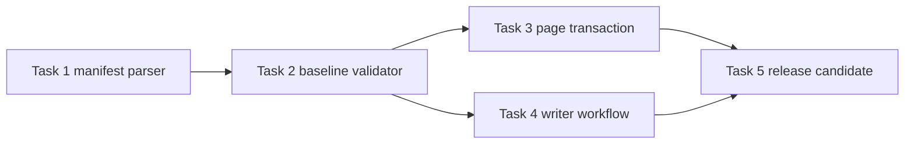
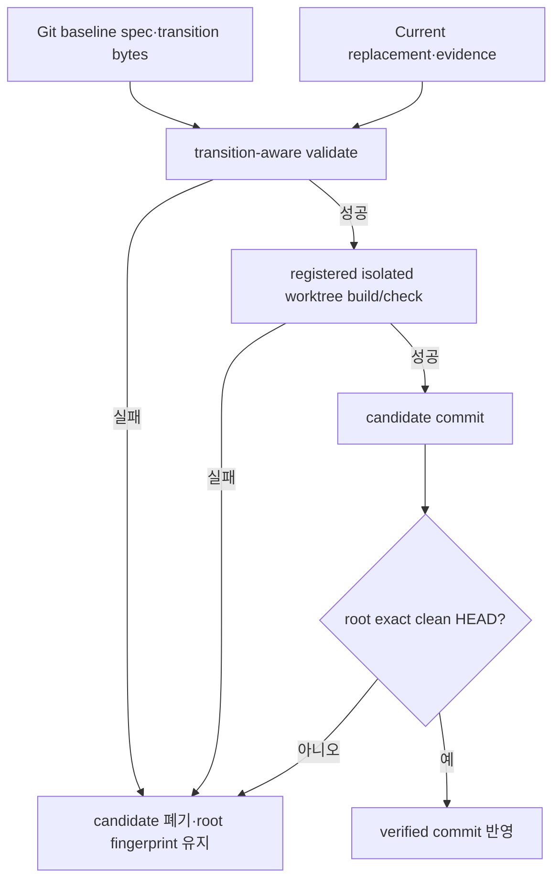
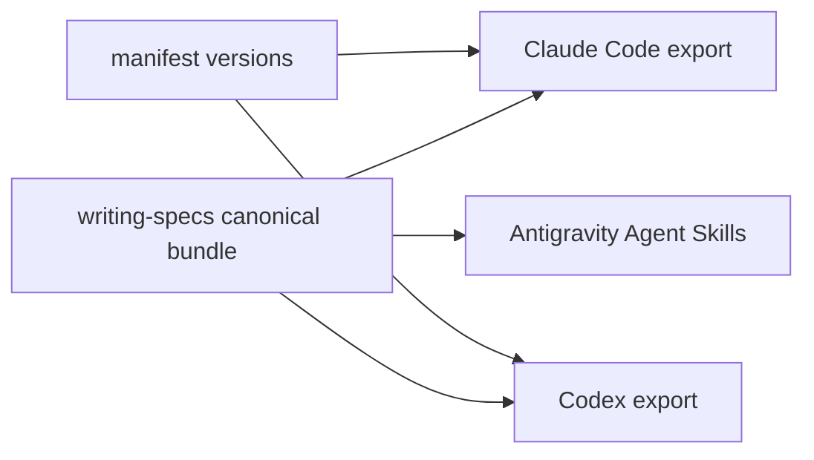

# 현재 사실 중심 spec supersession 구현 계획

> `executing-plans`로 Task별 RED→GREEN, 독립 checkpoint와 release 경계를 기록하며 실행한다. Marketplace push는 사용자 승인 전 수행하지 않는다.

Status: completed

**Related Specs:**
- id: 008-structured-spec-pages
  path: docs/specs/008-structured-spec-pages/spec.md
  requirements: [R9, R13, R15, R17, R18, R22, R23, R27, R34, R35, R36, R37, R38, R39]
  acceptance: [AC2, AC5, AC9, AC12, AC13, AC14, AC15]

**목표:** approved/implemented spec을 현재 사실만 담는 새 identity로 one-to-one supersede할 수 있도록 exact transition manifest, baseline validator와 안전한 writer workflow를 Forge에 추가한다.

**아키텍처:** 새 `spec_transitions.py`가 dependency-free JSON·path contract를 소유하고, `spec_validate.py`가 Git object baseline과 current tree를 결합해 새 record 한 개만 삭제 권한으로 인정한다. Spec Pages renderer의 기존 full-build orphan transaction을 그대로 사용하며, `writing-specs`는 registered isolated worktree에서 source·page·catalog를 한 candidate commit으로 승격한다.

**기술 스택:** Python 3 표준 라이브러리, Bash, Git object database/worktree, Node.js 22, 기존 Forge Spec Pages runtime.

## Global Constraints

- Marketplace Forge user-facing workflow이며 상세 source는 `plugins/forge/skills/writing-specs/`가 소유한다.
- `.transitions.json`은 one-to-one `superseded`만 지원한다. Retirement, merge, baseline-existing target과 same-diff multi-hop은 거부한다.
- Baseline bytes는 Git object에서만 읽고 current filesystem bytes로 대체하지 않는다.
- 기존 transition record는 exact canonical prefix로 보존하며 새 record 한 개만 현재 missing source를 승인한다.
- Review Viewer 생성·갱신 count는 0이다.
- push는 Marketplace release이므로 version gate와 전체 검증 뒤 별도 사용자 승인이 필요하다.

## AC Coverage

| AC | Tasks |
|---|---|
| AC2 | 1, 2, 5 |
| AC5 | 3, 5 |
| AC9 | 4, 5 |
| AC12 | 4, 5 |
| AC13 | 1, 2, 5 |
| AC14 | 2, 3, 5 |
| AC15 | 4, 5 |

## Implementation Routes

| Route | Tasks | 산출물 | Checkpoint |
|---|---:|---|---|
| Route 1 — Canonical Transition Model | 1 | strict manifest parser와 path diagnostics | internal |
| Route 2 — Baseline Authorization | 2 | replay-safe one-to-one supersession validator | notify |
| Route 3 — Page Transaction | 3 | old orphan removal·replacement freshness regression | internal |
| Route 4 — Agent Workflow | 4 | isolated worktree writer와 pressure gate | notify |
| Route 5 — Release Candidate | 5 | versioned, validated local Forge commit | approval before push |

### 어떤 순서로 supersession 권한이 완성되는가?

확인할 내용: parser API가 고정된 뒤 validator와 page regression을 진행하고, agent workflow와 release gate가 마지막에 결합되는지 확인한다.

읽는 법: 화살표는 Task dependency다. `Plan source`.



### 실패가 production root를 어떻게 보호하는가?

확인할 내용: validate와 build가 candidate에서만 mutation하고 root 반영은 verified commit 하나로 제한되는지 확인한다.

읽는 법: 위쪽은 read-only authorization, 아래쪽은 isolated mutation과 promotion이다. `Spec source`.



### 어느 배포 surface가 같은 계약을 받는가?

확인할 내용: 하나의 writing-specs bundle이 Claude Code, Codex, Antigravity 설치 경로에 동일하게 포함되는지 확인한다.

| Source | Consumers | Verification |
|---|---|---|
| `plugins/forge/skills/writing-specs/` | Claude Code, Codex, Antigravity | install export fixture |
| plugin manifests | Marketplace resolver | version gate |
| repository Spec Pages | maintainer와 reviewer | full build/check |



## Tasks

### Task 1: canonical transition parser (R15, R36–R37 · AC2, AC13)

**파일:**
- 생성: `plugins/forge/skills/writing-specs/scripts/spec_transitions.py`
- 생성: `plugins/forge/skills/writing-specs/tests/test_spec_transitions.py`

**Interfaces:**
- 소비: `Path repo_root`, `Path spec_root`, optional baseline `bytes`.
- 생산: frozen `SpecTransition`, `TransitionManifest`와 `load_transition_manifest(repo_root, spec_root, *, source=None) -> tuple[TransitionManifest | None, tuple[Diagnostic, ...]]`.

**Execution metadata:**
- Dependencies: none
- Write ownership: 위 두 파일만
- Parallel safety: parser API를 후속 Task가 소비하므로 단독 선행
- Approval gate: none

- [x] **Step 1:** strict JSON과 path matrix를 실패하는 unit test로 작성한다.

```python
class TransitionManifestTest(unittest.TestCase):
    INVALID_CASES = (
        (b"{", "SPEC_TRANSITION_JSON"),
        (b'{"schema":"forge/spec-transitions@1","schema":"x","transitions":[]}', "SPEC_TRANSITION_KEY"),
        (b'{"schema":"forge/spec-transitions@1","transitions":{},"extra":1}', "SPEC_TRANSITION_KEY"),
    )

    def test_manifest_rejects_invalid_json_keys_and_types(self) -> None:
        for source, code in self.INVALID_CASES:
            with self.subTest(code=code):
                _, diagnostics = load_transition_manifest(self.repo, Path("docs/specs"), source=source)
                self.assertIn(code, {item.code for item in diagnostics})
```

- [x] **Step 2:** RED를 확인한다.

실행: `PYTHONPATH=plugins/forge/skills/writing-specs/scripts python3 -m unittest plugins/forge/skills/writing-specs/tests/test_spec_transitions.py -v`

예상: `ModuleNotFoundError: No module named 'spec_transitions'`.

- [x] **Step 3:** frozen model, duplicate-key JSON loader, exact field/type/value 검사와 component별 `lstat` path 검사를 구현한다.

```python
@dataclass(frozen=True)
class SpecTransition:
    from_id: str
    from_path: Path
    from_source_sha256: str
    disposition: str
    to_id: str
    to_path: Path
    evidence_path: Path
    reason: str

@dataclass(frozen=True)
class TransitionManifest:
    transitions: tuple[SpecTransition, ...]
```

- [x] **Step 4:** unit test, compile과 deterministic diagnostic order를 GREEN으로 만든다.

실행: `PYTHONDONTWRITEBYTECODE=1 PYTHONPATH=plugins/forge/skills/writing-specs/scripts python3 -m unittest plugins/forge/skills/writing-specs/tests/test_spec_transitions.py -v && python3 -m py_compile plugins/forge/skills/writing-specs/scripts/spec_transitions.py`

예상: 모든 case PASS, diagnostic가 `(path,line,code)` 순서다.

- [x] **Step 5:** parser Task를 commit한다.

실행: `git add plugins/forge/skills/writing-specs/scripts/spec_transitions.py plugins/forge/skills/writing-specs/tests/test_spec_transitions.py && git commit -m "feat(forge): parse spec supersession transitions"`

### Task 2: transition-aware baseline validator (R9, R13, R15, R36, R38 · AC2, AC13–AC14)

**파일:**
- 수정: `plugins/forge/skills/writing-specs/scripts/spec_validate.py`
- 수정: `plugins/forge/skills/writing-specs/tests/test_spec_validate.py`

**Interfaces:**
- 소비: Task 1의 `TransitionManifest`, current `SpecDocument` tuple, explicit `baseline_ref`.
- 생산: `_validate_baseline(..., documents, errors)`가 승인한 missing baseline path와 모든 transition 진단.

**Execution metadata:**
- Dependencies: Task 1
- Write ownership: validator와 validator unit test
- Parallel safety: Task 3·4가 이 semantics를 소비하므로 sequential 선행
- Approval gate: none

- [x] **Step 1:** valid one-to-one rename과 negative baseline matrix를 `BaselineValidationTest`에 추가한다.

```python
def test_baseline_accepts_one_new_exact_supersession(self) -> None:
    old = self._commit_implemented("001-old")
    replacement = self._write_approved("001-current")
    self._write_transition(old, replacement)
    old.unlink()
    result = validate_repository(self.repo, baseline_ref="HEAD")
    self.assertTrue(result.ok, result.diagnostics)

def test_baseline_rejects_transition_replay_and_existing_target(self) -> None:
    result = self._validate_case("replay")
    self.assertIn("SPEC_TRANSITION_REPLAY", {item.code for item in result.diagnostics})
```

- [x] **Step 2:** RED에서 기존 삭제 진단과 새 matrix failure를 확인한다.

실행: `PYTHONPATH=plugins/forge/skills/writing-specs/scripts python3 -m unittest plugins/forge/skills/writing-specs/tests/test_spec_validate.py -v`

예상: valid supersession이 `SPEC_HISTORY_NOT_APPEND_ONLY`로 실패한다.

- [x] **Step 3:** Git blob helper, baseline/current identity binding, transition prefix·append·replay·duplicate·chain·old-reference 검사를 구현한다.

```python
def _git_blob(repo_root: Path, baseline_ref: str, path: Path) -> bytes | None:
    result = _git_output(repo_root, ["show", f"{baseline_ref}:{path.as_posix()}"])
    return result.stdout if result is not None and result.returncode == 0 else None
```

기존 `_validate_baseline`은 current document tuple과 manifest를 받아, 새 record가 exact baseline approved/implemented source 하나를 대체할 때만 missing path 진단을 생략한다. Same-path history prefix 검사는 그대로 유지한다.

- [x] **Step 4:** full validator/CLI suite를 GREEN으로 만든다.

실행: `PYTHONDONTWRITEBYTECODE=1 PYTHONPATH=plugins/forge/skills/writing-specs/scripts python3 -m unittest plugins/forge/skills/writing-specs/tests/test_spec_validate.py plugins/forge/skills/writing-specs/tests/test_spec_docs_cli.py -v`

예상: 기존 append-only case와 새 AC13–AC14 matrix 모두 PASS.

- [x] **Step 5:** validator Task를 commit한다.

실행: `git add plugins/forge/skills/writing-specs/scripts/spec_validate.py plugins/forge/skills/writing-specs/tests/test_spec_validate.py && git commit -m "feat(forge): validate spec supersession baselines"`

### Task 3: old page removal과 replacement freshness regression (R17–R18, R22–R23, R38 · AC5, AC14)

**파일:**
- 수정: `plugins/forge/skills/writing-specs/tests/test_spec_render.py`
- 수정: `plugins/forge/skills/writing-specs/tests/test_spec_docs_cli.py`

**Interfaces:**
- 소비: transition-aware validation을 통과한 current source tree.
- 생산: full build의 old orphan 삭제, replacement page/catalog 생성과 deterministic second build.

**Execution metadata:**
- Dependencies: Task 2
- Write ownership: renderer/CLI regression test, defect가 재현될 때만 renderer
- Parallel safety: Task 4와 파일이 겹치지 않아 병렬 가능
- Approval gate: none

- [x] **Step 1:** old page, new source와 transition을 가진 full-build fixture를 추가한다.
- [x] **Step 2:** Task 2 이전 baseline에서 fixture가 rename validation으로 RED였음을 기록하고 현재 branch에서 실행한다.

실행: `PYTHONPATH=plugins/forge/skills/writing-specs/scripts python3 -m unittest plugins/forge/skills/writing-specs/tests/test_spec_render.py plugins/forge/skills/writing-specs/tests/test_spec_docs_cli.py -v`

예상: old page가 남거나 replacement/catalog bytes가 틀리면 `SPEC_PAGE_ORPHAN`, `SPEC_PAGE_MISSING` 또는 `SPEC_PAGE_STALE`로 실패한다.

- [x] **Step 3:** 기존 `build_pages()`의 full-build branch가 `deletions = orphans`를 `_publish_transaction(replacements, deletions)`에 전달하는지 확인하고 production renderer 변경 없이 regression test로 계약을 고정한다.
- [x] **Step 4:** full build 두 번, check와 tree hash를 검증한다.

실행: `PYTHONDONTWRITEBYTECODE=1 PYTHONPATH=plugins/forge/skills/writing-specs/scripts python3 -m unittest plugins/forge/skills/writing-specs/tests/test_spec_render.py plugins/forge/skills/writing-specs/tests/test_spec_docs_cli.py -v`

예상: old page 없음, new page/catalog 존재, second build diff 0.

- [x] **Step 5:** regression Task를 commit한다.

실행: `git add plugins/forge/skills/writing-specs/tests/test_spec_render.py plugins/forge/skills/writing-specs/tests/test_spec_docs_cli.py && git commit -m "test(forge): cover superseded Spec Pages"`

### Task 4: writing-specs workflow와 installed pressure gate (R27, R34–R35, R39 · AC9, AC12, AC15)

**파일:**
- 수정: `plugins/forge/skills/writing-specs/SKILL.md`
- 수정: `plugins/forge/skills/writing-specs/references/spec-template.md`
- 수정: `scripts/tests/test-forge-spec-docs-policy.sh`
- 생성: `scripts/tests/test-forge-spec-supersession.sh`
- 수정: `scripts/tests/test-forge-review-viewer-install.sh`
- 수정: `.github/workflows/validate.yml`

**Interfaces:**
- 소비: Task 2 validator와 existing full Spec Pages build/check.
- 생산: approval-first isolated candidate workflow, cross-agent installed bundle parity와 root-fingerprint pressure evidence.

**Execution metadata:**
- Dependencies: Task 2
- Write ownership: skill prose, policy/install/integration test, CI
- Parallel safety: Task 3와 병렬 가능
- Approval gate: none

- [x] **Step 1:** static policy와 isolated candidate pressure fixture를 RED로 작성한다.

```bash
grep -q 'docs/specs/.transitions.json' "$WRITING_SPECS" || fail 'writing-specs misses transition manifest'
grep -q 'registered isolated Git worktree' "$WRITING_SPECS" || fail 'writing-specs misses isolation gate'
grep -q 'Review Viewer.*zero' "$WRITING_SPECS" || fail 'writing-specs misses request-only zero gate'
```

- [x] **Step 2:** RED를 확인한다.

실행: `bash scripts/tests/test-forge-spec-docs-policy.sh && bash scripts/tests/test-forge-spec-supersession.sh`

예상: supersession instruction과 executable fixture 부재로 실패.

- [x] **Step 3:** `writing-specs`에 Supersession subflow, approval gate, exact clean HEAD, isolated worktree, candidate commit과 root apply 조건을 추가하고 template에 transition 예외를 기록한다.
- [x] **Step 4:** install test가 `spec_transitions.py`와 같은 fixture result를 Claude Code·Codex·Antigravity export에서 확인하도록 확장하고 CI에 새 shell gate를 연결한다.
- [x] **Step 5:** 정책·install·pressure suite를 GREEN으로 만든다.

실행: `bash scripts/tests/test-forge-spec-docs-policy.sh && bash scripts/tests/test-forge-spec-supersession.sh && bash scripts/tests/test-forge-review-viewer-install.sh`

예상: failure injection마다 root HEAD/index/tracked/untracked fingerprint 동일, 성공 candidate만 반영, Review Viewer 0.

- [x] **Step 6:** workflow Task를 commit한다.

실행: `git add plugins/forge/skills/writing-specs/SKILL.md plugins/forge/skills/writing-specs/references/spec-template.md scripts/tests/test-forge-spec-docs-policy.sh scripts/tests/test-forge-spec-supersession.sh scripts/tests/test-forge-review-viewer-install.sh .github/workflows/validate.yml && git commit -m "feat(forge): guide current-state spec supersession"`

### Task 5: Forge release candidate와 release boundary (R9, R13, R17–R18, R27, R34–R39 · AC2, AC5, AC9, AC12–AC15)

**파일:**
- 수정: `plugins/forge/.claude-plugin/plugin.json`
- 수정: `plugins/forge/.codex-plugin/plugin.json`
- 수정: `docs/specs/008-structured-spec-pages/spec.md`, matching Spec Pages
- 생성: `docs/plans/008-spec-supersession/acceptance-evidence.md`

**Interfaces:**
- 소비: Tasks 1–4와 approved 008.
- 생산: public fetch 가능한 release commit SHA는 push 승인 뒤에만 제공한다.

**Execution metadata:**
- Dependencies: Tasks 3, 4
- Write ownership: manifests, evidence, full generated Spec Pages
- Parallel safety: release verdict이므로 sequential
- Approval gate: push 전에 사용자 release 승인 필요

- [x] **Step 1:** Claude manifest를 `0.1.7`로 설정하고 `CODEX_VERSION="0.1.7+codex.$(date -u +%Y%m%d%H%M%S)"`로 만든 값을 Codex manifest에 기록한다.
- [x] **Step 2:** generator 변경은 없지만 008 source와 catalog를 포함해 전체 Spec Pages를 재생성·check한다.

실행: `bash plugins/forge/skills/writing-specs/scripts/spec-docs.sh --repo-root . build --root docs/specs --offline && bash plugins/forge/skills/writing-specs/scripts/spec-docs.sh --repo-root . check --root docs/specs`

- [x] **Step 3:** Python, shell, Node, installed export와 root validator를 fresh하게 실행한다.

실행: `bash scripts/validate.sh`

예상: 마지막 줄 `validate: all checks passed`.

- [x] **Step 4:** adversarial pressure test와 AC2·AC5·AC9·AC12–AC15 evidence를 기록하고 Review Viewer output 0을 확인한다.
- [x] **Step 5:** 모든 AC가 PASS면 `verifying-work`로 008 status를 `implemented`로 전환하고 page/catalog를 다시 build/check한다.
- [x] **Step 6:** conventional release candidate commit을 만들고 remote push 직전 멈춘다.

실행: `git add plugins/forge docs/specs docs/plans/008-spec-supersession scripts .github/workflows/validate.yml && git commit -m "feat(forge): support current-state spec supersession"`

예상: local clean commit이 있고 push는 0회다.

## Progress History

- 2026-08-02: target 001 rename이 append-only validator에 막히는 root cause를 재현하고, 사용자 승인과 독립 P0/P1 0 감사를 거쳐 one-to-one supersession scope를 확정했다.
- 2026-08-02: Task 1 routed (impact=medium, uncertainty=low, context_coupling=low, verification_clarity=strong, tier=balanced, mode=subagent, parallel_group=none, reason="strict parser는 두 파일에 격리되고 공개 interface와 unit verification이 명확하다").
- 2026-08-02: Task 1 complete (commits 712c292..712c292; verification="13 transition parser tests와 py_compile PASS, RED는 ModuleNotFoundError로 확인").
- 2026-08-02: Task 2 routed (impact=high, uncertainty=medium, context_coupling=high, verification_clarity=strong, tier=frontier, mode=root, parallel_group=none, reason="Git object baseline 권한과 current identity, replay 방지를 한 validator verdict로 결합한다").
- 2026-08-02: Task 2 complete (commits 65ec1ea..046f485; verification="validator·CLI 39 tests PASS, valid cutover와 10개 negative subcase, historical old identity 금지와 later-diff chain 허용 RED→GREEN").
- 2026-08-02: Task 3 routed (impact=medium, uncertainty=low, context_coupling=low, verification_clarity=strong, tier=balanced, mode=subagent, parallel_group=route-page-workflow, reason="renderer 변경 없이 두 회귀 테스트 파일에 격리되고 expected bytes 검증이 명확하다").
- 2026-08-02: Task 4 routed (impact=high, uncertainty=medium, context_coupling=high, verification_clarity=strong, tier=frontier, mode=root, parallel_group=route-page-workflow, reason="배포 skill 지침과 root 보존 pressure fixture의 최종 안전 판단은 root가 소유한다").
- 2026-08-02: Task 3 complete (commits 4c7bbc9..4c7bbc9; verification="renderer·CLI 28 tests PASS, build 전 ORPHAN/MISSING/STALE와 full build 후 old page 제거·second-build diff 0 확인").
- 2026-08-02: Task 4 complete (commits 4f39b86..4f39b86; verification="policy·isolated pressure·installed export suite PASS, fresh-agent deadline pressure P0/P1 0, Review Viewer output 0").
- 2026-08-02: Task 5 routed (impact=high, uncertainty=low, context_coupling=high, verification_clarity=strong, tier=frontier, mode=root, parallel_group=none, reason="Marketplace version, 전체 outgoing range, AC evidence와 release verdict를 함께 소유한다").
- 2026-08-02: Task 5 integration defect (verification="첫 full integration에서 Review Viewer isolated-layout fixture의 spec_transitions.py 누락 3건을 재현하고 017e9ef로 수정한 뒤 전체 sequence를 재실행했다").
- 2026-08-02: Task 5 complete (commits release candidate commit; verification="008 AC1–AC15 PASS, Python 74 + Review Viewer 13/20, browser 6/6 + 6/6, all shell/install/pressure gates, validate final line PASS, Review Viewer output 0").
