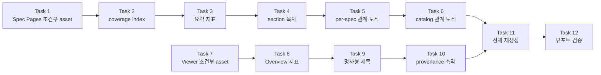
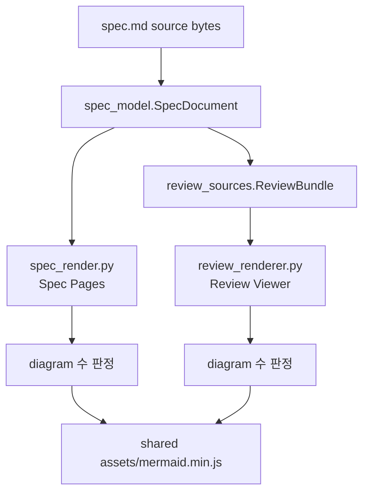

# 뷰어 가독성 렌더링 구현 계획

> 에이전트 작업자는 forge executing-plans 스킬로 이 계획을 실행한다. Task 단위로
> 진행하고 각 Task 끝의 checkpoint를 거친다.

Status: active

**Related Specs:**
- `docs/specs/008-structured-spec-pages/spec.md`: R40, R41, R42, R43, R44, R45, R46, R47 · AC16, AC17, AC18, AC19, AC20
- `docs/specs/002-lifecycle-review-viewer/spec.md`: R61, R87, R88, R89, R90 · AC32, AC33, AC34, AC35

**목표:** Spec Pages와 Review Viewer가 diagram이 있을 때만 Mermaid runtime을 담고, R·AC coverage와 요약 지표, section 목차, `relatedSpecs` 파생 관계 도식을 제공해 사람이 스펙과 계획을 빠르게 이해하도록 만든다.

**아키텍처:** 두 renderer는 서로 다른 파일이지만 같은 `spec_model` 구조와 같은 `mermaid.min.js` asset을 공유한다. 조건부 embed는 각 renderer가 자신의 selected source에서 diagram 수를 세어 판정하며, asset fingerprint는 asset 버전 정체성을 유지하기 위해 embed 여부와 무관하게 그대로 둔다. 새 화면 요소는 모두 기존 `SpecDocument`·`ReviewBundle`에서 파생하고 새 source 필드를 만들지 않는다.

**기술 스택:** Python 3(표준 라이브러리만), `unittest`, Mermaid 11.16.0 벤더 번들, dependency-free HTML template 문자열 치환.

## Global Constraints

- Markdown이 정본이고 생성된 HTML은 read-only artifact다(008 R21).
- 같은 source bytes·generator version·locale에서 byte-for-byte 동일한 출력을 낸다(008 R22).
- 파생 도식은 frontmatter `relatedSpecs`가 선언한 ID와 관계 종류만 사용하고 `Derived view`로 명시한다(008 R46).
- source Mermaid text는 byte-for-byte 변경하지 않는다(008 R8, 002 R37, R38).
- 한국어 source에는 한국어 label을 쓰고 API·schema·code identifier는 원문을 유지한다(008 R24).
- Review Viewer의 6개 고정 panel ID `overview`, `requirements`, `flows`, `data`, `acceptance`, `history`를 유지한다(002 R21).
- 이 계획의 구현 diff는 `weppy-roblox-mcp-private`를 수정하지 않는다(008 R33, R47).
- Review Viewer는 사용자의 명시적 요청 없이 생성하지 않는다(002 R7, R13).

## AC Coverage

| AC | Tasks |
|---|---|
| AC16 | 1 |
| AC17 | 2, 3 |
| AC18 | 4 |
| AC19 | 5, 6 |
| AC20 | 11 |
| AC32 | 7 |
| AC33 | 8 |
| AC34 | 9, 10 |
| AC35 | 12 |

## 구현 Route

| Route | 범위 | Task | 선행 Route |
|---|---|---|---|
| A. Spec Pages 조건부 asset | diagram 유무 판정과 runtime 생략 | 1 | 없음 |
| B. Coverage와 지표 | R↔AC 양방향과 요약 지표 | 2, 3 | A |
| C. Section 목차 | `###` 기반 section-local 목차 | 4 | A |
| D. 파생 관계 도식 | per-spec과 catalog 관계 그래프 | 5, 6 | A |
| E. Review Viewer 조건부 asset | offline·CDN loader 생략 | 7 | 없음 |
| F. Review Viewer 요약 지표 | Overview 스캔 지표 | 8 | E |
| G. Review Viewer 가독성 | 명사형 제목과 provenance 축약 | 9, 10 | E |
| H. 재생성과 검증 | 전체 rebuild와 뷰포트 검증 | 11, 12 | A–G |

Route A와 Route E는 서로 다른 renderer를 수정하므로 병렬 실행이 안전하다. Route B·C·D는 모두 `spec_render.py`를 수정하므로 A 완료 뒤 순차 실행한다.

Task 의존성:



렌더링 책임 분리:



## 체크포인트

- 내부 checkpoint: 각 Task의 마지막 Step에서 해당 Task의 테스트를 실행하고 commit한다.
- 알림 checkpoint: Route D 완료 시점과 Route G 완료 시점에 사용자에게 진행 상황을 알린다. 승인은 요구하지 않는다.
- 승인 gate: Task 12의 배포 판단만 사용자 승인이 필요하다. 나머지 Task는 로컬 편집·테스트·로컬 commit이므로 승인 gate가 아니다.

---

### Task 1: Spec Pages 조건부 Mermaid runtime (R40 · AC16)

**파일:**
- 수정: `plugins/forge/skills/writing-specs/scripts/spec_render.py`
- 수정: `plugins/forge/skills/writing-specs/assets/spec-page-template.html`
- 테스트: `plugins/forge/skills/writing-specs/tests/test_spec_render.py`

**인터페이스:**
- 사용: `spec_model.SpecDocument.mermaid` — `tuple[MermaidBlock, ...]`
- 제공: `spec_render.page_needs_mermaid(document: SpecDocument) -> bool`. Task 5가 파생 도식을 추가할 때 이 함수를 확장한다.

**실행 메타데이터:**
- 의존성: 없음
- 쓰기 소유: `plugins/forge/skills/writing-specs/scripts/spec_render.py`, `plugins/forge/skills/writing-specs/assets/spec-page-template.html`, `plugins/forge/skills/writing-specs/tests/test_spec_render.py`
- 병렬 안전성: Task 7과 병렬 실행 가능(서로 다른 skill 디렉터리)
- 승인 gate: 없음

- [x] **Step 1: 실패하는 테스트를 작성한다**

`plugins/forge/skills/writing-specs/tests/test_spec_render.py`의 `ReviewRendererTest` 계열 클래스 아래에 새 클래스를 추가한다.

```python
class ConditionalMermaidTest(unittest.TestCase):
    def test_page_without_diagram_omits_mermaid_runtime(self) -> None:
        with TemporaryDirectory() as temporary:
            root = Path(temporary)
            shutil.copytree(FIXTURE_ROOT, root / "repo")
            repository = root / "repo"
            spec_root = repository / "docs" / "specs"
            source = spec_root / "003-no-diagram" / "spec.md"
            source.parent.mkdir(parents=True, exist_ok=True)
            source.write_text(NO_DIAGRAM_SPEC, encoding="utf-8")
            build_pages(repository, spec_root, changed=None, offline=True)
            page = (spec_root / "003-no-diagram" / "index.html").read_bytes()
            self.assertNotIn(b"mermaid", page.lower())
            self.assertLess(len(page), 200_000)

    def test_page_with_diagram_embeds_mermaid_runtime(self) -> None:
        with TemporaryDirectory() as temporary:
            root = Path(temporary)
            shutil.copytree(FIXTURE_ROOT, root / "repo")
            repository = root / "repo"
            spec_root = repository / "docs" / "specs"
            build_pages(repository, spec_root, changed=None, offline=True)
            page = (spec_root / "001-basic" / "index.html").read_bytes()
            self.assertIn(b"mermaid", page.lower())

    def test_conditional_embed_is_deterministic(self) -> None:
        with TemporaryDirectory() as temporary:
            root = Path(temporary)
            shutil.copytree(FIXTURE_ROOT, root / "repo")
            repository = root / "repo"
            spec_root = repository / "docs" / "specs"
            build_pages(repository, spec_root, changed=None, offline=True)
            first = snapshot_tree(spec_root)
            build_pages(repository, spec_root, changed=None, offline=True)
            self.assertEqual(first, snapshot_tree(spec_root))
```

같은 파일 상단의 상수 영역에 fixture 본문을 추가한다.

```python
NO_DIAGRAM_SPEC = """---
schema: forge/spec@1
id: 003-no-diagram
status: approved
language: en
kind: system
areas: []
components: []
relatedSpecs: []
---
# No Diagram Contract

## Overview

This specification has no source Mermaid and no related specs.

## Requirements

- R1. The page must omit the Mermaid runtime when no diagram exists.

## Behavior & Flows

The behavior is described in prose only.

## Data & Interfaces

No interface contract is declared.

## Acceptance Criteria

- AC1 (R1): Building the page produces bytes without a Mermaid runtime.

## Decisions & History

- 2026-08-03 [DECISION] Keep this fixture free of diagrams.
"""
```

- [x] **Step 2: 테스트를 실행하고 실패를 확인한다**

실행: `cd plugins/forge/skills/writing-specs && python3 -m unittest tests.test_spec_render.ConditionalMermaidTest -v`
예상: `test_page_without_diagram_omits_mermaid_runtime` FAIL — 생성된 page에 `mermaid` 문자열이 존재하고 길이가 200,000을 초과한다.

- [x] **Step 3: 판정 헬퍼를 추가한다**

`plugins/forge/skills/writing-specs/scripts/spec_render.py`의 `_acceptance` 함수 정의 바로 뒤에 추가한다.

```python
def page_needs_mermaid(document: SpecDocument) -> bool:
    """Return whether the rendered page contains at least one diagram."""

    return bool(document.mermaid)
```

- [x] **Step 4: template의 runtime slot을 선택적으로 만든다**

`plugins/forge/skills/writing-specs/assets/spec-page-template.html`의 아래 줄을

```html
<script>{{MERMAID_RUNTIME}}</script>
```

다음으로 바꾼다.

```html
{{MERMAID_RUNTIME}}
```

- [x] **Step 5: renderer가 조건부로 script 태그를 생성하게 한다**

`spec_render.py`의 `render_spec_page` 안에서 `"MERMAID_RUNTIME": mermaid,`를 다음으로 바꾼다.

```python
                "MERMAID_RUNTIME": (
                    f"<script>{mermaid}</script>" if page_needs_mermaid(document) else ""
                ),
```

- [x] **Step 6: 테스트를 실행하고 통과를 확인한다**

실행: `cd plugins/forge/skills/writing-specs && python3 -m unittest tests.test_spec_render -v`
예상: PASS

- [x] **Step 7: 변경을 commit한다**

실행: `git add plugins/forge/skills/writing-specs/scripts/spec_render.py plugins/forge/skills/writing-specs/assets/spec-page-template.html plugins/forge/skills/writing-specs/tests/test_spec_render.py && git commit -m "feat(forge): embed Spec Page Mermaid runtime only with diagrams"`

---

### Task 2: R→AC 역방향 coverage (R41 · AC17)

**파일:**
- 수정: `plugins/forge/skills/writing-specs/scripts/spec_render.py`
- 테스트: `plugins/forge/skills/writing-specs/tests/test_spec_render.py`

**인터페이스:**
- 사용: `SpecDocument.requirements`(`id`, `text`, `removed`), `SpecDocument.acceptance`(`id`, `requirements`)
- 제공: `spec_render.coverage_index(document: SpecDocument) -> dict[str, tuple[str, ...]]` — 활성 R ID를 그 R을 인용하는 AC ID 튜플에 대응시킨다. Task 3이 미커버 수를 셀 때 사용한다.

**실행 메타데이터:**
- 의존성: Task 1
- 쓰기 소유: `plugins/forge/skills/writing-specs/scripts/spec_render.py`, `plugins/forge/skills/writing-specs/tests/test_spec_render.py`
- 병렬 안전성: 순차 — Task 1과 같은 파일을 수정한다
- 승인 gate: 없음

- [x] **Step 1: 실패하는 테스트를 작성한다**

`tests/test_spec_render.py`에 추가한다.

```python
class CoverageIndexTest(unittest.TestCase):
    def test_index_maps_active_requirements_to_citing_criteria(self) -> None:
        document = load_fixture_document("001-basic")
        index = spec_render.coverage_index(document)
        self.assertIn("R1", index)
        self.assertTrue(all(value.startswith("AC") for value in index["R1"]))

    def test_index_excludes_removed_requirements(self) -> None:
        document = load_fixture_document("001-basic")
        index = spec_render.coverage_index(document)
        removed = {item.id for item in document.requirements if item.removed}
        self.assertEqual(removed & set(index), set())

    def test_requirement_row_links_to_citing_criteria(self) -> None:
        document = load_fixture_document("001-basic")
        markup = spec_render._requirements(document)
        self.assertIn('href="#AC1"', markup)

    def test_uncovered_requirement_is_marked(self) -> None:
        document = load_fixture_document("001-basic")
        stripped = replace(document, acceptance=())
        markup = spec_render._requirements(stripped)
        self.assertIn('data-uncovered="true"', markup)
```

같은 파일에 헬퍼를 추가한다. 실제 파싱 진입점은 `spec_model.load_spec(path, root)`이다.

```python
def load_fixture_document(spec_id: str):
    from spec_model import load_spec

    root = FIXTURE_ROOT
    path = root / "docs" / "specs" / spec_id / "spec.md"
    document, errors = load_spec(path, root)
    assert not errors, errors
    assert document is not None
    return document
```

`FIXTURE_ROOT`가 이 테스트 파일에 아직 없다면 파일 상단에 추가한다.

```python
FIXTURE_ROOT = TEST_DIR / "fixtures" / "pages-repository"
```

이미 있다면(파일 상단에서 이미 `FIXTURE_ROOT`로 정의돼 있다) 다시 추가하지 않는다.

`from dataclasses import replace`를 파일 상단 import에 추가한다.

- [x] **Step 2: 테스트를 실행하고 실패를 확인한다**

실행: `cd plugins/forge/skills/writing-specs && python3 -m unittest tests.test_spec_render.CoverageIndexTest -v`
예상: FAIL — `AttributeError: module 'spec_render' has no attribute 'coverage_index'`

- [x] **Step 3: coverage index를 구현한다**

`spec_render.py`의 `page_needs_mermaid` 정의 뒤에 추가한다.

```python
def coverage_index(document: SpecDocument) -> dict[str, tuple[str, ...]]:
    """Map each active requirement ID to the criteria that cite it."""

    citations: dict[str, list[str]] = {
        requirement.id: []
        for requirement in document.requirements
        if not requirement.removed
    }
    for criterion in document.acceptance:
        for requirement_id in criterion.requirements:
            if requirement_id in citations:
                citations[requirement_id].append(criterion.id)
    return {key: tuple(value) for key, value in citations.items()}
```

- [x] **Step 4: requirement 표에 AC 열을 추가한다**

`spec_render.py`의 `_requirements` 전체를 다음으로 교체한다.

```python
def _requirements(document: SpecDocument) -> str:
    index = coverage_index(document)
    labels = _labels(document.metadata.language)
    rows = []
    for requirement in document.requirements:
        if requirement.removed:
            covered = '<span class="empty-value">—</span>'
            flags = ' data-removed="true"'
        else:
            criteria = index.get(requirement.id, ())
            if criteria:
                covered = ", ".join(
                    f'<a href="#{criterion}">{criterion}</a>' for criterion in criteria
                )
                flags = ""
            else:
                covered = f'<span class="uncovered">{html.escape(labels["uncovered"])}</span>'
                flags = ' data-uncovered="true"'
        rows.append(
            f'<tr id="{requirement.id}"{flags}>'
            f'<th scope="row"><a href="#{requirement.id}">{requirement.id}</a></th>'
            f'<td>{render_markdown(requirement.text)}</td>'
            f'<td>{covered}</td></tr>'
        )
    return (
        '<div class="table-scroll" role="region" aria-label="Requirements" tabindex="0">'
        '<table><thead><tr>'
        '<th scope="col">ID</th>'
        f'<th scope="col">{html.escape(labels["requirements"])}</th>'
        f'<th scope="col">{html.escape(labels["covered_by"])}</th>'
        '</tr></thead>'
        f'<tbody>{"".join(rows)}</tbody></table></div>'
    )
```

- [x] **Step 5: label을 추가한다**

`spec_render.py`의 `_labels`에서 한국어 사전의 `"related": "관련 Spec",` 뒤에 추가한다.

```python
            "covered_by": "검증 AC",
            "uncovered": "미커버",
```

영어 사전의 `"related": "Related specs",` 뒤에 추가한다.

```python
        "covered_by": "Covered by",
        "uncovered": "Uncovered",
```

- [x] **Step 6: 미커버 표시 스타일을 추가한다**

`plugins/forge/skills/writing-specs/assets/spec-page-template.html`의 `<style>` 안에서 `.empty-value{color:var(--muted)}` 바로 뒤에 추가한다.

```css
.uncovered{color:var(--error);font-weight:700}tr[data-uncovered="true"] th[scope="row"]{border-left:3px solid var(--error)}
```

- [x] **Step 7: 테스트를 실행하고 통과를 확인한다**

실행: `cd plugins/forge/skills/writing-specs && python3 -m unittest tests.test_spec_render -v`
예상: PASS

- [x] **Step 8: 변경을 commit한다**

실행: `git add plugins/forge/skills/writing-specs/scripts/spec_render.py plugins/forge/skills/writing-specs/assets/spec-page-template.html plugins/forge/skills/writing-specs/tests/test_spec_render.py && git commit -m "feat(forge): link Spec Page requirements to citing criteria"`

---

### Task 3: Spec Page 요약 지표 (R42 · AC17)

**파일:**
- 수정: `plugins/forge/skills/writing-specs/scripts/spec_render.py`
- 수정: `plugins/forge/skills/writing-specs/assets/spec-page-template.html`
- 테스트: `plugins/forge/skills/writing-specs/tests/test_spec_render.py`

**인터페이스:**
- 사용: `spec_render.coverage_index`
- 제공: `spec_render.page_metrics(document: SpecDocument) -> dict[str, int]` — key는 `active_requirements`, `criteria`, `tombstones`, `diagrams`, `uncovered`

**실행 메타데이터:**
- 의존성: Task 2
- 쓰기 소유: `plugins/forge/skills/writing-specs/scripts/spec_render.py`, `plugins/forge/skills/writing-specs/assets/spec-page-template.html`, `plugins/forge/skills/writing-specs/tests/test_spec_render.py`
- 병렬 안전성: 순차 — Task 2와 같은 파일을 수정한다
- 승인 gate: 없음

- [x] **Step 1: 실패하는 테스트를 작성한다**

```python
class PageMetricsTest(unittest.TestCase):
    def test_metrics_count_source_elements(self) -> None:
        document = load_fixture_document("001-basic")
        metrics = spec_render.page_metrics(document)
        active = [item for item in document.requirements if not item.removed]
        tombstones = [item for item in document.requirements if item.removed]
        self.assertEqual(metrics["active_requirements"], len(active))
        self.assertEqual(metrics["criteria"], len(document.acceptance))
        self.assertEqual(metrics["tombstones"], len(tombstones))
        self.assertEqual(metrics["diagrams"], len(document.mermaid))

    def test_metrics_count_uncovered_requirements(self) -> None:
        document = load_fixture_document("001-basic")
        stripped = replace(document, acceptance=())
        metrics = spec_render.page_metrics(stripped)
        self.assertEqual(metrics["uncovered"], metrics["active_requirements"])

    def test_page_renders_metric_values(self) -> None:
        with TemporaryDirectory() as temporary:
            root = Path(temporary)
            shutil.copytree(FIXTURE_ROOT, root / "repo")
            repository = root / "repo"
            spec_root = repository / "docs" / "specs"
            build_pages(repository, spec_root, changed=None, offline=True)
            page = (spec_root / "001-basic" / "index.html").read_text(encoding="utf-8")
            self.assertIn('class="metrics"', page)
            self.assertIn('data-metric="active_requirements"', page)
```

- [x] **Step 2: 테스트를 실행하고 실패를 확인한다**

실행: `cd plugins/forge/skills/writing-specs && python3 -m unittest tests.test_spec_render.PageMetricsTest -v`
예상: FAIL — `AttributeError: module 'spec_render' has no attribute 'page_metrics'`

- [x] **Step 3: 지표 계산을 구현한다**

`spec_render.py`의 `coverage_index` 뒤에 추가한다.

```python
def page_metrics(document: SpecDocument) -> dict[str, int]:
    """Return the scannable counts shown in the page header."""

    index = coverage_index(document)
    return {
        "active_requirements": len(index),
        "criteria": len(document.acceptance),
        "tombstones": sum(1 for item in document.requirements if item.removed),
        "diagrams": len(document.mermaid),
        "uncovered": sum(1 for criteria in index.values() if not criteria),
    }
```

- [x] **Step 4: 지표 markup을 생성한다**

`spec_render.py`의 `page_metrics` 뒤에 추가한다.

```python
_METRIC_ORDER = (
    "active_requirements",
    "criteria",
    "uncovered",
    "tombstones",
    "diagrams",
)


def _metrics_markup(document: SpecDocument) -> str:
    labels = _labels(document.metadata.language)
    metrics = page_metrics(document)
    cells = []
    for key in _METRIC_ORDER:
        alert = ' data-alert="true"' if key == "uncovered" and metrics[key] else ""
        cells.append(
            f'<div class="metric" data-metric="{key}"{alert}>'
            f'<dt>{html.escape(labels[f"metric_{key}"])}</dt>'
            f"<dd>{metrics[key]}</dd></div>"
        )
    return f'<dl class="metrics">{"".join(cells)}</dl>'
```

- [x] **Step 5: label을 추가한다**

`_labels`의 한국어 사전에 `"uncovered": "미커버",` 뒤로 추가한다.

```python
            "metric_active_requirements": "활성 요구사항",
            "metric_criteria": "승인 기준",
            "metric_uncovered": "미커버 요구사항",
            "metric_tombstones": "폐기 요구사항",
            "metric_diagrams": "다이어그램",
```

영어 사전에 `"uncovered": "Uncovered",` 뒤로 추가한다.

```python
        "metric_active_requirements": "Active requirements",
        "metric_criteria": "Acceptance criteria",
        "metric_uncovered": "Uncovered requirements",
        "metric_tombstones": "Removed requirements",
        "metric_diagrams": "Diagrams",
```

- [x] **Step 6: template에 slot을 추가한다**

`assets/spec-page-template.html`에서 `<dl class="metadata">{{METADATA}}</dl>` 바로 뒤에 추가한다.

```html
    {{METRICS}}
```

같은 파일의 `<style>` 안에서 `.uncovered{...}` 규칙 뒤에 추가한다.

```css
.metrics{display:grid;grid-template-columns:repeat(auto-fit,minmax(9rem,1fr));gap:1px;margin:20px 0 0;padding:0;background:var(--line);border:1px solid var(--line)}.metric{margin:0;padding:12px 16px;background:var(--surface)}.metric dt{color:var(--muted);font-size:.76rem;font-weight:650;text-transform:uppercase}.metric dd{margin:2px 0 0;font-size:1.5rem;font-variant-numeric:tabular-nums}.metric[data-alert="true"] dd{color:var(--error)}
```

- [x] **Step 7: renderer가 slot을 채우게 한다**

`spec_render.py`의 `render_spec_page` 안에서 `"METADATA": _metadata(document),` 뒤에 추가한다.

```python
                "METRICS": _metrics_markup(document),
```

- [x] **Step 8: 테스트를 실행하고 통과를 확인한다**

실행: `cd plugins/forge/skills/writing-specs && python3 -m unittest tests.test_spec_render -v`
예상: PASS

- [x] **Step 9: 변경을 commit한다**

실행: `git add plugins/forge/skills/writing-specs/scripts/spec_render.py plugins/forge/skills/writing-specs/assets/spec-page-template.html plugins/forge/skills/writing-specs/tests/test_spec_render.py && git commit -m "feat(forge): show Spec Page summary metrics"`

---

### Task 4: section-local 목차 (R43 · AC18)

**파일:**
- 수정: `plugins/forge/skills/writing-specs/scripts/markdown_render.py`
- 수정: `plugins/forge/skills/writing-specs/scripts/spec_render.py`
- 수정: `plugins/forge/skills/writing-specs/assets/spec-page-template.html`
- 테스트: `plugins/forge/skills/writing-specs/tests/test_spec_render.py`

**인터페이스:**
- 사용: `SpecDocument.sections` — canonical `##` 이름을 Markdown 본문 문자열에 대응시킨 매핑
- 제공: `spec_render.section_outline(body: str) -> tuple[tuple[str, str], ...]` — `(anchor, 표시 텍스트)` 튜플. 3개 미만이면 빈 튜플

**실행 메타데이터:**
- 의존성: Task 3
- 쓰기 소유: `plugins/forge/skills/writing-specs/scripts/markdown_render.py`, `plugins/forge/skills/writing-specs/scripts/spec_render.py`, `plugins/forge/skills/writing-specs/assets/spec-page-template.html`, `plugins/forge/skills/writing-specs/tests/test_spec_render.py`
- 병렬 안전성: 순차 — Task 3과 같은 파일을 수정한다
- 승인 gate: 없음

- [x] **Step 1: 실패하는 테스트를 작성한다**

```python
OUTLINE_BODY = """### First heading

Body one.

### Second heading

Body two.

### Third heading

Body three.
"""

SHORT_BODY = """### Only heading

Body one.

### Second heading

Body two.
"""


class SectionOutlineTest(unittest.TestCase):
    def test_outline_lists_headings_at_threshold(self) -> None:
        outline = spec_render.section_outline(OUTLINE_BODY)
        self.assertEqual(len(outline), 3)
        self.assertEqual(outline[0][1], "First heading")

    def test_outline_is_empty_below_threshold(self) -> None:
        self.assertEqual(spec_render.section_outline(SHORT_BODY), ())

    def test_outline_ignores_headings_inside_fences(self) -> None:
        body = "```\n### Fenced heading\n```\n\n" + SHORT_BODY
        self.assertEqual(spec_render.section_outline(body), ())

    def test_outline_anchors_are_unique(self) -> None:
        body = OUTLINE_BODY.replace("Second heading", "First heading")
        outline = spec_render.section_outline(body)
        anchors = [anchor for anchor, _ in outline]
        self.assertEqual(len(anchors), len(set(anchors)))
```

- [x] **Step 2: 테스트를 실행하고 실패를 확인한다**

실행: `cd plugins/forge/skills/writing-specs && python3 -m unittest tests.test_spec_render.SectionOutlineTest -v`
예상: FAIL — `AttributeError: module 'spec_render' has no attribute 'section_outline'`

- [x] **Step 3: 공유 slug 함수와 heading 추출을 구현한다**

`spec_render`와 `markdown_render`가 같은 anchor 규칙을 쓰도록 `markdown_render.py`에 정규화 함수를 먼저 추가하고, `spec_render.py`가 그것을 import해서 `section_outline`에 쓴다.

`markdown_render.py`의 `_cells` 정의 앞에 추가한다.

```python
def anchor_slug(text: str, used: dict[str, int]) -> str:
    base = re.sub(r"[^a-z0-9]+", "-", text.lower()).strip("-") or "section"
    count = used.get(base, 0)
    used[base] = count + 1
    return base if count == 0 else f"{base}-{count + 1}"
```

`spec_render.py`는 이미 `import re`를 가지고 있으므로 import를 추가하지 않는다. 상단 import를

```python
from markdown_render import render_markdown
```

다음으로 바꾼다.

```python
from markdown_render import anchor_slug, render_markdown
```

`_metrics_markup` 뒤에 추가한다.

```python
_SUBHEADING_RE = re.compile(r"^(#{3,6}) (\S.*)$")
_OUTLINE_THRESHOLD = 3


def section_outline(body: str) -> tuple[tuple[str, str], ...]:
    """Return (anchor, text) pairs when a section has enough subheadings."""

    headings: list[tuple[str, str]] = []
    used: dict[str, int] = {}
    in_fence = False
    for line in body.splitlines():
        if line.lstrip().startswith(("```", "~~~")):
            in_fence = not in_fence
            continue
        if in_fence:
            continue
        match = _SUBHEADING_RE.match(line)
        if match:
            text = match.group(2).strip()
            headings.append((anchor_slug(text, used), text))
    if len(headings) < _OUTLINE_THRESHOLD:
        return ()
    return tuple(headings)
```

- [x] **Step 4: markdown_render의 heading 렌더링에 같은 anchor id를 부여한다**

`render_markdown`의 시작부에서

```python
    lines = text.splitlines()
    output: list[str] = []
    index = 0
```

다음으로 바꾼다.

```python
    lines = text.splitlines()
    output: list[str] = []
    index = 0
    heading_ids: dict[str, int] = {}
```

같은 함수 안의 heading 출력부

```python
        heading = _HEADING_RE.fullmatch(line)
        if heading is not None:
            level = len(heading.group(1))
            output.append(f"<h{level}>{_inline(heading.group(2))}</h{level}>")
            index += 1
            continue
```

을 다음으로 바꾼다.

```python
        heading = _HEADING_RE.fullmatch(line)
        if heading is not None:
            level = len(heading.group(1))
            text_value = heading.group(2).strip()
            anchor = anchor_slug(text_value, heading_ids)
            output.append(f'<h{level} id="{anchor}">{_inline(heading.group(2))}</h{level}>')
            index += 1
            continue
```

- [x] **Step 5: 목차 markup을 만들고 각 section에 붙인다**

`spec_render.py`의 `section_outline` 뒤에 추가한다.

```python
def _outline_markup(document: SpecDocument, section: str) -> str:
    outline = section_outline(document.sections[section])
    if not outline:
        return ""
    labels = _labels(document.metadata.language)
    items = "".join(
        f'<li><a href="#{anchor}">{html.escape(text)}</a></li>' for anchor, text in outline
    )
    return (
        f'<nav class="section-outline" aria-label="{html.escape(labels["outline"], quote=True)}">'
        f'<p class="outline-label">{html.escape(labels["outline"])}</p>'
        f"<ol>{items}</ol></nav>"
    )
```

`_labels`의 한국어 사전에 추가한다.

```python
            "outline": "이 절의 목차",
```

영어 사전에 추가한다.

```python
        "outline": "In this section",
```

`render_spec_page`의 template 값 매핑에서 `"DATA": render_markdown(document.sections["Data & Interfaces"]),`를 다음으로 바꾼다.

```python
                "DATA": _outline_markup(document, "Data & Interfaces")
                + render_markdown(document.sections["Data & Interfaces"]),
```

`"OVERVIEW": render_markdown(document.sections["Overview"]),`를 다음으로 바꾼다.

```python
                "OVERVIEW": _outline_markup(document, "Overview")
                + render_markdown(document.sections["Overview"]),
```

- [x] **Step 6: 목차 스타일을 추가한다**

`assets/spec-page-template.html`의 `<style>` 안에서 `.metrics{...}` 규칙 뒤에 추가한다.

```css
.section-outline{margin:0 0 20px;padding:12px 16px;border:1px solid var(--line);background:var(--surface)}.outline-label{margin:0 0 6px;color:var(--muted);font-size:.78rem;font-weight:650;text-transform:uppercase}.section-outline ol{margin:0;padding-left:1.4em}.section-outline li{margin:2px 0}
```

- [x] **Step 7: 테스트를 실행하고 통과를 확인한다**

실행: `cd plugins/forge/skills/writing-specs && python3 -m unittest tests.test_spec_render -v`
예상: PASS

- [x] **Step 8: 변경을 commit한다**

실행: `git add plugins/forge/skills/writing-specs/scripts/markdown_render.py plugins/forge/skills/writing-specs/scripts/spec_render.py plugins/forge/skills/writing-specs/assets/spec-page-template.html plugins/forge/skills/writing-specs/tests/test_spec_render.py && git commit -m "feat(forge): add section-local outlines to Spec Pages"`

---

### Task 5: per-spec 파생 관계 도식 (R44, R46 · AC19)

**파일:**
- 수정: `plugins/forge/skills/writing-specs/scripts/spec_render.py`
- 수정: `plugins/forge/skills/writing-specs/assets/spec-page-template.html`
- 테스트: `plugins/forge/skills/writing-specs/tests/test_spec_render.py`

**인터페이스:**
- 사용: `SpecMetadata.related_specs` — `tuple[RelatedSpec, ...]`, `RelatedSpec`은 `id`와 `relation`을 가진다
- 제공: `spec_render.related_specs_diagram(document: SpecDocument) -> str` — Mermaid `flowchart LR` source text 또는 빈 문자열

**실행 메타데이터:**
- 의존성: Task 4
- 쓰기 소유: `plugins/forge/skills/writing-specs/scripts/spec_render.py`, `plugins/forge/skills/writing-specs/assets/spec-page-template.html`, `plugins/forge/skills/writing-specs/tests/test_spec_render.py`
- 병렬 안전성: 순차 — Task 4와 같은 파일을 수정한다
- 승인 gate: 없음

- [x] **Step 1: 실패하는 테스트를 작성한다**

```python
class DerivedRelationDiagramTest(unittest.TestCase):
    def test_diagram_uses_only_declared_relations(self) -> None:
        document = load_fixture_document("002-related")
        source = spec_render.related_specs_diagram(document)
        self.assertIn("flowchart LR", source)
        for relation in document.metadata.related_specs:
            self.assertIn(relation.id, source)
            self.assertIn(relation.relation, source)
        self.assertNotIn("003-", source)

    def test_diagram_is_empty_without_relations(self) -> None:
        document = load_fixture_document("001-basic")
        stripped = replace(
            document,
            metadata=replace(document.metadata, related_specs=()),
        )
        self.assertEqual(spec_render.related_specs_diagram(stripped), "")

    def test_flows_section_prefers_source_mermaid(self) -> None:
        document = load_fixture_document("001-basic")
        markup = spec_render._flows(document)
        self.assertNotIn("Derived view", markup)

    def test_flows_section_is_hidden_without_any_content(self) -> None:
        document = load_fixture_document("001-basic")
        empty = replace(
            document,
            mermaid=(),
            sections={**document.sections, "Behavior & Flows": ""},
            metadata=replace(document.metadata, related_specs=()),
        )
        self.assertEqual(spec_render._flows(empty), "")
```

- [x] **Step 2: 테스트를 실행하고 실패를 확인한다**

실행: `cd plugins/forge/skills/writing-specs && python3 -m unittest tests.test_spec_render.DerivedRelationDiagramTest -v`
예상: FAIL — `AttributeError: module 'spec_render' has no attribute 'related_specs_diagram'`

- [x] **Step 3: 파생 도식 source를 구현한다**

`spec_render.py`의 `_outline_markup` 뒤에 추가한다.

```python
def related_specs_diagram(document: SpecDocument) -> str:
    """Build a Mermaid source from the declared relatedSpecs entries only."""

    relations = document.metadata.related_specs
    if not relations:
        return ""
    lines = ["flowchart LR", f'    current["{document.metadata.id}"]']
    for index, relation in enumerate(relations, start=1):
        node = f"related{index}"
        lines.append(f'    {node}["{relation.id}"]')
        lines.append(f"    current -->|{relation.relation}| {node}")
    return "\n".join(lines)
```

- [x] **Step 4: flows section 렌더러를 만든다**

`spec_render.py`의 `related_specs_diagram` 뒤에 추가한다.

```python
def _flows(document: SpecDocument) -> str:
    body = document.sections["Behavior & Flows"]
    if body.strip():
        return render_markdown(body)
    derived = related_specs_diagram(document)
    if not derived:
        return ""
    labels = _labels(document.metadata.language)
    return (
        '<div class="derived-view">'
        f'<p class="derived-label">Derived view · {html.escape(labels["derived_relations"])}</p>'
        '<div class="diagram-scroll">'
        f'<pre class="mermaid">{html.escape(derived)}</pre>'
        "</div></div>"
    )
```

`_labels`의 한국어 사전에 추가한다.

```python
            "derived_relations": "frontmatter relatedSpecs에서 파생한 관계",
```

영어 사전에 추가한다.

```python
        "derived_relations": "Relations derived from frontmatter relatedSpecs",
```

- [x] **Step 5: 조건부 embed 판정과 template 값을 갱신한다**

`spec_render.py`의 `page_needs_mermaid`를 다음으로 바꾼다.

```python
def page_needs_mermaid(document: SpecDocument) -> bool:
    """Return whether the rendered page contains at least one diagram."""

    if document.mermaid:
        return True
    return bool(
        not document.sections["Behavior & Flows"].strip()
        and related_specs_diagram(document)
    )
```

`render_spec_page`의 template 값 매핑에서 `"FLOWS": render_markdown(document.sections["Behavior & Flows"]),`를 다음으로 바꾼다.

```python
                "FLOWS": _flows(document),
```

- [x] **Step 6: 빈 section을 숨기고 파생 도식 스타일을 추가한다**

`assets/spec-page-template.html`의 아래 줄을

```html
  <section id="flows"><h2>{{FLOWS_LABEL}}</h2>{{FLOWS}}</section>
```

다음으로 바꾼다.

```html
  {{FLOWS_SECTION}}
```

`<style>` 안에서 `.section-outline{...}` 규칙 뒤에 추가한다.

```css
.derived-view{margin-block:16px}.derived-label{margin:0 0 6px;color:var(--muted);font-size:.78rem;font-weight:650;text-transform:uppercase}
```

`spec_render.py`의 `render_spec_page`에서 `"FLOWS": _flows(document),`를 다음으로 바꾼다.

```python
                "FLOWS_SECTION": (
                    f'<section id="flows"><h2>{html.escape(labels["flows"])}</h2>{flows}</section>'
                    if (flows := _flows(document))
                    else ""
                ),
```

같은 함수의 nav 구성에서 flows 항목이 빈 section을 가리키지 않도록 `nav_items` 정의를 다음으로 바꾼다.

```python
    nav_items = tuple(
        item
        for item in (
            ("overview", labels["summary"]),
            ("flows", labels["flows"]),
            ("requirements", labels["requirements"]),
            ("data", labels["data"]),
            ("acceptance", labels["acceptance"]),
            ("history", labels["history"]),
        )
        if item[0] != "flows" or _flows(document)
    )
```

`"FLOWS_LABEL"` 항목은 template에서 제거됐으므로 값 매핑에서도 삭제한다.

- [x] **Step 7: 테스트를 실행하고 통과를 확인한다**

실행: `cd plugins/forge/skills/writing-specs && python3 -m unittest tests.test_spec_render -v`
예상: PASS

- [x] **Step 8: 변경을 commit한다**

실행: `git add plugins/forge/skills/writing-specs/scripts/spec_render.py plugins/forge/skills/writing-specs/assets/spec-page-template.html plugins/forge/skills/writing-specs/tests/test_spec_render.py && git commit -m "feat(forge): derive relation diagrams for diagram-free Spec Pages"`

---

### Task 6: catalog 관계 도식 (R45, R46 · AC19)

**파일:**
- 수정: `plugins/forge/skills/writing-specs/scripts/spec_render.py`
- 수정: `plugins/forge/skills/writing-specs/assets/spec-catalog-template.html`
- 테스트: `plugins/forge/skills/writing-specs/tests/test_spec_render.py`

**인터페이스:**
- 사용: `spec_render._render_catalog`가 받는 `documents: Sequence[SpecDocument]`
- 제공: `spec_render.catalog_relations_diagram(documents: Sequence[SpecDocument]) -> str`

**실행 메타데이터:**
- 의존성: Task 5
- 쓰기 소유: `plugins/forge/skills/writing-specs/scripts/spec_render.py`, `plugins/forge/skills/writing-specs/assets/spec-catalog-template.html`, `plugins/forge/skills/writing-specs/tests/test_spec_render.py`
- 병렬 안전성: 순차 — Task 5와 같은 파일을 수정한다
- 승인 gate: 없음

- [x] **Step 1: 실패하는 테스트를 작성한다**

```python
class CatalogRelationsTest(unittest.TestCase):
    def test_catalog_diagram_contains_declared_edges_only(self) -> None:
        documents = [load_fixture_document("001-basic"), load_fixture_document("002-related")]
        source = spec_render.catalog_relations_diagram(documents)
        self.assertIn("flowchart LR", source)
        self.assertIn("002-related", source)
        self.assertIn("001-basic", source)
        self.assertNotIn("999-missing", source)

    def test_catalog_diagram_is_empty_without_relations(self) -> None:
        document = load_fixture_document("001-basic")
        stripped = replace(
            document,
            metadata=replace(document.metadata, related_specs=()),
        )
        self.assertEqual(spec_render.catalog_relations_diagram([stripped]), "")

    def test_catalog_page_embeds_runtime_with_diagram(self) -> None:
        with TemporaryDirectory() as temporary:
            root = Path(temporary)
            shutil.copytree(FIXTURE_ROOT, root / "repo")
            repository = root / "repo"
            spec_root = repository / "docs" / "specs"
            build_pages(repository, spec_root, changed=None, offline=True)
            catalog = (spec_root / "index.html").read_text(encoding="utf-8")
            self.assertIn("Derived view", catalog)
            self.assertIn("flowchart LR", catalog)
```

- [x] **Step 2: 테스트를 실행하고 실패를 확인한다**

실행: `cd plugins/forge/skills/writing-specs && python3 -m unittest tests.test_spec_render.CatalogRelationsTest -v`
예상: FAIL — `AttributeError: module 'spec_render' has no attribute 'catalog_relations_diagram'`

- [x] **Step 3: catalog 도식을 구현한다**

`spec_render.py`의 `_flows` 뒤에 추가한다.

```python
def catalog_relations_diagram(documents: Sequence[SpecDocument]) -> str:
    """Build the repository relation graph from declared relatedSpecs only."""

    known = {document.metadata.id for document in documents}
    edges: list[tuple[str, str, str]] = []
    for document in documents:
        for relation in document.metadata.related_specs:
            if relation.id in known:
                edges.append((document.metadata.id, relation.relation, relation.id))
    if not edges:
        return ""
    nodes = sorted({node for source, _, target in edges for node in (source, target)})
    aliases = {node: f"spec{index}" for index, node in enumerate(nodes, start=1)}
    lines = ["flowchart LR"]
    for node in nodes:
        lines.append(f'    {aliases[node]}["{node}"]')
    for source, relation, target in edges:
        lines.append(f"    {aliases[source]} -->|{relation}| {aliases[target]}")
    return "\n".join(lines)
```

- [x] **Step 4: catalog template에 slot을 추가한다**

`assets/spec-catalog-template.html`에서 아래 줄을

```html
<main class="shell catalog">{{ENTRIES}}</main>
```

다음으로 바꾼다.

```html
{{RELATIONS}}
<main class="shell catalog">{{ENTRIES}}</main>
```

같은 파일의 `<script type="module">{{SPEC_PAGES_RUNTIME}}</script>` 바로 앞에 추가한다.

```html
{{MERMAID_RUNTIME}}
```

`<style>` 안의 `.catalog-relations span,.empty-value{color:var(--muted)}` 뒤에 추가한다.

```css
.relations{padding-block:20px;border-bottom:1px solid var(--line)}.derived-label{margin:0 0 6px;color:var(--muted);font-size:.78rem;font-weight:650;text-transform:uppercase}.diagram-scroll{max-width:100%;overflow-x:auto;padding:12px;border:1px solid var(--line);background:var(--surface)}
```

- [x] **Step 5: `_render_catalog`가 mermaid asset을 받게 한다**

`_render_catalog`는 현재 `mermaid` 원본 텍스트를 받지 않는다. 시그니처와 `expected_outputs`의 호출부를 함께 바꾼다.

`spec_render.py`의 `_render_catalog` 시그니처를

```python
def _render_catalog(
    documents: Sequence[SpecDocument],
    template: str,
    asset_fingerprint: str,
    spec_root: Path,
    runtime: str,
) -> bytes:
```

다음으로 바꾼다.

```python
def _render_catalog(
    documents: Sequence[SpecDocument],
    template: str,
    asset_fingerprint: str,
    spec_root: Path,
    runtime: str,
    mermaid: str,
) -> bytes:
```

`expected_outputs` 안의 호출부를

```python
    outputs[catalog_path] = _render_catalog(
        ordered_documents,
        catalog_template,
        fingerprint,
        spec_root,
        runtime,
    )
```

다음으로 바꾼다.

```python
    outputs[catalog_path] = _render_catalog(
        ordered_documents,
        catalog_template,
        fingerprint,
        spec_root,
        runtime,
        mermaid,
    )
```

- [x] **Step 6: catalog renderer가 slot을 채우게 한다**

`_render_catalog` 본문에서 template 값 매핑에 추가한다.

```python
    relations = catalog_relations_diagram(documents)
    if relations:
        relations_markup = (
            '<section class="shell relations" aria-label="Spec relations">'
            f'<p class="derived-label">Derived view · {html.escape(labels["derived_relations"])}</p>'
            '<div class="diagram-scroll">'
            f'<pre class="mermaid">{html.escape(relations)}</pre>'
            "</div></section>"
        )
        mermaid_markup = f"<script>{mermaid}</script>"
    else:
        relations_markup = ""
        mermaid_markup = ""
```

값 매핑에 추가한다.

```python
                "RELATIONS": relations_markup,
                "MERMAID_RUNTIME": mermaid_markup,
```

- [x] **Step 7: 테스트를 실행하고 통과를 확인한다**

실행: `cd plugins/forge/skills/writing-specs && python3 -m unittest tests.test_spec_render -v`
예상: PASS

- [x] **Step 8: 변경을 commit한다**

실행: `git add plugins/forge/skills/writing-specs/scripts/spec_render.py plugins/forge/skills/writing-specs/assets/spec-catalog-template.html plugins/forge/skills/writing-specs/tests/test_spec_render.py && git commit -m "feat(forge): add derived relation graph to the spec catalog"`

---

### Task 7: Review Viewer 조건부 Mermaid loader (R87 · AC32)

**파일:**
- 수정: `plugins/forge/skills/review-viewer/scripts/review_renderer.py`
- 테스트: `plugins/forge/skills/review-viewer/tests/test_review_renderer.py`

**인터페이스:**
- 사용: `review_sources.ReviewBundle.mermaid` — 선택된 모든 source의 `MermaidBlock` 튜플
- 제공: `review_renderer.bundle_needs_mermaid(bundle: ReviewBundle) -> bool`

**실행 메타데이터:**
- 의존성: 없음
- 쓰기 소유: `plugins/forge/skills/review-viewer/scripts/review_renderer.py`, `plugins/forge/skills/review-viewer/tests/test_review_renderer.py`
- 병렬 안전성: Task 1과 병렬 실행 가능(서로 다른 skill 디렉터리)
- 승인 gate: 없음

- [x] **Step 1: 실패하는 테스트를 작성한다**

`plugins/forge/skills/review-viewer/tests/test_review_renderer.py`에 추가한다.

```python
class ConditionalMermaidLoaderTest(unittest.TestCase):
    def test_offline_bundle_without_diagram_omits_runtime(self) -> None:
        bundle = build_spec_bundle_without_mermaid()
        self.assertFalse(review_renderer.bundle_needs_mermaid(bundle))
        self.assertEqual(review_renderer._mermaid_loader(True, bundle), "")

    def test_offline_bundle_with_diagram_embeds_runtime(self) -> None:
        bundle = build_spec_bundle_with_mermaid()
        self.assertTrue(review_renderer.bundle_needs_mermaid(bundle))
        self.assertIn(
            'data-mermaid-delivery="offline"',
            review_renderer._mermaid_loader(True, bundle),
        )

    def test_cdn_bundle_without_diagram_omits_loader(self) -> None:
        bundle = build_spec_bundle_without_mermaid()
        self.assertEqual(review_renderer._mermaid_loader(False, bundle), "")

    def test_plan_bundle_without_routes_or_mermaid_omits_runtime(self) -> None:
        bundle = build_plan_bundle_without_routes_or_mermaid()
        self.assertFalse(review_renderer.bundle_needs_mermaid(bundle))

    def test_plan_bundle_with_routes_needs_runtime_for_route_map(self) -> None:
        bundle = build_plan_bundle_with_governance_and_routes()
        self.assertTrue(review_renderer.bundle_needs_mermaid(bundle))
```

같은 파일에 헬퍼를 추가한다. `collect_spec_sources(primary, comparisons, repo_root)`가 실제 시그니처이므로 그 순서를 그대로 쓴다. diagram 없는 bundle은 파싱된 `primary` source의 `document.mermaid`를 비워 만든다.

```python
def build_spec_bundle_with_mermaid():
    return collect_spec_sources(
        primary=FIXTURE_ROOT / "docs" / "specs" / "008-alpha" / "spec.md",
        comparisons=(),
        repo_root=FIXTURE_ROOT,
    )


def build_spec_bundle_without_mermaid():
    bundle = build_spec_bundle_with_mermaid()
    primary = tuple(
        replace(source, document=replace(source.document, mermaid=()))
        if source.document is not None
        else source
        for source in bundle.primary
    )
    return replace(bundle, primary=primary)


def build_plan_bundle_with_governance_and_routes():
    return collect_plan_sources(
        plan=FIXTURE_ROOT / "docs" / "plans" / "001-demo" / "plan.md",
        repo_root=FIXTURE_ROOT,
    )


def build_plan_bundle_without_routes_or_mermaid():
    bundle = build_plan_bundle_with_governance_and_routes()
    plan_source = bundle.primary[0]
    document = plan_source.document
    stripped_document = replace(document, routes=(), dependencies=(), mermaid=())
    primary = tuple(
        replace(source, document=stripped_document) if source is plan_source else source
        for source in bundle.primary
    )
    return replace(bundle, primary=primary)
```

- [x] **Step 2: 테스트를 실행하고 실패를 확인한다**

실행: `cd plugins/forge/skills/review-viewer && python3 -m unittest tests.test_review_renderer.ConditionalMermaidLoaderTest -v`
예상: FAIL — `AttributeError: module 'review_renderer' has no attribute 'bundle_needs_mermaid'`

- [x] **Step 3: 판정 헬퍼를 추가한다**

`plugins/forge/skills/review-viewer/scripts/review_renderer.py`의 `_offline_mermaid` 정의 바로 앞에 추가한다. `plan` mode는 `document.routes`가 있을 때만 `_route_map`이 Mermaid를 그리므로(비어 있으면 `route_empty` 안내문만 출력) 그 조건도 함께 확인한다.

```python
def bundle_needs_mermaid(bundle: ReviewBundle) -> bool:
    """Return whether the snapshot renders at least one diagram."""

    if bundle.mermaid:
        return True
    if bundle.mode != "plan":
        return False
    _, document = _primary_plan(bundle)
    return bool(document.routes)
```

- [x] **Step 4: loader를 조건부로 만든다**

`review_renderer.py`의 `_mermaid_loader`를 다음으로 바꾼다.

```python
def _mermaid_loader(offline: bool, bundle: ReviewBundle) -> str:
    if not bundle_needs_mermaid(bundle):
        return ""
    if offline:
        return _offline_mermaid()
    return (
        '<script data-mermaid-delivery="cdn" '
        f'src="{html.escape(MERMAID_URL, quote=True)}"></script>'
    )
```

- [x] **Step 5: 호출부를 갱신한다**

`review_renderer.py`의 `"MERMAID": _mermaid_loader(offline),`를 다음으로 바꾼다.

```python
        "MERMAID": _mermaid_loader(offline, bundle),
```

- [x] **Step 6: 테스트를 실행하고 통과를 확인한다**

실행: `cd plugins/forge/skills/review-viewer && python3 -m unittest tests.test_review_renderer -v`
예상: PASS

- [x] **Step 7: 변경을 commit한다**

실행: `git add plugins/forge/skills/review-viewer/scripts/review_renderer.py plugins/forge/skills/review-viewer/tests/test_review_renderer.py && git commit -m "feat(forge): load Review Viewer Mermaid only with diagrams"`

---

### Task 8: Review Viewer Overview 요약 지표 (R88 · AC33)

**파일:**
- 수정: `plugins/forge/skills/review-viewer/scripts/review_renderer.py`
- 수정: `plugins/forge/skills/review-viewer/assets/viewer-template.html`
- 테스트: `plugins/forge/skills/review-viewer/tests/test_review_renderer.py`

**인터페이스:**
- 사용: `ReviewBundle.counts`(중첩 `Mapping[str, object]`), 기존 `_count_rows(counts, prefix=())`가 이를 `(label, value)` 평면 목록으로 만든다
- 제공: `review_renderer._metric_strip(bundle: ReviewBundle) -> str`

**실행 메타데이터:**
- 의존성: Task 7
- 쓰기 소유: `plugins/forge/skills/review-viewer/scripts/review_renderer.py`, `plugins/forge/skills/review-viewer/assets/viewer-template.html`, `plugins/forge/skills/review-viewer/tests/test_review_renderer.py`
- 병렬 안전성: 순차 — Task 7과 같은 파일을 수정한다
- 승인 gate: 없음

- [x] **Step 1: 실패하는 테스트를 작성한다**

```python
class OverviewMetricStripTest(unittest.TestCase):
    def test_strip_precedes_detail_table(self) -> None:
        bundle = build_spec_bundle_with_mermaid()
        labels = review_renderer.LABELS["en"]
        panels = review_renderer._spec_panels(bundle, "inspect", labels)
        strip_index = panels["overview"].index('class="metric-strip"')
        table_index = panels["overview"].index('class="count-table"')
        self.assertLess(strip_index, table_index)

    def test_strip_values_match_flattened_counts(self) -> None:
        bundle = build_spec_bundle_with_mermaid()
        markup = review_renderer._metric_strip(bundle)
        for _, value in review_renderer._count_rows(bundle.counts):
            self.assertIn(f">{value}<", markup)

    def test_detail_table_is_retained(self) -> None:
        bundle = build_spec_bundle_with_mermaid()
        labels = review_renderer.LABELS["en"]
        panels = review_renderer._spec_panels(bundle, "inspect", labels)
        self.assertIn('class="count-table"', panels["overview"])
```

`review_renderer.LABELS`가 module 전역이 아니면 실제 상수 이름으로 맞춘다(예: locale별 dict를 반환하는 함수). `build_spec_bundle_with_mermaid`는 Task 7에서 추가한 헬퍼를 재사용한다.

- [x] **Step 2: 테스트를 실행하고 실패를 확인한다**

실행: `cd plugins/forge/skills/review-viewer && python3 -m unittest tests.test_review_renderer.OverviewMetricStripTest -v`
예상: FAIL — `AttributeError: module 'review_renderer' has no attribute '_metric_strip'`

- [x] **Step 3: 지표 strip을 구현한다**

`review_renderer.py`의 `_count_table` 정의 바로 앞에 추가한다. 기존 `_count_rows`를 그대로 재사용해 `bundle.counts`의 중첩 구조를 평면화한다.

```python
def _metric_strip(bundle: ReviewBundle) -> str:
    """Render the scannable counts that precede the detailed count table."""

    cells = "".join(
        f'<div class="metric"><dt>{html.escape(label)}</dt><dd>{value}</dd></div>'
        for label, value in _count_rows(bundle.counts)
    )
    if not cells:
        return ""
    return f'<dl class="metric-strip">{cells}</dl>'
```

- [x] **Step 4: Overview 조립부에 strip을 넣는다**

`_spec_panels`에서 `overview` 조립식의

```python
        f'<p>{html.escape(str(labels["read_order"]))}</p>{_count_table(bundle, labels)}'
```

줄을 다음으로 바꾼다.

```python
        f'<p>{html.escape(str(labels["read_order"]))}</p>'
        f'{_metric_strip(bundle)}{_count_table(bundle, labels)}'
```

`_plan_panels`에서도 동일한 줄

```python
        f'<p>{html.escape(str(labels["read_order"]))}</p>{_count_table(bundle, labels)}'
```

을 같은 방식으로 바꾼다.

- [x] **Step 5: 스타일을 추가한다**

`plugins/forge/skills/review-viewer/assets/viewer-template.html`의 `<style>` 안 마지막 규칙 뒤에 추가한다.

```css
.metric-strip{display:grid;grid-template-columns:repeat(auto-fit,minmax(9rem,1fr));gap:1px;margin:16px 0;padding:0;background:var(--line);border:1px solid var(--line)}.metric-strip .metric{margin:0;padding:12px 16px;background:var(--surface)}.metric-strip dt{color:var(--muted);font-size:.76rem;font-weight:650}.metric-strip dd{margin:2px 0 0;font-size:1.4rem;font-variant-numeric:tabular-nums}
```

- [x] **Step 6: 테스트를 실행하고 통과를 확인한다**

실행: `cd plugins/forge/skills/review-viewer && python3 -m unittest tests.test_review_renderer -v`
예상: PASS

- [x] **Step 7: 변경을 commit한다**

실행: `git add plugins/forge/skills/review-viewer/scripts/review_renderer.py plugins/forge/skills/review-viewer/assets/viewer-template.html plugins/forge/skills/review-viewer/tests/test_review_renderer.py && git commit -m "feat(forge): lead Review Viewer overview with scannable metrics"`

---

### Task 9: 명사형 panel 제목과 orientation 문장 (R61 · AC34)

**파일:**
- 수정: `plugins/forge/skills/review-viewer/scripts/review_renderer.py`
- 수정: `plugins/forge/skills/review-viewer/assets/viewer-template.html`
- 테스트: `plugins/forge/skills/review-viewer/tests/test_review_renderer.py`

**인터페이스:**
- 사용: `LABELS[locale]["tabs"]`(이미 존재하는 명사형 tab label 6개, `PANELS` 순서와 일치), `LABELS[locale]["spec_overview"]`류(기존 질문 문장, 그대로 orientation 문장으로 재사용)
- 제공: 없음 — 기존 `_spec_panels`, `_plan_panels`의 각 `<h2>` 구성만 바꾼다

**실행 메타데이터:**
- 의존성: Task 8
- 쓰기 소유: `plugins/forge/skills/review-viewer/scripts/review_renderer.py`, `plugins/forge/skills/review-viewer/assets/viewer-template.html`, `plugins/forge/skills/review-viewer/tests/test_review_renderer.py`
- 병렬 안전성: 순차 — Task 8과 같은 파일을 수정한다
- 승인 gate: 없음

`LABELS[locale]["tabs"]`는 이미 명사형 label 튜플이다(`("Overview", "Requirements", "Flows", "Data & Interfaces", "Acceptance", "History")`, 한국어는 `("개요", "요구사항", "흐름", "데이터와 인터페이스", "승인 기준", "변경 이력")`)이고 `PANELS = ("overview", "requirements", "flows", "data", "acceptance", "history")`와 순서가 일치한다. 기존 `spec_overview`·`plan_overview` 등 질문형 key는 새로 만들 필요 없이 orientation 문장으로 그대로 쓴다.

- [x] **Step 1: 실패하는 테스트를 작성한다**

```python
class PanelHeadingTest(unittest.TestCase):
    def test_spec_panel_headings_use_noun_tab_labels(self) -> None:
        bundle = build_spec_bundle_with_mermaid()
        labels = review_renderer.LABELS["en"]
        panels = review_renderer._spec_panels(bundle, "inspect", labels)
        tabs = labels["tabs"]
        for index, panel_id in enumerate(review_renderer.PANELS):
            heading = f"<h2>{tabs[index]}</h2>"
            self.assertIn(heading, panels[panel_id])

    def test_orientation_sentence_is_retained(self) -> None:
        bundle = build_spec_bundle_with_mermaid()
        labels = review_renderer.LABELS["en"]
        panels = review_renderer._spec_panels(bundle, "inspect", labels)
        self.assertIn('class="panel-orientation"', panels["overview"])
        self.assertIn(str(labels["spec_overview"]), panels["overview"])

    def test_korean_panel_headings_use_noun_tab_labels(self) -> None:
        bundle = build_spec_bundle_with_mermaid()
        labels = review_renderer.LABELS["ko"]
        panels = review_renderer._spec_panels(bundle, "inspect", labels)
        self.assertIn("<h2>개요</h2>", panels["overview"])
```

- [x] **Step 2: 테스트를 실행하고 실패를 확인한다**

실행: `cd plugins/forge/skills/review-viewer && python3 -m unittest tests.test_review_renderer.PanelHeadingTest -v`
예상: FAIL — 현재 `<h2>`는 `labels["spec_overview"]`(질문 문장)를 담고 있어 `<h2>Overview</h2>`가 없다

- [x] **Step 3: `_spec_panels`의 여섯 `<h2>`를 명사형으로 바꾼다**

`_spec_panels` 시작부에 `tabs = labels["tabs"]`를 추가한다. 각 panel 조립식의 첫 줄을 다음처럼 바꾼다(`overview` 예시).

```python
    overview = (
        f'<h2>{html.escape(str(tabs[0]))}</h2>'
        f'<p class="panel-orientation">{html.escape(str(labels["spec_overview"]))}</p>'
        f'<p>{html.escape(str(labels["read_order"]))}</p>'
        f'{_metric_strip(bundle)}{_count_table(bundle, labels)}'
        + "".join(_section(source, "Overview") for source in sources)
    )
```

나머지 다섯 panel도 같은 패턴으로 바꾼다. `requirements`는 `tabs[1]`과 `labels["spec_requirements"]`, `flows`는 `tabs[2]`와 `labels["spec_flows"]`, `data`는 `tabs[3]`과 `labels["spec_data"]`, `acceptance`는 `tabs[4]`와 `labels["spec_acceptance"]`, `history`는 `tabs[5]`와 `labels["spec_history"]`를 쓴다. 기존 `f'<h2>{html.escape(str(labels["spec_<name>"]))}</h2>'` 줄을 `<h2>{tabs[N]}</h2>` + `<p class="panel-orientation">{spec_<name> 문장}</p>` 두 줄로 교체하는 것이 전부이고, 그 뒤에 이어지는 나머지 조립 코드는 그대로 둔다.

- [x] **Step 4: `_plan_panels`의 여섯 `<h2>`도 같은 패턴으로 바꾼다**

`_plan_panels` 시작부에도 `tabs = labels["tabs"]`를 추가한다. `plan_overview`는 `<p><strong>{labels["plan_title_label"]}</strong>...` 앞에 있던 `<h2>{labels["plan_overview"]}</h2>` 줄을 다음으로 바꾼다.

```python
        f'<h2>{html.escape(str(tabs[0]))}</h2>'
        f'<p class="panel-orientation">{html.escape(str(labels["plan_overview"]))}</p>'
```

나머지 `requirements`(`tabs[1]`, `plan_requirements`), `flows`(`tabs[2]`, `plan_flows`), `data`(`tabs[3]`, `plan_data`), `acceptance`(`tabs[4]`, `plan_acceptance`), `history`(`tabs[5]`, `plan_history`)도 동일하게 바꾼다.

- [x] **Step 5: 스타일을 추가한다**

`assets/viewer-template.html`의 `<style>` 안 `.metric-strip{...}` 뒤에 추가한다.

```css
.panel-orientation{margin:2px 0 16px;max-width:76ch;color:var(--muted)}
```

- [x] **Step 6: 테스트를 실행하고 통과를 확인한다**

실행: `cd plugins/forge/skills/review-viewer && python3 -m unittest tests.test_review_renderer -v`
예상: PASS

- [x] **Step 7: 변경을 commit한다**

실행: `git add plugins/forge/skills/review-viewer/scripts/review_renderer.py plugins/forge/skills/review-viewer/assets/viewer-template.html plugins/forge/skills/review-viewer/tests/test_review_renderer.py && git commit -m "feat(forge): use noun panel headings with orientation lines"`

---

### Task 10: plan Requirements panel의 provenance 반복 축약 (R89 · AC34)

같은 `plan_source`의 provenance가 실제로 연속 반복되는 지점은 `_plan_panels`의 `requirements` 조립뿐이다: 명시적 `_provenance(plan_source)` 호출 뒤 `_governance_sections`가 일치하는 section(`Global Constraints`, `Policy` 등)마다 내부에서 다시 `_provenance(source)`를 호출하고, 이어서 `_route_scope`가 같은 source의 provenance를 한 번 더 출력한다. `history` panel(`_source_state_summary`, `_auxiliary_detail`, manifest)과 `_user_experience`, `_spec_requirements`, `_spec_acceptance`는 source가 반복 호출되지 않거나 R89가 명시적으로 축약을 금지한 대상이므로 변경하지 않는다.

**파일:**
- 수정: `plugins/forge/skills/review-viewer/scripts/review_renderer.py`
- 테스트: `plugins/forge/skills/review-viewer/tests/test_review_renderer.py`

**인터페이스:**
- 사용: `ReviewSource.namespace`
- 제공: `review_renderer.ProvenanceTracker` — `should_render(namespace: str) -> bool`. `_plan_panels`의 `requirements` 조립에서 하나만 만들어 `_provenance`, `_governance_sections`, `_route_scope`에 전달한다

**실행 메타데이터:**
- 의존성: Task 9
- 쓰기 소유: `plugins/forge/skills/review-viewer/scripts/review_renderer.py`, `plugins/forge/skills/review-viewer/tests/test_review_renderer.py`
- 병렬 안전성: 순차 — Task 9와 같은 파일을 수정한다
- 승인 gate: 없음

- [x] **Step 1: 실패하는 테스트를 작성한다**

```python
class ProvenanceTrackerTest(unittest.TestCase):
    def test_repeated_namespace_renders_once(self) -> None:
        tracker = review_renderer.ProvenanceTracker()
        self.assertTrue(tracker.should_render("plan--001-demo"))
        self.assertFalse(tracker.should_render("plan--001-demo"))

    def test_namespace_change_renders_again(self) -> None:
        tracker = review_renderer.ProvenanceTracker()
        self.assertTrue(tracker.should_render("plan--001-demo"))
        self.assertTrue(tracker.should_render("context--008-alpha"))
        self.assertTrue(tracker.should_render("plan--001-demo"))

    def test_plan_requirements_panel_shows_plan_source_provenance_once(self) -> None:
        bundle = build_plan_bundle_with_governance_and_routes()
        labels = review_renderer.LABELS["en"]
        panels = review_renderer._plan_panels(bundle, "inspect", labels)
        plan_source = bundle.primary[0]
        self.assertEqual(
            panels["requirements"].count(html.escape(plan_source.path)), 1
        )

    def test_plan_history_panel_keeps_full_provenance(self) -> None:
        bundle = build_plan_bundle_with_governance_and_routes()
        labels = review_renderer.LABELS["en"]
        panels = review_renderer._plan_panels(bundle, "inspect", labels)
        plan_source = bundle.primary[0]
        self.assertGreaterEqual(
            panels["history"].count(html.escape(plan_source.path)), 1
        )
```

`build_plan_bundle_with_governance_and_routes`는 Task 7에서 이미 추가했으므로 다시 정의하지 않고 그대로 재사용한다. 기존 plan fixture(`FIXTURE_ROOT / "docs" / "plans" / "001-demo"`)는 `Global Constraints`와 Route(`source-model`, `cli`)를 이미 포함한다.

- [x] **Step 2: 테스트를 실행하고 실패를 확인한다**

실행: `cd plugins/forge/skills/review-viewer && python3 -m unittest tests.test_review_renderer.ProvenanceTrackerTest -v`
예상: `test_repeated_namespace_renders_once`는 `AttributeError: module 'review_renderer' has no attribute 'ProvenanceTracker'`로 FAIL, `test_plan_requirements_panel_shows_plan_source_provenance_once`는 현재 provenance가 2회 이상 나타나 FAIL

- [x] **Step 3: tracker를 구현한다**

`review_renderer.py`의 `_provenance` 정의 바로 앞에 추가한다.

```python
class ProvenanceTracker:
    """Emit provenance once per consecutive run of the same source."""

    def __init__(self) -> None:
        self._previous: str | None = None

    def should_render(self, namespace: str) -> bool:
        if namespace == self._previous:
            return False
        self._previous = namespace
        return True
```

- [x] **Step 4: `_provenance`가 선택적 tracker를 받게 한다**

`_provenance`를

```python
def _provenance(source: ReviewSource) -> str:
    return (
        '<p class="provenance">'
        f'<span>{html.escape(ORIGINS[source.role])}</span> · '
        f'<code>{html.escape(source.path)}</code> · '
        f'<code>{html.escape(source.namespace)}</code></p>'
    )
```

다음으로 바꾼다.

```python
def _provenance(source: ReviewSource, tracker: "ProvenanceTracker | None" = None) -> str:
    if tracker is not None and not tracker.should_render(source.namespace):
        return ""
    return (
        '<p class="provenance">'
        f'<span>{html.escape(ORIGINS[source.role])}</span> · '
        f'<code>{html.escape(source.path)}</code> · '
        f'<code>{html.escape(source.namespace)}</code></p>'
    )
```

- [x] **Step 5: `_governance_sections`와 `_route_scope`에 tracker를 전달한다**

`_governance_sections` 시그니처를

```python
def _governance_sections(source: ReviewSource, document: PlanDocument) -> str:
```

다음으로 바꾸고, 내부의 `{_provenance(source)}`를 `{_provenance(source, tracker)}`로 바꾼다.

```python
def _governance_sections(
    source: ReviewSource, document: PlanDocument, tracker: "ProvenanceTracker | None" = None
) -> str:
```

`_route_scope` 시그니처를

```python
def _route_scope(
    source: ReviewSource,
    document: PlanDocument,
    labels: Mapping[str, object],
) -> str:
```

다음으로 바꾸고, 내부의 `{_provenance(source)}`를 `{_provenance(source, tracker)}`로 바꾼다.

```python
def _route_scope(
    source: ReviewSource,
    document: PlanDocument,
    labels: Mapping[str, object],
    tracker: "ProvenanceTracker | None" = None,
) -> str:
```

- [x] **Step 6: `_plan_panels`의 requirements 조립에 tracker를 만들어 전달한다**

`_plan_panels`에서

```python
    constraint_sections = _governance_sections(plan_source, document)
    context_blocks = "".join(_spec_requirements(source, labels) for source in bundle.context)
    requirements = (
        f'<h2>{html.escape(str(labels["plan_requirements"]))}</h2>'
        f'{_provenance(plan_source)}{constraint_sections}'
        + _route_scope(plan_source, document, labels)
        + context_blocks
    )
```

다음으로 바꾼다.

```python
    requirements_tracker = ProvenanceTracker()
    constraint_sections = _governance_sections(plan_source, document, requirements_tracker)
    context_blocks = "".join(_spec_requirements(source, labels) for source in bundle.context)
    requirements = (
        f'<h2>{html.escape(str(tabs[1]))}</h2>'
        f'<p class="panel-orientation">{html.escape(str(labels["plan_requirements"]))}</p>'
        f'{_provenance(plan_source, requirements_tracker)}{constraint_sections}'
        + _route_scope(plan_source, document, labels, requirements_tracker)
        + context_blocks
    )
```

(Task 9에서 이미 `<h2>` 줄을 `tabs[1]`과 orientation 문장으로 바꿨다면 그 결과 위에 tracker 인자만 추가한다.)

- [x] **Step 7: 테스트를 실행하고 통과를 확인한다**

실행: `cd plugins/forge/skills/review-viewer && python3 -m unittest tests.test_review_renderer -v`
예상: PASS

- [x] **Step 8: 변경을 commit한다**

실행: `git add plugins/forge/skills/review-viewer/scripts/review_renderer.py plugins/forge/skills/review-viewer/tests/test_review_renderer.py && git commit -m "feat(forge): collapse repeated plan-source provenance in Requirements"`

---

### Task 11: 저장소 Spec Pages 전체 재생성 (R47 · AC20)

**파일:**
- 수정: `docs/specs/001-tone-overlays/index.html` 외 모든 `docs/specs/**/index.html`
- 수정: `docs/specs/index.html`

**인터페이스:**
- 사용: `spec-docs.sh build --root docs/specs --offline`(`--changed` 없이 전체 재생성), `spec-docs.sh check --root docs/specs`
- 제공: 없음 — 이 Task는 생성 산출물만 갱신한다

**실행 메타데이터:**
- 의존성: Task 6, Task 10
- 쓰기 소유: `docs/specs/**/index.html`
- 병렬 안전성: 순차 — 모든 renderer 변경이 끝난 뒤 한 번만 실행한다
- 승인 gate: 없음

- [x] **Step 1: 저장소 validation을 실행한다**

실행: `bash plugins/forge/skills/writing-specs/scripts/spec-docs.sh --repo-root . validate --root docs/specs --baseline-ref HEAD`
예상: exit 0, 출력 없음

- [x] **Step 2: 전체 Spec Pages를 재생성한다**

실행: `bash plugins/forge/skills/writing-specs/scripts/spec-docs.sh --repo-root . build --root docs/specs --offline`
예상: 8개 spec의 `index.html`과 `docs/specs/index.html` 경로가 출력되고 exit 0

- [x] **Step 3: 생성 계약을 검사한다**

실행: `bash plugins/forge/skills/writing-specs/scripts/spec-docs.sh --repo-root . check --root docs/specs`
예상: exit 0, 출력 없음

- [x] **Step 4: 재실행 diff가 0인지 확인한다**

실행: `bash plugins/forge/skills/writing-specs/scripts/spec-docs.sh --repo-root . build --root docs/specs --offline && git diff --stat docs/specs`
예상: 두 번째 build 뒤 `git diff --stat docs/specs`가 아무 변경도 출력하지 않는다

- [x] **Step 5: 다른 저장소가 변경되지 않았는지 확인한다**

실행: `git status --short && git diff --stat`
예상: 변경 경로가 모두 `docs/specs/` 또는 `plugins/forge/skills/` 아래이며 `weppy-roblox-mcp-private` 경로가 0건

- [x] **Step 6: 크기 감소를 기록한다**

실행: `find docs/specs -name index.html -exec wc -c {} \; | awk '{s+=$1} END {printf "total HTML = %d MB\n", s/1048576}'`
예상: 재생성 전 대비 총 바이트가 감소한 값이 출력된다. 이 값을 Progress History에 기록한다.

- [x] **Step 7: 변경을 commit한다**

실행: `git add docs/specs && git commit -m "chore(forge): rebuild Spec Pages for conditional assets"`

---

### Task 12: 뷰포트 검증과 저장소 validator (R90 · AC35)

**파일:**
- 테스트: `plugins/forge/skills/writing-specs/tests/run-spec-pages-browser.sh`
- 테스트: `plugins/forge/skills/review-viewer/tests/run-review-viewer-browser.sh`

**인터페이스:**
- 사용: 두 skill의 기존 브라우저 검증 스크립트
- 제공: 없음 — 이 Task는 증거만 만든다

**실행 메타데이터:**
- 의존성: Task 11
- 쓰기 소유: 없음(읽기 전용 검증). 실패 수정이 필요하면 해당 Task로 돌아간다
- 병렬 안전성: 순차 — Task 11의 산출물을 검증한다
- 승인 gate: 배포 여부 판단. 이 Task 완료 후 push 전에 사용자 승인을 받는다

- [ ] **Step 1: Spec Pages 브라우저 검증을 실행한다**

실행: `bash plugins/forge/skills/writing-specs/tests/run-spec-pages-browser.sh`
예상: 1440px와 390px에서 navigation, 표 overflow, diagram overflow, focus가 PASS

- [ ] **Step 2: Review Viewer 브라우저 검증을 실행한다**

실행: `bash plugins/forge/skills/review-viewer/tests/run-review-viewer-browser.sh`
예상: 1440px와 390px에서 tab, 표, diagram, deep link, checkbox persistence가 PASS

- [ ] **Step 3: diagram 없는 page가 조건부 embed로 줄어드는지 확인한다**

이 저장소의 활성 spec은 8개 모두 source Mermaid를 최소 1개 가지고 있어 실제 spec으로는 생략 경로를 재현할 수 없다. Task 1의 fixture 테스트가 이미 이 경로를 검증했으므로, 여기서는 생략 판정이 diagram 수에서만 결정되는지 계산으로 다시 확인한다.

실행:

```bash
python3 - <<'EOF'
import sys
sys.path.insert(0, "plugins/forge/skills/writing-specs/scripts")
from spec_model import parse_spec
from spec_render import page_needs_mermaid
from pathlib import Path

for path in sorted(Path("docs/specs").glob("*/spec.md")):
    text = path.read_text(encoding="utf-8")
    document, errors = parse_spec(text, path)
    assert not errors, (path, errors)
    needs = page_needs_mermaid(document)
    has_diagram = bool(document.mermaid)
    assert needs == (has_diagram or bool(document.metadata.related_specs and not document.sections["Behavior & Flows"].strip())), path
    print(path, "diagrams=", len(document.mermaid), "needs_runtime=", needs)
EOF
```

예상: 8개 spec 모두 `diagrams >= 1`이고 `needs_runtime=True`이며 판정이 각 source의 diagram 수·`relatedSpecs`·`Behavior & Flows` 내용에서만 계산된다. assertion 실패 없이 종료한다.

- [ ] **Step 4: 저장소 validator를 실행한다**

실행: `bash scripts/validate.sh`
예상: `validate: all checks passed`

- [ ] **Step 5: 두 skill의 전체 테스트를 실행한다**

실행: `cd plugins/forge/skills/writing-specs && python3 -m unittest discover -s tests -v && cd ../review-viewer && python3 -m unittest discover -s tests -v`
예상: 두 suite 모두 PASS

- [ ] **Step 6: 검증 증거를 commit한다**

실행: `git add -A && git commit -m "test(forge): verify viewer comprehension rendering"`

- [ ] **Step 7: 배포 승인을 요청한다**

사용자에게 검증 결과를 보고하고 push 여부를 묻는다. `plugins/forge/skills/` 경로가 변경됐으므로 push 전에 maintaining-forge 런북의 Version Gate에 따라 `plugins/forge/.claude-plugin/plugin.json`과 `plugins/forge/.codex-plugin/plugin.json`의 버전을 올려야 한다. 승인 없이 push하지 않는다.

## Progress History

- 2026-08-03 계획 작성. Task 1–12 미착수.
- Task 1: routed (impact=medium, uncertainty=low, context_coupling=low, verification_clarity=strong, tier=balanced, mode=root, parallel_group=none, reason="Task 2–6이 같은 파일을 순차로 이어받는 체인이라 root 직접 실행이 위임+검토 비용보다 저렴함")
- Task 1: complete (commit 810ca00; verification="python3 -m unittest tests.test_spec_render -v — 21 passed"). 계획 결함 수정: `assertNotIn(b"mermaid", ...)`이 항상 포함되는 `spec-pages-runtime.mjs`의 문자열 "mermaid"까지 잡아 오탐되어, 실제 vendored 라이브러리 고유 마커(`__esbuild_esm_mermaid_nm`) 검사로 테스트를 교체함.
- Task 2: routed (impact=low, uncertainty=low, context_coupling=low, verification_clarity=strong, tier=fast, mode=root, parallel_group=none, reason="Task 1과 같은 파일을 잇는 순차 체인")
- Task 2: complete (commit 8074ec2; verification="python3 -m unittest tests.test_spec_render -v — 25 passed")
- Task 3: routed (impact=low, uncertainty=low, context_coupling=low, verification_clarity=strong, tier=fast, mode=root, parallel_group=none, reason="Task 2와 같은 파일을 잇는 순차 체인")
- Task 3: complete (commit 66a44f1; verification="python3 -m unittest tests.test_spec_render -v — 28 passed")
- Task 4: routed (impact=medium, uncertainty=low, context_coupling=medium, verification_clarity=strong, tier=balanced, mode=root, parallel_group=none, reason="markdown_render.py는 review-viewer와 공유되는 렌더러라 root가 교차 회귀를 직접 검증")
- Task 4: complete (commit 136f75d; verification="python3 -m unittest tests.test_spec_render -v — 32 passed; review-viewer tests.test_review_renderer -v — 20 passed (교차 회귀 없음)"). 계획 결함 수정: 기존 `test_supported_blocks_are_semantic_and_escape_first`가 heading에 `id`가 없다고 가정한 assertion을 갖고 있어, 새 anchor id를 반영하도록 `<h3 id="heading-unsafe">...`로 갱신함.
- Task 5: routed (impact=medium, uncertainty=low, context_coupling=low, verification_clarity=strong, tier=balanced, mode=root, parallel_group=none, reason="Task 4와 같은 파일을 잇는 순차 체인")
- Task 5: complete (commit 0ebc6dd; verification="python3 -m unittest tests.test_spec_render -v — 36 passed")
- Task 6: routed (impact=low, uncertainty=low, context_coupling=low, verification_clarity=strong, tier=fast, mode=root, parallel_group=none, reason="Task 5와 같은 파일을 잇는 순차 체인")
- Task 6: complete (commit 3ddc686; verification="python3 -m unittest tests.test_spec_render -v — 39 passed")
- Route D(파생 관계 도식) 완료. Route A–D 종료, weppy-roblox-mcp-private 변경 0건. 다음은 Route E(Task 7) — review-viewer 스킬로 전환.
- Task 7: routed (impact=low, uncertainty=low, context_coupling=low, verification_clarity=strong, tier=fast, mode=root, parallel_group=none, reason="review-viewer skill로 전환하는 첫 Task, Route E 단독")
- Task 7: complete (commit c11802f; verification="python3 -m unittest tests.test_review_renderer -v — 25 passed; writing-specs tests.test_spec_render -v — 39 passed (교차 회귀 없음)"). 계획 결함 수정: `build_plan_bundle_without_routes_or_mermaid` 헬퍼가 plan_source의 mermaid만 비웠는데, `ReviewBundle.mermaid`는 context spec(008-alpha)의 다이어그램도 포함해 여전히 True가 나옴 — 모든 primary/comparison/context source의 mermaid를 비우도록 고침.
- Task 8: routed (impact=low, uncertainty=low, context_coupling=low, verification_clarity=strong, tier=fast, mode=root, parallel_group=none, reason="Task 7과 같은 파일을 잇는 순차 체인")
- Task 8: complete (commit 0152a43; verification="python3 -m unittest tests.test_review_renderer -v — 28 passed"). 계획 결함 수정: `.metric-strip` CSS가 writing-specs 템플릿의 `--line`/`--muted` 토큰명을 그대로 가져와 썼는데, review-viewer 템플릿의 실제 변수명은 `--border`/`--text-muted`라 스타일이 적용되지 않았음 — 실제 토큰명으로 교체.
- Task 9: routed (impact=medium, uncertainty=low, context_coupling=low, verification_clarity=strong, tier=balanced, mode=root, parallel_group=none, reason="Task 8과 같은 파일을 잇는 순차 체인, Task 10이 같은 h2 블록을 다시 수정하므로 root가 문맥 유지")
- Task 9: complete (commit a82c08d; verification="python3 -m unittest tests.test_review_renderer -v — 31 passed; writing-specs tests.test_spec_render -v — 39 passed (교차 회귀 없음)"). 계획 결함 수정 2건: ① `.panel-orientation` CSS가 다시 `--muted`를 썼어 `--text-muted`로 교체. ② 자체 테스트가 `<h2>Data & Interfaces</h2>`를 escape 없이 비교해 실패 — renderer가 `html.escape`로 `&`를 `&amp;`로 만드는 것과 불일치, 테스트에 `html.escape`와 `import html`을 추가해 맞춤.
- Task 10: routed (impact=medium, uncertainty=medium, context_coupling=medium, verification_clarity=strong, tier=balanced, mode=root, parallel_group=none, reason="기존 R23 테스트와 충돌 가능성이 있어 root가 직접 spec 정합성 판단")
- Task 10: complete (commit 3a52e23; verification="python3 -m unittest tests.test_review_renderer -v — 35 passed; writing-specs tests.test_spec_render -v — 39 passed (교차 회귀 없음)"). 실행 중 spec 상충 발견과 해소: 기존 `test_r23_requirements_preserves_korean_constraint_and_policy_sections`가 governance section마다 provenance가 반복 출력되는 old 동작(`count >= 2`)을 assert하고 있었음. R89는 바로 이 반복을 축약하도록 승인된 변경이라 spec 위반이 아니라 R89 구현의 당연한 결과로 판단해 assertion을 `count == 1`로 갱신함(silent 우회가 아니라 승인된 002 delta를 반영). 갱신 직후 재확인에서 `data-origin="Plan source"` 같은 구조적 속성까지 세고 있었다는 계획 결함을 추가로 발견해, 실제 사람이 보는 `<span>Plan source</span>` provenance 문구만 세도록 재수정.
- Route G(Review Viewer 가독성) 완료. Route E–G 종료. 다음은 Route H(Task 11, 12) — 전체 재생성과 검증.
- Task 11: routed (impact=medium, uncertainty=low, context_coupling=high, verification_clarity=strong, tier=balanced, mode=root, parallel_group=none, reason="repository-wide rebuild와 diff 검사는 root가 직접 수행")
- Task 11: complete (commit 9a165ce; verification="validate/build/check 모두 exit 0; 두 번째 build의 index.html content hash가 첫 build와 동일해 결정성 확인; git status 변경 경로가 모두 docs/specs/ 아래이고 weppy-roblox-mcp-private 변경 0건"). 측정: rebuild 전 27.54MB → rebuild 후 30.97MB로 **증가**했다. 이 저장소의 활성 spec 8개가 모두 diagram을 1개 이상 가지고 있어 Task 1의 조건부 embed 절감 효과가 여기서는 발생하지 않고, R41–R47의 신규 기능(coverage link, 요약 지표, section 목차, 파생 관계 도식)이 markup을 늘렸다. 조건부 embed의 실질 절감은 diagram 없는 spec이 많은 저장소(예: weppy-roblox-mcp-private, 35개 중 20개가 diagram 0개)에서 나타나며, 그 저장소의 재생성은 008 R33/R47에 따라 이 작업 범위 밖이다. 겸사겸사 발견: `docs/specs/008-*/spec.md`와 `docs/specs/002-*/spec.md`의 승인된 change delta가 계획 작성을 시작하기 전 commit되지 않은 채 남아 있었음 — 이번 rebuild commit에 함께 포함해 정리함(R17의 "spec 변경과 Spec Pages는 같은 작업 단위에서 갱신" 요구와 일치).
