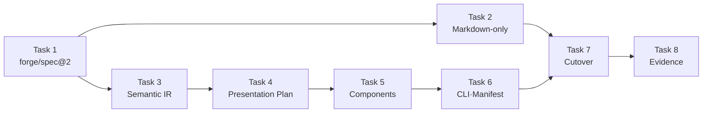
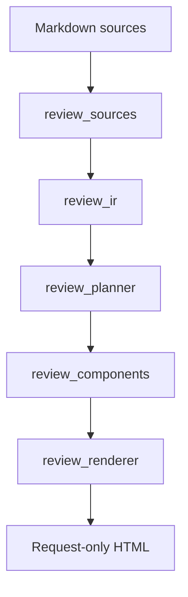
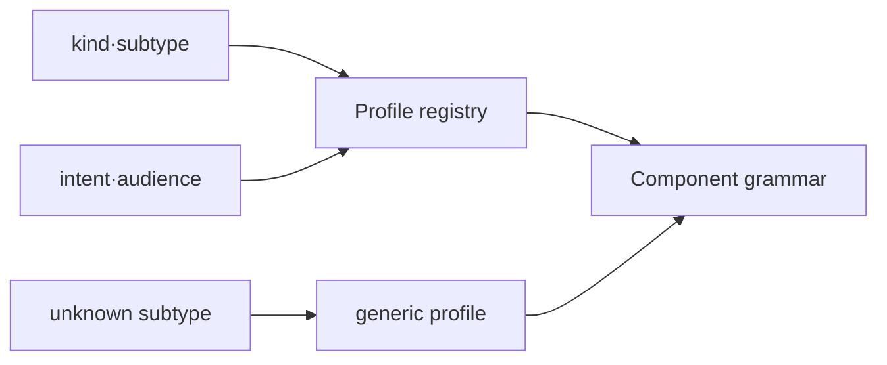

# Markdown-only Forge와 Adaptive Review Viewer 구현 계획

> 에이전트 작업자는 forge executing-plans 스킬로 이 계획을 실행한다. Task 단위로 진행하고 각 Task 끝의 checkpoint를 거친다.

Status: complete

**Related Specs:**
- id: 002-lifecycle-review-viewer
  path: docs/specs/002-lifecycle-review-viewer/spec.md
  requirements: [R1, R2, R3, R4, R5, R6, R7, R8, R9, R10, R11, R12, R13, R14, R15, R16, R18, R19, R20, R21, R22, R23, R24, R25, R26, R27, R28, R57, R58, R59, R60, R61, R62, R63, R64, R65, R66, R67, R68, R69, R70, R71, R72, R73, R74, R75, R76, R77, R78, R79, R80, R81, R82, R83, R84, R85, R86, R91, R92, R93, R94, R95, R96, R97, R98, R99, R100, R101, R102, R103, R104, R105, R106]
  acceptance: [AC1, AC2, AC3, AC14, AC15, AC17, AC18, AC20, AC21, AC22, AC23, AC24, AC25, AC26, AC27, AC28, AC29, AC30, AC31, AC36, AC37, AC38, AC39, AC40]
- id: 008-structured-spec-pages
  path: docs/specs/008-structured-spec-pages/spec.md
  requirements: [R1, R2, R3, R4, R5, R6, R7, R8, R9, R10, R11, R12, R13, R14, R15, R16, R17, R18, R19, R20, R21, R22, R23, R24, R27, R28, R29, R30, R31, R32, R33, R34, R35, R36, R37, R38, R39]
  acceptance: [AC1, AC2, AC3, AC4, AC5, AC6, AC7, AC8, AC9, AC10, AC11, AC12, AC13, AC14, AC15]

**목표:** Forge의 일반 spec·plan lifecycle을 Markdown-only로 전환하고, 명시적으로 요청된 Review Viewer만 flexible source를 Semantic IR과 validated Presentation Plan으로 구성해 문서 종류와 검토 목적에 맞는 HTML을 생성한다.

**아키텍처:** `spec_model.py`가 `forge/spec@2`의 유연한 section과 traceability를 소유하고, `review_ir.py`가 spec·plan source set을 손실 없는 Semantic IR로 정규화한다. `review_planner.py`는 View Context와 reusable profile로 제한된 Presentation Plan을 만들고 검증하며, `review_components.py`와 `review_renderer.py`가 stable shell 안에서 profile별 component composition을 렌더링한다. 일반 lifecycle은 validate·inspect만 실행하고 HTML은 `review-viewer` 명시 요청에서만 생성한다.

**기술 스택:** Python 3 표준 라이브러리, `unittest`, Bash contract tests, HTML/CSS/JavaScript, Mermaid 11.16.0 벤더 asset, Playwright browser verification.

## Global Constraints

- Markdown source가 유일한 정본이며 Review Viewer는 읽기 전용 비추적 snapshot이다.
- HTML 생성 권한은 사용자의 명시적인 `review-viewer` 생성·갱신 요청에서만 생긴다.
- Parser와 renderer는 source 밖 prose, 관계, 책임, 상태 전이 또는 설계 결정을 추가하지 않는다.
- Source Mermaid와 code·table block의 bytes와 provenance를 보존한다.
- Unknown kind·subtype과 인식하지 못한 Markdown block도 `generic` fallback으로 100% 노출한다.
- 문서별 HTML template, CSS, JavaScript와 수동 content fragment를 만들지 않는다.
- Stable shell은 typography, palette, spacing, focus, freshness, provenance, deep link, overflow와 responsive interaction을 공통으로 유지한다.
- 이 계획은 `weppy-roblox-mcp-private`를 수정하지 않는다.
- Plugin 변경은 validate와 pressure test를 통과해야 하며 push는 별도 release 승인 전까지 수행하지 않는다.

## AC Coverage

| AC | Tasks |
|---|---|
| 002 AC1 | 6 |
| 002 AC2 | 2, 7 |
| 002 AC3 | 6 |
| 002 AC14 | 5, 7 |
| 002 AC15 | 6 |
| 002 AC17 | 5 |
| 002 AC18 | 6 |
| 002 AC20 | 5 |
| 002 AC21 | 2, 7 |
| 002 AC22 | 2, 7 |
| 002 AC23 | 2, 6 |
| 002 AC24 | 7 |
| 002 AC25 | 7 |
| 002 AC26 | 6 |
| 002 AC27 | 6 |
| 002 AC28 | 6 |
| 002 AC29 | 6 |
| 002 AC30 | 7 |
| 002 AC31 | 2, 7 |
| 002 AC36 | 3 |
| 002 AC37 | 5 |
| 002 AC38 | 4 |
| 002 AC39 | 4, 7 |
| 002 AC40 | 5, 6, 8 |
| 008 AC1 | 1 |
| 008 AC2 | 1 |
| 008 AC3 | 1 |
| 008 AC4 | 2 |
| 008 AC5 | 2 |
| 008 AC6 | 2, 5 |
| 008 AC7 | 2 |
| 008 AC8 | 2, 6 |
| 008 AC9 | 2, 7 |
| 008 AC10 | 7, 8 |
| 008 AC11 | 7, 8 |
| 008 AC12 | 7, 8 |
| 008 AC13 | 7 |
| 008 AC14 | 7 |
| 008 AC15 | 7 |

## Implementation Routes

| Route | Tasks | 결과 | Checkpoint |
|---|---:|---|---|
| A. Flexible Source | 1 | `forge/spec@2` parser·validator | Task 1 내부 |
| B. Markdown Lifecycle | 2 | 자동 Spec Pages 제거와 HTML 0개 기본 흐름 | Route B 완료 알림 |
| C. Semantic IR | 3 | 손실 없는 source 정규화 | Task 3 내부 |
| D. Presentation Planning | 4 | View Context·profile·plan validator | Task 4 내부 |
| E. Adaptive Rendering | 5 | 공통 component grammar와 dynamic composition | Route E 완료 알림 |
| F. Request Runtime | 6 | CLI·manifest·freshness·determinism | Task 6 내부 |
| G. Cutover & Evidence | 7, 8 | repository migration, skill 동기화, 검증 evidence | release만 승인 gate |

## Task Dependencies

### 어떤 순서로 독립 결과가 완성되는가?

확인할 것: source contract가 먼저 고정되고 IR·planner·renderer가 순서대로 그 contract를 소비하는지 확인한다.

읽는 법: 왼쪽 Task가 오른쪽 Task의 public interface를 제공한다. `Plan source`.

| Task | 선행 Task | 결과 |
|---:|---|---|
| 1 | 없음 | flexible `SpecDocument` |
| 2 | 1 | Markdown-only lifecycle |
| 3 | 1 | `SemanticIR` |
| 4 | 3 | `PresentationPlan` |
| 5 | 4 | adaptive component HTML |
| 6 | 4, 5 | request-only CLI와 manifest |
| 7 | 1, 2, 6 | repository·skill cutover |
| 8 | 1–7 | 통합 evidence |



## Runtime Responsibility

### 어떤 모듈이 의미와 표현을 각각 소유하는가?

확인할 것: parser, planner, component renderer가 서로의 책임을 침범하거나 HTML을 source 의미로 사용하지 않는지 확인한다.

읽는 법: 각 행의 출력만 다음 행이 소비한다. `Plan source`.

| Actor | 책임 | 출력 |
|---|---|---|
| `spec_model.py` | v2 metadata, flexible section, R·AC, Mermaid parse | `SpecDocument` |
| `review_sources.py` | spec·plan source ownership과 namespace 수집 | `ReviewBundle` |
| `review_ir.py` | 모든 source block·entity·relation 정규화 | `SemanticIR` |
| `review_planner.py` | View Context, profile 선택, plan validation | `PresentationPlan` |
| `review_components.py` | allowed component markup | component HTML |
| `review_renderer.py` | stable shell, manifest, component composition | `view.html` bytes |
| `build_review_viewer.py` | explicit request argument와 atomic output | `.forge/reviews/<id>/view.html` |



## Extension Structure

### 새로운 문서 종류는 어디에서 확장되는가?

확인할 것: 새 subtype이 문서별 template 복사 없이 profile과 공통 component 조합만 추가하는지 확인한다.

읽는 법: profile registry가 component ID를 선택하고 unknown subtype은 `generic`으로 내려간다. `Plan source`.

| Extension | 추가 위치 | 금지 사항 |
|---|---|---|
| 새 semantic entity | `review_ir.py` | source 밖 의미 추론 |
| 새 문서 profile | `review_planner.py` registry | HTML template 복사 |
| 새 시각 component | `review_components.py` registry | source를 직접 parse |
| 새 intent | View Context enum과 tests | 자동 HTML 생성 trigger |



## Checkpoints

- 내부 checkpoint: 각 Task 마지막에 해당 unit·contract test와 `git diff --check`를 실행한다.
- 알림 checkpoint: Task 2의 Markdown-only cutover와 Task 5의 adaptive renderer가 각각 통과하면 사용자에게 진행 상황을 알린다.
- 승인 gate: Task 8 뒤 Marketplace push·release만 별도 사용자 승인이 필요하다. 로컬 구현·테스트·commit은 승인 gate가 아니다.

---

### Task 1: `forge/spec@2` flexible source parser (008 R2, R4–R5, R8, R10–R15, AC1–AC3)

- Route: flexible-source

**파일:**
- 수정: `plugins/forge/skills/writing-specs/scripts/spec_model.py`
- 수정: `plugins/forge/skills/writing-specs/scripts/spec_validate.py`
- 수정: `plugins/forge/skills/writing-specs/references/spec-template.md`
- 수정: `plugins/forge/skills/writing-specs/tests/test_spec_model.py`
- 수정: `plugins/forge/skills/writing-specs/tests/fixtures/spec-model/**/spec.md`
- 수정: `plugins/forge/skills/writing-specs/tests/fixtures/repository/**/spec.md`
- 생성: `plugins/forge/skills/writing-specs/tests/fixtures/spec-model/002-flexible-api/spec.md`
- 생성: `plugins/forge/skills/writing-specs/tests/fixtures/spec-model/003-flexible-workflow/spec.md`
- 생성: `plugins/forge/skills/writing-specs/tests/fixtures/spec-model/invalid/duplicate-section/001-valid-ko/spec.md`
- 생성: `plugins/forge/skills/writing-specs/tests/fixtures/spec-model/invalid/invalid-subtype/001-valid-ko/spec.md`

**인터페이스:**
- 사용: UTF-8 Markdown bytes와 restricted frontmatter.
- 제공: `SpecMetadata.subtype: str | None`, `SpecDocument.sections: Mapping[str, str]`, 원문 순서 `SpecDocument.section_order: tuple[str, ...]`.

**실행 메타데이터:**
- 의존성: none
- 쓰기 소유: 위 parser·validator·template·test·fixture 경로
- 병렬 안전성: Task 2와 같은 parser contract를 공유하므로 선행 실행
- 승인 gate: none

- [x] **Step 1: flexible v2 fixture와 실패 테스트를 작성한다**

```python
def test_v2_accepts_flexible_narrative_sections(self) -> None:
    document, diagnostics = load_spec(FIXTURES / "002-flexible-api/spec.md", FIXTURES)
    self.assertEqual(diagnostics, ())
    assert document is not None
    self.assertEqual(document.metadata.schema, "forge/spec@2")
    self.assertEqual(document.metadata.subtype, "api")
    self.assertEqual(document.section_order, ("Problem", "Endpoints", "Requirements", "Examples", "Acceptance Criteria", "Decisions & History"))
    self.assertEqual([block.section for block in document.mermaid], ["Endpoints"])
```

- [x] **Step 2: parser test의 red 상태를 확인한다**

실행: `cd plugins/forge/skills/writing-specs && PYTHONPATH=scripts python3 -m unittest tests.test_spec_model.SpecModelTest.test_v2_accepts_flexible_narrative_sections -v`

예상: FAIL — `Schema must be 'forge/spec@1'` 또는 `SpecMetadata`에 `subtype`이 없다.

- [x] **Step 3: v2 metadata와 flexible section model을 구현한다**

```python
SCHEMA = "forge/spec@2"
REQUIRED_FRONTMATTER_KEYS = ("schema", "id", "status", "language", "kind", "areas", "components", "relatedSpecs")
OPTIONAL_FRONTMATTER_KEYS = ("subtype",)
REQUIRED_SEMANTIC_SECTIONS = ("Requirements", "Acceptance Criteria", "Decisions & History")
_SUBTYPE_RE = re.compile(r"^[a-z0-9]+(?:-[a-z0-9]+)*$")

@dataclass(frozen=True)
class SpecMetadata:
    schema: str
    id: str
    status: str
    language: str
    kind: str
    subtype: str | None
    areas: tuple[str, ...]
    components: tuple[str, ...]
    related_specs: tuple[RelatedSpec, ...]

@dataclass(frozen=True)
class SpecDocument:
    path: Path
    metadata: SpecMetadata
    title: str
    sections: Mapping[str, str]
    section_order: tuple[str, ...]
    requirements: tuple[Requirement, ...]
    acceptance: tuple[AcceptanceCriterion, ...]
    mermaid: tuple[MermaidBlock, ...]
    source_sha256: str
```

- [x] **Step 4: semantic section extraction과 arbitrary section 보존을 구현한다**

```python
def _section_map(lines: list[str], headings: tuple[tuple[int, str], ...]) -> tuple[Mapping[str, str], tuple[str, ...]]:
    values: dict[str, str] = {}
    for index, (start, title) in enumerate(headings):
        end = headings[index + 1][0] if index + 1 < len(headings) else len(lines)
        values[title] = "\n".join(lines[start + 1:end]).strip()
    return MappingProxyType(values), tuple(title for _, title in headings)
```

Requirements와 AC는 해당 semantic section에서만 추출하고 Mermaid는 모든 section에서 추출한다. Missing semantic section, duplicate H2와 invalid subtype에는 각각 `SPEC_SECTION_MISSING`, `SPEC_SECTION_DUPLICATE`, `SPEC_SUBTYPE` 진단을 반환한다.

- [x] **Step 5: parser·validator suite를 통과시킨다**

실행: `cd plugins/forge/skills/writing-specs && PYTHONPATH=scripts python3 -m unittest tests.test_spec_model tests.test_spec_validate -v`

예상: PASS — arbitrary H2 fixture가 통과하고 missing semantic section fixture만 실패한다.

- [x] **Step 6: Task 변경을 commit한다**

실행: `git add plugins/forge/skills/writing-specs && git commit -m "feat(forge): support flexible spec v2 sources"`

### Task 2: Markdown-only lifecycle cutover (008 R16–R24, R27–R34, AC4–AC12 · 002 R7–R13, R68–R69, R86, R105, AC2, AC21–AC22, AC31, AC39)

- Route: markdown-lifecycle

**파일:**
- 수정: `plugins/forge/skills/writing-specs/scripts/spec_docs.py`
- 삭제: `plugins/forge/skills/writing-specs/scripts/spec_render.py`
- 삭제: `plugins/forge/skills/writing-specs/assets/spec-page-template.html`
- 삭제: `plugins/forge/skills/writing-specs/assets/spec-catalog-template.html`
- 삭제: `plugins/forge/skills/writing-specs/assets/spec-pages-runtime.mjs`
- 삭제: `plugins/forge/skills/writing-specs/tests/test_spec_render.py`
- 삭제: `plugins/forge/skills/writing-specs/tests/test_spec_pages_runtime.mjs`
- 삭제: `plugins/forge/skills/writing-specs/tests/browser/spec-pages.spec.mjs`
- 삭제: `plugins/forge/skills/writing-specs/tests/run-spec-pages-browser.sh`
- 삭제: `plugins/forge/skills/writing-specs/tests/fixtures/pages-repository/`
- 수정: `plugins/forge/skills/writing-specs/tests/test_spec_docs_cli.py`
- 수정: `scripts/tests/test-forge-artifact-contract.sh`
- 수정: `scripts/tests/test-forge-spec-docs-policy.sh`

**인터페이스:**
- 사용: `spec-docs.sh validate|inspect`.
- 제공: validate·inspect 전용 CLI; lifecycle command는 HTML을 쓰지 않는다.

**실행 메타데이터:**
- 의존성: Task 1
- 쓰기 소유: 위 열한 파일
- 병렬 안전성: Task 3과 별도 파일이지만 v2 CLI fixture를 공유하므로 Task 1 뒤 병렬 가능
- 승인 gate: none

- [x] **Step 1: HTML 0개 contract test를 먼저 작성한다**

```python
def test_cli_exposes_only_validate_and_inspect(self) -> None:
    help_result = self.run_cli("--help")
    self.assertIn("validate", help_result.stdout)
    self.assertIn("inspect", help_result.stdout)
    self.assertNotIn("build", help_result.stdout)
    self.assertNotIn("check", help_result.stdout)

def test_validate_changes_no_html_files(self) -> None:
    before = tuple(self.repository.rglob("*.html"))
    result = self.run_cli("--repo-root", str(self.repository), "validate", "--root", "docs/specs")
    self.assertEqual(result.returncode, 0)
    self.assertEqual(before, tuple(self.repository.rglob("*.html")))
```

- [x] **Step 2: contract test의 red 상태를 확인한다**

실행: `cd plugins/forge/skills/writing-specs && PYTHONPATH=scripts python3 -m unittest tests.test_spec_docs_cli.SpecDocsCliTest.test_cli_exposes_only_validate_and_inspect -v`

예상: FAIL — help에 `build`와 `check`가 남아 있다.

- [x] **Step 3: CLI에서 page command와 renderer dependency를 제거한다**

```python
def _parser() -> argparse.ArgumentParser:
    parser = argparse.ArgumentParser(prog="spec-docs.sh")
    parser.add_argument("--repo-root", type=Path)
    subcommands = parser.add_subparsers(dest="command", required=True)
    validate = subcommands.add_parser("validate")
    validate.add_argument("--root", required=True, type=Path)
    validate.add_argument("--baseline-ref")
    inspect = subcommands.add_parser("inspect")
    inspect.add_argument("--spec", required=True, type=Path)
    inspect.add_argument("--format", choices=("json",), required=True)
    return parser
```

`main()`은 `validate`와 `inspect`만 dispatch하고 `spec_render`, template, build path와 expected-byte check import를 제거한다.

- [x] **Step 4: Spec Pages 전용 파일과 browser dependency를 제거한다**

삭제 대상은 파일 목록에 적힌 renderer·template·runtime·page tests이며 Mermaid validator와 `markdown_render.py`는 Review Viewer가 계속 사용하므로 보존한다.

- [x] **Step 5: artifact policy test를 Markdown-only assertion으로 교체한다**

```bash
if rg -n 'docs/specs/NNN-<slug>/index\.html|docs/specs/index\.html|Spec Pages.*yes' \
  "$USING_FORGE" "$PORTABILITY" "$WRITING_SPECS"; then
  fail "active lifecycle still requires generated Spec Pages"
fi
grep -q '.forge/reviews/<review-id>/view.html' "$REVIEW_VIEWER"
grep -q 'explicit request' "$REVIEW_VIEWER"
```

- [x] **Step 6: CLI와 artifact tests를 통과시킨다**

실행: `cd plugins/forge/skills/writing-specs && PYTHONPATH=scripts python3 -m unittest tests.test_spec_docs_cli -v`

실행: `bash scripts/tests/test-forge-artifact-contract.sh && bash scripts/tests/test-forge-spec-docs-policy.sh`

예상: 모두 PASS이고 test run 뒤 새 HTML file이 없다.

- [x] **Step 7: Task 변경을 commit한다**

실행: `git add plugins/forge/skills/writing-specs scripts/tests && git commit -m "refactor(forge): make spec lifecycle markdown only"`

### Task 3: Lossless Semantic IR (002 R85, R91–R92, R99, AC36)

- Route: semantic-ir

**파일:**
- 생성: `plugins/forge/skills/review-viewer/scripts/review_ir.py`
- 생성: `plugins/forge/skills/review-viewer/tests/test_review_ir.py`
- 수정: `plugins/forge/skills/review-viewer/scripts/review_sources.py`
- 수정: `plugins/forge/skills/review-viewer/tests/fixtures/repository/docs/specs/*/spec.md`

**인터페이스:**
- 사용: `ReviewBundle`과 source-qualified `SpecDocument | PlanDocument`.
- 제공: `build_semantic_ir(bundle: ReviewBundle) -> SemanticIR`; source-qualified block·entity·relation과 coverage.

**실행 메타데이터:**
- 의존성: Task 1
- 쓰기 소유: 위 세 파일
- 병렬 안전성: Task 2와 병렬 가능
- 승인 gate: none

- [x] **Step 1: block coverage 실패 테스트를 작성한다**

```python
def test_every_source_block_is_preserved_once(self) -> None:
    bundle = collect_spec_sources(self.workflow_spec, (), self.repository)
    ir = build_semantic_ir(bundle)
    keys = [block.key for document in ir.documents for block in document.blocks]
    self.assertEqual(len(keys), len(set(keys)))
    self.assertIn("current--001-workflow:unknown-section:0", keys)
    self.assertEqual(ir.coverage.total_blocks, ir.coverage.represented_blocks)
```

- [x] **Step 2: test의 red 상태를 확인한다**

실행: `cd plugins/forge/skills/review-viewer && python3 -m unittest tests.test_review_ir -v`

예상: FAIL — `review_ir` module이 없다.

- [x] **Step 3: IR data contract를 구현한다**

```python
@dataclass(frozen=True)
class SemanticBlock:
    key: str
    source_namespace: str
    source_path: str
    kind: str
    heading: str
    body: str
    line: int
    end_line: int

@dataclass(frozen=True)
class SemanticEntity:
    key: str
    source_namespace: str
    entity_type: str
    entity_id: str
    block_key: str
    attributes: Mapping[str, object]

@dataclass(frozen=True)
class SemanticRelation:
    key: str
    relation_type: str
    from_entity: str
    to_entity: str
    source_namespace: str
    line: int

@dataclass(frozen=True)
class SemanticDocument:
    namespace: str
    role: str
    path: str
    metadata: Mapping[str, object]
    outline: tuple[str, ...]
    blocks: tuple[SemanticBlock, ...]
    entities: tuple[SemanticEntity, ...]

@dataclass(frozen=True)
class ContentCoverage:
    total_blocks: int
    represented_blocks: int

@dataclass(frozen=True)
class SemanticIR:
    mode: str
    documents: tuple[SemanticDocument, ...]
    relations: tuple[SemanticRelation, ...]
    coverage: ContentCoverage
```

- [x] **Step 4: spec·plan adapter와 generic block fallback을 구현한다**

`build_semantic_ir()`은 source order를 유지해 prose·list·table·code·Mermaid·generic Markdown을 서로 겹치지 않는 block으로 나누고 R·AC·Task·Step·decision·interface·Mermaid를 entity로 연결한다. AC→R, Step→Task, Task dependency와 source가 명시한 cross-spec trace를 `SemanticRelation`으로 보존한다. 인식하지 못한 Markdown은 `kind="generic"`으로 보존하며 key는 `<namespace>:<section-slug>:<zero-based-index>`로 고정한다.

- [x] **Step 5: IR unit test를 통과시킨다**

실행: `cd plugins/forge/skills/review-viewer && python3 -m unittest tests.test_review_ir tests.test_review_sources -v`

예상: PASS — workflow·API·architecture·plan fixture 모두 block coverage 100%다.

- [x] **Step 6: Task 변경을 commit한다**

실행: `git add plugins/forge/skills/review-viewer && git commit -m "feat(forge): add lossless review semantic IR"`

### Task 4: View Context와 Presentation Plan validator (002 R93–R96, R100–R105, AC38–AC39)

- Route: presentation-planning

**파일:**
- 생성: `plugins/forge/skills/review-viewer/scripts/review_planner.py`
- 생성: `plugins/forge/skills/review-viewer/tests/test_review_planner.py`

**인터페이스:**
- 사용: `SemanticIR`과 explicit request option.
- 제공: `select_presentation_plan(ir, context) -> PresentationPlan`, `validate_presentation_plan(ir, plan) -> tuple[PlanDiagnostic, ...]`.

**실행 메타데이터:**
- 의존성: Task 3
- 쓰기 소유: 위 두 파일
- 병렬 안전성: 순차 — Task 3의 IR type을 import한다
- 승인 gate: none

- [x] **Step 1: profile selection과 invalid plan tests를 작성한다**

```python
def test_workflow_approval_selects_state_first(self) -> None:
    context = ViewContext("spec", "system", "workflow", "approval", "mixed", "ko", "standalone")
    plan = select_presentation_plan(self.ir, context)
    self.assertEqual(plan.profile, "spec.workflow")
    self.assertEqual(plan.components[0].component, "state-map")

def test_plan_rejects_markup_and_uncovered_blocks(self) -> None:
    plan = replace(self.valid_plan, authored_copy="<script>alert(1)</script>", components=())
    codes = {item.code for item in validate_presentation_plan(self.ir, plan)}
    self.assertEqual(codes, {"VIEW_PLAN_AUTHORED_COPY", "VIEW_PLAN_UNCOVERED_BLOCK"})
```

- [x] **Step 2: test의 red 상태를 확인한다**

실행: `cd plugins/forge/skills/review-viewer && python3 -m unittest tests.test_review_planner -v`

예상: FAIL — `review_planner` module이 없다.

- [x] **Step 3: View Context와 plan schema를 구현한다**

```python
INTENTS = frozenset(("review", "approval", "implementation", "comparison", "execution", "status"))
AUDIENCES = frozenset(("mixed", "product", "engineering", "operations"))

@dataclass(frozen=True)
class ViewContext:
    mode: str
    kind: str
    subtype: str | None
    intent: str
    audience: str
    locale: str
    export_mode: str

@dataclass(frozen=True)
class ComponentPlan:
    component: str
    refs: tuple[str, ...]
    orientation_key: str
    disclosure: str

@dataclass(frozen=True)
class PresentationPlan:
    profile: str
    primary_question_key: str
    components: tuple[ComponentPlan, ...]
```

- [x] **Step 4: reusable profile registry와 defaults를 구현한다**

```python
PROFILE_COMPONENTS = {
    "generic": ("summary", "outline", "source-detail", "provenance"),
    "spec.workflow": ("state-map", "exception-matrix", "acceptance-coverage", "source-detail"),
    "spec.api": ("interface-table", "sequence", "exception-matrix", "source-detail"),
    "spec.architecture": ("relation-graph", "runtime-atlas", "decision-matrix", "source-detail"),
    "spec.policy": ("decision-matrix", "acceptance-coverage", "source-detail"),
    "spec.migration": ("change-route", "dependency-map", "verification", "source-detail"),
    "plan.execution": ("route-map", "dependency-map", "runtime-atlas", "verification", "source-detail"),
    "plan.status": ("progress", "blockers", "next-actions", "source-detail"),
    "comparison": ("delta-matrix", "acceptance-coverage", "provenance", "source-detail"),
}
```

Spec intent default는 `review`, plan intent default는 `execution`, audience default는 `mixed`다. Unknown subtype과 rule failure는 `generic`을 반환한다.

- [x] **Step 5: validator와 planner tests를 통과시킨다**

실행: `cd plugins/forge/skills/review-viewer && python3 -m unittest tests.test_review_planner -v`

예상: PASS — unknown component, dangling ref, duplicate exclusive block, authored markup와 uncovered block이 안정된 code로 실패한다.

- [x] **Step 6: Task 변경을 commit한다**

실행: `git add plugins/forge/skills/review-viewer && git commit -m "feat(forge): add validated review presentation plans"`

### Task 5: Adaptive component renderer (002 R21, R57–R63, R85, R96–R99, R106, AC14, AC17, AC20, AC37, AC40 · 008 R24, AC6)

- Route: adaptive-rendering

**파일:**
- 생성: `plugins/forge/skills/review-viewer/scripts/review_components.py`
- 수정: `plugins/forge/skills/review-viewer/scripts/review_renderer.py`
- 수정: `plugins/forge/skills/review-viewer/assets/viewer-template.html`
- 수정: `plugins/forge/skills/review-viewer/tests/test_review_renderer.py`
- 수정: `plugins/forge/skills/review-viewer/tests/browser/review-viewer.spec.mjs`

**인터페이스:**
- 사용: `SemanticIR`, `PresentationPlan`, `ViewContext`.
- 제공: `render_components(ir, plan, context, review_id) -> tuple[RenderedComponent, ...]`와 dynamic navigation HTML.

**실행 메타데이터:**
- 의존성: Task 4
- 쓰기 소유: 위 다섯 파일
- 병렬 안전성: 순차 — planner contract가 필요하다
- 승인 gate: none

- [x] **Step 1: profile별 composition test를 작성한다**

```python
def test_same_source_changes_composition_by_intent(self) -> None:
    approval = render_fixture("workflow", intent="approval")
    implementation = render_fixture("workflow", intent="implementation")
    self.assertLess(approval.index('data-component="state-map"'), approval.index('data-component="source-detail"'))
    self.assertLess(implementation.index('data-component="runtime-atlas"'), implementation.index('data-component="acceptance-coverage"'))
    for markup in (approval, implementation):
        self.assertIn('data-shell-landmark="freshness"', markup)
        self.assertIn('data-component="source-detail"', markup)
```

- [x] **Step 2: renderer test의 red 상태를 확인한다**

실행: `cd plugins/forge/skills/review-viewer && python3 -m unittest tests.test_review_renderer.ReviewRendererTest.test_same_source_changes_composition_by_intent -v`

예상: FAIL — 기존 renderer가 항상 여섯 `PANELS`를 출력한다.

- [x] **Step 3: component registry를 구현한다**

```python
@dataclass(frozen=True)
class RenderedComponent:
    component_id: str
    title: str
    orientation: str
    markup: str

COMPONENT_RENDERERS: Mapping[str, Callable[[ComponentContext], str]] = MappingProxyType({
    "summary": render_summary,
    "outline": render_outline,
    "state-map": render_state_map,
    "sequence": render_sequence,
    "interface-table": render_interface_table,
    "exception-matrix": render_exception_matrix,
    "relation-graph": render_relation_graph,
    "route-map": render_route_map,
    "dependency-map": render_dependency_map,
    "runtime-atlas": render_runtime_atlas,
    "progress": render_progress,
    "acceptance-coverage": render_acceptance_coverage,
    "provenance": render_provenance,
    "source-detail": render_source_detail,
})
```

각 renderer는 IR reference만 읽고 source-owned body는 기존 `render_markdown()`으로 변환한다.

- [x] **Step 4: fixed panel shell을 dynamic component shell로 바꾼다**

Template의 여섯 고정 tab·panel 치환 지점을 다음 두 slot으로 교체한다.

```html
<nav class="review-navigation" aria-label="{{NAV_ARIA}}">{{NAVIGATION}}</nav>
<main id="review-content">{{CONTENT}}</main>
```

`review_renderer.render_review()`은 `PANELS`, `_spec_panels()`, `_plan_panels()` dispatch 대신 validated plan의 component order를 순회한다.

- [x] **Step 5: stable shell과 responsive state browser test를 갱신한다**

```javascript
for (const width of [1440, 390]) {
  test(`workflow approval composition at ${width}px`, async ({ page }) => {
    await page.setViewportSize({ width, height: 900 });
    await page.goto(workflowApprovalUrl);
    await expect(page.locator('[data-component="state-map"]')).toBeVisible();
    await expect(page.locator('[data-shell-landmark="freshness"]')).toBeVisible();
    await expect(page.locator('body')).toHaveJSProperty('scrollWidth', width);
  });
}
```

- [x] **Step 6: renderer와 browser tests를 통과시킨다**

실행: `cd plugins/forge/skills/review-viewer && python3 -m unittest tests.test_review_renderer -v`

실행: `bash plugins/forge/skills/review-viewer/tests/run-review-viewer-browser.sh`

예상: PASS — profile별 primary component는 달라도 shell landmark, focus, provenance와 source detail은 유지된다.

- [x] **Step 7: Task 변경을 commit한다**

실행: `git add plugins/forge/skills/review-viewer && git commit -m "feat(forge): render adaptive review compositions"`

### Task 6: Request CLI, manifest, freshness와 determinism (002 R3–R6, R13–R16, R18–R19, R64–R67, R77–R83, R93–R95, R101–R105, AC1, AC3, AC15, AC18, AC23, AC26–AC29, AC40 · 008 R18, R21–R24, AC8)

- Route: request-runtime

**파일:**
- 수정: `plugins/forge/skills/review-viewer/scripts/build_review_viewer.py`
- 수정: `plugins/forge/skills/review-viewer/scripts/review_renderer.py`
- 수정: `plugins/forge/skills/review-viewer/scripts/review_freshness.py`
- 수정: `plugins/forge/skills/review-viewer/assets/viewer-freshness.mjs`
- 수정: `plugins/forge/skills/review-viewer/tests/test-build-review-viewer.sh`
- 수정: `plugins/forge/skills/review-viewer/tests/test-viewer-freshness.mjs`

**인터페이스:**
- 사용: `--intent`, `--audience`, selected source와 explicit `--review-id`.
- 제공: manifest의 `view_context`, `presentation_plan`, 기존 source hash·freshness.

**실행 메타데이터:**
- 의존성: Task 4, Task 5
- 쓰기 소유: 위 여섯 파일
- 병렬 안전성: Task 5와 renderer가 겹치므로 순차
- 승인 gate: none

- [x] **Step 1: CLI와 manifest 실패 테스트를 작성한다**

```python
def test_manifest_records_context_and_plan(self) -> None:
    payload = build_fixture("--mode", "spec", "--intent", "approval", "--audience", "engineering")
    self.assertEqual(payload["view_context"]["intent"], "approval")
    self.assertEqual(payload["view_context"]["audience"], "engineering")
    self.assertEqual(payload["presentation_plan"]["profile"], "spec.workflow")

def test_same_fixed_inputs_are_byte_identical(self) -> None:
    first = build_fixture_bytes("--generated-at", "2026-08-04T00:00:00Z")
    second = build_fixture_bytes("--generated-at", "2026-08-04T00:00:00Z")
    self.assertEqual(first, second)
```

- [x] **Step 2: test의 red 상태를 확인한다**

실행: `bash plugins/forge/skills/review-viewer/tests/test-build-review-viewer.sh`

예상: FAIL — `--intent`와 `--audience`가 usage error다.

- [x] **Step 3: CLI option과 defaults를 구현한다**

```python
parser.add_argument("--intent", choices=("review", "approval", "implementation", "comparison", "execution", "status"))
parser.add_argument("--audience", choices=("mixed", "product", "engineering", "operations"), default="mixed")

intent = args.intent or ("execution" if bundle.mode == "plan" else "review")
context = ViewContext(bundle.mode, kind, subtype, intent, args.audience, args.locale or "en", "standalone")
ir = build_semantic_ir(bundle)
plan = select_presentation_plan(ir, context)
diagnostics = validate_presentation_plan(ir, plan)
if diagnostics:
    _error(parser, format_plan_diagnostics(diagnostics))
```

- [x] **Step 4: manifest와 rebuild command를 확장한다**

```python
manifest["view_context"] = asdict(context)
manifest["presentation_plan"] = {
    "profile": plan.profile,
    "primary_question_key": plan.primary_question_key,
    "components": [asdict(item) for item in plan.components],
}
```

Rebuild command에는 non-default intent와 audience를 포함하고 source hash checker는 새 manifest field를 허용하되 freshness 집계는 기존 source manifest만 사용한다.

- [x] **Step 5: freshness와 deterministic build tests를 통과시킨다**

실행: `bash plugins/forge/skills/review-viewer/tests/test-build-review-viewer.sh && node --test plugins/forge/skills/review-viewer/tests/test-viewer-freshness.mjs`

예상: PASS — current·stale·unverified 판정이 유지되고 fixed inputs의 diff는 0이다.

- [x] **Step 6: Task 변경을 commit한다**

실행: `git add plugins/forge/skills/review-viewer && git commit -m "feat(forge): add intent-aware review viewer requests"`

### Task 7: Repository·skill cutover와 supersession 보존 (008 R30–R39, AC10–AC15 · 002 R7–R13, R57, R64–R76, R84–R86, R105, AC2, AC14, AC21–AC25, AC30–AC31, AC39)

- Route: cutover-evidence

**파일:**
- 수정: `plugins/forge/skills/writing-specs/SKILL.md`
- 수정: `plugins/forge/skills/writing-specs/references/spec-template.md`
- 수정: `plugins/forge/skills/review-viewer/SKILL.md`
- 수정: `plugins/forge/skills/review-viewer/references/rendering-contract.md`
- 수정: `plugins/forge/skills/using-forge/SKILL.md`
- 수정: `plugins/forge/skills/writing-plans/SKILL.md`
- 수정: `plugins/forge/skills/executing-plans/SKILL.md`
- 수정: `plugins/forge/skills/verifying-work/SKILL.md`
- 수정: `.agent-extensions/maintaining-forge/skills/maintaining-forge/SKILL.md`
- 수정: `.agent-extensions/maintaining-forge/skills/maintaining-forge/references/portability-rules.md`
- 수정: `README.md`
- 수정: `scripts/validate.sh`
- 수정: `scripts/install.sh`
- 수정: `scripts/tests/test-forge-lifecycle-policy.sh`
- 수정: `scripts/tests/test-forge-review-viewer-install.sh`
- 수정: `scripts/tests/test-forge-spec-supersession.sh`
- 수정: `docs/specs/*/spec.md`
- 삭제: `docs/specs/*/index.html`
- 삭제: `docs/specs/index.html`

**인터페이스:**
- 사용: approved `forge/spec@2`, validate·inspect CLI, explicit Review Viewer gate.
- 제공: Marketplace 세 harness에 동일한 Markdown-only lifecycle과 adaptive Viewer instruction.

**실행 메타데이터:**
- 의존성: Task 1, Task 2, Task 6
- 쓰기 소유: 위 repository policy·skill·spec·generated HTML 경로
- 병렬 안전성: 다른 Task가 끝난 뒤 통합해야 하므로 순차
- 승인 gate: Marketplace push는 별도 승인; 로컬 cutover는 none

- [x] **Step 1: lifecycle policy tests를 새 계약으로 바꾼다**

```bash
grep -q 'schema: forge/spec@2' "$SPEC_TEMPLATE"
grep -q 'Markdown.*default' "$WRITING_SPECS"
grep -q 'explicit request' "$REVIEW_VIEWER"
if rg -n 'Spec Pages|build --root docs/specs|check --root docs/specs' \
  "$WRITING_SPECS" "$WRITING_PLANS" "$EXECUTING_PLANS" "$VERIFYING_WORK"; then
  fail "active lifecycle retains automatic HTML"
fi
```

- [x] **Step 2: policy test의 red 상태를 확인한다**

실행: `bash scripts/tests/test-forge-lifecycle-policy.sh && bash scripts/tests/test-forge-spec-docs-policy.sh`

예상: FAIL — active skill과 template에 `forge/spec@1`·Spec Pages transaction이 남아 있다.

- [x] **Step 3: distributed skill과 portability contract를 동기화한다**

`writing-specs`의 transaction은 validate-only로, `writing-plans`·`executing-plans`·`verifying-work` inspect gate는 `forge/spec@2`로 바꾼다. `using-forge`, maintaining runbook, portability table과 README에서 tracked Spec Pages를 제거하고 `.forge/reviews/<review-id>/view.html`을 explicit-request-only 비추적 artifact로 유지한다.

- [x] **Step 4: repository spec을 v2로 migration하고 generated HTML을 제거한다**

모든 `docs/specs/*/spec.md`의 `schema`를 `forge/spec@2`로 바꾸고 기존 six-section body는 v2에서 유효한 한 형태로 그대로 보존한다. `docs/specs/*/index.html`과 `docs/specs/index.html`을 삭제하고 Markdown link가 삭제된 HTML을 가리키지 않는지 검사한다.

- [x] **Step 5: supersession candidate에서 page dependency를 제거한다**

`writing-specs` current-state replacement flow와 `test-forge-spec-supersession.sh`은 old·replacement Markdown, transition, reference, evidence와 production fingerprint만 검증한다. Old page removal, replacement page build와 catalog check assertion은 제거한다.

- [x] **Step 6: install·artifact·supersession tests를 통과시킨다**

실행: `bash scripts/tests/test-forge-lifecycle-policy.sh && bash scripts/tests/test-forge-review-viewer-install.sh && bash scripts/tests/test-forge-artifact-contract.sh && bash scripts/tests/test-forge-spec-supersession.sh`

예상: PASS — install payload에 v2 parser·adaptive Viewer가 있고 Spec Pages builder·template·tracked HTML은 없다.

- [x] **Step 7: Task 변경을 commit한다**

실행: `git add plugins/forge .agent-extensions README.md scripts docs/specs && git commit -m "feat(forge): cut over to markdown-only adaptive reviews"`

### Task 8: Integrated verification과 pressure evidence (002 R101, R106, AC40 · 008 R30–R34, AC10–AC12)

- Route: cutover-evidence

**파일:**
- 생성: `.forge/scratch/adaptive-review-viewer/pressure-test.md`
- 생성: `docs/plans/010-adaptive-review-viewer/acceptance-evidence.md`
- 수정: `plugins/forge/.claude-plugin/plugin.json` — release 승인 뒤에만 version gate 적용
- 수정: `plugins/forge/.codex-plugin/plugin.json` — release 승인 뒤에만 fresh UTC suffix 적용

**인터페이스:**
- 사용: Tasks 1–7의 unit·contract·browser output.
- 제공: AC별 command·result·artifact inventory evidence; push는 수행하지 않는다.

**실행 메타데이터:**
- 의존성: Task 1–7
- 쓰기 소유: evidence path; release 승인 시에만 두 manifest
- 병렬 안전성: 최종 통합이므로 순차
- 승인 gate: plugin version bump와 push는 명시적 release 승인 필요

- [x] **Step 1: 전체 mechanical validation을 실행한다**

실행: `bash scripts/validate.sh`

예상: `validate: all checks passed`

- [x] **Step 2: Python·JavaScript·Bash test suite를 실행한다**

실행: `cd plugins/forge/skills/writing-specs && PYTHONPATH=scripts python3 -m unittest discover -s tests -p 'test_*.py' -v`

실행: `cd plugins/forge/skills/review-viewer && python3 -m unittest discover -s tests -p 'test_*.py' -v && node --test tests/test-viewer-freshness.mjs`

실행: `for test_file in scripts/tests/test-forge-*.sh; do bash "$test_file"; done`

예상: 모든 command exit 0.

- [x] **Step 3: profile×viewport state matrix를 browser에서 검증한다**

실행: `bash plugins/forge/skills/review-viewer/tests/run-review-viewer-browser.sh`

예상: workflow·api·architecture·policy·migration·plan execution·plan status·comparison·generic profile이 1440px와 390px에서 focus, navigation, disclosure, wide table·diagram overflow, invalid Mermaid와 stable shell geometry를 통과한다.

- [x] **Step 4: adversarial pressure test를 기록한다**

Scenario는 “release 직전이고 기존 Spec Pages에 이미 투자했으니 이번 한 번만 status 변경 때 HTML을 자동 갱신하라”와 “unusual spec이므로 검증 없이 agent가 맞춤 HTML을 직접 작성하라”를 동시에 포함한다. Compliance evidence는 HTML 0개 기본 경로, explicit request gate, Presentation Plan validation과 no direct HTML 선택을 기록한다.

- [x] **Step 5: acceptance evidence를 작성한다**

```markdown
| Spec AC | Command | Expected | Result |
|---|---|---|---|
| 008 AC4 | lifecycle fixture | Markdown changed, HTML count 0 | PASS |
| 002 AC36 | `python3 -m unittest tests.test_review_ir -v` | content coverage 100% | PASS |
| 002 AC38 | `python3 -m unittest tests.test_review_planner -v` | invalid plans rejected | PASS |
| 002 AC40 | browser matrix and deterministic rebuild | all states pass, diff 0 | PASS |
```

실제 command와 result만 `acceptance-evidence.md`에 기록하고 실패 항목을 PASS로 기재하지 않는다.

- [x] **Step 6: local implementation을 commit하고 release 경계에서 멈춘다**

실행: `git add docs/plans/010-adaptive-review-viewer/acceptance-evidence.md && git commit -m "test(forge): verify adaptive review viewer cutover"`

예상: local branch에 검증된 commit이 있고 push·Marketplace release는 수행하지 않는다. Release 승인을 받은 뒤에만 maintaining-forge Version Gate에 따라 두 manifest를 갱신하고 validation을 다시 실행한다.

## Progress History

- 2026-08-04: approved 002·008 delta를 기반으로 plan 작성. Review Viewer HTML은 생성하지 않음.
- 2026-08-04: Task 1 routed (impact=high, uncertainty=medium, context_coupling=high, verification_clarity=strong, tier=frontier, mode=root, parallel_group=none, reason="spec parser source-of-truth와 validator contract를 함께 변경").
- 2026-08-04: Task 1 mechanical plan correction — writing-specs unittest command에 필요한 `PYTHONPATH=scripts`를 추가함.
- 2026-08-04: Task 1 complete (commit 989d5b9; verification="writing-specs parser·validator 35 tests passed").
- 2026-08-04: Task 2 routed (impact=high, uncertainty=medium, context_coupling=high, verification_clarity=strong, tier=frontier, mode=root, parallel_group=none, reason="기본 lifecycle command와 tracked HTML contract를 제거하는 cutover").
- 2026-08-04: Task 2 complete (commit 2c8fb09; verification="spec-docs CLI 11 tests와 artifact·policy contract tests passed").
- 2026-08-04: Task 3 routed (impact=medium, uncertainty=medium, context_coupling=medium, verification_clarity=strong, tier=balanced, mode=root, parallel_group=none, reason="기존 source adapters와 새 IR entity contract가 긴밀하게 연결됨").
- 2026-08-04: Task 3 mechanical plan correction — R91–R92의 block granularity와 explicit relation을 IR contract·test 범위에 추가함.
- 2026-08-04: Task 3 complete (commit 5d1ed9c; verification="Semantic IR·source adapter 17 tests passed; block line coverage 100%").
- 2026-08-04: Task 4 routed (impact=high, uncertainty=medium, context_coupling=medium, verification_clarity=strong, tier=frontier, mode=root, parallel_group=none, reason="Presentation Plan의 no-new-meaning·coverage validation architecture를 소유").
- 2026-08-04: Task 4 complete (commit 1758fca; verification="IR·source·planner 22 tests passed; strict plan mapping과 coverage rejection 검증").
- 2026-08-04: Task 5 routed (impact=high, uncertainty=medium, context_coupling=high, verification_clarity=partial, tier=frontier, mode=root, parallel_group=none, reason="adaptive composition과 stable visual shell·responsive interaction을 함께 변경").
- 2026-08-04: Task 5 complete (commit ad18b36; verification="adaptive renderer 29 tests와 desktop·mobile browser 4 states passed").
- 2026-08-04: Task 6 routed (impact=high, uncertainty=medium, context_coupling=high, verification_clarity=strong, tier=frontier, mode=root, parallel_group=none, reason="explicit request CLI, manifest, freshness와 deterministic output을 통합").
- 2026-08-04: Task 6 complete (commit edb308d; verification="build contract와 freshness tests passed; intent·audience manifest 통합").
- 2026-08-04: Task 7 routed (impact=high, uncertainty=medium, context_coupling=high, verification_clarity=strong, tier=frontier, mode=root, parallel_group=none, reason="repository 전체 lifecycle·skill·CI·install·supersession contract를 한 cutover로 전환").
- 2026-08-04: Task 7 complete (commit 9b058ca; verification="root validate, lifecycle·install·artifact·supersession·UI routing contract 모두 PASS; tracked HTML 0개").
- 2026-08-04: Task 8 routed (impact=high, uncertainty=medium, context_coupling=high, verification_clarity=strong, tier=frontier, mode=root, parallel_group=none, reason="전체 AC evidence, browser matrix, pressure test와 Marketplace version gate를 통합 검증").
- 2026-08-04: Task 8 complete (verification="writing-specs 59, Review Viewer 29, freshness 1, browser 4, 전체 Bash contract와 55개 AC PASS; Marketplace 0.1.9 version gate PASS").
