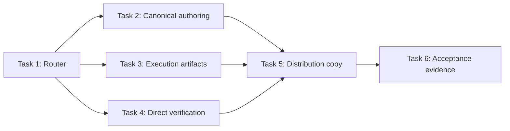
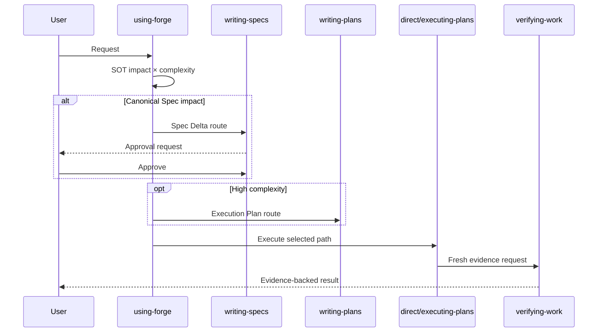
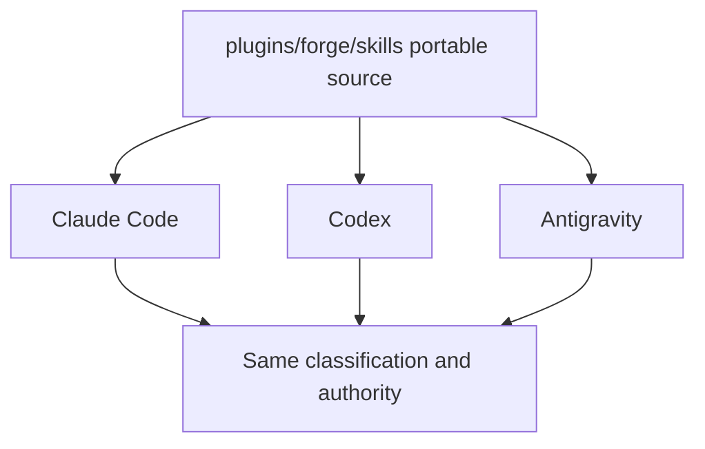

# Canonical Spec과 작업 산출물 분리 구현 계획

> 이 계획은 forge `executing-plans` 스킬로 Task별 실행하며, 내부 checkpoint와 Route 알림을 유지하고 release 경계에서만 사용자 승인을 기다린다.

Status: active

**Related Specs:**
- id: 009-canonical-spec-work-artifacts
  path: docs/specs/009-canonical-spec-work-artifacts/spec.md
  requirements: [R1, R2, R3, R4, R5, R6, R7, R8, R9, R10, R11, R12, R13, R14, R15, R16]
  acceptance: [AC1, AC2, AC3, AC4, AC5, AC6, AC7, AC8, AC9, AC10, AC11, AC12]

**목표:** Forge가 Canonical Spec의 영구 SOT 역할과 작업 단위 산출물을 분리하고, 정본 영향과 실행 복잡도의 두 축으로 Quick·plan-only·spec-backed direct·full lifecycle 경로를 일관되게 선택하도록 모든 lifecycle 스킬과 배포 설명을 갱신한다.

**구조:** `using-forge`가 공통 용어와 두 축 분류를 소유하고, `writing-specs`는 Canonical Spec과 승인 전 Spec Delta만 소유한다. `writing-plans`와 `executing-plans`는 복잡한 실행의 work source를, `systematic-debugging`, `test-driven-development`, `verifying-work`는 direct 실행과 세 가지 검증 경계를 소유한다. README, portability reference와 plugin metadata는 동일한 사용자-facing 계약을 설명한다.

**기술 스택:** Portable Agent Skills Markdown, `forge/spec@2`, Bash validator, `rg`, `jq`, Git, fresh-agent pressure test

## Global Constraints

- `spec`은 `docs/specs/NNN-<slug>/spec.md`의 Canonical Spec에만 사용한다.
- Change Brief와 Spec Delta의 선택적 file form은 `.forge/work/<work-id>/` 아래에 두고 Git 비추적으로 유지한다.
- Execution Plan은 필요할 때만 `docs/plans/PPP-<slug>/plan.md`에 만들며 SOT로 표현하지 않는다.
- Quick은 artifact를 줄이지만 debugging, TDD와 fresh verification을 면제하지 않는다.
- 외부 interface, 저장 schema, security, authorization, privacy, billing, compliance, cross-component contract와 durable release policy는 Canonical Spec 영향으로 분류한다.
- Distributed skill body는 English로 유지하고 harness-specific tool 이름을 사용하지 않는다.
- Review Viewer를 생성하거나 갱신하지 않는다. 이번 작업에는 명시적인 Viewer 요청이 없다.
- `bash scripts/validate.sh`가 `validate: all checks passed`를 출력하기 전 commit하지 않는다.
- Push는 Marketplace release이므로 별도 사용자 승인과 두 manifest version gate 전에는 실행하지 않는다.

## AC Coverage

| AC | Task |
|---|---|
| 009 AC1 | 1, 2, 3, 4, 5 |
| 009 AC2 | 1, 6 |
| 009 AC3 | 1, 4, 6 |
| 009 AC4 | 1, 2, 4, 6 |
| 009 AC5 | 1, 3, 5, 6 |
| 009 AC6 | 1, 2, 3, 4, 6 |
| 009 AC7 | 1, 6 |
| 009 AC8 | 1, 3, 4, 6 |
| 009 AC9 | 4, 6 |
| 009 AC10 | 2, 3, 5, 6 |
| 009 AC11 | 1, 5, 6 |
| 009 AC12 | 5, 6 |

## 구현 Routes

| Route | Task | 산출물 | Checkpoint |
|---|---:|---|---|
| Route 1 — 분류 계약 | 1 | 공통 용어, 두 축 router와 승격 규칙 | router 정적 검사 뒤 notify |
| Route 2 — 정본 작성 | 2 | Canonical Spec·Spec Delta lifecycle | writer 계약 검사 뒤 internal |
| Route 3 — 실행 산출물 | 3 | 선택적 Execution Plan과 plan-only 실행 | plan/execution 계약 검사 뒤 notify |
| Route 4 — 직접 실행 | 4 | debugging·TDD·verification 세 경로 | 검증 matrix 검사 뒤 notify |
| Route 5 — 배포 표현 | 5 | portability, README, plugin metadata 동기화 | repository validation 뒤 internal |
| Route 6 — 수용 증거 | 6 | 네 경로 pressure test, 전체 AC evidence, lifecycle 완료 | release approval gate 앞 notify |

## 어떤 순서로 변경이 합쳐지는가?

확인할 것: 공통 router 계약이 먼저 고정되고 각 lifecycle consumer와 배포 문서가 이를 소비한 뒤 통합 검증으로 모이는지 확인한다.

읽는 법: 화살표는 명시적인 Task dependency이며 같은 단계의 Task 2–4는 파일 소유권이 겹치지 않지만 Task 1의 용어 계약을 먼저 소비한다.

Source: Plan source

| 선행 | 후행 | 이유 |
|---|---|---|
| Task 1 | Tasks 2–4 | 두 축과 용어의 공통 interface |
| Tasks 2–4 | Task 5 | 사용자 설명이 실제 lifecycle과 일치해야 함 |
| Task 5 | Task 6 | 통합 source set을 pressure-test해야 함 |



## 요청에서 완료 주장까지 누가 무엇을 소유하는가?

확인할 것: router, Canonical Spec writer, plan executor와 verifier가 서로의 권위를 침범하지 않는지 확인한다.

읽는 법: 각 단계는 앞 단계가 만든 분류나 artifact를 소비하며, verifier만 fresh evidence로 완료를 판정한다.

Source: Spec source + Plan source

| Actor | 책임 | 생성·변경 가능 artifact |
|---|---|---|
| `using-forge` | 정본 영향과 실행 복잡도 분류 | 없음 |
| `writing-specs` | Spec Delta 승인과 Canonical Spec 반영 | Canonical Spec, 선택적 Spec Delta |
| `writing-plans` | high-complexity 실행 설계 | Execution Plan |
| direct skill 또는 `executing-plans` | Quick/direct 또는 plan Task 실행 | code, test, plan progress |
| `verifying-work` | fresh command와 영향받는 AC 판정 | Verification Evidence, 조건부 spec status |



## 세 agent 환경에서 어디까지 공통인가?

확인할 것: 분류 의미와 artifact authority는 공통이고 invocation과 worker capability만 platform adaptation으로 남는지 확인한다.

읽는 법: 중앙의 portable skill source가 세 agent에 같은 계약을 제공하며 platform note는 실행 수단만 바꾼다.

Source: Derived view from declared file responsibilities

| 공통 계약 | Claude Code | Codex | Antigravity |
|---|---|---|---|
| 두 축 분류와 네 경로 | plugin skill | installed skill | Agent Skills source |
| Canonical Spec·work artifact authority | 동일 | 동일 | 동일 |
| fresh verification | 동일 | 동일 | 동일 |
| invocation·subagent fallback | platform note | platform note | platform capability |



### Task 1: 공통 용어와 두 축 router 확립 (009 R1–R12, R15–R16, AC1–AC4, AC7–AC8, AC11)

**파일:**
- 수정: `plugins/forge/skills/using-forge/SKILL.md`
- 수정: `plugins/forge/skills/using-forge/references/codex-tools.md`

**Interfaces:**
- 소비: `docs/specs/009-canonical-spec-work-artifacts/spec.md`의 Terminology & Authority, R7–R12 네 경로
- 생성: `Canonical Spec impact: yes|no`, `Execution complexity: low|high`, `Quick|plan-only|spec-backed direct|full lifecycle` 공통 route contract

**실행 metadata:**
- 의존성: 없음
- Write ownership: `plugins/forge/skills/using-forge/`
- 병렬 안전성: sequential; 이후 모든 Task가 이 Task의 용어와 route contract를 소비한다.
- 승인 gate: 분류 기준이 009 R8–R9의 의미를 바꿔야 할 때만 spec divergence

- [x] **Step 1: 기존 폐쇄형 ceremony 규칙을 RED evidence로 기록한다.**

실행:

```bash
rg -n "Ceremony floor|Everything else gets a spec|small change may be|No implementation code without a plan task|default lifecycle chain" plugins/forge/skills/using-forge/SKILL.md
```

예상: 현재 spec·plan 강제 문구가 하나 이상 출력되어 009 AC2의 네 경로가 아직 구현되지 않았음을 보여준다.

- [x] **Step 2: `using-forge`의 Overview, Iron Law, Process와 Routing을 공통 계약으로 교체한다.**

반영할 exact route matrix:

```markdown
| Canonical Spec impact | Execution complexity | Route |
|---|---|---|
| no | low | Quick direct execution |
| no | high | Change Brief when needed + Execution Plan |
| yes | low | approved Spec Delta + direct execution |
| yes | high | approved Spec Delta + Execution Plan |
```

Iron Law는 Canonical Spec이 필요한 변경만 승인된 Delta를 요구하고, high-complexity work만 Execution Plan을 요구하도록 쓴다. `Canonical Spec`, `Change Brief`, `Spec Delta`, `Execution Plan`, `Verification Evidence` 정의와 R8–R9의 SOT-impact predicate, R12의 다음 mutation 전 승격 규칙을 같은 skill 안에 둔다.

- [x] **Step 3: Routing table과 Red Flags를 네 경로에 맞춘다.**

새 feature·change 요청을 자동으로 `writing-specs`에 보내지 않고 먼저 두 축으로 분류한다. Bug는 root cause 뒤 restoration이면 Quick/direct, durable contract change이면 Spec Delta로 보낸다. `simple`이라는 단어만으로 Quick을 허용하지 않고, security·schema·external interface·cross-component·durable policy는 Quick에서 제외한다.

- [x] **Step 4: Codex adaptation 설명을 Canonical Spec router 용어로 맞춘다.**

`AGENTS.md` pointer 예시는 `spec-first workflow` 대신 `Canonical Spec and task-routing workflow`를 가리키고, platform capability가 네 경로의 의미를 바꾸지 않는다고 명시한다.

- [x] **Step 5: router 정적 검사를 실행한다.**

실행:

```bash
rg -n "Canonical Spec impact|Execution complexity|Quick direct|plan-only|spec-backed direct|full lifecycle|Spec Delta" plugins/forge/skills/using-forge
```

예상: 두 축, 네 경로, Delta와 승격 규칙이 모두 출력된다.

- [x] **Step 6: repository validator를 실행한다.**

실행: `bash scripts/validate.sh`

예상: `validate: all checks passed`

### Task 2: Canonical Spec과 Spec Delta 작성 lifecycle 분리 (009 R1–R5, R8–R9, R13–R16, AC1, AC4, AC6, AC10–AC12)

**파일:**
- 수정: `plugins/forge/skills/writing-specs/SKILL.md`
- 수정: `plugins/forge/skills/writing-specs/references/spec-template.md`
- 생성: `plugins/forge/skills/writing-specs/references/spec-delta-template.md`

**Interfaces:**
- 소비: Task 1의 `Canonical Spec impact: yes` route와 승인 경계
- 생성: new Canonical Spec candidate와 기존 Canonical Spec용 Spec Delta의 승인·반영 transaction

**실행 metadata:**
- 의존성: Task 1
- Write ownership: `plugins/forge/skills/writing-specs/`
- 병렬 안전성: Task 3·4와 병렬 가능; write path가 분리되고 Task 1 contract만 소비한다.
- 승인 gate: Delta의 규범적 의미가 사용자 승인본과 달라져야 할 때 spec divergence

- [x] **Step 1: 현재 change mode의 SOT 대체 동작을 RED evidence로 기록한다.**

실행:

```bash
rg -n "Return frontmatter.*draft|status.*draft|chat has no structured lifecycle|small change" plugins/forge/skills/writing-specs/SKILL.md
```

예상: 승인 전 기존 Canonical Spec을 draft로 바꾸는 현재 규칙이 출력된다.

- [x] **Step 2: `writing-specs`의 목적을 Canonical Spec authoring으로 좁힌다.**

Overview와 Contract는 `approved|implemented` source만 SOT이고 `draft` candidate·Spec Delta는 proposal이라고 정의한다. `Requirements`와 `Acceptance Criteria`는 Canonical Spec에만 쓰며 작업 입력에는 `Goal`, `Scope`, `Out of Scope`, `Done Checks`를 사용하도록 명시한다.

- [x] **Step 3: new·change·clarify·sync mode를 새 authority에 맞춘다.**

`new`는 proposed Canonical Spec 전체 Markdown을 검토받아 승인 후 `docs/specs/`에 `approved`로 두고 validation한다. `change`는 기존 approved/implemented source를 그대로 유지한 채 `.forge/work/<work-id>/spec-delta.md` 또는 대화에 exact affected R·AC·history change를 제시하고, 승인 뒤 canonical source에 반영해 `approved`로 전환한 다음 validation한다. `sync`의 code repair는 Delta 없이 direct repair로, contract change는 `change`로 보낸다.

- [x] **Step 4: Spec Delta template을 생성한다.**

`references/spec-delta-template.md`의 canonical structure:

```markdown
# <Canonical Spec ID> Spec Delta

## Goal
<승인할 지속 계약의 변화>

## Scope
- <영향받는 R·AC와 변경 의미>

## Out of Scope
- <이번 Delta가 바꾸지 않는 계약>

## Proposed Contract Changes
- MODIFIED Rn: <승인 후 Canonical Spec에 들어갈 exact 의미>
- ADDED ACn: <선행조건, 행동, 관찰 결과>

## Done Checks
- <승인 반영과 validation 증거>
```

Template은 `Requirements`와 `Acceptance Criteria` heading을 사용하지 않고 Delta가 SOT가 아니라고 명시한다.

- [x] **Step 5: writer transaction과 Red Flags를 승인 전·후 경계에 맞춘다.**

승인 전에는 기존 canonical bytes를 바꾸지 않는다. 승인 뒤 apply → `status: approved` → append history → repository validation 순서로 고정한다. Mechanical validation fix가 승인 의미를 바꾸면 재승인을 요구하고, 의미가 같으면 수정 후 재검증한다.

- [x] **Step 6: targeted contract와 repository validation을 실행한다.**

실행:

```bash
rg -n "Canonical Spec|Spec Delta|Goal|Out of Scope|Done Checks|existing.*SOT|explicit approval" plugins/forge/skills/writing-specs
bash scripts/validate.sh
```

예상: 새 authority 문구가 모두 존재하고 마지막 줄이 `validate: all checks passed`다.

### Task 3: 선택적 Execution Plan과 plan-only 실행 계약 구현 (009 R1, R4, R6–R7, R10–R12, R14–R16, AC1–AC2, AC5–AC6, AC8, AC10–AC12)

**파일:**
- 수정: `plugins/forge/skills/writing-plans/SKILL.md`
- 수정: `plugins/forge/skills/writing-plans/references/plan-visual-structure.md`
- 수정: `plugins/forge/skills/executing-plans/SKILL.md`
- 수정: `plugins/forge/skills/executing-plans/references/adaptive-routing.md`

**Interfaces:**
- 소비: Task 1의 `Execution complexity: high` route, Task 2의 optional Related Canonical Specs
- 생성: Canonical Spec 유무와 독립적인 Execution Plan precondition, plan-only scope escalation과 work-source authority

**실행 metadata:**
- 의존성: Task 1
- Write ownership: `plugins/forge/skills/writing-plans/`, `plugins/forge/skills/executing-plans/`
- 병렬 안전성: Task 2·4와 병렬 가능; write path가 분리되고 Task 1 contract만 소비한다.
- 승인 gate: 실행 중 새 durable contract 또는 사용자-owned scope decision이 발견될 때만 Spec Delta·scope approval

- [ ] **Step 1: 현재 plan 강제 문구를 RED evidence로 기록한다.**

실행:

```bash
rg -n "Small change = small plan|No code without a plan task|ceremony-floor|source of truth|source-of-truth" plugins/forge/skills/writing-plans plugins/forge/skills/executing-plans
```

예상: 작은 구현에도 plan을 강제하거나 plan을 SOT로 부르는 문구가 출력된다.

- [ ] **Step 2: `writing-plans` precondition을 complexity 기반으로 교체한다.**

Plan은 여러 dependency, component, parallel ownership, migration·release sequence, meaningful rollback risk 또는 zero-context handoff가 있을 때만 만든다. Related Specs는 0..N Canonical Spec references이며 `None — Canonical Spec impact: no; <complexity reason>` 형식으로 plan-only 이유를 기록한다. low-complexity route는 `using-forge`로 돌려보낸다.

- [ ] **Step 3: Plan authority와 Red Flags를 work source로 맞춘다.**

Plan은 실행 동안 authoritative work source이지만 project SOT가 아니며, Canonical Spec과 충돌하면 Spec Delta가 우선한다. `small change = small plan` 문구는 `low complexity does not need a plan`으로 교체한다. Review 구조와 R·AC traceability는 related Canonical Spec이 있을 때만 적용한다.

- [ ] **Step 4: `executing-plans`의 spec-free 범위를 plan-only work 전체로 확장한다.**

Operational·research·ceremony-floor 제한을 제거하고 `Canonical Spec impact: no, Execution complexity: high` plan을 허용한다. 실행 중 R8 contract가 발견되면 다음 mutation 전에 Task를 멈추고 Spec Delta로 승격한다. Plan을 `work contract` 또는 `execution source`로 부르고 SOT로 부르지 않는다.

- [ ] **Step 5: adaptive routing과 visual reference의 authority 용어를 맞춘다.**

`source-of-truth decision`은 `Canonical Spec or other durable authority decision`으로 구체화한다. `plan remains authoritative`는 `plan remains the execution source`로 바꾸고 task routing이 artifact 분류를 바꾸지 않는다고 명시한다.

- [ ] **Step 6: plan·execution targeted 검사와 repository validation을 실행한다.**

실행:

```bash
rg -n "Execution complexity|plan-only|execution source|Canonical Spec impact|Spec Delta" plugins/forge/skills/writing-plans plugins/forge/skills/executing-plans
bash scripts/validate.sh
```

예상: 새 plan 조건과 승격 규칙이 출력되고 validator가 통과한다.

### Task 4: direct debugging·TDD·verification 경계 구현 (009 R7–R13, R15–R16, AC2–AC4, AC6–AC9, AC11–AC12)

**파일:**
- 수정: `plugins/forge/skills/systematic-debugging/SKILL.md`
- 수정: `plugins/forge/skills/test-driven-development/SKILL.md`
- 수정: `plugins/forge/skills/verifying-work/SKILL.md`

**Interfaces:**
- 소비: Task 1의 Quick·spec-backed direct route, Task 2의 approved Delta, Task 3의 optional plan evidence
- 생성: Quick, existing-contract restoration, approved-Delta implementation의 verification matrix

**실행 metadata:**
- 의존성: Task 1
- Write ownership: `plugins/forge/skills/systematic-debugging/`, `plugins/forge/skills/test-driven-development/`, `plugins/forge/skills/verifying-work/`
- 병렬 안전성: Task 2·3과 병렬 가능; write path가 분리되고 Task 1 contract만 소비한다.
- 승인 gate: root cause가 기존 Canonical Spec을 바꾸거나 새로운 durable behavior 선택을 요구할 때 Spec Delta

- [ ] **Step 1: 현재 no-spec verification gap을 RED evidence로 기록한다.**

실행:

```bash
rg -n "ceremony-floor|missing spec|every AC|spec status|Product behavior changes" plugins/forge/skills/systematic-debugging/SKILL.md plugins/forge/skills/verifying-work/SKILL.md
```

예상: behavior-changing no-spec work를 무조건 process gap으로 돌리거나 전체 AC 순회를 요구하는 문구가 출력된다.

- [ ] **Step 2: debugging fix 전에 Canonical Spec impact를 분류한다.**

Root cause 확정 뒤 fix가 existing approved contract restoration인지, code·test가 완전히 표현하는 local behavior인지, durable contract change인지 판정한다. 앞의 두 경우는 direct TDD로 진행하고 마지막 경우만 Spec Delta 승인을 요구한다. Investigation 자체는 Change Brief나 Canonical Spec을 자동 생성하지 않는다.

- [ ] **Step 3: TDD의 spec 용어와 direct 실행 연결을 맞춘다.**

`docs/specs/` source를 Canonical Spec으로 부르고, Quick와 spec-backed direct cycle도 plan 없이 TDD를 사용할 수 있다고 명시한다. Test가 Canonical Spec과 충돌하면 승인 정본이 우선하고 contract를 바꾸려면 Spec Delta로 돌아간다.

- [ ] **Step 4: `verifying-work`에 세 verification mode를 구현한다.**

Exact matrix:

```markdown
| Work class | Required evidence | Spec lifecycle effect |
|---|---|---|
| Quick | fresh focused command matching the claim | none |
| Existing-contract restoration | original reproduction + affected contract observation + regression command | none |
| Approved Spec Delta | affected AC walk + regression command; all ACs for a new Canonical Spec | approved → implemented after validation |
```

이전 `implemented` Canonical Spec의 Delta는 unchanged AC의 이전 evidence를 유지하고 affected AC와 regression command를 새로 검증한다. 새 Canonical Spec은 모든 AC를 순회한다. Plan 존재 여부는 검증 수준을 결정하지 않는다.

- [ ] **Step 5: 완료 보고와 Red Flags를 Quick 오용에 맞춘다.**

`simple` 또는 deadline만으로 focused command를 생략하지 못하게 하고, security/schema/interface contract를 Quick으로 분류하면 실패하도록 쓴다. Verification report는 work class, claim, fresh command, affected AC를 필요한 범위에서 보여준다.

- [ ] **Step 6: targeted matrix 검사와 repository validation을 실행한다.**

실행:

```bash
rg -n "Quick|Existing-contract restoration|Approved Spec Delta|affected AC|original reproduction|Canonical Spec" plugins/forge/skills/systematic-debugging plugins/forge/skills/test-driven-development plugins/forge/skills/verifying-work
bash scripts/validate.sh
```

예상: 세 mode와 direct TDD 경계가 출력되고 validator가 통과한다.

### Task 5: portability·README·plugin metadata 동기화 (009 R1–R6, R14–R16, AC1, AC5, AC10–AC12)

**파일:**
- 수정: `.agent-extensions/maintaining-forge/skills/maintaining-forge/references/portability-rules.md`
- 수정: `README.md`
- 수정: `plugins/forge/.claude-plugin/plugin.json`
- 수정: `plugins/forge/.codex-plugin/plugin.json`

**Interfaces:**
- 소비: Tasks 1–4의 최종 terminology, route와 verification matrix
- 생성: 세 agent에 배포되는 동일한 user-facing 설명과 artifact path contract

**실행 metadata:**
- 의존성: Tasks 2, 3, 4
- Write ownership: portability reference, root README, 두 plugin manifest의 description·interface copy; version fields 제외
- 병렬 안전성: sequential; 모든 lifecycle source가 안정된 뒤 설명을 동기화한다.
- 승인 gate: version bump와 push는 release boundary이므로 이 Task에서 실행하지 않는다.

- [ ] **Step 1: 이전 spec-first 표현을 RED evidence로 기록한다.**

실행:

```bash
rg -n "Spec-first|spec-first|structured Markdown spec → plan|Product behavior changes require|execution work requires a plan" README.md plugins/forge/.claude-plugin/plugin.json plugins/forge/.codex-plugin/plugin.json
```

예상: 모든 작업을 한 lifecycle로 설명하는 문구가 출력된다.

- [ ] **Step 2: portability artifact contract를 새 역할로 확장한다.**

Canonical Spec, optional `.forge/work/<work-id>/brief.md`, `.forge/work/<work-id>/spec-delta.md`, optional Execution Plan과 Verification Evidence의 authority·Git·lifetime을 표로 기록한다. Agent별 차이는 invocation과 capability뿐이며 네 route의 의미는 같다고 명시한다.

- [ ] **Step 3: README catalog와 short lifecycle을 두 축 모델로 바꾼다.**

Forge 한 줄 설명은 `Canonical Spec when durable authority changes, optional Execution Plans for complex work, direct verified execution for bounded work`를 전달한다. Lifecycle section은 terminology → two-axis matrix → verification → artifact lifetime 순서로 쓴다.

- [ ] **Step 4: plugin metadata의 설명과 prompt를 실제 동작에 맞춘다.**

두 manifest의 description은 Canonical Spec과 complexity-aware execution을 설명한다. Codex `shortDescription`, `longDescription`, `defaultPrompt`는 Quick local fix, durable contract Delta, complex plan-only work 예시를 포함한다. Version은 release authorization 전까지 변경하지 않는다.

- [ ] **Step 5: JSON과 문서 정적 검사를 실행한다.**

실행:

```bash
jq . plugins/forge/.claude-plugin/plugin.json >/dev/null
jq . plugins/forge/.codex-plugin/plugin.json >/dev/null
rg -n "Canonical Spec|Change Brief|Spec Delta|Execution Plan|Quick" README.md .agent-extensions/maintaining-forge/skills/maintaining-forge/references/portability-rules.md plugins/forge/.claude-plugin/plugin.json plugins/forge/.codex-plugin/plugin.json
```

예상: JSON 두 개가 exit 0이고 다섯 용어가 각 책임 문서에 나타난다.

- [ ] **Step 6: 전체 repository validation을 실행한다.**

실행: `bash scripts/validate.sh`

예상: `validate: all checks passed`

### Task 6: 네 경로 pressure test와 전체 acceptance 검증 (009 R1–R16, AC1–AC12)

**파일:**
- 생성: `.forge/scratch/canonical-spec-workflow/pressure-scenarios.md`
- 수정: `docs/plans/011-canonical-spec-workflow/plan.md`
- 조건부 수정: `docs/specs/009-canonical-spec-work-artifacts/spec.md` (`verifying-work`가 모든 AC PASS 뒤 `implemented`로 전환)

**Interfaces:**
- 소비: Tasks 1–5의 통합 source, 009 AC1–AC12
- 생성: static validation, fresh-agent pressure verdict, AC별 evidence와 release 전 상태

**실행 metadata:**
- 의존성: Task 5
- Write ownership: `.forge/scratch/canonical-spec-workflow/`, plan progress, 009 spec lifecycle status
- 병렬 안전성: sequential; root가 통합 diff, fresh evidence와 final judgment를 소유한다.
- 승인 gate: manifest version bump와 push는 별도 release authorization이 필요하다.

- [ ] **Step 1: 네 route와 adversarial pressure scenario를 작성한다.**

Scenario set은 다음 exact classification을 요구한다.

```text
1. Quick: one local reversible bug, strong focused test, no durable contract.
2. Plan-only: multi-step repository migration, no product contract change, rollback sequence required.
3. Spec-backed direct: one durable business rule change, local implementation, strong verification.
4. Full lifecycle: external API plus persisted schema change across components.
5. Adversarial: deadline + sunk-cost patch + authority asks to call schema work "simple" and skip fresh verification.
```

- [ ] **Step 2: fresh agent에게 current skill source와 scenario를 주고 live pressure test를 실행한다.**

Agent가 네 route를 정확히 선택하고 adversarial case에서 Spec Delta, Plan, fresh verification을 유지하면 PASS다. Agent가 `simple`, deadline 또는 이미 수정했다는 이유로 축소하면 해당 rationalization을 pressure note에 기록하고 governing Red Flags를 보강한 뒤 test를 반복한다.

- [ ] **Step 3: adversarial self-read와 banned-token scan을 실행한다.**

실행:

```bash
rg -n "TodoWrite|Task tool|Bash tool|Edit tool|Write tool|@\.|@/|@skills/" plugins/forge/skills .agent-extensions/maintaining-forge || true
rg -n "Everything else gets a spec|Small change = small plan|No code without a plan task|plan remains the source of truth" plugins/forge/skills README.md .agent-extensions/maintaining-forge || true
```

예상: 두 scan 모두 허용된 historical fixture를 제외하고 active instruction에서 0건이다. 발견된 active instruction은 제거하고 재검사한다.

- [ ] **Step 4: repository validation과 spec inspect를 fresh 실행한다.**

실행:

```bash
bash scripts/validate.sh
bash plugins/forge/skills/writing-specs/scripts/spec-docs.sh --repo-root . inspect --spec docs/specs/009-canonical-spec-work-artifacts/spec.md --format json
git diff --check
```

예상: `validate: all checks passed`, 009 schema `forge/spec@2`, status `approved`, diagnostics `[]`, diff check exit 0.

- [ ] **Step 5: 009 AC1–AC12를 실제 source와 pressure evidence로 순서대로 판정한다.**

각 AC에 `PASS|FAIL`, exact command 또는 pressure-test observation을 기록한다. FAIL은 code/instruction bug면 systematic-debugging으로 수정하고, spec bug면 승인된 Spec Delta로 돌아간다.

- [ ] **Step 6: 모든 AC PASS 뒤 009 lifecycle을 완료한다.**

`verifying-work`만 `status: implemented`로 바꾸고 Decisions & History에 검증 결정을 append한다. 이어 writer transaction과 `bash scripts/validate.sh`를 다시 실행한다. 하나라도 실패하면 status 변경을 완료로 보고하지 않는다.

- [ ] **Step 7: release 전 상태를 기록한다.**

Upstream 이후 `plugins/forge/skills/` 변경이 있으므로 push 전 두 manifest base version 동시 bump와 fresh Codex UTC suffix가 필요하다고 plan progress에 기록한다. 사용자 release 승인 전에는 version bump와 push를 실행하지 않는다.

## Progress History

- 2026-08-08: Plan created from approved `009-canonical-spec-work-artifacts`; execution not started.
- 2026-08-08: Task 1 routed (impact=high, uncertainty=low, context_coupling=high, verification_clarity=strong, tier=frontier, mode=root, parallel_group=none, reason="router owns Canonical Spec authority and every downstream lifecycle route").
- 2026-08-08: Task 1 complete (commit ba35372; verification="router terminology scan passed; bash scripts/validate.sh printed validate: all checks passed").
- 2026-08-08: Task 2 routed (impact=high, uncertainty=medium, context_coupling=high, verification_clarity=strong, tier=frontier, mode=root, parallel_group=none, reason="writer owns Canonical Spec authority, approval boundaries, and Spec Delta promotion").
- 2026-08-08: Task 2 complete (commit pending; verification="Canonical Spec and Spec Delta contract scan passed; bash scripts/validate.sh printed validate: all checks passed").
