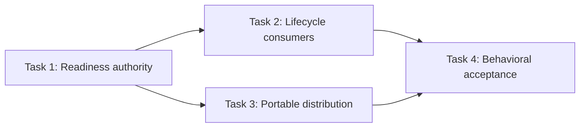
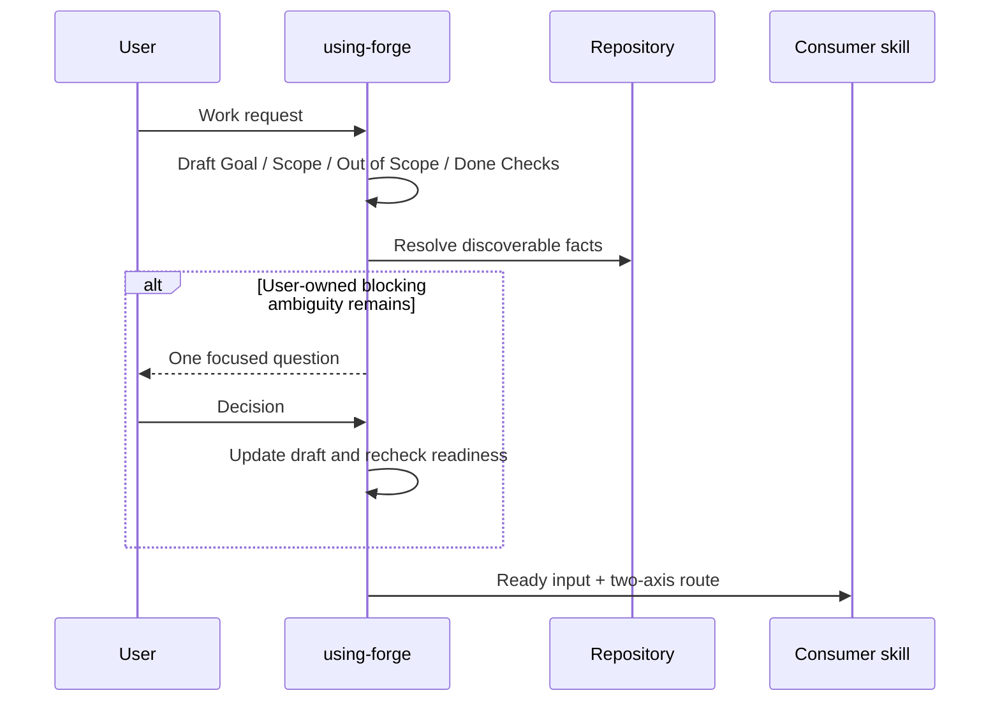
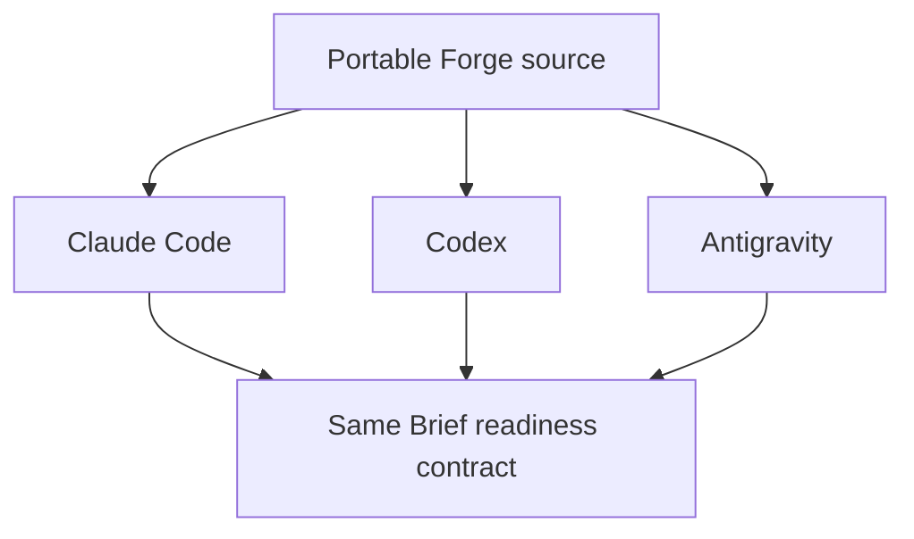

# Change Brief Readiness Gate 구현 계획

> 이 계획은 forge `executing-plans` 스킬로 Task별 실행하며, 각 Route의 internal checkpoint와 notify checkpoint를 기록하고 release 경계에서만 사용자 승인을 기다린다.

Status: active

**Related Specs:**
- id: 009-canonical-spec-work-artifacts
  path: docs/specs/009-canonical-spec-work-artifacts/spec.md
  requirements: [R4, R9, R15, R16, R17]
  acceptance: [AC1, AC3, AC7, AC10, AC11, AC12, AC13]

**목표:** Forge가 Change Brief를 만들거나 실행하기 전에 repository 사실을 먼저 조사하고, 실행 결과를 바꾸는 user-owned blocking ambiguity만 최소 질문으로 해소한 뒤 ready 상태에서 기존 두 축 route로 진행하도록 lifecycle source와 배포 설명을 동기화한다.

**구조:** `using-forge`가 Change Brief Readiness Gate와 세 clarification 경계를 소유한다. 나머지 lifecycle skill은 ready 입력을 소비하며 사용자 소유 결정과 repository 사실을 혼동하지 않는다. README와 portability reference는 같은 portable 계약을 설명하고 fresh-agent pressure test가 질문 과잉과 추정 실행을 함께 막는다.

**기술 스택:** Portable Agent Skills Markdown, `forge/spec@2`, Bash validator, `rg`, `jq`, Git, fresh-agent pressure test

## Global Constraints

- Change Brief는 작업 입력이며 Canonical Spec 또는 프로젝트 SOT가 아니다.
- 명확한 요청은 질문이나 Change Brief 파일 없이 선택된 route로 진행한다.
- Repository에서 확인 가능한 사실과 안전하고 가역적인 구현 기본값을 사용자에게 되묻지 않는다.
- 실행 결과, 범위, 정본 권위, 안전, 파괴적·외부 효과를 바꾸는 user-owned choice만 한 메시지에 하나씩 질문한다.
- `Goal`, `Scope`, `Out of Scope`, 관찰 가능한 `Done Checks`와 두 축 분류가 준비되기 전에는 Plan 또는 mutation으로 진행하지 않는다.
- Brief clarification, Canonical classification, Spec clarification의 목적과 소유 skill을 구분한다.
- Distributed skill body는 English로 유지하고 harness-specific tool 이름을 사용하지 않는다.
- Review Viewer를 생성하거나 갱신하지 않는다. 이번 작업에는 명시적인 Viewer 요청이 없다.
- `bash scripts/validate.sh`가 `validate: all checks passed`를 출력하기 전 commit하지 않는다.
- Push는 Marketplace release이므로 사용자 release 승인과 manifest version gate 전에는 실행하지 않는다.

## AC Coverage

| AC | Task |
|---|---|
| 009 AC1 | 1, 2, 3 |
| 009 AC3 | 1, 2, 4 |
| 009 AC7 | 1, 2, 4 |
| 009 AC10 | 1, 3, 4 |
| 009 AC11 | 2, 3, 4 |
| 009 AC12 | 1, 2, 3, 4 |
| 009 AC13 | 1, 2, 3, 4 |

## 구현 Routes

| Route | Tasks | 산출물 | Checkpoint |
|---|---:|---|---|
| Route 1 — Readiness authority | 1 | router의 초안·조사·질문·ready 계약 | targeted scan 뒤 notify |
| Route 2 — Lifecycle consumers | 2 | spec·plan·debug·verification 경계 동기화 | consumer scan 뒤 notify |
| Route 3 — Portable distribution | 3 | README·portability·adapter parity | repository validation 뒤 notify |
| Route 4 — Behavioral acceptance | 4 | pressure verdict와 affected AC evidence | release gate 앞 notify |

## 어떤 순서로 변경이 합쳐지는가?

확인할 것: router가 readiness 권위를 먼저 제공하고 consumer와 배포 문서가 같은 경계를 소비한 뒤 행동 검증으로 모이는지 확인한다.

읽는 법: Task 2와 Task 3은 Task 1의 용어와 ready predicate를 소비하며 Task 4가 통합 결과를 검증한다.

Source: Plan source

| 선행 | 후행 | 이유 |
|---|---|---|
| Task 1 | Task 2 | consumer가 공통 readiness predicate를 사용해야 함 |
| Task 1 | Task 3 | 배포 설명이 router 계약과 일치해야 함 |
| Tasks 2–3 | Task 4 | pressure test는 전체 source set을 검증해야 함 |

## 요청에서 실행 가능한 입력까지 누가 무엇을 소유하는가?

확인할 것: repository 조사와 세 clarification 유형이 서로의 권위를 침범하지 않는지 확인한다.

읽는 법: router는 실행 입력의 readiness를 판단하고 Canonical writer는 정본 의미만 명확히 하며 downstream skill은 ready 입력을 소비한다.

Source: Spec source + Plan source

| Actor | 책임 | 질문 가능 범위 |
|---|---|---|
| `using-forge` | Brief 초안, repository 조사, readiness 판정 | 실행 결과를 바꾸는 user-owned blocking choice |
| `writing-specs` | Canonical Spec과 Spec Delta 의미 | durable authority의 unresolved choice |
| `writing-plans` | ready 입력을 실행 순서로 변환 | 새 scope·authority가 필요할 때 router로 반환 |
| `executing-plans`·direct skills | 승인된 범위 실행 | 실행 중 발견된 user-owned scope·authority decision |
| `verifying-work` | Done Checks와 fresh evidence 비교 | evidence 부족을 사용자 선호 질문으로 대체하지 않음 |

## 세 agent 환경에서 무엇이 동일해야 하는가?

확인할 것: 질문 UI나 worker capability와 무관하게 readiness 의미가 동일한지 확인한다.

읽는 법: portable source는 세 agent에 같은 조사 우선·최소 질문·ready predicate를 제공하며 platform adapter는 invocation만 바꾼다.

Source: Derived view from declared portability contract

| 공통 계약 | Claude Code | Codex | Antigravity |
|---|---|---|---|
| Repository 사실 우선 조사 | 동일 | 동일 | 동일 |
| 한 메시지당 blocking choice 하나 | 동일 | 동일 | 동일 |
| Clear request의 질문·Brief 생략 | 동일 | 동일 | 동일 |
| Invocation·worker capability | platform adaptation | platform adaptation | platform adaptation |

### Task 1: Router에 Change Brief Readiness authority 구현 (009 R4, R9, R15, R17, AC1, AC3, AC7, AC10, AC12, AC13)

**파일:**
- 수정: `plugins/forge/skills/using-forge/SKILL.md`

**Interfaces:**
- 소비: 009 R4·R9·R17의 조사 우선, 최소 질문과 ready predicate
- 생성: `draft → inspect → ask one blocking choice → update → ready → classify` 공통 contract

**실행 metadata:**
- 의존성: 없음
- Write ownership: `plugins/forge/skills/using-forge/SKILL.md`
- 병렬 안전성: sequential; 모든 consumer와 distribution copy가 이 Task의 exact terminology를 소비한다.
- 승인 gate: approved 009의 질문 조건이나 ready predicate 의미를 바꿔야 할 때만 Spec Delta divergence

- [x] **Step 1: 현재 source에 일반 Brief readiness가 없다는 RED evidence를 기록한다.**

실행: `rg -n "Change Brief Readiness|repository-discoverable|user-owned blocking|Brief clarification|ready criteria" plugins/forge/skills/using-forge/SKILL.md`

예상: exit 1 또는 정의·절차를 모두 충족하지 못하는 부분 결과가 나온다.

- [x] **Step 2: Terminology 다음에 `Change Brief Readiness` section을 추가한다.**

Section은 `Normalize request → inspect repository → ask one blocking user-owned choice → update draft → check ready → classify` 순서를 exact behavior로 가진다. Ready 조건은 one-sentence Goal, 충돌하지 않는 Scope와 Out of Scope, 관찰 가능한 Done Checks, 판정 가능한 두 routing axes다. `brief.md`는 재개·위임·범위 조정·명시적 검토에만 저장한다.

- [x] **Step 3: 세 clarification 유형과 Red Flags를 추가한다.**

Brief clarification은 이번 작업의 결과, Canonical classification은 정본 보존 여부, Spec clarification은 정본 계약의 의미를 묻는다. Repository stack을 되묻기, 가역적 구현 선호를 승인 요청으로 바꾸기, user-owned outcome을 agent가 채우기, Brief 파일 존재를 readiness로 오인하기를 각각 막는다.

- [x] **Step 4: Process를 readiness gate에 연결한다.**

`Classify before mutating` 전에 draft와 repository inspection을 두고, ready하지 않으면 Plan·mutation을 차단한다. 질문은 현재 메시지의 최고 영향 blocking choice 하나만 포함한다.

- [x] **Step 5: Targeted scan과 repository validation을 실행한다.**

실행: `rg -n "Change Brief Readiness|repository|user-owned|Goal|Out of Scope|Done Checks|Brief clarification|Canonical classification|Spec clarification|one.*question" plugins/forge/skills/using-forge/SKILL.md && bash scripts/validate.sh`

예상: readiness 순서와 세 경계가 출력되고 마지막 줄이 `validate: all checks passed`다.

### Task 2: Lifecycle consumer의 clarification 경계 동기화 (009 R4, R9, R15, R17, AC1, AC3, AC7, AC11, AC12, AC13)

**파일:**
- 수정: `plugins/forge/skills/writing-specs/SKILL.md`
- 수정: `plugins/forge/skills/writing-plans/SKILL.md`
- 수정: `plugins/forge/skills/executing-plans/SKILL.md`
- 수정: `plugins/forge/skills/systematic-debugging/SKILL.md`
- 수정: `plugins/forge/skills/verifying-work/SKILL.md`

**Interfaces:**
- 소비: Task 1의 ready work input과 세 clarification 유형
- 생성: 각 consumer가 repository facts, work-scope decision, durable contract choice와 verification gap을 구분하는 handoff

**실행 metadata:**
- 의존성: Task 1
- Write ownership: 위 다섯 lifecycle `SKILL.md`
- 병렬 안전성: root sequential; 용어와 handoff가 서로 맞물린다.
- 승인 gate: 새로운 질문 유형이나 readiness 예외가 필요할 때만 Spec Delta divergence

- [ ] **Step 1: Consumer별 현재 질문·범위 경계를 정적 검사한다.**

실행: `rg -n "clarif|question|unclear|Change Brief|Scope|Done Checks" plugins/forge/skills/writing-specs/SKILL.md plugins/forge/skills/writing-plans/SKILL.md plugins/forge/skills/executing-plans/SKILL.md plugins/forge/skills/systematic-debugging/SKILL.md plugins/forge/skills/verifying-work/SKILL.md`

예상: Canonical clarification과 일부 scope gate는 보이지만 공통 readiness consumer contract는 없다.

- [ ] **Step 2: Authoring consumer 경계를 명확히 한다.**

`writing-specs`는 Brief clarification이 `using-forge` 소유이고 `clarify` mode는 unresolved durable authority만 다룬다고 명시한다. `writing-plans` precondition은 ready Goal·Scope·Out of Scope·Done Checks를 요구하고 repository 사실은 직접 조사하며 user-owned blocking gap은 router로 반환하도록 한다.

- [ ] **Step 3: Execution·debug·verification consumer 경계를 명확히 한다.**

`executing-plans`는 repository fact gap을 조사하고 user-owned scope·outcome gap만 approval boundary로 보낸다. `systematic-debugging`은 reproduction과 repository 조사로 사실을 먼저 확정하고 fix outcome·scope가 user-owned일 때만 Brief clarification으로 돌아간다. `verifying-work`는 ready Brief의 Done Checks를 claim 범위로 소비하되 evidence 부족을 preference question으로 바꾸지 않는다.

- [ ] **Step 4: Consumer targeted scan과 validation을 실행한다.**

실행: `rg -n "Brief clarification|repository|user-owned|ready|Done Checks|durable authority|evidence" plugins/forge/skills/writing-specs/SKILL.md plugins/forge/skills/writing-plans/SKILL.md plugins/forge/skills/executing-plans/SKILL.md plugins/forge/skills/systematic-debugging/SKILL.md plugins/forge/skills/verifying-work/SKILL.md && bash scripts/validate.sh`

예상: 다섯 consumer가 같은 경계를 사용하고 validator가 통과한다.

### Task 3: Portability와 사용자 설명 동기화 (009 R4, R15, R16, R17, AC1, AC10, AC11, AC12, AC13)

**파일:**
- 수정: `README.md`
- 수정: `.agent-extensions/maintaining-forge/skills/maintaining-forge/references/portability-rules.md`
- 갱신: manager-owned adapter state files

**Interfaces:**
- 소비: Tasks 1–2의 readiness와 clarification boundary
- 생성: 세 agent에서 동일한 user-facing contract와 canonical extension parity

**실행 metadata:**
- 의존성: Task 1, Task 2
- Write ownership: README, portability reference, manager-generated adapter state
- 병렬 안전성: sequential; canonical reference 변경 후 manager render가 state를 갱신한다.
- 승인 gate: manifest version bump와 push는 release boundary이므로 이 Task에서 실행하지 않는다.

- [ ] **Step 1: 기존 배포 설명의 readiness gap을 검사한다.**

실행: `rg -n "Change Brief|Quick|Canonical Spec|Execution Plan" README.md .agent-extensions/maintaining-forge/skills/maintaining-forge/references/portability-rules.md`

예상: authority와 route는 존재하지만 readiness 순서와 질문 경계는 없다.

- [ ] **Step 2: README와 portability reference를 동기화한다.**

두 source에 `draft in conversation → inspect repository → ask one user-owned blocking choice only when needed → ready → route`를 추가한다. Clear request는 질문·Brief file 없이 진행하며 Brief, Canonical classification과 Spec clarification을 혼동하지 않는다고 명시한다.

- [ ] **Step 3: Canonical extension adapters를 manager로 render·validate한다.**

실행: `python3 plugins/forge/skills/creating-agent-extensions/scripts/manage_extension.py render --extension .agent-extensions/maintaining-forge && python3 plugins/forge/skills/creating-agent-extensions/scripts/manage_extension.py validate --extension .agent-extensions/maintaining-forge`

예상: owned adapter state만 갱신되고 validate가 `"status": "PASS"`를 출력한다.

- [ ] **Step 4: Portability scan과 repository validation을 실행한다.**

실행: `rg -n "repository|user-owned|ready|Brief clarification|Canonical classification|Spec clarification" README.md .agent-extensions/maintaining-forge/skills/maintaining-forge/references/portability-rules.md && bash scripts/validate.sh && git diff --check`

예상: 두 설명이 같은 계약을 사용하고 모든 검사 exit 0이다.

### Task 4: Fresh-agent pressure와 affected acceptance 검증 (009 R4, R9, R15, R16, R17, AC1, AC3, AC7, AC10, AC11, AC12, AC13)

**파일:**
- 생성: `.forge/scratch/change-brief-readiness/pressure-scenarios.md`
- 수정: `docs/plans/012-change-brief-readiness/plan.md`
- 조건부 수정: `docs/specs/009-canonical-spec-work-artifacts/spec.md`

**Interfaces:**
- 소비: Tasks 1–3 통합 source와 approved 009
- 생성: 질문 과잉·추정 실행을 함께 막는 pressure verdict, affected AC evidence와 lifecycle 완료

**실행 metadata:**
- 의존성: Task 2, Task 3
- Write ownership: scratch pressure note, plan progress, 검증 후 009 lifecycle status
- 병렬 안전성: root가 final judgment를 소유하며 fresh agent는 read-only behavioral probe만 수행한다.
- 승인 gate: version bump와 push는 별도 release authorization이 필요하다.

- [ ] **Step 1: 여섯 pressure scenario를 작성한다.**

Scenario는 clear local request, repository-discoverable framework detail, ambiguous desired outcome, 여러 user-owned choices, 별도 Canonical classification, deadline+sunk-cost assumption pressure를 포함한다.

- [ ] **Step 2: Fresh agent live pressure test를 실행한다.**

PASS 조건은 clear·discoverable fixture에 질문하지 않고 ambiguous fixture에는 필요한 질문 하나만 하며, readiness 전 mutation을 막고 세 clarification 유형을 구분하는 것이다. Rationalization이 나오면 exact quote를 scratch note에 기록하고 Red Flag를 보강한 뒤 새 agent로 반복한다.

- [ ] **Step 3: Adversarial self-read와 banned-token scan을 실행한다.**

실행: `rg -n "TodoWrite|Task tool|Bash tool|Edit tool|Write tool|@\.|@/|@skills/" plugins/forge/skills .agent-extensions/maintaining-forge || true`

예상: 허용된 validator literal 또는 historical fixture를 제외한 active instruction에서 0건이다.

- [ ] **Step 4: Repository·writer·manager validation을 fresh 실행한다.**

실행: `bash scripts/validate.sh && bash plugins/forge/skills/writing-specs/scripts/spec-docs.sh --repo-root . inspect --spec docs/specs/009-canonical-spec-work-artifacts/spec.md --format json && python3 plugins/forge/skills/creating-agent-extensions/scripts/manage_extension.py validate --extension .agent-extensions/maintaining-forge && git diff --check`

예상: repository validator와 manager가 PASS하고 spec status가 `approved`, diagnostics가 `[]`, R=17, AC=13이다.

- [ ] **Step 5: Affected AC를 실제 source와 pressure evidence로 판정한다.**

009 AC1, AC3, AC7, AC10, AC11, AC12, AC13 각각에 `PASS|FAIL`, exact command 또는 pressure observation을 기록한다. FAIL이 instruction bug이면 수정·재검증하고 approved meaning이 잘못됐으면 새 Spec Delta로 돌아간다.

- [ ] **Step 6: 모든 affected AC PASS 뒤 lifecycle을 완료한다.**

`verifying-work`로 `status: implemented`를 복원하고 history에 검증 결정을 append한다. Writer transaction, repository validator, manager validate와 `git diff --check`를 다시 실행한다.

- [ ] **Step 7: Release 전 상태와 final checkpoint를 기록한다.**

Outgoing range에 distributed skill 변경이 있으므로 push 전 두 manifest base version bump와 fresh Codex UTC suffix가 필요하다고 기록한다. 사용자 release 승인 전에는 version bump와 push를 실행하지 않는다.

## Progress History

- 2026-08-09: Exact Spec Delta approved by the user and applied to `009-canonical-spec-work-artifacts`; writer validation passed with status `approved`, R=17, AC=13, diagnostics `[]` (commit 60a9116).
- 2026-08-09: Plan created; execution not started.
- 2026-08-09: Task 1 routed (impact=high, uncertainty=low, context_coupling=high, verification_clarity=strong, tier=frontier, mode=root, parallel_group=none, reason="router owns the durable readiness predicate consumed by every downstream lifecycle skill").
- 2026-08-09: Task 1 complete (verification="readiness terminology and boundary scan passed; using-forge is 178 lines; bash scripts/validate.sh printed validate: all checks passed").
