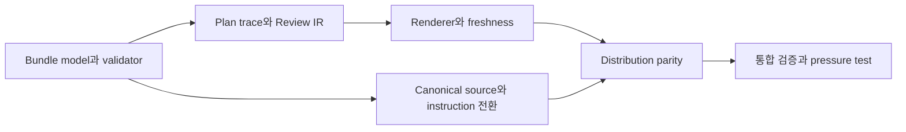

# 의미 기반 Spec Bundle 전환 계획

> 상태: in_progress
> 작성일: 2026-08-09

**Goal:** Forge의 Canonical Spec 작성·검증·계획 추적·Review Viewer·배포 경로를 의미 기반 Spec Bundle과 완전한 문장 추적성으로 통일하고, 현재 트리에는 최신 계약과 fixture만 남긴다.

**Related Specs:**

- bundle: docs/specs/semantic-spec-bundles/
- bundle: docs/specs/review-viewer-lifecycle/
- bundle: docs/specs/canonical-spec-workflow/

## 구현 경로

### Task: Typed bundle model과 repository validation

Governing statements:

- [Canonical Spec은 `docs/specs/<semantic-bundle-name>/`에 저장되는 하나의 Spec Bundle이며, 이 디렉터리와 선언된 Markdown member 전체가 요구사항, 승인 상태, 관계와 변경 이력의 유일한 source of truth여야 한다.](../../specs/semantic-spec-bundles/semantic-spec-bundle-contract.md#canonical-spec은-docsspecssemantic-bundle-name에-저장되는-하나의-spec-bundle이며-이-디렉터리와-선언된-markdown-member-전체가-요구사항-승인-상태-관계와-변경-이력의-유일한-source-of-truth여야-한다)
- [`writing-specs`는 new, change, clarify, sync 모든 mode에서 `forge/spec@3` Spec Bundle을 작성하고 approval request 전에 repository 전체 bundle validation을 실행해야 한다.](../../specs/semantic-spec-bundles/statement-traceability-and-validation.md#writing-specs는-new-change-clarify-sync-모든-mode에서-forgespec3-spec-bundle을-작성하고-approval-request-전에-repository-전체-bundle-validation을-실행해야-한다)

- [x] Bundle root, member, statement, reference와 결정적 bundle hash model을 구현한다.
- [x] 의미 기반 directory·filename, inventory, coverage, relation, symlink·escape와 baseline transition을 검증한다.
- [x] CLI inspect가 bundle path, member path와 완전한 문장을 반환하도록 전환한다.

검증: writing-specs Python suite와 repository migration gate.

### Task: Plan statement trace와 Review semantic IR

Governing statements:

- [plan mode는 plan에 명시된 bundle path, member statement link와 Task·Step 관계만 사용해 Requirement → Acceptance Criterion → Task → Step deep link를 만들고, plan에 없는 cross-source 관계를 추론하지 않아야 한다.](../../specs/review-viewer-lifecycle/plan-context-and-statement-traceability.md#plan-mode는-plan에-명시된-bundle-path-member-statement-link와-taskstep-관계만-사용해-requirement-acceptance-criterion-task-step-deep-link를-만들고-plan에-없는-cross-source-관계를-추론하지-않아야-한다)
- [`inspect` machine output은 `id` 대신 `bundlePath`, `rootPath`, title, metadata, `bundleSha256`, member path·title·role·source SHA-256, statement kind·path·heading·line·reference와 진단을 반환해야 한다. 사람이 읽는 output은 title, path와 full statement를 사용해야 한다.](../../specs/semantic-spec-bundles/statement-traceability-and-validation.md#inspect-machine-output은-id-대신-bundlepath-rootpath-title-metadata-bundlesha256-member-pathtitlerolesource-sha-256-statement-kindpathheadinglinereference와-진단을-반환해야-한다-사람이-읽는-output은-title-path와-full-statement를-사용해야-한다)

- [x] Plan Related Specs를 bundle path 목록으로 파싱한다.
- [x] 각 Task의 Governing statements를 exact member heading link로 검증한다.
- [x] 모든 bundle member와 교차 member Acceptance 관계를 Review IR에 보존한다.

검증: plan parser, Review source, IR, planner focused suite.

### Task: Review Viewer label, manifest와 freshness

Governing statements:

- [Review Viewer는 source별 role, bundle·root·member path, 생성 당시 member·bundle SHA-256, 생성 시각, mode, locale, 집계 수치를 manifest에 기록하고 열람 시점 hash와 비교해 `current`, `stale`, `unverified` freshness를 표시해야 한다. 화면의 주 label은 bundle H1, member H1, path와 full statement이고 hash나 내부 key를 identity label로 사용하지 않아야 한다.](../../specs/review-viewer-lifecycle/source-selection-and-freshness.md#review-viewer는-source별-role-bundlerootmember-path-생성-당시-memberbundle-sha-256-생성-시각-mode-locale-집계-수치를-manifest에-기록하고-열람-시점-hash와-비교해-current-stale-unverified-freshness를-표시해야-한다-화면의-주-label은-bundle-h1-member-h1-path와-full-statement이고-hash나-내부-key를-identity-label로-사용하지-않아야-한다)
- [`spec` mode에서는 현재 valid Spec Bundle 전체를 primary source of truth로 사용하고, 사용자가 지정한 0개 이상의 comparison bundle을 비권위 비교 자료로 읽되 모든 내용에 bundle·member source role과 provenance를 표시해야 한다.](../../specs/review-viewer-lifecycle/source-selection-and-freshness.md#spec-mode에서는-현재-valid-spec-bundle-전체를-primary-source-of-truth로-사용하고-사용자가-지정한-0개-이상의-comparison-bundle을-비권위-비교-자료로-읽되-모든-내용에-bundlemember-source-role과-provenance를-표시해야-한다)

- [ ] Renderer의 visible label을 bundle·member title, path와 완전한 문장으로 바꾼다.
- [ ] Manifest를 bundle과 member source로 분리하고 선언된 member 변경을 stale로 판정한다.
- [ ] Build·browser·freshness runner가 bundle directory 입력만 사용하도록 전환한다.

검증: renderer·freshness Python suite, Node freshness test와 browser runner.

### Task: Canonical source와 lifecycle instruction을 최신 계약으로 정리

Governing statements:

- [Requirement와 Acceptance Criterion은 각각 `Requirements`와 `Acceptance Criteria` 아래 H3의 완전한 문장이어야 하며 `R<number>`, `AC<number>` 또는 별도 author-facing ID를 사용하지 않아야 한다. 각 Acceptance Criterion은 같은 bundle의 Requirement를 member path, heading anchor와 exact link text로 하나 이상 참조해야 하고 모든 활성 Requirement는 하나 이상의 Acceptance Criterion으로 coverage되어야 한다.](../../specs/semantic-spec-bundles/statement-traceability-and-validation.md#requirement와-acceptance-criterion은-각각-requirements와-acceptance-criteria-아래-h3의-완전한-문장이어야-하며-rnumber-acnumber-또는-별도-author-facing-id를-사용하지-않아야-한다-각-acceptance-criterion은-같은-bundle의-requirement를-member-path-heading-anchor와-exact-link-text로-하나-이상-참조해야-하고-모든-활성-requirement는-하나-이상의-acceptance-criterion으로-coverage되어야-한다)
- [`using-forge`, `writing-specs`, `writing-plans`, `executing-plans`, `systematic-debugging`, `verifying-work`와 관련 portability·README 문서는 `Spec Bundle`, `bundle path`, `member path`, `Requirement statement`, `Acceptance statement`, 두 축 분류, Change Brief readiness, Brief clarification·Canonical classification·Spec clarification의 경계, Quick 승격 조건과 검증 경계를 동일하게 사용하고 숫자 ID를 사용자-facing 설명에 사용하지 않아야 한다.](../../specs/canonical-spec-workflow/verification-and-durable-authority.md#using-forge-writing-specs-writing-plans-executing-plans-systematic-debugging-verifying-work와-관련-portabilityreadme-문서는-spec-bundle-bundle-path-member-path-requirement-statement-acceptance-statement-두-축-분류-change-brief-readiness-brief-clarificationcanonical-classificationspec-clarification의-경계-quick-승격-조건과-검증-경계를-동일하게-사용하고-숫자-id를-사용자-facing-설명에-사용하지-않아야-한다)

- [x] 아홉 Canonical Spec을 의미 기반 directory와 설명적인 member filename으로 전환한다.
- [x] Lifecycle skill, template, portability 문서와 README를 bundle·full-statement 용어로 전환한다.
- [x] 이전 parser, 정상 호환 경로, fixture, 실행 계획과 evidence를 현재 트리에서 제거한다.
- [ ] 현재 계획과 검증 evidence에 최신 결과만 남긴다.

검증: spec bundle migration gate, lifecycle static policy와 전역 current-contract audit.

### Task: Distribution parity와 설치 환경 검증

Governing statements:

- [`review-viewer`로 독립된 spec fixture와 plan fixture를 각각 `spec`, `plan` mode, `--locale ko`, 서로 다른 review ID로 build하면 `.forge/reviews/<review-id>/view.html`이 생성되고 tab label이 한국어로 표시되며 `combined` mode 요청은 거부된다.](../../specs/review-viewer-lifecycle/adaptive-presentation-and-navigation.md#review-viewer로-독립된-spec-fixture와-plan-fixture를-각각-spec-plan-mode-locale-ko-서로-다른-review-id로-build하면-forgereviewsreview-idviewhtml이-생성되고-tab-label이-한국어로-표시되며-combined-mode-요청은-거부된다)
- [모든 구현 완료 주장은 fresh command-level verification을 필요로 해야 한다. 승인된 Spec Delta를 구현한 작업은 영향받는 Acceptance statement를 full text와 member path로 식별해 실제 동작으로 검증해야 하며, Quick 작업은 원래 reproduction, focused test, build·lint 중 주장에 맞는 증거만 요구하고 spec status 전환이나 전체 Acceptance 순회를 요구하지 않아야 한다.](../../specs/canonical-spec-workflow/verification-and-durable-authority.md#모든-구현-완료-주장은-fresh-command-level-verification을-필요로-해야-한다-승인된-spec-delta를-구현한-작업은-영향받는-acceptance-statement를-full-text와-member-path로-식별해-실제-동작으로-검증해야-하며-quick-작업은-원래-reproduction-focused-test-buildlint-중-주장에-맞는-증거만-요구하고-spec-status-전환이나-전체-acceptance-순회를-요구하지-않아야-한다)

- [ ] Installer inventory와 CI command를 bundle directory 기준으로 갱신한다.
- [ ] 임시 설치 환경에서 validate, inspect와 Review Viewer source 수집을 검증한다.
- [ ] 전체 repository validation과 pressure scenario를 실행한다.

검증: install parity scripts, `bash scripts/validate.sh`, live pressure checklist.

## Checkpoint

- Candidate Git 이력은 단계별 복구점을 제공한다.
- Production 작업 트리는 최종 검증 전까지 변경하지 않는다.
- Release, push와 Review Viewer HTML 생성은 이 계획의 권한에 포함하지 않는다.

## Progress History

- 2026-08-09: 사용자가 의미 기반 Spec Bundle과 완전한 문장 추적성 변경을 승인했다.
- 2026-08-09: bundle model·validator, plan trace·Review IR과 lifecycle instruction 전환을 완료했다.
- 2026-08-09: Canonical source를 의미 기반 bundle로 전환하고 현재 트리의 이전 parser·fixture·실행 문서를 제거하는 작업을 진행했다.
