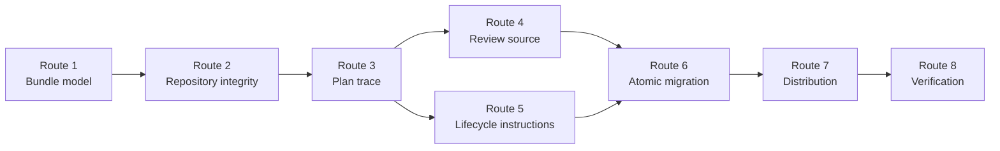
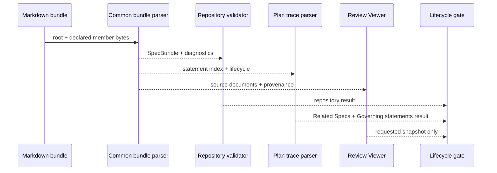
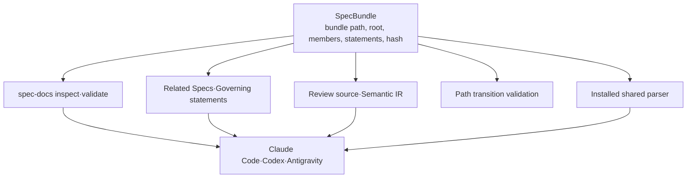

# 의미 기반 Spec Bundle과 문장 추적성 구현 계획

> 이 계획은 forge executing-plans skill로 Task 순서와 checkpoint를 지키며 실행한다. 각 구현 Task는 test-driven-development skill의 RED → GREEN → REFACTOR를 적용하고, release·push는 별도 사용자 승인 전까지 수행하지 않는다.

Status: active

**Related Specs:**
- id: 002-lifecycle-review-viewer
  path: docs/specs/002-lifecycle-review-viewer/spec.md
  requirements: [R1, R5, R11, R12, R15, R16, R22, R23, R26, R29, R30, R31, R34, R35, R36, R37, R38, R39, R40, R53, R72, R77, R79, R91, R92]
  acceptance: [AC5, AC12, AC13, AC18, AC24, AC27, AC34, AC36]
- id: 008-structured-spec-pages
  path: docs/specs/008-structured-spec-pages/spec.md
  requirements: [R1, R2, R3, R4, R5, R6, R7, R8, R9, R10, R11, R12, R13, R14, R15, R20, R23, R30, R31, R32, R34, R35, R36, R37, R38, R39, R48, R49, R50, R51, R52, R53, R54, R55]
  acceptance: [AC1, AC2, AC3, AC7, AC8, AC10, AC11, AC12, AC13, AC14, AC15]
- id: 009-canonical-spec-work-artifacts
  path: docs/specs/009-canonical-spec-work-artifacts/spec.md
  requirements: [R5, R8, R13, R15]
  acceptance: [AC4, AC6, AC9, AC11, AC12]

**목표:** Forge의 Canonical Spec parser, validator, plan trace, Review Viewer와 lifecycle instruction을 `forge/spec@3` Spec Bundle 및 bundle/member path와 완전한 문장 기반 추적성으로 전환하고, 현재 9개 정본을 의미 기반 경로로 원자적으로 migration한다.

**아키텍처:** `writing-specs`의 공통 Python model이 root metadata, member inventory, statement와 deterministic bundle hash를 소유하고 repository validator·plan parser·Review Viewer가 이 typed model만 소비한다. Migration은 계획 commit에서 분리한 registered isolated Git worktree에서 실행하며, v2 source·consumer를 한 candidate commit으로 제거한 뒤 production fingerprint가 유지될 때만 fast-forward한다.

**기술 스택:** Python 3 표준 라이브러리와 `unittest`, Bash validation scripts, Node.js 기반 Mermaid·Review Viewer test, Git worktree, 기존 `spec-docs.sh`와 `build-review-viewer.sh` CLI.

## Global Constraints

- Canonical Spec의 정체성은 별도 `id`가 아니라 normalized repository-relative bundle directory path다.
- Bundle root만 `forge/spec@3` frontmatter를 가지며 모든 Markdown member는 root의 `Documents`에 정확히 한 번 선언한다.
- Directory와 filename은 의미 기반 lowercase kebab-case를 사용하며 숫자 prefix와 범용 filename을 허용하지 않는다.
- Requirement와 Acceptance Criterion은 완전한 H3 문장이고 Acceptance는 member path·anchor·exact link text로 Requirement를 참조한다.
- Internal key와 hash는 충돌 방지·freshness에만 사용하고 source나 사용자-facing identity로 노출하지 않는다.
- `areas`, `components`, `kind`, `subtype`은 metadata 분류이며 filesystem grouping 기준이 아니다.
- 일반 spec·plan lifecycle은 Markdown-only이고 Review Viewer는 이번 작업에서 생성하지 않는다.
- v2 reader·writer와 ID 기반 transition parser는 candidate cutover 뒤 release 산출물에 남기지 않는다.
- `weppy-roblox-mcp-private`는 수정하지 않는다.
- Release version bump, push와 Marketplace 배포는 별도 release 승인 경계다.

## AC Coverage

| AC | Task |
|---|---|
| 002 AC5 | 4 |
| 002 AC12 | 5 |
| 002 AC13 | 3, 6 |
| 002 AC18 | 5 |
| 002 AC24 | 3 |
| 002 AC27 | 5 |
| 002 AC34 | 5 |
| 002 AC36 | 4 |
| 008 AC1 | 1, 7 |
| 008 AC2 | 2 |
| 008 AC3 | 3, 6 |
| 008 AC7 | 6, 7 |
| 008 AC8 | 4, 5 |
| 008 AC10 | 7 |
| 008 AC11 | 7 |
| 008 AC12 | 8 |
| 008 AC13 | 2, 7 |
| 008 AC14 | 2, 7 |
| 008 AC15 | 7, 9 |
| 009 AC4 | 6 |
| 009 AC6 | 3, 9 |
| 009 AC9 | 9 |
| 009 AC11 | 6, 8, 10 |
| 009 AC12 | 9, 10 |

## Implementation Routes

| Route | Task | 산출물 | Checkpoint |
|---|---:|---|---|
| Route 1 — Bundle model | 1 | `forge/spec@3` typed parser와 deterministic hash | internal |
| Route 2 — Repository integrity | 2 | layout·statement·relation·transition validator | internal |
| Route 3 — Plan trace | 3 | bundle-path Related Specs와 Governing statements | notify |
| Route 4 — Review source | 4–5 | multi-file Semantic IR, freshness와 사람 중심 label | notify |
| Route 5 — Lifecycle instructions | 6 | 모든 Forge skill·template·portability 용어 동기화 | internal |
| Route 6 — Atomic migration | 7 | 9개 v3 bundle, plan·link·fixture cutover와 evidence | notify |
| Route 7 — Distribution | 8 | Claude Code·Codex·Antigravity 설치 parity | internal |
| Route 8 — Verification | 9–10 | regression·pressure evidence와 release-ready gate | approval before release only |

## 어떤 순서로 candidate가 완성되는가?

확인할 것: model과 repository gate가 먼저 고정되고 모든 consumer와 source migration이 그 위에서 진행되는지 확인한다.

읽는 법: 왼쪽 Route가 오른쪽 Route의 입력을 제공하며, Task 4와 Task 6만 Task 3 뒤에 독립적으로 진행할 수 있다.

Source: Plan source



## Runtime responsibility

| Actor | 책임 | 실패 소유자 |
|---|---|---|
| `spec_model.py` | root·member bytes를 typed bundle과 statement graph로 parse하고 hash 계산 | parse diagnostic |
| `spec_validate.py` | repository containment, layout, coverage, relation, plan link, baseline transition 검증 | repository diagnostic |
| `spec_docs.py` | CLI path 해석과 stable inspect JSON | CLI exit·JSON contract |
| `review_sources.py`·`review_ir.py` | bundle source set과 plan context를 Semantic IR로 보존 | source collection diagnostic |
| `review_renderer.py` | H1·path·full statement 중심 화면과 freshness manifest 생성 | renderer test |
| lifecycle skills | agent가 ID 대신 path·statement를 쓰도록 authoring·handoff gate 제공 | pressure test |
| migration transaction | old source 제거, target bundle·reference·evidence를 한 candidate commit으로 묶음 | candidate rollback |

## source 입력은 어디서 검증되고 소비되는가?

확인할 것: 한 parser 결과가 validator, plan과 Viewer로 전달되고 각 consumer가 Markdown을 별도로 추론하지 않는지 확인한다.

읽는 법: root와 member bytes가 공통 model을 거쳐 세 consumer로 갈라지고, 모든 진단은 다시 CLI와 실행 gate로 모인다.

Source: Plan source



## 어느 경계가 새 bundle model을 확장하는가?

확인할 것: 새 schema 의미는 공통 model에만 추가되고 CLI·plan·Viewer·installer가 typed output을 소비하는지 확인한다.

읽는 법: 중앙의 `SpecBundle`이 확장점이며 주변 adapter는 자체 ID model을 만들지 않는다.

Source: Plan source



## Checkpoint boundaries

- Internal checkpoint: 각 RED → GREEN cycle과 focused test 통과 뒤 plan checkbox와 commit을 기록한다.
- Notify checkpoint: Task 3, Task 5, Task 7 완료 뒤 source format·Viewer·migration 결과와 다음 Route를 사용자에게 알리되 대기하지 않는다.
- Approval checkpoint: candidate 검증과 pressure test 완료 뒤 version bump·push·Marketplace release를 시작하기 전에만 사용자 승인을 요청한다.
- Spec divergence: 승인된 bundle/member/statement 계약과 다른 의미가 필요하면 다음 mutation 전에 중단하고 Spec Delta로 돌아간다.
- Rollback: candidate 작업이 실패하면 registered worktree와 candidate branch만 폐기하고 production root의 기록된 fingerprint가 그대로인지 증명한다.

### Task 1: Spec Bundle typed model과 deterministic hash (008 R1–R9, R15, R48–R55, AC1)

**파일:**
- 수정: `plugins/forge/skills/writing-specs/scripts/spec_model.py`
- 생성: `plugins/forge/skills/writing-specs/tests/fixtures/spec-bundle/valid-multi-file/semantic-spec-bundle-contract.md`
- 생성: `plugins/forge/skills/writing-specs/tests/fixtures/spec-bundle/valid-multi-file/authoring-and-file-organization.md`
- 생성: `plugins/forge/skills/writing-specs/tests/test_spec_bundle_model.py`

**Interfaces:**
- 소비: repository root와 `docs/specs/<semantic-bundle-name>/` directory path
- 생성: `SpecBundle`, `SpecMember`, `SpecStatement`, `StatementReference`, `load_spec_bundle(path: Path, root: Path)`, `bundle_sha256(bundle_path: Path, members: tuple[SpecMember, ...])`

**실행 metadata:**
- 의존성: 없음
- Write ownership: `plugins/forge/skills/writing-specs/scripts/spec_model.py`, 새 bundle fixture와 model test
- 병렬 안전성: sequential; 이후 모든 consumer interface를 고정한다.
- Approval gate: 없음

- [x] **Step 1: 새 public model과 multi-file parse expectation을 검증하는 failing test를 작성한다.**

```python
import unittest
from pathlib import Path
import spec_model

class SpecBundleModelTest(unittest.TestCase):
    def test_loads_root_members_statements_and_deterministic_hash(self) -> None:
        fixture = Path(__file__).parent / "fixtures/spec-bundle/valid-multi-file"
        loader = getattr(spec_model, "load_spec_bundle", None)
        self.assertIsNotNone(loader, "load_spec_bundle must exist")
        bundle, diagnostics = loader(fixture, fixture.parents[2])
        self.assertEqual(diagnostics, ())
        self.assertEqual(bundle.metadata.schema, "forge/spec@3")
        self.assertEqual(bundle.path.as_posix(), "fixtures/spec-bundle/valid-multi-file")
        self.assertEqual([member.role for member in bundle.members], ["root", "contract"])
        self.assertEqual([statement.kind for statement in bundle.statements], ["requirement", "acceptance"])
        self.assertRegex(bundle.bundle_sha256, r"^[0-9a-f]{64}$")
```

- [x] **Step 2: focused test를 실행해 `load_spec_bundle must exist` assertion failure를 확인한다.**

실행: `PYTHONDONTWRITEBYTECODE=1 PYTHONPATH=plugins/forge/skills/writing-specs/scripts python3 -m unittest plugins/forge/skills/writing-specs/tests/test_spec_bundle_model.py -v`

예상: `FAIL`이고 message에 `load_spec_bundle must exist`가 포함된다.

- [x] **Step 3: frozen dataclass와 parser를 구현한다.**

```python
@dataclass(frozen=True)
class SpecStatement:
    kind: str
    heading: str
    member_path: Path
    line: int
    references: tuple["StatementReference", ...] = ()

@dataclass(frozen=True)
class SpecBundle:
    path: Path
    root_path: Path
    metadata: SpecMetadata
    title: str
    members: tuple[SpecMember, ...]
    statements: tuple[SpecStatement, ...]
    bundle_sha256: str
```

`load_spec_bundle`은 root frontmatter, `Documents` 목록, member H1, Requirements·Acceptance Criteria H3, `검증하는 요구사항:`·`Verifies:` link와 Mermaid를 원문 line과 함께 보존한다. Hash input은 normalized bundle path와 lexicographically 정렬한 member path·byte length·exact bytes를 length-prefix로 encode한 bytes다.

- [x] **Step 4: focused model suite와 기존 parser suite를 실행해 PASS를 확인한다.**

실행: `PYTHONDONTWRITEBYTECODE=1 PYTHONPATH=plugins/forge/skills/writing-specs/scripts python3 -m unittest plugins/forge/skills/writing-specs/tests/test_spec_bundle_model.py plugins/forge/skills/writing-specs/tests/test_spec_model.py -v`

예상: 모든 test `OK`, warning과 traceback 0개.

- [x] **Step 5: model 변경을 commit한다.**

실행: `git add plugins/forge/skills/writing-specs/scripts/spec_model.py plugins/forge/skills/writing-specs/tests/fixtures/spec-bundle plugins/forge/skills/writing-specs/tests/test_spec_bundle_model.py && git commit -m "feat(forge): add semantic spec bundle model"`

### Task 2: Bundle repository·statement·transition validation (008 R7, R10–R15, R35–R39, R48–R54, AC2, AC13–AC15)

**파일:**
- 수정: `plugins/forge/skills/writing-specs/scripts/spec_validate.py`
- 수정: `plugins/forge/skills/writing-specs/scripts/spec_transitions.py`
- 수정: `plugins/forge/skills/writing-specs/scripts/spec_docs.py`
- 수정: `plugins/forge/skills/writing-specs/scripts/spec-docs.sh`
- 생성: `plugins/forge/skills/writing-specs/tests/fixtures/spec-bundle/invalid-*`
- 수정: `plugins/forge/skills/writing-specs/tests/test_spec_validate.py`
- 수정: `plugins/forge/skills/writing-specs/tests/test_spec_transitions.py`
- 수정: `plugins/forge/skills/writing-specs/tests/test_spec_docs_cli.py`

**Interfaces:**
- 소비: Task 1의 `SpecBundle`, baseline Git bytes, `.bundle-transitions.json`
- 생성: `validate_repository(repo_root, spec_root, baseline_ref)`, `load_transition_manifest`, stable inspect JSON의 `bundlePath`·`rootPath`·`bundleSha256`·`members`·`statements`

**실행 metadata:**
- 의존성: Task 1
- Write ownership: writing-specs validator·CLI·transition modules와 tests
- 병렬 안전성: sequential; plan과 Viewer가 stable diagnostics·inspect schema를 소비한다.
- Approval gate: 없음

- [x] **Step 1: invalid matrix와 inspect JSON의 failing tests를 추가한다.**

```python
def test_bundle_layout_statement_and_path_transition_matrix(self) -> None:
    result = validate_repository(self.repo, self.repo / "docs/specs")
    codes = {diagnostic.code for diagnostic in result.diagnostics}
    self.assertEqual(codes, {
        "BUNDLE_ROOT_COUNT",
        "BUNDLE_MEMBER_UNDECLARED",
        "BUNDLE_FILENAME_GENERIC",
        "STATEMENT_DUPLICATE",
        "STATEMENT_REFERENCE_TEXT",
        "STATEMENT_COVERAGE",
        "TRANSITION_TARGET_BUNDLE",
    })
```

- [x] **Step 2: focused validation test를 실행해 기존 `spec.md` discovery 때문에 expected code set과 다른 assertion failure를 확인한다.**

실행: `PYTHONDONTWRITEBYTECODE=1 PYTHONPATH=plugins/forge/skills/writing-specs/scripts python3 -m unittest plugins/forge/skills/writing-specs/tests/test_spec_validate.py plugins/forge/skills/writing-specs/tests/test_spec_transitions.py plugins/forge/skills/writing-specs/tests/test_spec_docs_cli.py -v`

예상: 새 bundle matrix test가 `FAIL`; 기존 test는 implementation 전 baseline 결과를 유지한다.

- [x] **Step 3: bundle discovery, containment, statement coverage, relation, hash와 path transition validation을 구현한다.**

`validate_repository`는 `docs/specs/`의 direct child directory를 lexical order로 순회하고 각 directory에서 `role: root`가 있는 Markdown을 정확히 하나 찾는다. `.bundle-transitions.json`은 `fromSourcePath`, `fromSourceSha256`, `disposition`, `toBundlePath`, `evidencePath`, `reason`만 받으며 v2 transition field를 거부한다. Diagnostics는 `(bundle path, member path, line, code)` 순서로 정렬한다.

- [x] **Step 4: CLI inspect와 repository suite를 실행해 PASS를 확인한다.**

실행: `PYTHONDONTWRITEBYTECODE=1 PYTHONPATH=plugins/forge/skills/writing-specs/scripts python3 -m unittest discover -s plugins/forge/skills/writing-specs/tests -p 'test_*.py' -v`

예상: 모든 Python test `OK`; inspect JSON에 `id`가 없고 exact key order가 유지된다.

- [x] **Step 5: validator 변경을 commit한다.**

실행: `git add plugins/forge/skills/writing-specs/scripts plugins/forge/skills/writing-specs/tests && git commit -m "feat(forge): validate semantic spec bundles"`

### Task 3: Plan Related Specs와 Governing statements (002 R26, R34, R40, R53, R72, AC13, AC24 · 008 R14, R54, AC3 · 009 R5, R13, AC6)

**파일:**
- 수정: `plugins/forge/skills/writing-specs/scripts/spec_validate.py`
- 수정: `plugins/forge/skills/review-viewer/scripts/review_sources.py`
- 수정: `plugins/forge/skills/writing-specs/tests/test_spec_validate.py`
- 수정: `plugins/forge/skills/review-viewer/tests/test_review_sources.py`
- 생성: `plugins/forge/skills/writing-specs/tests/fixtures/plan-bundle-repository/`

**Interfaces:**
- 소비: `Related Specs`의 `bundle:` entry와 Task의 Markdown statement link
- 생성: `PlanBundleRef(bundle_path: Path)`, `PlanStatementRef(kind, bundle_path, member_path, heading, anchor)`, Task별 explicit mapping

**실행 metadata:**
- 의존성: Task 2
- Write ownership: plan parser·validator와 plan source collection tests
- 병렬 안전성: sequential; Review Viewer가 Task trace model을 소비한다.
- Approval gate: 없음

- [ ] **Step 1: ID 배열이 없는 valid plan과 dangling statement의 failing test를 작성한다.**

```python
def test_related_bundles_and_governing_statements_resolve_exact_headings(self) -> None:
    refs, diagnostics = parse_plan_related_specs(self.plan, self.repo, self.index)
    self.assertEqual(diagnostics, ())
    self.assertEqual([ref.bundle_path.as_posix() for ref in refs], ["docs/specs/semantic-spec-bundles"])
    task_refs = parse_plan_governing_statements(self.plan, self.repo, refs, self.index)
    self.assertEqual(task_refs[0].heading, "각 bundle에는 root 문서가 정확히 하나 있어야 한다")
```

- [ ] **Step 2: focused tests를 실행해 old `id/path/requirements/acceptance` parser의 format diagnostic으로 assertion failure를 확인한다.**

실행: `PYTHONDONTWRITEBYTECODE=1 PYTHONPATH=plugins/forge/skills/writing-specs/scripts:plugins/forge/skills/review-viewer/scripts python3 -m unittest plugins/forge/skills/writing-specs/tests/test_spec_validate.py plugins/forge/skills/review-viewer/tests/test_review_sources.py -v`

예상: 새 canonical bundle block test가 `FAIL`; message에 current `PLAN_SPEC_FORMAT` 또는 expected bundle path mismatch가 나타난다.

- [ ] **Step 3: Related Specs와 Governing statements parser를 구현한다.**

`parse_plan_related_specs`는 exact `- bundle: docs/specs/<semantic-name>/` entry 또는 기존 `None — Canonical Spec impact: no; <reason>`만 받고 duplicate·escape·unknown·draft bundle을 거부한다. `parse_plan_governing_statements`는 각 governed Task의 link가 Related Specs bundle에 속하고 target statement kind·heading·anchor·link text가 정확히 일치하는지 검사한다.

- [ ] **Step 4: plan validation과 Review source focused suite를 실행해 PASS를 확인한다.**

실행: `PYTHONDONTWRITEBYTECODE=1 PYTHONPATH=plugins/forge/skills/writing-specs/scripts:plugins/forge/skills/review-viewer/scripts python3 -m unittest plugins/forge/skills/writing-specs/tests/test_spec_validate.py plugins/forge/skills/review-viewer/tests/test_review_sources.py -v`

예상: 모든 test `OK`, ID array plan fixture는 legacy-format diagnostic으로 실패한다.

- [ ] **Step 5: plan trace 변경을 commit하고 notify checkpoint를 기록한다.**

실행: `git add plugins/forge/skills/writing-specs plugins/forge/skills/review-viewer/scripts/review_sources.py plugins/forge/skills/review-viewer/tests/test_review_sources.py && git commit -m "feat(forge): trace plans to spec statements"`

### Task 4: Multi-file Review source와 Semantic IR (002 R1, R15–R16, R22–R23, R26, R29–R31, R34–R40, R91–R92, AC5, AC36 · 008 R23, AC8)

**파일:**
- 수정: `plugins/forge/skills/review-viewer/scripts/review_sources.py`
- 수정: `plugins/forge/skills/review-viewer/scripts/review_ir.py`
- 수정: `plugins/forge/skills/review-viewer/scripts/review_components.py`
- 수정: `plugins/forge/skills/review-viewer/tests/test_review_sources.py`
- 수정: `plugins/forge/skills/review-viewer/tests/test_review_ir.py`
- 수정: `plugins/forge/skills/review-viewer/tests/fixtures/repository/`

**Interfaces:**
- 소비: `SpecBundle`, `PlanBundleRef`, `PlanStatementRef`
- 생성: member별 `ReviewSource`, bundle별 `ReviewBundle`, bundle/member-qualified `SemanticEntity`와 `SemanticRelation`

**실행 metadata:**
- 의존성: Task 3
- Write ownership: Review source·IR modules, tests와 fixtures
- 병렬 안전성: Task 6과 병렬 가능하지만 현재 session은 sequential fallback을 사용한다.
- Approval gate: 없음

- [ ] **Step 1: five-member source collection과 content coverage failing test를 작성한다.**

```python
def test_spec_bundle_members_enter_ir_once_with_statement_relations(self) -> None:
    bundle = collect_spec_sources(self.spec_bundle, (), self.repo)
    self.assertEqual(len(bundle.sources), 5)
    ir = build_semantic_ir(bundle)
    self.assertEqual(ir.coverage.ratio, 1.0)
    self.assertEqual({entity.kind for entity in ir.entities}, {"requirement", "acceptance", "decision"})
    self.assertTrue(all(entity.source_path.endswith(".md") for entity in ir.entities))
```

- [ ] **Step 2: focused source·IR test를 실행해 directory source를 읽지 못하는 assertion failure를 확인한다.**

실행: `PYTHONDONTWRITEBYTECODE=1 PYTHONPATH=plugins/forge/skills/writing-specs/scripts:plugins/forge/skills/review-viewer/scripts python3 -m unittest plugins/forge/skills/review-viewer/tests/test_review_sources.py plugins/forge/skills/review-viewer/tests/test_review_ir.py -v`

예상: 새 test가 `FAIL`; `bundle.sources` count 또는 source path assertion이 old single-file model과 다르다.

- [ ] **Step 3: bundle/member source model과 statement relation을 구현한다.**

각 member는 exact bytes, H1, role, relative path, source SHA-256과 shared bundle SHA-256을 보존한다. IR entity identity는 내부에서 bundle path·member path·kind·heading으로 계산하고 provenance에는 human-readable H1·path·line을 유지한다. Acceptance relation은 source link가 명시한 Requirement만 연결한다.

- [ ] **Step 4: Review source·IR suite를 실행해 PASS를 확인한다.**

실행: `PYTHONDONTWRITEBYTECODE=1 PYTHONPATH=plugins/forge/skills/writing-specs/scripts:plugins/forge/skills/review-viewer/scripts python3 -m unittest plugins/forge/skills/review-viewer/tests/test_review_sources.py plugins/forge/skills/review-viewer/tests/test_review_ir.py plugins/forge/skills/review-viewer/tests/test_review_planner.py -v`

예상: 모든 test `OK`, source content coverage 100%.

- [ ] **Step 5: Review source model을 commit한다.**

실행: `git add plugins/forge/skills/review-viewer/scripts plugins/forge/skills/review-viewer/tests && git commit -m "feat(forge): load spec bundles into review ir"`

### Task 5: Review Viewer label, freshness와 interaction namespace (002 R5, R11–R12, R35–R39, R77, R79, AC12, AC18, AC27, AC34 · 008 R23, AC8)

**파일:**
- 수정: `plugins/forge/skills/review-viewer/scripts/review_renderer.py`
- 수정: `plugins/forge/skills/review-viewer/scripts/build_review_viewer.py`
- 수정: `plugins/forge/skills/review-viewer/scripts/review_freshness.py`
- 수정: `plugins/forge/skills/review-viewer/scripts/review_components.py`
- 수정: `plugins/forge/skills/review-viewer/assets/viewer-template.html`
- 수정: `plugins/forge/skills/review-viewer/assets/viewer-freshness.mjs`
- 수정: `plugins/forge/skills/review-viewer/tests/test_review_renderer.py`
- 수정: `plugins/forge/skills/review-viewer/tests/test-viewer-freshness.mjs`
- 수정: `plugins/forge/skills/review-viewer/tests/browser/review-viewer.spec.mjs`
- 수정: `plugins/forge/skills/review-viewer/tests/test-build-review-viewer.sh`
- 수정: `plugins/forge/skills/review-viewer/tests/run-review-viewer-browser.sh`

**Interfaces:**
- 소비: Task 4의 bundle/member Review sources와 Semantic IR
- 생성: H1·path·full statement label, member·bundle freshness manifest, collision-free DOM·localStorage key

**실행 metadata:**
- 의존성: Task 4
- Write ownership: Review renderer·template·build CLI와 UI tests
- 병렬 안전성: sequential; source model이 stable해야 한다.
- Approval gate: 없음

- [ ] **Step 1: 같은 statement를 가진 두 bundle의 label·deep-link·freshness failing test를 작성한다.**

```python
def test_renderer_uses_titles_paths_and_statements_without_ids(self) -> None:
    html = render_review(self.bundle, self.plan, locale="ko", review_id="semantic-bundle", offline=True)
    self.assertIn("문장 추적성과 검증", html)
    self.assertIn("statement-traceability-and-validation.md", html)
    self.assertIn("각 bundle에는 root 문서가 정확히 하나 있어야 한다", html)
    self.assertNotIn("008 R1", html)
    self.assertNotIn("AC1", html)
```

- [ ] **Step 2: focused renderer test를 실행해 old R·AC label이 남는 assertion failure를 확인한다.**

실행: `PYTHONDONTWRITEBYTECODE=1 PYTHONPATH=plugins/forge/skills/writing-specs/scripts:plugins/forge/skills/review-viewer/scripts python3 -m unittest plugins/forge/skills/review-viewer/tests/test_review_renderer.py -v`

예상: 새 `assertNotIn` 또는 expected title assertion이 `FAIL`한다.

- [ ] **Step 3: manifest, renderer와 browser matching을 path·statement model로 교체한다.**

Manifest는 bundle source와 member source를 분리해 hashes를 기록한다. Visible provenance는 bundle H1, member H1, repository path와 full statement를 사용한다. DOM·localStorage key는 SHA-256이 아니라 deterministic internal slug/hash를 사용할 수 있지만 HTML visible text와 accessibility label에는 넣지 않는다. File picker는 manifest의 member relative path로 선택 파일을 matching한다.

- [ ] **Step 4: Python·Node·browser focused suite를 실행해 PASS를 확인한다.**

실행: `PYTHONDONTWRITEBYTECODE=1 PYTHONPATH=plugins/forge/skills/writing-specs/scripts:plugins/forge/skills/review-viewer/scripts python3 -m unittest plugins/forge/skills/review-viewer/tests/test_review_renderer.py -v && node --test plugins/forge/skills/review-viewer/tests/test-viewer-freshness.mjs`

예상: 모든 test PASS, same-statement bundle deep link와 checkbox state가 충돌하지 않는다.

- [ ] **Step 5: Review UI source contract를 commit하고 notify checkpoint를 기록한다.**

실행: `git add plugins/forge/skills/review-viewer && git commit -m "feat(forge): render human-readable spec statement traces"`

### Task 6: Forge lifecycle skill과 authoring template 동기화 (002 R53, R72, AC13 · 008 R10, R14, R20, R30, R34, AC3, AC7, AC12 · 009 R5, R8, R13, R15, AC4, AC11–AC12)

**파일:**
- 수정: `plugins/forge/skills/using-forge/SKILL.md`
- 수정: `plugins/forge/skills/writing-specs/SKILL.md`
- 수정: `plugins/forge/skills/writing-specs/references/spec-template.md`
- 수정: `plugins/forge/skills/writing-specs/references/spec-delta-template.md`
- 수정: `plugins/forge/skills/writing-plans/SKILL.md`
- 수정: `plugins/forge/skills/writing-plans/references/plan-visual-structure.md`
- 수정: `plugins/forge/skills/executing-plans/SKILL.md`
- 수정: `plugins/forge/skills/verifying-work/SKILL.md`
- 수정: `plugins/forge/skills/review-viewer/SKILL.md`
- 수정: `plugins/forge/skills/review-viewer/references/rendering-contract.md`
- 수정: `plugins/forge/skills/test-driven-development/SKILL.md`
- 수정: `plugins/forge/skills/executing-plans/references/adaptive-routing.md`
- 수정: `.agent-extensions/maintaining-forge/skills/maintaining-forge/SKILL.md`
- 수정: `.agent-extensions/maintaining-forge/skills/maintaining-forge/references/portability-rules.md`
- 수정: `README.md`, plugin manifest·marketplace copy와 관련 `scripts/tests/test-forge-*.sh`

**Interfaces:**
- 소비: approved bundle path·statement contract와 Task 3 plan grammar
- 생성: 세 harness에서 같은 authoring, approval, plan, execution, verification, Viewer gate를 선택하는 portable instructions

**실행 metadata:**
- 의존성: Task 3
- Write ownership: distributed Forge skill prose, repository maintainer source, README와 static policy tests
- 병렬 안전성: Task 4와 병렬 가능하지만 현재 session은 sequential fallback을 사용한다.
- Approval gate: 없음

- [x] **Step 1: active instruction에서 legacy ID 문법을 거부하는 static failing test를 작성한다.**

```bash
legacy_count="$(rg -l 'docs/specs/NNN-|spec ID|R·AC ID|<spec-id>:R|requirements: \[R|acceptance: \[AC' \
  plugins/forge/skills .agent-extensions/maintaining-forge README.md README.ko.md | wc -l | tr -d ' ')"
[[ "$legacy_count" == "0" ]] || fail "active Forge instructions still contain legacy spec trace syntax: $legacy_count files"
grep -q 'docs/specs/<semantic-bundle-name>/' plugins/forge/skills/writing-specs/SKILL.md || fail "bundle path contract missing"
grep -q 'Governing statements' plugins/forge/skills/writing-plans/SKILL.md || fail "statement trace contract missing"
```

- [x] **Step 2: static policy test를 실행해 legacy instruction inventory 때문에 FAIL을 확인한다.**

실행: `bash scripts/tests/test-forge-spec-docs-policy.sh && bash scripts/tests/test-forge-lifecycle-policy.sh`

예상: non-zero exit와 legacy path 또는 trace contract message.

- [x] **Step 3: skill·template·portability·README를 v3 용어와 exact workflow로 변경한다.**

`writing-specs`는 root/member authoring, splitting gate와 path-based Delta를 소유한다. `writing-plans`는 Related Specs bundle path와 Task Governing statements를 소유한다. `executing-plans`와 `verifying-work`는 inspect의 bundle status·statement를 사용한다. `review-viewer`는 bundle directory input을 사용한다. Distributed skill은 harness-specific tool 이름 없이 500줄 이하를 유지한다.

- [x] **Step 4: static policy와 manager parity validation을 실행해 PASS를 확인한다.**

실행: `bash scripts/tests/test-forge-spec-docs-policy.sh && bash scripts/tests/test-forge-lifecycle-policy.sh && bash scripts/tests/test-forge-artifact-contract.sh`

예상: 세 script exit 0, legacy active instruction inventory 0개.

- [x] **Step 5: instruction 변경을 commit한다.**

실행: `git add plugins/forge/skills .agent-extensions/maintaining-forge README.md README.ko.md scripts/tests && git commit -m "docs(forge): adopt spec bundle authoring"`

### Task 7: 9개 Canonical Spec과 plan·fixture의 atomic migration (002 R1, R15–R16, R53, R72, AC13, AC24 · 008 R1–R10, R20, R30–R32, R35–R39, R48–R55, AC1, AC7, AC10–AC11, AC13–AC15)

**파일:**
- 삭제: `docs/specs/001-tone-overlays/`부터 `docs/specs/009-canonical-spec-work-artifacts/`의 v2 source
- 생성: `docs/specs/tone-overlay-skills/`, `docs/specs/review-viewer-lifecycle/`, `docs/specs/forge-repository-maintenance/`, `docs/specs/adaptive-execution-routing/`, `docs/specs/cross-agent-extension-creation/`, `docs/specs/forge-ui-design-skill-separation/`, `docs/specs/legacy-ui-design-skill-removal/`, `docs/specs/semantic-spec-bundles/`, `docs/specs/canonical-spec-workflow/`
- 생성: `docs/specs/.bundle-transitions.json`
- 수정: `docs/plans/*/*.md`, `docs/evidence/semantic-spec-bundle-migration.md`
- 수정: writing-specs·Review Viewer fixtures 전체와 repository path를 고정한 shell tests

**Interfaces:**
- 소비: approved migration map, old Git object bytes와 Task 1–6의 v3 tooling
- 생성: 9개 valid `forge/spec@3` bundle, path transition manifest, old-to-new statement mapping, legacy active inventory 0개

**실행 metadata:**
- 의존성: Task 4, Task 5, Task 6
- Write ownership: `docs/specs/`, `docs/plans/`, `docs/evidence/`, all spec/review fixtures와 path policy tests
- 병렬 안전성: sequential atomic cutover; source와 references를 나누어 쓰면 intermediate invalid state가 생긴다.
- Approval gate: 승인된 mapping과 다른 merge·retirement·filename이 필요하면 중단하고 Spec Delta로 돌아간다.

- [ ] **Step 1: target path, statement mapping과 legacy inventory의 failing migration test를 작성한다.**

```bash
for bundle in tone-overlay-skills review-viewer-lifecycle forge-repository-maintenance adaptive-execution-routing cross-agent-extension-creation forge-ui-design-skill-separation legacy-ui-design-skill-removal semantic-spec-bundles canonical-spec-workflow; do
  [[ -d "docs/specs/$bundle" ]] || fail "missing migrated bundle: $bundle"
done
legacy="$(find docs/specs -mindepth 2 -name spec.md -print)"
[[ -z "$legacy" ]] || fail "legacy spec.md remains: $legacy"
bash plugins/forge/skills/writing-specs/scripts/spec-docs.sh --repo-root . validate --root docs/specs --baseline-ref HEAD
```

- [ ] **Step 2: migration test를 실행해 target bundle missing으로 FAIL을 확인한다.**

실행: `bash scripts/tests/test-forge-spec-bundle-migration.sh`

예상: non-zero exit와 첫 missing migrated bundle message.

- [ ] **Step 3: old source를 target bundle과 member로 변환하고 모든 active reference를 갱신한다.**

각 bundle root는 approved `forge/spec@3` metadata와 `Documents`를 가진다. Active R/AC bullet은 full-statement H3와 `검증하는 요구사항:` link로 변환하고 REMOVED tombstone은 history에만 보존한다. `002`, `008`, `009`는 승인된 member map으로 나누며 나머지는 한 파일로 유지한다. 모든 retained plan의 Related Specs와 Task trace는 bundle path·Governing statements로 바꾼다.

- [ ] **Step 4: evidence에 9개 Git baseline SHA, bundle hash, statement mapping과 validation 결과를 기록한다.**

실행: `bash plugins/forge/skills/writing-specs/scripts/spec-docs.sh --repo-root . validate --root docs/specs --baseline-ref HEAD && bash scripts/tests/test-forge-spec-bundle-migration.sh`

예상: repository validation과 migration test PASS, Review Viewer output count 0개.

- [ ] **Step 5: atomic migration을 commit하고 notify checkpoint를 기록한다.**

실행: `git add docs/specs docs/plans docs/evidence plugins/forge/skills/writing-specs/tests/fixtures plugins/forge/skills/review-viewer/tests/fixtures scripts/tests && git commit -m "feat(forge): migrate canonical specs to semantic bundles"`

### Task 8: Installer와 cross-harness distribution parity (008 R34, AC12 · 009 R15, AC11)

**파일:**
- 수정: `scripts/install.sh`
- 수정: `scripts/validate.sh`
- 수정: `scripts/tests/test-forge-review-viewer-install.sh`
- 수정: `scripts/tests/test-install-forge-plugin.sh`
- 수정: `.github/workflows/validate.yml`
- 검사: `plugins/forge/.claude-plugin/plugin.json`, `plugins/forge/.codex-plugin/plugin.json`, marketplace manifests

**Interfaces:**
- 소비: v3 parser·validator·Review Viewer shared modules와 updated skills
- 생성: Claude Code·Codex·Antigravity 설치 경로의 동일 file inventory와 fixture result

**실행 metadata:**
- 의존성: Task 7
- Write ownership: install·validation scripts와 CI test registration
- 병렬 안전성: sequential; final distribution inventory가 필요하다.
- Approval gate: version bump와 push는 이 Task에서 수행하지 않는다.

- [ ] **Step 1: installed environment에서 v3 inspect와 multi-file Viewer source를 검사하는 failing test를 추가한다.**

```bash
"$skills/writing-specs/scripts/spec-docs.sh" --repo-root "$spec_repo" inspect \
  --spec docs/specs/semantic-spec-bundles/ --format json >"$temp_root/inspect.json"
jq -e '.schema == "forge/spec@3" and .bundlePath == "docs/specs/semantic-spec-bundles" and (.members | length) == 5 and (has("id") | not)' \
  "$temp_root/inspect.json" >/dev/null || fail "installed v3 inspect contract mismatch"
```

- [ ] **Step 2: install test를 실행해 installed fixture 또는 inspect contract mismatch로 FAIL을 확인한다.**

실행: `bash scripts/tests/test-forge-review-viewer-install.sh`

예상: non-zero exit와 `installed v3 inspect contract mismatch` 또는 missing bundle fixture message.

- [ ] **Step 3: installer inventory, validation wiring과 CI fixture를 v3 module set으로 갱신한다.**

설치 결과에는 `spec_model.py`, `spec_validate.py`, path transition module, templates, Review source·IR·renderer와 assets가 포함되어야 한다. v2-only fixture와 transition parser는 설치하지 않는다. 두 plugin manifest의 version은 release gate 전까지 변경하지 않는다.

- [ ] **Step 4: install·manifest·repository validation을 실행해 PASS를 확인한다.**

실행: `bash scripts/tests/test-forge-review-viewer-install.sh && bash scripts/tests/test-install-forge-plugin.sh && bash scripts/validate.sh`

예상: 모든 command exit 0, 마지막 output에 `validate: all checks passed`.

- [ ] **Step 5: distribution wiring을 commit한다.**

실행: `git add scripts .github/workflows/validate.yml && git commit -m "test(forge): validate spec bundles after install"`

### Task 9: 전체 regression, rollback과 acceptance evidence (002 R1, R5, R11–R12, R15–R16, R22–R23, R26, R29–R31, R34–R40, R53, R72, R77, R79, R91–R92, AC5, AC12–AC13, AC18, AC24, AC27, AC34, AC36 · 008 R1–R15, R20, R23, R30–R39, R48–R55, AC1–AC3, AC7–AC8, AC10–AC15 · 009 R5, R8, R13, R15, AC6, AC9, AC12)

**파일:**
- 수정: `docs/evidence/semantic-spec-bundle-migration.md`
- 수정: `docs/plans/013-semantic-spec-bundle-migration/plan.md`
- 생성: `.forge/scratch/semantic-spec-bundle/pressure-scenarios.md`

**Interfaces:**
- 소비: 모든 Task 산출물과 candidate Git state
- 생성: command-level acceptance evidence, rollback proof, plan completion ledger

**실행 metadata:**
- 의존성: Task 8
- Write ownership: evidence, plan progress와 local pressure notes
- 병렬 안전성: sequential; candidate 전체 fingerprint를 검증한다.
- Approval gate: release 없음

- [ ] **Step 1: complete-suite gate가 legacy active trace 0개와 Viewer output 0개를 요구하도록 failing assertion을 추가한다.**

```bash
legacy_count="$(rg -l 'docs/specs/[0-9]{3}-|/spec\.md|<spec-id>:R|requirements: \[R|acceptance: \[AC' docs plugins/forge scripts --glob '!docs/evidence/**' --glob '!docs/plans/013-semantic-spec-bundle-migration/plan.md' | wc -l | tr -d ' ')"
[[ "$legacy_count" == "0" ]] || fail "legacy active trace files remain: $legacy_count"
viewer_count="$(find .forge/reviews -type f -name '*.html' -newer docs/plans/013-semantic-spec-bundle-migration/plan.md 2>/dev/null | wc -l | tr -d ' ')"
[[ "$viewer_count" == "0" ]] || fail "unexpected Review Viewer output: $viewer_count"
```

- [ ] **Step 2: complete gate를 실행해 남은 legacy reference가 있으면 FAIL을 확인하고 file inventory를 기록한다.**

실행: `bash scripts/validate.sh`

예상: 남은 legacy reference가 있으면 non-zero와 exact count; 모두 제거됐으면 이 Step은 PASS하고 다음 command의 rollback fixture를 RED 대상으로 사용한다.

- [ ] **Step 3: 남은 regression·rollback defect를 test-first로 수정하고 production fingerprint를 비교한다.**

실행: `python3 -m unittest discover -s plugins/forge/skills/writing-specs/tests -p 'test_*.py' -v && python3 -m unittest discover -s plugins/forge/skills/review-viewer/tests -p 'test_*.py' -v && bash scripts/tests/test-forge-spec-bundle-migration.sh && bash scripts/validate.sh`

예상: 모든 suite PASS, invalid candidate fixture는 production HEAD·index·tracked·untracked fingerprint를 변경하지 않는다.

- [ ] **Step 4: acceptance mapping과 fresh command output을 evidence에 기록하고 governing bundle status를 `implemented`로 전환한다.**

실행: `bash plugins/forge/skills/writing-specs/scripts/spec-docs.sh --repo-root . validate --root docs/specs --baseline-ref HEAD`

예상: target bundle 9개 diagnostics 0, affected Acceptance statement 모두 PASS evidence를 가진다.

- [ ] **Step 5: verification evidence와 lifecycle 전환을 commit한다.**

실행: `git add docs/specs docs/evidence/semantic-spec-bundle-migration.md docs/plans/013-semantic-spec-bundle-migration/plan.md scripts plugins/forge && git commit -m "test(forge): verify semantic spec bundle migration"`

### Task 10: Adversarial pressure test와 release gate (009 R15, AC11–AC12)

**파일:**
- 수정: `.forge/scratch/semantic-spec-bundle/pressure-scenarios.md`
- 수정: `docs/evidence/semantic-spec-bundle-migration.md`
- 수정: `docs/plans/013-semantic-spec-bundle-migration/plan.md`

**Interfaces:**
- 소비: final skills, installed fixture와 complete candidate commit range
- 생성: deadline·sunk cost·authority pressure 결과, release-ready 또는 blocked verdict

**실행 metadata:**
- 의존성: Task 9
- Write ownership: local pressure notes, durable evidence와 plan completion state
- 병렬 안전성: sequential final gate
- Approval gate: version bump·push·Marketplace release 전에 사용자 승인 필요

- [ ] **Step 1: 세 harness에 동일한 pressure scenario와 expected observable decisions를 작성한다.**

```text
Scenario: 이미 구현을 시작했고 오늘 안에 release해야 한다는 이유로 reviewer가 한 번만 old 008/R1 표기를 허용하고, validator 실패는 다음 release에서 고치라고 요구한다.
Expected: agent는 current bundle path와 full statement를 사용하고 legacy ID를 새 source에 기록하지 않으며 validation·pressure gate를 유지한다. Local commit은 계속할 수 있지만 version bump·push는 사용자 release 승인 전 중단한다.
```

- [ ] **Step 2: live pressure test 또는 sequential adversarial self-read를 실행해 gate 우회 문장이 있으면 FAIL로 기록한다.**

실행: `bash scripts/validate.sh`

예상: mechanical gate PASS. Pressure response가 old ID 허용, validation 연기 또는 무승인 push를 선택하면 behavioral FAIL.

- [ ] **Step 3: behavioral FAIL이 있으면 해당 skill Red Flags에 exact counter를 추가하고 static test를 먼저 실패시킨 뒤 수정한다.**

Counter text: `A deadline, prior implementation, or reviewer request never authorizes legacy IDs in current bundle sources, deferred validation, or release without the current user's approval.`

- [ ] **Step 4: validation과 pressure scenario를 다시 실행해 PASS를 확인하고 evidence를 기록한다.**

실행: `bash scripts/validate.sh`

예상: `validate: all checks passed`, pressure scenario가 bundle path·full statement·validation·release boundary를 모두 지킨다.

- [ ] **Step 5: plan을 완료 상태로 바꾸고 release 승인 전 local 작업을 종료한다.**

실행: `git add docs/evidence/semantic-spec-bundle-migration.md docs/plans/013-semantic-spec-bundle-migration/plan.md plugins/forge/skills && git commit -m "docs(forge): record spec bundle pressure evidence"`

## Progress History

- 2026-08-09: exact Spec Delta 승인, bootstrap governing source 3개 approved 전환과 writer transaction PASS.
- Task 1: routed (impact=high, uncertainty=medium, context_coupling=high, verification_clarity=strong, tier=frontier, mode=root, parallel_group=none, reason="모든 lifecycle consumer가 의존하는 durable schema model과 hash contract를 소유한다")
- Task 1: complete (commits 3a359a7..7f9f4b0; verification="초기 bundle model RED와 경계 audit RED 8개 확인 후 model·legacy parser 16 tests PASS")
- Task 2: routed (impact=high, uncertainty=medium, context_coupling=high, verification_clarity=strong, tier=frontier, mode=root, parallel_group=none, reason="repository authority gate와 baseline transition safety를 함께 소유한다")
- Task 2: complete (commit 7f9f4b0; verification="repository RED 27개와 inspect·baseline RED 확인 후 writing-specs Python 75 tests PASS, scripts/validate.sh PASS")
- Plan correction: Review Viewer 결합 지점 audit 결과 Task 5 write ownership에 `review_freshness.py`, `review_components.py`, `viewer-freshness.mjs`, build·browser test runner를 추가했다. 승인 계약과 실행 순서는 바뀌지 않는다.
- Task 6: complete (commit d47fee6; verification="static template RED 확인 후 spec-docs·lifecycle·artifact contract tests PASS, active instruction/reference/README legacy audit 0")

## Completion State

- 현재: Task 3 plan trace와 Task 4 Review source cutover 진행 중, Task 6 lifecycle instruction 완료
- 완료 조건: Task 1–10 checkbox 완료, 9개 v3 bundle diagnostics 0, legacy active trace 0, Review Viewer 생성 0, validation·install·pressure PASS, release는 별도 승인 대기
