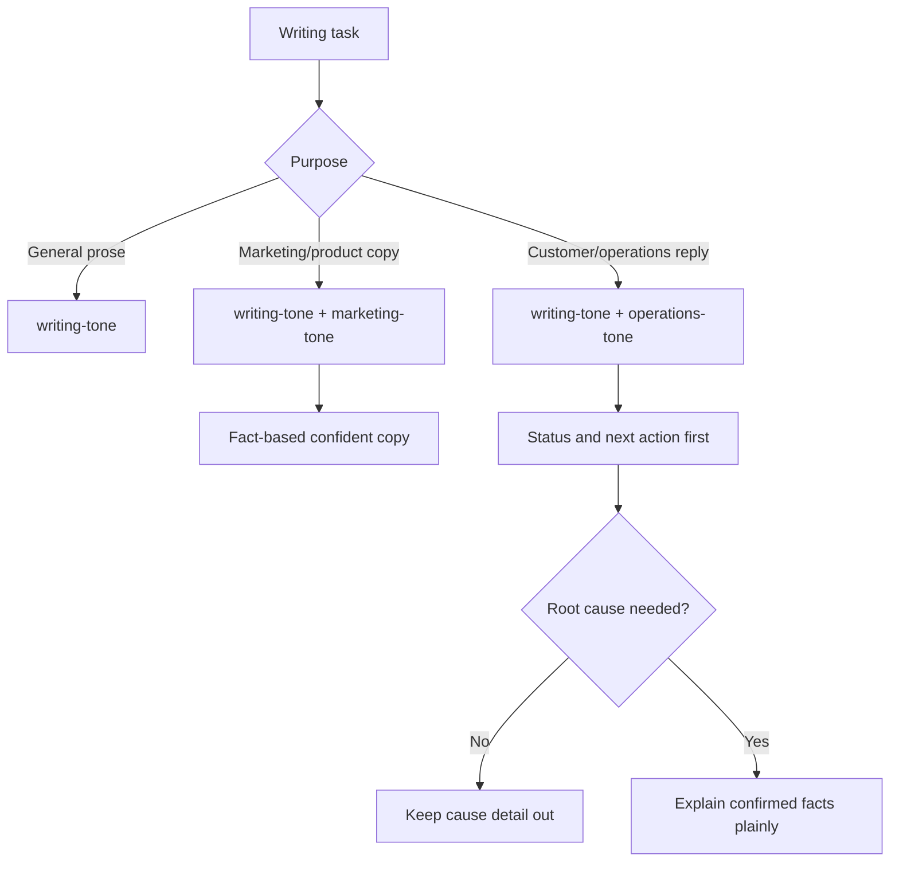

# Tone Overlay Skills

## Overview

Forge shall keep `writing-tone` as the single base tone skill for natural, human-readable prose. It shall add `marketing-tone` and `operations-tone` as purpose-specific overlays rather than creating a separate `natural-writing-tone` skill. This change also deduplicates overlapping general tone guidance in `operations-private` while preserving product-specific workflow, links, templates, and any existing user edits.

Non-goals:
- Do not create a separate `natural-writing-tone` skill.
- Do not remove product-specific WEPPY workflows, commands, support templates, or links from `operations-private`.
- Do not rewrite unrelated operations artifacts or generated report outputs.

## Requirements

- R1. WHEN an agent writes or revises human-readable prose THE SYSTEM SHALL use `writing-tone` as the single base tone skill for natural, clear, non-AI-like writing.
- R2. WHEN an agent writes marketing, product, landing page, launch, social, or campaign copy THE SYSTEM SHALL use `marketing-tone` as an overlay on top of `writing-tone`.
- R3. WHEN `marketing-tone` is used THE SYSTEM SHALL make claims fact-based, confident, and trust-building without unsupported hype or unverifiable superiority claims.
- R4. WHEN an agent writes customer support, operations updates, incident replies, GitHub issue replies, support emails, or status notices THE SYSTEM SHALL use `operations-tone` as an overlay on top of `writing-tone`.
- R5. WHEN `operations-tone` is used THE SYSTEM SHALL lead with confirmed status, user impact, action plan, customer action required, and next update criteria.
- R6. IF the customer did not ask for root cause details and the root cause is not required for customer action THEN THE SYSTEM SHALL avoid detailed cause explanations and use status wording such as "the issue has been confirmed", "we are preparing a fix", or "no action is needed on your side".
- R7. IF root cause details are requested, confirmed, and safe to share THEN THE SYSTEM SHALL explain them in customer-understandable language and separate confirmed facts from estimates.
- R8. WHEN `operations-private` skills contain general marketing or operations tone guidance that overlaps the new Forge skills THE SYSTEM SHALL replace the duplicated general rules with references to the new Forge tone skills while keeping WEPPY-specific workflow, routing, safety, support, metric, and template content.
- R9. IF `operations-private` contains existing uncommitted user changes THEN THE SYSTEM SHALL preserve those changes and only edit around them where required for deduplication.
- R10. WHEN Forge documentation or manifests list skills THE SYSTEM SHALL include `marketing-tone` and `operations-tone` and describe `writing-tone` as the base prose layer.

## Behavior & Flows

## Data & Interfaces

| Surface | Skill | Role |
|---|---|---|
| General prose, docs, messages, PR copy, UI copy | `writing-tone` | Base natural writing rules |
| Product pages, marketing copy, social copy, launch copy | `marketing-tone` | Fact-based confident product voice overlay |
| Customer support, operations updates, incident/status replies | `operations-tone` | Trust-building status and action overlay |

| Repository | Files |
|---|---|
| `aiagent-plugins` | `plugins/forge/skills/writing-tone/SKILL.md`, `plugins/forge/skills/writing-tone/references/style-rules.md`, new `plugins/forge/skills/marketing-tone/SKILL.md`, new `plugins/forge/skills/operations-tone/SKILL.md`, plugin manifests, README, validator-relevant files |
| `operations-private` | `.agents/skills/weppy-github-customer-response/SKILL.md`, `.agents/skills/weppy-roblox-mcp-social-copy/SKILL.md`, any command-center routing text that should point to the new Forge tone overlays |

## Acceptance Criteria

- AC1 (R1): GIVEN a general prose request, WHEN the skill list is inspected, THEN there is one base natural writing skill named `writing-tone` and no `natural-writing-tone` skill.
- AC2 (R2, R3): GIVEN a marketing copy request, WHEN `marketing-tone` is read, THEN it instructs the agent to use `writing-tone` first and to produce factual, confident, trust-building copy without unsupported hype.
- AC3 (R4, R5, R6, R7): GIVEN a customer support reply request, WHEN `operations-tone` is read, THEN it prioritizes confirmed status, customer impact, next action, and minimal cause detail unless the cause is requested, confirmed, and useful.
- AC4 (R8, R9): GIVEN the current `operations-private` skills, WHEN deduplication is complete, THEN general marketing/support tone rules are reduced or delegated to Forge tone skills while WEPPY-specific workflows, links, templates, and existing user edits remain intact.
- AC5 (R10): GIVEN the Forge README and plugin manifests, WHEN skill catalogs are inspected, THEN `marketing-tone` and `operations-tone` are listed and `writing-tone` is described as the base prose layer.
- AC6 (R1–R10): GIVEN the repository after implementation, WHEN `bash scripts/validate.sh` is run from `aiagent-plugins`, THEN it prints `validate: all checks passed`.

## Decisions & History

- 2026-07-04 [DECISION] Keep `writing-tone` as the single base natural writing skill instead of adding `natural-writing-tone`, because duplicate base tone skills would create ambiguous triggers.
- 2026-07-04 [DECISION] Add `marketing-tone` and `operations-tone` as overlays on top of `writing-tone`, because the differences are purpose-specific rather than separate base writing systems.
- 2026-07-04 [DECISION] Make `operations-tone` default to status, impact, action, customer action required, and next update criteria. Root cause detail is conditional, not the default.
- 2026-07-04 [DECISION] Deduplicate `operations-private` only where guidance is generic tone guidance; preserve product-specific WEPPY procedures, links, private support safeguards, and existing uncommitted user edits.
- 2026-07-04 [APPROVED] User approved the spec in chat with "승인".
- 2026-07-04 [IMPLEMENTED] AC1-AC6 verified with fresh command output; `bash scripts/validate.sh` passed.
