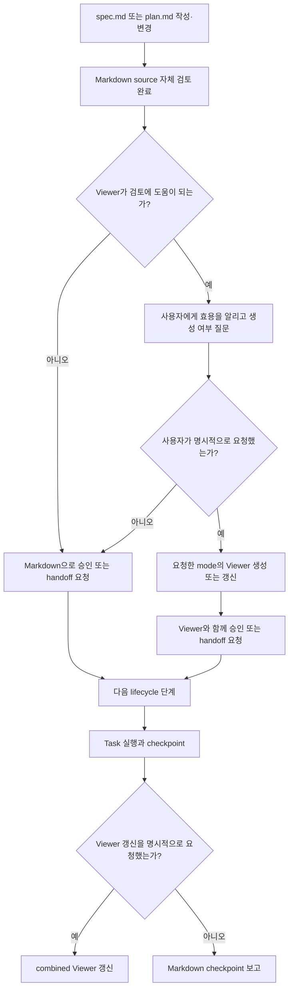
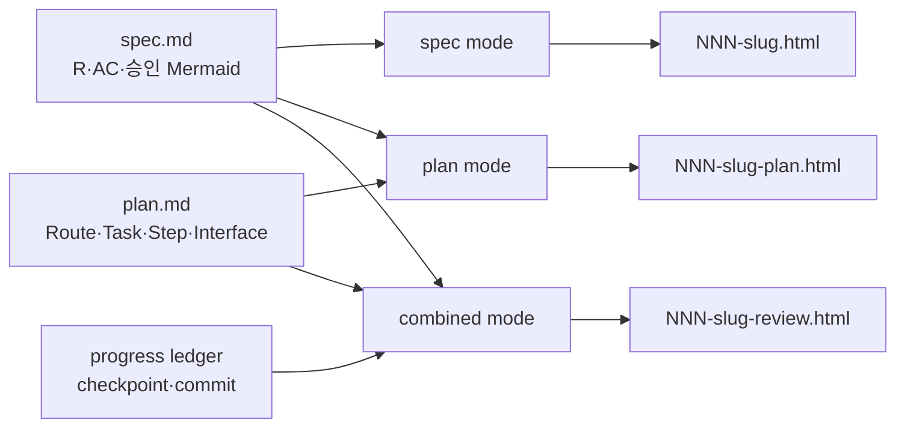
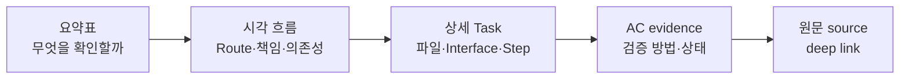

# 사람 중심 Lifecycle Review Viewer

Status: implemented

## Overview

Forge의 spec과 구현 계획이 커질수록 원본 Markdown만으로 전체 흐름, 책임 경계, Task 의존성, R·AC coverage를 검토하기 어렵다. 이 기능은 `spec.md`와 `.forge/plans/*.md`를 source of truth로 유지하면서, 사람이 내용을 단계적으로 이해하고 검토할 수 있는 읽기 전용 HTML Viewer를 `spec`, `plan`, `combined` mode로 제공한다.

Viewer의 목적은 텍스트를 그림으로 치환하는 것이 아니다. 같은 정보를 `요약표 → 시각 흐름 → 상세 Task → AC evidence` 순서로 읽게 하고, 사용자가 명시적으로 요청한 시점의 source를 바탕으로 검토 화면을 제공하는 것이다.

비목표:
- HTML Viewer를 spec이나 plan을 대신하는 편집 가능한 source of truth로 만들지 않는다.
- Viewer 안에서 source에 없는 런타임 의미, 요구사항, 의존성 또는 설계 결정을 새로 만들지 않는다.
- Notion, Google Docs, 별도 문서 사이트를 필수 운영 요소로 추가하지 않는다.
- Viewer 검토 결과만으로 제품 구현 완료나 `Status: implemented`를 선언하지 않는다.
- 사용자의 명시적 요청 없이 spec·plan·checkpoint의 HTML Viewer를 생성하거나 갱신하지 않는다.

검토한 접근안:

| 접근안 | 장점 | 단점 | 결정 |
|---|---|---|---|
| 기존 `spec-viewer`를 lifecycle viewer로 확장 | 기존 shell, offline Mermaid, tab, deep link를 재사용하고 source 규칙을 한곳에서 유지 | skill 이름보다 범위가 넓어짐 | 채택 |
| 별도 `plan-viewer` 추가 | 역할 이름이 명확함 | shell, locale, mobile, 검증 로직이 중복됨 | 제외 |
| 외부 문서 사이트 또는 협업 문서 사용 | 공유와 댓글 기능이 강함 | 배포·권한·동기화 비용과 source drift 위험이 큼 | 제외 |

## Requirements

R(Requirement)는 시스템이 반드시 제공해야 하는 동작이나 제약을 뜻한다.

### Source of truth와 유지 주기

- R1. Forge는 `docs/specs/NNN-<slug>/spec.md`를 요구사항과 승인 상태의 source of truth로 계속 유지해야 한다.
- R2. Forge는 `.forge/plans/NNN-<slug>.md`를 구현 Route, Task, 파일, Interface, 검증 절차의 source of truth로 유지해야 한다.
- R3. Viewer는 읽기 전용 파생 산출물이어야 하며, Viewer에서 spec·plan·progress source를 직접 수정하지 않아야 한다.
- R4. MODIFIED — Viewer가 생성된 이후 source가 변경되더라도 Forge는 사용자가 명시적으로 갱신을 요청한 경우에만 Viewer를 다시 생성해야 한다.
- R5. Viewer는 source path, source hash, 생성 시각, mode, locale, 집계 수치를 표시하고 source hash가 다르면 stale 상태를 표시해야 한다.
- R6. 생성된 Viewer HTML은 기본적으로 커밋하지 않고 `.forge/viewer/`에서 재생성 가능하게 유지해야 한다.
- R7. MODIFIED — `writing-specs`는 new·change·clarify·sync 과정에서 사용자의 명시적 요청이 없는 한 spec Viewer를 생성하거나 갱신하지 않아야 한다.
- R8. MODIFIED — `writing-plans`는 plan 저장 또는 실행 handoff 과정에서 사용자의 명시적 요청이 없는 한 plan 또는 combined Viewer를 생성하거나 갱신하지 않아야 한다.
- R9. MODIFIED — `executing-plans`는 Viewer가 이미 존재하더라도 사용자의 명시적 요청이 없는 한 Task checkpoint 후 combined Viewer를 갱신하지 않아야 한다.

### 복잡도에 따른 검토 방식

- R10. MODIFIED — Forge는 복잡도와 관계없이 Markdown을 기본 검토 화면으로 사용해야 한다.
- R11. MODIFIED — 복잡도 점수는 R 8개 초과, AC 8개 초과, Mermaid 2개 이상, 데이터·Interface 표 2개 이상, 여러 subsystem·actor·Place·상태 전이, 문서 200줄 초과, 미해결 clarification 또는 change history 다수 항목에 각각 1점을 부여하되 Viewer 자동 생성 조건으로 사용하지 않아야 한다.
- R12. MODIFIED — 복잡도 점수가 2 이상이면 Forge는 Viewer가 검토에 도움이 될 수 있음을 사용자에게 알리고 필요하면 명시적으로 요청할 수 있다고 안내하되, Viewer를 자동 생성하지 않아야 한다.
- R13. MODIFIED — 사용자가 현재 spec이나 plan의 시각화 또는 Viewer 생성·갱신을 명시적으로 요청한 경우에만 Forge는 복잡도 점수와 관계없이 해당 Viewer를 생성하거나 갱신해야 한다.
- R68. `writing-specs`와 `writing-plans`는 각각 Markdown source 작성과 자체 검토가 끝난 뒤 승인 또는 다음 lifecycle handoff를 요청할 때, Viewer가 검토에 도움이 되는 경우 사용자에게 Viewer 생성 여부를 물어야 한다.
- R69. 기존 Viewer의 source가 변경되면 Forge는 그 Viewer가 stale임을 사용자에게 알릴 수 있지만, 명시적 요청 전에는 stale Viewer를 갱신하거나 현재 검토 화면으로 제시하지 않아야 한다.

### Viewer mode와 출력

- R14. `spec-viewer`는 `spec`, `plan`, `combined` 세 mode를 지원해야 한다.
- R15. `spec` mode에서는 `spec.md`만 source of truth로 사용하고, Mermaid를 포함한 모든 요구사항 내용은 spec 원문에서 가져와야 한다.
- R16. `plan` mode에서는 `.forge/plans/*.md`를 Viewer의 source of truth로 사용하고, spec은 R·AC 정의와 승인된 Mermaid를 제공하는 보조 source로만 사용해야 한다.
- R17. `combined` mode에서는 spec의 R·AC와 plan의 Route·Task·Step·검증 방법을 연결하되 각 정보의 source를 표시해야 한다.
- R18. `spec` mode 출력은 `.forge/viewer/NNN-<slug>.html`, `plan` mode는 `.forge/viewer/NNN-<slug>-plan.html`, `combined` mode는 `.forge/viewer/NNN-<slug>-review.html`을 사용해야 한다.
- R19. build command는 기존 `--offline`과 함께 `--mode spec|plan|combined`, `--locale en|ko`를 지원해야 하며 기본 locale은 `en`으로 유지해야 한다.
- R20. `--locale ko`에서는 tab을 `개요`, `요구사항`, `흐름`, `데이터와 인터페이스`, `승인 기준`, `변경 이력`으로 표시해야 한다.

### Panel과 단계적 정보 구조

- R21. 모든 mode는 `overview`, `requirements`, `flows`, `data`, `acceptance`, `history`의 6개 고정 panel ID를 유지해야 한다.
- R22. plan mode의 Overview는 목표, source 집계 수치, 읽기 순서, 사용자 경험, 완료 상태를 보여줘야 한다.
- R23. plan mode의 Requirements는 Global Constraints, 핵심 정책, Route별 적용 범위를 보여줘야 한다.
- R24. plan mode의 Flows는 Route map, Task dependency, runtime 또는 확장 흐름을 보여줘야 한다.
- R25. plan mode의 Data & Interfaces는 runtime 책임, 서버 권위, 파일, Remote, transaction, Interface 계약을 보여줘야 한다.
- R26. plan mode의 Acceptance는 AC→Task→검증 방법 mapping과 검토 상태를 보여줘야 한다.
- R27. plan mode의 History는 source path와 hash, 상태, checkpoint, 관련 commit, 재생성 command를 보여줘야 한다.
- R28. Viewer는 원문 상세를 처음부터 펼치지 않고 요약, 시각 흐름, 상세 Task, AC evidence 순서로 배치해야 한다.

### 집계, Route, traceability

- R29. Viewer는 source에서 unique Task, Step, R, AC, Mermaid 수를 집계하고 summary에 표시해야 한다.
- R30. 집계 기준은 `### Task N` heading, `Step N` checkbox, Requirements의 unique R-ID, Acceptance Criteria의 unique AC-ID, Mermaid fence 수로 고정해야 한다.
- R31. scale fixture는 Task 22개, Step 110개, R 190개, AC 105개, 승인된 spec Mermaid 9개를 사용하고 Viewer 집계는 source와 정확히 일치해야 한다.
- R32. `writing-plans`는 6~10개의 Route 또는 Milestone으로 Task를 묶고 각 Task가 하나의 primary Route에 속하도록 작성해야 한다.
- R33. scale fixture의 Task 22개는 8개의 Expedition Route로 묶여 실행 순서와 dependency가 표시되어야 한다.
- R34. combined mode는 R→AC→Task→Step→검증 방법을 deep link로 이동할 수 있게 연결해야 한다.
- R35. Task, R, AC deep link는 해당 panel을 열고 대상 행이나 Task를 화면에 표시해야 한다.
- R36. AC 검토 checkbox와 Step 검토 checkbox는 종류를 구분해 localStorage에 저장해야 하며 제품 검증 PASS/FAIL로 표시되지 않아야 한다.

### Mermaid와 derived view

- R37. 승인된 spec의 Mermaid는 source text를 byte-for-byte 변경하지 않고 재사용해야 한다.
- R38. plan에 작성된 Mermaid는 plan source에서 그대로 가져오고 `Plan source`로 표시해야 한다.
- R39. Viewer가 source에서 계산한 Route, Task dependency, AC mapping 도식은 `Derived view`로 명시해야 한다.
- R40. derived diagram은 Task 번호, 명시된 Route membership, 명시된 dependency, R·AC mapping처럼 source에서 기계적으로 계산 가능한 정보만 포함해야 한다.
- R41. Viewer는 source에 없는 새로운 런타임 책임, transaction 순서, 상태 전이 또는 설계 결정을 derived diagram에 추가하지 않아야 한다.
- R42. 모든 diagram 앞에는 제목, 이 화면에서 확인할 것, 한 문장의 읽는 법을 표시해야 한다.
- R43. 넓은 sequence diagram 앞에는 actor별 runtime 책임을 요약한 표를 먼저 제공해야 한다.

### Mobile·접근성·shell

- R44. 넓은 Mermaid diagram은 독립 가로 스크롤 wrapper 안에 표시하고 SVG를 viewport 폭에 맞춰 무조건 축소하지 않아야 한다.
- R45. sequence diagram과 넓은 dependency diagram에는 읽을 수 있는 최소 폭을 적용해야 한다.
- R46. 각 diagram은 title, description, `aria-label` 또는 동등한 접근성 연결을 가져야 한다.
- R47. Mermaid parse나 render가 실패하면 오류 요약, 가능한 오류 line·column, 원문 source를 함께 표시해야 한다.
- R48. HTML shell은 inline favicon을 포함해 로컬 브라우저 검증에서 favicon 404를 만들지 않아야 한다.
- R49. 집계 수치와 상태 표는 tabular number를 사용해야 한다.
- R50. 넓은 표는 독립 가로 스크롤 wrapper를 사용해 문서 전체 viewport 폭을 확장하지 않아야 한다.
- R51. Viewer shell은 desktop 1440px와 mobile 390px에서 tab, 표, diagram, deep link, checkbox를 검증해야 한다.
- R52. mobile에서 sequence diagram 글자를 읽기 어려우면 책임 요약표 또는 세로 flowchart를 먼저 제공하고 원본 diagram은 가로 스크롤로 유지해야 한다.

### writing-plans 구조

- R53. `writing-plans`는 목표와 완료 상태, Implementation Route 또는 Milestone, Task dependency, Runtime responsibility, 주요 데이터 흐름, Place 또는 platform 확장 지점, Task별 R·AC mapping, checkpoint와 사용자 검토 시점을 plan 필수 구조로 요구해야 한다.
- R54. 복잡한 plan은 Task dependency 또는 Route map, runtime responsibility 또는 transaction flow, 확장 구조 또는 multi-Place flow의 세 diagram 관점을 포함해야 한다.
- R55. `writing-plans`는 Task 22개를 한 diagram에 평면적으로 연결하지 않고 먼저 6~10개의 Route로 묶도록 요구해야 한다.
- R56. plan의 diagram과 책임 표는 plan의 언어로 작성하되 API, service, schema, code identifier는 원문을 유지해야 한다.

### ui-design과 writing-tone 규칙

- R57. `ui-design`은 고정 Viewer shell 작업에서 Type, Palette, Spacing, Depth를 `inherited`로 선언할 수 있는 예외를 명시해야 한다.
- R58. content fragment는 임의 CSS, script, shell markup을 추가하지 않아야 한다.
- R59. Viewer의 Signature는 장식이 아니라 `Route Map`, `Runtime Atlas`, `AC Coverage`의 콘텐츠 구조에서 만들어야 한다.
- R60. diagram 추가는 제목, 읽는 법, mobile 대체 요약표와 한 묶음으로 검토해야 한다.
- R61. `writing-tone`은 Viewer 제목을 시스템 이름보다 사용자가 답을 찾을 질문에 맞추도록 요구해야 한다.
- R62. Viewer copy는 이 화면에서 확인할 것을 먼저 말하고, 번역해도 의미가 유지되는 label은 사용자 언어로 쓰며 고유 API·service·schema 이름만 원문으로 유지해야 한다.
- R63. Viewer copy는 요약→시각 흐름→원문 상세 순서로 구성하고 각 diagram 앞에 한 문장의 읽는 법을 제공해야 한다.

### Viewer-only 검증

- R64. `verifying-work`는 Viewer-only 변경을 제품 동작이나 spec 구현 완료 검증과 구분해야 한다.
- R65. Viewer-only 검증은 Level 1에서 panel 6개, Task·Step·AC·Mermaid 수, source Mermaid 일치, unresolved placeholder 0개, fragment의 shell markup 0개를 확인해야 한다.
- R66. Viewer-only 검증은 desktop·390px mobile render, Mermaid error 0개, tab, deep link, checkbox persistence, offline Mermaid를 실제 브라우저에서 확인해야 한다.
- R67. Viewer-only 검증 결과만으로 spec의 `Status:`를 `implemented`로 변경하지 않아야 한다.

## Behavior & Flows

Viewer를 사용자 요청에 따라 제공하는 흐름:



mode별 source ownership:



사람이 정보를 읽는 순서:



## Data & Interfaces

mode별 source 계약:

| Mode | Primary source | Auxiliary source | 허용되는 시각 정보 | 출력 |
|---|---|---|---|---|
| `spec` | `docs/specs/NNN-<slug>/spec.md` | 없음 | spec Mermaid 원문, R·AC 표 | `NNN-<slug>.html` |
| `plan` | `.forge/plans/NNN-<slug>.md` | 승인된 spec | plan Mermaid 원문, 명시된 Route·dependency에서 계산한 derived view | `NNN-<slug>-plan.html` |
| `combined` | spec + plan | progress ledger | R→AC→Task→Step mapping, checkpoint·commit 상태 | `NNN-<slug>-review.html` |

6개 panel의 plan mode mapping:

| Panel ID | 한국어 label | Plan mode 내용 |
|---|---|---|
| `overview` | 개요 | 목표, 완료 상태, 수량, 읽기 순서, 사용자 경험 |
| `requirements` | 요구사항 | Global Constraints, 핵심 정책, Route 적용 범위 |
| `flows` | 흐름 | Expedition Route, Task dependency, runtime·확장 흐름 |
| `data` | 데이터와 인터페이스 | 서버 권위, 파일, Remote, transaction, Interface 계약 |
| `acceptance` | 승인 기준 | AC→Task→검증 방법, 검토 checkbox |
| `history` | 변경 이력 | source path·hash, checkpoint, commit, 재생성 command |

Viewer 추천을 위한 복잡도 점수:

| Signal | 점수 |
|---|---:|
| R 8개 초과 | 1 |
| AC 8개 초과 | 1 |
| Mermaid 2개 이상 | 1 |
| 데이터·Interface 표 2개 이상 | 1 |
| 여러 subsystem·actor·Place·상태 전이 | 1 |
| 문서 200줄 초과 | 1 |
| clarification 또는 change history 다수 | 1 |

이 점수는 사용자에게 Viewer의 잠재적 효용을 알릴지 판단하는 신호일 뿐, HTML을 자동 생성하거나 갱신하는 권한이 아니다.

build interface 목표:

```text
build-viewer.sh \
  --mode spec|plan|combined \
  --locale en|ko \
  --spec docs/specs/NNN-<slug>/spec.md \
  [--plan .forge/plans/NNN-<slug>.md] \
  [--progress .forge/scratch/progress-NNN.md] \
  [--offline] \
  --output .forge/viewer/<mode-output>.html
```

source manifest:

| Field | 의미 |
|---|---|
| `mode` | `spec`, `plan`, `combined` |
| `locale` | tab과 shell copy locale |
| `sources[]` | source path, SHA-256, 역할 |
| `generated_at` | 재생성 시각 |
| `counts` | Task, Step, R, AC, Mermaid unique 수 |
| `freshness` | `current` 또는 `stale` |
| `rebuild_command` | 동일 Viewer를 재생성하는 command |

Viewer shell의 inherited visual system:

| 항목 | 선언 | 이유 |
|---|---|---|
| Class | Utilitarian, inherited | 장식보다 빠른 문서 탐색이 우선이다. |
| Type | 현재 16px base와 1.25 scale inherited | 긴 문서와 표를 읽는 기준을 유지한다. |
| Palette | 현재 neutral·green accent inherited | 상태와 deep link를 절제된 한 색으로 강조한다. |
| Spacing | 현재 shell spacing inherited | fragment가 임의 밀도를 만들지 않게 한다. |
| Depth | border 전략 inherited | 표, code, panel 경계를 그림자 없이 구분한다. |
| Signature | Route Map, Runtime Atlas, AC Coverage | Viewer 고유성은 장식이 아니라 source 관계를 읽는 구조에서 나온다. |

변경 대상:

| 대상 | 주요 변경 |
|---|---|
| `spec-viewer` | mode, source ownership, derived view, freshness, panel mapping |
| `viewer-template.html` | locale, mobile diagram·table wrapper, 접근성, favicon, tabular number, 오류 표시 |
| `build-viewer.sh` | `--mode`, `--locale`, source manifest, output naming, offline 유지 |
| `writing-specs` | Markdown 기본 검토, Viewer 효용 안내, 완료 후 생성 여부 질문 |
| `writing-plans` | Route·dependency·runtime·data flow·확장·checkpoint 구조와 diagram 규칙 |
| `executing-plans` | 요청이 있을 때만 checkpoint combined Viewer 갱신 |
| `ui-design` | inherited fixed shell 예외와 diagram fallback |
| `writing-tone` | 질문형 제목, 읽는 법, 요약 우선, locale copy |
| `verifying-work` | Viewer-only Level 1 검증과 `implemented` 금지 |

## Acceptance Criteria

AC(Acceptance Criterion)는 연결된 R이 충족됐다고 판단할 수 있는 관찰 가능한 완료 기준을 뜻한다.

- AC1 (R1–R9, R69): 기존 spec Viewer가 있는 상태에서 spec을 변경하고 승인 요청을 준비하면 Forge는 Viewer를 자동 갱신하지 않고 stale 사실을 알리며, 사용자가 갱신을 명시적으로 요청한 뒤에만 새 source hash와 내용으로 갱신하고 HTML을 Git 추적 대상에 추가하지 않는다.
- AC2 (R10–R13): 복잡도 1점과 2점인 문서는 모두 Markdown 검토 경로를 기본으로 사용하고, 2점인 문서에서는 Viewer의 효용만 안내하며, 사용자가 시각화를 명시적으로 요청한 문서만 HTML Viewer 경로를 사용한다.
- AC3 (R14–R20): 같은 fixture를 `spec`, `plan`, `combined` mode와 `--locale ko`로 build하면 세 출력 이름이 규칙과 일치하고 tab label이 한국어로 표시된다.
- AC4 (R15, R37): 승인된 spec Mermaid 9개가 있는 fixture를 spec mode로 build하면 Viewer에 Mermaid 9개가 나타나고 각 source text의 SHA-256이 spec fence와 일치한다.
- AC5 (R16–R17, R29–R36): Task 22개, Step 110개, R 190개, AC 105개 fixture를 plan·combined mode로 build하면 모든 count가 source와 일치하고 R→AC→Task→Step deep link가 올바른 panel과 대상을 연다.
- AC6 (R31–R33): scale fixture의 Task 22개가 8개 Expedition Route로 표시되고 Route 순서와 Task membership이 plan source와 일치한다.
- AC7 (R38–R41): source Mermaid와 derived diagram을 함께 표시하면 각 diagram에 `Spec source`, `Plan source`, `Derived view`가 구분되고 derived node·edge가 source에 명시된 관계만 포함한다.
- AC8 (R42–R43, R61–R63): 모든 diagram 앞에 제목, 이 화면에서 확인할 것, 한 문장의 읽는 법이 있고 넓은 sequence diagram 앞에는 runtime 책임 요약표가 먼저 표시된다.
- AC9 (R44–R45, R50–R52): 390px viewport에서 넓은 sequence diagram과 표가 문서 viewport를 확장하지 않고 각 wrapper 안에서 가로 스크롤되며 책임 요약표를 먼저 읽을 수 있다.
- AC10 (R46–R49): diagram 접근성 이름, inline favicon, tabular number가 DOM과 computed style에 존재하고 favicon 404가 발생하지 않는다.
- AC11 (R47): 잘못된 Mermaid fixture를 열면 다른 panel은 정상 동작하고 오류 diagram에는 오류 요약, 가능한 line·column, 원문 source가 표시된다.
- AC12 (R35–R36): Task·R·AC deep link와 AC·Step checkbox를 변경하고 page를 reload하면 같은 target과 종류별 checkbox 상태가 복원된다.
- AC13 (R53–R56): 복잡한 plan을 작성하면 필수 구조, 6~10 Route grouping, 세 diagram 관점, Task별 R·AC mapping, checkpoint가 존재하고 설명은 spec 언어를 따른다.
- AC14 (R57–R60): Viewer fragment를 검사하면 style·script·doctype·shell markup이 없고, visual system은 inherited로 선언되며 각 diagram에 mobile fallback 요약이 연결된다.
- AC15 (R64–R67): Viewer-only 변경을 검증하면 Level 1 checklist가 실행되고 결과가 모두 PASS여도 governing spec의 `Status:`는 변경되지 않는다.
- AC16 (R18–R19): CDN build와 `--offline` build가 모두 열리고 offline 파일에는 외부 Mermaid script 요청이 없으며 diagram이 렌더된다.
- AC17 (R21–R28): plan mode에서 6개 panel이 모두 존재하고 각 panel 내용이 mode mapping과 일치하며 요약→시각 흐름→상세 Task→AC evidence 순서가 유지된다.
- AC18 (R5, R27): History panel에서 source path·hash, mode, locale, counts, 생성 시각, checkpoint, commit, rebuild command를 확인할 수 있고 stale fixture는 stale 상태로 표시된다.
- AC19 (R51, R65–R66): desktop 1440px와 mobile 390px browser 검증에서 tab, deep link, checkbox persistence, diagram, table, print layout이 정상이며 Mermaid error가 0개다.
- AC20 (R58, R65): generated fragment의 panel은 정확히 6개이고 unresolved placeholder와 shell markup이 0개다.
- AC21 (R68): spec 또는 plan의 Markdown source 작성과 자체 검토가 끝나면, Viewer가 유용한 경우 승인 또는 handoff 메시지에서 생성 여부를 묻고 사용자의 응답 전에는 HTML 파일이 생성되지 않는다.
- AC22 (R9, R13, R69): 기존 combined Viewer가 있는 Task checkpoint에서 progress ledger가 변경되어도 자동 갱신하지 않고 Markdown으로 보고하며, 사용자가 갱신을 명시적으로 요청한 경우에만 새 progress source를 포함해 재생성한다.

## Decisions & History

- 2026-07-12 [DECISION] 기존 `spec-viewer`를 `spec`, `plan`, `combined` mode를 가진 lifecycle review viewer로 확장한다. 별도 `plan-viewer`를 만들지 않는다.
- 2026-07-12 [DECISION] spec과 plan은 각각 source of truth로 유지하고 Viewer는 읽기 전용 파생 산출물로 유지한다.
- 2026-07-12 [DECISION] Viewer HTML은 기본적으로 커밋하지 않는다. 대신 source 변경과 checkpoint마다 자동 재생성하고 source hash·freshness·rebuild command로 최신성을 관리한다.
- 2026-07-12 [DECISION] 6개 panel ID를 mode 전체에서 유지하고 label과 copy만 locale에 맞게 바꾼다.
- 2026-07-12 [DECISION] scale fixture는 Task 22개, Step 110개, R 190개, AC 105개, spec Mermaid 9개와 8개 Expedition Route를 사용한다.
- 2026-07-12 [DECISION] source Mermaid, plan Mermaid, derived diagram을 명확히 구분하고 derived diagram에는 기계적으로 계산 가능한 관계만 허용한다.
- 2026-07-12 [DECISION] Viewer의 정보 순서는 요약표 → 시각 흐름 → 상세 Task → AC evidence → 원문 source로 고정한다.
- 2026-07-12 [REJECTED] 별도 `plan-viewer` skill: shell과 locale·mobile·검증 로직이 중복된다.
- 2026-07-12 [REJECTED] generated HTML을 기본 커밋: 큰 binary-like diff와 source drift를 만들 수 있다.
- 2026-07-12 [REJECTED] Notion·Google Docs·별도 docs site를 필수 검토 경로로 사용: source 동기화와 운영 부담이 증가한다.
- 2026-07-12 [CHANGE] R4, R7–R13 MODIFIED: 복잡도나 기존 Viewer 존재 여부에 따른 자동 생성·갱신을 제거하고, 사용자의 명시적 요청만 Viewer 작업을 허용한다.
- 2026-07-12 [CHANGE] R68–R69 ADDED: Markdown source 완료 후 Viewer의 효용을 알리고 생성 여부를 묻되, stale Viewer는 요청 없이 갱신하거나 현재 검토 화면으로 제시하지 않는다.
- 2026-07-12 [DECISION] 사용자가 Viewer 명시 요청 정책 change delta를 승인했다.
- 2026-07-12 [DECISION] Viewer opt-in policy, stale 무갱신 evidence, lifecycle builder regression, desktop·390px browser interaction을 fresh verification해 AC1–AC22가 PASS했다.
