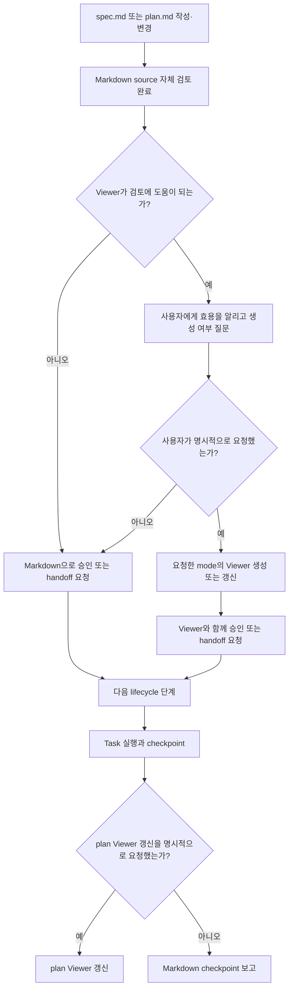
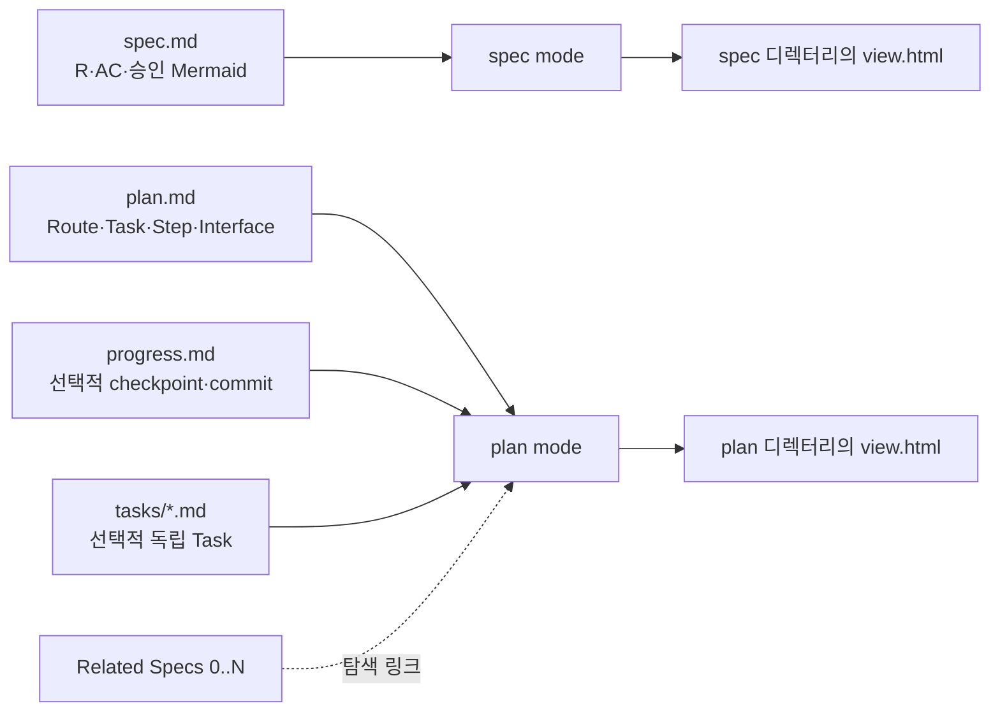
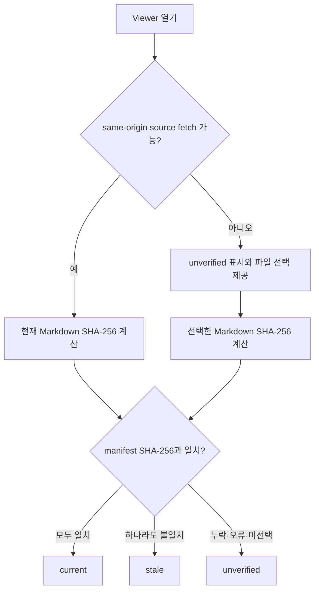

# 사람 중심 Lifecycle Review Viewer

Status: approved

## Overview

Forge의 spec과 plan이 커질수록 원본 Markdown만으로 전체 흐름, 책임 경계, Task 의존성, R·AC coverage를 검토하기 어렵다. 이 기능은 영구 관리되는 spec과 작업 단위로 생성·삭제되는 plan을 독립적인 source of truth로 유지하면서, 사람이 내용을 단계적으로 이해하고 검토할 수 있는 읽기 전용 HTML Viewer를 `spec` 또는 `plan` mode로 제공한다.

Viewer의 목적은 텍스트를 그림으로 치환하는 것이 아니다. 같은 정보를 `요약표 → 시각 흐름 → 상세 Task → AC evidence` 순서로 읽게 하고, 사용자가 명시적으로 요청한 시점의 source를 바탕으로 검토 화면을 제공하는 것이다.

비목표:
- HTML Viewer를 spec이나 plan을 대신하는 편집 가능한 source of truth로 만들지 않는다.
- Viewer 안에서 source에 없는 런타임 의미, 요구사항, 의존성 또는 설계 결정을 새로 만들지 않는다.
- Notion, Google Docs, 별도 문서 사이트를 필수 운영 요소로 추가하지 않는다.
- Viewer 검토 결과만으로 제품 구현 완료나 `Status: implemented`를 선언하지 않는다.
- 생성된 개별 Viewer를 구현 산출물처럼 별도 렌더링·레이아웃 검증하지 않는다.
- 사용자의 명시적 요청 없이 spec·plan·checkpoint의 HTML Viewer를 생성하거나 갱신하지 않는다.
- spec과 plan이 항상 1:1로 대응한다고 가정하거나 두 문서의 내용을 하나의 combined Viewer에 병합하지 않는다.

검토한 접근안:

| 접근안 | 장점 | 단점 | 결정 |
|---|---|---|---|
| 기존 `spec-viewer`를 lifecycle viewer로 확장 | 기존 shell, offline Mermaid, tab, deep link를 재사용하고 source 규칙을 한곳에서 유지 | skill 이름보다 범위가 넓어짐 | 채택 |
| 별도 `plan-viewer` 추가 | 역할 이름이 명확함 | shell, locale, mobile, 검증 로직이 중복됨 | 제외 |
| spec과 plan의 combined Viewer 유지 | 하나의 화면에서 traceability를 볼 수 있음 | 독립 수명 주기와 `0..N` 관계를 1:1 lifecycle처럼 오해하게 만듦 | 제외 |
| 외부 문서 사이트 또는 협업 문서 사용 | 공유와 댓글 기능이 강함 | 배포·권한·동기화 비용과 source drift 위험이 큼 | 제외 |

## Requirements

R(Requirement)는 시스템이 반드시 제공해야 하는 동작이나 제약을 뜻한다.

### Source of truth와 유지 주기

- R1. Forge는 `docs/specs/NNN-<slug>/spec.md`를 요구사항과 승인 상태의 source of truth로 계속 유지해야 한다.
- R2. MODIFIED — Forge는 `docs/plans/PPP-<slug>/plan.md`를 작업 단위의 목표, Route, Task, 파일, Interface, 검증 절차의 source of truth로 유지해야 하며 plan 번호는 spec 번호와 독립적으로 부여해야 한다.
- R3. Viewer는 읽기 전용 파생 산출물이어야 하며, Viewer에서 spec·plan·progress source를 직접 수정하지 않아야 한다.
- R4. MODIFIED — Viewer가 생성된 이후 source가 변경되더라도 Forge는 사용자가 명시적으로 갱신을 요청한 경우에만 Viewer를 다시 생성해야 한다.
- R5. MODIFIED — Viewer는 source path, 생성 당시 SHA-256, 생성 시각, mode, locale, 집계 수치를 표시하고 열람 시점의 source SHA-256과 비교해 `current`, `stale`, `unverified` 중 하나의 freshness 상태를 표시해야 한다.
- R6. MODIFIED — 생성된 spec Viewer는 `docs/specs/NNN-<slug>/view.html`, plan Viewer는 `docs/plans/PPP-<slug>/view.html`에 저장하고 Markdown source와 함께 Git으로 공유해야 한다.
- R7. MODIFIED — `writing-specs`는 new·change·clarify·sync 과정에서 사용자의 명시적 요청이 없는 한 spec Viewer를 생성하거나 갱신하지 않아야 한다.
- R8. MODIFIED — `writing-plans`는 plan 저장 또는 실행 handoff 과정에서 사용자의 명시적 요청이 없는 한 plan Viewer를 생성하거나 갱신하지 않아야 한다.
- R9. MODIFIED — `executing-plans`는 Viewer가 이미 존재하더라도 사용자의 명시적 요청이 없는 한 Task checkpoint 후 plan Viewer를 갱신하지 않아야 한다.
- R70. ADDED — `.forge/`는 Viewer content fragment, build output staging, 로컬 조사 기록처럼 공유할 필요가 없는 임시 작업 파일에만 사용해야 한다.
- R71. ADDED — spec은 프로젝트 수명 동안 영구 관리하고, plan은 작업 단위로 생성하며 작업 종료 뒤 보존 가치가 없으면 plan 디렉터리 전체를 삭제할 수 있어야 한다.
- R72. ADDED — plan은 `Related Specs`에서 0개 이상의 spec 경로와 선택적인 R·AC 참조를 선언할 수 있어야 하며, 경로·번호·수명 주기를 특정 spec에 종속시키지 않아야 한다.
- R73. ADDED — 제품 동작을 변경하는 plan은 하나 이상의 approved spec을 참조해야 하며, spec 없이 작성하는 plan은 Forge ceremony floor에 해당하는 작업이나 제품 동작을 바꾸지 않는 운영·조사 작업으로 제한해야 한다.
- R74. ADDED — plan의 진행 상태는 기본적으로 `plan.md`의 Task checkbox와 `Progress History`에서 관리하고, 기록이 길거나 여러 실행 주체가 독립적으로 갱신할 때만 같은 plan 디렉터리의 `progress.md`를 사용해야 한다.
- R75. ADDED — Task별 독립 소유권·병렬 실행·독립 승인이 필요한 큰 plan만 `docs/plans/PPP-<slug>/tasks/*.md`로 Task를 분리하고, 작은 plan은 단일 `plan.md`를 유지해야 한다.
- R76. ADDED — 삭제 예정 plan의 영구 보존 가치가 있는 제품 결정은 삭제 전에 governing spec, ADR 또는 동등한 영구 문서로 이전해야 한다.
- R84. ADDED — 조사·debug 기록은 로컬 작업 중 `.forge/`에 둘 수 있지만 팀이 공유하거나 장기 보존할 기록은 `docs/research/`, `docs/debug/` 또는 해당 프로젝트의 영구 문서 경로로 승격해야 한다.

### 복잡도에 따른 검토 방식

- R10. MODIFIED — Forge는 복잡도와 관계없이 Markdown을 기본 검토 화면으로 사용해야 한다.
- R11. MODIFIED — 복잡도 점수는 R 8개 초과, AC 8개 초과, Mermaid 2개 이상, 데이터·Interface 표 2개 이상, 여러 subsystem·actor·Place·상태 전이, 문서 200줄 초과, 미해결 clarification 또는 change history 다수 항목에 각각 1점을 부여하되 Viewer 자동 생성 조건으로 사용하지 않아야 한다.
- R12. MODIFIED — 복잡도 점수가 2 이상이면 Forge는 Viewer가 검토에 도움이 될 수 있음을 사용자에게 알리고 필요하면 명시적으로 요청할 수 있다고 안내하되, Viewer를 자동 생성하지 않아야 한다.
- R13. MODIFIED — 사용자가 현재 spec이나 plan의 시각화 또는 Viewer 생성·갱신을 명시적으로 요청한 경우에만 Forge는 복잡도 점수와 관계없이 해당 Viewer를 생성하거나 갱신해야 한다.
- R68. `writing-specs`와 `writing-plans`는 각각 Markdown source 작성과 자체 검토가 끝난 뒤 승인 또는 다음 lifecycle handoff를 요청할 때, Viewer가 검토에 도움이 되는 경우 사용자에게 Viewer 생성 여부를 물어야 한다.
- R69. 기존 Viewer의 source가 변경되면 Forge는 그 Viewer가 stale임을 사용자에게 알릴 수 있지만, 명시적 요청 전에는 stale Viewer를 갱신하거나 현재 검토 화면으로 제시하지 않아야 한다.

### Viewer mode와 출력

- R14. MODIFIED — `spec-viewer`는 서로 독립적인 `spec`과 `plan` 두 mode만 지원해야 한다.
- R15. `spec` mode에서는 `spec.md`만 source of truth로 사용하고, Mermaid를 포함한 모든 요구사항 내용은 spec 원문에서 가져와야 한다.
- R16. MODIFIED — `plan` mode에서는 `docs/plans/PPP-<slug>/plan.md`와 존재하는 경우 같은 디렉터리의 `progress.md`, `tasks/*.md`만 Viewer source로 사용하고 관련 spec은 내용을 병합하지 않는 탐색 링크로만 표시해야 한다.
- R17. REMOVED — spec과 plan의 `0..N` 관계와 독립 수명 주기를 보존하기 위해 `combined` mode를 제공하지 않아야 한다.
- R18. MODIFIED — `spec` mode 출력은 source와 같은 디렉터리의 `view.html`, `plan` mode 출력도 plan 디렉터리의 `view.html`을 사용해야 한다.
- R19. MODIFIED — build command는 기존 `--offline`과 함께 `--mode spec|plan`, `--locale en|ko`를 지원하고 plan mode에서 선택적인 `progress.md`와 `tasks/*.md` source를 받을 수 있어야 하며 기본 locale은 `en`으로 유지해야 한다.
- R20. `--locale ko`에서는 tab을 `개요`, `요구사항`, `흐름`, `데이터와 인터페이스`, `승인 기준`, `변경 이력`으로 표시해야 한다.

### Panel과 단계적 정보 구조

- R21. 모든 mode는 `overview`, `requirements`, `flows`, `data`, `acceptance`, `history`의 6개 고정 panel ID를 유지해야 한다.
- R22. plan mode의 Overview는 목표, source 집계 수치, 읽기 순서, 사용자 경험, 완료 상태를 보여줘야 한다.
- R23. plan mode의 Requirements는 Global Constraints, 핵심 정책, Route별 적용 범위를 보여줘야 한다.
- R24. plan mode의 Flows는 Route map, Task dependency, runtime 또는 확장 흐름을 보여줘야 한다.
- R25. plan mode의 Data & Interfaces는 runtime 책임, 서버 권위, 파일, Remote, transaction, Interface 계약을 보여줘야 한다.
- R26. MODIFIED — plan mode의 Acceptance는 관련 spec이 있으면 AC→Task→검증 방법 mapping을, 관련 spec이 없으면 Task→검증 방법 mapping을 검토 상태와 함께 보여줘야 한다.
- R27. MODIFIED — plan mode의 History는 plan 상태, Task checkbox, Progress History, 선택적인 `progress.md`·`tasks/*.md`, source path와 hash, checkpoint, 관련 commit, 재생성 command를 보여줘야 한다.
- R28. Viewer는 원문 상세를 처음부터 펼치지 않고 요약, 시각 흐름, 상세 Task, AC evidence 순서로 배치해야 한다.

### 집계, Route, traceability

- R29. MODIFIED — Viewer는 선택된 mode의 source 집합에서 unique Task, Step, R, AC, Mermaid 수를 집계하고 summary에 표시해야 한다.
- R30. MODIFIED — 집계 기준은 `### Task N` heading, `Step N` checkbox, Requirements의 unique R-ID, Acceptance Criteria의 unique AC-ID, Mermaid fence 수로 고정하고 plan mode에서는 `plan.md`, 선택적인 `progress.md`, `tasks/*.md` 전체에서 중복을 제거해야 한다.
- R31. MODIFIED — scale fixture는 spec source에 R 190개, AC 105개, Mermaid 9개를 두고 독립된 plan source 집합에 Task 22개, Step 110개를 두며 각 Viewer 집계는 자신의 source와 정확히 일치해야 한다.
- R32. `writing-plans`는 6~10개의 Route 또는 Milestone으로 Task를 묶고 각 Task가 하나의 primary Route에 속하도록 작성해야 한다.
- R33. scale fixture의 Task 22개는 8개의 Expedition Route로 묶여 실행 순서와 dependency가 표시되어야 한다.
- R34. REMOVED — Viewer는 spec과 plan 사이의 R→AC→Task→Step 통합 deep link를 만들지 않아야 한다.
- R35. MODIFIED — spec mode의 R·AC deep link와 plan mode의 Task·Step deep link는 각각 해당 Viewer 안에서 panel과 대상을 열어야 한다.
- R36. AC 검토 checkbox와 Step 검토 checkbox는 종류를 구분해 localStorage에 저장해야 하며 제품 검증 PASS/FAIL로 표시되지 않아야 한다.

### Mermaid와 derived view

- R37. 승인된 spec의 Mermaid는 source text를 byte-for-byte 변경하지 않고 재사용해야 한다.
- R38. MODIFIED — plan source 집합에 작성된 Mermaid는 각 source에서 그대로 가져오고 `Plan source`와 source 경로를 표시해야 한다.
- R39. Viewer가 source에서 계산한 Route, Task dependency, AC mapping 도식은 `Derived view`로 명시해야 한다.
- R40. derived diagram은 Task 번호, 명시된 Route membership, 명시된 dependency, R·AC mapping처럼 source에서 기계적으로 계산 가능한 정보만 포함해야 한다.
- R41. Viewer는 source에 없는 새로운 런타임 책임, transaction 순서, 상태 전이 또는 설계 결정을 derived diagram에 추가하지 않아야 한다.
- R42. 모든 diagram 앞에는 제목, 이 화면에서 확인할 것, 한 문장의 읽는 법을 표시해야 한다.
- R43. 넓은 sequence diagram 앞에는 actor별 runtime 책임을 요약한 표를 먼저 제공해야 한다.

### Mobile·접근성·shell

- R44. 넓은 Mermaid diagram은 독립 가로 스크롤 wrapper 안에 표시하고 SVG를 viewport 폭에 맞춰 무조건 축소하지 않아야 한다.
- R45. sequence diagram과 넓은 dependency diagram에는 읽을 수 있는 최소 폭을 적용해야 한다.
- R46. 각 diagram은 title, description, `aria-label` 또는 동등한 접근성 연결을 가져야 한다.
- R47. Mermaid parse나 render가 실패하면 오류 요약, 가능한 오류 line·column, 원문 source를 함께 표시해야 한다.
- R48. HTML shell은 inline favicon을 포함해 로컬 브라우저 검증에서 favicon 404를 만들지 않아야 한다.
- R49. 집계 수치와 상태 표는 tabular number를 사용해야 한다.
- R50. 넓은 표는 독립 가로 스크롤 wrapper를 사용해 문서 전체 viewport 폭을 확장하지 않아야 한다.
- R51. MODIFIED — Viewer shell, template, style, script 또는 runtime 동작을 변경할 때는 desktop 1440px와 mobile 390px에서 tab, 표, diagram, deep link, checkbox를 검증해야 하지만, 고정 shell로 개별 `view.html`을 생성할 때는 이 검증을 반복하지 않아야 한다.
- R52. mobile에서 sequence diagram 글자를 읽기 어려우면 책임 요약표 또는 세로 flowchart를 먼저 제공하고 원본 diagram은 가로 스크롤로 유지해야 한다.

### 열람 시점 freshness

- R77. ADDED — Viewer는 생성 시점에 각 source의 Viewer 기준 상대 경로와 SHA-256을 source manifest에 기록하되 생성 시점 freshness를 열람 시점의 최신성 보장으로 표시하지 않아야 한다.
- R78. ADDED — Viewer를 HTTP 또는 HTTPS의 same-origin에서 열면 각 source를 `cache: no-store`로 읽고 Web Crypto API로 SHA-256을 다시 계산해 manifest의 hash와 자동 비교해야 한다.
- R79. ADDED — `file://` 또는 브라우저 보안 정책으로 source 자동 읽기가 실패하면 Viewer는 `unverified`를 표시하고 사용자가 로컬 Markdown source를 선택해 브라우저 안에서 hash를 비교할 수 있는 수동 검증 동작을 제공해야 한다.
- R80. ADDED — 수동 freshness 검증을 위해 선택한 파일 내용은 브라우저 밖으로 업로드하거나 전송하지 않아야 한다.
- R81. ADDED — source별 freshness를 각각 표시하고, source가 여러 개인 plan Viewer는 하나라도 `stale`이면 전체를 `stale`, stale 없이 하나라도 검증하지 못하면 전체를 `unverified`, 모든 source가 일치할 때만 전체를 `current`로 표시해야 한다.
- R82. ADDED — source fetch 실패, 누락, 파일명 충돌 또는 hash 계산 실패를 `current`로 간주하지 말고 source별 실패 원인과 다시 검증할 방법을 표시해야 한다.
- R83. ADDED — command-line freshness check는 committed Viewer manifest의 source hash와 현재 Markdown source를 비교해 모두 일치하면 성공하고, stale·누락·manifest 오류가 있으면 실패해야 하며 CI에서 선택적으로 사용할 수 있어야 한다.

### writing-plans 구조

- R53. MODIFIED — `writing-plans`는 목표와 완료 상태, `Related Specs`, Implementation Route 또는 Milestone, Task dependency, Runtime responsibility, 주요 데이터 흐름, Place 또는 platform 확장 지점, Task별 검증 mapping, checkpoint와 사용자 검토 시점을 plan 필수 구조로 요구하고, 관련 spec이 있을 때만 Task별 R·AC mapping을 요구해야 한다.
- R54. 복잡한 plan은 Task dependency 또는 Route map, runtime responsibility 또는 transaction flow, 확장 구조 또는 multi-Place flow의 세 diagram 관점을 포함해야 한다.
- R55. `writing-plans`는 Task 22개를 한 diagram에 평면적으로 연결하지 않고 먼저 6~10개의 Route로 묶도록 요구해야 한다.
- R56. MODIFIED — plan의 diagram과 책임 표는 plan에서 선택한 언어로 작성하되 관련 spec에서 인용한 값과 API, service, schema, code identifier는 원문을 유지해야 한다.

### UI 디자인과 writing-tone 규칙

- R57. MODIFIED — 고정 Viewer shell로 spec 또는 plan `view.html`을 생성하는 작업은 `web-app-design`, `website-design`, deprecated `ui-design`을 적용하지 않아야 하며, Viewer shell·template·style 자체를 변경할 때만 `web-app-design`을 적용해야 한다.
- R58. content fragment는 임의 CSS, script, shell markup을 추가하지 않아야 한다.
- R59. Viewer의 Signature는 장식이 아니라 `Route Map`, `Runtime Atlas`, `AC Coverage`의 콘텐츠 구조에서 만들어야 한다.
- R60. diagram 추가는 제목, 읽는 법, mobile 대체 요약표와 한 묶음으로 검토해야 한다.
- R61. `writing-tone`은 Viewer 제목을 시스템 이름보다 사용자가 답을 찾을 질문에 맞추도록 요구해야 한다.
- R62. Viewer copy는 이 화면에서 확인할 것을 먼저 말하고, 번역해도 의미가 유지되는 label은 사용자 언어로 쓰며 고유 API·service·schema 이름만 원문으로 유지해야 한다.
- R63. Viewer copy는 요약→시각 흐름→원문 상세 순서로 구성하고 각 diagram 앞에 한 문장의 읽는 법을 제공해야 한다.

### Viewer 생성과 검증 경계

- R64. MODIFIED — 고정 Viewer tooling으로 개별 spec 또는 plan `view.html`을 생성하는 작업은 `verifying-work`를 적용하지 않고, build command 성공을 생성 완료의 충분한 근거로 사용해야 한다.
- R65. MODIFIED — 생성된 개별 Viewer에는 별도 `--check`, source count·hash·Mermaid 일치 확인, unresolved placeholder·shell markup 검사 같은 post-build 검증을 수행하지 않아야 한다.
- R66. MODIFIED — 생성된 개별 Viewer에는 desktop·390px mobile render, screenshot, layout, print, tab, deep link, checkbox persistence, Mermaid, offline, freshness 상태의 브라우저 검증을 수행하지 않아야 한다.
- R67. Viewer 생성 결과만으로 governing product spec의 `Status:`를 `implemented`로 변경하지 않아야 하며, Viewer builder·template·style·script·runtime 동작 변경은 일반 구현 검증과 관련 AC 검증을 따라야 한다.

## Behavior & Flows

Viewer를 사용자 요청에 따라 제공하는 흐름:



mode별 source ownership:



Viewer 열람 시 freshness 판정 흐름:



사람이 정보를 읽는 순서:


## Data & Interfaces

mode별 source 계약:

| Mode | Primary source | Auxiliary source | 허용되는 시각 정보 | 출력 |
|---|---|---|---|---|
| `spec` | `docs/specs/NNN-<slug>/spec.md` | 없음 | spec Mermaid 원문, R·AC 표 | 같은 디렉터리의 `view.html` |
| `plan` | `docs/plans/PPP-<slug>/plan.md` | 선택적인 `progress.md`, `tasks/*.md` | plan source Mermaid 원문, 명시된 Route·dependency에서 계산한 derived view, 진행 상태 | 같은 디렉터리의 `view.html` |

6개 panel의 plan mode mapping:

| Panel ID | 한국어 label | Plan mode 내용 |
|---|---|---|
| `overview` | 개요 | 목표, 완료 상태, 수량, 읽기 순서, 사용자 경험 |
| `requirements` | 요구사항 | Global Constraints, 핵심 정책, Route 적용 범위 |
| `flows` | 흐름 | Expedition Route, Task dependency, runtime·확장 흐름 |
| `data` | 데이터와 인터페이스 | 서버 권위, 파일, Remote, transaction, Interface 계약 |
| `acceptance` | 승인 기준 | AC→Task→검증 방법, 검토 checkbox |
| `history` | 변경 이력 | source path·hash, checkpoint, commit, 재생성 command |

Viewer 추천을 위한 복잡도 점수:

| Signal | 점수 |
|---|---:|
| R 8개 초과 | 1 |
| AC 8개 초과 | 1 |
| Mermaid 2개 이상 | 1 |
| 데이터·Interface 표 2개 이상 | 1 |
| 여러 subsystem·actor·Place·상태 전이 | 1 |
| 문서 200줄 초과 | 1 |
| clarification 또는 change history 다수 | 1 |

이 점수는 사용자에게 Viewer의 잠재적 효용을 알릴지 판단하는 신호일 뿐, HTML을 자동 생성하거나 갱신하는 권한이 아니다.

build interface 목표:

```text
build-viewer.sh \
  --mode spec|plan \
  --locale en|ko \
  [--spec docs/specs/NNN-<slug>/spec.md] \
  [--plan docs/plans/PPP-<slug>/plan.md] \
  [--progress docs/plans/PPP-<slug>/progress.md] \
  [--tasks-dir docs/plans/PPP-<slug>/tasks] \
  [--offline] \
  [--output <source-directory>/view.html]

build-viewer.sh --check docs/specs/NNN-<slug>/view.html
build-viewer.sh --check docs/plans/PPP-<slug>/view.html
```

source manifest:

| Field | 의미 |
|---|---|
| `mode` | `spec` 또는 `plan` |
| `locale` | tab과 shell copy locale |
| `sources[]` | source path, SHA-256, 역할 |
| `generated_at` | 재생성 시각 |
| `counts` | Task, Step, R, AC, Mermaid unique 수 |
| `freshness` | 열람 시 계산되는 `current`, `stale`, `unverified`; 초기값은 `unverified` |
| `rebuild_command` | 동일 Viewer를 재생성하는 command |

문서 저장 구조:

```text
docs/
├── specs/
│   └── NNN-<slug>/
│       ├── spec.md
│       └── view.html
├── plans/
│   └── PPP-<slug>/
│       ├── plan.md
│       ├── view.html
│       ├── progress.md      # 선택
│       └── tasks/           # 선택
│           └── TTT-<slug>.md
├── research/                # 공유·장기 보존할 조사 기록
└── debug/                   # 공유·장기 보존할 root-cause 기록

.forge/
├── scratch/
└── viewer-build/
```

Viewer shell의 inherited visual system:

| 항목 | 선언 | 이유 |
|---|---|---|
| Class | Utilitarian, inherited | 장식보다 빠른 문서 탐색이 우선이다. |
| Type | 현재 16px base와 1.25 scale inherited | 긴 문서와 표를 읽는 기준을 유지한다. |
| Palette | 현재 neutral·green accent inherited | 상태와 deep link를 절제된 한 색으로 강조한다. |
| Spacing | 현재 shell spacing inherited | fragment가 임의 밀도를 만들지 않게 한다. |
| Depth | border 전략 inherited | 표, code, panel 경계를 그림자 없이 구분한다. |
| Signature | Route Map, Runtime Atlas, AC Coverage | Viewer 고유성은 장식이 아니라 source 관계를 읽는 구조에서 나온다. |

변경 대상:

| 대상 | 주요 변경 |
|---|---|
| `spec-viewer` | combined mode 제거, 독립 source ownership, shared output, 열람 시 freshness, panel mapping |
| `viewer-template.html` | 3단계 freshness UI, source fetch·파일 선택 검증, locale, mobile diagram·table wrapper, 접근성, favicon, 오류 표시 |
| `build-viewer.sh` | `--mode spec|plan`, 독립 ID·output naming, 선택적 plan sources, `--check`, offline 유지 |
| `writing-specs` | Markdown 기본 검토, Viewer 효용 안내, 완료 후 생성 여부 질문 |
| `writing-plans` | 독립 plan ID, 선택적 Related Specs, plan 디렉터리, 진행·Task 분리 기준 |
| `executing-plans` | plan 디렉터리의 상태·진행 기록과 요청이 있을 때만 plan Viewer 갱신 |
| `web-app-design` | 개별 View 생성 제외와 Viewer tooling 변경 시 browser app UI 검증 |
| `writing-tone` | 질문형 제목, 읽는 법, 요약 우선, locale copy |
| `verifying-work` | 개별 View 생성 제외, Viewer tooling 검증, `implemented` 금지 |
| `using-forge`, portability rules, README | `docs/specs`, `docs/plans`, committed View, `.forge` 임시 파일 계약 동기화 |
| `systematic-debugging` | 로컬 debug note와 공유·장기 보존 root-cause 문서의 승격 경로 구분 |

## Acceptance Criteria

AC(Acceptance Criterion)는 연결된 R이 충족됐다고 판단할 수 있는 관찰 가능한 완료 기준을 뜻한다.

- AC1 (R1–R9, R69): 기존 spec Viewer가 있는 상태에서 spec을 변경하고 승인 요청을 준비하면 Forge는 Viewer를 자동 갱신하지 않고 stale 사실을 알리며, 사용자가 갱신을 명시적으로 요청한 뒤에만 같은 spec 디렉터리의 `view.html`을 새 source hash와 내용으로 갱신해 Markdown과 함께 Git으로 공유한다.
- AC2 (R10–R13): 복잡도 1점과 2점인 문서는 모두 Markdown 검토 경로를 기본으로 사용하고, 2점인 문서에서는 Viewer의 효용만 안내하며, 사용자가 시각화를 명시적으로 요청한 문서만 HTML Viewer 경로를 사용한다.
- AC3 (R14–R20): 독립된 spec fixture와 plan fixture를 각각 `spec`, `plan` mode와 `--locale ko`로 build하면 source 디렉터리마다 `view.html` 하나가 생성되고 tab label이 한국어로 표시되며 `combined` mode 요청은 거부된다.
- AC4 (R15, R37): 승인된 spec Mermaid 9개가 있는 fixture를 spec mode로 build하면 Viewer에 Mermaid 9개가 나타나고 각 source text의 SHA-256이 spec fence와 일치한다.
- AC5 (R16–R17, R29–R36): `plan.md`, `progress.md`, `tasks/*.md`로 나뉜 Task 22개와 Step 110개 fixture를 plan mode로 build하면 중복 제거된 count가 source 집합과 일치하고 Task·Step deep link가 올바른 panel과 대상을 열며 관련 spec 내용은 Viewer에 병합되지 않는다.
- AC6 (R31–R33): scale fixture의 Task 22개가 8개 Expedition Route로 표시되고 Route 순서와 Task membership이 plan source와 일치한다.
- AC7 (R37–R41): spec View와 plan View에서 source Mermaid와 derived diagram을 표시하면 각각 `Spec source`, `Plan source`, `Derived view`가 구분되고 source 경로가 표시되며 derived node·edge가 해당 mode source에 명시된 관계만 포함한다.
- AC8 (R42–R43, R61–R63): 모든 diagram 앞에 제목, 이 화면에서 확인할 것, 한 문장의 읽는 법이 있고 넓은 sequence diagram 앞에는 runtime 책임 요약표가 먼저 표시된다.
- AC9 (R44–R45, R50–R52): 390px viewport에서 넓은 sequence diagram과 표가 문서 viewport를 확장하지 않고 각 wrapper 안에서 가로 스크롤되며 책임 요약표를 먼저 읽을 수 있다.
- AC10 (R46–R49): diagram 접근성 이름, inline favicon, tabular number가 DOM과 computed style에 존재하고 favicon 404가 발생하지 않는다.
- AC11 (R47): 잘못된 Mermaid fixture를 열면 다른 panel은 정상 동작하고 오류 diagram에는 오류 요약, 가능한 line·column, 원문 source가 표시된다.
- AC12 (R35–R36): spec View의 R·AC deep link와 plan View의 Task·Step deep link 및 검토 checkbox를 변경하고 page를 reload하면 같은 mode 안에서 target과 종류별 checkbox 상태가 복원된다.
- AC13 (R53–R56, R72–R75): 복잡한 plan을 작성하면 독립 plan ID, 선택적인 `Related Specs`, 필수 구조, 6~10 Route grouping, plan source로부터 만든 diagram 관점, checkpoint가 존재하고 Task 분리는 독립 소유권·병렬 실행·독립 승인 조건에서만 사용된다.
- AC14 (R57–R60): 고정 shell에서 개별 Viewer를 생성할 때 `web-app-design`, `website-design`, deprecated `ui-design` 절차를 적용하지 않고 fragment에 style·script·doctype·shell markup을 추가하지 않으며, Viewer shell·template·style 자체를 변경할 때만 `web-app-design`을 적용한다.
- AC15 (R64–R67): 고정 Viewer tooling으로 개별 View를 build하면 성공한 build에서 작업을 종료하고 별도 checker나 브라우저 검증을 실행하지 않으며 governing spec의 `Status:`를 변경하지 않는다. Viewer tooling 자체를 변경하면 이 예외 없이 일반 구현 검증을 수행한다.
- AC16 (R18–R19): CDN build와 `--offline` build가 모두 열리고 offline 파일에는 외부 Mermaid script 요청이 없으며 diagram이 렌더된다.
- AC17 (R21–R28): plan mode에서 6개 panel이 모두 존재하고 각 panel 내용이 mode mapping과 일치하며 요약→시각 흐름→상세 Task→AC evidence 순서가 유지된다.
- AC18 (R5, R27, R77–R82): History panel에서 source path·생성 당시 hash, mode, locale, counts, 생성 시각, checkpoint, commit, rebuild command를 확인할 수 있고 열람 시 검증 전에는 `unverified`, 현재 source와 불일치하면 `stale`, 모두 일치하면 `current`로 표시된다.
- AC19 (R51, R65–R66): Viewer shell·template·style·script·runtime 동작을 변경한 경우에만 desktop 1440px와 mobile 390px browser 검증에서 tab, deep link, checkbox persistence, diagram, table, print layout이 정상이며 Mermaid error가 0개임을 확인하고, 개별 View 생성에서는 해당 검증을 실행하지 않는다.
- AC20 (R21, R58): Viewer builder tooling을 검증하는 fixture에서 generated fragment의 panel은 정확히 6개이고 unresolved placeholder와 shell markup이 0개다. 개별 View 생성 뒤에는 이 fixture나 동등한 검사를 반복하지 않는다.
- AC21 (R68): spec 또는 plan의 Markdown source 작성과 자체 검토가 끝나면, Viewer가 유용한 경우 승인 또는 handoff 메시지에서 생성 여부를 묻고 사용자의 응답 전에는 HTML 파일이 생성되지 않는다.
- AC22 (R9, R13, R69): 기존 plan Viewer가 있는 Task checkpoint에서 `plan.md` 또는 `progress.md`가 변경되어도 자동 갱신하지 않고 Markdown으로 보고하며, 사용자가 갱신을 명시적으로 요청한 경우에만 현재 plan source 집합을 포함해 재생성한다.
- AC23 (R1–R2, R6, R18, R70–R71): 새 spec과 새 plan을 만들면 각각 `docs/specs/NNN-<slug>/`와 `docs/plans/PPP-<slug>/`에서 독립 번호를 사용하고, 생성 요청을 받은 각 View는 source 옆 `view.html`로 Git 추적되며 `.forge/`에는 공유 문서나 최종 Viewer가 남지 않는다.
- AC24 (R72–R73): 관련 spec이 없는 운영 plan, 하나의 approved spec을 참조하는 기능 plan, 여러 approved spec을 참조하는 교차 기능 plan을 작성하면 모두 독립 plan 경로를 유지하고, approved spec 없이 제품 동작을 변경하려는 plan은 작성 단계에서 거부된다.
- AC25 (R74–R76): 작은 plan의 진행 상태는 `plan.md`만으로 관리되고, 긴 checkpoint fixture는 `progress.md`, 독립 소유권이 있는 큰 Task fixture는 `tasks/*.md`를 사용하며, plan 삭제 전 영구 결정이 governing spec 또는 ADR로 이전됐는지 확인된다.
- AC26 (R77–R78): HTTP same-origin으로 Viewer를 열고 source를 변경하지 않은 경우 `cache: no-store` fetch와 Web Crypto SHA-256 비교 뒤 `current`가 표시되고, source 한 바이트를 변경하면 reload 뒤 `stale`이 표시된다.
- AC27 (R79–R80): `file://`에서 자동 source 접근이 실패하면 `unverified`와 파일 선택 동작이 표시되고, 올바른 Markdown을 선택하면 로컬 브라우저 안에서만 hash가 계산되어 상태가 갱신되며 네트워크 전송이 발생하지 않는다.
- AC28 (R81–R82): 세 source를 가진 plan Viewer에서 모두 일치하면 `current`, 하나가 다르면 `stale`, stale 없이 하나가 누락되면 `unverified`가 표시되고 각 source 행에 개별 상태와 실패 원인이 나타난다.
- AC29 (R83): `--check`를 현재 Viewer에 실행하면 exit code 0을 반환하고, source 변경·누락·manifest 오류 fixture에서는 non-zero를 반환해 CI 실패 조건으로 사용할 수 있다.
- AC30 (R70, R84): 조사·debug 중간 기록은 `.forge/`에서 Git 비추적 상태로 유지되고, 공유 또는 장기 보존 대상으로 결정한 기록은 `docs/research/` 또는 `docs/debug/`로 이동해 Git 추적된다.

## Decisions & History

- 2026-07-12 [DECISION] 기존 `spec-viewer`를 `spec`, `plan`, `combined` mode를 가진 lifecycle review viewer로 확장한다. 별도 `plan-viewer`를 만들지 않는다.
- 2026-07-12 [DECISION] spec과 plan은 각각 source of truth로 유지하고 Viewer는 읽기 전용 파생 산출물로 유지한다.
- 2026-07-12 [DECISION] Viewer HTML은 기본적으로 커밋하지 않는다. 대신 source 변경과 checkpoint마다 자동 재생성하고 source hash·freshness·rebuild command로 최신성을 관리한다.
- 2026-07-12 [DECISION] 6개 panel ID를 mode 전체에서 유지하고 label과 copy만 locale에 맞게 바꾼다.
- 2026-07-12 [DECISION] scale fixture는 Task 22개, Step 110개, R 190개, AC 105개, spec Mermaid 9개와 8개 Expedition Route를 사용한다.
- 2026-07-12 [DECISION] source Mermaid, plan Mermaid, derived diagram을 명확히 구분하고 derived diagram에는 기계적으로 계산 가능한 관계만 허용한다.
- 2026-07-12 [DECISION] Viewer의 정보 순서는 요약표 → 시각 흐름 → 상세 Task → AC evidence → 원문 source로 고정한다.
- 2026-07-12 [REJECTED] 별도 `plan-viewer` skill: shell과 locale·mobile·검증 로직이 중복된다.
- 2026-07-12 [REJECTED] generated HTML을 기본 커밋: 큰 binary-like diff와 source drift를 만들 수 있다.
- 2026-07-12 [REJECTED] Notion·Google Docs·별도 docs site를 필수 검토 경로로 사용: source 동기화와 운영 부담이 증가한다.
- 2026-07-12 [CHANGE] R4, R7–R13 MODIFIED: 복잡도나 기존 Viewer 존재 여부에 따른 자동 생성·갱신을 제거하고, 사용자의 명시적 요청만 Viewer 작업을 허용한다.
- 2026-07-12 [CHANGE] R68–R69 ADDED: Markdown source 완료 후 Viewer의 효용을 알리고 생성 여부를 묻되, stale Viewer는 요청 없이 갱신하거나 현재 검토 화면으로 제시하지 않는다.
- 2026-07-12 [DECISION] 사용자가 Viewer 명시 요청 정책 change delta를 승인했다.
- 2026-07-12 [DECISION] Viewer opt-in policy, stale 무갱신 evidence, lifecycle builder regression, desktop·390px browser interaction을 fresh verification해 AC1–AC22가 PASS했다.
- 2026-07-13 [CHANGE] R2, R6, R18 MODIFIED 및 R70–R76 ADDED: spec은 `docs/specs/`에서 영구 관리하고 plan은 독립 번호의 `docs/plans/` 작업 디렉터리에서 생성·삭제하며, 생성된 View는 각 source 옆에 두어 Git으로 공유하고 `.forge/`는 로컬 임시 작업에만 사용한다.
- 2026-07-13 [CHANGE] R14, R16–R19, R34–R35 MODIFIED 또는 REMOVED: spec과 plan의 `0..N` 관계를 반영해 `combined` mode를 제거하고 독립적인 spec View와 plan View만 유지한다.
- 2026-07-13 [CHANGE] R5 MODIFIED 및 R77–R83 ADDED: Viewer freshness는 열람 시점의 실제 Markdown SHA-256으로 `current`, `stale`, `unverified`를 판정하고, same-origin 자동 검사·로컬 파일 선택 fallback·command-line check를 제공한다.
- 2026-07-13 [DECISION] plan 진행 상태는 기본적으로 `plan.md`에 기록하고, 긴 실행 기록은 `progress.md`, 독립 소유권이 필요한 큰 Task만 `tasks/*.md`로 분리한다.
- 2026-07-13 [DECISION] plan은 경로와 ID 면에서 spec에 종속되지 않고 `Related Specs`로 0개 이상의 spec을 참조할 수 있지만, 제품 동작 변경에는 기존 approved spec gate를 유지한다.
- 2026-07-13 [CHANGE] R84 ADDED: `.forge/`의 조사·debug 기록은 로컬 임시 자료로 취급하고, 공유하거나 장기 보존할 자료만 `docs/research/` 또는 `docs/debug/`로 승격한다.
- 2026-07-13 [DECISION] 사용자가 독립 spec·plan 문서 구조, combined Viewer 제거, plan 진행 기록 구조, 열람 시 SHA-256 freshness 검증 변경안을 승인했다.
- 2026-07-13 [CHANGE] R51, R57, R64–R67과 AC14–AC15, AC19 MODIFIED: 생성된 개별 spec·plan View는 사용자 검토용 보조 산출물로 취급하고 성공한 build 뒤 별도 checker, 브라우저, screenshot, viewport, layout, interaction 검증을 수행하지 않는다. Viewer tooling 자체의 변경에는 기존 구현 검증을 유지한다.
- 2026-07-13 [DECISION] 사용자가 Markdown source의 정확성 검증은 유지하되 생성된 개별 HTML View의 post-build 레이아웃 검증은 제외하는 변경을 승인했다.
- 2026-07-31 [CHANGE] R57과 AC14 MODIFIED: `ui-design` 분리 계획에 따라 개별 Viewer 생성은 모든 UI 디자인 스킬에서 제외하고 Viewer tooling 변경은 `web-app-design`으로 라우팅한다.
- 2026-07-31 [APPROVED] 사용자가 R57과 AC14의 `web-app-design`·`website-design` Viewer routing delta를 승인하고 구현 계획 진행을 요청했다.
