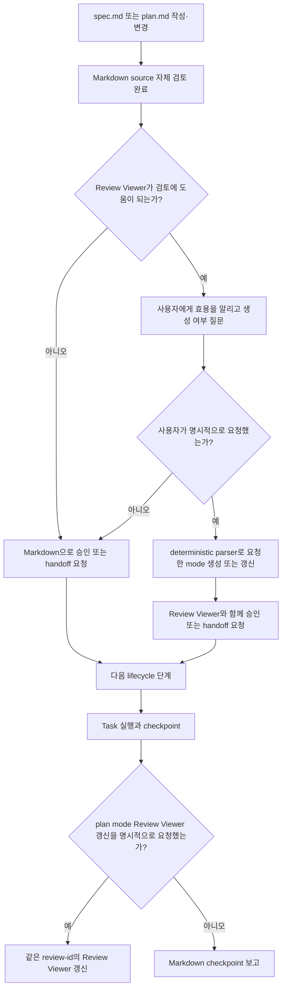
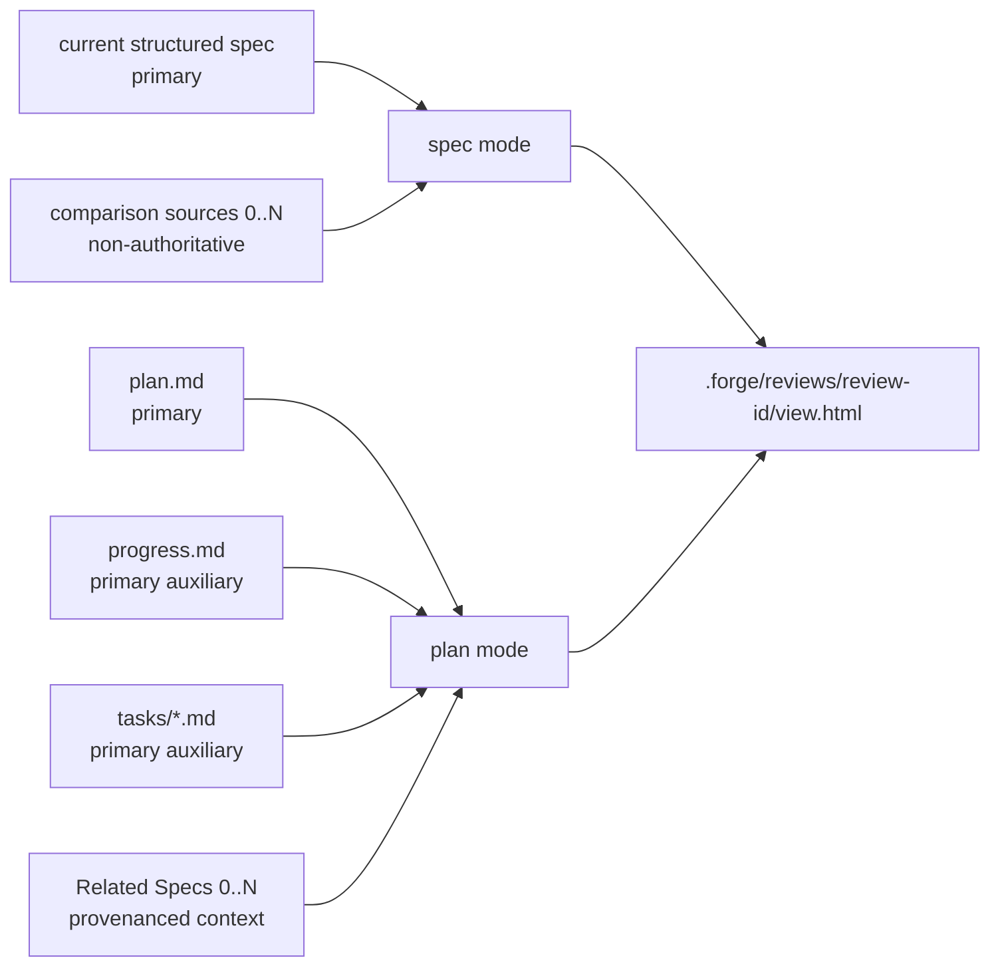
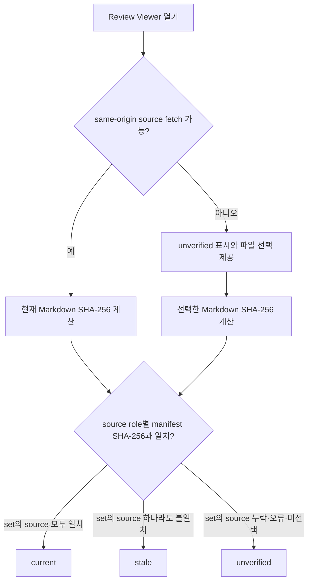

# 사람 중심 Review Viewer

## Overview

Forge의 spec과 plan이 커질수록 원본 Markdown만으로 전체 흐름, 책임 경계, Task 의존성, R·AC coverage를 검토하기 어렵다. Review Viewer는 영구 관리되는 spec과 작업 단위로 생성·삭제되는 plan의 source ownership을 보존하면서, 사용자가 명시적으로 요청한 시점에 사람이 내용을 단계적으로 이해할 수 있는 읽기 전용 HTML snapshot을 `spec` 또는 `plan` mode로 제공한다.

Review Viewer의 목적은 텍스트를 그림으로 치환하는 것이 아니다. 같은 정보를 `요약표 → 시각 흐름 → 상세 source → acceptance evidence` 순서로 읽게 하고, primary source와 comparison·context source의 provenance를 구분해 검토 화면을 제공하는 것이다.

비목표:
- Review Viewer를 spec이나 plan을 대신하는 편집 가능한 source of truth로 만들지 않는다.
- Review Viewer 안에서 source에 없는 런타임 의미, 요구사항, 의존성 또는 설계 결정을 새로 만들지 않는다.
- Notion, Google Docs, 별도 문서 사이트를 필수 운영 요소로 추가하지 않는다.
- Review Viewer 검토 결과만으로 제품 구현 완료나 governing spec의 lifecycle status `implemented`를 선언하지 않는다.
- 생성된 개별 Review Viewer를 구현 산출물처럼 별도 렌더링·레이아웃 검증하지 않는다.
- 사용자의 명시적 요청 없이 spec·plan·checkpoint의 Review Viewer를 생성하거나 갱신하지 않는다.
- spec과 plan이 항상 1:1로 대응한다고 가정하거나 두 문서의 내용을 하나의 combined Viewer에 병합하지 않는다.
- spec 갱신과 함께 상시 생성되는 Spec Pages의 lifecycle·경로·검증 계약을 이 기능에 포함하지 않는다. Spec Pages는 `docs/specs/008-structured-spec-pages/spec.md`가 소유하는 별도 artifact다.

검토한 접근안:

| 접근안 | 장점 | 단점 | 결정 |
|---|---|---|---|
| `review-viewer`로 이름과 사용자 개념 통일 | spec·plan 검토라는 목적과 요청형 lifecycle이 이름에 드러남 | 기존 `spec-viewer` 참조 migration 필요 | 채택 |
| 별도 `plan-viewer` 추가 | 역할 이름이 명확함 | shell, locale, mobile, 검증 로직이 중복됨 | 제외 |
| spec과 plan의 combined Viewer 유지 | 하나의 화면에서 traceability를 볼 수 있음 | 독립 수명 주기와 `0..N` 관계를 1:1 lifecycle처럼 오해하게 만듦 | 제외 |
| 외부 문서 사이트 또는 협업 문서 사용 | 공유와 댓글 기능이 강함 | 배포·권한·동기화 비용과 source drift 위험이 큼 | 제외 |

## Requirements

R(Requirement)는 시스템이 반드시 제공해야 하는 동작이나 제약을 뜻한다.

- R1. Forge는 `docs/specs/NNN-<slug>/spec.md`를 요구사항과 승인 상태의 source of truth로 계속 유지해야 한다.
- R2. MODIFIED — Forge는 `docs/plans/PPP-<slug>/plan.md`를 작업 단위의 목표, Route, Task, 파일, Interface, 검증 절차의 source of truth로 유지해야 하며 plan 번호는 spec 번호와 독립적으로 부여해야 한다.
- R3. MODIFIED — Review Viewer는 읽기 전용 파생 snapshot이어야 하며, Review Viewer에서 spec·plan·progress·comparison·context source를 직접 수정하지 않아야 한다.
- R4. MODIFIED — Review Viewer가 생성된 이후 source가 변경되더라도 Forge는 사용자가 명시적으로 갱신을 요청한 경우에만 같은 review를 다시 생성해야 한다.
- R5. MODIFIED — Review Viewer는 source별 role, repository 기준 path, 생성 당시 SHA-256, 생성 시각, mode, locale, 집계 수치를 표시하고 열람 시점의 source SHA-256과 비교해 `current`, `stale`, `unverified` 중 하나의 freshness 상태를 primary, auxiliary, comparison, context 경계와 함께 표시해야 한다.
- R6. MODIFIED — 생성된 Review Viewer는 mode와 관계없이 `.forge/reviews/<review-id>/view.html`에 저장하고 Git 비추적 상태로 유지해야 한다.
- R7. MODIFIED — `writing-specs`는 new·change·clarify·sync 과정에서 사용자의 명시적 요청이 없는 한 spec mode Review Viewer를 생성하거나 갱신하지 않아야 한다.
- R8. MODIFIED — `writing-plans`는 plan 저장 또는 실행 handoff 과정에서 사용자의 명시적 요청이 없는 한 plan mode Review Viewer를 생성하거나 갱신하지 않아야 한다.
- R9. MODIFIED — `executing-plans`는 Review Viewer가 이미 존재하더라도 사용자의 명시적 요청이 없는 한 Task checkpoint 후 plan mode Review Viewer를 갱신하지 않아야 한다.
- R10. MODIFIED — Forge는 복잡도와 관계없이 Markdown을 source 검토의 기본 경로로 사용하고, Review Viewer는 요청형 보조 검토 화면으로만 사용해야 한다.
- R11. MODIFIED — 복잡도 점수는 R 8개 초과, AC 8개 초과, Mermaid 2개 이상, 데이터·Interface 표 2개 이상, 여러 subsystem·actor·Place·상태 전이, 문서 200줄 초과, 미해결 clarification 또는 change history 다수 항목에 각각 1점을 부여하되 Review Viewer 자동 생성 조건으로 사용하지 않아야 한다.
- R12. MODIFIED — 복잡도 점수가 2 이상이면 Forge는 Review Viewer가 검토에 도움이 될 수 있음을 사용자에게 알리고 필요하면 명시적으로 요청할 수 있다고 안내하되, Review Viewer를 자동 생성하지 않아야 한다.
- R13. MODIFIED — 사용자가 현재 spec이나 plan의 시각화 또는 Review Viewer 생성·갱신을 명시적으로 요청한 경우에만 Forge는 복잡도 점수와 관계없이 해당 Review Viewer를 생성하거나 갱신해야 한다.
- R14. MODIFIED — `review-viewer` skill은 사용자에게 Review Viewer로 소개하고, 서로 독립적인 `spec`과 `plan` 두 mode만 지원해야 한다.
- R15. MODIFIED — `spec` mode에서는 현재 structured `spec.md`를 primary source of truth로 사용하고, 사용자가 지정한 0개 이상의 comparison source를 비권위 비교 자료로 읽되 모든 내용에 source role과 provenance를 표시해야 한다.
- R16. MODIFIED — `plan` mode에서는 `plan.md`와 존재하는 경우 같은 디렉터리의 `progress.md`, `tasks/*.md`를 primary source set으로 사용하고, plan의 `Related Specs` 0개 이상을 제품 요구사항을 설명하는 context source로 읽되 plan source와 병합하거나 동일한 ownership으로 표시하지 않아야 한다.
- R17. REMOVED — spec과 plan의 `0..N` 관계와 독립 수명 주기를 보존하기 위해 `combined` mode를 제공하지 않아야 한다.
- R18. MODIFIED — `spec`과 `plan` mode 출력은 모두 `.forge/reviews/<review-id>/view.html`을 사용하고, 동일한 `review-id`의 갱신은 사용자의 명시적 요청이 있을 때만 허용해야 한다.
- R19. MODIFIED — build command는 기존 `--offline`과 함께 `--mode spec|plan`, `--locale en|ko`, `--review-id`를 지원해야 한다. spec mode는 current spec과 선택적인 comparison source를 받고, plan mode는 primary source set과 plan이 선언한 Related Specs context를 결정적으로 해석하며, 기본 locale은 `en`으로 유지해야 한다.
- R20. `--locale ko`에서는 tab을 `개요`, `요구사항`, `흐름`, `데이터와 인터페이스`, `승인 기준`, `변경 이력`으로 표시해야 한다.
- R21. MODIFIED — 모든 Review Viewer mode는 `overview`, `requirements`, `flows`, `data`, `acceptance`, `history`의 6개 고정 panel ID를 유지해야 한다.
- R22. MODIFIED — plan mode의 Overview는 목표, primary plan의 Task·Step 집계, context spec별 R·AC 집계, 읽기 순서, 사용자 경험, 완료 상태를 분리해 보여줘야 한다.
- R23. MODIFIED — plan mode의 Requirements는 Global Constraints, 핵심 정책, Route별 적용 범위와 Related Specs context를 source별 provenance와 함께 보여줘야 한다.
- R24. plan mode의 Flows는 Route map, Task dependency, runtime 또는 확장 흐름을 보여줘야 한다.
- R25. plan mode의 Data & Interfaces는 runtime 책임, 서버 권위, 파일, Remote, transaction, Interface 계약을 보여줘야 한다.
- R26. MODIFIED — plan mode의 Acceptance는 plan에 명시된 Related Specs의 R·AC 참조만 사용해 namespaced R→AC→Task→Step·검증 mapping을 보여주고, 관련 spec이 없으면 Task→Step·검증 mapping을 검토 상태와 함께 보여줘야 한다.
- R27. MODIFIED — plan mode의 History는 plan 상태, Task checkbox, Progress History, 선택적인 `progress.md`·`tasks/*.md`, primary·auxiliary·context source별 role·path·hash, checkpoint, 관련 commit, 재생성 command를 보여줘야 한다.
- R28. MODIFIED — Review Viewer는 원문 상세를 처음부터 펼치지 않고 요약, 시각 흐름, 상세 source, acceptance evidence 순서로 배치해야 한다.
- R29. MODIFIED — Review Viewer는 spec mode에서 current spec과 comparison source의 R·AC·Mermaid 수를 source별로 분리하고, plan mode에서 primary source set의 Task·Step·Mermaid 수와 Related Specs context의 R·AC·Mermaid 수를 source별로 분리해 summary에 표시해야 한다.
- R30. MODIFIED — 집계 기준은 structured parser가 인식한 `### Task N` heading, `Step N` checkbox, Requirements의 unique R-ID, Acceptance Criteria의 unique AC-ID, Mermaid fence 수로 고정해야 한다. plan primary set 안의 Task·Step은 중복 제거하고, context R·AC는 `<spec-id>:R<n>`과 `<spec-id>:AC<n>` namespace로 구분해야 한다.
- R31. MODIFIED — scale fixture는 current spec에 R 190개, AC 105개, Mermaid 9개를 두고 독립된 plan primary set에 Task 22개, Step 110개와 Related Specs context 0..N을 두며, 각 Review Viewer 집계는 source role별 실제 수와 정확히 일치해야 한다.
- R32. `writing-plans`는 6~10개의 Route 또는 Milestone으로 Task를 묶고 각 Task가 하나의 primary Route에 속하도록 작성해야 한다.
- R33. scale fixture의 Task 22개는 8개의 Expedition Route로 묶여 실행 순서와 dependency가 표시되어야 한다.
- R34. MODIFIED — plan mode는 plan에 명시된 spec path, R·AC 참조와 Task·Step 관계만 사용해 namespaced R→AC→Task→Step deep link를 만들고, plan에 없는 cross-source 관계를 추론하지 않아야 한다.
- R35. MODIFIED — spec mode의 current·comparison R·AC deep link와 plan mode의 context R·AC·Task·Step deep link는 source namespace를 포함해 DOM ID 충돌 없이 해당 Review Viewer의 panel과 대상을 열어야 한다.
- R36. MODIFIED — AC 검토 checkbox와 Step 검토 checkbox는 source namespace와 종류를 구분해 localStorage에 저장해야 하며 제품 검증 PASS/FAIL로 표시되지 않아야 한다.
- R37. MODIFIED — current spec과 comparison spec의 Mermaid는 source text를 byte-for-byte 변경하지 않고 재사용하며 각각 `Current spec source` 또는 `Comparison source`와 source path를 표시해야 한다.
- R38. MODIFIED — plan primary set과 Related Specs context에 작성된 Mermaid는 각 source에서 그대로 가져오고 각각 `Plan source` 또는 `Related spec context`와 source path를 표시해야 한다.
- R39. MODIFIED — Review Viewer가 source에서 계산한 Route, Task dependency, explicit coverage mapping 도식은 `Derived view`로 명시해야 한다.
- R40. MODIFIED — derived diagram은 Task 번호, 명시된 Route membership, 명시된 dependency, source-qualified R·AC mapping처럼 selected source에서 기계적으로 계산 가능한 정보만 포함해야 한다.
- R41. MODIFIED — Review Viewer는 source에 없는 새로운 런타임 책임, transaction 순서, 상태 전이 또는 설계 결정을 derived diagram에 추가하지 않아야 한다.
- R42. 모든 diagram 앞에는 제목, 이 화면에서 확인할 것, 한 문장의 읽는 법을 표시해야 한다.
- R43. 넓은 sequence diagram 앞에는 actor별 runtime 책임을 요약한 표를 먼저 제공해야 한다.
- R44. 넓은 Mermaid diagram은 독립 가로 스크롤 wrapper 안에 표시하고 SVG를 viewport 폭에 맞춰 무조건 축소하지 않아야 한다.
- R45. sequence diagram과 넓은 dependency diagram에는 읽을 수 있는 최소 폭을 적용해야 한다.
- R46. 각 diagram은 title, description, `aria-label` 또는 동등한 접근성 연결을 가져야 한다.
- R47. Mermaid parse나 render가 실패하면 오류 요약, 가능한 오류 line·column, 원문 source를 함께 표시해야 한다.
- R48. HTML shell은 inline favicon을 포함해 로컬 브라우저 검증에서 favicon 404를 만들지 않아야 한다.
- R49. 집계 수치와 상태 표는 tabular number를 사용해야 한다.
- R50. 넓은 표는 독립 가로 스크롤 wrapper를 사용해 문서 전체 viewport 폭을 확장하지 않아야 한다.
- R51. MODIFIED — Review Viewer shell, template, style, script 또는 runtime 동작을 변경할 때는 desktop 1440px와 mobile 390px에서 tab, 표, diagram, deep link, checkbox를 검증해야 하지만, 고정 shell로 개별 `view.html`을 생성할 때는 이 검증을 반복하지 않아야 한다.
- R52. mobile에서 sequence diagram 글자를 읽기 어려우면 책임 요약표 또는 세로 flowchart를 먼저 제공하고 원본 diagram은 가로 스크롤로 유지해야 한다.
- R53. MODIFIED — `writing-plans`는 목표와 완료 상태, `Related Specs`, Implementation Route 또는 Milestone, Task dependency, Runtime responsibility, 주요 데이터 흐름, Place 또는 platform 확장 지점, Task별 검증 mapping, checkpoint와 사용자 검토 시점을 plan 필수 구조로 요구해야 한다. 관련 spec이 있으면 Task별 R·AC mapping에 source spec path 또는 동등한 namespace를 포함해 여러 spec의 같은 R·AC ID를 구분해야 한다.
- R54. 복잡한 plan은 Task dependency 또는 Route map, runtime responsibility 또는 transaction flow, 확장 구조 또는 multi-Place flow의 세 diagram 관점을 포함해야 한다.
- R55. `writing-plans`는 Task 22개를 한 diagram에 평면적으로 연결하지 않고 먼저 6~10개의 Route로 묶도록 요구해야 한다.
- R56. MODIFIED — plan의 diagram과 책임 표는 plan에서 선택한 언어로 작성하되 Related Specs context에서 인용한 값과 API, service, schema, code identifier는 원문을 유지하고 source provenance를 표시해야 한다.
- R57. MODIFIED — 고정 Review Viewer shell로 spec 또는 plan `view.html`을 생성하는 작업은 `web-app-design`, `website-design`, deprecated `ui-design`을 적용하지 않아야 하며, Review Viewer shell·template·style 자체를 변경할 때만 `web-app-design`을 적용해야 한다.
- R58. MODIFIED — agent가 수동으로 작성한 HTML content fragment를 Review Viewer 입력으로 사용하지 않아야 한다.
- R59. MODIFIED — Review Viewer의 Signature는 장식이 아니라 `Route Map`, `Runtime Atlas`, `AC Coverage`의 콘텐츠 구조에서 만들어야 한다.
- R60. diagram 추가는 제목, 읽는 법, mobile 대체 요약표와 한 묶음으로 검토해야 한다.
- R61. MODIFIED — Review Viewer의 각 panel 제목은 스캔 가능한 짧은 명사형 label을 사용하고, 사용자가 그 화면에서 답을 찾을 질문은 제목을 대체하지 않고 제목 바로 아래의 종속 orientation 문장으로 표시해야 한다. `writing-tone`은 그 orientation 문장이 시스템 이름이 아니라 사용자의 질문에 맞춰지도록 요구해야 한다.
- R62. MODIFIED — Review Viewer copy는 이 화면에서 확인할 것을 먼저 말하고, 번역해도 의미가 유지되는 label은 사용자 언어로 쓰며 고유 API·service·schema 이름만 원문으로 유지해야 한다.
- R63. MODIFIED — Review Viewer copy는 요약→시각 흐름→원문 상세 순서로 구성하고 각 diagram 앞에 한 문장의 읽는 법을 제공해야 한다.
- R64. MODIFIED — 고정 Review Viewer tooling으로 개별 spec 또는 plan `view.html`을 생성하는 작업은 `verifying-work`를 적용하지 않고, build command 성공을 생성 완료의 충분한 근거로 사용해야 한다.
- R65. MODIFIED — 생성된 개별 Review Viewer에는 별도 `--check`, source count·hash·Mermaid 일치 확인, unresolved placeholder·shell markup 검사 같은 post-build 검증을 수행하지 않아야 한다.
- R66. MODIFIED — 생성된 개별 Review Viewer에는 desktop·390px mobile render, screenshot, layout, print, tab, deep link, checkbox persistence, Mermaid, offline, freshness 상태의 브라우저 검증을 수행하지 않아야 한다.
- R67. MODIFIED — Review Viewer 생성 결과만으로 governing product spec의 lifecycle status를 `implemented`로 변경하지 않아야 하며, Review Viewer parser·builder·template·style·script·runtime 동작 변경은 일반 구현 검증과 관련 AC 검증을 따라야 한다.
- R68. MODIFIED — `writing-specs`와 `writing-plans`는 각각 Markdown source 작성과 자체 검토가 끝난 뒤 승인 또는 다음 lifecycle handoff를 요청할 때, Review Viewer가 검토에 도움이 되는 경우 사용자에게 생성 여부를 물어야 한다.
- R69. MODIFIED — 기존 Review Viewer의 source가 변경되면 Forge는 그 Review Viewer가 stale임을 사용자에게 알릴 수 있지만, 명시적 요청 전에는 stale Review Viewer를 갱신하거나 현재 검토 화면으로 제시하지 않아야 한다.
- R70. MODIFIED — `.forge/`는 Review Viewer, build staging, 로컬 조사 기록처럼 공유하거나 영구 보존하지 않는 artifact에만 사용하고, `.forge/reviews/`를 포함한 로컬 artifact를 Git 비추적 상태로 유지해야 한다.
- R71. ADDED — spec은 프로젝트 수명 동안 영구 관리하고, plan은 작업 단위로 생성하며 작업 종료 뒤 보존 가치가 없으면 plan 디렉터리 전체를 삭제할 수 있어야 한다.
- R72. MODIFIED — plan은 `Related Specs`에서 0개 이상의 spec ID, repository 기준 path와 선택적인 R·AC 참조를 canonical entry로 선언할 수 있어야 하며, path와 ID의 불일치·중복·존재하지 않는 참조를 허용하지 않아야 한다. Plan의 경로·번호·수명 주기는 특정 spec에 종속시키지 않아야 한다.
- R73. ADDED — 제품 동작을 변경하는 plan은 하나 이상의 approved spec을 참조해야 하며, spec 없이 작성하는 plan은 Forge ceremony floor에 해당하는 작업이나 제품 동작을 바꾸지 않는 운영·조사 작업으로 제한해야 한다.
- R74. ADDED — plan의 진행 상태는 기본적으로 `plan.md`의 Task checkbox와 `Progress History`에서 관리하고, 기록이 길거나 여러 실행 주체가 독립적으로 갱신할 때만 같은 plan 디렉터리의 `progress.md`를 사용해야 한다.
- R75. ADDED — Task별 독립 소유권·병렬 실행·독립 승인이 필요한 큰 plan만 `docs/plans/PPP-<slug>/tasks/*.md`로 Task를 분리하고, 작은 plan은 단일 `plan.md`를 유지해야 한다.
- R76. ADDED — 삭제 예정 plan의 영구 보존 가치가 있는 제품 결정은 삭제 전에 governing spec, ADR 또는 동등한 영구 문서로 이전해야 한다.
- R77. MODIFIED — Review Viewer는 생성 시점에 각 source의 role, repository 기준 path, source namespace와 SHA-256을 manifest에 기록하되 생성 시점 freshness를 열람 시점의 최신성 보장으로 표시하지 않아야 한다.
- R78. MODIFIED — Review Viewer를 HTTP 또는 HTTPS의 same-origin에서 열면 repository 내부의 각 source를 `cache: no-store`로 읽고 Web Crypto API로 SHA-256을 다시 계산해 manifest의 hash와 자동 비교해야 한다.
- R79. MODIFIED — `file://` 또는 브라우저 보안 정책으로 source 자동 읽기가 실패하면 Review Viewer는 `unverified`를 표시하고 basename이 같은 여러 `spec.md`도 source namespace로 구분해 로컬 Markdown source를 선택·매칭할 수 있어야 한다.
- R80. ADDED — 수동 freshness 검증을 위해 선택한 파일 내용은 브라우저 밖으로 업로드하거나 전송하지 않아야 한다.
- R81. MODIFIED — source별 freshness를 각각 표시하고 primary set과 comparison·context set의 aggregate freshness를 분리해야 한다. 각 set은 하나라도 `stale`이면 `stale`, stale 없이 하나라도 검증하지 못하면 `unverified`, 모든 source가 일치할 때만 `current`로 표시해야 한다.
- R82. ADDED — source fetch 실패, 누락, 파일명 충돌 또는 hash 계산 실패를 `current`로 간주하지 말고 source별 실패 원인과 다시 검증할 방법을 표시해야 한다.
- R83. MODIFIED — command-line freshness check는 로컬 Review Viewer manifest의 source hash와 현재 Markdown source를 비교해 모두 일치하면 성공하고, stale·누락·manifest 오류가 있으면 실패해야 한다. 이 checker는 사용자가 요청한 Review Viewer를 자동 갱신하는 trigger로 사용하지 않아야 한다.
- R84. ADDED — 조사·debug 기록은 로컬 작업 중 `.forge/`에 둘 수 있지만 팀이 공유하거나 장기 보존할 기록은 `docs/research/`, `docs/debug/` 또는 해당 프로젝트의 영구 문서 경로로 승격해야 한다.
- R85. ADDED — Review Viewer builder는 selected Markdown source를 deterministic structured parser로 해석해 6개 panel content와 manifest를 생성하고, agent가 작성한 HTML content fragment나 source 밖의 보충 문장을 입력으로 요구하지 않아야 한다.
- R86. ADDED — `docs/specs/NNN-<slug>/index.html`과 `docs/specs/index.html`로 상시 관리되는 Spec Pages는 Review Viewer가 아니며, 이 spec의 명시적 요청 gate, `.forge/reviews/` 출력, build-success 예외를 적용하지 않아야 한다. Spec Pages의 생성·갱신·검증 계약은 `docs/specs/008-structured-spec-pages/spec.md`가 소유해야 한다.
- R87. ADDED — builder는 해당 Review Viewer가 렌더링할 source Mermaid와 derived diagram을 합쳐 하나 이상 포함할 때만 Mermaid runtime asset을 embed하거나 CDN loader를 출력해야 한다. Diagram이 없는 snapshot은 runtime을 생략해야 하며, 생략 여부는 selected source bytes와 build option에서만 결정적으로 계산해야 한다. `--offline` snapshot은 runtime을 생략한 경우에도 외부 network 없이 열려야 한다.
- R88. ADDED — Review Viewer의 Overview panel은 R29가 정의한 source별 집계를 스캔 가능한 요약 지표로 먼저 제시하고, 상세 집계 표를 그 아래에 유지해야 한다. 요약 지표는 R30이 고정한 집계 기준에서만 계산해야 한다.
- R89. ADDED — 같은 source의 provenance를 같은 panel 안에서 연속 block마다 반복 표시하지 않아야 한다. Provenance는 한 panel 안에서 같은 source가 연속되는 block 묶음마다 그 묶음의 첫 block에 한 번만 표시하고, 인용 source가 바뀌는 첫 block에서 다시 표시해야 한다. 축약은 R15·R16의 source role 구분과 R35의 namespace 구분을 약화시키지 않아야 하며, manifest와 History panel의 전체 provenance 기록은 축약하지 않아야 한다.
- R90. ADDED — R87–R89의 렌더링 변경은 Review Viewer shell·template·style·runtime 변경이므로 R51과 R67에 따라 desktop 1440px와 mobile 390px 검증, 관련 AC 검증을 수행해야 한다. 이 변경은 개별 `view.html` 생성 작업에 post-build 검증을 다시 도입하지 않아야 한다.

## Behavior & Flows

Review Viewer를 사용자 요청에 따라 제공하는 흐름:



mode별 source ownership:



Review Viewer 열람 시 freshness 판정 흐름:



사람이 정보를 읽는 순서:


## Data & Interfaces

mode별 source 계약:

| Mode | Primary source set | Comparison·context source | 허용되는 시각 정보 | 출력 |
|---|---|---|---|---|
| `spec` | current structured `docs/specs/NNN-<slug>/spec.md` | 사용자가 선택한 comparison source 0..N | current·comparison Mermaid 원문, source별 R·AC와 차이 | `.forge/reviews/<review-id>/view.html` |
| `plan` | `docs/plans/PPP-<slug>/plan.md`, 선택적인 `progress.md`, `tasks/*.md` | plan이 선언한 Related Specs 0..N | plan·context Mermaid 원문, 명시된 Route·dependency·coverage에서 계산한 derived view, 진행 상태 | `.forge/reviews/<review-id>/view.html` |

plan `Related Specs` canonical entry:

```markdown
**Related Specs:**
- id: 008-structured-spec-pages
  path: docs/specs/008-structured-spec-pages/spec.md
  requirements: [R1, R2]
  acceptance: [AC1]
```

각 entry의 `id`와 `path`는 필수이고 `requirements`, `acceptance`는 빈 목록을 허용하되 항상 명시한다. 관련 spec이 없는 plan은 `**Related Specs:** None — <ceremony-floor 또는 non-product 이유>`를 사용한다. Parser는 이 제한된 문법만 받아 source-qualified mapping을 만들며 path escape, 중복 ID, invalid 또는 non-approved product spec을 거부한다.

6개 panel의 plan mode mapping:

| Panel ID | 한국어 label | Plan mode 내용 |
|---|---|---|
| `overview` | 개요 | 목표, 완료 상태, primary Task·Step 수량, context spec별 R·AC 수량, 읽기 순서 |
| `requirements` | 요구사항 | Global Constraints, 핵심 정책, Route 적용 범위, Related Specs provenance |
| `flows` | 흐름 | Expedition Route, Task dependency, runtime·확장 흐름 |
| `data` | 데이터와 인터페이스 | 서버 권위, 파일, Remote, transaction, Interface 계약 |
| `acceptance` | 승인 기준 | 명시된 namespaced R→AC→Task→Step·검증 mapping, 검토 checkbox |
| `history` | 변경 이력 | source role·namespace·path·hash, checkpoint, commit, 재생성 command |

Review Viewer 추천을 위한 복잡도 점수:

| Signal | 점수 |
|---|---:|
| R 8개 초과 | 1 |
| AC 8개 초과 | 1 |
| Mermaid 2개 이상 | 1 |
| 데이터·Interface 표 2개 이상 | 1 |
| 여러 subsystem·actor·Place·상태 전이 | 1 |
| 문서 200줄 초과 | 1 |
| clarification 또는 change history 다수 | 1 |

이 점수는 사용자에게 Review Viewer의 잠재적 효용을 알릴지 판단하는 신호일 뿐, HTML을 자동 생성하거나 갱신하는 권한이 아니다.

build interface 목표:

```text
build-review-viewer.sh \
  --mode spec|plan \
  --locale en|ko \
  --review-id <review-id> \
  [--spec docs/specs/NNN-<slug>/spec.md] \
  [--comparison <path>]... \
  [--plan docs/plans/PPP-<slug>/plan.md] \
  [--progress docs/plans/PPP-<slug>/progress.md] \
  [--tasks-dir docs/plans/PPP-<slug>/tasks] \
  [--offline]

build-review-viewer.sh --check .forge/reviews/<review-id>/view.html
```

source manifest:

| Field | 의미 |
|---|---|
| `mode` | `spec` 또는 `plan` |
| `locale` | tab과 shell copy locale |
| `sources[]` | role, repository 기준 path, source namespace, SHA-256, 선택된 R·AC 참조 |
| `generated_at` | 재생성 시각 |
| `counts` | spec source별 R·AC·Mermaid와 plan primary set의 Task·Step·Mermaid 수 |
| `freshness` | primary와 comparison·context set별 `current`, `stale`, `unverified`; 초기값은 `unverified` |
| `rebuild_command` | 동일 review-id의 Review Viewer를 명시적으로 재생성하는 command |

문서 저장 구조:

```text
docs/
├── specs/
│   └── NNN-<slug>/
│       └── spec.md
├── plans/
│   └── PPP-<slug>/
│       ├── plan.md
│       ├── progress.md      # 선택
│       └── tasks/           # 선택
│           └── TTT-<slug>.md
├── research/                # 공유·장기 보존할 조사 기록
└── debug/                   # 공유·장기 보존할 root-cause 기록

.forge/
├── reviews/
│   └── <review-id>/
│       └── view.html
├── scratch/
└── viewer-build/
```

Review Viewer shell의 inherited visual system:

| 항목 | 선언 | 이유 |
|---|---|---|
| Class | Utilitarian, inherited | 장식보다 빠른 문서 탐색이 우선이다. |
| Type | 현재 16px base와 1.25 scale inherited | 긴 문서와 표를 읽는 기준을 유지한다. |
| Palette | 현재 neutral·green accent inherited | 상태와 deep link를 절제된 한 색으로 강조한다. |
| Spacing | 현재 shell spacing inherited | fragment가 임의 밀도를 만들지 않게 한다. |
| Depth | border 전략 inherited | 표, code, panel 경계를 그림자 없이 구분한다. |
| Signature | Route Map, Runtime Atlas, AC Coverage | Viewer 고유성은 장식이 아니라 source 관계를 읽는 구조에서 나온다. |

변경 대상:

| 대상 | 주요 변경 |
|---|---|
| `review-viewer` | 요청형 Review Viewer, 두 mode, source role·provenance, deterministic parser, 로컬 output, freshness, panel mapping |
| `viewer-template.html` | 3단계 freshness UI, source fetch·파일 선택 검증, locale, mobile diagram·table wrapper, 접근성, favicon, 오류 표시 |
| `build-review-viewer.sh` | `--mode spec|plan`, review ID·output naming, comparison·context sources, `--check`, offline 유지 |
| `writing-specs` | Markdown 기본 source 검토, Review Viewer 효용 안내, 완료 후 생성 여부 질문 |
| `writing-plans` | 독립 plan ID, 선택적 Related Specs, plan 디렉터리, 진행·Task 분리 기준 |
| `executing-plans` | plan 디렉터리의 상태·진행 기록과 요청이 있을 때만 plan mode Review Viewer 갱신 |
| `web-app-design` | 개별 View 생성 제외와 Viewer tooling 변경 시 browser app UI 검증 |
| `writing-tone` | 질문형 제목, 읽는 법, 요약 우선, locale copy |
| `verifying-work` | 개별 View 생성 제외, Viewer tooling 검증, `implemented` 금지 |
| `using-forge`, portability rules, README | `docs/specs`, `docs/plans`, `.forge/reviews` Git 비추적 계약 동기화 |
| `systematic-debugging` | 로컬 debug note와 공유·장기 보존 root-cause 문서의 승격 경로 구분 |

## Acceptance Criteria

AC(Acceptance Criterion)는 연결된 R이 충족됐다고 판단할 수 있는 관찰 가능한 완료 기준을 뜻한다.

- AC1 (R1–R9, R69): MODIFIED — 기존 spec mode Review Viewer가 있는 상태에서 spec을 변경해도 Forge는 Review Viewer를 자동 갱신하지 않고 stale 사실만 알리며, 사용자가 갱신을 명시적으로 요청한 뒤에만 같은 review-id의 `.forge/reviews/<review-id>/view.html`을 새 source hash와 내용으로 갱신하고 Git 비추적 상태를 유지한다.
- AC2 (R10–R13): MODIFIED — 복잡도 1점과 2점인 문서는 모두 Markdown source 검토 경로를 기본으로 사용하고, 2점인 문서에서는 Review Viewer의 효용만 안내하며, 사용자가 시각화를 명시적으로 요청한 문서만 Review Viewer 경로를 사용한다.
- AC3 (R14–R16, R18–R20): MODIFIED — `review-viewer`로 독립된 spec fixture와 plan fixture를 각각 `spec`, `plan` mode, `--locale ko`, 서로 다른 review ID로 build하면 `.forge/reviews/<review-id>/view.html`이 생성되고 tab label이 한국어로 표시되며 `combined` mode 요청은 거부된다.
- AC4 (R15, R37, R85): MODIFIED — current structured spec과 comparison source가 있는 fixture를 spec mode로 build하면 deterministic parser가 각 source의 R·AC·Mermaid를 분리하고 `Current spec source`와 `Comparison source` provenance를 표시하며 각 Mermaid text의 SHA-256이 source fence와 일치한다.
- AC5 (R16, R22–R23, R26–R30, R34–R36): MODIFIED — `plan.md`, `progress.md`, `tasks/*.md`로 나뉜 Task 22개·Step 110개와 Related Specs 0..N fixture를 plan mode로 build하면 primary Task·Step count와 context spec별 R·AC count가 분리되고, namespaced deep link와 R→AC→Task→Step mapping에는 plan이 명시한 source-qualified 참조만 나타난다.
- AC6 (R31–R33): MODIFIED — Related Specs context가 있는 scale fixture의 Task 22개가 8개 Expedition Route로 표시되고 Route 순서와 Task membership이 plan primary source set과 일치하며 context source가 Route membership을 바꾸지 않는다.
- AC7 (R37–R41): MODIFIED — spec mode와 plan mode에서 source Mermaid와 derived diagram을 표시하면 `Current spec source`, `Comparison source`, `Plan source`, `Related spec context`, `Derived view`가 해당 source가 존재하는 범위에서 구분되고 path가 표시되며 derived node·edge는 selected source에 명시된 관계만 포함한다.
- AC8 (R42–R43, R61–R63): 모든 diagram 앞에 제목, 이 화면에서 확인할 것, 한 문장의 읽는 법이 있고 넓은 sequence diagram 앞에는 runtime 책임 요약표가 먼저 표시된다.
- AC9 (R44–R45, R50–R52): 390px viewport에서 넓은 sequence diagram과 표가 문서 viewport를 확장하지 않고 각 wrapper 안에서 가로 스크롤되며 책임 요약표를 먼저 읽을 수 있다.
- AC10 (R46–R49): diagram 접근성 이름, inline favicon, tabular number가 DOM과 computed style에 존재하고 favicon 404가 발생하지 않는다.
- AC11 (R47): 잘못된 Mermaid fixture를 열면 다른 panel은 정상 동작하고 오류 diagram에는 오류 요약, 가능한 line·column, 원문 source가 표시된다.
- AC12 (R35–R36): MODIFIED — current·comparison·context spec의 같은 R·AC ID와 plan의 Task·Step이 함께 있는 Review Viewer에서 deep link와 검토 checkbox를 변경하고 page를 reload하면 source namespace별 target과 checkbox 상태가 충돌 없이 복원된다.
- AC13 (R53–R56, R72–R75): MODIFIED — 복잡한 plan을 작성하면 독립 plan ID, 선택적인 `Related Specs`, source-qualified R·AC mapping, 필수 구조, 6~10 Route grouping, plan source로부터 만든 diagram 관점, checkpoint가 존재하고 Task 분리는 독립 소유권·병렬 실행·독립 승인 조건에서만 사용된다.
- AC14 (R57–R60, R85): MODIFIED — 고정 shell에서 개별 Review Viewer를 생성할 때 UI 디자인 skill을 적용하거나 수동 HTML fragment를 작성하지 않고 deterministic parser가 6개 panel을 생성하며, Review Viewer shell·template·style 자체를 변경할 때만 `web-app-design`을 적용한다.
- AC15 (R64–R67): MODIFIED — 고정 Review Viewer tooling으로 개별 View를 build하면 성공한 build에서 작업을 종료하고 별도 checker나 브라우저 검증을 실행하지 않으며 governing spec의 lifecycle status를 변경하지 않는다. Review Viewer tooling 자체를 변경하면 이 예외 없이 일반 구현 검증을 수행한다.
- AC16 (R18–R19): MODIFIED — `.forge/reviews/<review-id>/view.html`의 CDN build와 `--offline` build가 모두 열리고 offline 파일에는 외부 Mermaid script 요청이 없으며 diagram이 렌더된다.
- AC17 (R21–R28): MODIFIED — plan mode에서 6개 panel이 모두 존재하고 각 panel 내용이 mode mapping과 source ownership에 일치하며 요약→시각 흐름→상세 source→acceptance evidence 순서가 유지된다.
- AC18 (R5, R27, R77–R82): MODIFIED — History panel에서 source role·namespace·path·생성 당시 hash, mode, locale, source별 counts, 생성 시각, checkpoint, commit, rebuild command를 확인할 수 있고 primary와 comparison·context freshness가 각각 `unverified`, `stale`, `current`로 표시된다.
- AC19 (R51, R65–R66): MODIFIED — Review Viewer shell·template·style·script·runtime 동작을 변경한 경우에만 desktop 1440px와 mobile 390px browser 검증에서 tab, namespaced deep link, checkbox persistence, diagram, table, print layout이 정상이며 Mermaid error가 0개임을 확인하고, 개별 View 생성에서는 해당 검증을 실행하지 않는다.
- AC20 (R21, R58, R85): MODIFIED — Review Viewer builder tooling fixture에서 Markdown source만 입력하면 deterministic parser가 정확히 6개 panel과 source manifest를 만들고 unresolved placeholder·수동 content fragment·source 밖 의미가 0개다. 개별 View 생성 뒤에는 이 fixture나 동등한 검사를 반복하지 않는다.
- AC21 (R68): MODIFIED — spec 또는 plan의 Markdown source 작성과 자체 검토가 끝나면 Review Viewer가 유용한 경우 승인 또는 handoff 메시지에서 생성 여부를 묻고, 사용자의 명시적 응답 전에는 Review Viewer HTML이 생성되지 않는다.
- AC22 (R9, R13, R16, R69): MODIFIED — 기존 plan mode Review Viewer가 있는 Task checkpoint에서 primary set이나 Related Specs context가 변경되어도 자동 갱신하지 않고 Markdown으로 보고하며, 사용자가 갱신을 명시적으로 요청한 경우에만 current primary set과 context sources를 포함해 같은 review-id를 재생성한다.
- AC23 (R1–R2, R6, R18, R70–R71): MODIFIED — 새 spec과 새 plan은 각각 독립된 docs 경로를 유지하고, 명시적 생성 요청을 받은 Review Viewer만 `.forge/reviews/<review-id>/view.html`에 생성되며 Git 추적 파일 목록에는 source 옆 `view.html`이나 Review Viewer가 나타나지 않는다.
- AC24 (R72–R73): 관련 spec이 없는 운영 plan, 하나의 approved spec을 참조하는 기능 plan, 여러 approved spec을 참조하는 교차 기능 plan을 canonical Related Specs 문법으로 작성하면 모두 독립 plan 경로를 유지한다. Path와 ID 불일치, 중복 ID, 존재하지 않는 R·AC, repository path escape와 approved spec 없이 제품 동작을 변경하려는 plan은 작성 단계에서 거부된다.
- AC25 (R74–R76): 작은 plan의 진행 상태는 `plan.md`만으로 관리되고, 긴 checkpoint fixture는 `progress.md`, 독립 소유권이 있는 큰 Task fixture는 `tasks/*.md`를 사용하며, plan 삭제 전 영구 결정이 governing spec 또는 ADR로 이전됐는지 확인된다.
- AC26 (R77–R78): MODIFIED — HTTP same-origin으로 Review Viewer를 열고 source를 변경하지 않은 경우 role별 `cache: no-store` fetch와 Web Crypto SHA-256 비교 뒤 `current`가 표시되고, source 한 바이트를 변경하면 해당 source set이 `stale`로 표시된다.
- AC27 (R79–R80): MODIFIED — `file://`에서 자동 source 접근이 실패하면 `unverified`와 파일 선택 동작이 표시되고, basename이 같은 여러 related `spec.md`를 source namespace에 맞게 선택하면 로컬 브라우저 안에서만 hash가 계산되어 상태가 갱신되며 네트워크 전송이 발생하지 않는다.
- AC28 (R81–R82): MODIFIED — primary plan set과 Related Specs context를 가진 Review Viewer에서 primary와 context aggregate 상태가 분리되고, 각 set 안에서 모두 일치하면 `current`, 하나가 다르면 `stale`, stale 없이 하나가 누락되면 `unverified`가 표시되며 각 source 행에 개별 상태와 실패 원인이 나타난다.
- AC29 (R83): MODIFIED — `--check`를 현재 로컬 Review Viewer에 실행하면 exit code 0을 반환하고, source 변경·누락·manifest 오류 fixture에서는 non-zero를 반환하지만 Review Viewer를 자동 재생성하지 않는다.
- AC30 (R70, R84): 조사·debug 중간 기록은 `.forge/`에서 Git 비추적 상태로 유지되고, 공유 또는 장기 보존 대상으로 결정한 기록은 `docs/research/` 또는 `docs/debug/`로 이동해 Git 추적된다.
- AC31 (R86): ADDED — Review Viewer workflow를 실행하면 Spec Pages를 생성·갱신하지 않으며, `docs/specs/NNN-<slug>/index.html`과 `docs/specs/index.html`의 lifecycle·검증은 Review Viewer 요청 유무와 관계없이 `docs/specs/008-structured-spec-pages/spec.md`의 요구사항으로만 판정된다.
- AC32 (R87): ADDED — source Mermaid와 derived diagram이 모두 0개인 source set과 하나 이상인 source set을 각각 `--offline`으로 build하면 전자의 generated bytes에는 Mermaid runtime이 없고 후자에는 있으며, 두 snapshot 모두 network를 차단한 브라우저에서 오류 없이 열린다. CDN mode에서도 diagram이 0개인 snapshot에는 loader가 출력되지 않고, 같은 입력 재build diff는 0이다.
- AC33 (R88): ADDED — spec mode와 plan mode Review Viewer의 Overview panel을 열면 source별 요약 지표가 먼저 보이고 상세 집계 표가 그 아래에 남아 있으며, 두 표시의 수치가 R30 집계 기준으로 계산한 값과 서로 일치한다.
- AC34 (R61, R89): ADDED — 여러 block이 같은 source를 인용하는 fixture에서 각 panel의 provenance 표시 횟수가 source group당 1회로 줄고, source role이 바뀌는 지점에서 다시 나타나며, primary·comparison·context 구분과 namespaced deep link 대상이 축약 전과 동일하다. Manifest와 History panel에는 모든 source의 role·path·hash가 그대로 남는다. 각 panel 제목은 명사형 label이고 질문 문장은 제목 아래 orientation 문장으로 표시된다.
- AC35 (R90): ADDED — R87–R89 구현에서 desktop 1440px와 mobile 390px의 tab, 표, diagram, deep link, checkbox 검증이 수행되고, 이후 개별 `view.html` 생성 작업에는 post-build checker·browser 검증이 추가되지 않는다.

## Decisions & History

- 2026-07-12 [DECISION] 기존 `spec-viewer`를 `spec`, `plan`, `combined` mode를 가진 lifecycle review viewer로 확장한다. 별도 `plan-viewer`를 만들지 않는다.
- 2026-07-12 [DECISION] spec과 plan은 각각 source of truth로 유지하고 Viewer는 읽기 전용 파생 산출물로 유지한다.
- 2026-07-12 [DECISION] Viewer HTML은 기본적으로 커밋하지 않는다. 대신 source 변경과 checkpoint마다 자동 재생성하고 source hash·freshness·rebuild command로 최신성을 관리한다.
- 2026-07-12 [DECISION] 6개 panel ID를 mode 전체에서 유지하고 label과 copy만 locale에 맞게 바꾼다.
- 2026-07-12 [DECISION] scale fixture는 Task 22개, Step 110개, R 190개, AC 105개, spec Mermaid 9개와 8개 Expedition Route를 사용한다.
- 2026-07-12 [DECISION] source Mermaid, plan Mermaid, derived diagram을 명확히 구분하고 derived diagram에는 기계적으로 계산 가능한 관계만 허용한다.
- 2026-07-12 [DECISION] Viewer의 정보 순서는 요약표 → 시각 흐름 → 상세 Task → AC evidence → 원문 source로 고정한다.
- 2026-07-12 [REJECTED] 별도 `plan-viewer` skill: shell과 locale·mobile·검증 로직이 중복된다.
- 2026-07-12 [REJECTED] generated HTML을 기본 커밋: 큰 binary-like diff와 source drift를 만들 수 있다.
- 2026-07-12 [REJECTED] Notion·Google Docs·별도 docs site를 필수 검토 경로로 사용: source 동기화와 운영 부담이 증가한다.
- 2026-07-12 [CHANGE] R4, R7–R13 MODIFIED: 복잡도나 기존 Viewer 존재 여부에 따른 자동 생성·갱신을 제거하고, 사용자의 명시적 요청만 Viewer 작업을 허용한다.
- 2026-07-12 [CHANGE] R68–R69 ADDED: Markdown source 완료 후 Viewer의 효용을 알리고 생성 여부를 묻되, stale Viewer는 요청 없이 갱신하거나 현재 검토 화면으로 제시하지 않는다.
- 2026-07-12 [DECISION] 사용자가 Viewer 명시 요청 정책 change delta를 승인했다.
- 2026-07-12 [DECISION] Viewer opt-in policy, stale 무갱신 evidence, lifecycle builder regression, desktop·390px browser interaction을 fresh verification해 AC1–AC22가 PASS했다.
- 2026-07-13 [CHANGE] R2, R6, R18 MODIFIED 및 R70–R76 ADDED: spec은 `docs/specs/`에서 영구 관리하고 plan은 독립 번호의 `docs/plans/` 작업 디렉터리에서 생성·삭제하며, 생성된 View는 각 source 옆에 두어 Git으로 공유하고 `.forge/`는 로컬 임시 작업에만 사용한다.
- 2026-07-13 [CHANGE] R14, R16–R19, R34–R35 MODIFIED 또는 REMOVED: spec과 plan의 `0..N` 관계를 반영해 `combined` mode를 제거하고 독립적인 spec View와 plan View만 유지한다.
- 2026-07-13 [CHANGE] R5 MODIFIED 및 R77–R83 ADDED: Viewer freshness는 열람 시점의 실제 Markdown SHA-256으로 `current`, `stale`, `unverified`를 판정하고, same-origin 자동 검사·로컬 파일 선택 fallback·command-line check를 제공한다.
- 2026-07-13 [DECISION] plan 진행 상태는 기본적으로 `plan.md`에 기록하고, 긴 실행 기록은 `progress.md`, 독립 소유권이 필요한 큰 Task만 `tasks/*.md`로 분리한다.
- 2026-07-13 [DECISION] plan은 경로와 ID 면에서 spec에 종속되지 않고 `Related Specs`로 0개 이상의 spec을 참조할 수 있지만, 제품 동작 변경에는 기존 approved spec gate를 유지한다.
- 2026-07-13 [CHANGE] R84 ADDED: `.forge/`의 조사·debug 기록은 로컬 임시 자료로 취급하고, 공유하거나 장기 보존할 자료만 `docs/research/` 또는 `docs/debug/`로 승격한다.
- 2026-07-13 [DECISION] 사용자가 독립 spec·plan 문서 구조, combined Viewer 제거, plan 진행 기록 구조, 열람 시 SHA-256 freshness 검증 변경안을 승인했다.
- 2026-07-13 [CHANGE] R51, R57, R64–R67과 AC14–AC15, AC19 MODIFIED: 생성된 개별 spec·plan View는 사용자 검토용 보조 산출물로 취급하고 성공한 build 뒤 별도 checker, 브라우저, screenshot, viewport, layout, interaction 검증을 수행하지 않는다. Viewer tooling 자체의 변경에는 기존 구현 검증을 유지한다.
- 2026-07-13 [DECISION] 사용자가 Markdown source의 정확성 검증은 유지하되 생성된 개별 HTML View의 post-build 레이아웃 검증은 제외하는 변경을 승인했다.
- 2026-07-31 [CHANGE] R57과 AC14 MODIFIED: `ui-design` 분리 계획에 따라 개별 Viewer 생성은 모든 UI 디자인 스킬에서 제외하고 Viewer tooling 변경은 `web-app-design`으로 라우팅한다.
- 2026-07-31 [APPROVED] 사용자가 R57과 AC14의 `web-app-design`·`website-design` Viewer routing delta를 승인하고 구현 계획 진행을 요청했다.
- 2026-08-01 [CHANGE] R3–R16, R18–R19, R21–R23, R26–R31, R34–R41, R51, R53, R56–R59, R61–R70, R77–R83 MODIFIED 또는 REMOVED 및 R85–R86 ADDED: 사용자 개념과 skill 이름을 Review Viewer·`review-viewer`로 통일하고, 명시적 요청 gate와 `spec|plan` mode는 유지하면서 output을 Git 비추적 `.forge/reviews/<review-id>/view.html`로 이동한다.
- 2026-08-01 [CHANGE] AC1–AC7, AC12–AC23, AC26–AC29 MODIFIED 및 AC31 ADDED: spec comparison source, plan primary·context source, source별 count, namespaced traceability, deterministic parser, local freshness와 Spec Pages 경계를 관찰 가능한 기준으로 갱신한다.
- 2026-08-01 [DECISION] spec mode는 current structured spec을 primary로, 선택된 comparison source를 비권위 비교 자료로 사용한다. plan mode는 `plan.md`·선택적 `progress.md`·`tasks/*.md`를 primary set으로, Related Specs 0..N를 provenance가 표시된 context로 사용한다.
- 2026-08-01 [DECISION] plan mode의 R→AC→Task→Step mapping은 plan에 명시된 source-qualified 참조만 사용하고, context spec의 R·AC ID와 deep link는 spec namespace로 구분한다.
- 2026-08-01 [DECISION] Review Viewer panel content는 deterministic structured parser가 Markdown source에서 생성하며 수동 HTML content fragment 입력을 제거한다.
- 2026-08-01 [DECISION] 상시 Spec Pages는 Review Viewer와 다른 artifact이며 `docs/specs/008-structured-spec-pages/spec.md`가 lifecycle·경로·검증 계약을 소유한다.
- 2026-08-01 [CHANGE] R72와 AC24 MODIFIED: plan의 Related Specs를 spec ID, repository 기준 path, R·AC 목록을 가진 canonical entry로 고정하고 path escape·불일치·중복·invalid reference를 거부한다.
- 2026-08-01 [APPROVED] 사용자가 요청형 Review Viewer, `.forge/reviews/` 비추적 output, structured source provenance와 상시 Spec Pages 분리를 승인하고 구현 진행을 요청했다.
- 2026-08-03 [DECISION] Mermaid runtime은 렌더링할 diagram이 있을 때만 embed한다. 측정에서 40줄 fixture spec의 `--offline` snapshot이 3.59MB로 나왔고, 원인은 diagram 유무와 무관한 runtime 인라인이었다.
- 2026-08-03 [DECISION] panel 제목은 명사형 label로 되돌리고 기존 질문 문장은 제목 아래 orientation 문장으로 유지한다. 질문형 제목의 방향 제시 효과는 남기면서 목차와 tab의 스캔 비용을 줄인다.
- 2026-08-03 [DECISION] provenance는 panel·source group당 1회로 축약하되 manifest와 History panel의 전체 기록은 유지한다. 40줄 fixture에서도 같은 출처 문자열이 6회 반복돼 실제 규모에서는 소음이 된다.
- 2026-08-03 [CHANGE] R61 MODIFIED 및 R87–R90, AC32–AC35 ADDED: 조건부 Mermaid runtime embed, Overview 요약 지표, provenance 반복 축약, 명사형 panel 제목과 shell 변경 검증 범위를 추가한다.
- 2026-08-03 [APPROVED] 사용자가 조건부 Mermaid runtime, Overview 요약 지표, provenance 반복 축약과 명사형 panel 제목 delta를 승인하고 계획 작성을 요청했다.
