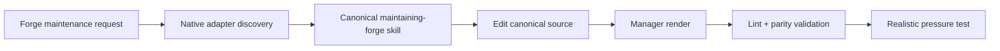

# Forge 유지보수 canonical extension

Status: approved

## Overview

Forge 플러그인은 설치 사용자가 실행하는 스킬만 배포한다. Forge 자체를 개선하거나 배포 구조를 수정하는 저장소 전용 절차는 `.agent-extensions/maintaining-forge/`를 단일 정본으로 삼고, Codex·Claude Code·Antigravity의 native entry는 manager가 생성하고 소유하는 adapter로 유지한다.

범위에 포함하지 않는 항목:

- Forge 사용자 실행 스킬의 spec-first 동작 변경
- Marketplace 설치 명령이나 플러그인 이름 변경
- 저장소 전용 유지보수 스킬의 사용자 환경 전역 설치
- 배포 패키지 생성 또는 원격 push

## Requirements

- R1. `plugins/forge/skills/`에는 설치 사용자가 실행하는 스킬만 존재해야 하며, `maintaining-forge`와 유지보수 전용 reference는 포함하지 않아야 한다.
- R2. `.agent-extensions/maintaining-forge/`는 `extension.json`, canonical `skills/maintaining-forge/SKILL.md`, portability reference, agent별 ownership state를 포함하는 repository-scope skill extension이어야 한다.
- R3. `.agents/skills/maintaining-forge/SKILL.md`와 `.claude/skills/maintaining-forge/SKILL.md`는 canonical skill을 가리키는 manager-rendered adapter여야 하며 독립 절차를 포함하거나 수동으로 수정해서는 안 된다.
- R4. canonical skill은 Forge 스킬·manifest·hook·validator·설치 스크립트·배포 문서의 작성, 검토, 검증, pressure test, release gate를 설명하고 Codex·Claude Code·Antigravity portability 규칙을 제공해야 한다.
- R5. `scripts/validate.sh`는 plugin skills, canonical extension skills, native adapters를 lint하고 모든 repository extension에 manager `validate`를 실행해 collision, drift, parity 오류를 거부해야 한다.
- R6. Marketplace와 `scripts/install.sh`는 `plugins/forge/`만 배포하며 `.agent-extensions/`, `.agents/skills/`, `.claude/skills/`의 repository-only 항목을 설치 사용자에게 복사하지 않아야 한다.
- R7. README와 현재 설계 문서는 repository-only workflow의 정본을 `.agent-extensions/`로 설명하고 legacy `.agent-runbooks/`를 현재 경로로 안내하지 않아야 한다.
- R8. canonical 또는 native same-name entry의 충돌·drift는 manager ownership state로 판정하며 암묵적으로 덮어쓰지 않아야 한다.

## Behavior & Flows

저장소 기여자가 Forge 유지보수 작업을 요청하면 각 agent는 native adapter를 발견하고 동일한 canonical skill을 읽는다. 변경은 canonical source에만 적용한 뒤 manager render로 adapter와 state를 갱신한다. 검증은 일반 skill lint와 manager parity 검사를 모두 통과해야 한다.

구조 선택:

| 방식 | 장점 | 단점 | 결정 |
|---|---|---|---|
| `.agent-extensions/` canonical + manager-owned adapters | 한 정본, 세 agent discovery, hash 기반 drift 감지 | 기존 wrapper를 명시적으로 adopt해야 함 | 채택 |
| `.agent-runbooks/` + 수동 wrapper | 단순한 파일 구조 | ownership·drift 판정이 없고 새 manager 계약과 중복됨 | superseded |
| 별도 maintainer plugin | 독립 설치 가능 | Marketplace에 내부 유지보수 개념이 노출됨 | 제외 |

## Data & Interfaces

| 역할 | 경로 | 책임 |
|---|---|---|
| Extension manifest | `.agent-extensions/maintaining-forge/extension.json` | scope, target, component 선언 |
| Canonical skill | `.agent-extensions/maintaining-forge/skills/maintaining-forge/SKILL.md` | 전체 유지보수 절차의 정본 |
| Canonical reference | `.agent-extensions/maintaining-forge/skills/maintaining-forge/references/portability-rules.md` | cross-agent portability 규칙 |
| Ownership state | `.agent-extensions/maintaining-forge/adapters/<agent>/state.json` | owner, canonical hash, native target hash |
| Codex + Antigravity adapter | `.agents/skills/maintaining-forge/SKILL.md` | canonical pointer |
| Claude Code adapter | `.claude/skills/maintaining-forge/SKILL.md` | canonical pointer |
| User skills | `plugins/forge/skills/*/SKILL.md` | Marketplace 설치 사용자 workflow |

## Acceptance Criteria

- AC1 (R1, R6): `plugins/forge/skills/maintaining-forge`가 없고 설치 스크립트가 repository-only extension이나 adapter를 배포하지 않는다.
- AC2 (R2, R4): canonical manifest, skill, portability reference, codex·claude-code·antigravity state가 존재하며 frontmatter와 내용 검증을 통과한다.
- AC3 (R3): 두 native adapter가 동일한 canonical `SKILL.md`를 가리키고 별도 유지보수 절차를 복제하지 않는다.
- AC4 (R5, R8): manager `validate`가 PASS를 반환하고, 임시 adapter drift를 주입하면 main validator가 실패한 뒤 unrelated content를 변경하지 않는다.
- AC5 (R5): canonical skill root에 금지 토큰을 주입한 probe를 main validator가 거부한다.
- AC6 (R7): README와 현재 설계 문서가 `.agent-extensions/maintaining-forge/`를 repository-only source로 안내한다.
- AC7 (R4, R8): 현실적인 pressure scenario에서 agent가 canonical source만 수정하고 validation·pressure-test·push authorization gate를 유지한다.
- AC8 (R2, R3): legacy `.agent-runbooks/`가 제거되고 manager render를 다시 실행해도 collision이나 drift 없이 parity가 유지된다.

## Decisions & History

- 2026-07-12 [DECISION] Forge는 사용자 실행용 플러그인으로 한정하고 Forge 자체 개선 절차는 저장소 전용으로 분리한다.
- 2026-07-12 [DECISION] `.agent-runbooks/` 공용 정본과 수동 thin wrapper 구조를 채택했다.
- 2026-07-12 [CHANGE] 기존 배포 스킬 `maintaining-forge`를 사용자 플러그인에서 제거하고 repository-only workflow로 재분류했다.
- 2026-07-14 [CHANGE] cross-agent ownership과 drift 검사를 제공하는 `.agent-extensions/` 구조가 기존 `.agent-runbooks/` 구조를 supersede한다.
- 2026-07-14 [DECISION] 사용자가 기존 same-name wrapper의 adopt와 legacy runbook 제거를 승인했다.
