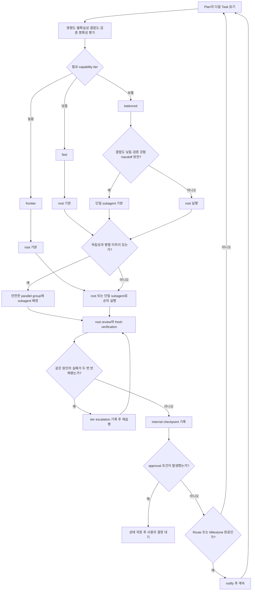
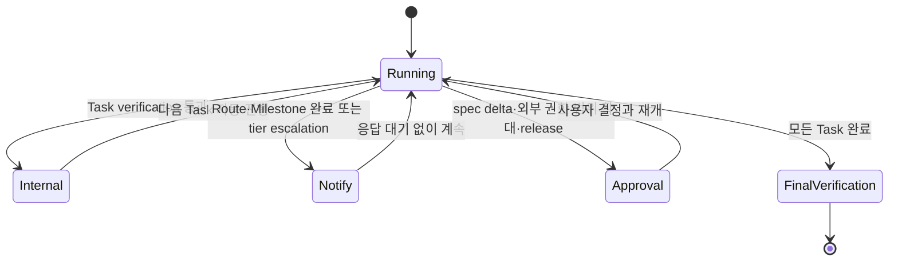

# 적응형 실행 라우팅과 비차단 Checkpoint

Status: approved

## Overview

Forge는 구현 계획의 Task 특성에 따라 적절한 LLM capability tier와 실행 주체를 자동으로 선택하고, 독립적인 작업은 subagent로 병렬 처리한다. Task마다 사용자 응답을 기다리던 checkpoint는 내부 기록과 비차단 알림으로 분리하며, 사용자 결정이나 추가 권한이 필요한 경우에만 실행을 멈춘다.

이 변경은 실행 속도를 높이면서도 spec-first gate, TDD, 검증, progress ledger, root agent의 최종 책임을 유지하는 것이 목적이다.

비목표:
- Forge skill에 특정 시점의 model slug를 영구적으로 고정하지 않는다.
- subagent가 spec 승인, spec delta 결정, 최종 완료 판정 또는 release 권한을 대신 행사하게 하지 않는다.
- Task별 테스트, commit, progress ledger 같은 내부 복구 지점을 제거하지 않는다.
- 파일이나 상태를 공유하는 Task를 무조건 병렬 실행하지 않는다.
- 사용자 요청 없이 HTML Viewer를 생성하거나 갱신하지 않는다.

검토한 접근안:

| 접근안 | 장점 | 단점 | 결정 |
|---|---|---|---|
| Task마다 사용자 approval checkpoint | 진행 상태와 결과를 자주 검토할 수 있음 | 응답 대기 때문에 실행 흐름이 반복해서 끊김 | 제외 |
| 중간 checkpoint 완전 제거 | 가장 빠르게 연속 실행 가능 | divergence와 외부 권한 경계를 늦게 발견할 수 있음 | 제외 |
| 내부 checkpoint + 비차단 notify + 제한된 approval | 복구 가능성과 사용자 통제를 유지하면서 연속 실행 가능 | checkpoint 유형과 escalation 규칙이 필요함 | 채택 |

## Requirements

R(Requirement)는 시스템이 반드시 제공해야 하는 동작이나 제약을 뜻한다.

### 자동 capability-tier 라우팅

- R1. plan 실행을 시작할 때 root agent는 각 Task의 영향도, 불확실성, context 결합도, 검증 명확성을 평가해 실행 route를 자동으로 결정해야 한다.
- R2. Forge는 model slug 대신 `fast`, `balanced`, `frontier` capability tier를 사용해야 하며, 플랫폼별 설정이 각 tier를 실제 model과 reasoning 설정에 연결하도록 해야 한다.
- R3. 범위가 좁고 영향도가 낮으며 결정적 검증이 있고 source-of-truth 결정을 포함하지 않는 Task는 `fast` tier를 우선 사용해야 한다.
- R4. Interface와 완료 조건이 명확한 일반 구현, 테스트, 문서 작업은 `balanced` tier를 기본값으로 사용해야 한다.
- R5. spec·architecture 결정, 높은 영향도, 큰 불확실성, 여러 subsystem에 걸친 변경, 보안·데이터 위험, 약한 검증 신호 중 하나라도 있는 Task는 `frontier` tier를 사용해야 한다.
- R6. 실행 중 같은 원인의 검증 실패가 두 번 반복되거나 root agent가 Task의 route 판단 근거가 무효라고 확인하면, Forge는 한 단계 높은 tier로 자동 escalation하고 progress ledger에 이유를 기록해야 한다.
- R7. 플랫폼이 custom agent role이나 model 선택을 지원하지 않으면 Forge는 선택한 tier에 현재 model을 상속해야 한다. 이 경우에도 subagent 기능이 있으면 병렬 실행할 수 있고, subagent 기능까지 없을 때만 동일한 route·검증 규칙으로 순차 실행해야 하며, 지원하지 않는 model 선택이나 subagent 호출을 가장하지 않아야 한다.
- R28. ADDED — `fast` tier Task는 root agent가 직접 실행하는 것을 기본값으로 사용해야 한다. 단, 여러 정형 Task가 병렬 안전성 조건을 모두 만족하고 dispatch·review 비용보다 wall-clock 절감이 큰 경우에는 병렬 subagent 실행을 선택할 수 있어야 한다.
- R29. ADDED — `balanced` tier Task는 `context_coupling=low`, `verification_clarity=strong`, 완전한 handoff, 독립적인 write ownership을 모두 만족하고 root review가 직접 실행보다 저렴하면 단일 subagent 실행을 기본값으로 사용해야 한다. 하나라도 만족하지 않으면 root agent가 실행해야 한다.
- R30. ADDED — `frontier` tier Task는 root agent가 직접 실행하는 것을 기본값으로 사용해야 한다. 증거 수집처럼 source-of-truth 판단과 분리된 bounded work만 subagent에 위임할 수 있으며, spec·architecture·security·data safety·root cause·최종 통합 판단은 root agent가 소유해야 한다.
- R31. ADDED — Forge는 R28–R30의 기본 실행 주체를 사용자에게 매번 질문하지 않고 자동 선택해야 한다. 사용자가 `root-only`, subagent 사용 여부 또는 동시 실행 상한을 명시한 경우에는 그 선호를 안전성 조건 안에서 우선 적용하고, 자동 위임 결과는 notify 또는 최종 보고에서 알려야 한다.

### Subagent와 병렬 실행

- R8. Forge는 입력, 출력, Interface, 파일 소유권, 검증 방법이 명확하고 다른 진행 중 Task와 dependency나 write 대상이 겹치지 않는 Task만 subagent에 위임해야 한다.
- R9. 독립적인 Task가 둘 이상이고 병렬 실행의 예상 이득이 coordination 비용보다 크면 root agent는 사용자 승인 없이 subagent 병렬 실행을 선택할 수 있어야 한다.
- R10. plan의 dependency, Files, Interfaces, Route 또는 Milestone 정보를 기준으로 병렬 안전성을 판단해야 하며, 정보가 부족하거나 충돌 가능성이 있으면 순차 실행을 선택해야 한다.
- R11. 동시에 실행하는 subagent 수는 플랫폼 제한과 사용자 설정을 모두 지켜야 하며, 별도 사용자 설정이 없으면 최대 3개로 제한해야 한다.
- R12. root agent는 subagent 결과를 그대로 완료 처리하지 않고 diff와 산출물을 검토하고, Task verification을 fresh하게 실행한 뒤에만 완료로 기록해야 한다.
- R13. root agent는 spec과 plan의 source of truth 수정, 결과 통합, approval 요청, 최종 verification과 완료 판정을 계속 소유해야 한다.

### Checkpoint 분류와 연속 실행

- R14. Forge는 checkpoint를 `internal`, `notify`, `approval` 세 유형으로 구분해야 한다.
- R15. `internal` checkpoint는 각 Task가 끝날 때 verification 실행, plan checkbox 갱신, progress ledger 기록, 계획된 local commit을 수행해야 하며, 성공하면 사용자 응답을 기다리지 않고 다음 Task를 계속 실행해야 한다.
- R16. `notify` checkpoint는 Route 또는 Milestone 완료, `frontier` tier Task 완료, 자동 tier escalation 발생 시 진행 상황과 증거를 사용자에게 알리되, 응답을 기다리지 않고 다음 안전한 작업을 계속해야 한다.
- R17. `approval` checkpoint는 다음 경우에만 실행을 멈추고 사용자 결정을 기다려야 한다.
  - spec과 현실이 충돌해 spec delta가 필요한 경우
  - destructive action, external write, 구매·유료 자원 또는 합의된 비용 한도 초과가 필요한 경우
  - 승인된 범위를 실질적으로 확대하거나 사용자가 선택해야 하는 제품·설계 분기가 생긴 경우
  - push, publish, deploy, release처럼 외부에 결과를 공개하는 경계를 넘는 경우
- R18. local file edit, test, 계획된 local commit, capability tier 선택, subagent 위임, 병렬 실행, internal checkpoint, notify checkpoint만으로는 사용자 approval을 요구하지 않아야 한다.
- R19. approval checkpoint에서 root agent는 완료된 작업을 progress ledger에 먼저 기록하고, 필요한 결정, 선택지, 영향, 응답 후 재개 지점을 사용자에게 명확히 제시한 뒤 멈춰야 한다.
- R20. 모든 Task가 끝나면 Forge는 별도의 중간 approval 없이 the forge verifying-work skill로 이동하고, 최종 검증 결과를 사용자에게 보고해야 한다.

### 계획, 기록과 투명성

- R21. `writing-plans`는 각 Task에 정확한 dependency, Files, Interfaces, verification을 제공하고, 사용자 결정이 실제로 필요한 지점만 `approval` gate로 표시해야 한다.
- R22. `executing-plans`는 기존의 Task별 사용자 checkpoint를 제거하고, Task별 internal checkpoint와 Route 또는 Milestone 단위 notify checkpoint를 사용해야 한다.
- R23. progress ledger는 Task별 capability tier, 실행 주체, 병렬 group, route 선택 이유, escalation, verification, commit 범위를 기록해야 한다.
- R24. notify와 최종 보고는 어떤 Task가 어느 tier와 실행 방식으로 처리됐는지 요약해야 하며, model slug나 내부 reasoning 전문을 요구하지 않아야 한다.
- R25. 기존 Viewer가 있거나 checkpoint가 발생했다는 사실만으로 Viewer를 생성하거나 갱신하지 않아야 하며, Viewer 작업은 사용자의 명시적 요청이 있을 때만 수행해야 한다.
- R26. distributed Forge skill은 `fast`, `balanced`, `frontier`의 의미와 fallback 동작만 정의하고, 실제 model·agent role mapping은 platform adaptation reference 또는 사용자 설정에 두어야 한다.
- R27. `frontier` tier에서 같은 원인의 verification failure가 반복되거나 tier escalation 후에도 같은 failure가 다시 발생하면 자동 재시도를 중단하고 the forge systematic-debugging skill로 원인을 조사해야 한다. 조사 결과가 spec divergence나 추가 사용자 권한을 요구할 때만 approval checkpoint로 전환해야 한다.

## Behavior & Flows

Task 자동 라우팅과 연속 실행 흐름:



Checkpoint 상태 전이:



## Data & Interfaces

Task route 결정 기록:

| Field | Type | 의미 |
|---|---|---|
| `task_id` | string | plan의 `Task N` 식별자 |
| `impact` | `low\|medium\|high` | 실패 또는 변경의 영향도 |
| `uncertainty` | `low\|medium\|high` | 요구사항·원인·해법의 불확실성 |
| `context_coupling` | `low\|medium\|high` | 여러 파일·subsystem·의사결정과의 결합도 |
| `verification_clarity` | `strong\|partial\|weak` | 완료를 결정적으로 검증할 수 있는 정도 |
| `tier` | `fast\|balanced\|frontier` | 선택한 capability tier |
| `execution_mode` | `root\|subagent\|parallel` | 실행 주체와 방식 |
| `parallel_group` | string, nullable | 함께 실행 가능한 group 식별자 |
| `reason` | string | route 선택의 짧은 근거 |

Checkpoint 계약:

| Type | 기록 | 사용자 알림 | 응답 대기 | 다음 동작 |
|---|---|---|---|---|
| `internal` | Task verification, checkbox, ledger, commit | 필수 아님 | 아니오 | 다음 Task 계속 |
| `notify` | Milestone, evidence, tier escalation | 예 | 아니오 | 다음 안전한 작업 계속 |
| `approval` | 완료 범위, blocker, 결정 선택지, 재개 지점 | 예 | 예 | 사용자 결정 후 재개 |

progress ledger 예시:

```text
Task 2: routed (tier=balanced, mode=subagent, group=route-1, reason="isolated implementation with deterministic tests")
Task 2: complete (commits a1b2c3d..d4e5f6a; verification="test-build-viewer: all checks passed")
Route 1: notify (Tasks 1-3 complete; next=Route 2)
Task 5: escalated (balanced->frontier; reason="same verification failure repeated twice")
```

Platform mapping 예시:

| Forge tier | 요구 capability | 플랫폼 mapping 원칙 |
|---|---|---|
| `fast` | 좁은 범위, 낮은 latency, 정형 작업 | 사용 가능한 효율형 model 또는 현재 model의 낮은 reasoning 설정 |
| `balanced` | 일반 coding·testing·documentation | 플랫폼의 기본 coding model과 균형 reasoning 설정 |
| `frontier` | 복잡한 판단, 높은 위험, 넓은 context | 사용 가능한 최고 capability model과 높은 reasoning 설정 |

기본 execution mode:

| Tier | 기본 실행 주체 | 자동 변경 조건 |
|---|---|---|
| `fast` | `root` | 여러 정형 Task가 병렬 안전성 조건을 모두 만족하고 coordination 비용보다 실행 시간 절감이 큰 경우 `parallel` |
| `balanced` | `subagent` | 낮은 context 결합도, 강한 검증, 완전한 handoff, 독립 write ownership을 모두 만족하지 않으면 `root`; 독립 Task가 둘 이상이면 안전성 gate 통과 후 `parallel` |
| `frontier` | `root` | source-of-truth 판단과 분리된 bounded evidence collection만 `subagent` 가능 |

변경 대상:

| 대상 | 주요 변경 |
|---|---|
| `executing-plans` | 자동 tier·subagent route, internal·notify·approval checkpoint, 연속 실행 |
| `writing-plans` | dependency·파일 소유권·Interface·approval gate 명시 |
| `using-forge` platform reference | capability tier와 custom agent role mapping, unsupported fallback |
| `verifying-work` | root-owned final verification 유지와 route evidence 확인 |
| 유지보수 pressure test | 자동 병렬화, escalation, 비차단 notify, approval stop 검증 |

## Acceptance Criteria

AC(Acceptance Criterion)는 연결된 R이 충족됐다고 판단할 수 있는 관찰 가능한 완료 기준을 뜻한다.

- AC1 (R1–R5): 영향도와 불확실성이 낮고 결정적 테스트가 있는 정형 Task, 명확한 일반 구현 Task, 보안·데이터 위험이 있는 복합 Task를 입력하면 각각 `fast`, `balanced`, `frontier` tier가 선택되고 route 이유가 ledger에 기록된다.
- AC2 (R6): `balanced` Task에서 같은 원인의 verification failure가 두 번 반복되면 사용자 응답을 기다리지 않고 `frontier`로 escalation하며 이유와 재실행 결과가 ledger에 남는다.
- AC3 (R2, R7, R26): custom agent role과 model 선택은 지원하지 않지만 subagent는 지원하는 환경에서 같은 plan을 실행하면 모든 tier가 현재 model을 상속하면서 안전한 Task는 병렬 실행된다. subagent도 지원하지 않는 환경에서는 호출을 가장하지 않고 순차 실행하며 tier 판단과 검증 절차는 유지된다.
- AC4 (R8–R11): dependency와 write 대상이 겹치지 않는 독립 Task 4개를 실행하면 최대 3개 subagent가 병렬로 실행되고, 나머지 Task는 slot이 생긴 뒤 실행된다.
- AC5 (R8, R10): 같은 파일을 수정하거나 선행 결과에 의존하는 Task를 함께 제시하면 root agent는 병렬화하지 않고 dependency 순서대로 실행한다.
- AC6 (R12–R13): subagent가 Task 완료를 보고하면 root agent가 diff를 검토하고 fresh verification을 실행하기 전에는 plan checkbox와 ledger가 complete로 변경되지 않는다.
- AC7 (R14–R16, R22): 일반 Task가 완료되면 internal checkpoint가 기록되고 다음 Task가 자동 시작되며, Route 완료 시 notify가 전달되지만 사용자 응답을 기다리지 않는다.
- AC8 (R17, R19): 실행 중 spec과 현실의 충돌이 발견되면 완료 상태와 재개 지점이 ledger에 기록되고, spec delta 선택지를 제시한 뒤 사용자 결정을 기다리며 다음 Task는 시작되지 않는다.
- AC9 (R17–R18): 계획된 local edit·test·commit·subagent 배정은 approval 없이 진행되고, push·deploy·유료 자원 사용·범위 확대 직전에는 approval checkpoint에서 멈춘다.
- AC10 (R20): 모든 Task가 internal checkpoint를 통과하면 중간 사용자 승인을 추가로 요구하지 않고 the forge verifying-work skill로 이동해 AC별 fresh evidence를 수집한다.
- AC11 (R21–R24): 생성된 plan과 progress ledger를 검사하면 dependency, Files, Interfaces, 실제 approval gate, tier, 실행 주체, parallel group, route 이유, verification, commit 범위가 추적 가능하다.
- AC12 (R24): Milestone notify와 최종 보고에는 tier와 실행 방식의 요약이 포함되지만 내부 reasoning 전문이나 지원되지 않는 정확한 model slug를 단정하지 않는다.
- AC13 (R25): 기존 combined Viewer가 있는 plan을 internal·notify checkpoint까지 실행해도 HTML timestamp와 source hash가 바뀌지 않으며, 사용자가 갱신을 명시적으로 요청한 뒤에만 Viewer가 재생성된다.
- AC14 (R1–R26): instruction pressure test에서 deadline과 병렬 실행 압력이 함께 주어져도 agent는 충돌 Task를 순차 처리하고, ordinary Task마다 사용자 응답을 기다리지 않으며, spec divergence와 release 경계에서는 멈춘다.
- AC15 (R1–R26): `bash scripts/validate.sh`와 관련 skill 검증을 실행하면 `validate: all checks passed`가 출력되고 distributed skill portability 규칙 위반이 없다.
- AC16 (R6, R17, R27): `frontier` escalation 후 같은 verification failure가 다시 발생하면 자동 재시도가 중단되고 the forge systematic-debugging skill로 전환되며, root cause가 spec divergence나 추가 권한으로 확인되지 않는 한 사용자 approval을 요구하지 않는다.
- AC17 (R28–R30): 동일한 plan에서 정형 `fast` Task, 결합도가 낮고 결정적 검증이 있는 독립 `balanced` Task, source-of-truth 판단을 포함한 `frontier` Task를 route하면 기본 execution mode가 각각 `root`, `subagent`, `root`로 기록된다. `balanced` Task의 handoff 또는 독립성이 불완전하면 `root`로 기록된다.
- AC18 (R9, R11, R18, R31): 안전한 독립 `balanced` Task가 둘 이상이면 사용자에게 실행 방식을 묻지 않고 최대 3개까지 병렬 subagent로 실행하며 notify 또는 최종 보고에서 위임 결과를 알린다. 사용자가 `root-only` 또는 더 낮은 동시 실행 상한을 지정하면 그 설정을 지킨다.

## Decisions & History

- 2026-07-12 [DECISION] Task별 사용자 checkpoint를 제거하고 `internal`, `notify`, `approval` 세 유형으로 분리한다.
- 2026-07-12 [DECISION] internal checkpoint와 notify는 실행을 중단하지 않으며, spec delta·외부 권한·범위 확대·release에만 approval checkpoint를 사용한다.
- 2026-07-12 [DECISION] Forge skill은 고정 model slug 대신 `fast`, `balanced`, `frontier` capability tier를 사용한다.
- 2026-07-12 [DECISION] root agent가 Task 특성에 따라 tier, subagent 위임, 병렬 group을 자동 선택하고 사용자에게 매번 승인을 요청하지 않는다.
- 2026-07-12 [DECISION] subagent 결과는 root review와 fresh verification을 통과한 뒤에만 완료로 인정한다.
- 2026-07-12 [DECISION] 별도 설정이 없을 때 동시 subagent 수는 최대 3개로 제한한다.
- 2026-07-12 [DECISION] model 선택을 지원하지 않아도 subagent가 가능하면 현재 model을 상속해 병렬 실행하고, subagent 기능이 없을 때만 순차 fallback을 사용한다.
- 2026-07-12 [DECISION] `frontier` escalation 이후 같은 failure가 반복되면 자동 재시도를 중단하고 systematic debugging으로 전환한다.
- 2026-07-12 [REJECTED] Task마다 approval checkpoint: 사용자 응답 대기가 연속 실행을 방해한다.
- 2026-07-12 [REJECTED] 모든 checkpoint 제거: spec divergence와 외부 권한 경계를 안전하게 처리할 수 없다.
- 2026-07-12 [DECISION] 사용자가 자동 capability-tier 라우팅과 비차단 checkpoint 스펙을 승인했다.
- 2026-07-12 [DECISION] semantic policy test, portability validator, route evidence audit, 네 가지 fresh-agent pressure scenario를 통해 AC1–AC16이 PASS했다.
- 2026-07-13 [CHANGE] R28–R31 ADDED 및 AC17–AC18 ADDED: `fast`는 root, 독립성과 검증이 명확한 `balanced`는 subagent, `frontier`는 root를 기본 실행 주체로 사용하고, 안전한 자동 위임은 사용자에게 매번 묻지 않도록 실행 mode 기본값을 명시한다.
- 2026-07-13 [DECISION] 사용자가 R28–R31과 AC17–AC18의 기본 execution mode 정책을 승인하고 구현·push·현재 머신 업데이트를 요청했다.
