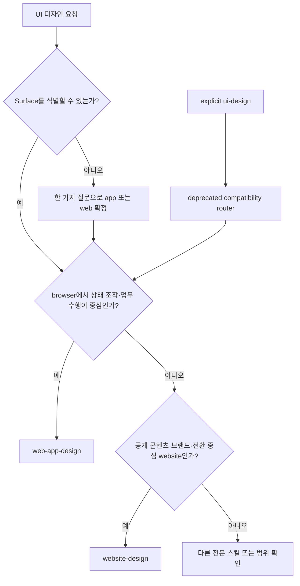
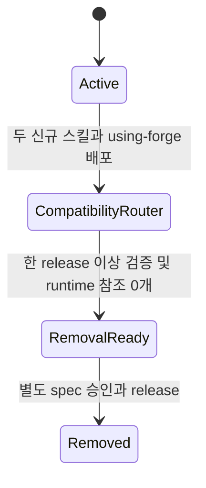

# Forge UI 디자인 스킬 분리와 `ui-design` 폐기

## Overview

현재 `ui-design`은 브라우저 기반 애플리케이션 UI와 표현 중심 웹사이트를 하나의 절차로 다뤄, 밀도·타이포그래피·상태 안정성 기준과 구성·이미지·모션 기준이 충돌할 수 있다. Forge는 이를 `web-app-design`과 `website-design`으로 분리하고, 기존 `ui-design`은 호환 라우터로 축소한 뒤 검증된 마이그레이션 기간 이후 별도 변경에서 삭제한다. 이름은 향후 `mobile-app-design`, `desktop-app-design`처럼 platform별 app skill을 추가해도 trigger가 겹치지 않는 taxonomy를 사용한다.

비목표:
- 이번 변경에서 `ui-design` 디렉터리를 즉시 삭제하지 않는다.
- slide deck, 문서 편집, 개별 고정 Viewer 생성 작업을 두 신규 스킬의 범위에 포함하지 않는다.
- Forge Marketplace release를 사용자 승인 없이 push하지 않는다.
- 두 신규 스킬이 동일한 긴 지침을 공유 파일 경로로 참조하도록 만들지 않는다.

## Requirements

R(Requirement)는 시스템이 반드시 제공해야 하는 동작이나 제약을 뜻한다.

- R1. Forge는 browser에서 실행되는 dashboard, admin panel, settings, table, form, control, internal tool, SaaS workspace, PWA처럼 사용자가 상태를 확인하고 조작하는 화면을 `web-app-design`으로 라우팅해야 한다.
- R2. `web-app-design`은 기존 제품의 visual token과 typography role을 먼저 상속하고, primary setting·secondary description·metadata의 상대 위계, 44px hit area와 보이는 control 크기의 분리, loading·success·error·disabled·mode 전환 전후의 geometry 안정성, keyboard·focus·responsive 상태를 검증해야 한다.
- R3. Forge는 landing page, homepage, marketing site, product page, editorial site, portfolio, public documentation site처럼 콘텐츠 전달·탐색·전환이 중심인 공개 웹사이트를 `website-design`으로 라우팅해야 한다.
- R4. `website-design`은 visual thesis, content hierarchy, typography, palette, spacing, depth, imagery, responsive composition, restrained motion, accessibility, performance를 선언하고, web app의 높은 정보 밀도나 상태별 table geometry 규칙을 강제하지 않아야 한다.
- R5. 두 신규 스킬은 visual system을 UI 코드보다 먼저 선언하고 실제 browser에서 검증한다는 최소 공통 원칙을 각각 자급적으로 포함해야 한다. 한 스킬이 다른 스킬의 상대 경로나 설치 위치에 의존하면 안 된다.
- R6. `using-forge`는 web app과 website의 trigger를 서로 겹치지 않게 설명해야 한다. 사용자의 요청이 `UI를 만들어줘`처럼 surface를 판별할 근거가 없으면 한 가지 질문으로 상태 조작 중심 web app인지 콘텐츠 전달 중심 website인지 확정하고 두 스킬을 동시에 적용하지 않아야 한다.
- R7. 기존 `ui-design`은 첫 마이그레이션 release에서 UI 구현 절차를 직접 수행하지 않는 deprecated compatibility router로 축소해야 한다. explicit `ui-design` 요청을 받으면 surface를 분류해 `web-app-design` 또는 `website-design`으로 handoff하고 deprecation을 짧게 알려야 한다.
- R8. README, `using-forge`, `review-viewer`, repository-only `maintaining-forge`, validator regression test, plugin keyword와 현재 numbered spec의 `ui-design` 참조는 active skill 이름과 Viewer 예외 계약에 맞게 동기화해야 한다. 과거 설계 문서와 완료된 plan의 역사적 기록은 변경하지 않아야 한다.
- R9. 두 신규 스킬과 compatibility router는 `bash scripts/validate.sh`, 사용 가능한 target agent의 discovery, 사용할 수 없는 target의 static portability 검증, app·web·ambiguous·Viewer scenario pressure test를 통과해야 한다. distributed skill 변경이 포함된 push 전에는 두 plugin manifest의 version gate를 통과해야 한다.
- R10. `ui-design` 최종 삭제는 신규 라우팅이 한 release 이상 배포되고, active source·README·router·test·manifest keyword에서 runtime 참조가 0개이며, explicit legacy invocation을 제외한 pressure test가 모두 신규 스킬을 발견한다는 별도 승인 변경에서만 수행해야 한다.
- R11. Forge UI skill 이름은 `<platform>-app-design` 또는 `website-design` taxonomy를 따라야 한다. `web-app-design`은 browser·PWA에만 적용하고, native iOS·Android·React Native·Flutter는 향후 `mobile-app-design`, native desktop·Electron·Tauri는 향후 `desktop-app-design`이 소유해야 하며, 해당 skill이 아직 없을 때 `web-app-design`이 native platform 규칙을 대신한다고 주장하지 않아야 한다.
- R12. website와 web app이 같은 repository에 함께 있으면 page의 실행 목적을 기준으로 skill을 선택해야 한다. 인증 이후 상태 조작·업무 수행 surface는 `web-app-design`, 공개 콘텐츠·브랜드·획득 surface는 `website-design`을 사용하고 한 Task 안에서 두 surface를 모두 변경할 때만 두 스킬을 각각의 소유 파일에 적용해야 한다.
- R13. 후속 release에서 plugin source의 `ui-design`을 삭제해도 기존 machine의 unowned 또는 dev-copy `~/.agents/skills/ui-design`을 자동 삭제하지 않아야 한다. Forge는 stale 설치 경로와 수동 삭제 시점을 안내하고, 사용자가 직접 삭제한 뒤의 fresh install·plugin update가 `ui-design`을 다시 만들지 않아야 한다.

## Behavior & Flows

`ui-design` lifecycle:

## Data & Interfaces

Surface 분류 계약:

| Surface | Active skill | 대표 trigger | 제외 |
|---|---|---|---|
| Browser app | `web-app-design` | dashboard, admin, settings, table, form, controls, internal tool, SaaS workspace, PWA | native mobile·desktop app, landing page |
| Public website | `website-design` | website, landing page, homepage, marketing site, editorial, portfolio, public docs | authenticated workflow, operational table |
| Native mobile app | 향후 `mobile-app-design` | iOS, Android, React Native, Flutter | browser·PWA |
| Native desktop app | 향후 `desktop-app-design` | native desktop, Electron, Tauri | browser website |
| Legacy | `ui-design` compatibility router | explicit `ui-design`, 오래된 prompt | 직접 UI 구현 |
| Fixed Viewer generation | `review-viewer` | 기존 shell로 spec·plan View 생성 | 두 신규 UI 스킬 |
| Viewer tooling | `web-app-design` | Viewer shell·template·style 변경 | 개별 View 생성 |

신규 스킬 파일 계약:

| 경로 | 책임 |
|---|---|
| `plugins/forge/skills/web-app-design/SKILL.md` | browser app UI의 상속, 상대 위계, 상태 geometry, interaction 검증 |
| `plugins/forge/skills/website-design/SKILL.md` | 공개 웹사이트의 visual thesis, content composition, imagery, motion 검증 |
| `plugins/forge/skills/ui-design/SKILL.md` | 한시적 deprecated surface classifier와 handoff |
| `plugins/forge/skills/using-forge/SKILL.md` | 두 active UI skill의 canonical routing |

## Acceptance Criteria

AC(Acceptance Criterion)는 연결된 R이 충족됐다고 판단할 수 있는 관찰 가능한 완료 기준을 뜻한다.

- AC1 (R1, R2, R5): 새 agent에게 dashboard 설정 표의 도움말 위계와 Auto·Manual 행 높이를 개선하도록 요청하면 `web-app-design`만 선택하고, inherited typography role, secondary-content ceiling, 동일 action slot, viewport×state browser matrix를 구현 전 선언한다.
- AC2 (R3–R5): 새 agent에게 제품 landing page를 설계하도록 요청하면 `website-design`만 선택하고 visual thesis, content hierarchy, imagery, responsive composition과 motion을 선언하며 app table geometry 절차는 적용하지 않는다.
- AC3 (R6): 새 agent에게 맥락 없이 `UI를 만들어줘`라고 요청하면 상태 조작 중심 web app인지 콘텐츠 전달 중심 website인지 한 가지 질문으로 확인하고, 답을 받은 뒤 한 스킬만 적용한다.
- AC4 (R7): explicit `ui-design`을 호출하면 compatibility router가 직접 visual system이나 CSS를 작성하지 않고 surface를 분류해 신규 스킬 하나로 handoff하며 deprecation을 표시한다.
- AC5 (R2): app fixture에서 도움말을 열고 mode를 전환하면 secondary 설명이 primary label보다 시각적으로 강해지지 않고, 동일 데이터 행의 높이와 핵심 열 너비가 상태 전환 전후 1px 이내로 유지되며 44px hit area와 keyboard focus가 보존된다.
- AC6 (R4): desktop과 mobile web-page fixture를 렌더하면 첫 viewport의 hierarchy, 이미지 또는 동등한 visual anchor, readable body copy, 단일 accent, restrained motion이 유지되고 horizontal overflow와 접근성 오류가 없다.
- AC7 (R8, R9): repository reference test와 `bash scripts/validate.sh`가 통과하고, 사용할 수 있는 Codex·Claude Code·Antigravity runtime에서는 두 신규 스킬이 발견되며 사용할 수 없는 target은 frontmatter·경로·금지 token static 검증을 통과한다. 개별 고정 Viewer 생성에는 두 스킬이 적용되지 않고 Viewer tooling 변경에는 `web-app-design`이 적용된다.
- AC8 (R9): push 직전 outgoing diff가 distributed skill을 포함하면 Claude와 Codex plugin manifest의 base version이 upstream보다 높고 서로 일치하며 Codex suffix가 fresh UTC 값이고, app·web·ambiguous·legacy·Viewer pressure test 결과가 기록된다.
- AC9 (R10): 후속 삭제 변경에서 active repository를 검색하면 역사 문서를 제외한 runtime router·README·test·manifest keyword의 `ui-design` 참조가 0개이고, 신규 스킬이 한 release 이상 배포됐으며 별도 approved spec이 없으면 삭제가 거부된다.
- AC10 (R11): native mobile app, browser PWA, Electron desktop app, marketing website prompt를 각각 분류하면 browser PWA만 `web-app-design`, marketing website만 `website-design`으로 라우팅되고 native mobile·desktop prompt는 존재하지 않는 web skill로 강제 라우팅되지 않는다.
- AC11 (R12): 같은 repository의 public landing page와 authenticated dashboard를 한 요청에서 변경하면 계획과 실행이 소유 파일을 분리하고 landing page에는 `website-design`, dashboard에는 `web-app-design`을 적용하며 각 surface의 검증 기준이 섞이지 않는다.
- AC12 (R13): `ui-design` source를 제거한 release 전후로 dev install을 비교하면 기존 machine copy는 사용자 승인 없이 삭제되지 않고 stale 경로가 안내되며, 사용자가 그 경로를 삭제한 뒤 fresh install 또는 plugin update를 실행해도 `ui-design`이 다시 생성되지 않는다.

## Decisions & History

- 2026-07-31 [DECISION] broad `ui-design`을 app과 web page 두 active skill로 분리하고 기존 이름은 한시적 compatibility router로 유지한다.
- 2026-07-31 [DECISION] active skill 이름은 surface가 직접 드러나는 `app-ui-design`과 `web-page-design`을 사용한다.
- 2026-07-31 [DECISION] shared base skill을 추가하지 않고, 두 스킬이 짧은 공통 원칙을 각각 포함해 설치 경로 간 의존성을 만들지 않는다.
- 2026-07-31 [DECISION] `ui-design` 삭제는 이번 구현 범위에서 제외하고 한 release 이상 검증 뒤 별도 승인 변경으로 수행한다.
- 2026-07-31 [REJECTED] `frontend-skill`을 Forge `ui-design`의 대체재로 사용: Forge spec-first handoff, app state geometry, cross-agent portability와 release gate를 충족하지 않는다.
- 2026-07-31 [CHANGE] R1–R4, R6–R7 MODIFIED 및 R11–R12 ADDED: 미래 mobile·desktop app skill과 이름이 겹치지 않도록 `app-ui-design`과 `web-page-design`을 `web-app-design`과 `website-design`으로 교체하고 platform·목적 기반 taxonomy를 정의했다.
- 2026-07-31 [DECISION] `web-app-design`은 browser·PWA application, `website-design`은 공개 콘텐츠·브랜드·획득 surface를 소유하며 native app 이름은 `<platform>-app-design`으로 예약한다.
- 2026-07-31 [DECISION] 기존 machine의 `ui-design`은 plugin이 자동 삭제하지 않고 사용자가 후속 release 확인 뒤 직접 삭제하며, source 제거 이후의 install은 해당 skill을 다시 만들지 않는다.
- 2026-07-31 [APPROVED] 사용자가 `web-app-design`·`website-design` 분리, platform taxonomy, `ui-design` compatibility 기간과 후속 machine 삭제 계약을 승인하고 구현 계획 진행을 요청했다.
