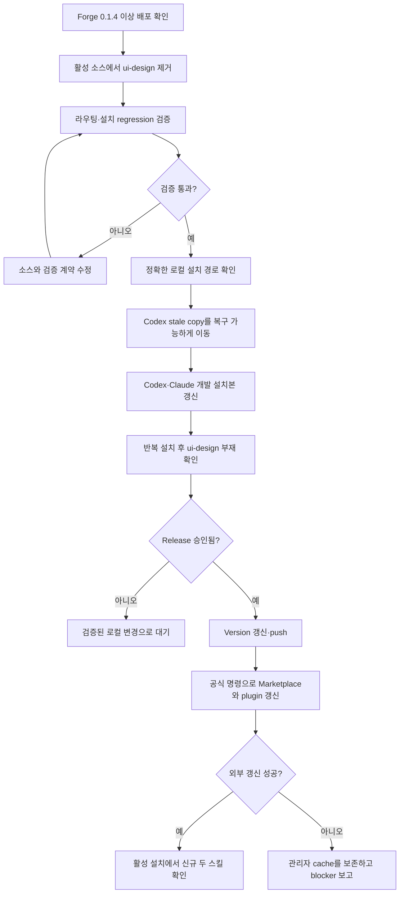

# Forge `ui-design` 최종 제거와 설치 갱신

Status: approved

## Overview

Forge 0.1.4에서 `web-app-design`과 `website-design`이 배포되고 기존 `ui-design`은 한시적 compatibility router로 축소되었다. 이제 활성 소스와 설치 경로에서 `ui-design`을 최종 제거하고, Codex와 Claude Code가 두 신규 스킬만 발견하도록 Forge 설치를 갱신한다. 제거는 저장소 소유 파일, 사용자 소유 개발 설치본, plugin manager 소유 캐시를 구분해 수행한다.

비목표:
- `docs/specs/006-ui-design-skill-split/`과 완료된 plan 등 역사적 의사결정 기록에서 `ui-design` 문자열을 지우지 않는다.
- `mobile-app-design`, `desktop-app-design` 또는 다른 platform skill을 이번 변경에서 추가하지 않는다.
- Claude Code의 Marketplace cache 디렉터리를 수동으로 삭제하거나 plugin manager가 소유한 다른 version cache를 정리하지 않는다.
- 사용자 승인 없이 Forge release를 push하지 않는다.

## Requirements

R(Requirement)는 시스템이 반드시 제공해야 하는 동작이나 제약을 뜻한다.

- R1. `ui-design`을 제거하기 전에 `web-app-design`과 `website-design` 및 신규 routing 계약이 포함된 Forge 0.1.4 이상이 원격 기본 브랜치에 배포되어 있어야 한다.
- R2. 제거 변경은 `plugins/forge/skills/ui-design/`을 삭제하고, 역사 문서를 제외한 활성 README, router, maintainer catalog, plugin manifest, validator와 test에서 `ui-design` runtime 참조를 0개로 만들어야 한다.
- R3. 제거 후에도 `using-forge`는 browser application을 `web-app-design`, 공개 website를 `website-design`으로 라우팅해야 한다. surface가 모호하면 한 가지 질문으로 구분하고, native mobile·desktop 요청을 두 web skill에 강제 라우팅하지 않아야 한다.
- R4. 현재 machine의 Codex 개발 설치를 갱신할 때 Forge 소유의 정확한 stale 경로 `~/.agents/skills/ui-design`을 먼저 확인하고 복구 가능한 위치로 이동한 뒤, `web-app-design`과 `website-design`을 포함한 현재 Forge skill을 설치해야 한다. 다른 plugin이나 사용자 소유 skill은 삭제하거나 덮어쓰지 않아야 한다.
- R5. 현재 machine의 Claude Code 개발 설치본 `~/.claude/skills/forge`는 현재 Forge source로 전체 교체해 두 신규 스킬을 포함하고 `ui-design`을 포함하지 않아야 한다. 활성 Marketplace 설치본 `forge@hope1026`은 release 이후 공식 marketplace/plugin update 명령으로 갱신해야 하며, 인증 또는 외부 상태 때문에 갱신할 수 없으면 관리자 cache를 수동 삭제하지 않고 정확한 미완료 상태를 보고해야 한다.
- R6. source 제거 이후 Codex와 Claude Code의 fresh install 또는 반복 install은 `ui-design`을 다시 생성하지 않아야 한다. Codex installer가 제거된 source skill을 자동 prune하지 않는 현재 동작은 exact stale-path 제거 절차와 regression test로 보완해야 한다.
- R7. 변경은 repository validator, artifact contract, UI routing regression, installer 격리 fixture, available runtime discovery와 app·website·ambiguous·native·Viewer pressure scenario를 통과해야 한다. 검증은 역사 문서를 제외한 활성 범위와 실제 설치 결과를 구분해 기록해야 한다.
- R8. distributed skill 변경을 release하기 전에 Claude와 Codex manifest의 base version을 함께 올리고 Codex suffix를 fresh UTC 값으로 갱신해야 한다. push와 Marketplace update는 사용자가 release를 승인한 뒤에만 수행해야 한다.

## Behavior & Flows

## Data & Interfaces

제거 및 갱신 대상:

| 구분 | 경로 또는 식별자 | 소유권 | 처리 |
|---|---|---|---|
| Forge source | `plugins/forge/skills/ui-design/` | repository | 디렉터리 삭제 |
| 활성 source 참조 | README, router, maintainer catalog, manifests, tests | repository | legacy runtime 참조 제거 및 신규 skill 계약 유지 |
| Codex stale skill | `~/.agents/skills/ui-design` | 사용자 개발 설치본 | Forge 복사본인지 확인 후 복구 가능한 위치로 이동 |
| Codex active skills | `~/.agents/skills/web-app-design`, `~/.agents/skills/website-design` | 사용자 개발 설치본 | 현재 source에서 설치하고 discovery 확인 |
| Claude 개발 설치본 | `~/.claude/skills/forge` | 사용자 개발 설치본 | 현재 source tree로 교체 |
| Claude 활성 plugin | `forge@hope1026` | Claude plugin manager | release 이후 공식 update 명령 사용 |
| Claude version cache | `~/.claude/plugins/cache/hope1026/forge/<version>` | Claude plugin manager | 수동 삭제 금지 |
| 역사 기록 | `docs/specs/006-ui-design-skill-split/`, 완료된 plan | repository history | 변경하지 않음 |

설치 후 발견 계약:

| Surface | 발견되어야 하는 skill | 발견되면 안 되는 skill |
|---|---|---|
| Browser application | `web-app-design` | `ui-design`, `website-design`의 동시 적용 |
| Public website | `website-design` | `ui-design`, `web-app-design`의 동시 적용 |
| Native mobile·desktop | 향후 전용 skill 또는 범위 확인 | `ui-design`, web skill 강제 적용 |
| Fixed Viewer 생성 | `spec-viewer` | `ui-design`, 두 UI skill |
| Viewer tooling 변경 | `web-app-design` | `ui-design` |

## Acceptance Criteria

AC(Acceptance Criterion)는 연결된 R이 충족됐다고 판단할 수 있는 관찰 가능한 완료 기준을 뜻한다.

- AC1 (R1, R2): 원격 기본 브랜치에서 Forge 0.1.4 이상의 migration release를 확인한 뒤 활성 repository를 검색하면 `plugins/forge/skills/ui-design/`이 없고, 역사 spec·완료 plan을 제외한 README, router, maintainer catalog, manifest keyword와 test에 `ui-design` runtime 참조가 0개다.
- AC2 (R3): app·website·ambiguous·native·Viewer routing fixture를 실행하면 app은 `web-app-design`, website는 `website-design`, ambiguous는 한 가지 질문, native는 전용 skill 또는 범위 확인, fixed Viewer는 `spec-viewer`, Viewer tooling은 `web-app-design`으로 판정되며 `ui-design`은 어떤 결과에도 나타나지 않는다.
- AC3 (R4, R6): 확인된 `~/.agents/skills/ui-design`을 복구 가능한 위치로 이동하고 Codex 개발 설치를 두 번 실행하면 `web-app-design`과 `website-design`은 발견되고 `ui-design`은 다시 생성되지 않으며, Forge 범위 밖의 기존 skill 목록은 변하지 않는다.
- AC4 (R5, R6): Claude Code 개발 설치를 두 번 실행하면 `~/.claude/skills/forge/skills/`에 두 신규 스킬이 있고 `ui-design`은 없으며, Marketplace version cache는 수동 삭제되지 않는다.
- AC5 (R5, R8): 승인된 release가 원격에 반영된 뒤 공식 marketplace update와 `claude plugin update forge@hope1026 --scope user`를 실행하면 활성 version이 제거 release로 갱신되고 두 신규 스킬만 발견된다. 인증 또는 외부 오류가 나면 명령, 오류, 현재 활성 version을 기록하고 cache를 직접 수정하지 않는다.
- AC6 (R7): `bash scripts/validate.sh`, artifact contract, UI routing regression, installer 격리 fixture와 available runtime discovery가 모두 PASS하고, 검사 결과가 활성 source·Codex 개발 설치·Claude 개발 설치·Claude Marketplace 설치를 각각 구분해 보여 준다.
- AC7 (R8): push 직전 두 manifest의 base version이 동일한 새 version이고 Codex suffix가 fresh UTC 값이며 version gate가 PASS한다. release 승인이 없으면 local commit 또는 push를 수행하지 않는다.

## Decisions & History

- 2026-07-31 [DECISION] Forge 0.1.4에서 신규 두 UI skill과 compatibility router를 먼저 배포한 뒤 별도 변경으로 `ui-design`을 제거한다.
- 2026-07-31 [DECISION] source 제거와 machine 설치 갱신을 함께 검증해 fresh install이 deprecated skill을 다시 만들지 않도록 한다.
- 2026-07-31 [DECISION] Codex의 확인된 stale 독립 복사본은 복구 가능한 위치로 이동하고, Claude Marketplace cache는 plugin manager 소유권을 존중해 공식 update 명령으로만 갱신한다.
- 2026-07-31 [DECISION] 과거 spec과 완료된 plan의 `ui-design` 기록은 migration 근거이므로 보존한다.
- 2026-07-31 [APPROVED] 사용자가 `ui-design` source 제거, Codex·Claude 개발 설치 갱신, 공식 Marketplace update 경계와 회귀 검증 계약을 승인했다.
