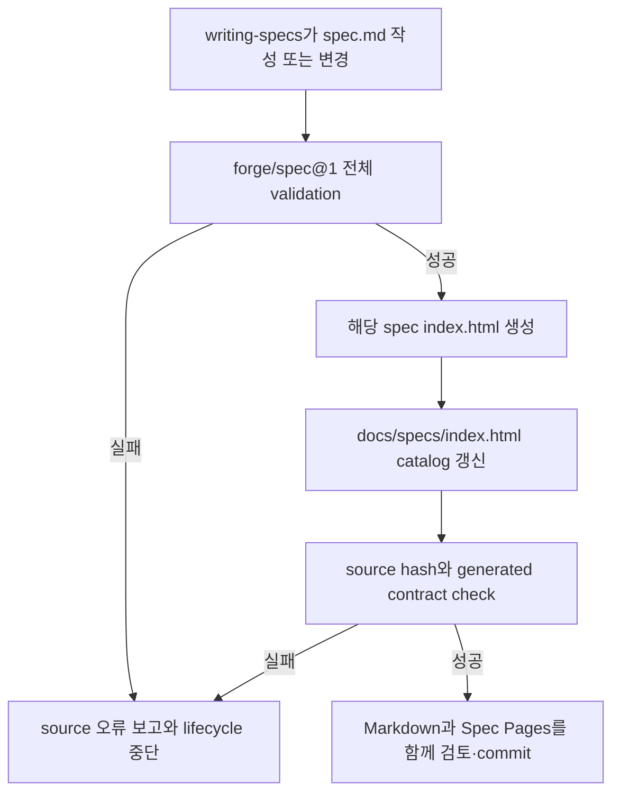
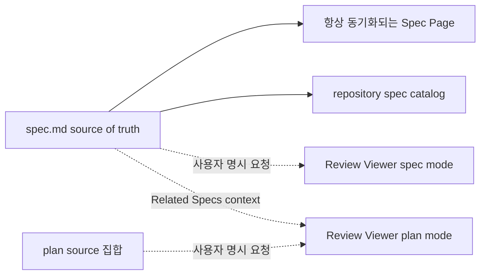
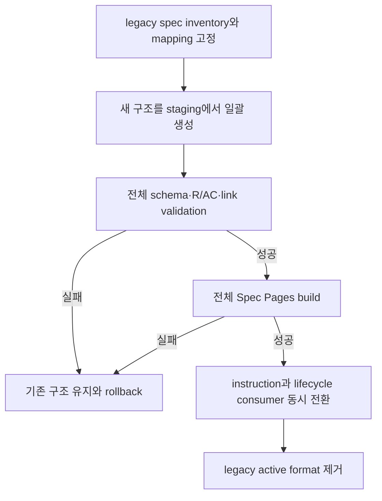
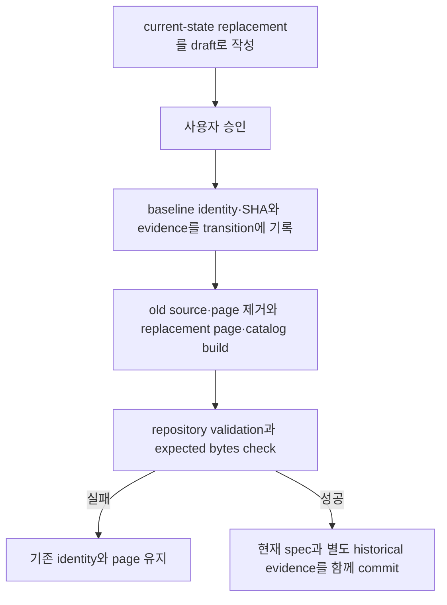

# 구조화 Spec 계약과 상시 Spec Pages

## Overview

Forge의 spec은 Markdown source of truth를 유지하면서도 모든 프로젝트에서 같은 구조로 작성·검증되어야 한다. 이 기능은 `forge/spec@1` metadata와 canonical body contract를 정의하고, `writing-specs`가 source 변경과 같은 작업 단위에서 사람이 읽기 좋은 Spec Pages를 항상 갱신하도록 만든다.

Spec Pages는 장기 탐색과 일반 열람을 위한 committed 파생 문서다. 특정 spec이나 plan의 맥락을 질문에 맞춰 재구성하는 요청형 Review Viewer와는 생성 trigger, 저장 위치, freshness 정책을 분리한다.

비목표:
- HTML을 spec의 편집 가능한 source of truth로 만들지 않는다.
- source에 없는 요구사항, 책임, 관계, 결정을 generated page에 추가하지 않는다.
- 기존 프로젝트를 조금씩 변환하는 장기 migration skill을 배포하지 않는다.
- Spec Pages 생성만으로 spec 승인 또는 구현 완료를 선언하지 않는다.
- plan, progress 또는 Task source의 상시 HTML page를 생성하지 않는다.

검토한 접근안:

| 접근안 | 장점 | 단점 | 결정 |
|---|---|---|---|
| 구조화 Markdown과 committed Spec Pages | Git review와 agent source를 유지하면서 사람이 항상 최신 HTML을 읽을 수 있다 | source 변경마다 generated diff가 생긴다 | 채택 |
| repository-wide Portal skill | 도입과 migration을 하나의 workflow로 묶을 수 있다 | 일회성 migration 이후에도 불필요한 영구 skill이 남는다 | 제외 |
| 요청형 Viewer만 사용 | generated file 수가 적다 | 평상시 spec 탐색과 최신 가독성 화면을 보장하지 못한다 | 제외 |
| 외부 문서 서비스로 동기화 | 검색과 공유 기능이 풍부하다 | 권한, 배포, 양방향 drift가 새 운영 의존성이 된다 | 제외 |

## Requirements

R(Requirement)는 시스템이 반드시 제공해야 하는 동작이나 제약을 뜻한다.

### 구조화 source 계약

- R1. Forge는 `docs/specs/NNN-<slug>/spec.md`를 요구사항, 승인 상태, 관계와 변경 이력의 유일한 source of truth로 유지해야 한다.
- R2. 모든 활성 spec은 YAML frontmatter에서 `schema: forge/spec@1`, directory와 일치하는 `id`, `status`, `language`, `kind`, `areas`, `components`, `relatedSpecs`를 선언해야 한다.
- R3. `status`는 `draft`, `approved`, `implemented` 중 하나여야 하며 frontmatter의 값만 lifecycle gate token으로 사용하고 별도의 `Status:` body line을 중복 정본으로 유지하지 않아야 한다.
- R4. v1의 `language`는 page shell과 lifecycle tooling이 지원하는 BCP 47 tag `en`, `ko` 중 하나여야 한다. `kind`는 `feature`, `system`, `interface`, `policy` 중 하나여야 하며, `areas`, `components`, `relatedSpecs`는 빈 목록을 허용하되 항상 명시되어야 한다. Frontmatter는 dependency-free parser가 읽을 수 있도록 top-level `key: value`와 JSON-compatible 한 줄 collection만 허용하고 YAML anchor, tag, block scalar, multiline collection과 implicit type conversion을 허용하지 않아야 한다.
- R5. spec body의 H1은 title의 유일한 source여야 하므로 frontmatter에 `title`을 중복 선언하지 않아야 한다. Body는 H1을 정확히 하나 포함하고 `Overview`, `Requirements`, `Behavior & Flows`, `Data & Interfaces`, `Acceptance Criteria`, `Decisions & History`의 canonical `##` heading을 정확한 순서로 한 번씩 포함해야 한다. 다른 `##` heading은 허용하지 않고 추가 구획은 해당 canonical section 아래의 `###` 이하 heading으로 작성해야 한다.
- R6. 모든 Requirement와 Acceptance Criterion은 spec 안에서 각각 unique한 `R<number>`, `AC<number>` ID를 사용해야 한다. 각 AC는 쉼표로 구분한 R-ID 또는 오름차순 R-ID range를 하나 이상 참조해야 하며, validator는 range를 개별 ID로 확장한 뒤 존재하는 `REMOVED`가 아닌 R만 참조하는지 검사해야 한다. Tombstone의 canonical 문법은 `- R<number>. REMOVED — <reason>`이고 coverage 대상에서 제외하며, 나머지 모든 R은 하나 이상의 AC로 coverage되어야 한다.
- R7. `relatedSpecs`의 각 항목은 repository 안의 유효한 spec ID와 관계 종류 `dependsOn`, `refines`, `supersedes`, `relatedTo` 중 하나를 선언해야 하며 self-reference와 해석할 수 없는 ID를 허용하지 않아야 한다.
- R8. canonical Mermaid fence는 Behavior & Flows가 소유하고, 표와 interface 계약은 Data & Interfaces가 소유하며 generated page는 이 source text를 의미 변경 없이 사용해야 한다.
- R9. 사용자 언어, EARS 의미 규칙과 AC의 선행조건·행동·관찰 결과는 기존 `writing-specs` 계약을 유지해야 한다. 같은 identity로 계속 활성 상태인 `approved` 또는 `implemented` spec의 Decisions & History는 append-only여야 하며, 명시적인 supersession transition으로 교체되는 spec은 R35–R39의 검증된 별도 기록을 따라야 한다.

### 작성과 검증 gate

- R10. `writing-specs`는 new, change, clarify, sync 모든 mode에서 `forge/spec@1` source를 작성하고 approval request 전에 repository 전체 spec validation을 실행해야 한다.
- R11. validator는 metadata schema, path와 ID 일치, status·language·kind 값, canonical heading 순서, R·AC uniqueness·reference·coverage, clarification gate, related spec resolution, internal Markdown link, Mermaid fence ownership과 syntax를 검사해야 한다.
- R12. `approved` 또는 `implemented` spec에 `[NEEDS CLARIFICATION]`가 하나라도 있거나 R·AC coverage가 불완전하면 validation은 실패해야 한다.
- R13. validation 실패는 spec 작성·변경 완료, approval request, plan handoff와 Spec Pages build를 모두 차단하고 source path와 사람이 수정할 수 있는 오류 원인을 반환해야 한다.
- R14. `writing-plans`, `executing-plans`, `verifying-work`와 다른 Forge lifecycle skill은 literal `Status:` 검색 대신 공통 spec parser가 반환한 schema와 status를 사용해야 한다.
- R15. validator와 parser는 같은 input bytes에서 같은 결과를 반환하고 진단을 `(path, line, code)` 순서로 정렬하며 외부 network, machine locale 또는 agent 추론에 의존하지 않아야 한다.

### 상시 Spec Pages

- R16. 각 spec은 source와 같은 directory의 `index.html`을 사람이 읽기 좋은 상시 Spec Page로 가져야 하며, `docs/specs/index.html`은 repository 전체 spec catalog를 제공해야 한다.
- R17. `writing-specs`, `verifying-work`와 다른 Forge writer가 spec body, metadata 또는 lifecycle status를 변경하면 validator 성공 뒤 해당 spec `index.html`과 repository catalog `docs/specs/index.html`을 같은 작업 단위에서 갱신해야 한다. Generator version, template 또는 bundled asset이 변경되면 repository 전체 Spec Pages를 재생성해야 하며, builder는 완성된 bytes를 temporary file에 쓴 뒤 atomic replace해야 한다.
- R18. spec source가 변경됐는데 두 Spec Pages 중 하나라도 누락되거나 source hash·expected bytes가 일치하지 않거나 수동 편집·orphan page가 발견되면 spec 변경은 완료로 보고하거나 commit 대상으로 handoff하지 않아야 한다.
- R19. per-spec page는 title, status, kind, areas, components, related spec, source hash, Overview, R, source Mermaid, Data & Interfaces, AC, Decisions & History를 요약→시각 흐름→source detail→acceptance evidence 순서로 보여줘야 한다.
- R20. catalog page는 spec ID와 title 검색, status·kind·area·component filter, related spec 탐색, source와 per-spec page link를 제공하고 모든 항목을 현재 spec metadata에서 계산해야 한다.
- R21. generated page는 source를 직접 수정하지 않는 read-only artifact여야 하며 generated HTML을 수동 편집하거나 별도 의미 정본으로 참조하지 않아야 한다.
- R22. builder는 같은 source bytes, generator version과 locale에서 byte-for-byte 같은 HTML을 만들고 volatile timestamp, absolute path와 machine-specific 값을 출력에 포함하지 않아야 한다.
- R23. generated page는 source SHA-256, schema version과 generator version을 포함해야 한다. `check`는 현재 source와 generator로 expected bytes를 다시 생성해 committed HTML과 byte-for-byte 비교하고, embedded manifest만 신뢰하지 않으며 누락, stale source, 수동 편집과 source 없는 orphan page를 실패로 처리해야 한다.
- R24. 한국어 source에는 한국어 navigation과 설명을 사용하고, API, protocol, service, schema, code identifier는 원문을 유지해야 한다.
- R25. page shell은 desktop working width와 390px narrow width에서 primary reading path, keyboard navigation, focus, wide table·diagram overflow, empty·long content, invalid Mermaid error 상태를 명확히 보여줘야 한다.
- R26. per-spec page와 catalog는 외부 network 없이 열 수 있는 offline artifact여야 하며 build 뒤 project validator가 source hash, regenerated expected bytes와 generated contract를 검사해야 한다.

### 요청형 Review Viewer와의 경계

- R27. 상시 Spec Pages 생성이나 갱신은 Review Viewer 생성 요청으로 간주하지 않아야 한다.
- R28. Review Viewer는 사용자가 현재 spec 또는 plan의 Viewer 생성·갱신을 명시적으로 요청한 경우에만 별도 lifecycle viewer 계약에 따라 생성해야 한다.
- R29. source 변경은 기존 Review Viewer를 자동 갱신하지 않으며, Spec Pages의 freshness와 Review Viewer의 freshness를 하나의 상태로 합치지 않아야 한다. Review Viewer의 현재 source 옆 committed `view.html` 정책을 `.forge/reviews/<review-id>/view.html` 비커밋 snapshot으로 바꾸는 결정은 governing `docs/specs/002-lifecycle-review-viewer/spec.md`의 별도 승인 delta가 소유하며, 그 delta와 관련 contract test가 승인·갱신되기 전에 이 spec 구현이 기존 Viewer 경로와 Git 정책을 암묵적으로 변경하지 않아야 한다.

### 일괄 migration과 배포

- R30. Forge repository의 활성 spec, lifecycle skill, validator, fixture, plan status reader와 artifact 문서는 한 migration release에서 `forge/spec@1`로 전환되어야 하며 cutover 뒤 legacy `Status:` body gate와 schema 없는 활성 spec을 허용하지 않아야 한다.
- R31. 기존 프로젝트 migration은 repository별 승인된 일회성 plan으로 전체 spec, 링크, instruction file과 generated page를 atomic하게 전환해야 한다. Plan은 repository-local 임시 converter 또는 명시된 수동 transformation step을 사용할 수 있지만 이를 distributed Forge plugin에 포함하지 않고 cutover 완료 전에 제거해야 하며, production parser, validator, skill과 command에 legacy schema 분기나 compatibility flag를 남기지 않아야 한다.
- R32. migration은 `oldPath → newSpecIds[]`, 기존 normative section별 새 spec·section provenance, split·merge·discard disposition, legacy status resolution과 근거, non-spec 문서 처리, link rewrite 결과, source backup 또는 Git rollback point를 기록해야 한다. 누락된 legacy status를 자동으로 `implemented`로 추론하지 않아야 하며 broken-link·duplicate-ID·missing-coverage failure gate와 page build가 모두 성공하기 전 기존 구조를 제거하지 않아야 한다.
- R33. 이 Forge 변경의 구현·완료 범위는 `weppy-roblox-mcp-private`를 수정하지 않아야 한다. 해당 repository의 기존 spec migration은 Forge tooling 구현과 검증 뒤 그 repository가 소유하는 별도 governing spec과 일회성 cutover plan에서 수행해야 한다.
- R34. Marketplace 사용자 workflow이므로 parser, validator, builder와 필요한 asset은 Forge plugin 배포에 포함되고 Claude Code, Codex, Antigravity에서 동일한 source contract를 사용해야 한다.

### 현재 사실과 spec supersession

- R35. 활성 spec은 현재 유효한 제품·시스템 동작과 제약을 source of truth로 제공해야 한다. 완료된 일회성 작업의 실행 과정, 변환 수치와 rollback evidence는 plan, ADR 또는 별도 evidence 문서에 보존하고 활성 spec의 Overview·Requirements·Behavior & Flows·Data & Interfaces·Acceptance Criteria에 현재 동작처럼 남기지 않아야 한다.
- R36. baseline의 `approved` 또는 `implemented` spec을 새 identity의 한 spec으로 교체할 때는 `docs/specs/.transitions.json`에 exact baseline identity와 source SHA-256을 가진 one-to-one `superseded` transition을 선언해야 한다. 선언이 없거나 baseline bytes와 일치하지 않으면 validator는 기존 `SPEC_HISTORY_NOT_APPEND_ONLY` 진단으로 삭제·rename을 거부해야 한다. Replacement 없는 retirement, 여러 source의 merge, baseline에 이미 존재하는 target으로의 이동과 같은 diff 안의 multi-hop transition은 v1 범위에서 허용하지 않아야 한다.
- R37. `docs/specs/.transitions.json` 자체는 repository 안의 regular non-symlink file이어야 한다. 이 파일은 top-level key `schema`, `transitions`만 가진 JSON object이고 `schema`는 `forge/spec-transitions@1`, `transitions`는 object 배열이어야 한다. 각 record는 string field `fromId`, `fromPath`, `fromSourceSha256`, `disposition`, `toId`, `toPath`, `evidencePath`, `reason`만 가지며 `disposition`은 `superseded`, SHA-256은 lowercase hex 64자, 나머지 string은 비어 있지 않아야 한다. Parser는 duplicate·unknown key와 잘못된 type을 거부해야 한다. Path는 POSIX `/` separator를 쓰는 repository-relative normalized path여야 하며 absolute·drive·UNC·backslash·empty·`.`·`..` segment와 intermediate·terminal symlink를 거부해야 한다. `fromPath`와 `toPath`는 `docs/specs/` 아래의 `spec.md`, `evidencePath`는 `docs/plans/`, `docs/adr/` 또는 `docs/evidence/` 아래의 regular file이어야 한다.
- R38. validator는 `fromPath`의 baseline bytes를 parse한 ID·status·SHA-256이 record와 정확히 일치하고 `toPath`의 current source가 record의 `toId`, directory와 일치하며 status가 `approved` 또는 `implemented`인지 확인해야 한다. `toPath`는 baseline에 존재하지 않아야 하고 current tree에 terminal active source로 존재해야 한다. Current transition 배열은 baseline 배열의 canonical record sequence를 exact prefix로 보존해야 하며, missing baseline source를 승인할 수 있는 record는 이번 diff에 새로 append된 하나뿐이어야 한다. 기존 record 재사용, record 수정·삭제·reorder, duplicate source·target, 같은 diff의 chain, 존재하지 않는 evidence, active `relatedSpecs`와 Markdown link의 old identity 참조를 실패로 처리해야 한다. 유효한 transition도 replacement source validation, old page 제거, replacement page와 catalog freshness를 면제하지 않아야 한다.
- R39. `writing-specs`에서 사용자가 현재 사실만 남기기 위해 기존 spec identity를 교체하거나 완료 기록을 분리하면, 기존 source를 건드리기 전에 current-state replacement를 `draft`로 작성하고 사용자 승인을 받아야 한다. 승인 후 plan은 expected clean baseline에서 등록된 isolated Git worktree를 만들고 transition append, old source·page 제거, reference 갱신, replacement Spec Page와 catalog build, baseline validation, expected bytes check를 한 candidate commit으로 수행해야 한다. Candidate gate가 실패하면 production root의 HEAD·index·tracked·untracked bytes를 유지하고, 성공한 commit도 production root가 expected clean HEAD일 때만 반영해야 한다. Review Viewer는 별도 명시 요청이 없으면 생성하지 않아야 한다.

## Behavior & Flows

spec 변경과 상시 page 동기화:



상시 Spec Pages와 요청형 Review Viewer의 lifecycle:



일괄 migration cutover:



활성 spec supersession transaction:



## Data & Interfaces

`forge/spec@1` metadata:

| Field | Type | 필수 | 제약 |
|---|---|---:|---|
| `schema` | string | 예 | 정확히 `forge/spec@1` |
| `id` | string | 예 | `NNN-<slug>` directory와 일치, repository unique |
| `status` | enum | 예 | `draft`, `approved`, `implemented` |
| `language` | enum | 예 | v1은 BCP 47 tag `en`, `ko` |
| `kind` | enum | 예 | `feature`, `system`, `interface`, `policy` |
| `areas` | string[] | 예 | 빈 목록 허용 |
| `components` | string[] | 예 | 빈 목록 허용 |
| `relatedSpecs` | relation[] | 예 | 빈 목록 허용, typed valid ID |

Title은 body의 단일 H1에서 파생하며 metadata field로 중복하지 않는다. Dependency-free frontmatter parser가 받는 canonical serialization은 다음과 같다.

```yaml
---
schema: forge/spec@1
id: 008-structured-spec-pages
status: draft
language: ko
kind: system
areas: ["forge"]
components: ["writing-specs", "spec-docs"]
relatedSpecs: [{"id": "002-lifecycle-review-viewer", "relation": "relatedTo"}]
---
```

Scalar는 parser가 문자열로 취급하고 collection은 JSON array 또는 object 문법을 사용한다. 다른 YAML 기능은 v1 input이 아니다.

spec tooling command contract:

```text
spec-docs validate --root docs/specs
spec-docs build --root docs/specs --changed docs/specs/NNN-<slug>/spec.md --offline
spec-docs check --root docs/specs
```

| Command | 입력 | 출력 | 실패 조건 |
|---|---|---|---|
| `validate` | 모든 `spec.md` | 정렬된 진단과 exit code | schema, R·AC, relation, link 위반 |
| `build` | validated spec root와 선택적 changed path | per-spec `index.html`, catalog `index.html` | source invalid, template 또는 Mermaid packaging 실패 |
| `check` | source와 committed Spec Pages | regenerated expected bytes와 contract 결과 | 누락, stale hash, manual edit, orphan, manifest·generator mismatch |

Spec Page 역할과 저장 정책:

| Artifact | 역할 | Git | 갱신 trigger |
|---|---|---:|---|
| `docs/specs/NNN-<slug>/spec.md` | 영구 source of truth | 예 | 요구사항·상태 변경 |
| `docs/specs/NNN-<slug>/index.html` | spec별 상시 가독성 page | 예 | 해당 spec 변경 |
| `docs/specs/index.html` | 전체 spec catalog | 예 | 어떤 spec metadata·title·관계 변경 |
| Review Viewer output | 요청형 맥락 snapshot | `002`의 승인 delta가 결정 | 사용자 명시 요청; 목표 경로는 `.forge/reviews/<review-id>/view.html` |

spec transition manifest:

```json
{
  "schema": "forge/spec-transitions@1",
  "transitions": [
    {
      "fromId": "001-old-identity",
      "fromPath": "docs/specs/001-old-identity/spec.md",
      "fromSourceSha256": "64 lowercase hex characters",
      "disposition": "superseded",
      "toId": "001-current-identity",
      "toPath": "docs/specs/001-current-identity/spec.md",
      "evidencePath": "docs/plans/001-current-identity/acceptance-evidence.md",
      "reason": "현재 운영 계약과 완료된 실행 기록을 분리한다."
    }
  ]
}
```

동일한 baseline transition은 한 번만 적용한다. 이후 baseline에 `fromPath`가 없으면 해당 record는 historical evidence로 남지만 새 삭제 권한을 만들지 않는다. 나중에 현재 replacement를 다시 교체할 때는 그 시점의 baseline source를 `fromPath`로 사용하는 새 record를 별도 diff에 append한다.

## Acceptance Criteria

AC(Acceptance Criterion)는 연결된 R이 충족됐음을 보여주는 관찰 가능한 근거를 뜻한다.

- AC1 (R1–R9): 새 spec을 `forge/spec@1`로 작성하면 제한된 frontmatter에 `language`를 포함한 필수 metadata와 6개 canonical section이 존재하고, title은 H1에서만 파생되며, unique R·AC, `REMOVED`를 제외한 full R coverage, 유효한 AC reference와 typed related spec이 validator에 의해 확인되고 body에는 별도 `Status:` gate가 존재하지 않는다.
- AC2 (R10–R15): 잘못된 schema, 지원하지 않는 YAML 기능과 language, path와 다른 ID, 추가 `##`, 잘못된 tombstone, duplicate R, 존재하지 않거나 `REMOVED`인 AC reference, uncovered active R, broken relation·link, 잘못된 Mermaid syntax, approved clarification fixture를 함께 validate하면 `(path, line, code)`로 정렬된 deterministic 진단과 non-zero exit가 나오고 approval·plan handoff·page build가 중단된다.
- AC3 (R14): approved spec을 읽는 `writing-plans`와 implemented status를 기록하는 `verifying-work` fixture가 공통 parser의 frontmatter status를 사용하고 literal body `Status:` 검색 없이 lifecycle gate를 적용한다.
- AC4 (R16–R24): draft body 수정, `approved` 전환, `verifying-work`의 `implemented` 전환에서는 temporary output의 완성 뒤 atomic replace로 해당 directory의 `index.html`과 `docs/specs/index.html`이 같은 작업에서 갱신된다. Generator version, template 또는 bundled asset 변경에서는 전체 page가 재생성되며, 각 page는 H1 title, metadata, R·AC, Mermaid, relation, source hash를 현재 source와 일치하게 표시한다.
- AC5 (R17–R18, R22–R23): source 한 바이트 변경, generated HTML 수동 편집, page 누락과 orphan page fixture에 `spec-docs check`를 실행하면 regenerated expected bytes 비교로 각각 실패하며, build 뒤 다시 실행하면 성공하고 동일 input 재build의 Git diff는 0이다.
- AC6 (R19–R21, R24): 한국어 spec page를 열면 한국어 navigation으로 요약→시각 흐름→source detail→acceptance evidence를 읽을 수 있고 API·schema identifier와 source Mermaid는 원문을 유지하며 HTML에서 source를 편집할 수 없다.
- AC7 (R20): 여러 status, kind, area, component와 relatedSpecs를 가진 fixture catalog에서 검색·filter·relation link 결과가 source metadata와 일치하고 각 항목이 source와 per-spec page로 이동한다.
- AC8 (R25–R26): Spec Pages tooling 구현 검증에서 desktop working width와 390px narrow width의 keyboard focus, typical·empty·long data, wide table·diagram overflow가 정의된 state geometry 안에서 동작하고 offline artifact가 외부 request 없이 열린다. Valid source를 사용한 runtime render failure fixture에서는 Mermaid 오류가 다른 content를 가리지 않고 원문과 복구 안내를 표시한다.
- AC9 (R27–R29): spec 변경과 Spec Pages build를 수행해도 Review Viewer가 생성되거나 기존 Viewer가 갱신되지 않으며, 사용자가 명시적으로 요청한 뒤에만 별도 Review Viewer가 생성된다. Viewer의 `.forge/reviews/` 비커밋 전환은 `002`의 승인 delta와 contract test가 적용된 경우에만 일어나고, 그 전에는 현재 source 옆 committed `view.html` 정책이 유지된다.
- AC10 (R30): Forge repository migration commit 범위에서 모든 활성 spec이 `forge/spec@1`이고 모든 lifecycle consumer와 fixture가 공통 parser를 사용하며 schema 없는 활성 spec, legacy body status gate, production compatibility flag와 legacy parser branch가 0개다.
- AC11 (R31–R33): split·merge·discard와 status 누락을 포함한 repository migration fixture를 section provenance, `oldPath → newSpecIds[]`, link rewrite 결과와 rollback point를 가진 한 cutover로 실행하면 누락 status를 `implemented`로 자동 승격하지 않고 validation 또는 page build 실패 시 기존 구조를 유지하며 성공한 경우에만 모든 instruction과 link를 새 ID로 전환한 뒤 임시 converter를 제거한다. Forge 구현 diff에는 `weppy-roblox-mcp-private` 변경이 없고, 해당 repository migration은 별도 governing spec과 plan의 후속 작업으로 남는다.
- AC12 (R34): plugin 설치와 repository validator를 Claude Code·Codex·Antigravity 지원 경로에서 검사하면 spec parser, validator, builder, template와 offline asset이 누락 없이 발견되고 동일 fixture 결과를 낸다.
- AC13 (R9, R35–R37): baseline의 implemented spec을 새 approved current-state spec으로 교체하는 fixture에서 exact `fromId`·`fromPath`·SHA-256, 새 target과 evidence를 가진 append-only transition을 함께 적용하면 repository validation이 통과한다. Invalid JSON, duplicate·unknown key, wrong type, uppercase·short hash, empty string, manifest-file symlink, absolute·drive·UNC·backslash·dot-segment·record-path symlink, 잘못된 schema·disposition·target·evidence를 각각 주입하면 정렬된 deterministic 진단과 non-zero exit가 발생한다.
- AC14 (R38): baseline/current ID·path·status·SHA binding 불일치, baseline에 이미 존재하는 target, draft target, missing target, transition record 수정·삭제·reorder·replay, duplicate source·target, same-diff multi-hop, old identity를 가리키는 active relation·Markdown link, old orphan page와 stale replacement page fixture를 각각 검사하면 validation 또는 check가 실패한다. 새 record 한 개만 append하고 모든 reference를 새 identity로 갱신하며 old page를 제거한 뒤 replacement page와 catalog를 build하면 통과하고 second build diff는 0이다.
- AC15 (R35, R39): `writing-specs` change fixture에서 사용자가 완료된 작업 기록을 활성 spec에서 분리해 달라고 요청하면 agent는 current-state replacement draft와 별도 evidence를 먼저 제시하고 승인 전 production source·page를 변경하지 않는다. 승인 뒤 isolated candidate에 source deletion, transition, reference, page build 또는 check failure를 각각 주입하면 production HEAD·index·tracked·untracked fingerprint가 유지된다. 성공한 candidate commit만 expected clean root에 반영한 결과에는 현재 계약과 별도 evidence가 남고 Review Viewer 생성 count는 0이다.

## Decisions & History

- 2026-08-01 [DECISION] 구조화 spec authoring과 validation은 기존 `writing-specs`가 소유하고 별도 spec authoring skill을 추가하지 않는다.
- 2026-08-01 [DECISION] per-spec `index.html`과 `docs/specs/index.html`은 spec 변경과 항상 함께 갱신되는 committed Spec Pages로 유지한다.
- 2026-08-01 [DECISION] 요청형 Review Viewer와 상시 Spec Pages는 같은 parser·rendering 기반을 재사용할 수 있지만 생성 trigger, 경로, Git 정책과 freshness 상태를 분리한다.
- 2026-08-01 [DECISION] 기존 spec은 repository별 한 번의 atomic migration으로 전환하고 distributed Forge에 점진적 migration skill이나 legacy compatibility mode를 남기지 않는다.
- 2026-08-01 [REJECTED] `spec-portal`을 장기 workflow skill로 유지: migration 이후 별도 orchestration 책임이 남고 `writing-specs`와 중복된다.
- 2026-08-01 [DECISION] v1 frontmatter는 dependency-free parser가 처리할 수 있는 scalar와 JSON-compatible 한 줄 collection만 허용하고 title은 body H1에서 파생한다.
- 2026-08-01 [DECISION] Review Viewer의 `.forge/reviews/` 비커밋 전환은 lifecycle Viewer를 소유하는 `002`의 별도 승인 delta에서 처리하고, 이 spec은 Spec Pages build를 Viewer 생성 권한으로 해석하지 않는다.
- 2026-08-01 [DECISION] 이 draft는 parser와 atomic cutover 자체를 정의하는 bootstrap 문서이므로 구현 전까지 legacy body `Status:` template을 유지한다. 승인된 migration 실행에서 다른 활성 spec과 함께 `forge/spec@1`로 전환하며 cutover 이후 예외로 남기지 않는다.
- 2026-08-01 [DECISION] v1 renderer locale은 `en`, `ko`로 제한하고, spec 또는 status를 쓰는 모든 lifecycle writer와 generator asset 변경이 Spec Pages freshness를 함께 책임진다.
- 2026-08-01 [DECISION] repository migration은 one-to-many section provenance와 status 근거를 기록하는 일회성 cutover이며, 임시 converter와 모든 legacy compatibility branch는 완료 전에 제거한다.
- 2026-08-01 [APPROVED] 사용자가 구조화 Spec 계약, 상시 Spec Pages, 일괄 Forge migration과 요청형 Review Viewer 경계를 승인하고 구현 진행을 요청했다.
- 2026-08-02 [CHANGE] R9 MODIFIED 및 R35–R39, AC13–AC15 ADDED: 같은 identity의 history append-only를 유지하면서도, exact baseline binding과 replay 방지를 가진 one-to-one transition으로 현재 사실만 담는 replacement를 안전하게 supersede할 수 있도록 한다.
- 2026-08-02 [APPROVED] 사용자가 current-state spec supersession delta를 검토하고 구현 진행을 승인했다.
