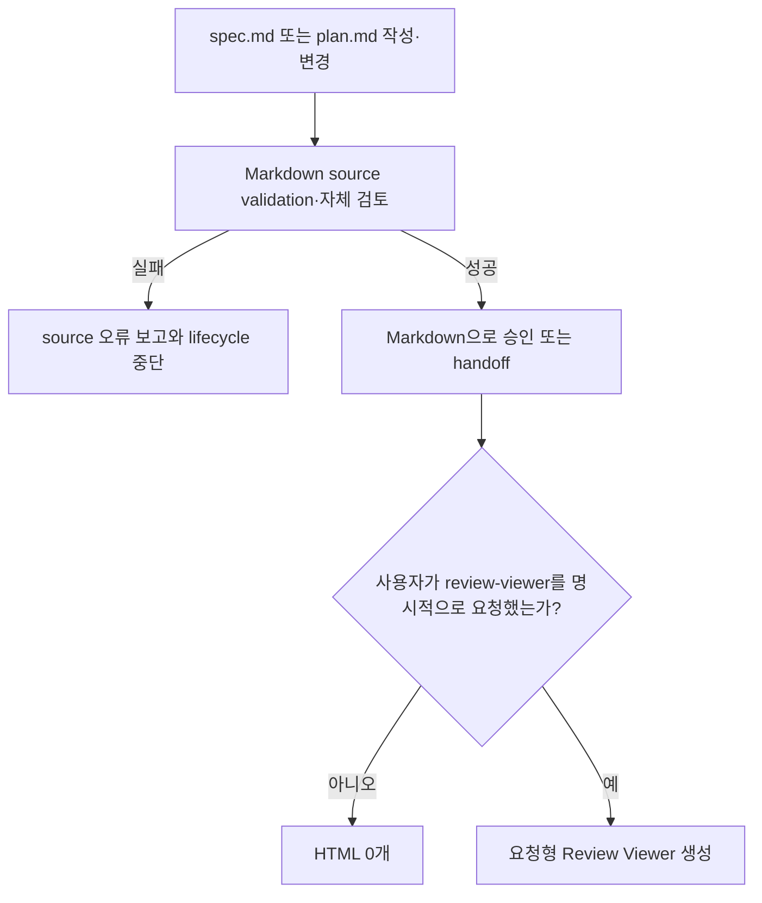
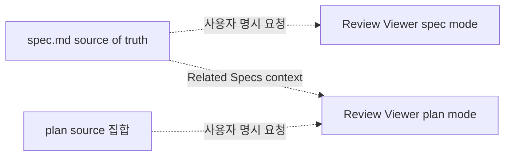
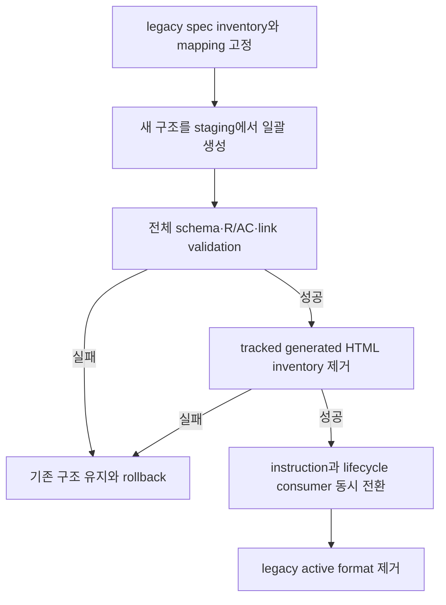
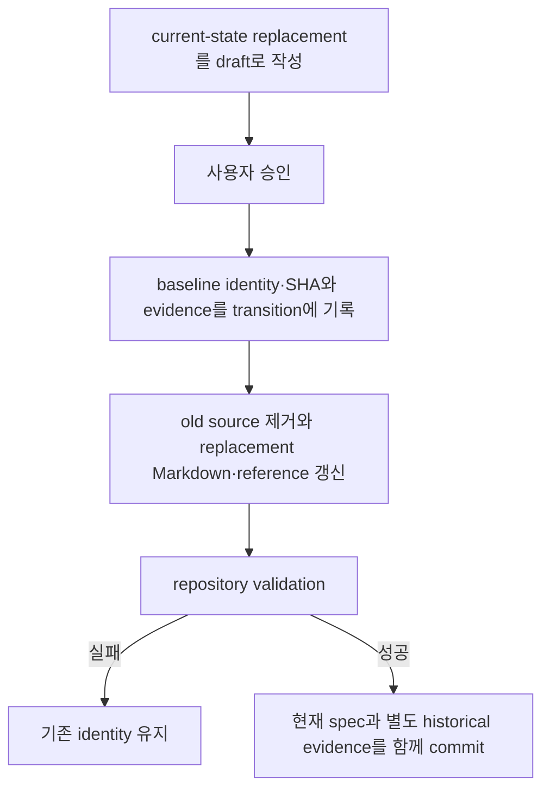

# 유연한 Markdown Spec 계약과 요청형 HTML 경계

## Overview

Forge의 spec과 plan은 Markdown을 유일한 기본 산출물과 source of truth로 유지해야 한다. Spec의 metadata, Requirement·Acceptance Criterion traceability와 lifecycle gate는 기계적으로 검증하되, 서로 다른 feature·workflow·API·architecture·policy·migration 문서를 하나의 화면 순서에 맞추기 위해 동일한 여섯 본문 구획으로 강제하지 않는다.

HTML은 일반적인 spec 작성, plan 작성, 승인, handoff, 실행 checkpoint 또는 lifecycle status 변경에서 생성하지 않는다. 사람이 보기 좋은 별도 화면이 필요할 때 사용자가 `review-viewer`를 명시적으로 요청해야만 `docs/specs/002-lifecycle-review-viewer/spec.md`의 계약에 따라 로컬 Review Viewer를 생성한다.

비목표:
- HTML을 spec의 편집 가능한 source of truth로 만들지 않는다.
- source에 없는 요구사항, 책임, 관계, 결정을 generated page에 추가하지 않는다.
- Markdown의 서술 순서를 Viewer layout에 맞추도록 강제하지 않는다.
- spec이나 plan 변경을 HTML 생성 요청으로 추론하지 않는다.
- source 옆 `index.html`, `view.html` 또는 repository catalog HTML을 상시 관리하지 않는다.
- Review Viewer 생성만으로 spec 승인 또는 구현 완료를 선언하지 않는다.

검토한 접근안:

| 접근안 | 장점 | 단점 | 결정 |
|---|---|---|---|
| Markdown-only lifecycle과 요청형 Review Viewer | 기본 작업은 source만 변경하고 필요한 검토에서만 HTML을 만든다 | 평상시에는 Markdown reader의 가독성에 의존한다 | 채택 |
| committed Spec Pages 상시 동기화 | 항상 HTML 탐색 화면이 존재한다 | source 변경마다 대형 generated diff와 runtime 중복이 생긴다 | 제외 |
| 문서마다 맞춤 HTML을 직접 작성 | 문서별 표현 자유도가 가장 높다 | 일관성·검증·유지보수 비용과 source drift가 커진다 | 제외 |
| 외부 문서 서비스로 동기화 | 검색과 공유 기능이 풍부하다 | 권한, 배포, 양방향 drift가 새 운영 의존성이 된다 | 제외 |

## Requirements

R(Requirement)는 시스템이 반드시 제공해야 하는 동작이나 제약을 뜻한다.

### 구조화 source 계약

- R1. Forge는 `docs/specs/NNN-<slug>/spec.md`를 요구사항, 승인 상태, 관계와 변경 이력의 유일한 source of truth로 유지해야 한다.
- R2. MODIFIED — 모든 활성 spec은 YAML frontmatter에서 `schema: forge/spec@2`, directory와 일치하는 `id`, `status`, `language`, `kind`, 선택적인 `subtype`, `areas`, `components`, `relatedSpecs`를 선언해야 한다. `kind`와 `subtype`은 문서의 의미 분류이며 HTML layout 자체를 선언하지 않아야 한다.
- R3. `status`는 `draft`, `approved`, `implemented` 중 하나여야 하며 frontmatter의 값만 lifecycle gate token으로 사용하고 별도의 `Status:` body line을 중복 정본으로 유지하지 않아야 한다.
- R4. MODIFIED — v2의 `language`는 lifecycle tooling이 지원하는 BCP 47 tag `en`, `ko` 중 하나여야 한다. `kind`는 `feature`, `system`, `interface`, `policy` 중 하나여야 하고, `subtype`은 생략하거나 lowercase kebab-case 의미 분류를 사용해야 한다. `areas`, `components`, `relatedSpecs`는 빈 목록을 허용하되 항상 명시해야 한다. Frontmatter는 dependency-free parser가 읽을 수 있도록 top-level `key: value`와 JSON-compatible 한 줄 collection만 허용해야 한다.
- R5. MODIFIED — spec body는 title의 유일한 source인 H1을 정확히 하나 포함해야 한다. `Requirements`, `Acceptance Criteria`, `Decisions & History`는 traceability와 append-only history를 위해 각각 한 번 존재해야 하지만, 나머지 `##`·하위 heading의 이름, 수, 순서와 중첩은 spec의 feature·workflow·API·architecture·policy·migration 특성에 맞게 자유롭게 작성할 수 있어야 한다.
- R6. 모든 Requirement와 Acceptance Criterion은 spec 안에서 각각 unique한 `R<number>`, `AC<number>` ID를 사용해야 한다. 각 AC는 쉼표로 구분한 R-ID 또는 오름차순 R-ID range를 하나 이상 참조해야 하며, validator는 range를 개별 ID로 확장한 뒤 존재하는 `REMOVED`가 아닌 R만 참조하는지 검사해야 한다. Tombstone의 canonical 문법은 `- R<number>. REMOVED — <reason>`이고 coverage 대상에서 제외하며, 나머지 모든 R은 하나 이상의 AC로 coverage되어야 한다.
- R7. `relatedSpecs`의 각 항목은 repository 안의 유효한 spec ID와 관계 종류 `dependsOn`, `refines`, `supersedes`, `relatedTo` 중 하나를 선언해야 하며 self-reference와 해석할 수 없는 ID를 허용하지 않아야 한다.
- R8. MODIFIED — Mermaid fence, 표, code와 interface 계약은 고정 canonical section에 소속될 필요가 없으며 어느 서술 section에도 둘 수 있어야 한다. Parser는 원문 위치와 bytes를 보존하고 요청형 Review Viewer가 이를 의미 변경 없이 사용하도록 해야 한다.
- R9. 사용자 언어, EARS 의미 규칙과 AC의 선행조건·행동·관찰 결과는 기존 `writing-specs` 계약을 유지해야 한다. 같은 identity로 계속 활성 상태인 `approved` 또는 `implemented` spec의 Decisions & History는 append-only여야 하며, 명시적인 supersession transition으로 교체되는 spec은 R35–R39의 검증된 별도 기록을 따라야 한다.

### 작성과 검증 gate

- R10. MODIFIED — `writing-specs`는 new, change, clarify, sync 모든 mode에서 `forge/spec@2` Markdown source를 작성하고 approval request 전에 repository 전체 spec validation을 실행해야 한다.
- R11. MODIFIED — validator는 metadata schema, path와 ID 일치, status·language·kind·subtype 값, 단일 H1, 필수 semantic section 존재, R·AC uniqueness·reference·coverage, clarification gate, related spec resolution, internal Markdown link와 Mermaid syntax를 검사해야 한다. 임의 서술 section의 이름이나 순서는 오류로 처리하지 않아야 한다.
- R12. `approved` 또는 `implemented` spec에 `[NEEDS CLARIFICATION]`가 하나라도 있거나 R·AC coverage가 불완전하면 validation은 실패해야 한다.
- R13. MODIFIED — validation 실패는 spec 작성·변경 완료, approval request와 plan handoff를 차단하고 source path와 사람이 수정할 수 있는 오류 원인을 반환해야 한다. Validation 성공 또는 실패는 HTML 생성 trigger가 아니어야 한다.
- R14. `writing-plans`, `executing-plans`, `verifying-work`와 다른 Forge lifecycle skill은 literal `Status:` 검색 대신 공통 spec parser가 반환한 schema와 status를 사용해야 한다.
- R15. validator와 parser는 같은 input bytes에서 같은 결과를 반환하고 진단을 `(path, line, code)` 순서로 정렬하며 외부 network, machine locale 또는 agent 추론에 의존하지 않아야 한다.

### Markdown-only lifecycle

- R16. MODIFIED — `writing-specs`, `writing-plans`, `executing-plans`, `verifying-work`와 다른 Forge lifecycle skill은 일반적인 작성·변경·승인·handoff·checkpoint·status 전환에서 Markdown source만 생성하거나 변경해야 한다.
- R17. MODIFIED — spec 또는 plan source 변경, lifecycle status 변경, 문서 복잡도, Mermaid·표 존재, approval 요청, handoff와 기존 HTML 존재를 HTML 생성 또는 갱신 권한으로 해석하지 않아야 한다.
- R18. MODIFIED — HTML은 사용자가 현재 source set에 대해 `review-viewer` skill 사용, 시각화, Viewer 생성 또는 Viewer 갱신 의도를 명시한 경우에만 생성할 수 있어야 한다.
- R19. MODIFIED — Forge는 source 옆 `index.html`·`view.html`, repository-wide spec catalog HTML과 plan별 상시 HTML을 생성하거나 Git 추적 산출물로 요구하지 않아야 한다.
- R20. MODIFIED — spec과 plan의 일반 탐색·검토 경로는 repository의 Markdown file과 link여야 하며 HTML catalog의 존재 또는 freshness가 lifecycle gate가 되지 않아야 한다.
- R21. MODIFIED — 명시적으로 생성된 Review Viewer는 읽기 전용 파생 artifact이고 Markdown source를 직접 수정하거나 별도 의미 정본이 되지 않아야 한다.
- R22. MODIFIED — source 변경은 기존 Review Viewer를 자동 갱신하지 않아야 하며, stale 사실은 보고할 수 있지만 재생성에는 별도의 명시적 사용자 요청이 필요해야 한다.
- R23. MODIFIED — 요청형 Review Viewer의 경로, Git 정책, source manifest, freshness와 adaptive rendering은 `docs/specs/002-lifecycle-review-viewer/spec.md`가 단독으로 소유해야 한다.
- R24. MODIFIED — 한국어 source를 요청형 Review Viewer로 생성하면 UI 설명은 한국어를 사용하고 API, protocol, service, schema와 code identifier는 원문을 유지해야 한다.
- R25. REMOVED — 상시 Spec Page shell은 Markdown-only lifecycle 결정으로 제거한다.
- R26. REMOVED — 상시 per-spec page와 catalog offline artifact는 Markdown-only lifecycle 결정으로 제거한다.

### 요청형 Review Viewer와의 경계

- R27. MODIFIED — Markdown source 작성이나 validation은 Review Viewer 생성 요청으로 간주하지 않아야 한다.
- R28. MODIFIED — Review Viewer는 사용자가 현재 spec 또는 plan source set의 Viewer 생성·갱신을 명시적으로 요청한 경우에만 별도 lifecycle viewer 계약에 따라 생성해야 한다.
- R29. MODIFIED — source 변경은 기존 Review Viewer를 자동 갱신하지 않으며 Markdown과 Review Viewer freshness를 하나의 lifecycle 상태로 합치지 않아야 한다.

### 일괄 migration과 배포

- R30. MODIFIED — Forge repository의 활성 spec, lifecycle skill, validator, fixture와 plan status reader는 한 migration release에서 `forge/spec@2`와 Markdown-only artifact contract로 전환되어야 하며 cutover 뒤 legacy body status gate와 자동 Spec Pages build 경로를 허용하지 않아야 한다.
- R31. MODIFIED — 기존 프로젝트 migration은 repository별 승인된 일회성 plan으로 spec source, link, instruction과 tracked Spec Pages 제거를 atomic하게 전환해야 한다. 임시 converter는 cutover 완료 전에 제거하고 production workflow에 자동 HTML compatibility branch를 남기지 않아야 한다.
- R32. MODIFIED — migration은 기존 normative section별 새 section provenance, schema·status resolution, link rewrite, 제거할 generated HTML inventory와 rollback point를 기록해야 한다. Broken link, duplicate ID, missing coverage 또는 tracked HTML 제거 실패가 있으면 기존 구조를 제거하지 않아야 한다.
- R33. 이 Forge 변경의 구현·완료 범위는 `weppy-roblox-mcp-private`를 수정하지 않아야 한다. 해당 repository의 기존 spec migration은 Forge tooling 구현과 검증 뒤 그 repository가 소유하는 별도 governing spec과 일회성 cutover plan에서 수행해야 한다.
- R34. MODIFIED — Marketplace 사용자 workflow이므로 spec parser와 validator, Review Viewer parser·renderer·component asset은 Forge plugin 배포에 포함되고 Claude Code, Codex, Antigravity에서 동일한 Markdown-only source와 explicit Viewer request contract를 사용해야 한다.

### 현재 사실과 spec supersession

- R35. 활성 spec은 현재 유효한 제품·시스템 동작과 제약을 source of truth로 제공해야 한다. 완료된 일회성 작업의 실행 과정, 변환 수치와 rollback evidence는 plan, ADR 또는 별도 evidence 문서에 보존하고 활성 spec의 Overview·Requirements·Behavior & Flows·Data & Interfaces·Acceptance Criteria에 현재 동작처럼 남기지 않아야 한다.
- R36. baseline의 `approved` 또는 `implemented` spec을 새 identity의 한 spec으로 교체할 때는 `docs/specs/.transitions.json`에 exact baseline identity와 source SHA-256을 가진 one-to-one `superseded` transition을 선언해야 한다. 선언이 없거나 baseline bytes와 일치하지 않으면 validator는 기존 `SPEC_HISTORY_NOT_APPEND_ONLY` 진단으로 삭제·rename을 거부해야 한다. Replacement 없는 retirement, 여러 source의 merge, baseline에 이미 존재하는 target으로의 이동과 같은 diff 안의 multi-hop transition은 v1 범위에서 허용하지 않아야 한다.
- R37. `docs/specs/.transitions.json` 자체는 repository 안의 regular non-symlink file이어야 한다. 이 파일은 top-level key `schema`, `transitions`만 가진 JSON object이고 `schema`는 `forge/spec-transitions@1`, `transitions`는 object 배열이어야 한다. 각 record는 string field `fromId`, `fromPath`, `fromSourceSha256`, `disposition`, `toId`, `toPath`, `evidencePath`, `reason`만 가지며 `disposition`은 `superseded`, SHA-256은 lowercase hex 64자, 나머지 string은 비어 있지 않아야 한다. Parser는 duplicate·unknown key와 잘못된 type을 거부해야 한다. Path는 POSIX `/` separator를 쓰는 repository-relative normalized path여야 하며 absolute·drive·UNC·backslash·empty·`.`·`..` segment와 intermediate·terminal symlink를 거부해야 한다. `fromPath`와 `toPath`는 `docs/specs/` 아래의 `spec.md`, `evidencePath`는 `docs/plans/`, `docs/adr/` 또는 `docs/evidence/` 아래의 regular file이어야 한다.
- R38. MODIFIED — validator는 `fromPath`의 baseline bytes를 parse한 ID·status·SHA-256이 record와 정확히 일치하고 `toPath`의 current source가 record의 `toId`, directory와 일치하며 status가 `approved` 또는 `implemented`인지 확인해야 한다. Current transition 배열은 baseline sequence를 exact prefix로 보존해야 하며 record replay, duplicate source·target, same-diff chain, missing evidence와 old identity reference를 실패로 처리해야 한다. 유효한 transition도 replacement Markdown validation을 면제하지 않아야 한다.
- R39. MODIFIED — current-state replacement는 승인 뒤 isolated candidate에서 transition append, old source 제거, reference 갱신과 replacement Markdown validation을 한 commit으로 수행해야 한다. Candidate gate가 실패하면 production root fingerprint를 유지하고 Review Viewer는 별도 명시 요청이 없으면 생성하지 않아야 한다.

- R40. REMOVED — 상시 page의 조건부 Mermaid runtime 계약은 Review Viewer로 이전한다.
- R41. REMOVED — 상시 page의 R·AC coverage UI 계약은 Review Viewer로 이전한다.
- R42. REMOVED — 상시 page의 요약 지표 계약은 Review Viewer로 이전한다.
- R43. REMOVED — 상시 page의 section-local 목차 계약은 Review Viewer component로 이전한다.
- R44. REMOVED — 상시 page의 관계 derived view 계약은 Review Viewer로 이전한다.
- R45. REMOVED — HTML catalog 관계 도식은 Markdown-only lifecycle 결정으로 제거한다.
- R46. REMOVED — 상시 page derived diagram 제한은 Review Viewer Presentation Plan 계약으로 이전한다.
- R47. REMOVED — Spec Pages 전체 재생성과 check gate는 Markdown-only lifecycle 결정으로 제거한다.

## Behavior & Flows

일반적인 spec·plan 작성과 요청형 Viewer 경계:



Markdown source와 요청형 Review Viewer의 lifecycle:



일괄 migration cutover:



활성 spec supersession transaction:



## Data & Interfaces

`forge/spec@2` metadata:

| Field | Type | 필수 | 제약 |
|---|---|---:|---|
| `schema` | string | 예 | 정확히 `forge/spec@2` |
| `id` | string | 예 | `NNN-<slug>` directory와 일치, repository unique |
| `status` | enum | 예 | `draft`, `approved`, `implemented` |
| `language` | enum | 예 | v1은 BCP 47 tag `en`, `ko` |
| `kind` | enum | 예 | `feature`, `system`, `interface`, `policy` |
| `subtype` | string | 아니오 | lowercase kebab-case 의미 분류 |
| `areas` | string[] | 예 | 빈 목록 허용 |
| `components` | string[] | 예 | 빈 목록 허용 |
| `relatedSpecs` | relation[] | 예 | 빈 목록 허용, typed valid ID |

Title은 body의 단일 H1에서 파생하며 metadata field로 중복하지 않는다. Dependency-free frontmatter parser가 받는 canonical serialization은 다음과 같다.

```yaml
---
schema: forge/spec@2
id: 008-structured-spec-pages
status: draft
language: ko
kind: system
subtype: document-lifecycle
areas: ["forge"]
components: ["writing-specs", "spec-docs"]
relatedSpecs: [{"id": "002-lifecycle-review-viewer", "relation": "relatedTo"}]
---
```

Scalar는 parser가 문자열로 취급하고 collection은 JSON array 또는 object 문법을 사용한다. 다른 YAML 기능은 v1 input이 아니다.

spec validation command contract:

```text
spec-docs validate --root docs/specs
```

| Command | 입력 | 출력 | 실패 조건 |
|---|---|---|---|
| `validate` | 모든 `spec.md` | 정렬된 진단과 exit code | schema, R·AC, relation, link 위반 |

문서 역할과 저장 정책:

| Artifact | 역할 | Git | 갱신 trigger |
|---|---|---:|---|
| `docs/specs/NNN-<slug>/spec.md` | 영구 source of truth | 예 | 요구사항·상태 변경 |
| `docs/plans/PPP-<slug>/plan.md` | 작업 단위 실행 source | 예 | 계획·진행 변경 |
| `.forge/reviews/<review-id>/view.html` | 요청형 맥락 snapshot | 아니오 | 사용자 명시 요청 |

spec transition manifest:

```json
{
  "schema": "forge/spec-transitions@1",
  "transitions": [
    {
      "fromId": "001-old-identity",
      "fromPath": "docs/specs/001-old-identity/spec.md",
      "fromSourceSha256": "64 lowercase hex characters",
      "disposition": "superseded",
      "toId": "001-current-identity",
      "toPath": "docs/specs/001-current-identity/spec.md",
      "evidencePath": "docs/plans/001-current-identity/acceptance-evidence.md",
      "reason": "현재 운영 계약과 완료된 실행 기록을 분리한다."
    }
  ]
}
```

동일한 baseline transition은 한 번만 적용한다. 이후 baseline에 `fromPath`가 없으면 해당 record는 historical evidence로 남지만 새 삭제 권한을 만들지 않는다. 나중에 현재 replacement를 다시 교체할 때는 그 시점의 baseline source를 `fromPath`로 사용하는 새 record를 별도 diff에 append한다.

## Acceptance Criteria

AC(Acceptance Criterion)는 연결된 R이 충족됐음을 보여주는 관찰 가능한 근거를 뜻한다.

- AC1 (R1–R9): MODIFIED — 새 spec을 `forge/spec@2`로 작성하면 필수 metadata, 선택적인 subtype, 단일 H1, Requirements·Acceptance Criteria·Decisions & History와 unique R·AC coverage가 검증되고, API·workflow·architecture fixture가 서로 다른 추가 `##`와 Mermaid·표 위치를 사용해도 validation이 통과한다.
- AC2 (R10–R15): MODIFIED — 잘못된 schema·subtype·ID·tombstone·R·AC reference·coverage·relation·link·Mermaid와 approved clarification fixture를 함께 validate하면 정렬된 deterministic 진단과 non-zero exit가 나오고 approval과 plan handoff가 중단되지만 HTML은 생성되지 않는다.
- AC3 (R14): approved spec을 읽는 `writing-plans`와 implemented status를 기록하는 `verifying-work` fixture가 공통 parser의 frontmatter status를 사용하고 literal body `Status:` 검색 없이 lifecycle gate를 적용한다.
- AC4 (R16–R24): MODIFIED — spec 작성·승인·implemented 전환과 plan 작성·checkpoint fixture를 실행하면 변경된 tracked artifact는 Markdown뿐이고 HTML 생성 count는 0이다. 이어 사용자가 `review-viewer`를 명시적으로 요청하면 `.forge/reviews/<review-id>/view.html` 한 개만 비추적 상태로 생성된다.
- AC5 (R17–R23): MODIFIED — 복잡한 source, Mermaid·표 포함 source, approval, handoff, stale Viewer와 기존 source-adjacent HTML fixture가 있어도 명시 요청 전에는 HTML을 생성·갱신하지 않고 lifecycle gate는 Markdown validation만으로 판정된다.
- AC6 (R24): MODIFIED — 한국어 source의 요청형 Review Viewer는 한국어 UI 설명과 원문의 API·schema identifier를 함께 표시한다.
- AC7 (R20): MODIFIED — 여러 spec과 plan을 탐색하는 기본 workflow가 Markdown path와 relation link만 사용하고 HTML catalog의 누락을 오류로 처리하지 않는다.
- AC8 (R21–R24): MODIFIED — 명시적으로 생성한 Review Viewer는 source를 편집하지 않고 manifest·freshness·adaptive rendering 계약을 `002`에 위임하며 Git 비추적 상태를 유지한다.
- AC9 (R27–R29): MODIFIED — spec 또는 plan source를 변경·validate해도 Review Viewer가 생성·갱신되지 않고, 사용자가 현재 source set의 Viewer를 명시적으로 요청한 뒤에만 생성된다.
- AC10 (R30): MODIFIED — Forge migration commit에서 활성 spec과 lifecycle consumer가 `forge/spec@2`와 Markdown-only artifact contract를 사용하고 자동 Spec Pages build·check 경로와 tracked generated HTML이 0개다.
- AC11 (R31–R33): MODIFIED — migration fixture가 flexible section provenance, schema·status resolution, link rewrite, generated HTML inventory와 rollback point를 기록하고 validation 또는 HTML 제거 실패 시 기존 구조를 유지하며 성공 시에만 한 cutover로 전환한다. Forge diff에는 `weppy-roblox-mcp-private` 변경이 없다.
- AC12 (R34): MODIFIED — plugin 설치와 repository validator를 Claude Code·Codex·Antigravity 지원 경로에서 검사하면 spec parser·validator와 요청형 Review Viewer parser·renderer·asset이 발견되고 동일 fixture 결과를 내며 자동 Spec Pages builder는 설치되지 않는다.
- AC13 (R9, R35–R37): baseline의 implemented spec을 새 approved current-state spec으로 교체하는 fixture에서 exact `fromId`·`fromPath`·SHA-256, 새 target과 evidence를 가진 append-only transition을 함께 적용하면 repository validation이 통과한다. Invalid JSON, duplicate·unknown key, wrong type, uppercase·short hash, empty string, manifest-file symlink, absolute·drive·UNC·backslash·dot-segment·record-path symlink, 잘못된 schema·disposition·target·evidence를 각각 주입하면 정렬된 deterministic 진단과 non-zero exit가 발생한다.
- AC14 (R38): MODIFIED — transition binding·replay·duplicate·chain·missing evidence·old reference fixture는 validation에 실패하고, 유효한 replacement Markdown과 reference만 남긴 candidate는 HTML build 없이 통과한다.
- AC15 (R35, R39): MODIFIED — current-state replacement 승인 전에는 production source를 변경하지 않고, 승인 뒤 isolated candidate의 Markdown validation 실패는 production fingerprint를 보존한다. 성공한 candidate에는 현재 계약과 evidence만 남고 Review Viewer 생성 count는 0이다.

## Decisions & History

- 2026-08-01 [DECISION] 구조화 spec authoring과 validation은 기존 `writing-specs`가 소유하고 별도 spec authoring skill을 추가하지 않는다.
- 2026-08-01 [DECISION] per-spec `index.html`과 `docs/specs/index.html`은 spec 변경과 항상 함께 갱신되는 committed Spec Pages로 유지한다.
- 2026-08-01 [DECISION] 요청형 Review Viewer와 상시 Spec Pages는 같은 parser·rendering 기반을 재사용할 수 있지만 생성 trigger, 경로, Git 정책과 freshness 상태를 분리한다.
- 2026-08-01 [DECISION] 기존 spec은 repository별 한 번의 atomic migration으로 전환하고 distributed Forge에 점진적 migration skill이나 legacy compatibility mode를 남기지 않는다.
- 2026-08-01 [REJECTED] `spec-portal`을 장기 workflow skill로 유지: migration 이후 별도 orchestration 책임이 남고 `writing-specs`와 중복된다.
- 2026-08-01 [DECISION] v1 frontmatter는 dependency-free parser가 처리할 수 있는 scalar와 JSON-compatible 한 줄 collection만 허용하고 title은 body H1에서 파생한다.
- 2026-08-01 [DECISION] Review Viewer의 `.forge/reviews/` 비커밋 전환은 lifecycle Viewer를 소유하는 `002`의 별도 승인 delta에서 처리하고, 이 spec은 Spec Pages build를 Viewer 생성 권한으로 해석하지 않는다.
- 2026-08-01 [DECISION] 이 draft는 parser와 atomic cutover 자체를 정의하는 bootstrap 문서이므로 구현 전까지 legacy body `Status:` template을 유지한다. 승인된 migration 실행에서 다른 활성 spec과 함께 `forge/spec@1`로 전환하며 cutover 이후 예외로 남기지 않는다.
- 2026-08-01 [DECISION] v1 renderer locale은 `en`, `ko`로 제한하고, spec 또는 status를 쓰는 모든 lifecycle writer와 generator asset 변경이 Spec Pages freshness를 함께 책임진다.
- 2026-08-01 [DECISION] repository migration은 one-to-many section provenance와 status 근거를 기록하는 일회성 cutover이며, 임시 converter와 모든 legacy compatibility branch는 완료 전에 제거한다.
- 2026-08-01 [APPROVED] 사용자가 구조화 Spec 계약, 상시 Spec Pages, 일괄 Forge migration과 요청형 Review Viewer 경계를 승인하고 구현 진행을 요청했다.
- 2026-08-02 [CHANGE] R9 MODIFIED 및 R35–R39, AC13–AC15 ADDED: 같은 identity의 history append-only를 유지하면서도, exact baseline binding과 replay 방지를 가진 one-to-one transition으로 현재 사실만 담는 replacement를 안전하게 supersede할 수 있도록 한다.
- 2026-08-02 [APPROVED] 사용자가 current-state spec supersession delta를 검토하고 구현 진행을 승인했다.
- 2026-08-02 [IMPLEMENTED] AC1–AC15의 fresh parser, validator, renderer, install, pressure, browser와 repository evidence가 모두 PASS하여 current-state supersession 계약을 구현 완료했다.
- 2026-08-03 [DECISION] Mermaid runtime은 page에 렌더링할 diagram이 있을 때만 embed한다. 측정 결과 diagram이 없는 spec의 page도 runtime 3.48MB를 무조건 포함해 3KB source가 3.58MB page가 됐고, 실제 프로젝트에서 35개 중 20개가 diagram 0개였다.
- 2026-08-03 [DECISION] R·AC coverage는 AC→R 단방향 link만으로는 사람이 미검증 요구사항을 찾을 수 없으므로 R→AC 역방향 link와 미커버 표시를 per-spec page에 추가한다.
- 2026-08-03 [DECISION] 빈 `Behavior & Flows` section을 그대로 노출하는 대신 frontmatter `relatedSpecs`에서 파생한 관계 도식을 `Derived view`로 표시한다. 파생 입력을 frontmatter 명시 관계로 제한해 "source에 없는 관계를 추가하지 않는다"는 비목표를 유지한다.
- 2026-08-03 [CHANGE] R40–R47과 AC16–AC20 ADDED: 조건부 Mermaid runtime embed, 양방향 R·AC coverage, page 요약 지표, section-local 목차, `relatedSpecs` 파생 관계 도식과 전체 재생성 범위를 추가한다.
- 2026-08-03 [APPROVED] 사용자가 조건부 Mermaid runtime, 양방향 R·AC coverage, page 요약 지표, section-local 목차와 `relatedSpecs` 파생 관계 도식 delta를 승인하고 계획 작성을 요청했다.
- 2026-08-04 [CHANGE] R2, R4–R5, R8, R10–R13, R16–R24, R27–R34, R38–R47과 AC1–AC15 MODIFIED 또는 REMOVED: fixed six-section `forge/spec@1`과 committed Spec Pages를 `forge/spec@2` flexible Markdown source와 explicit-request-only Review Viewer 경계로 교체한다.
- 2026-08-04 [APPROVED] 사용자가 flexible Markdown source, Markdown-only lifecycle과 명시적 `review-viewer` 요청에 한정된 HTML 생성을 승인하고 구현 진행을 요청했다.
- 2026-08-04 [IMPLEMENTED] AC1–AC15의 fresh flexible parser·Markdown lifecycle·install·supersession·artifact inventory와 pressure evidence가 모두 PASS하여 `forge/spec@2` cutover를 구현 완료했다.
