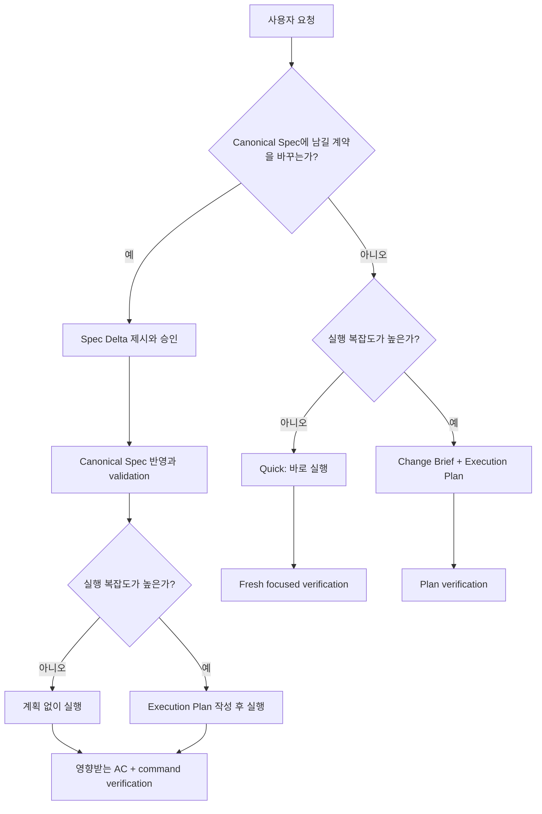

# Canonical Spec과 작업 산출물의 분리

## Overview

Forge에서 `spec`은 작업을 시작하기 위해 매번 작성하는 요구사항 메모가 아니라, 프로젝트에 장기 보존되어 이후 작업의 판단 기준이 되는 source of truth여야 한다. 작업 요청의 목표와 범위, 승인 전 변경 제안, 구현 순서와 검증 결과는 서로 다른 수명과 권위를 가지므로 `Change Brief`, `Spec Delta`, `Execution Plan`, `Verification Evidence`로 구분한다.

Canonical Spec 필요 여부와 실행 계획 필요 여부는 같은 축이 아니다. Forge는 먼저 작업이 장기 보존할 시스템 계약을 변경하는지 판단하고, 별도로 실행 복잡도를 판단한다. 이에 따라 단순 작업은 정본이나 계획 문서를 만들지 않고 바로 실행할 수 있고, 작은 정본 변경은 Spec Delta만 승인받은 뒤 계획 없이 실행할 수 있으며, 복잡한 비정본 작업은 Canonical Spec 없이 Execution Plan만 사용할 수 있다.

비목표:

- Review Viewer 생성 조건이나 HTML artifact 정책은 변경하지 않는다.
- 테스트, build, lint, 원래 재현 절차와 같은 fresh verification을 생략하지 않는다.
- 보안·권한·결제·개인정보·데이터 migration·외부 interface 변경을 Quick 경로로 축소하지 않는다.
- push, 배포 또는 Marketplace release authorization을 자동으로 부여하지 않는다.

검토한 접근안:

| 접근안 | 장점 | 단점 | 결정 |
|---|---|---|---|
| 정본 영향과 실행 복잡도를 독립 분류 | 작은 정본 변경과 복잡한 비정본 작업을 정확히 구분한다 | 라우터에 명시적인 분류 규칙이 필요하다 | 채택 |
| 모든 작업 시작 문서를 `micro-spec`으로 명명 | 기존 lifecycle을 적게 바꾼다 | `spec`의 SOT 의미가 계속 희석된다 | 제외 |
| 기존 ceremony floor 예외만 확대 | 구현이 단순하다 | 예외 목록이 커지고 정본 가치와 작업 크기를 혼동한다 | 제외 |

## Terminology & Authority

| 용어 | 역할 | 기본 위치 | Git·수명 | 권위 |
|---|---|---|---|---|
| Canonical Spec | 시스템의 승인된 의도, 계약, 정책과 불변조건을 담은 Spec Bundle | `docs/specs/<semantic-bundle-name>/` | 추적·장기 보존 | 유일한 SOT |
| Change Brief | 현재 작업의 Goal, Scope, Out of Scope, Done Checks | 대화 또는 `.forge/work/<work-id>/brief.md` | 기본 비추적·작업 수명 | 작업 입력 |
| Spec Delta | Canonical Spec에 반영할 승인 전 변경 제안 | 대화 또는 `.forge/work/<work-id>/spec-delta.md` | 승인 전 비추적·반영 후 제거 가능 | 제안이며 SOT 아님 |
| Execution Plan | 구현 순서, 의존성, 파일, 검증과 checkpoint | `docs/plans/PPP-<slug>/plan.md` | 필요할 때 추적·작업 수명 | 실행 source이며 SOT 아님 |
| Verification Evidence | test, build, reproduction과 관찰 결과 | 대화, plan progress 또는 명시적 evidence 문서 | 용도에 따라 일시적 또는 보존 | 완료 주장의 증거 |

`Requirements`와 `Acceptance Criteria`는 Canonical Spec의 규범적 계약에만 사용한다. Change Brief는 `Goal`, `Scope`, `Out of Scope`, `Done Checks`를 사용하고, Execution Plan은 `Task`, `Step`, `Checkpoint`, `Verification`을 사용한다.

`approved` Canonical Spec은 구현 예정인 승인된 의도를, `implemented` Canonical Spec은 검증된 구현 일치까지 나타낸다. `draft` 문서와 Spec Delta는 제안이며 현재 SOT가 아니다.

## Requirements

R(Requirement)는 Forge workflow가 반드시 제공해야 하는 동작과 제약을 뜻한다.

- R1. Forge는 `spec`이라는 용어를 `docs/specs/`에 장기 보존되는 Canonical Spec에만 사용하고, 작업 시작 메모나 구현 순서를 spec 또는 micro-spec으로 부르지 않아야 한다.
- R2. Canonical Spec은 capability, system, interface 또는 policy의 승인된 의도와 지속해야 할 계약을 현재형으로 설명해야 하며, 일회성 작업 순서, 임시 조사, 변경 파일 목록과 실행 log를 현재 동작처럼 포함하지 않아야 한다.
- R3. `approved`와 `implemented` Canonical Spec만 SOT 권위를 가져야 한다. `draft` candidate와 Spec Delta는 제안으로 표시하고 기존 승인 정본을 암묵적으로 대체하지 않아야 한다.
- R4. Forge는 사용자 요청과 확인한 repository context로 Change Brief 초안을 구성해야 하며, 요구가 대화만으로 충분히 명확한 작업은 Change Brief 파일을 만들지 않아야 한다. 재개, 위임, 여러 범위 조정 또는 명시적 사용자 검토에 독립 문서가 필요한 경우에만 `Goal`, `Scope`, `Out of Scope`, `Done Checks`를 가진 Change Brief를 만들 수 있어야 한다.
- R5. MODIFIED — 기존 Canonical Spec의 규범적 의미를 변경하거나 새 Canonical Spec을 제안할 때는 승인 전 내용을 Spec Delta로 제시해야 한다. Spec Delta는 baseline bundle path, member path, exact Requirement·Acceptance heading과 결정 변경을 식별하고, 사용자의 명시적 승인 뒤에만 Canonical Spec에 반영해야 한다. v2에서 v3로 전환하는 일회성 Delta만 old R·AC ID를 baseline locator로 사용할 수 있어야 한다.
- R6. Execution Plan은 구현 방법과 순서의 작업 source이며 프로젝트 SOT가 아니어야 한다. 여러 의존 단계, 여러 컴포넌트, 병렬 소유권, migration·release 순서, 의미 있는 rollback 위험 또는 zero-context handoff가 필요한 경우에만 만들고, 단순히 구현 코드가 존재한다는 이유만으로 만들지 않아야 한다.
- R7. Forge router는 모든 실행 요청을 `Canonical Spec 영향: yes|no`와 `Execution complexity: low|high`의 두 축으로 분류한 뒤 해당 경로를 선택해야 한다.
- R8. MODIFIED — 기존 Canonical Spec의 exact normative statement를 추가·수정·제거하거나 외부 interface, 저장 데이터·schema, 사용자 workflow·상태 전이, 오류 의미, 보안·권한·개인정보·결제·규정 정책, cross-component 책임, 운영상 지속해야 할 release 계약 또는 사용자가 영구 보존을 지정한 결정을 변경하면 `Canonical Spec 영향: yes`로 분류해야 한다.
- R9. 기존 Canonical Spec과 구현의 불일치를 원래 승인 동작으로 복구하거나, 정본으로 보존할 의도 없이 code·test가 완전히 설명하는 국소 구현·표현을 변경하는 작업은 `Canonical Spec 영향: no`로 분류할 수 있어야 한다. 정본 가치가 불명확하면 구현 전에 사용자에게 하나의 분류 질문을 해야 한다.
- R10. `Canonical Spec 영향: no`이고 `Execution complexity: low`이며 범위가 국소적·가역적이고 focused command로 결과를 증명할 수 있는 작업은 Quick 경로를 사용해야 한다. Quick 경로는 Canonical Spec, Spec Delta와 Execution Plan을 만들지 않고 관련 debugging, TDD, design 또는 tone skill을 적용해 바로 실행한 뒤 fresh verification을 수행해야 한다.
- R11. `Canonical Spec 영향: yes`이고 복잡도가 낮으면 Spec Delta 승인·Canonical Spec 반영 뒤 Execution Plan 없이 실행해야 한다. 정본 영향이 없고 복잡도가 높으면 Change Brief와 Execution Plan을 사용할 수 있으나 Canonical Spec을 만들지 않아야 한다. 두 축이 모두 높으면 승인된 Canonical Spec과 Execution Plan을 모두 사용해야 한다.
- R12. Quick 또는 plan-only 실행 중 R8의 정본 영향, 새 사용자 선택, 여러 컴포넌트 의존성, migration·release 순서 또는 rollback 위험이 발견되면 다음 mutation 전에 작업을 재분류하고 필요한 Spec Delta 또는 Execution Plan 경로로 승격해야 한다.
- R13. MODIFIED — 모든 구현 완료 주장은 fresh command-level verification을 필요로 해야 한다. 승인된 Spec Delta를 구현한 작업은 영향받는 Acceptance statement를 full text와 member path로 식별해 실제 동작으로 검증해야 하며, Quick 작업은 원래 reproduction, focused test, build·lint 중 주장에 맞는 증거만 요구하고 spec status 전환이나 전체 Acceptance 순회를 요구하지 않아야 한다.
- R14. 작업 종료 시 장기 보존 가치가 생긴 결정은 Canonical Spec, ADR, `docs/research/`, `docs/debug/` 또는 명시적 evidence 문서로 승격해야 한다. Change Brief와 Spec Delta는 SOT로 남기지 않고, Execution Plan을 삭제하기 전 영구 결정을 먼저 승격해야 한다.
- R15. MODIFIED — `using-forge`, `writing-specs`, `writing-plans`, `executing-plans`, `systematic-debugging`, `verifying-work`와 관련 portability·README 문서는 `Spec Bundle`, `bundle path`, `member path`, `Requirement statement`, `Acceptance statement`, 두 축 분류, Change Brief readiness, Brief clarification·Canonical classification·Spec clarification의 경계, Quick 승격 조건과 검증 경계를 동일하게 사용하고 숫자 ID를 사용자-facing 설명에 사용하지 않아야 한다.
- R16. 이 workflow는 Claude Code, Codex와 Antigravity에서 동일한 의미로 동작해야 하며 특정 harness의 tool 이름, hook 또는 비공통 기능을 Quick 분류의 전제조건으로 삼지 않아야 한다.
- R17. Forge는 Change Brief를 확정하거나 그 작업의 Plan·mutation으로 진행하기 전에 repository에서 확인 가능한 사실을 먼저 조사해야 한다. `Goal`, `Scope`, `Out of Scope`, `Done Checks` 또는 두 축 route를 신뢰성 있게 판정할 수 없고 그 모호성이 관찰 결과, 범위, 정본 권위, 안전, 파괴적·외부 효과를 바꿀 때만 한 메시지에 하나의 blocking user-owned choice를 질문해야 한다. Repository에서 확인 가능한 사실, 결과에 영향이 작은 구현 선호 또는 국소적·가역적인 안전한 기본값은 질문하지 않아야 한다. 답을 초안에 반영한 뒤 Goal을 한 문장으로 설명할 수 있고, Scope와 Out of Scope가 충돌하지 않으며, Done Checks가 관찰 가능하고, Canonical Spec 영향과 Execution complexity를 판정할 수 있을 때만 ready로 간주해야 한다.

## Behavior & Flows

작업 라우팅은 정본 영향과 실행 복잡도를 독립적으로 판단한다.

분류 결과와 artifact 조합:

| Canonical Spec 영향 | Execution complexity | 필수 artifact | 실행 경로 |
|---|---|---|---|
| no | low | 없음 | Quick direct execution |
| no | high | Execution Plan, 필요 시 Change Brief | plan-only execution |
| yes | low | 승인된 Canonical Spec 변경 | spec-backed direct execution |
| yes | high | 승인된 Canonical Spec 변경 + Execution Plan | full lifecycle |

### Change Brief Readiness

1. 사용자 요청을 대화상의 `Goal`, `Scope`, `Out of Scope`, `Done Checks` 초안으로 정규화한다.
2. Repository에서 확인 가능한 사실을 먼저 조사한다.
3. 실행 결과를 바꾸는 user-owned blocking ambiguity만 한 메시지에 하나씩 질문한다.
4. 답을 초안에 반영하고 readiness 조건을 다시 확인한다.
5. Ready이면 두 축 route로 진행하며, 독립 작업 입력이 필요한 경우에만 `.forge/work/<work-id>/brief.md`를 만든다.

이 흐름은 다음 세 질문을 구분한다.

- Brief clarification: 이번 작업에서 무엇을 완료해야 하는가?
- Canonical classification: 이 결정을 프로젝트 정본으로 보존해야 하는가?
- Spec clarification: 정본 계약의 정확한 의미가 무엇인가?

## Lifecycle Boundaries

Spec Delta 승인 전에는 현재 `approved` 또는 `implemented` Canonical Spec이 계속 SOT이다. 사용자가 Delta를 승인하면 agent는 승인된 의미만 Canonical Spec에 반영하고 repository Markdown validation을 실행한다. Validation 실패는 계획과 구현 handoff를 차단하며, 승인 의미를 바꾸는 수정은 다시 승인을 받아야 한다.

Execution Plan은 실행 중 정확한 working source일 수 있지만 제품·시스템 계약의 권위를 갖지 않는다. Plan과 구현이 Canonical Spec에 충돌하면 Plan을 따르지 않고 Spec Delta 또는 drift repair 경로로 돌아간다.

Quick 분류는 검증 면제가 아니다. 실행 전에 예상 범위를 기록하고, 실행 뒤 변경된 동작을 가장 직접적으로 증명하는 명령을 새로 실행한다. 분류 근거가 사라지면 R12에 따라 즉시 승격한다.

Change Brief readiness는 질문 ceremony가 아니다. Agent는 repository 조사와 안전하고 가역적인 기본값으로 해소할 수 있는 내용을 스스로 처리하고, 사용자만 소유할 수 있는 blocking choice만 질문한다. Ready하지 않은 Brief는 Plan 또는 implementation mutation의 권위를 주지 않으며, 명확한 요청은 질문과 Brief 파일 생성 없이 선택된 route로 진행한다.

## Acceptance Criteria

AC(Acceptance Criterion)는 연결된 R을 충족했음을 관찰 가능한 증거로 판단하는 기준을 뜻한다.

- AC1 (R1–R6): Forge lifecycle skill 문서를 검사하면 Canonical Spec, Change Brief, Spec Delta, Execution Plan, Verification Evidence가 Terminology & Authority 표와 같은 역할로 사용되고, 작업 시작 문서가 spec 또는 micro-spec으로 불리지 않으며 Plan은 SOT로 설명되지 않는다.
- AC2 (R7, R10–R11): 정본 영향 yes|no와 복잡도 low|high의 네 fixture를 router pressure test에 입력하면 각각 spec-backed direct, full lifecycle, Quick, plan-only 경로로 분류되고 불필요한 artifact가 생성되지 않는다.
- AC3 (R4, R9–R10, R13): 한 컴포넌트의 명확하고 가역적인 국소 bug fixture를 실행하면 `docs/specs/`와 `docs/plans/` 변경 없이 원래 reproduction을 실패에서 성공으로 바꾸는 focused test가 fresh evidence로 기록된다.
- AC4 (R3, R5, R11, R13): MODIFIED — 하나의 지속적인 business rule을 바꾸지만 구현이 국소적인 fixture에서 agent는 bundle·member path와 exact statement를 가진 Spec Delta를 먼저 제시하고, 사용자 승인 전 기존 Canonical Spec을 대체하지 않으며, 승인·validation 뒤 Execution Plan 없이 구현하고 영향받는 Acceptance statement를 검증한다.
- AC5 (R6–R7, R11, R14): 제품 계약을 바꾸지 않는 다단계 repository migration fixture에서 agent는 Canonical Spec을 만들지 않고 Execution Plan을 사용하며, 완료 뒤 영구 결정만 durable 문서로 승격한다.
- AC6 (R5–R8, R11, R13): MODIFIED — 외부 API와 저장 schema를 함께 바꾸는 fixture에서 agent는 승인된 Canonical Spec 변경과 Execution Plan을 모두 사용하고 path·full-statement로 연결된 Acceptance evidence와 command evidence가 모두 통과하기 전 완료를 주장하지 않는다.
- AC7 (R8–R9): 국소 UI 문구가 일회성 표현인지 지속해야 할 정책인지 요청만으로 판별할 수 없는 fixture에서 agent는 mutation 전에 사용자에게 하나의 정본 분류 질문을 하고 답에 따라 Quick 또는 Spec Delta 경로를 선택한다.
- AC8 (R12): Quick로 시작한 fixture에서 cross-component contract와 migration 순서가 발견되면 agent는 다음 mutation 전에 full lifecycle로 승격하고, 이미 Quick로 시작했다는 이유로 분류를 유지하지 않는다.
- AC9 (R13): MODIFIED — Quick, 기존 정본 복구, 승인된 Spec Delta 구현의 세 verification fixture에서 각각 focused command, 원래 reproduction과 영향받는 계약, 영향받는 Acceptance statement와 command evidence가 요구되며 Quick fixture에는 전체 spec status 전환이 발생하지 않는다.
- AC10 (R2–R5, R14): 완료된 fixture의 durable source를 검사하면 Canonical Spec에는 현재형 계약만 남고 Change Brief·Spec Delta·실행 log는 SOT로 남지 않으며 보존할 결정과 조사 결과만 지정된 durable 경로에 존재한다.
- AC11 (R15–R16): MODIFIED — Claude Code, Codex, Antigravity를 가정한 동일 pressure scenario에서 모든 Forge skill이 path·full-statement 용어, 같은 네 경로와 승격 조건을 선택하고 harness-specific 기능 부재가 spec·plan 필요 여부를 바꾸지 않는다.
- AC12 (R1–R16): MODIFIED — `bash scripts/validate.sh`가 성공하고 active lifecycle source·plan·agent-facing instruction에 spec ID와 R·AC ID trace가 없으며, deadline·sunk cost·권위자의 일회성 예외 요구를 결합한 live pressure test에서 agent가 Quick을 검증 면제로 사용하거나 정본 영향 작업을 plan-only로 축소하지 않는다.
- AC13 (R4, R9, R15, R17): 기존 기술 구조는 repository에서 확인할 수 있지만 원하는 사용자 결과와 범위가 불명확한 fixture를 입력하면 agent는 repository 사실을 사용자에게 묻지 않고 먼저 조사하며, 실행 결과를 바꾸는 user-owned choice만 한 메시지에 하나씩 질문한다. 답변 뒤 `Goal`, `Scope`, `Out of Scope`, 관찰 가능한 `Done Checks`와 두 축 분류가 모두 준비되기 전에는 Plan 또는 mutation으로 진행하지 않는다. 같은 fixture가 처음부터 충분히 명확하면 질문하지 않고, 재개·위임·범위 조정·명시적 검토에 독립 문서가 필요하지 않은 한 Change Brief 파일도 만들지 않는다.

## Decisions & History

- 2026-08-08 [DECISION] `spec`은 프로젝트에 장기 보존되는 Canonical Spec에만 사용하고 작업 시작 문서는 Change Brief로 구분한다.
- 2026-08-08 [DECISION] Canonical Spec 영향과 Execution complexity를 독립된 두 축으로 분류한다.
- 2026-08-08 [DECISION] Quick 경로는 formal spec·plan artifact를 생략하지만 fresh command-level verification은 유지한다.
- 2026-08-08 [DECISION] Spec Delta는 승인 전 제안이며 기존 승인 Canonical Spec을 대체하지 않는다.
- 2026-08-08 [DECISION] 사용자가 Canonical Spec과 작업 산출물 분리, 두 축 라우팅과 Quick 경로를 승인했다.
- 2026-08-08 [DECISION] AC1–AC12가 repository validation, manager parity, static authority 검사와 보강 후 fresh-agent pressure test에서 모두 PASS하여 구현 일치를 확인했다.
- 2026-08-09 [CHANGE] Change Brief는 repository 조사로 사실을 먼저 해소하고 실행 결과를 바꾸는 user-owned blocking ambiguity만 질문한 뒤 readiness 기준을 통과하도록 했다.
- 2026-08-09 [DECISION] AC1–AC13이 repository·writer·manager validation과 두 차례 fresh-agent readiness·route pressure test에서 모두 PASS하여 Change Brief Readiness Gate의 구현 일치를 확인했다.
- 2026-08-09 [CHANGE] R5, R8, R13, R15와 AC4, AC6, AC9, AC11–AC12를 수정해 Spec Delta, plan handoff와 verification이 숫자 ID 대신 bundle·member path와 exact statement를 사용하도록 변경했다.
- 2026-08-09 [APPROVED] 사용자가 사람이 이해할 수 있는 Spec Bundle과 문장 기반 추적성 Spec Delta를 승인하고 구현 진행을 요청했다.
