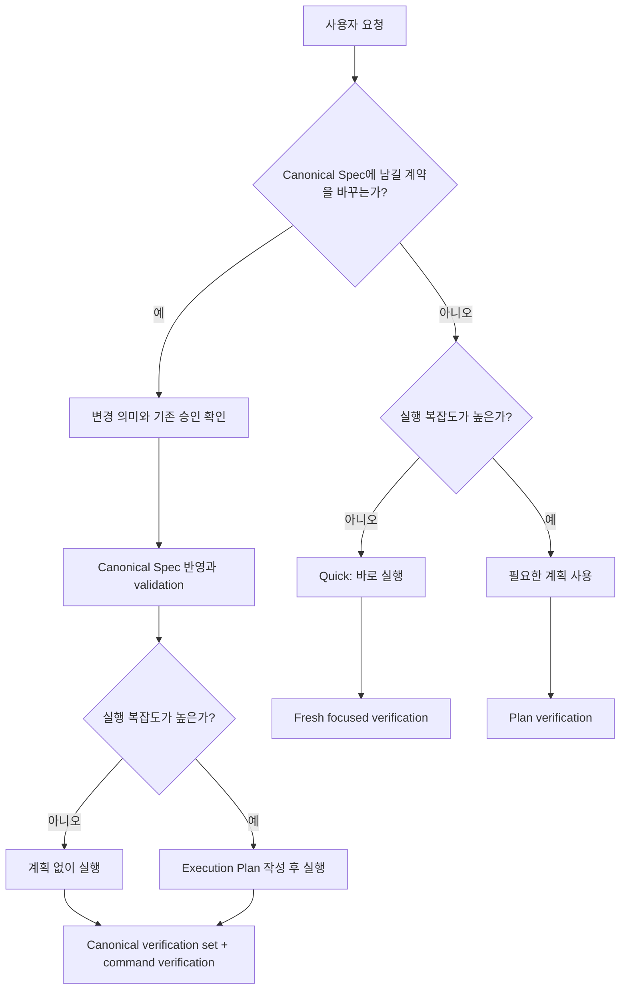

# Canonical Spec과 작업 산출물 경계

## Documents

- root: [Canonical Spec과 작업 산출물 경계](canonical-spec-and-work-artifact-boundaries.md)
- contract: [라우팅과 Lifecycle Gate](routing-and-lifecycle-gates.md)
- contract: [검증과 지속 권위](verification-and-durable-authority.md)
- history: [현재 결정](decisions-and-change-history.md)

## Overview

Forge에서 `spec`은 작업을 시작하기 위해 매번 작성하는 요구사항 메모가 아니라, 프로젝트에 장기 보존되어 이후 작업의 판단 기준이 되는 source of truth여야 한다. 작업 요청의 목표와 범위, 승인 전 변경 제안, 구현 순서와 검증 결과는 서로 다른 수명과 권위를 가지므로 `Change Brief`, `Spec Delta`, `Execution Plan`, `Verification Evidence`로 구분한다.

Canonical Spec 필요 여부와 실행 계획 필요 여부는 같은 축이 아니다. Forge는 먼저 작업이 장기 보존할 시스템 계약을 변경하는지 판단하고, 별도로 실행 복잡도를 판단한다. 이에 따라 단순 작업은 정본이나 계획 문서를 만들지 않고 바로 실행할 수 있고, 작은 정본 변경은 Spec Delta만 승인받은 뒤 계획 없이 실행할 수 있으며, 복잡한 비정본 작업은 Canonical Spec 없이 Execution Plan만 사용할 수 있다.

비목표:

- 테스트, build, lint, 원래 재현 절차와 같은 fresh verification을 생략하지 않는다.
- 보안·권한·결제·개인정보·데이터 migration·외부 interface 변경을 Quick 경로로 축소하지 않는다.
- push, 배포 또는 Marketplace release authorization을 자동으로 부여하지 않는다.

## Terminology & Authority

| 용어 | 역할 | 기본 위치 | Git·수명 | 권위 |
|---|---|---|---|---|
| Canonical Spec | 시스템의 승인된 의도, 계약, 정책과 불변조건을 담은 Spec Bundle | `docs/specs/<semantic-bundle-name>/` | 추적·장기 보존 | 유일한 SOT |
| Change Brief | 현재 작업의 Goal, Scope, Out of Scope, Done Checks | 대화 또는 `.forge/work/<work-id>/brief.md` | 기본 비추적·작업 수명 | 작업 입력 |
| Spec Delta | Canonical Spec에 반영할 승인 전 변경 제안 | 대화 또는 `.forge/work/<work-id>/spec-delta.md` | 승인 전 비추적·반영 후 제거 가능 | 제안이며 SOT 아님 |
| Execution Plan | 구현 순서, 의존성, 검증과 복구 지점 | 앱·기존 기록 또는 프로젝트가 선택한 `docs/plans/` 경로 | 필요할 때 추적·작업 수명 | 실행 source이며 SOT 아님 |
| Verification Evidence | test, build, reproduction과 관찰 결과 | 대화, plan progress 또는 명시적 evidence 문서 | 용도에 따라 일시적 또는 보존 | 완료 주장의 증거 |

`Requirements`와, bundle이 선택한 경우 `Acceptance Criteria`는 Canonical Spec의 규범적 계약에만 사용한다. Change Brief는 `Goal`, `Scope`, `Out of Scope`, `Done Checks`를 사용하고, Execution Plan은 `Task`, `Step`, `Checkpoint`, `Verification`을 사용한다.

`approved` Canonical Spec은 구현 예정인 승인된 의도를, `implemented` Canonical Spec은 검증된 구현 일치까지 나타낸다. `draft` 문서와 Spec Delta는 제안이며 현재 SOT가 아니다.

## Behavior & Flows

작업 라우팅은 정본 영향과 실행 복잡도를 독립적으로 판단한다.

분류 결과와 artifact 조합:

| Canonical Spec 영향 | Execution complexity | 필수 artifact | 실행 경로 |
|---|---|---|---|
| no | low | 없음 | Quick direct execution |
| no | high | Execution Plan, 필요 시 Change Brief | plan-only execution |
| yes | low | 승인된 Canonical Spec 변경 | spec-backed direct execution |
| yes | high | 승인된 Canonical Spec 변경 + Execution Plan | full lifecycle |

### 작업 이해

목표와 기대 결과를 파악하고 repository 사실을 조사한다. 결과·범위·권한에 영향을 주는 미해결 선택만 질문하며 독립 질문은 함께 물을 수 있다. 가역적인 세부 선택은 판단해서 진행한다. 별도 준비 양식이나 질문 분류는 필요하지 않다.

## Lifecycle Boundaries

구체적인 변경 의미가 승인되기 전에는 현재 `approved` 또는 `implemented` Canonical Spec이 계속 SOT이다. 사용자가 변경 의미를 구체적으로 지시하거나 Delta를 승인하면 agent는 승인된 의미만 Canonical Spec에 반영하고 repository Markdown validation을 실행한다. Validation 실패는 계획과 구현 handoff를 차단하며, 승인 범위 밖의 의미나 효과를 추가하는 수정은 사용자 결정을 받아야 한다.

Execution Plan은 실행 중 정확한 working source일 수 있지만 제품·시스템 계약의 권위를 갖지 않는다. Plan과 구현이 Canonical Spec에 충돌하면 Plan을 따르지 않고 Spec Delta 또는 drift repair 경로로 돌아간다.

Quick 분류는 검증 면제가 아니다. 변경된 동작을 직접 증명하는 검사를 수행하고 현재 상태에 적용되는 기존 증거는 재사용한다. 정본 영향이나 실행 복잡도의 분류 근거가 달라지면 다음 mutation 전에 해당 lifecycle 경로로 즉시 승격한다.

사용자의 목표와 중요한 선택이 분명하면 작업을 진행한다. 질문이나 Brief 파일 자체는 실행 권한이나 품질의 증거가 아니다.

## Requirements

### Forge는 `spec`이라는 용어를 `docs/specs/`에 장기 보존되는 Canonical Spec에만 사용하고, 작업 시작 메모나 구현 순서를 spec 또는 micro-spec으로 부르지 않아야 한다.

### Canonical Spec은 capability, system, interface 또는 policy의 승인된 의도와 지속해야 할 계약을 현재형으로 설명해야 하며, 일회성 작업 순서, 임시 조사, 변경 파일 목록과 실행 log를 현재 동작처럼 포함하지 않아야 한다.

### `approved`와 `implemented` Canonical Spec만 SOT 권위를 가져야 한다. `draft` candidate와 Spec Delta는 제안으로 표시하고 기존 승인 정본을 암묵적으로 대체하지 않아야 한다.

### Forge는 요청의 목표와 관찰 가능한 완료 조건을 파악하고 재개·협업·검토에 필요한 경우에만 별도 작업 입력을 기록해야 한다.

### Canonical Spec 변경은 대상과 의미를 명확히 하고 사용자가 구체적으로 지시하거나 승인한 범위에서만 반영해야 한다.

Spec Delta는 baseline bundle path·hash, member path와 exact statement 변경을 보존한다. 사용자가 대상·변경 의미·효과를 이미 구체적으로 지시했으면 같은 결정을 다시 승인받지 않는다. 미해결 계약 충돌, 추가 범위나 효과에는 사용자 판단이 필요하며 승인되지 않은 제안은 정본을 대체하지 않는다.

### Execution Plan은 프로젝트 SOT와 구분되는 작업 기록이며 복잡성·조정·복구에 도움이 되는 수준으로 작성해야 한다.

앱의 계획이나 기존 작업 기록을 재사용한다. 독립 검토·인계·세션 간 복구에 파일이 필요한 경우에는 구조화된 docs/plans 형식을 사용한다. 파일 수나 여러 단계가 있다는 사실만으로 별도 파일을 강제하지 않는다.

## Acceptance Criteria

### Forge lifecycle skill 문서를 검사하면 Canonical Spec, Change Brief, Spec Delta, Execution Plan, Verification Evidence가 Terminology & Authority 표와 같은 역할로 사용되고, 작업 시작 문서가 spec 또는 micro-spec으로 불리지 않으며 Plan은 SOT로 설명되지 않는다.

검증하는 요구사항:

- [Forge는 `spec`이라는 용어를 `docs/specs/`에 장기 보존되는 Canonical Spec에만 사용하고, 작업 시작 메모나 구현 순서를 spec 또는 micro-spec으로 부르지 않아야 한다.](canonical-spec-and-work-artifact-boundaries.md#forge는-spec이라는-용어를-docsspecs에-장기-보존되는-canonical-spec에만-사용하고-작업-시작-메모나-구현-순서를-spec-또는-micro-spec으로-부르지-않아야-한다)
- [Canonical Spec은 capability, system, interface 또는 policy의 승인된 의도와 지속해야 할 계약을 현재형으로 설명해야 하며, 일회성 작업 순서, 임시 조사, 변경 파일 목록과 실행 log를 현재 동작처럼 포함하지 않아야 한다.](canonical-spec-and-work-artifact-boundaries.md#canonical-spec은-capability-system-interface-또는-policy의-승인된-의도와-지속해야-할-계약을-현재형으로-설명해야-하며-일회성-작업-순서-임시-조사-변경-파일-목록과-실행-log를-현재-동작처럼-포함하지-않아야-한다)
- [`approved`와 `implemented` Canonical Spec만 SOT 권위를 가져야 한다. `draft` candidate와 Spec Delta는 제안으로 표시하고 기존 승인 정본을 암묵적으로 대체하지 않아야 한다.](canonical-spec-and-work-artifact-boundaries.md#approved와-implemented-canonical-spec만-sot-권위를-가져야-한다-draft-candidate와-spec-delta는-제안으로-표시하고-기존-승인-정본을-암묵적으로-대체하지-않아야-한다)
- [Forge는 요청의 목표와 관찰 가능한 완료 조건을 파악하고 재개·협업·검토에 필요한 경우에만 별도 작업 입력을 기록해야 한다.](canonical-spec-and-work-artifact-boundaries.md#forge는-요청의-목표와-관찰-가능한-완료-조건을-파악하고-재개협업검토에-필요한-경우에만-별도-작업-입력을-기록해야-한다)
- [Canonical Spec 변경은 대상과 의미를 명확히 하고 사용자가 구체적으로 지시하거나 승인한 범위에서만 반영해야 한다.](canonical-spec-and-work-artifact-boundaries.md#canonical-spec-변경은-대상과-의미를-명확히-하고-사용자가-구체적으로-지시하거나-승인한-범위에서만-반영해야-한다)
- [Execution Plan은 프로젝트 SOT와 구분되는 작업 기록이며 복잡성·조정·복구에 도움이 되는 수준으로 작성해야 한다.](canonical-spec-and-work-artifact-boundaries.md#execution-plan은-프로젝트-sot와-구분되는-작업-기록이며-복잡성조정복구에-도움이-되는-수준으로-작성해야-한다)

### 제품 계약을 바꾸지 않는 다단계 repository migration fixture에서 agent는 Canonical Spec을 만들지 않고 Execution Plan을 사용하며, 완료 뒤 영구 결정만 durable 문서로 승격한다.

검증하는 요구사항:

- [Execution Plan은 프로젝트 SOT와 구분되는 작업 기록이며 복잡성·조정·복구에 도움이 되는 수준으로 작성해야 한다.](canonical-spec-and-work-artifact-boundaries.md#execution-plan은-프로젝트-sot와-구분되는-작업-기록이며-복잡성조정복구에-도움이-되는-수준으로-작성해야-한다)
- [Forge는 지속 계약 영향과 실행 복잡성을 별도로 판단하고 필요한 계약·계획·검증만 적용해야 한다.](routing-and-lifecycle-gates.md#forge는-지속-계약-영향과-실행-복잡성을-별도로-판단하고-필요한-계약계획검증만-적용해야-한다)
- [지속 계약을 바꾸는 작업은 승인된 의미를 정본에 반영하고 실행 복잡성에 맞는 계획을 사용하며 계약 의미를 바꾸지 않는 작업에는 정본을 새로 만들지 않아야 한다.](routing-and-lifecycle-gates.md#지속-계약을-바꾸는-작업은-승인된-의미를-정본에-반영하고-실행-복잡성에-맞는-계획을-사용하며-계약-의미를-바꾸지-않는-작업에는-정본을-새로-만들지-않아야-한다)
- [작업 종료 시 장기 보존 가치가 생긴 결정은 Canonical Spec, ADR, `docs/research/`, `docs/debug/` 또는 명시적 evidence 문서로 승격해야 한다. Change Brief와 Spec Delta는 SOT로 남기지 않고, Execution Plan을 삭제하기 전 영구 결정을 먼저 승격해야 한다.](verification-and-durable-authority.md#작업-종료-시-장기-보존-가치가-생긴-결정은-canonical-spec-adr-docsresearch-docsdebug-또는-명시적-evidence-문서로-승격해야-한다-change-brief와-spec-delta는-sot로-남기지-않고-execution-plan을-삭제하기-전-영구-결정을-먼저-승격해야-한다)
