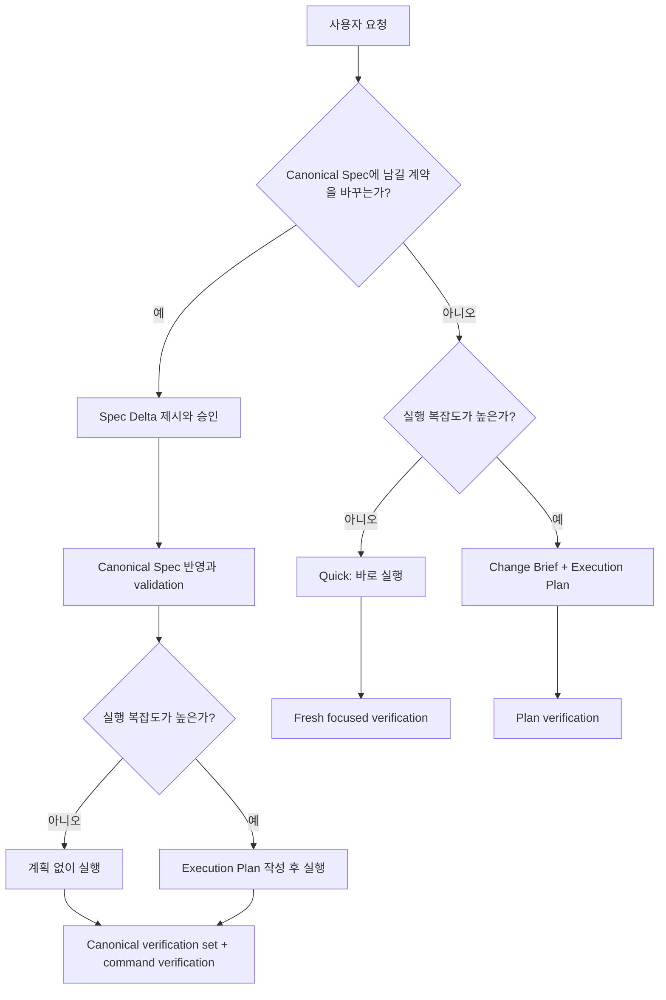

# Canonical Spec과 작업 산출물 경계

## Documents

- root: [Canonical Spec과 작업 산출물 경계](canonical-spec-and-work-artifact-boundaries.md)
- contract: [라우팅과 Lifecycle Gate](routing-and-lifecycle-gates.md)
- contract: [검증과 지속 권위](verification-and-durable-authority.md)
- history: [현재 결정](decisions-and-change-history.md)

## Overview

Forge에서 `spec`은 작업을 시작하기 위해 매번 작성하는 요구사항 메모가 아니라, 프로젝트에 장기 보존되어 이후 작업의 판단 기준이 되는 source of truth여야 한다. 작업 요청의 목표와 범위, 승인 전 변경 제안, 구현 순서와 검증 결과는 서로 다른 수명과 권위를 가지므로 `Change Brief`, `Spec Delta`, `Execution Plan`, `Verification Evidence`로 구분한다.

Canonical Spec 필요 여부와 실행 계획 필요 여부는 같은 축이 아니다. Forge는 먼저 작업이 장기 보존할 시스템 계약을 변경하는지 판단하고, 별도로 실행 복잡도를 판단한다. 이에 따라 단순 작업은 정본이나 계획 문서를 만들지 않고 바로 실행할 수 있고, 작은 정본 변경은 Spec Delta만 승인받은 뒤 계획 없이 실행할 수 있으며, 복잡한 비정본 작업은 Canonical Spec 없이 Execution Plan만 사용할 수 있다.

비목표:

- 테스트, build, lint, 원래 재현 절차와 같은 fresh verification을 생략하지 않는다.
- 보안·권한·결제·개인정보·데이터 migration·외부 interface 변경을 Quick 경로로 축소하지 않는다.
- push, 배포 또는 Marketplace release authorization을 자동으로 부여하지 않는다.

## Terminology & Authority

| 용어 | 역할 | 기본 위치 | Git·수명 | 권위 |
|---|---|---|---|---|
| Canonical Spec | 시스템의 승인된 의도, 계약, 정책과 불변조건을 담은 Spec Bundle | `docs/specs/<semantic-bundle-name>/` | 추적·장기 보존 | 유일한 SOT |
| Change Brief | 현재 작업의 Goal, Scope, Out of Scope, Done Checks | 대화 또는 `.forge/work/<work-id>/brief.md` | 기본 비추적·작업 수명 | 작업 입력 |
| Spec Delta | Canonical Spec에 반영할 승인 전 변경 제안 | 대화 또는 `.forge/work/<work-id>/spec-delta.md` | 승인 전 비추적·반영 후 제거 가능 | 제안이며 SOT 아님 |
| Execution Plan | 구현 순서, 의존성, 파일, 검증과 checkpoint | `docs/plans/PPP-<slug>/plan.md` | 필요할 때 추적·작업 수명 | 실행 source이며 SOT 아님 |
| Verification Evidence | test, build, reproduction과 관찰 결과 | 대화, plan progress 또는 명시적 evidence 문서 | 용도에 따라 일시적 또는 보존 | 완료 주장의 증거 |

`Requirements`와, bundle이 선택한 경우 `Acceptance Criteria`는 Canonical Spec의 규범적 계약에만 사용한다. Change Brief는 `Goal`, `Scope`, `Out of Scope`, `Done Checks`를 사용하고, Execution Plan은 `Task`, `Step`, `Checkpoint`, `Verification`을 사용한다.

`approved` Canonical Spec은 구현 예정인 승인된 의도를, `implemented` Canonical Spec은 검증된 구현 일치까지 나타낸다. `draft` 문서와 Spec Delta는 제안이며 현재 SOT가 아니다.

## Behavior & Flows

작업 라우팅은 정본 영향과 실행 복잡도를 독립적으로 판단한다.

분류 결과와 artifact 조합:

| Canonical Spec 영향 | Execution complexity | 필수 artifact | 실행 경로 |
|---|---|---|---|
| no | low | 없음 | Quick direct execution |
| no | high | Execution Plan, 필요 시 Change Brief | plan-only execution |
| yes | low | 승인된 Canonical Spec 변경 | spec-backed direct execution |
| yes | high | 승인된 Canonical Spec 변경 + Execution Plan | full lifecycle |

### Change Brief Readiness

1. 목표, 범위, 비범위와 완료 조건을 확인한다. 명확한 국소 요청은 내부 판단과 짧은 목표·검증 안내로 충분하다.
2. Repository에서 확인 가능한 사실을 먼저 조사한다.
3. 실행 결과를 바꾸는 user-owned blocking ambiguity만 한 메시지에 하나씩 질문한다.
4. 답을 초안에 반영하고 readiness 조건을 다시 확인한다.
5. Ready이면 두 축 route로 진행하며, 독립 작업 입력이 필요한 경우에만 `.forge/work/<work-id>/brief.md`를 만든다.

이 흐름은 다음 세 질문을 구분한다.

- Brief clarification: 이번 작업에서 무엇을 완료해야 하는가?
- Canonical classification: 이 결정을 프로젝트 정본으로 보존해야 하는가?
- Spec clarification: 정본 계약의 정확한 의미가 무엇인가?

## Lifecycle Boundaries

Spec Delta 승인 전에는 현재 `approved` 또는 `implemented` Canonical Spec이 계속 SOT이다. 사용자가 Delta를 승인하면 agent는 승인된 의미만 Canonical Spec에 반영하고 repository Markdown validation을 실행한다. Validation 실패는 계획과 구현 handoff를 차단하며, 승인 의미를 바꾸는 수정은 다시 승인을 받아야 한다.

Execution Plan은 실행 중 정확한 working source일 수 있지만 제품·시스템 계약의 권위를 갖지 않는다. Plan과 구현이 Canonical Spec에 충돌하면 Plan을 따르지 않고 Spec Delta 또는 drift repair 경로로 돌아간다.

Quick 분류는 검증 면제가 아니다. 실행 전에 예상 범위를 기록하고, 실행 뒤 변경된 동작을 가장 직접적으로 증명하는 명령을 새로 실행한다. 정본 영향이나 실행 복잡도의 분류 근거가 달라지면 다음 mutation 전에 해당 lifecycle 경로로 즉시 승격한다.

Change Brief readiness는 질문 ceremony가 아니다. Agent는 repository 조사와 안전하고 가역적인 기본값으로 해소할 수 있는 내용을 스스로 처리하고, 사용자만 소유할 수 있는 blocking choice만 질문한다. Ready하지 않은 Brief는 Plan 또는 implementation mutation의 권위를 주지 않으며, 명확한 요청은 질문과 Brief 파일 생성 없이 선택된 route로 진행한다.

## Requirements

### Forge는 `spec`이라는 용어를 `docs/specs/`에 장기 보존되는 Canonical Spec에만 사용하고, 작업 시작 메모나 구현 순서를 spec 또는 micro-spec으로 부르지 않아야 한다.

### Canonical Spec은 capability, system, interface 또는 policy의 승인된 의도와 지속해야 할 계약을 현재형으로 설명해야 하며, 일회성 작업 순서, 임시 조사, 변경 파일 목록과 실행 log를 현재 동작처럼 포함하지 않아야 한다.

### `approved`와 `implemented` Canonical Spec만 SOT 권위를 가져야 한다. `draft` candidate와 Spec Delta는 제안으로 표시하고 기존 승인 정본을 암묵적으로 대체하지 않아야 한다.

### Forge는 사용자 요청과 repository context에서 목표, 범위, 비범위와 관찰 가능한 완료 조건을 확인해야 한다. 명확한 국소 작업은 이를 내부적으로 판단하고 목표와 검증을 짧게 알린 뒤 실행하며 네 필드를 별도 양식으로 출력하거나 파일로 만들지 않아야 한다. 재개, 위임, 여러 범위 조정 또는 명시적 사용자 검토에 독립 문서가 필요한 경우에만 Change Brief 파일을 만들 수 있어야 한다.

### 기존 Canonical Spec의 규범적 의미를 변경하거나 새 Canonical Spec을 제안할 때는 승인 전 내용을 Spec Delta로 제시해야 한다. Spec Delta는 baseline bundle path, member path, exact Requirement·Acceptance heading과 결정 변경을 식별하고 사용자의 명시적 승인 뒤에만 Canonical Spec에 반영해야 한다.

### Execution Plan은 구현 방법과 순서의 작업 source이며 프로젝트 SOT가 아니어야 한다. 여러 의존 단계, 여러 컴포넌트, 병렬 소유권, migration·release 순서, 의미 있는 rollback 위험 또는 zero-context handoff가 필요한 경우에만 만들고, 단순히 구현 코드가 존재한다는 이유만으로 만들지 않아야 한다.

## Acceptance Criteria

### Forge lifecycle skill 문서를 검사하면 Canonical Spec, Change Brief, Spec Delta, Execution Plan, Verification Evidence가 Terminology & Authority 표와 같은 역할로 사용되고, 작업 시작 문서가 spec 또는 micro-spec으로 불리지 않으며 Plan은 SOT로 설명되지 않는다.

검증하는 요구사항:

- [Forge는 `spec`이라는 용어를 `docs/specs/`에 장기 보존되는 Canonical Spec에만 사용하고, 작업 시작 메모나 구현 순서를 spec 또는 micro-spec으로 부르지 않아야 한다.](canonical-spec-and-work-artifact-boundaries.md#forge는-spec이라는-용어를-docsspecs에-장기-보존되는-canonical-spec에만-사용하고-작업-시작-메모나-구현-순서를-spec-또는-micro-spec으로-부르지-않아야-한다)
- [Canonical Spec은 capability, system, interface 또는 policy의 승인된 의도와 지속해야 할 계약을 현재형으로 설명해야 하며, 일회성 작업 순서, 임시 조사, 변경 파일 목록과 실행 log를 현재 동작처럼 포함하지 않아야 한다.](canonical-spec-and-work-artifact-boundaries.md#canonical-spec은-capability-system-interface-또는-policy의-승인된-의도와-지속해야-할-계약을-현재형으로-설명해야-하며-일회성-작업-순서-임시-조사-변경-파일-목록과-실행-log를-현재-동작처럼-포함하지-않아야-한다)
- [`approved`와 `implemented` Canonical Spec만 SOT 권위를 가져야 한다. `draft` candidate와 Spec Delta는 제안으로 표시하고 기존 승인 정본을 암묵적으로 대체하지 않아야 한다.](canonical-spec-and-work-artifact-boundaries.md#approved와-implemented-canonical-spec만-sot-권위를-가져야-한다-draft-candidate와-spec-delta는-제안으로-표시하고-기존-승인-정본을-암묵적으로-대체하지-않아야-한다)
- [Forge는 사용자 요청과 repository context에서 목표, 범위, 비범위와 관찰 가능한 완료 조건을 확인해야 한다. 명확한 국소 작업은 이를 내부적으로 판단하고 목표와 검증을 짧게 알린 뒤 실행하며 네 필드를 별도 양식으로 출력하거나 파일로 만들지 않아야 한다. 재개, 위임, 여러 범위 조정 또는 명시적 사용자 검토에 독립 문서가 필요한 경우에만 Change Brief 파일을 만들 수 있어야 한다.](canonical-spec-and-work-artifact-boundaries.md#forge는-사용자-요청과-repository-context에서-목표-범위-비범위와-관찰-가능한-완료-조건을-확인해야-한다-명확한-국소-작업은-이를-내부적으로-판단하고-목표와-검증을-짧게-알린-뒤-실행하며-네-필드를-별도-양식으로-출력하거나-파일로-만들지-않아야-한다-재개-위임-여러-범위-조정-또는-명시적-사용자-검토에-독립-문서가-필요한-경우에만-change-brief-파일을-만들-수-있어야-한다)
- [기존 Canonical Spec의 규범적 의미를 변경하거나 새 Canonical Spec을 제안할 때는 승인 전 내용을 Spec Delta로 제시해야 한다. Spec Delta는 baseline bundle path, member path, exact Requirement·Acceptance heading과 결정 변경을 식별하고 사용자의 명시적 승인 뒤에만 Canonical Spec에 반영해야 한다.](canonical-spec-and-work-artifact-boundaries.md#기존-canonical-spec의-규범적-의미를-변경하거나-새-canonical-spec을-제안할-때는-승인-전-내용을-spec-delta로-제시해야-한다-spec-delta는-baseline-bundle-path-member-path-exact-requirementacceptance-heading과-결정-변경을-식별하고-사용자의-명시적-승인-뒤에만-canonical-spec에-반영해야-한다)
- [Execution Plan은 구현 방법과 순서의 작업 source이며 프로젝트 SOT가 아니어야 한다. 여러 의존 단계, 여러 컴포넌트, 병렬 소유권, migration·release 순서, 의미 있는 rollback 위험 또는 zero-context handoff가 필요한 경우에만 만들고, 단순히 구현 코드가 존재한다는 이유만으로 만들지 않아야 한다.](canonical-spec-and-work-artifact-boundaries.md#execution-plan은-구현-방법과-순서의-작업-source이며-프로젝트-sot가-아니어야-한다-여러-의존-단계-여러-컴포넌트-병렬-소유권-migrationrelease-순서-의미-있는-rollback-위험-또는-zero-context-handoff가-필요한-경우에만-만들고-단순히-구현-코드가-존재한다는-이유만으로-만들지-않아야-한다)

### 제품 계약을 바꾸지 않는 다단계 repository migration fixture에서 agent는 Canonical Spec을 만들지 않고 Execution Plan을 사용하며, 완료 뒤 영구 결정만 durable 문서로 승격한다.

검증하는 요구사항:

- [Execution Plan은 구현 방법과 순서의 작업 source이며 프로젝트 SOT가 아니어야 한다. 여러 의존 단계, 여러 컴포넌트, 병렬 소유권, migration·release 순서, 의미 있는 rollback 위험 또는 zero-context handoff가 필요한 경우에만 만들고, 단순히 구현 코드가 존재한다는 이유만으로 만들지 않아야 한다.](canonical-spec-and-work-artifact-boundaries.md#execution-plan은-구현-방법과-순서의-작업-source이며-프로젝트-sot가-아니어야-한다-여러-의존-단계-여러-컴포넌트-병렬-소유권-migrationrelease-순서-의미-있는-rollback-위험-또는-zero-context-handoff가-필요한-경우에만-만들고-단순히-구현-코드가-존재한다는-이유만으로-만들지-않아야-한다)
- [Forge router는 모든 실행 요청을 `Canonical Spec 영향: yes|no`와 `Execution complexity: low|high`의 두 축으로 분류한 뒤 해당 경로를 선택해야 한다.](routing-and-lifecycle-gates.md#forge-router는-모든-실행-요청을-canonical-spec-영향-yesno와-execution-complexity-lowhigh의-두-축으로-분류한-뒤-해당-경로를-선택해야-한다)
- [`Canonical Spec 영향: yes`이고 복잡도가 낮으면 Spec Delta 승인·Canonical Spec 반영 뒤 Execution Plan 없이 실행해야 한다. 정본 영향이 없고 복잡도가 높으면 Change Brief와 Execution Plan을 사용할 수 있으나 Canonical Spec을 만들지 않아야 한다. 두 축이 모두 높으면 승인된 Canonical Spec과 Execution Plan을 모두 사용해야 한다.](routing-and-lifecycle-gates.md#canonical-spec-영향-yes이고-복잡도가-낮으면-spec-delta-승인canonical-spec-반영-뒤-execution-plan-없이-실행해야-한다-정본-영향이-없고-복잡도가-높으면-change-brief와-execution-plan을-사용할-수-있으나-canonical-spec을-만들지-않아야-한다-두-축이-모두-높으면-승인된-canonical-spec과-execution-plan을-모두-사용해야-한다)
- [작업 종료 시 장기 보존 가치가 생긴 결정은 Canonical Spec, ADR, `docs/research/`, `docs/debug/` 또는 명시적 evidence 문서로 승격해야 한다. Change Brief와 Spec Delta는 SOT로 남기지 않고, Execution Plan을 삭제하기 전 영구 결정을 먼저 승격해야 한다.](verification-and-durable-authority.md#작업-종료-시-장기-보존-가치가-생긴-결정은-canonical-spec-adr-docsresearch-docsdebug-또는-명시적-evidence-문서로-승격해야-한다-change-brief와-spec-delta는-sot로-남기지-않고-execution-plan을-삭제하기-전-영구-결정을-먼저-승격해야-한다)
