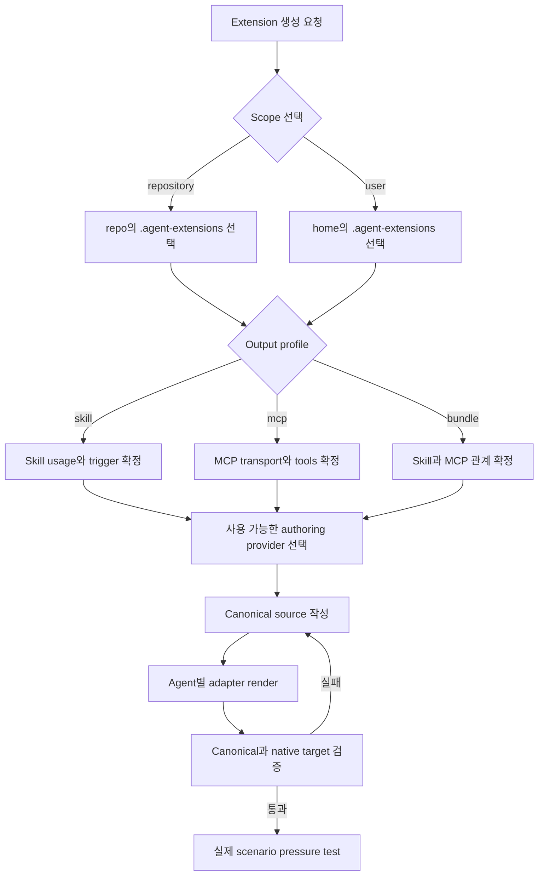

# 여러 에이전트용 extension 생성

## Documents

- root: [여러 에이전트용 extension 생성](cross-agent-extension-creation.md)

## Overview

Forge에 `creating-agent-extensions` 사용자 스킬을 추가한다. 이 스킬은 현재 저장소 또는 사용자 홈에서 skill, MCP server 또는 이들의 bundle을 만들 때 Codex, Claude Code, Antigravity가 같은 공통 정본을 사용하도록 source 구조를 만들고, 에이전트별 discovery·configuration 차이는 얇은 adapter로 생성·검증한다.

이 기능의 목적은 Marketplace package를 만들거나 배포하는 것이 아니다. Forge를 사용해 agent extension을 작성하는 시점에 중복과 drift를 막는 공통 authoring 구조를 제공하는 것이 목적이다.

범위에 포함하지 않는 항목:

- Marketplace entry, 배포용 plugin manifest 또는 설치 package 생성
- publish, release, version bump, 원격 저장소 push
- 기존 extension의 자동 migration
- credentials 또는 secret 값을 canonical source나 adapter에 기록
- hooks, rules, apps 등 agent 전용 component의 공통화
- MCP protocol server 자체의 완전한 구현을 Forge가 직접 소유하는 것

## Behavior & Flows

공통 extension은 authoring source이고, native entry는 agent가 source를 발견하거나 MCP 설정을 읽게 하는 adapter다. skill adapter는 canonical instruction을 가리키고, MCP adapter는 canonical JSON을 각 agent의 native configuration 형식으로 렌더링한다. 생성된 native entry는 배포 artifact가 아니라 같은 machine 또는 repository에서 canonical source를 사용하는 연결 계층이다.



검토한 구조:

| 방식 | 장점 | 단점 | 결정 |
|---|---|---|---|
| agent별 skill·MCP 전체 복사 | 각 agent 경로에서 바로 보임 | 내용과 설정이 세 벌로 갈라지고 update drift가 발생함 | 제외 |
| `.agent-extensions/` canonical source + 얇은 skill entry + 생성형 MCP adapter | 정본이 하나이며 agent별 native 형식을 정확히 지원함 | adapter render와 ownership validation이 필요함 | 채택 |
| canonical source만 만들고 native 연결은 사용자에게 맡김 | 구현이 가장 단순함 | 실제 agent discovery와 MCP activation을 보장하지 못함 | 제외 |

## Data & Interfaces

Canonical layout:

```text
<scope-root>/.agent-extensions/<extension-name>/
├── extension.json
├── skills/
│   └── <skill-name>/
│       ├── SKILL.md
│       ├── references/
│       ├── scripts/
│       └── assets/
├── mcp/
│   ├── servers.json
│   └── <server-name>/
├── shared/
└── adapters/
    ├── codex/
    ├── claude-code/
    └── antigravity/
```

Scope mapping:

| Scope | Canonical root | 변경 승인 |
|---|---|---|
| `repository` | `<repo>/.agent-extensions/<extension-name>/` | 사용자가 요청한 repository 내부 변경 권한으로 처리 |
| `user` | `~/.agent-extensions/<extension-name>/` | native home configuration preview 후 사용자 확인 필요 |

Skill entry mapping:

| Agent | Repository entry | User entry | Canonical source |
|---|---|---|---|
| Codex | `.agents/skills/<skill-name>/SKILL.md` | `~/.agents/skills/<skill-name>/SKILL.md` | `<extension-root>/skills/<skill-name>/SKILL.md` |
| Claude Code | `.claude/skills/<skill-name>/SKILL.md` | `~/.claude/skills/<skill-name>/SKILL.md` | 동일 |
| Antigravity | `.agents/skills/<skill-name>/SKILL.md` | `~/.gemini/config/skills/<skill-name>/SKILL.md` | 동일 |

MCP adapter mapping:

| Agent | Repository target | User target | Native 형식 |
|---|---|---|---|
| Codex | `.codex/config.toml` | `~/.codex/config.toml` | `[mcp_servers.<name>]` TOML table |
| Claude Code | `.mcp.json` | `~/.claude.json` | `mcpServers` JSON object |
| Antigravity | `.agents/mcp_config.json` | `~/.gemini/config/mcp_config.json` | `mcpServers` JSON object |

Authoring provider contract:

| 구분 | 내용 |
|---|---|
| 입력 | extension name, scope, output profile, concrete examples, trigger, MCP transport, resource needs, staging boundary |
| 출력 | canonical skill body 또는 MCP definition·implementation 후보, 필요한 support files, 자체 검토 결과 |
| provider가 소유하지 않는 항목 | 최종 path, native target, adapter format, merge ownership, collision policy, validation verdict |
| provider 미발견 | bundled authoring reference와 deterministic scaffold를 사용해 같은 canonical contract 생성 |

Manager interface:

| Action | 주요 입력 | 결과 |
|---|---|---|
| `plan` | scope, profile, name, target root | write 없이 canonical·native target·collision preview 출력 |
| `init` | 승인된 plan | `extension.json`과 필요한 canonical directory만 생성 |
| `render` | extension root | thin skill entry와 MCP native adapter를 merge-safe하게 생성·갱신 |
| `validate` | extension root | schema, paths, secrets, collision ownership, adapter drift와 native target parity 판정 |

## Requirements

### 사용자가 여러 에이전트에서 함께 사용할 repository skill, user skill, MCP server definition 또는 skill·MCP bundle 생성을 요청하면 Forge는 `creating-agent-extensions`로 라우팅해야 한다. 이 스킬 자체는 `plugins/forge/skills/creating-agent-extensions/`의 Forge 사용자 스킬로 제공하되, 생성 결과에 Marketplace 또는 배포 동작을 포함해서는 안 된다.

### 생성 전에 `repository`와 `user` 중 하나의 scope를 확정해야 한다. `repository` canonical root는 `<repo>/.agent-extensions/<extension-name>/`, `user` canonical root는 `~/.agent-extensions/<extension-name>/`를 기본값으로 사용해야 한다. `user` scope에서는 canonical source, skill entry 또는 MCP configuration을 쓰기 전에 전체 target과 diff를 preview하고 사용자 확인을 받아야 한다.

### 각 extension root에는 `extension.json`을 단일 구조 정본으로 두어야 한다. 이 파일은 `schemaVersion`, normalized `name`, `description`, `scope`, `targets`, `components.skills`, `components.mcpServers`를 선언하고, 모든 path는 extension root 기준 상대 경로여야 한다. 생성된 `adapters/<agent>/state.json`은 canonical hash, native target과 소유 entry를 기록하는 파생 ownership state이며 별도의 동작 정본이 되어서는 안 된다.

### `creating-agent-extensions`는 `skill`, `mcp`, `bundle` output profile을 지원해야 한다. `skill`은 하나 이상의 skill과 entry adapter만 만들고, `mcp`는 하나 이상의 MCP canonical definition과 configuration adapter만 만들며, `bundle`은 두 component를 한 extension 정본에서 함께 관리해야 한다.

### 실제 skill 또는 MCP 내용 작성 전 현재 에이전트에서 사용할 수 있는 공식·시스템 authoring capability를 탐색해 우선 사용해야 한다. 특정 capability 이름이나 설치 상태를 필수 의존성으로 가정해서는 안 되며, 적합한 provider가 없으면 `creating-agent-extensions`의 bundled authoring reference와 deterministic script로 fallback해야 한다.

### authoring provider는 concrete usage example, trigger, instruction, MCP transport·command·URL, scripts·references·assets와 server implementation 후보를 작성할 수 있다. 최종 scope, canonical path, native entry path, adapter 형식, merge ownership, collision 처리와 validation verdict는 `creating-agent-extensions`만 결정해야 하며, provider가 이를 변경하려 하면 정규화하거나 거부해야 한다.

### canonical skill은 `<extension-root>/skills/<skill-name>/SKILL.md`와 실제로 필요한 `references/`, `scripts/`, `assets/`만 포함해야 한다. 공통 `SKILL.md` frontmatter는 `name`과 `description`만 사용하고, name은 directory와 일치하며, description은 기능과 trigger를 포함해야 한다.

### `repository` skill entry는 `<repo>/.agents/skills/<skill-name>/SKILL.md`와 `<repo>/.claude/skills/<skill-name>/SKILL.md`에 생성해야 한다. `.agents/skills/` entry는 Codex와 Antigravity가 공유하고, 두 entry는 canonical skill을 먼저 완전히 읽도록 지시하는 얇은 wrapper로 유지하며, 플랫폼 전용 metadata가 필요하지 않으면 동일해야 한다.

### `user` skill entry는 `~/.agents/skills/<skill-name>/SKILL.md`, `~/.claude/skills/<skill-name>/SKILL.md`, `~/.gemini/config/skills/<skill-name>/SKILL.md`에 생성해야 한다. 세 entry는 canonical skill 내용을 복제하지 않고 `~/.agent-extensions/<extension-name>/skills/<skill-name>/SKILL.md`를 정본으로 읽어야 한다.

### canonical MCP definition은 `<extension-root>/mcp/servers.json`에 `mcpServers` object로 저장해야 한다. stdio와 streamable HTTP의 공통 필드만 정본으로 사용하고, credential value를 금지하며, 필요한 credential은 environment variable name 또는 agent-native authentication flow로 표현해야 한다.

### `repository` MCP adapter는 canonical definition에서 Codex의 `<repo>/.codex/config.toml`, Claude Code의 `<repo>/.mcp.json`, Antigravity의 `<repo>/.agents/mcp_config.json` 형식으로 렌더링해야 한다. 기존 파일이 있으면 extension이 소유한 server entry만 추가·갱신하고 관계없는 설정과 server를 byte-semantic하게 보존해야 한다.

### `user` MCP adapter는 canonical definition에서 Codex의 `~/.codex/config.toml`, Claude Code의 `~/.claude.json`, Antigravity의 `~/.gemini/config/mcp_config.json`에 필요한 native entry를 렌더링해야 한다. user scope 파일을 변경하기 전 canonical source, native target, 추가·변경 entry, credential 요구사항과 collision 여부를 preview하고 사용자 확인을 받아야 한다.

### repository 또는 user native target에 같은 skill name이나 MCP server name이 다른 source에서 이미 존재하면 자동으로 덮어쓰지 않아야 한다. 같은 extension이 소유한 entry는 `extension.json`과 adapter state가 일치할 때만 update할 수 있고, 그 외 collision은 중단하여 사용자의 rename·adopt·merge 결정을 요청해야 한다.

### extension 이름과 skill 이름은 lowercase letter, digit, hyphen만 사용하고 64자 미만이어야 한다. 생성 결과에는 `TBD`, `TODO`, `[TODO: ...]` 또는 미완성 placeholder가 없어야 하며, canonical source와 entry adapter의 모든 relative path는 실제 file로 resolve되어야 한다.

### 반복되는 작업은 bundled deterministic manager가 수행해야 한다. manager는 최소한 `plan`, `init`, `render`, `validate` action과 `repository`·`user` scope를 지원하고, dry-run preview, collision refusal, unrelated-config preservation, ownership state 기록, canonical-to-adapter drift 검사 및 non-zero failure를 제공해야 한다.

### workflow는 scope와 output profile 확정, concrete usage example 수집, reusable resource 결정, canonical scaffold, provider 기반 내용 작성, adapter render, structural validation, 실제와 유사한 scenario pressure test 순서로 진행해야 한다. validation 또는 pressure test 실패를 완료로 보고해서는 안 된다.

### 첫 번째 version은 portable Agent Skills와 MCP configuration만 공통 component로 지원해야 한다. agent 전용 hooks, rules, apps가 요청되면 `adapters/<agent>/` 아래의 명시적 extension point로 보존할 수 있지만 공통 지원으로 표시하거나 다른 agent에 동등한 기능이 있다고 가정해서는 안 된다.

### Forge router, 사용자 skill catalog, 유지보수 runbook, portability reference와 repository validator는 `creating-agent-extensions`, `.agent-extensions/`, 세 에이전트 entry 및 MCP adapter 경계를 일관되게 설명하고 검사해야 한다.

## Acceptance Criteria

### 깨끗한 checkout에서 Forge source와 router를 검사하면 `creating-agent-extensions`가 skill, MCP, bundle 요청을 처리하는 사용자 스킬로 존재하고, Marketplace 생성·설치·배포 기능은 책임에 포함하지 않는다.

검증하는 요구사항:

- [사용자가 여러 에이전트에서 함께 사용할 repository skill, user skill, MCP server definition 또는 skill·MCP bundle 생성을 요청하면 Forge는 `creating-agent-extensions`로 라우팅해야 한다. 이 스킬 자체는 `plugins/forge/skills/creating-agent-extensions/`의 Forge 사용자 스킬로 제공하되, 생성 결과에 Marketplace 또는 배포 동작을 포함해서는 안 된다.](cross-agent-extension-creation.md#사용자가-여러-에이전트에서-함께-사용할-repository-skill-user-skill-mcp-server-definition-또는-skillmcp-bundle-생성을-요청하면-forge는-creating-agent-extensions로-라우팅해야-한다-이-스킬-자체는-pluginsforgeskillscreating-agent-extensions의-forge-사용자-스킬로-제공하되-생성-결과에-marketplace-또는-배포-동작을-포함해서는-안-된다)
- [`creating-agent-extensions`는 `skill`, `mcp`, `bundle` output profile을 지원해야 한다. `skill`은 하나 이상의 skill과 entry adapter만 만들고, `mcp`는 하나 이상의 MCP canonical definition과 configuration adapter만 만들며, `bundle`은 두 component를 한 extension 정본에서 함께 관리해야 한다.](cross-agent-extension-creation.md#creating-agent-extensions는-skill-mcp-bundle-output-profile을-지원해야-한다-skill은-하나-이상의-skill과-entry-adapter만-만들고-mcp는-하나-이상의-mcp-canonical-definition과-configuration-adapter만-만들며-bundle은-두-component를-한-extension-정본에서-함께-관리해야-한다)
- [Forge router, 사용자 skill catalog, 유지보수 runbook, portability reference와 repository validator는 `creating-agent-extensions`, `.agent-extensions/`, 세 에이전트 entry 및 MCP adapter 경계를 일관되게 설명하고 검사해야 한다.](cross-agent-extension-creation.md#forge-router-사용자-skill-catalog-유지보수-runbook-portability-reference와-repository-validator는-creating-agent-extensions-agent-extensions-세-에이전트-entry-및-mcp-adapter-경계를-일관되게-설명하고-검사해야-한다)

### 임시 repository에서 `skill` profile을 `plan → init → render → validate` 순서로 실행하면 `.agent-extensions/example-extension/` canonical source와 `.agents/skills/example-skill/`, `.claude/skills/example-skill/` entry만 생성되고, 두 entry가 같은 canonical `SKILL.md`를 읽으며 validation이 PASS한다.

검증하는 요구사항:

- [생성 전에 `repository`와 `user` 중 하나의 scope를 확정해야 한다. `repository` canonical root는 `<repo>/.agent-extensions/<extension-name>/`, `user` canonical root는 `~/.agent-extensions/<extension-name>/`를 기본값으로 사용해야 한다. `user` scope에서는 canonical source, skill entry 또는 MCP configuration을 쓰기 전에 전체 target과 diff를 preview하고 사용자 확인을 받아야 한다.](cross-agent-extension-creation.md#생성-전에-repository와-user-중-하나의-scope를-확정해야-한다-repository-canonical-root는-repoagent-extensionsextension-name-user-canonical-root는-agent-extensionsextension-name를-기본값으로-사용해야-한다-user-scope에서는-canonical-source-skill-entry-또는-mcp-configuration을-쓰기-전에-전체-target과-diff를-preview하고-사용자-확인을-받아야-한다)
- [각 extension root에는 `extension.json`을 단일 구조 정본으로 두어야 한다. 이 파일은 `schemaVersion`, normalized `name`, `description`, `scope`, `targets`, `components.skills`, `components.mcpServers`를 선언하고, 모든 path는 extension root 기준 상대 경로여야 한다. 생성된 `adapters/<agent>/state.json`은 canonical hash, native target과 소유 entry를 기록하는 파생 ownership state이며 별도의 동작 정본이 되어서는 안 된다.](cross-agent-extension-creation.md#각-extension-root에는-extensionjson을-단일-구조-정본으로-두어야-한다-이-파일은-schemaversion-normalized-name-description-scope-targets-componentsskills-componentsmcpservers를-선언하고-모든-path는-extension-root-기준-상대-경로여야-한다-생성된-adaptersagentstatejson은-canonical-hash-native-target과-소유-entry를-기록하는-파생-ownership-state이며-별도의-동작-정본이-되어서는-안-된다)
- [`creating-agent-extensions`는 `skill`, `mcp`, `bundle` output profile을 지원해야 한다. `skill`은 하나 이상의 skill과 entry adapter만 만들고, `mcp`는 하나 이상의 MCP canonical definition과 configuration adapter만 만들며, `bundle`은 두 component를 한 extension 정본에서 함께 관리해야 한다.](cross-agent-extension-creation.md#creating-agent-extensions는-skill-mcp-bundle-output-profile을-지원해야-한다-skill은-하나-이상의-skill과-entry-adapter만-만들고-mcp는-하나-이상의-mcp-canonical-definition과-configuration-adapter만-만들며-bundle은-두-component를-한-extension-정본에서-함께-관리해야-한다)
- [canonical skill은 `<extension-root>/skills/<skill-name>/SKILL.md`와 실제로 필요한 `references/`, `scripts/`, `assets/`만 포함해야 한다. 공통 `SKILL.md` frontmatter는 `name`과 `description`만 사용하고, name은 directory와 일치하며, description은 기능과 trigger를 포함해야 한다.](cross-agent-extension-creation.md#canonical-skill은-extension-rootskillsskill-nameskillmd와-실제로-필요한-references-scripts-assets만-포함해야-한다-공통-skillmd-frontmatter는-name과-description만-사용하고-name은-directory와-일치하며-description은-기능과-trigger를-포함해야-한다)
- [`repository` skill entry는 `<repo>/.agents/skills/<skill-name>/SKILL.md`와 `<repo>/.claude/skills/<skill-name>/SKILL.md`에 생성해야 한다. `.agents/skills/` entry는 Codex와 Antigravity가 공유하고, 두 entry는 canonical skill을 먼저 완전히 읽도록 지시하는 얇은 wrapper로 유지하며, 플랫폼 전용 metadata가 필요하지 않으면 동일해야 한다.](cross-agent-extension-creation.md#repository-skill-entry는-repoagentsskillsskill-nameskillmd와-repoclaudeskillsskill-nameskillmd에-생성해야-한다-agentsskills-entry는-codex와-antigravity가-공유하고-두-entry는-canonical-skill을-먼저-완전히-읽도록-지시하는-얇은-wrapper로-유지하며-플랫폼-전용-metadata가-필요하지-않으면-동일해야-한다)
- [extension 이름과 skill 이름은 lowercase letter, digit, hyphen만 사용하고 64자 미만이어야 한다. 생성 결과에는 `TBD`, `TODO`, `[TODO: ...]` 또는 미완성 placeholder가 없어야 하며, canonical source와 entry adapter의 모든 relative path는 실제 file로 resolve되어야 한다.](cross-agent-extension-creation.md#extension-이름과-skill-이름은-lowercase-letter-digit-hyphen만-사용하고-64자-미만이어야-한다-생성-결과에는-tbd-todo-todo-또는-미완성-placeholder가-없어야-하며-canonical-source와-entry-adapter의-모든-relative-path는-실제-file로-resolve되어야-한다)
- [반복되는 작업은 bundled deterministic manager가 수행해야 한다. manager는 최소한 `plan`, `init`, `render`, `validate` action과 `repository`·`user` scope를 지원하고, dry-run preview, collision refusal, unrelated-config preservation, ownership state 기록, canonical-to-adapter drift 검사 및 non-zero failure를 제공해야 한다.](cross-agent-extension-creation.md#반복되는-작업은-bundled-deterministic-manager가-수행해야-한다-manager는-최소한-plan-init-render-validate-action과-repositoryuser-scope를-지원하고-dry-run-preview-collision-refusal-unrelated-config-preservation-ownership-state-기록-canonical-to-adapter-drift-검사-및-non-zero-failure를-제공해야-한다)

### 임시 HOME에서 `user` scope의 `skill` profile을 plan하면 canonical root와 세 user entry가 preview되고 확인 전에는 쓰기가 없다. 확인 후 render하면 세 entry가 `~/.agent-extensions/example-extension/skills/example-skill/SKILL.md`를 읽고 content 복제가 없으며 validation이 PASS한다.

검증하는 요구사항:

- [생성 전에 `repository`와 `user` 중 하나의 scope를 확정해야 한다. `repository` canonical root는 `<repo>/.agent-extensions/<extension-name>/`, `user` canonical root는 `~/.agent-extensions/<extension-name>/`를 기본값으로 사용해야 한다. `user` scope에서는 canonical source, skill entry 또는 MCP configuration을 쓰기 전에 전체 target과 diff를 preview하고 사용자 확인을 받아야 한다.](cross-agent-extension-creation.md#생성-전에-repository와-user-중-하나의-scope를-확정해야-한다-repository-canonical-root는-repoagent-extensionsextension-name-user-canonical-root는-agent-extensionsextension-name를-기본값으로-사용해야-한다-user-scope에서는-canonical-source-skill-entry-또는-mcp-configuration을-쓰기-전에-전체-target과-diff를-preview하고-사용자-확인을-받아야-한다)
- [각 extension root에는 `extension.json`을 단일 구조 정본으로 두어야 한다. 이 파일은 `schemaVersion`, normalized `name`, `description`, `scope`, `targets`, `components.skills`, `components.mcpServers`를 선언하고, 모든 path는 extension root 기준 상대 경로여야 한다. 생성된 `adapters/<agent>/state.json`은 canonical hash, native target과 소유 entry를 기록하는 파생 ownership state이며 별도의 동작 정본이 되어서는 안 된다.](cross-agent-extension-creation.md#각-extension-root에는-extensionjson을-단일-구조-정본으로-두어야-한다-이-파일은-schemaversion-normalized-name-description-scope-targets-componentsskills-componentsmcpservers를-선언하고-모든-path는-extension-root-기준-상대-경로여야-한다-생성된-adaptersagentstatejson은-canonical-hash-native-target과-소유-entry를-기록하는-파생-ownership-state이며-별도의-동작-정본이-되어서는-안-된다)
- [`creating-agent-extensions`는 `skill`, `mcp`, `bundle` output profile을 지원해야 한다. `skill`은 하나 이상의 skill과 entry adapter만 만들고, `mcp`는 하나 이상의 MCP canonical definition과 configuration adapter만 만들며, `bundle`은 두 component를 한 extension 정본에서 함께 관리해야 한다.](cross-agent-extension-creation.md#creating-agent-extensions는-skill-mcp-bundle-output-profile을-지원해야-한다-skill은-하나-이상의-skill과-entry-adapter만-만들고-mcp는-하나-이상의-mcp-canonical-definition과-configuration-adapter만-만들며-bundle은-두-component를-한-extension-정본에서-함께-관리해야-한다)
- [canonical skill은 `<extension-root>/skills/<skill-name>/SKILL.md`와 실제로 필요한 `references/`, `scripts/`, `assets/`만 포함해야 한다. 공통 `SKILL.md` frontmatter는 `name`과 `description`만 사용하고, name은 directory와 일치하며, description은 기능과 trigger를 포함해야 한다.](cross-agent-extension-creation.md#canonical-skill은-extension-rootskillsskill-nameskillmd와-실제로-필요한-references-scripts-assets만-포함해야-한다-공통-skillmd-frontmatter는-name과-description만-사용하고-name은-directory와-일치하며-description은-기능과-trigger를-포함해야-한다)
- [`user` skill entry는 `~/.agents/skills/<skill-name>/SKILL.md`, `~/.claude/skills/<skill-name>/SKILL.md`, `~/.gemini/config/skills/<skill-name>/SKILL.md`에 생성해야 한다. 세 entry는 canonical skill 내용을 복제하지 않고 `~/.agent-extensions/<extension-name>/skills/<skill-name>/SKILL.md`를 정본으로 읽어야 한다.](cross-agent-extension-creation.md#user-skill-entry는-agentsskillsskill-nameskillmd-claudeskillsskill-nameskillmd-geminiconfigskillsskill-nameskillmd에-생성해야-한다-세-entry는-canonical-skill-내용을-복제하지-않고-agent-extensionsextension-nameskillsskill-nameskillmd를-정본으로-읽어야-한다)
- [`user` MCP adapter는 canonical definition에서 Codex의 `~/.codex/config.toml`, Claude Code의 `~/.claude.json`, Antigravity의 `~/.gemini/config/mcp_config.json`에 필요한 native entry를 렌더링해야 한다. user scope 파일을 변경하기 전 canonical source, native target, 추가·변경 entry, credential 요구사항과 collision 여부를 preview하고 사용자 확인을 받아야 한다.](cross-agent-extension-creation.md#user-mcp-adapter는-canonical-definition에서-codex의-codexconfigtoml-claude-code의-claudejson-antigravity의-geminiconfigmcp_configjson에-필요한-native-entry를-렌더링해야-한다-user-scope-파일을-변경하기-전-canonical-source-native-target-추가변경-entry-credential-요구사항과-collision-여부를-preview하고-사용자-확인을-받아야-한다)
- [extension 이름과 skill 이름은 lowercase letter, digit, hyphen만 사용하고 64자 미만이어야 한다. 생성 결과에는 `TBD`, `TODO`, `[TODO: ...]` 또는 미완성 placeholder가 없어야 하며, canonical source와 entry adapter의 모든 relative path는 실제 file로 resolve되어야 한다.](cross-agent-extension-creation.md#extension-이름과-skill-이름은-lowercase-letter-digit-hyphen만-사용하고-64자-미만이어야-한다-생성-결과에는-tbd-todo-todo-또는-미완성-placeholder가-없어야-하며-canonical-source와-entry-adapter의-모든-relative-path는-실제-file로-resolve되어야-한다)
- [반복되는 작업은 bundled deterministic manager가 수행해야 한다. manager는 최소한 `plan`, `init`, `render`, `validate` action과 `repository`·`user` scope를 지원하고, dry-run preview, collision refusal, unrelated-config preservation, ownership state 기록, canonical-to-adapter drift 검사 및 non-zero failure를 제공해야 한다.](cross-agent-extension-creation.md#반복되는-작업은-bundled-deterministic-manager가-수행해야-한다-manager는-최소한-plan-init-render-validate-action과-repositoryuser-scope를-지원하고-dry-run-preview-collision-refusal-unrelated-config-preservation-ownership-state-기록-canonical-to-adapter-drift-검사-및-non-zero-failure를-제공해야-한다)

### unrelated MCP server와 일반 설정이 이미 있는 임시 repository에서 `mcp` profile을 render하면 canonical server가 `.codex/config.toml`, `.mcp.json`, `.agents/mcp_config.json`에 native 형식으로 추가되고 기존 값은 보존되며 세 target의 validation이 PASS한다.

검증하는 요구사항:

- [각 extension root에는 `extension.json`을 단일 구조 정본으로 두어야 한다. 이 파일은 `schemaVersion`, normalized `name`, `description`, `scope`, `targets`, `components.skills`, `components.mcpServers`를 선언하고, 모든 path는 extension root 기준 상대 경로여야 한다. 생성된 `adapters/<agent>/state.json`은 canonical hash, native target과 소유 entry를 기록하는 파생 ownership state이며 별도의 동작 정본이 되어서는 안 된다.](cross-agent-extension-creation.md#각-extension-root에는-extensionjson을-단일-구조-정본으로-두어야-한다-이-파일은-schemaversion-normalized-name-description-scope-targets-componentsskills-componentsmcpservers를-선언하고-모든-path는-extension-root-기준-상대-경로여야-한다-생성된-adaptersagentstatejson은-canonical-hash-native-target과-소유-entry를-기록하는-파생-ownership-state이며-별도의-동작-정본이-되어서는-안-된다)
- [`creating-agent-extensions`는 `skill`, `mcp`, `bundle` output profile을 지원해야 한다. `skill`은 하나 이상의 skill과 entry adapter만 만들고, `mcp`는 하나 이상의 MCP canonical definition과 configuration adapter만 만들며, `bundle`은 두 component를 한 extension 정본에서 함께 관리해야 한다.](cross-agent-extension-creation.md#creating-agent-extensions는-skill-mcp-bundle-output-profile을-지원해야-한다-skill은-하나-이상의-skill과-entry-adapter만-만들고-mcp는-하나-이상의-mcp-canonical-definition과-configuration-adapter만-만들며-bundle은-두-component를-한-extension-정본에서-함께-관리해야-한다)
- [canonical MCP definition은 `<extension-root>/mcp/servers.json`에 `mcpServers` object로 저장해야 한다. stdio와 streamable HTTP의 공통 필드만 정본으로 사용하고, credential value를 금지하며, 필요한 credential은 environment variable name 또는 agent-native authentication flow로 표현해야 한다.](cross-agent-extension-creation.md#canonical-mcp-definition은-extension-rootmcpserversjson에-mcpservers-object로-저장해야-한다-stdio와-streamable-http의-공통-필드만-정본으로-사용하고-credential-value를-금지하며-필요한-credential은-environment-variable-name-또는-agent-native-authentication-flow로-표현해야-한다)
- [`repository` MCP adapter는 canonical definition에서 Codex의 `<repo>/.codex/config.toml`, Claude Code의 `<repo>/.mcp.json`, Antigravity의 `<repo>/.agents/mcp_config.json` 형식으로 렌더링해야 한다. 기존 파일이 있으면 extension이 소유한 server entry만 추가·갱신하고 관계없는 설정과 server를 byte-semantic하게 보존해야 한다.](cross-agent-extension-creation.md#repository-mcp-adapter는-canonical-definition에서-codex의-repocodexconfigtoml-claude-code의-repomcpjson-antigravity의-repoagentsmcp_configjson-형식으로-렌더링해야-한다-기존-파일이-있으면-extension이-소유한-server-entry만-추가갱신하고-관계없는-설정과-server를-byte-semantic하게-보존해야-한다)
- [repository 또는 user native target에 같은 skill name이나 MCP server name이 다른 source에서 이미 존재하면 자동으로 덮어쓰지 않아야 한다. 같은 extension이 소유한 entry는 `extension.json`과 adapter state가 일치할 때만 update할 수 있고, 그 외 collision은 중단하여 사용자의 rename·adopt·merge 결정을 요청해야 한다.](cross-agent-extension-creation.md#repository-또는-user-native-target에-같은-skill-name이나-mcp-server-name이-다른-source에서-이미-존재하면-자동으로-덮어쓰지-않아야-한다-같은-extension이-소유한-entry는-extensionjson과-adapter-state가-일치할-때만-update할-수-있고-그-외-collision은-중단하여-사용자의-renameadoptmerge-결정을-요청해야-한다)
- [반복되는 작업은 bundled deterministic manager가 수행해야 한다. manager는 최소한 `plan`, `init`, `render`, `validate` action과 `repository`·`user` scope를 지원하고, dry-run preview, collision refusal, unrelated-config preservation, ownership state 기록, canonical-to-adapter drift 검사 및 non-zero failure를 제공해야 한다.](cross-agent-extension-creation.md#반복되는-작업은-bundled-deterministic-manager가-수행해야-한다-manager는-최소한-plan-init-render-validate-action과-repositoryuser-scope를-지원하고-dry-run-preview-collision-refusal-unrelated-config-preservation-ownership-state-기록-canonical-to-adapter-drift-검사-및-non-zero-failure를-제공해야-한다)

### unrelated 설정이 이미 있는 임시 HOME에서 `user` MCP plan은 세 변경 diff와 credential requirement를 preview하고 확인 전에는 쓰기가 없다. 확인 후 render하면 `~/.codex/config.toml`, `~/.claude.json`, `~/.gemini/config/mcp_config.json`의 기존 값이 보존되고 canonical server만 추가된다.

검증하는 요구사항:

- [각 extension root에는 `extension.json`을 단일 구조 정본으로 두어야 한다. 이 파일은 `schemaVersion`, normalized `name`, `description`, `scope`, `targets`, `components.skills`, `components.mcpServers`를 선언하고, 모든 path는 extension root 기준 상대 경로여야 한다. 생성된 `adapters/<agent>/state.json`은 canonical hash, native target과 소유 entry를 기록하는 파생 ownership state이며 별도의 동작 정본이 되어서는 안 된다.](cross-agent-extension-creation.md#각-extension-root에는-extensionjson을-단일-구조-정본으로-두어야-한다-이-파일은-schemaversion-normalized-name-description-scope-targets-componentsskills-componentsmcpservers를-선언하고-모든-path는-extension-root-기준-상대-경로여야-한다-생성된-adaptersagentstatejson은-canonical-hash-native-target과-소유-entry를-기록하는-파생-ownership-state이며-별도의-동작-정본이-되어서는-안-된다)
- [`creating-agent-extensions`는 `skill`, `mcp`, `bundle` output profile을 지원해야 한다. `skill`은 하나 이상의 skill과 entry adapter만 만들고, `mcp`는 하나 이상의 MCP canonical definition과 configuration adapter만 만들며, `bundle`은 두 component를 한 extension 정본에서 함께 관리해야 한다.](cross-agent-extension-creation.md#creating-agent-extensions는-skill-mcp-bundle-output-profile을-지원해야-한다-skill은-하나-이상의-skill과-entry-adapter만-만들고-mcp는-하나-이상의-mcp-canonical-definition과-configuration-adapter만-만들며-bundle은-두-component를-한-extension-정본에서-함께-관리해야-한다)
- [canonical MCP definition은 `<extension-root>/mcp/servers.json`에 `mcpServers` object로 저장해야 한다. stdio와 streamable HTTP의 공통 필드만 정본으로 사용하고, credential value를 금지하며, 필요한 credential은 environment variable name 또는 agent-native authentication flow로 표현해야 한다.](cross-agent-extension-creation.md#canonical-mcp-definition은-extension-rootmcpserversjson에-mcpservers-object로-저장해야-한다-stdio와-streamable-http의-공통-필드만-정본으로-사용하고-credential-value를-금지하며-필요한-credential은-environment-variable-name-또는-agent-native-authentication-flow로-표현해야-한다)
- [`user` MCP adapter는 canonical definition에서 Codex의 `~/.codex/config.toml`, Claude Code의 `~/.claude.json`, Antigravity의 `~/.gemini/config/mcp_config.json`에 필요한 native entry를 렌더링해야 한다. user scope 파일을 변경하기 전 canonical source, native target, 추가·변경 entry, credential 요구사항과 collision 여부를 preview하고 사용자 확인을 받아야 한다.](cross-agent-extension-creation.md#user-mcp-adapter는-canonical-definition에서-codex의-codexconfigtoml-claude-code의-claudejson-antigravity의-geminiconfigmcp_configjson에-필요한-native-entry를-렌더링해야-한다-user-scope-파일을-변경하기-전-canonical-source-native-target-추가변경-entry-credential-요구사항과-collision-여부를-preview하고-사용자-확인을-받아야-한다)
- [repository 또는 user native target에 같은 skill name이나 MCP server name이 다른 source에서 이미 존재하면 자동으로 덮어쓰지 않아야 한다. 같은 extension이 소유한 entry는 `extension.json`과 adapter state가 일치할 때만 update할 수 있고, 그 외 collision은 중단하여 사용자의 rename·adopt·merge 결정을 요청해야 한다.](cross-agent-extension-creation.md#repository-또는-user-native-target에-같은-skill-name이나-mcp-server-name이-다른-source에서-이미-존재하면-자동으로-덮어쓰지-않아야-한다-같은-extension이-소유한-entry는-extensionjson과-adapter-state가-일치할-때만-update할-수-있고-그-외-collision은-중단하여-사용자의-renameadoptmerge-결정을-요청해야-한다)
- [반복되는 작업은 bundled deterministic manager가 수행해야 한다. manager는 최소한 `plan`, `init`, `render`, `validate` action과 `repository`·`user` scope를 지원하고, dry-run preview, collision refusal, unrelated-config preservation, ownership state 기록, canonical-to-adapter drift 검사 및 non-zero failure를 제공해야 한다.](cross-agent-extension-creation.md#반복되는-작업은-bundled-deterministic-manager가-수행해야-한다-manager는-최소한-plan-init-render-validate-action과-repositoryuser-scope를-지원하고-dry-run-preview-collision-refusal-unrelated-config-preservation-ownership-state-기록-canonical-to-adapter-drift-검사-및-non-zero-failure를-제공해야-한다)

### 두 skill과 하나의 MCP server를 가진 `bundle` profile을 render하면 하나의 `extension.json`이 모든 component와 target을 추적하고, skill entry와 MCP adapter가 독립적으로 validation을 통과한다.

검증하는 요구사항:

- [각 extension root에는 `extension.json`을 단일 구조 정본으로 두어야 한다. 이 파일은 `schemaVersion`, normalized `name`, `description`, `scope`, `targets`, `components.skills`, `components.mcpServers`를 선언하고, 모든 path는 extension root 기준 상대 경로여야 한다. 생성된 `adapters/<agent>/state.json`은 canonical hash, native target과 소유 entry를 기록하는 파생 ownership state이며 별도의 동작 정본이 되어서는 안 된다.](cross-agent-extension-creation.md#각-extension-root에는-extensionjson을-단일-구조-정본으로-두어야-한다-이-파일은-schemaversion-normalized-name-description-scope-targets-componentsskills-componentsmcpservers를-선언하고-모든-path는-extension-root-기준-상대-경로여야-한다-생성된-adaptersagentstatejson은-canonical-hash-native-target과-소유-entry를-기록하는-파생-ownership-state이며-별도의-동작-정본이-되어서는-안-된다)
- [`creating-agent-extensions`는 `skill`, `mcp`, `bundle` output profile을 지원해야 한다. `skill`은 하나 이상의 skill과 entry adapter만 만들고, `mcp`는 하나 이상의 MCP canonical definition과 configuration adapter만 만들며, `bundle`은 두 component를 한 extension 정본에서 함께 관리해야 한다.](cross-agent-extension-creation.md#creating-agent-extensions는-skill-mcp-bundle-output-profile을-지원해야-한다-skill은-하나-이상의-skill과-entry-adapter만-만들고-mcp는-하나-이상의-mcp-canonical-definition과-configuration-adapter만-만들며-bundle은-두-component를-한-extension-정본에서-함께-관리해야-한다)
- [canonical skill은 `<extension-root>/skills/<skill-name>/SKILL.md`와 실제로 필요한 `references/`, `scripts/`, `assets/`만 포함해야 한다. 공통 `SKILL.md` frontmatter는 `name`과 `description`만 사용하고, name은 directory와 일치하며, description은 기능과 trigger를 포함해야 한다.](cross-agent-extension-creation.md#canonical-skill은-extension-rootskillsskill-nameskillmd와-실제로-필요한-references-scripts-assets만-포함해야-한다-공통-skillmd-frontmatter는-name과-description만-사용하고-name은-directory와-일치하며-description은-기능과-trigger를-포함해야-한다)
- [`repository` skill entry는 `<repo>/.agents/skills/<skill-name>/SKILL.md`와 `<repo>/.claude/skills/<skill-name>/SKILL.md`에 생성해야 한다. `.agents/skills/` entry는 Codex와 Antigravity가 공유하고, 두 entry는 canonical skill을 먼저 완전히 읽도록 지시하는 얇은 wrapper로 유지하며, 플랫폼 전용 metadata가 필요하지 않으면 동일해야 한다.](cross-agent-extension-creation.md#repository-skill-entry는-repoagentsskillsskill-nameskillmd와-repoclaudeskillsskill-nameskillmd에-생성해야-한다-agentsskills-entry는-codex와-antigravity가-공유하고-두-entry는-canonical-skill을-먼저-완전히-읽도록-지시하는-얇은-wrapper로-유지하며-플랫폼-전용-metadata가-필요하지-않으면-동일해야-한다)
- [canonical MCP definition은 `<extension-root>/mcp/servers.json`에 `mcpServers` object로 저장해야 한다. stdio와 streamable HTTP의 공통 필드만 정본으로 사용하고, credential value를 금지하며, 필요한 credential은 environment variable name 또는 agent-native authentication flow로 표현해야 한다.](cross-agent-extension-creation.md#canonical-mcp-definition은-extension-rootmcpserversjson에-mcpservers-object로-저장해야-한다-stdio와-streamable-http의-공통-필드만-정본으로-사용하고-credential-value를-금지하며-필요한-credential은-environment-variable-name-또는-agent-native-authentication-flow로-표현해야-한다)
- [`repository` MCP adapter는 canonical definition에서 Codex의 `<repo>/.codex/config.toml`, Claude Code의 `<repo>/.mcp.json`, Antigravity의 `<repo>/.agents/mcp_config.json` 형식으로 렌더링해야 한다. 기존 파일이 있으면 extension이 소유한 server entry만 추가·갱신하고 관계없는 설정과 server를 byte-semantic하게 보존해야 한다.](cross-agent-extension-creation.md#repository-mcp-adapter는-canonical-definition에서-codex의-repocodexconfigtoml-claude-code의-repomcpjson-antigravity의-repoagentsmcp_configjson-형식으로-렌더링해야-한다-기존-파일이-있으면-extension이-소유한-server-entry만-추가갱신하고-관계없는-설정과-server를-byte-semantic하게-보존해야-한다)
- [반복되는 작업은 bundled deterministic manager가 수행해야 한다. manager는 최소한 `plan`, `init`, `render`, `validate` action과 `repository`·`user` scope를 지원하고, dry-run preview, collision refusal, unrelated-config preservation, ownership state 기록, canonical-to-adapter drift 검사 및 non-zero failure를 제공해야 한다.](cross-agent-extension-creation.md#반복되는-작업은-bundled-deterministic-manager가-수행해야-한다-manager는-최소한-plan-init-render-validate-action과-repositoryuser-scope를-지원하고-dry-run-preview-collision-refusal-unrelated-config-preservation-ownership-state-기록-canonical-to-adapter-drift-검사-및-non-zero-failure를-제공해야-한다)

### 적합한 native authoring capability가 있는 pressure-test scenario에서는 해당 provider가 canonical 내용 후보를 만들되 staging 밖의 path와 adapter를 변경하지 않는다. provider가 없는 scenario에서는 bundled fallback으로 같은 필수 canonical 구조와 검증 결과를 만든다.

검증하는 요구사항:

- [실제 skill 또는 MCP 내용 작성 전 현재 에이전트에서 사용할 수 있는 공식·시스템 authoring capability를 탐색해 우선 사용해야 한다. 특정 capability 이름이나 설치 상태를 필수 의존성으로 가정해서는 안 되며, 적합한 provider가 없으면 `creating-agent-extensions`의 bundled authoring reference와 deterministic script로 fallback해야 한다.](cross-agent-extension-creation.md#실제-skill-또는-mcp-내용-작성-전-현재-에이전트에서-사용할-수-있는-공식시스템-authoring-capability를-탐색해-우선-사용해야-한다-특정-capability-이름이나-설치-상태를-필수-의존성으로-가정해서는-안-되며-적합한-provider가-없으면-creating-agent-extensions의-bundled-authoring-reference와-deterministic-script로-fallback해야-한다)
- [authoring provider는 concrete usage example, trigger, instruction, MCP transport·command·URL, scripts·references·assets와 server implementation 후보를 작성할 수 있다. 최종 scope, canonical path, native entry path, adapter 형식, merge ownership, collision 처리와 validation verdict는 `creating-agent-extensions`만 결정해야 하며, provider가 이를 변경하려 하면 정규화하거나 거부해야 한다.](cross-agent-extension-creation.md#authoring-provider는-concrete-usage-example-trigger-instruction-mcp-transportcommandurl-scriptsreferencesassets와-server-implementation-후보를-작성할-수-있다-최종-scope-canonical-path-native-entry-path-adapter-형식-merge-ownership-collision-처리와-validation-verdict는-creating-agent-extensions만-결정해야-하며-provider가-이를-변경하려-하면-정규화하거나-거부해야-한다)
- [workflow는 scope와 output profile 확정, concrete usage example 수집, reusable resource 결정, canonical scaffold, provider 기반 내용 작성, adapter render, structural validation, 실제와 유사한 scenario pressure test 순서로 진행해야 한다. validation 또는 pressure test 실패를 완료로 보고해서는 안 된다.](cross-agent-extension-creation.md#workflow는-scope와-output-profile-확정-concrete-usage-example-수집-reusable-resource-결정-canonical-scaffold-provider-기반-내용-작성-adapter-render-structural-validation-실제와-유사한-scenario-pressure-test-순서로-진행해야-한다-validation-또는-pressure-test-실패를-완료로-보고해서는-안-된다)

### provider가 platform-only frontmatter, native config 직접 수정, secret value, 잘못된 path 또는 placeholder를 제안하면 canonical commit 전에 정규화하거나 명시적으로 거부하고 validator가 잘못된 결과를 PASS하지 않는다.

검증하는 요구사항:

- [실제 skill 또는 MCP 내용 작성 전 현재 에이전트에서 사용할 수 있는 공식·시스템 authoring capability를 탐색해 우선 사용해야 한다. 특정 capability 이름이나 설치 상태를 필수 의존성으로 가정해서는 안 되며, 적합한 provider가 없으면 `creating-agent-extensions`의 bundled authoring reference와 deterministic script로 fallback해야 한다.](cross-agent-extension-creation.md#실제-skill-또는-mcp-내용-작성-전-현재-에이전트에서-사용할-수-있는-공식시스템-authoring-capability를-탐색해-우선-사용해야-한다-특정-capability-이름이나-설치-상태를-필수-의존성으로-가정해서는-안-되며-적합한-provider가-없으면-creating-agent-extensions의-bundled-authoring-reference와-deterministic-script로-fallback해야-한다)
- [authoring provider는 concrete usage example, trigger, instruction, MCP transport·command·URL, scripts·references·assets와 server implementation 후보를 작성할 수 있다. 최종 scope, canonical path, native entry path, adapter 형식, merge ownership, collision 처리와 validation verdict는 `creating-agent-extensions`만 결정해야 하며, provider가 이를 변경하려 하면 정규화하거나 거부해야 한다.](cross-agent-extension-creation.md#authoring-provider는-concrete-usage-example-trigger-instruction-mcp-transportcommandurl-scriptsreferencesassets와-server-implementation-후보를-작성할-수-있다-최종-scope-canonical-path-native-entry-path-adapter-형식-merge-ownership-collision-처리와-validation-verdict는-creating-agent-extensions만-결정해야-하며-provider가-이를-변경하려-하면-정규화하거나-거부해야-한다)
- [canonical skill은 `<extension-root>/skills/<skill-name>/SKILL.md`와 실제로 필요한 `references/`, `scripts/`, `assets/`만 포함해야 한다. 공통 `SKILL.md` frontmatter는 `name`과 `description`만 사용하고, name은 directory와 일치하며, description은 기능과 trigger를 포함해야 한다.](cross-agent-extension-creation.md#canonical-skill은-extension-rootskillsskill-nameskillmd와-실제로-필요한-references-scripts-assets만-포함해야-한다-공통-skillmd-frontmatter는-name과-description만-사용하고-name은-directory와-일치하며-description은-기능과-trigger를-포함해야-한다)
- [canonical MCP definition은 `<extension-root>/mcp/servers.json`에 `mcpServers` object로 저장해야 한다. stdio와 streamable HTTP의 공통 필드만 정본으로 사용하고, credential value를 금지하며, 필요한 credential은 environment variable name 또는 agent-native authentication flow로 표현해야 한다.](cross-agent-extension-creation.md#canonical-mcp-definition은-extension-rootmcpserversjson에-mcpservers-object로-저장해야-한다-stdio와-streamable-http의-공통-필드만-정본으로-사용하고-credential-value를-금지하며-필요한-credential은-environment-variable-name-또는-agent-native-authentication-flow로-표현해야-한다)
- [extension 이름과 skill 이름은 lowercase letter, digit, hyphen만 사용하고 64자 미만이어야 한다. 생성 결과에는 `TBD`, `TODO`, `[TODO: ...]` 또는 미완성 placeholder가 없어야 하며, canonical source와 entry adapter의 모든 relative path는 실제 file로 resolve되어야 한다.](cross-agent-extension-creation.md#extension-이름과-skill-이름은-lowercase-letter-digit-hyphen만-사용하고-64자-미만이어야-한다-생성-결과에는-tbd-todo-todo-또는-미완성-placeholder가-없어야-하며-canonical-source와-entry-adapter의-모든-relative-path는-실제-file로-resolve되어야-한다)

### 동일한 skill 또는 MCP 이름을 다른 source가 소유한 native target에 render하면 기존 값을 변경하지 않고 collision owner와 target을 보고하며 non-zero로 종료한다. 같은 extension이 소유한 adapter만 drift-free update할 수 있다.

검증하는 요구사항:

- [`repository` MCP adapter는 canonical definition에서 Codex의 `<repo>/.codex/config.toml`, Claude Code의 `<repo>/.mcp.json`, Antigravity의 `<repo>/.agents/mcp_config.json` 형식으로 렌더링해야 한다. 기존 파일이 있으면 extension이 소유한 server entry만 추가·갱신하고 관계없는 설정과 server를 byte-semantic하게 보존해야 한다.](cross-agent-extension-creation.md#repository-mcp-adapter는-canonical-definition에서-codex의-repocodexconfigtoml-claude-code의-repomcpjson-antigravity의-repoagentsmcp_configjson-형식으로-렌더링해야-한다-기존-파일이-있으면-extension이-소유한-server-entry만-추가갱신하고-관계없는-설정과-server를-byte-semantic하게-보존해야-한다)
- [`user` MCP adapter는 canonical definition에서 Codex의 `~/.codex/config.toml`, Claude Code의 `~/.claude.json`, Antigravity의 `~/.gemini/config/mcp_config.json`에 필요한 native entry를 렌더링해야 한다. user scope 파일을 변경하기 전 canonical source, native target, 추가·변경 entry, credential 요구사항과 collision 여부를 preview하고 사용자 확인을 받아야 한다.](cross-agent-extension-creation.md#user-mcp-adapter는-canonical-definition에서-codex의-codexconfigtoml-claude-code의-claudejson-antigravity의-geminiconfigmcp_configjson에-필요한-native-entry를-렌더링해야-한다-user-scope-파일을-변경하기-전-canonical-source-native-target-추가변경-entry-credential-요구사항과-collision-여부를-preview하고-사용자-확인을-받아야-한다)
- [repository 또는 user native target에 같은 skill name이나 MCP server name이 다른 source에서 이미 존재하면 자동으로 덮어쓰지 않아야 한다. 같은 extension이 소유한 entry는 `extension.json`과 adapter state가 일치할 때만 update할 수 있고, 그 외 collision은 중단하여 사용자의 rename·adopt·merge 결정을 요청해야 한다.](cross-agent-extension-creation.md#repository-또는-user-native-target에-같은-skill-name이나-mcp-server-name이-다른-source에서-이미-존재하면-자동으로-덮어쓰지-않아야-한다-같은-extension이-소유한-entry는-extensionjson과-adapter-state가-일치할-때만-update할-수-있고-그-외-collision은-중단하여-사용자의-renameadoptmerge-결정을-요청해야-한다)
- [반복되는 작업은 bundled deterministic manager가 수행해야 한다. manager는 최소한 `plan`, `init`, `render`, `validate` action과 `repository`·`user` scope를 지원하고, dry-run preview, collision refusal, unrelated-config preservation, ownership state 기록, canonical-to-adapter drift 검사 및 non-zero failure를 제공해야 한다.](cross-agent-extension-creation.md#반복되는-작업은-bundled-deterministic-manager가-수행해야-한다-manager는-최소한-plan-init-render-validate-action과-repositoryuser-scope를-지원하고-dry-run-preview-collision-refusal-unrelated-config-preservation-ownership-state-기록-canonical-to-adapter-drift-검사-및-non-zero-failure를-제공해야-한다)

### canonical source, rendered adapter 또는 live native target 중 하나를 수정해 drift를 주입하면 `validate`가 drift 위치와 expected owner를 식별해 non-zero로 종료한다.

검증하는 요구사항:

- [반복되는 작업은 bundled deterministic manager가 수행해야 한다. manager는 최소한 `plan`, `init`, `render`, `validate` action과 `repository`·`user` scope를 지원하고, dry-run preview, collision refusal, unrelated-config preservation, ownership state 기록, canonical-to-adapter drift 검사 및 non-zero failure를 제공해야 한다.](cross-agent-extension-creation.md#반복되는-작업은-bundled-deterministic-manager가-수행해야-한다-manager는-최소한-plan-init-render-validate-action과-repositoryuser-scope를-지원하고-dry-run-preview-collision-refusal-unrelated-config-preservation-ownership-state-기록-canonical-to-adapter-drift-검사-및-non-zero-failure를-제공해야-한다)

### concrete usage example이나 MCP transport가 확정되지 않은 요청에서는 canonical file을 즉시 생성하지 않고 필요한 authoring input을 먼저 확정하며, 실제 scenario pressure test 전에는 완료로 판정하지 않는다.

검증하는 요구사항:

- [workflow는 scope와 output profile 확정, concrete usage example 수집, reusable resource 결정, canonical scaffold, provider 기반 내용 작성, adapter render, structural validation, 실제와 유사한 scenario pressure test 순서로 진행해야 한다. validation 또는 pressure test 실패를 완료로 보고해서는 안 된다.](cross-agent-extension-creation.md#workflow는-scope와-output-profile-확정-concrete-usage-example-수집-reusable-resource-결정-canonical-scaffold-provider-기반-내용-작성-adapter-render-structural-validation-실제와-유사한-scenario-pressure-test-순서로-진행해야-한다-validation-또는-pressure-test-실패를-완료로-보고해서는-안-된다)

### hooks, rules 또는 apps를 요청한 scenario에서 첫 version은 이를 portable common component로 표시하지 않고 명시적 agent adapter extension point 또는 후속 범위로 분류한다.

검증하는 요구사항:

- [첫 번째 version은 portable Agent Skills와 MCP configuration만 공통 component로 지원해야 한다. agent 전용 hooks, rules, apps가 요청되면 `adapters/<agent>/` 아래의 명시적 extension point로 보존할 수 있지만 공통 지원으로 표시하거나 다른 agent에 동등한 기능이 있다고 가정해서는 안 된다.](cross-agent-extension-creation.md#첫-번째-version은-portable-agent-skills와-mcp-configuration만-공통-component로-지원해야-한다-agent-전용-hooks-rules-apps가-요청되면-adaptersagent-아래의-명시적-extension-point로-보존할-수-있지만-공통-지원으로-표시하거나-다른-agent에-동등한-기능이-있다고-가정해서는-안-된다)

### 새 targeted tests, 모든 `scripts/tests/*.sh`, `bash scripts/validate.sh`를 fresh run하면 모두 exit 0이고 최종 validator output이 `validate: all checks passed`이다.

검증하는 요구사항:

- [Forge router, 사용자 skill catalog, 유지보수 runbook, portability reference와 repository validator는 `creating-agent-extensions`, `.agent-extensions/`, 세 에이전트 entry 및 MCP adapter 경계를 일관되게 설명하고 검사해야 한다.](cross-agent-extension-creation.md#forge-router-사용자-skill-catalog-유지보수-runbook-portability-reference와-repository-validator는-creating-agent-extensions-agent-extensions-세-에이전트-entry-및-mcp-adapter-경계를-일관되게-설명하고-검사해야-한다)

## Decisions & History

- 2026-07-14 [DECISION] Forge 사용자 스킬 이름을 `creating-agent-extensions`로 정하고, plugin distribution이 아니라 cross-agent authoring structure 생성을 책임지게 한다.
- 2026-07-14 [DECISION] repository canonical root는 `.agent-extensions/`, user canonical root는 `~/.agent-extensions/`를 사용한다.
- 2026-07-14 [DECISION] portable skill, MCP definition, 두 component의 bundle을 첫 version의 output profile로 지원한다.
- 2026-07-14 [DECISION] skill은 canonical Agent Skill과 얇은 native entry를 사용하고, MCP는 canonical JSON에서 agent-native configuration으로 렌더링한다.
- 2026-07-14 [DECISION] 상세 내용은 현재 agent의 공식·시스템 authoring capability를 우선 사용하되 특정 provider 이름을 필수 의존성으로 두지 않는다.
- 2026-07-14 [DECISION] Codex와 Antigravity의 repository skill entry는 `.agents/skills/`를 공유하고, user skill entry는 각 agent의 global discovery root를 사용한다.
- 2026-07-14 [DECISION] user native configuration write는 preview와 사용자 확인 뒤에만 수행한다.
- 2026-07-14 [REJECTED] agent별 full copy는 정본 drift 때문에 채택하지 않는다.
- 2026-07-14 [REJECTED] Marketplace와 배포 package 생성은 authoring structure 목적과 다른 lifecycle이므로 범위에서 제외한다.
- 2026-07-14 [DECISION] 사용자가 본 스펙을 승인하여 구현 계획 수립을 시작한다.
- 2026-08-09 [CHANGE] 의미 기반 Spec Bundle과 완전한 문장 추적성으로 현재 계약을 정리했다.
