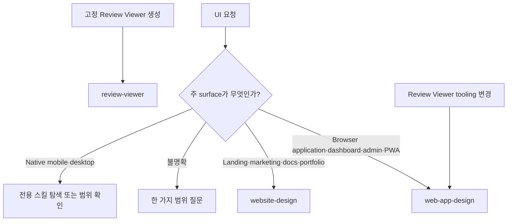

# Forge UI 디자인 스킬 분리

## Documents

- root: [Forge UI 디자인 스킬 분리](forge-ui-design-skill-separation.md)

## Overview

Forge는 UI 요청을 제품 surface에 따라 두 개의 독립 스킬로 라우팅한다. `web-app-design`은 상호작용과 상태가 중심인 browser application을, `website-design`은 공개 콘텐츠와 브랜드 전달이 중심인 website를 소유한다. 두 스킬은 같은 시각 원칙을 공유하지만 서로의 output 책임을 겸하지 않는다.

## Behavior & Flows

## Requirements

### `using-forge`는 browser application, dashboard, admin, settings, data-heavy workspace와 PWA 구현·설계 요청을 `web-app-design`으로 라우팅해야 한다.

### `using-forge`는 landing page, marketing site, product page, public documentation, editorial, portfolio와 공개 콘텐츠 website 구현·설계 요청을 `website-design`으로 라우팅해야 한다.

### 요청의 주 surface가 불명확하면 한 가지 질문으로 application과 public website 중 어느 계약이 필요한지 확인하고, native mobile·desktop 요청을 두 web 스킬에 강제 라우팅하지 않아야 한다.

### 고정 Review Viewer 생성·갱신 요청은 `review-viewer`가 소유하고, Review Viewer shell·component·profile·planner 같은 tooling 변경은 `web-app-design`을 함께 적용해야 한다.

### Forge source, manifest, installer와 skill catalog는 UI 구현 스킬로 `web-app-design`과 `website-design`만 배포하고 각 스킬의 이름·설명·trigger와 설치 결과를 Claude Code, Codex, Antigravity에서 일치시켜야 한다.

## Acceptance Criteria

### app·website·ambiguous·native 요청을 routing fixture에 입력하면 각각 `web-app-design`, `website-design`, 한 가지 범위 질문, 전용 스킬 탐색 또는 범위 확인으로 판정된다.

검증하는 요구사항:

- [`using-forge`는 browser application, dashboard, admin, settings, data-heavy workspace와 PWA 구현·설계 요청을 `web-app-design`으로 라우팅해야 한다.](forge-ui-design-skill-separation.md#using-forge는-browser-application-dashboard-admin-settings-data-heavy-workspace와-pwa-구현설계-요청을-web-app-design으로-라우팅해야-한다)
- [`using-forge`는 landing page, marketing site, product page, public documentation, editorial, portfolio와 공개 콘텐츠 website 구현·설계 요청을 `website-design`으로 라우팅해야 한다.](forge-ui-design-skill-separation.md#using-forge는-landing-page-marketing-site-product-page-public-documentation-editorial-portfolio와-공개-콘텐츠-website-구현설계-요청을-website-design으로-라우팅해야-한다)
- [요청의 주 surface가 불명확하면 한 가지 질문으로 application과 public website 중 어느 계약이 필요한지 확인하고, native mobile·desktop 요청을 두 web 스킬에 강제 라우팅하지 않아야 한다.](forge-ui-design-skill-separation.md#요청의-주-surface가-불명확하면-한-가지-질문으로-application과-public-website-중-어느-계약이-필요한지-확인하고-native-mobiledesktop-요청을-두-web-스킬에-강제-라우팅하지-않아야-한다)

### 고정 Review Viewer와 Viewer tooling 요청을 분류하면 전자는 `review-viewer`, 후자는 `review-viewer`와 `web-app-design`의 tooling 검증 경로를 사용한다.

검증하는 요구사항:

- [고정 Review Viewer 생성·갱신 요청은 `review-viewer`가 소유하고, Review Viewer shell·component·profile·planner 같은 tooling 변경은 `web-app-design`을 함께 적용해야 한다.](forge-ui-design-skill-separation.md#고정-review-viewer-생성갱신-요청은-review-viewer가-소유하고-review-viewer-shellcomponentprofileplanner-같은-tooling-변경은-web-app-design을-함께-적용해야-한다)

### 세 agent용 Forge 설치 결과와 manifest를 검사하면 `web-app-design`과 `website-design`이 같은 계약으로 발견되고 추가 UI compatibility router는 배포되지 않는다.

검증하는 요구사항:

- [Forge source, manifest, installer와 skill catalog는 UI 구현 스킬로 `web-app-design`과 `website-design`만 배포하고 각 스킬의 이름·설명·trigger와 설치 결과를 Claude Code, Codex, Antigravity에서 일치시켜야 한다.](forge-ui-design-skill-separation.md#forge-source-manifest-installer와-skill-catalog는-ui-구현-스킬로-web-app-design과-website-design만-배포하고-각-스킬의-이름설명trigger와-설치-결과를-claude-code-codex-antigravity에서-일치시켜야-한다)

## Decisions & History

- 2026-08-09 [CURRENT] Forge의 UI 디자인 surface는 `web-app-design`과 `website-design` 두 계약으로 운영한다.
