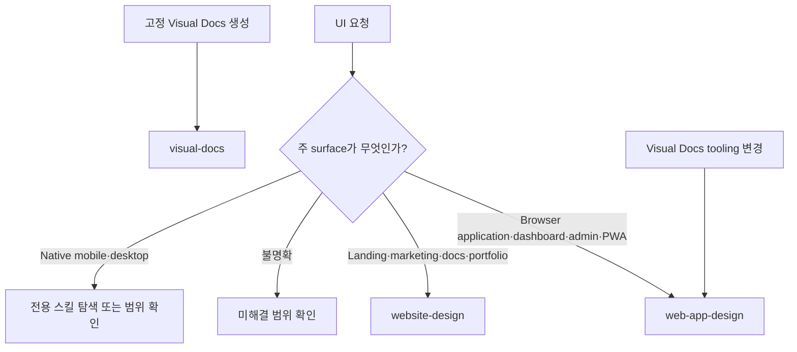

# Forge UI 디자인 스킬 분리

## Documents

- root: [Forge UI 디자인 스킬 분리](forge-ui-design-skill-separation.md)

## Overview

Forge는 UI 요청을 제품 surface에 따라 두 개의 독립 스킬로 라우팅한다. `web-app-design`은 상호작용과 상태가 중심인 browser application을, `website-design`은 공개 콘텐츠와 브랜드 전달이 중심인 website를 소유한다. 두 스킬은 같은 시각 원칙을 공유하지만 서로의 output 책임을 겸하지 않는다.

## Behavior & Flows

## Requirements

### `using-forge`는 browser application, dashboard, admin, settings, data-heavy workspace와 PWA 구현·설계 요청을 `web-app-design`으로 라우팅해야 한다.

### `using-forge`는 landing page, marketing site, product page, public documentation, editorial, portfolio와 공개 콘텐츠 website 구현·설계 요청을 `website-design`으로 라우팅해야 한다.

### 요청의 surface는 기존 제품에서 확인하고 결과를 바꾸는 미해결 선택만 질문하며 native mobile·desktop을 web 스킬에 강제 라우팅하지 않아야 한다.

### Visual Docs 생성·갱신·freshness 요청은 `visual-docs`가 소유하고, shell·component·profile·planner·Project Handbook interaction 변경은 `web-app-design`을 함께 적용해야 한다.

### Forge source, manifest, installer와 skill catalog는 UI 구현 스킬로 `web-app-design`과 `website-design`만 배포하고 각 스킬의 이름·설명·trigger와 설치 결과를 Claude Code, Codex, Antigravity에서 일치시켜야 한다.

### 두 디자인 스킬은 영향 범위의 같은 역할을 비교하여 일관된 타이포그래피를 적용하고 의도된 차이는 제품 맥락으로 설명해야 한다.

페이지 제목, 섹션 제목, 그룹 제목, 항목명, 본문과 보조 정보를 구분하고 관련 탭·페이지·컴포넌트의 대표 요소에서 크기, 굵기, 행간, 색상과 여백을 비교한다. 기존 공통 토큰과 누적된 개별 예외를 구분한다. 같은 역할과 같은 맥락의 표현은 공통 기준을 사용하되 hero, 편집 구성과 반응형 맥락의 의도된 차이를 없애지 않는다.

### 두 디자인 스킬은 가독성을 유지하면서 부모와 자식의 계층을 구분하고 특정 제품의 폰트 수치나 제목 확대를 범용 해결책으로 강제하지 않아야 한다.

크기가 같아도 굵기, 여백과 그룹 구성이 계층을 분명히 나타내면 허용한다. 긴 본문의 읽기 크기는 유지하고 보조 설명의 역할은 전체 시각적 강조로 판단한다. 기존 스타일 계승은 확인된 불일치의 보존을 뜻하지 않는다. 요청 범위의 표현 교정은 허용하고 영구 계약 변경은 별도 승인된 범위를 따른다.

### 디자인 품질 완료 주장은 담당 스킬이 영향 범위의 역할 일관성과 계층 구분을 실제 렌더링에서 확인한 증거를 포함해야 한다.

웹앱과 웹사이트는 대표 요소와 관련 상태·viewport의 실제 렌더링을 확인한다. Computed style 기록은 불일치 진단이나 회귀 확인에 필요할 때 사용한다. 단순 수정은 영향받는 요소와 필요한 비교 대상만 확인한다. 요청된 Visual Docs는 제목·본문·출처 역할을 읽기 경로에서 확인한다. 완료 검증은 담당 스킬의 증거를 사용하고 폰트 수치를 중복 정의하지 않는다.

## Acceptance Criteria

### app·website·ambiguous·native 요청을 분류하면 실제 제품에 맞는 스킬을 적용하고 확인 가능한 사실은 조사하며 중요한 미해결 선택만 질문한다.

검증하는 요구사항:

- [`using-forge`는 browser application, dashboard, admin, settings, data-heavy workspace와 PWA 구현·설계 요청을 `web-app-design`으로 라우팅해야 한다.](forge-ui-design-skill-separation.md#using-forge는-browser-application-dashboard-admin-settings-data-heavy-workspace와-pwa-구현설계-요청을-web-app-design으로-라우팅해야-한다)
- [`using-forge`는 landing page, marketing site, product page, public documentation, editorial, portfolio와 공개 콘텐츠 website 구현·설계 요청을 `website-design`으로 라우팅해야 한다.](forge-ui-design-skill-separation.md#using-forge는-landing-page-marketing-site-product-page-public-documentation-editorial-portfolio와-공개-콘텐츠-website-구현설계-요청을-website-design으로-라우팅해야-한다)
- [요청의 surface는 기존 제품에서 확인하고 결과를 바꾸는 미해결 선택만 질문하며 native mobile·desktop을 web 스킬에 강제 라우팅하지 않아야 한다.](forge-ui-design-skill-separation.md#요청의-surface는-기존-제품에서-확인하고-결과를-바꾸는-미해결-선택만-질문하며-native-mobiledesktop을-web-스킬에-강제-라우팅하지-않아야-한다)

### Visual Docs 생성과 tooling 변경 요청을 분류하면 전자는 `visual-docs`, 후자는 `visual-docs`와 `web-app-design`의 tooling 검증 경로를 사용한다.

검증하는 요구사항:

- [Visual Docs 생성·갱신·freshness 요청은 `visual-docs`가 소유하고, shell·component·profile·planner·Project Handbook interaction 변경은 `web-app-design`을 함께 적용해야 한다.](forge-ui-design-skill-separation.md#visual-docs-생성갱신freshness-요청은-visual-docs가-소유하고-shellcomponentprofileplannerproject-handbook-interaction-변경은-web-app-design을-함께-적용해야-한다)

### 세 agent용 Forge 설치 결과와 manifest를 검사하면 `web-app-design`과 `website-design`이 같은 계약으로 발견되고 추가 UI compatibility router는 배포되지 않는다.

검증하는 요구사항:

- [Forge source, manifest, installer와 skill catalog는 UI 구현 스킬로 `web-app-design`과 `website-design`만 배포하고 각 스킬의 이름·설명·trigger와 설치 결과를 Claude Code, Codex, Antigravity에서 일치시켜야 한다.](forge-ui-design-skill-separation.md#forge-source-manifest-installer와-skill-catalog는-ui-구현-스킬로-web-app-design과-website-design만-배포하고-각-스킬의-이름설명trigger와-설치-결과를-claude-code-codex-antigravity에서-일치시켜야-한다)

### 동급 제목이 다른 웹앱과 공개 웹사이트를 검토하면 관련 대표 요소를 비교하여 우발적 불일치와 의도된 역할 차이를 구분한다.

검증하는 요구사항:

- [두 디자인 스킬은 영향 범위의 같은 역할을 비교하여 일관된 타이포그래피를 적용하고 의도된 차이는 제품 맥락으로 설명해야 한다.](forge-ui-design-skill-separation.md#두-디자인-스킬은-영향-범위의-같은-역할을-비교하여-일관된-타이포그래피를-적용하고-의도된-차이는-제품-맥락으로-설명해야-한다)

### 같은 크기로 계층이 구분되는 표와 작은 항목명 아래의 긴 설명을 검토하면 불필요한 제목 확대나 본문 축소 없이 가독성과 역할 구분을 유지한다.

검증하는 요구사항:

- [두 디자인 스킬은 가독성을 유지하면서 부모와 자식의 계층을 구분하고 특정 제품의 폰트 수치나 제목 확대를 범용 해결책으로 강제하지 않아야 한다.](forge-ui-design-skill-separation.md#두-디자인-스킬은-가독성을-유지하면서-부모와-자식의-계층을-구분하고-특정-제품의-폰트-수치나-제목-확대를-범용-해결책으로-강제하지-않아야-한다)

### 일부 화면만 관찰한 완료 주장과 요청된 시각 문서를 검토하면 담당 스킬의 역할 비교 증거를 확인하고 미관찰 범위를 완료로 보고하지 않는다.

검증하는 요구사항:

- [디자인 품질 완료 주장은 담당 스킬이 영향 범위의 역할 일관성과 계층 구분을 실제 렌더링에서 확인한 증거를 포함해야 한다.](forge-ui-design-skill-separation.md#디자인-품질-완료-주장은-담당-스킬이-영향-범위의-역할-일관성과-계층-구분을-실제-렌더링에서-확인한-증거를-포함해야-한다)

## Decisions & History

- 2026-09-08 [CURRENT] surface별 스킬 책임과 Visual Docs 요청 경계를 유지한다. 웹앱·공개 웹사이트는 제품 맥락의 역할별 일관성, 가독성과 실제 스타일 비교를 공통 기준으로 사용한다. 시각 문서는 제목·본문·출처 역할을 확인하고 완료 검증은 담당 스킬의 증거를 사용한다. 특정 제품의 폰트 수치를 범용 기본값으로 고정하지 않는다.
