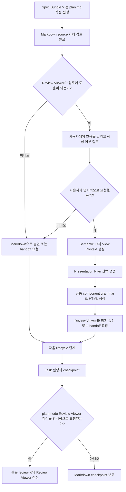
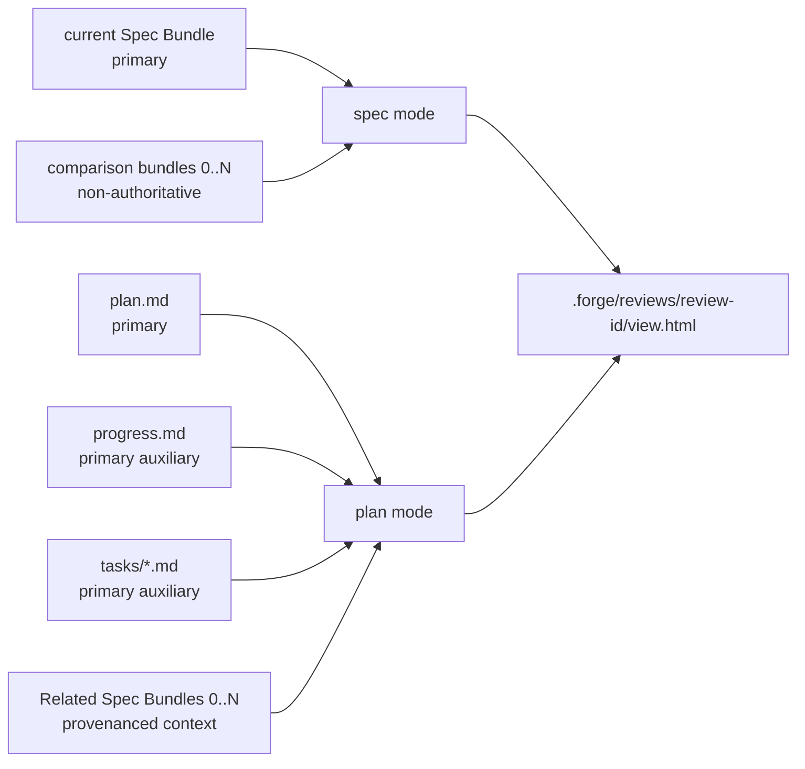
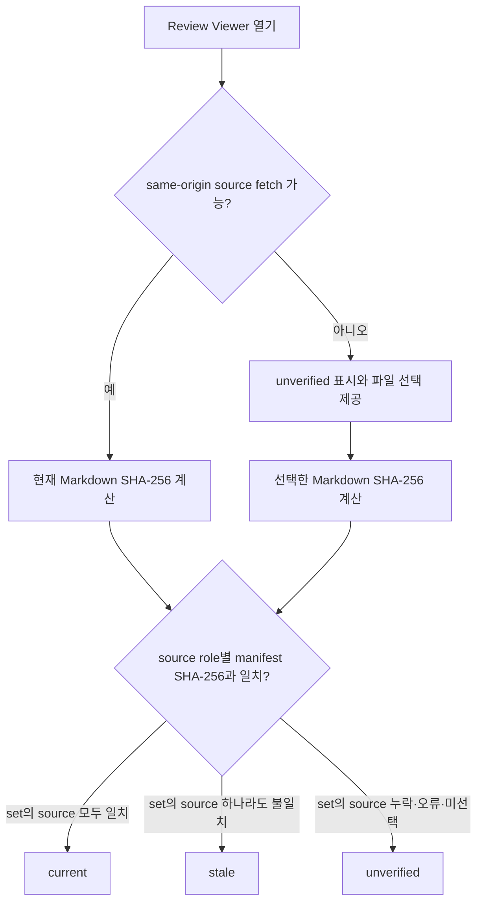

# 사람 중심 Review Viewer

## Documents

- root: [사람 중심 Review Viewer](human-readable-review-viewer.md)
- contract: [Source 선택과 Freshness](source-selection-and-freshness.md)
- contract: [적응형 표현과 탐색](adaptive-presentation-and-navigation.md)
- contract: [Plan Context와 문장 추적성](plan-context-and-statement-traceability.md)
- history: [현재 결정](decisions-and-change-history.md)

## Overview

Forge의 Spec Bundle과 plan이 커질수록 원본 Markdown만으로 전체 흐름, 책임 경계, Task 의존성, Requirement·Acceptance coverage를 검토하기 어렵다. Review Viewer는 영구 관리되는 bundle과 작업 단위로 생성·삭제되는 plan의 source ownership을 보존하면서, 사용자가 명시적으로 요청한 시점에 사람이 내용을 단계적으로 이해할 수 있는 읽기 전용 HTML snapshot을 `spec` 또는 `plan` mode로 제공한다.

Review Viewer의 목적은 텍스트를 그림으로 치환하는 것이 아니다. Selected Markdown을 Semantic IR로 보존하고 문서 종류, subtype, 사용자의 검토 목적과 독자에 맞는 Presentation Plan을 선택해 사람이 현재 질문의 답을 빠르게 찾도록 하는 것이다. 일관성은 모든 문서에 동일한 panel 구조를 적용하는 대신 공통 visual system, component grammar, provenance와 interaction contract에서 제공한다.

비목표:
- Review Viewer를 spec이나 plan을 대신하는 편집 가능한 source of truth로 만들지 않는다.
- Review Viewer 안에서 source에 없는 런타임 의미, 요구사항, 의존성 또는 설계 결정을 새로 만들지 않는다.
- Notion, Google Docs, 별도 문서 사이트를 필수 운영 요소로 추가하지 않는다.
- Review Viewer 검토 결과만으로 제품 구현 완료나 governing spec의 lifecycle status `implemented`를 선언하지 않는다.
- 생성된 개별 Review Viewer를 구현 산출물처럼 별도 렌더링·레이아웃 검증하지 않는다.
- 사용자의 명시적 요청 없이 spec·plan·checkpoint의 Review Viewer를 생성하거나 갱신하지 않는다.
- spec과 plan이 항상 1:1로 대응한다고 가정하거나 두 문서의 내용을 하나의 combined Viewer에 병합하지 않는다.
- spec·plan의 일반적인 작성·변경·승인·handoff에서 HTML을 자동 생성하지 않는다. Markdown-only lifecycle 경계는 `docs/specs/semantic-spec-bundles/`가 소유한다.

## Behavior & Flows

Review Viewer를 사용자 요청에 따라 제공하는 흐름:



mode별 source ownership:



Review Viewer 열람 시 freshness 판정 흐름:



## Data & Interfaces

mode별 source 계약:

| Mode | Primary source set | Comparison·context source | 허용되는 시각 정보 | 출력 |
|---|---|---|---|---|
| `spec` | current `docs/specs/<semantic-bundle-name>/` 전체 | 사용자가 선택한 comparison bundle 0..N | current·comparison Mermaid 원문, bundle·member별 statement와 차이 | `.forge/reviews/<review-id>/view.html` |
| `plan` | `docs/plans/PPP-<slug>/plan.md`, 선택적인 `progress.md`, `tasks/*.md` | plan이 선언한 Related Specs bundle 0..N | plan·context Mermaid 원문, 명시된 Route·dependency·statement coverage에서 계산한 derived view, 진행 상태 | `.forge/reviews/<review-id>/view.html` |

plan `Related Specs` canonical entry:

```markdown
**Related Specs:**
- bundle: docs/specs/semantic-spec-bundles/
```

각 entry는 normalized unique bundle directory path만 가진다. 관련 spec이 없는 plan은 `**Related Specs:** None — <ceremony-floor 또는 non-product 이유>`를 사용한다. Governed Task는 `Governing statements:`에서 exact Requirement·Acceptance heading을 member link로 직접 참조한다. Parser는 path escape, 중복·invalid·non-approved bundle, dangling statement와 link text mismatch를 거부한다.

Profile과 intent별 primary composition 예시:

| Profile | Intent | Primary component | Supporting component |
|---|---|---|---|
| `spec.workflow` | `approval` | actor flow·state map | exception matrix, Requirement·Acceptance Criterion coverage |
| `spec.api` | `implementation` | endpoint·schema contract | sequence, error matrix, examples |
| `spec.architecture` | `review` | context·component relation | runtime boundary, decision, risk |
| `spec.policy` | `approval` | rule·exception matrix | scope, enforcement, Acceptance Criterion coverage |
| `spec.migration` | `implementation` | before·after와 migration route | rollback, verification, dependency |
| `plan.execution` | `execution` | Route·Task dependency | runtime responsibility, checkpoint |
| `plan.status` | `status` | progress·blocker·next action | changed Task, evidence |
| `comparison` | `comparison` | source-qualified delta matrix | relation, coverage, provenance |

모든 profile은 stable shell과 공통 component grammar를 재사용한다. 표에 없는 subtype은 `generic`으로 fallback하고 모든 source block을 source detail에 보존한다.

Presentation Plan contract:

```yaml
profile: spec.workflow
intent: approval
primaryQuestion: "상태 전이와 예외가 승인 가능한가?"
components:
  - type: state-map
    refs: [current:flow-main]
  - type: exception-matrix
    refs: [current:exceptions]
  - type: acceptance-coverage
    refs: [current:requirements, current:acceptance]
  - type: source-detail
    refs: [current:*]
```

`refs`는 Semantic IR에 존재하는 source-qualified block 또는 entity만 가리킨다. Presentation Plan은 source 밖 prose나 executable markup을 포함하지 않는다.

Review Viewer 추천을 위한 복잡도 점수:

| Signal | 점수 |
|---|---:|
| Requirement 8개 초과 | 1 |
| Acceptance Criterion 8개 초과 | 1 |
| Mermaid 2개 이상 | 1 |
| 데이터·Interface 표 2개 이상 | 1 |
| 여러 subsystem·actor·Place·상태 전이 | 1 |
| bundle 전체 200줄 초과 | 1 |
| clarification 또는 change history 다수 | 1 |

이 점수는 사용자에게 Review Viewer의 잠재적 효용을 알릴지 판단하는 신호일 뿐, HTML을 자동 생성하거나 갱신하는 권한이 아니다.

build interface 목표:

```text
build-review-viewer.sh \
  --mode spec|plan \
  --locale en|ko \
  --review-id <review-id> \
  [--intent review|approval|implementation|comparison|execution|status] \
  [--audience mixed|product|engineering|operations] \
  [--spec docs/specs/<semantic-bundle-name>/] \
  [--comparison <path>]... \
  [--plan docs/plans/PPP-<slug>/plan.md] \
  [--progress docs/plans/PPP-<slug>/progress.md] \
  [--tasks-dir docs/plans/PPP-<slug>/tasks] \
  [--offline]

build-review-viewer.sh --check .forge/reviews/<review-id>/view.html
```

source manifest:

| Field | 의미 |
|---|---|
| `mode` | `spec` 또는 `plan` |
| `locale` | tab과 shell copy locale |
| `sources[]` | role, bundle·root·member path, internal namespace, member·bundle SHA-256, 선택된 full-statement 참조 |
| `generated_at` | 재생성 시각 |
| `counts` | bundle·member별 Requirement·Acceptance Criterion·Mermaid와 plan primary set의 Task·Step·Mermaid 수 |
| `freshness` | primary와 comparison·context set별 `current`, `stale`, `unverified`; 초기값은 `unverified` |
| `view_context` | mode, kind·subtype, intent, audience, locale, source role, export mode |
| `presentation_plan` | profile, primary question, ordered component와 source-qualified reference |
| `rebuild_command` | 동일 review-id의 Review Viewer를 명시적으로 재생성하는 command |

문서 저장 구조:

```text
docs/
├── specs/
│   └── <semantic-bundle-name>/
│       ├── <descriptive-root-name>.md
│       └── <descriptive-member-name>.md
├── plans/
│   └── PPP-<slug>/
│       ├── plan.md
│       ├── progress.md      # 선택
│       └── tasks/           # 선택
│           └── TTT-<slug>.md
├── research/                # 공유·장기 보존할 조사 기록
└── debug/                   # 공유·장기 보존할 root-cause 기록

.forge/
├── reviews/
│   └── <review-id>/
│       └── view.html
├── scratch/
└── viewer-build/
```

Review Viewer shell의 inherited visual system:

| 항목 | 선언 | 이유 |
|---|---|---|
| Class | Utilitarian, inherited | 장식보다 빠른 문서 탐색이 우선이다. |
| Type | 현재 16px base와 1.25 scale inherited | 긴 문서와 표를 읽는 기준을 유지한다. |
| Palette | 현재 neutral·green accent inherited | 상태와 deep link를 절제된 한 색으로 강조한다. |
| Spacing | 현재 shell spacing inherited | fragment가 임의 밀도를 만들지 않게 한다. |
| Depth | border 전략 inherited | 표, code, panel 경계를 그림자 없이 구분한다. |
| Signature | Route Map, Runtime Atlas, AC Coverage | Viewer 고유성은 장식이 아니라 source 관계를 읽는 구조에서 나온다. |

변경 대상:

| 대상 | 주요 변경 |
|---|---|
| `review-viewer` | 요청형 Review Viewer, 두 mode, source role·provenance, deterministic parser, 로컬 output, freshness, panel mapping |
| `viewer-template.html` | 3단계 freshness UI, source fetch·파일 선택 검증, locale, mobile diagram·table wrapper, 접근성, favicon, 오류 표시 |
| `build-review-viewer.sh` | `--mode spec|plan`, review ID·output naming, comparison·context sources, `--check`, offline 유지 |
| `writing-specs` | Markdown 기본 source 검토, Review Viewer 효용 안내, 완료 후 생성 여부 질문 |
| `writing-plans` | 독립 plan path, 선택적 Related Specs, plan 디렉터리, 진행·Task 분리 기준 |
| `executing-plans` | plan 디렉터리의 상태·진행 기록과 요청이 있을 때만 plan mode Review Viewer 갱신 |
| `web-app-design` | 개별 View 생성 제외와 Viewer tooling 변경 시 browser app UI 검증 |
| `writing-tone` | 질문형 제목, 읽는 법, 요약 우선, locale copy |
| `verifying-work` | 개별 View 생성 제외, Viewer tooling 검증, `implemented` 금지 |
| `using-forge`, portability rules, README | `docs/specs`, `docs/plans`, `.forge/reviews` Git 비추적 계약 동기화 |
| `systematic-debugging` | 로컬 debug note와 공유·장기 보존 root-cause 문서의 승격 경로 구분 |

## Requirements

### Forge는 `docs/specs/<semantic-bundle-name>/`의 root와 선언된 모든 Markdown member를 하나의 Canonical Spec source of truth로 유지해야 한다.

### Review Viewer는 읽기 전용 파생 snapshot이어야 하며, Review Viewer에서 spec·plan·progress·comparison·context source를 직접 수정하지 않아야 한다.

### Review Viewer가 생성된 이후 source가 변경되더라도 Forge는 사용자가 명시적으로 갱신을 요청한 경우에만 같은 review를 다시 생성해야 한다.

### 생성된 Review Viewer는 mode와 관계없이 `.forge/reviews/<review-id>/view.html`에 저장하고 Git 비추적 상태로 유지해야 한다.

### `writing-specs`는 new·change·clarify·sync 과정에서 사용자의 명시적 요청이 없는 한 spec mode Review Viewer를 생성하거나 갱신하지 않아야 한다.

### `writing-plans`는 plan 저장 또는 실행 handoff 과정에서 사용자의 명시적 요청이 없는 한 plan mode Review Viewer를 생성하거나 갱신하지 않아야 한다.

### `executing-plans`는 Review Viewer가 이미 존재하더라도 사용자의 명시적 요청이 없는 한 Task checkpoint 후 plan mode Review Viewer를 갱신하지 않아야 한다.

### Forge는 복잡도와 관계없이 Markdown을 source 검토의 기본 경로로 사용하고, Review Viewer는 요청형 보조 검토 화면으로만 사용해야 한다.

### 사용자가 현재 spec이나 plan의 시각화 또는 Review Viewer 생성·갱신을 명시적으로 요청한 경우에만 Forge는 복잡도 점수와 관계없이 해당 Review Viewer를 생성하거나 갱신해야 한다.

### `review-viewer` skill은 사용자에게 Review Viewer로 소개하고, 서로 독립적인 `spec`과 `plan` 두 mode만 지원해야 한다.

### `spec`과 `plan` mode 출력은 모두 `.forge/reviews/<review-id>/view.html`을 사용하고, 동일한 `review-id`의 갱신은 사용자의 명시적 요청이 있을 때만 허용해야 한다.

### 고정 Review Viewer tooling으로 개별 spec 또는 plan `view.html`을 생성하는 작업은 `verifying-work`를 적용하지 않고, build command 성공을 생성 완료의 충분한 근거로 사용해야 한다.

### 생성된 개별 Review Viewer에는 별도 `--check`, source count·hash·Mermaid 일치 확인, unresolved placeholder·shell markup 검사 같은 post-build 검증을 수행하지 않아야 한다.

### 생성된 개별 Review Viewer에는 desktop·390px mobile render, screenshot, layout, print, tab, deep link, checkbox persistence, Mermaid, offline, freshness 상태의 브라우저 검증을 수행하지 않아야 한다.

### Review Viewer 생성 결과만으로 governing product spec의 lifecycle status를 `implemented`로 변경하지 않아야 하며, Review Viewer parser·builder·template·style·script·runtime 동작 변경은 일반 구현 검증과 관련 Acceptance Criterion 검증을 따라야 한다.

### `writing-specs`와 `writing-plans`는 각각 Markdown source 작성과 자체 검토가 끝난 뒤 승인 또는 다음 lifecycle handoff를 요청할 때, Review Viewer가 검토에 도움이 되는 경우 사용자에게 생성 여부를 물어야 한다.

### 저장된 Review Viewer의 source가 변경되면 Forge는 그 Review Viewer가 stale임을 사용자에게 알릴 수 있지만, 명시적 요청 전에는 stale Review Viewer를 갱신하거나 현재 검토 화면으로 제시하지 않아야 한다.

### `.forge/`는 Review Viewer, build staging, 로컬 조사 기록처럼 공유하거나 영구 보존하지 않는 artifact에만 사용하고, `.forge/reviews/`를 포함한 로컬 artifact를 Git 비추적 상태로 유지해야 한다.

### 조사·debug 기록은 로컬 작업 중 `.forge/`에 둘 수 있지만 팀이 공유하거나 장기 보존할 기록은 `docs/research/`, `docs/debug/` 또는 해당 프로젝트의 영구 문서 경로로 승격해야 한다.

### Forge의 일반적인 spec·plan lifecycle은 Markdown만 생성해야 하며 source-adjacent Spec Pages, plan pages 또는 HTML catalog를 상시 생성하지 않아야 한다. 이 spec의 HTML output은 사용자가 `review-viewer`를 명시적으로 요청한 `.forge/reviews/<review-id>/view.html`에 한정해야 한다.

### Presentation Plan 선택·제안·fallback과 profile complexity는 explicit request gate를 우회하지 않아야 하며, 사용자가 Viewer 생성을 명시하기 전에는 Semantic IR, Presentation Plan 또는 HTML artifact를 생성하지 않아야 한다.

## Acceptance Criteria

### 저장된 spec mode Review Viewer가 있는 상태에서 spec을 변경해도 Forge는 Review Viewer를 자동 갱신하지 않고 stale 사실만 알리며, 사용자가 갱신을 명시적으로 요청한 뒤에만 같은 review-id의 `.forge/reviews/<review-id>/view.html`을 새 source hash와 내용으로 갱신하고 Git 비추적 상태를 유지한다.

검증하는 요구사항:

- [Forge는 `docs/specs/<semantic-bundle-name>/`의 root와 선언된 모든 Markdown member를 하나의 Canonical Spec source of truth로 유지해야 한다.](human-readable-review-viewer.md#forge는-docsspecssemantic-bundle-name의-root와-선언된-모든-markdown-member를-하나의-canonical-spec-source-of-truth로-유지해야-한다)
- [Forge는 `docs/plans/PPP-<slug>/plan.md`를 작업 단위의 목표, Route, Task, 파일, Interface, 검증 절차의 source of truth로 유지해야 하며 plan 번호는 spec 번호와 독립적으로 부여해야 한다.](plan-context-and-statement-traceability.md#forge는-docsplansppp-slugplanmd를-작업-단위의-목표-route-task-파일-interface-검증-절차의-source-of-truth로-유지해야-하며-plan-번호는-spec-번호와-독립적으로-부여해야-한다)
- [Review Viewer는 읽기 전용 파생 snapshot이어야 하며, Review Viewer에서 spec·plan·progress·comparison·context source를 직접 수정하지 않아야 한다.](human-readable-review-viewer.md#review-viewer는-읽기-전용-파생-snapshot이어야-하며-review-viewer에서-specplanprogresscomparisoncontext-source를-직접-수정하지-않아야-한다)
- [Review Viewer가 생성된 이후 source가 변경되더라도 Forge는 사용자가 명시적으로 갱신을 요청한 경우에만 같은 review를 다시 생성해야 한다.](human-readable-review-viewer.md#review-viewer가-생성된-이후-source가-변경되더라도-forge는-사용자가-명시적으로-갱신을-요청한-경우에만-같은-review를-다시-생성해야-한다)
- [Review Viewer는 source별 role, bundle·root·member path, 생성 당시 member·bundle SHA-256, 생성 시각, mode, locale, 집계 수치를 manifest에 기록하고 열람 시점 hash와 비교해 `current`, `stale`, `unverified` freshness를 표시해야 한다. 화면의 주 label은 bundle H1, member H1, path와 full statement이고 hash나 내부 key를 identity label로 사용하지 않아야 한다.](source-selection-and-freshness.md#review-viewer는-source별-role-bundlerootmember-path-생성-당시-memberbundle-sha-256-생성-시각-mode-locale-집계-수치를-manifest에-기록하고-열람-시점-hash와-비교해-current-stale-unverified-freshness를-표시해야-한다-화면의-주-label은-bundle-h1-member-h1-path와-full-statement이고-hash나-내부-key를-identity-label로-사용하지-않아야-한다)
- [생성된 Review Viewer는 mode와 관계없이 `.forge/reviews/<review-id>/view.html`에 저장하고 Git 비추적 상태로 유지해야 한다.](human-readable-review-viewer.md#생성된-review-viewer는-mode와-관계없이-forgereviewsreview-idviewhtml에-저장하고-git-비추적-상태로-유지해야-한다)
- [`writing-specs`는 new·change·clarify·sync 과정에서 사용자의 명시적 요청이 없는 한 spec mode Review Viewer를 생성하거나 갱신하지 않아야 한다.](human-readable-review-viewer.md#writing-specs는-newchangeclarifysync-과정에서-사용자의-명시적-요청이-없는-한-spec-mode-review-viewer를-생성하거나-갱신하지-않아야-한다)
- [`writing-plans`는 plan 저장 또는 실행 handoff 과정에서 사용자의 명시적 요청이 없는 한 plan mode Review Viewer를 생성하거나 갱신하지 않아야 한다.](human-readable-review-viewer.md#writing-plans는-plan-저장-또는-실행-handoff-과정에서-사용자의-명시적-요청이-없는-한-plan-mode-review-viewer를-생성하거나-갱신하지-않아야-한다)
- [`executing-plans`는 Review Viewer가 이미 존재하더라도 사용자의 명시적 요청이 없는 한 Task checkpoint 후 plan mode Review Viewer를 갱신하지 않아야 한다.](human-readable-review-viewer.md#executing-plans는-review-viewer가-이미-존재하더라도-사용자의-명시적-요청이-없는-한-task-checkpoint-후-plan-mode-review-viewer를-갱신하지-않아야-한다)
- [저장된 Review Viewer의 source가 변경되면 Forge는 그 Review Viewer가 stale임을 사용자에게 알릴 수 있지만, 명시적 요청 전에는 stale Review Viewer를 갱신하거나 현재 검토 화면으로 제시하지 않아야 한다.](human-readable-review-viewer.md#저장된-review-viewer의-source가-변경되면-forge는-그-review-viewer가-stale임을-사용자에게-알릴-수-있지만-명시적-요청-전에는-stale-review-viewer를-갱신하거나-현재-검토-화면으로-제시하지-않아야-한다)

### 고정 Review Viewer tooling으로 개별 View를 build하면 성공한 build에서 작업을 종료하고 별도 checker나 브라우저 검증을 실행하지 않으며 governing spec의 lifecycle status를 변경하지 않는다. Review Viewer tooling 자체를 변경하면 이 예외 없이 일반 구현 검증을 수행한다.

검증하는 요구사항:

- [고정 Review Viewer tooling으로 개별 spec 또는 plan `view.html`을 생성하는 작업은 `verifying-work`를 적용하지 않고, build command 성공을 생성 완료의 충분한 근거로 사용해야 한다.](human-readable-review-viewer.md#고정-review-viewer-tooling으로-개별-spec-또는-plan-viewhtml을-생성하는-작업은-verifying-work를-적용하지-않고-build-command-성공을-생성-완료의-충분한-근거로-사용해야-한다)
- [생성된 개별 Review Viewer에는 별도 `--check`, source count·hash·Mermaid 일치 확인, unresolved placeholder·shell markup 검사 같은 post-build 검증을 수행하지 않아야 한다.](human-readable-review-viewer.md#생성된-개별-review-viewer에는-별도-check-source-counthashmermaid-일치-확인-unresolved-placeholdershell-markup-검사-같은-post-build-검증을-수행하지-않아야-한다)
- [생성된 개별 Review Viewer에는 desktop·390px mobile render, screenshot, layout, print, tab, deep link, checkbox persistence, Mermaid, offline, freshness 상태의 브라우저 검증을 수행하지 않아야 한다.](human-readable-review-viewer.md#생성된-개별-review-viewer에는-desktop390px-mobile-render-screenshot-layout-print-tab-deep-link-checkbox-persistence-mermaid-offline-freshness-상태의-브라우저-검증을-수행하지-않아야-한다)
- [Review Viewer 생성 결과만으로 governing product spec의 lifecycle status를 `implemented`로 변경하지 않아야 하며, Review Viewer parser·builder·template·style·script·runtime 동작 변경은 일반 구현 검증과 관련 Acceptance Criterion 검증을 따라야 한다.](human-readable-review-viewer.md#review-viewer-생성-결과만으로-governing-product-spec의-lifecycle-status를-implemented로-변경하지-않아야-하며-review-viewer-parserbuildertemplatestylescriptruntime-동작-변경은-일반-구현-검증과-관련-acceptance-criterion-검증을-따라야-한다)

### spec 또는 plan의 Markdown source 작성과 자체 검토가 끝나면 Review Viewer가 유용한 경우 승인 또는 handoff 메시지에서 생성 여부를 묻고, 사용자의 명시적 응답 전에는 Review Viewer HTML이 생성되지 않는다.

검증하는 요구사항:

- [`writing-specs`와 `writing-plans`는 각각 Markdown source 작성과 자체 검토가 끝난 뒤 승인 또는 다음 lifecycle handoff를 요청할 때, Review Viewer가 검토에 도움이 되는 경우 사용자에게 생성 여부를 물어야 한다.](human-readable-review-viewer.md#writing-specs와-writing-plans는-각각-markdown-source-작성과-자체-검토가-끝난-뒤-승인-또는-다음-lifecycle-handoff를-요청할-때-review-viewer가-검토에-도움이-되는-경우-사용자에게-생성-여부를-물어야-한다)

### 새 spec과 새 plan은 각각 독립된 docs 경로를 유지하고, 명시적 생성 요청을 받은 Review Viewer만 `.forge/reviews/<review-id>/view.html`에 생성되며 Git 추적 파일 목록에는 source 옆 `view.html`이나 Review Viewer가 나타나지 않는다.

검증하는 요구사항:

- [Forge는 `docs/specs/<semantic-bundle-name>/`의 root와 선언된 모든 Markdown member를 하나의 Canonical Spec source of truth로 유지해야 한다.](human-readable-review-viewer.md#forge는-docsspecssemantic-bundle-name의-root와-선언된-모든-markdown-member를-하나의-canonical-spec-source-of-truth로-유지해야-한다)
- [Forge는 `docs/plans/PPP-<slug>/plan.md`를 작업 단위의 목표, Route, Task, 파일, Interface, 검증 절차의 source of truth로 유지해야 하며 plan 번호는 spec 번호와 독립적으로 부여해야 한다.](plan-context-and-statement-traceability.md#forge는-docsplansppp-slugplanmd를-작업-단위의-목표-route-task-파일-interface-검증-절차의-source-of-truth로-유지해야-하며-plan-번호는-spec-번호와-독립적으로-부여해야-한다)
- [생성된 Review Viewer는 mode와 관계없이 `.forge/reviews/<review-id>/view.html`에 저장하고 Git 비추적 상태로 유지해야 한다.](human-readable-review-viewer.md#생성된-review-viewer는-mode와-관계없이-forgereviewsreview-idviewhtml에-저장하고-git-비추적-상태로-유지해야-한다)
- [`spec`과 `plan` mode 출력은 모두 `.forge/reviews/<review-id>/view.html`을 사용하고, 동일한 `review-id`의 갱신은 사용자의 명시적 요청이 있을 때만 허용해야 한다.](human-readable-review-viewer.md#spec과-plan-mode-출력은-모두-forgereviewsreview-idviewhtml을-사용하고-동일한-review-id의-갱신은-사용자의-명시적-요청이-있을-때만-허용해야-한다)
- [`.forge/`는 Review Viewer, build staging, 로컬 조사 기록처럼 공유하거나 영구 보존하지 않는 artifact에만 사용하고, `.forge/reviews/`를 포함한 로컬 artifact를 Git 비추적 상태로 유지해야 한다.](human-readable-review-viewer.md#forge는-review-viewer-build-staging-로컬-조사-기록처럼-공유하거나-영구-보존하지-않는-artifact에만-사용하고-forgereviews를-포함한-로컬-artifact를-git-비추적-상태로-유지해야-한다)
- [spec은 프로젝트 수명 동안 영구 관리하고, plan은 작업 단위로 생성하며 작업 종료 뒤 보존 가치가 없으면 plan 디렉터리 전체를 삭제할 수 있어야 한다.](plan-context-and-statement-traceability.md#spec은-프로젝트-수명-동안-영구-관리하고-plan은-작업-단위로-생성하며-작업-종료-뒤-보존-가치가-없으면-plan-디렉터리-전체를-삭제할-수-있어야-한다)

### 조사·debug 중간 기록은 `.forge/`에서 Git 비추적 상태로 유지되고, 공유 또는 장기 보존 대상으로 결정한 기록은 `docs/research/` 또는 `docs/debug/`로 이동해 Git 추적된다.

검증하는 요구사항:

- [`.forge/`는 Review Viewer, build staging, 로컬 조사 기록처럼 공유하거나 영구 보존하지 않는 artifact에만 사용하고, `.forge/reviews/`를 포함한 로컬 artifact를 Git 비추적 상태로 유지해야 한다.](human-readable-review-viewer.md#forge는-review-viewer-build-staging-로컬-조사-기록처럼-공유하거나-영구-보존하지-않는-artifact에만-사용하고-forgereviews를-포함한-로컬-artifact를-git-비추적-상태로-유지해야-한다)
- [조사·debug 기록은 로컬 작업 중 `.forge/`에 둘 수 있지만 팀이 공유하거나 장기 보존할 기록은 `docs/research/`, `docs/debug/` 또는 해당 프로젝트의 영구 문서 경로로 승격해야 한다.](human-readable-review-viewer.md#조사debug-기록은-로컬-작업-중-forge에-둘-수-있지만-팀이-공유하거나-장기-보존할-기록은-docsresearch-docsdebug-또는-해당-프로젝트의-영구-문서-경로로-승격해야-한다)

### 일반 spec·plan 작성·변경·승인·handoff fixture에서는 HTML 생성 count가 0이고, 사용자가 `review-viewer`를 명시적으로 요청한 fixture에서만 `.forge/reviews/<review-id>/view.html`이 생성된다. Source-adjacent Spec Pages, plan pages와 HTML catalog는 생성되지 않는다.

검증하는 요구사항:

- [Forge의 일반적인 spec·plan lifecycle은 Markdown만 생성해야 하며 source-adjacent Spec Pages, plan pages 또는 HTML catalog를 상시 생성하지 않아야 한다. 이 spec의 HTML output은 사용자가 `review-viewer`를 명시적으로 요청한 `.forge/reviews/<review-id>/view.html`에 한정해야 한다.](human-readable-review-viewer.md#forge의-일반적인-specplan-lifecycle은-markdown만-생성해야-하며-source-adjacent-spec-pages-plan-pages-또는-html-catalog를-상시-생성하지-않아야-한다-이-spec의-html-output은-사용자가-review-viewer를-명시적으로-요청한-forgereviewsreview-idviewhtml에-한정해야-한다)
