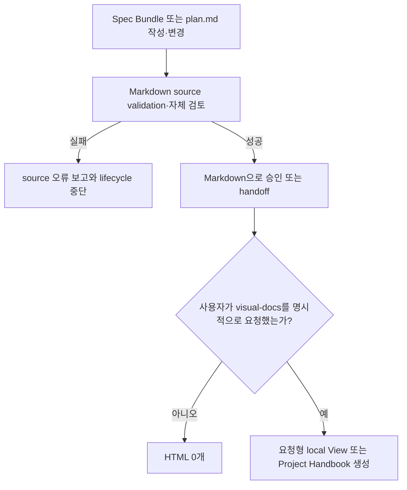
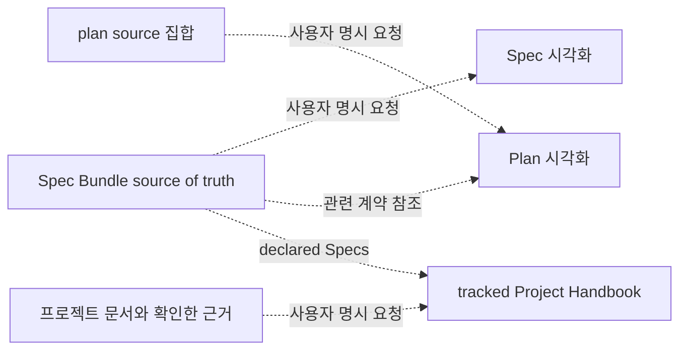
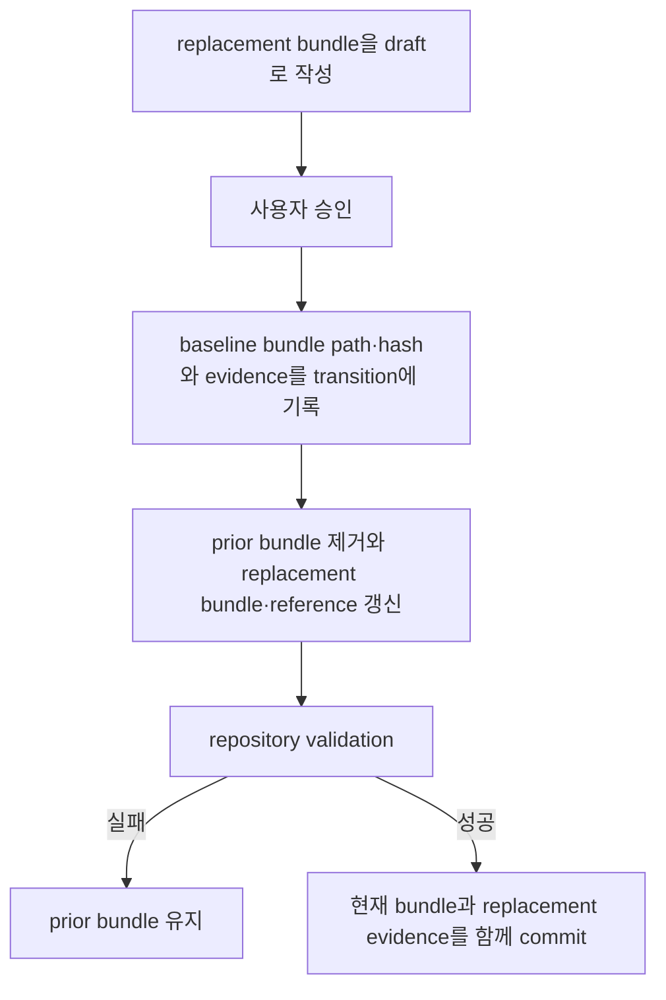

# 의미 기반 Spec Bundle 계약

## Documents

- root: [의미 기반 Spec Bundle 계약](semantic-spec-bundle-contract.md)
- contract: [문서 작성과 파일 구성](authoring-and-file-organization.md)
- contract: [문장 추적성과 검증](statement-traceability-and-validation.md)
- contract: [Lifecycle Consumer와 Bundle 교체](lifecycle-consumers-and-bundle-replacement.md)
- history: [현재 결정](decisions-and-change-history.md)

## Overview

Forge의 spec과 plan은 Markdown을 유일한 기본 산출물과 source of truth로 유지해야 한다. 하나의 Canonical Spec은 의미가 드러나는 directory 안에 관련 Markdown을 묶은 Spec Bundle이다. Bundle metadata, full-statement traceability와 lifecycle gate는 기계적으로 검증하되, 서로 다른 feature·workflow·API·architecture·policy·migration 문서를 하나의 파일이나 화면 순서에 강제하지 않는다.

HTML은 일반적인 spec 작성, plan 작성, 승인, handoff, 실행 checkpoint 또는 lifecycle status 변경에서 생성하지 않는다. 사용자가 Forge 원문의 시각화를 요청하면 `docs/specs/review-viewer-lifecycle/`의 제작 경로 계약에 따라 대화 안의 표현이나 자유 작성 문서를 사용할 수 있다. 시각 템플릿과 전용 renderer는 배포하지 않는다. 재현성이나 원문 최신성은 요청에 맞는 프로젝트별 방법으로 확인한다.

비목표:
- HTML을 spec의 편집 가능한 source of truth로 만들지 않는다.
- source에 없는 요구사항, 책임, 관계, 결정을 generated page에 추가하지 않는다.
- Markdown의 서술 순서를 Viewer layout에 맞추도록 강제하지 않는다.
- spec이나 plan 변경을 HTML 생성 요청으로 추론하지 않는다.
- source 옆 HTML을 자동으로 관리하지 않는다. 공유 문서의 경로와 Git 추적 여부는 사용자 요청과 프로젝트 관례를 따른다.
- Visual Docs 생성만으로 spec 승인 또는 구현 완료를 선언하지 않는다.

## Behavior & Flows

일반적인 spec·plan 작성과 요청형 Viewer 경계:



Markdown source와 요청형 Visual Docs의 lifecycle:



활성 bundle 교체 transaction:



## Data & Interfaces

`forge/spec@3` root metadata:

| Field | Type | 필수 | 제약 |
|---|---|---:|---|
| `schema` | string | 예 | 정확히 `forge/spec@3` |
| `role` | string | 예 | 정확히 `root` |
| `status` | enum | 예 | `draft`, `approved`, `implemented` |
| `language` | enum | 예 | BCP 47 tag `en`, `ko` |
| `kind` | enum | 예 | `feature`, `system`, `interface`, `policy` |
| `subtype` | string | 아니오 | lowercase kebab-case 의미 분류 |
| `areas` | string[] | 예 | 빈 목록 허용 |
| `components` | string[] | 예 | 빈 목록 허용 |
| `relatedSpecs` | relation[] | 예 | 빈 목록 허용, typed valid bundle path |

Title은 body의 단일 H1에서 파생하며 metadata field로 중복하지 않는다. Dependency-free frontmatter parser가 받는 canonical serialization은 다음과 같다.

```yaml
---
schema: forge/spec@3
role: root
status: draft
language: ko
kind: system
subtype: document-lifecycle
areas: ["forge"]
components: ["writing-specs", "spec-docs"]
relatedSpecs: [{"path": "docs/specs/review-viewer-lifecycle/", "relation": "relatedTo"}]
---
```

Scalar는 parser가 문자열로 취급하고 collection은 JSON array 또는 object 문법을 사용한다. 다른 YAML 기능은 허용하지 않는다.

spec validation command contract:

```text
spec-docs validate --root docs/specs
```

| Command | 입력 | 출력 | 실패 조건 |
|---|---|---|---|
| `validate` | 모든 Spec Bundle | 정렬된 진단과 exit code | schema, layout, statement, relation, link 위반 |

문서 역할과 저장 정책:

| Artifact | 역할 | Git | 갱신 trigger |
|---|---|---:|---|
| `docs/specs/<semantic-bundle-name>/` | 영구 source of truth | 예 | 요구사항·상태 변경 |
| 프로젝트가 선택한 `docs/plans/` 경로 또는 앱 기록 | 작업 단위 실행 source | 필요할 때 | 계획·진행 변경 |
| `.forge/visual-docs/<view-id>/view.html` | 자유 작성 로컬 HTML 기본 경로 | 아니오 | 사용자 명시 요청 |
| 프로젝트별 문서 경로 | 공유하는 Project Handbook | 프로젝트 관례 | 사용자 명시 요청과 요청에 맞는 검증 |

spec transition manifest:

```json
{
  "schema": "forge/spec-bundle-transitions@1",
  "transitions": [
    {
      "fromSourcePath": "docs/specs/prior-semantic-name/",
      "fromSourceSha256": "64 lowercase hex characters",
      "disposition": "superseded",
      "toBundlePath": "docs/specs/current-semantic-name/",
      "evidencePath": "docs/evidence/current-semantic-name-migration.md",
      "reason": "현재 운영 계약과 완료된 실행 기록을 분리한다."
    }
  ]
}
```

`disposition`은 one-to-one replacement의 `superseded`와 coordinated
many-to-one consolidation의 `merged`를 허용한다. `merged` group은 같은
`toBundlePath`와 `evidencePath`를 가진 둘 이상의 record로 표현한다.
Manifest schema와 record field 집합은 `forge/spec-bundle-transitions@1`에서
backward-compatible하게 유지한다.

동일한 baseline transition은 한 번만 적용한다. 이후 baseline에 `fromSourcePath`가 없으면 해당 record는 audit evidence로 남지만 새 삭제 권한을 만들지 않는다. 현재 bundle을 다시 교체할 때는 그 시점의 baseline bundle을 `fromSourcePath`로 사용하는 새 record를 별도 diff에 append한다.

## Requirements

### Canonical Spec은 `docs/specs/<semantic-bundle-name>/`에 저장되는 하나의 Spec Bundle이며, 이 디렉터리와 선언된 Markdown member 전체가 요구사항, 승인 상태, 관계와 변경 이력의 유일한 source of truth여야 한다.

### Bundle root만 YAML frontmatter에서 `schema: forge/spec@3`, `role: root`, `status`, `language`, `kind`, 선택적인 `subtype`, `areas`, `components`, `relatedSpecs`를 선언해야 하며 그 밖의 field는 허용하지 않아야 한다.

### `status`는 `draft`, `approved`, `implemented` 중 하나여야 하며 frontmatter의 값만 lifecycle gate token으로 사용하고 별도의 `Status:` body line을 중복 정본으로 유지하지 않아야 한다.

### `language`는 lifecycle tooling이 지원하는 BCP 47 tag `en`, `ko` 중 하나여야 한다. `kind`는 `feature`, `system`, `interface`, `policy` 중 하나여야 하고, `subtype`은 생략하거나 lowercase kebab-case 의미 분류를 사용해야 한다. `areas`, `components`, `relatedSpecs`는 빈 목록을 허용하되 항상 명시해야 한다. `relatedSpecs` 항목은 normalized bundle directory `path`와 관계 종류만 선언해야 한다. Frontmatter는 dependency-free parser가 읽을 수 있도록 top-level `key: value`와 JSON-compatible 한 줄 collection만 허용해야 한다.

### `relatedSpecs`의 각 항목은 repository 안의 유효한 normalized bundle directory path와 관계 종류 `dependsOn`, `refines`, `supersedes`, `relatedTo` 중 하나를 선언해야 하며 self-reference와 해석할 수 없는 path를 허용하지 않아야 한다.
