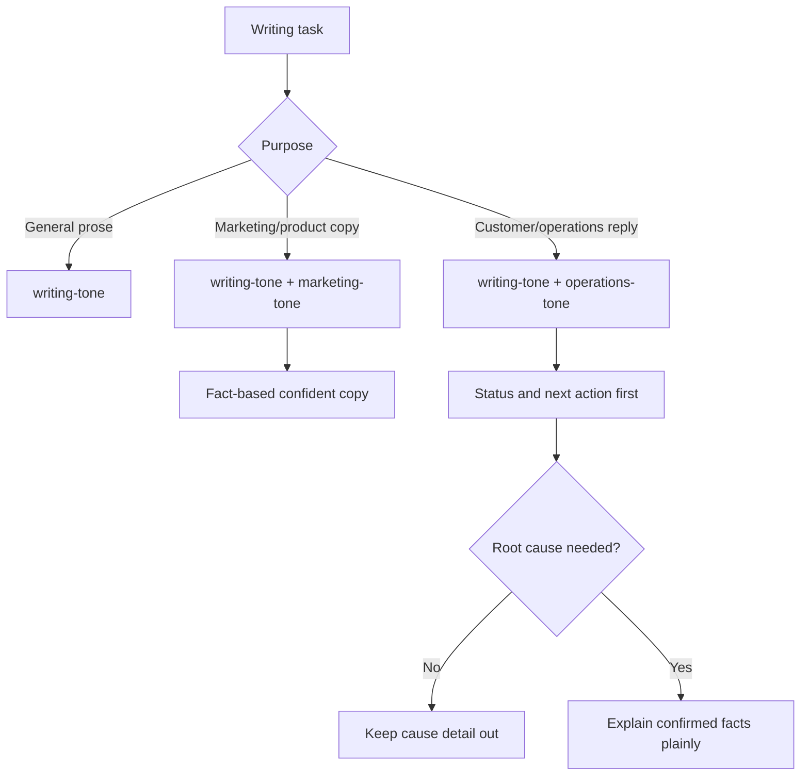

# Tone Overlay Skills

## Documents

- root: [Tone Overlay Skills](tone-overlay-skill-contract.md)

## Overview

Forge shall keep `writing-tone` as the single base tone skill for natural, human-readable prose. It shall add `marketing-tone` and `operations-tone` as purpose-specific overlays rather than creating a separate `natural-writing-tone` skill. This change also deduplicates overlapping general tone guidance in `operations-private` while preserving product-specific workflow, links, templates, and any existing user edits.

Non-goals:
- Do not create a separate `natural-writing-tone` skill.
- Do not remove product-specific WEPPY workflows, commands, support templates, or links from `operations-private`.
- Do not rewrite unrelated operations artifacts or generated report outputs.

## Behavior & Flows

## Data & Interfaces

| Surface | Skill | Role |
|---|---|---|
| General prose, docs, messages, PR copy, UI copy | `writing-tone` | Base natural writing rules |
| Product pages, marketing copy, social copy, launch copy | `marketing-tone` | Fact-based confident product voice overlay |
| Customer support, operations updates, incident/status replies | `operations-tone` | Trust-building status and action overlay |

| Repository | Files |
|---|---|
| `aiagent-plugins` | `plugins/forge/skills/writing-tone/SKILL.md`, `plugins/forge/skills/writing-tone/references/style-rules.md`, new `plugins/forge/skills/marketing-tone/SKILL.md`, new `plugins/forge/skills/operations-tone/SKILL.md`, plugin manifests, README, validator-relevant files |
| `operations-private` | `.agents/skills/weppy-github-customer-response/SKILL.md`, `.agents/skills/weppy-roblox-mcp-social-copy/SKILL.md`, any command-center routing text that should point to the new Forge tone overlays |

## Requirements

### WHEN an agent writes or revises human-readable prose THE SYSTEM SHALL use `writing-tone` as the single base tone skill for natural, clear, non-AI-like writing.

### WHEN an agent writes marketing, product, landing page, launch, social, or campaign copy THE SYSTEM SHALL use `marketing-tone` as an overlay on top of `writing-tone`.

### WHEN `marketing-tone` is used THE SYSTEM SHALL make claims fact-based, confident, and trust-building without unsupported hype or unverifiable superiority claims.

### WHEN writing Korean prose THE SYSTEM SHALL name the concrete action, failure, or result instead of inserting abstract `흐름` or generic `이어가다`, and SHALL allow `~할 수 있습니다` when natural and accurate.

### WHEN product update copy describes an improvement to an existing capability THE SYSTEM SHALL state the previous user-visible friction and the concrete improvement before the implementation method, and SHALL NOT present the existing capability as newly available.

### WHEN an agent writes customer support, operations updates, incident replies, GitHub issue replies, support emails, or status notices THE SYSTEM SHALL use `operations-tone` as an overlay on top of `writing-tone`.

### WHEN `operations-tone` is used THE SYSTEM SHALL lead with confirmed status, user impact, action plan, customer action required, and next update criteria.

### IF the customer did not ask for root cause details and the root cause is not required for customer action THEN THE SYSTEM SHALL avoid detailed cause explanations and use status wording such as "the issue has been confirmed", "we are preparing a fix", or "no action is needed on your side".

### IF root cause details are requested, confirmed, and safe to share THEN THE SYSTEM SHALL explain them in customer-understandable language and separate confirmed facts from estimates.

### WHEN `operations-private` skills contain general marketing or operations tone guidance that overlaps the new Forge skills THE SYSTEM SHALL replace the duplicated general rules with references to the new Forge tone skills while keeping WEPPY-specific workflow, routing, safety, support, metric, and template content.

### IF `operations-private` contains existing uncommitted user changes THEN THE SYSTEM SHALL preserve those changes and only edit around them where required for deduplication.

### WHEN Forge documentation or manifests list skills THE SYSTEM SHALL include `marketing-tone` and `operations-tone` and describe `writing-tone` as the base prose layer.

## Acceptance Criteria

### GIVEN a general prose request, WHEN the skill list is inspected, THEN there is one base natural writing skill named `writing-tone` and no `natural-writing-tone` skill.

Verifies:

- [WHEN an agent writes or revises human-readable prose THE SYSTEM SHALL use `writing-tone` as the single base tone skill for natural, clear, non-AI-like writing.](tone-overlay-skill-contract.md#when-an-agent-writes-or-revises-human-readable-prose-the-system-shall-use-writing-tone-as-the-single-base-tone-skill-for-natural-clear-non-ai-like-writing)

### GIVEN a marketing copy request, WHEN `marketing-tone` is read, THEN it instructs the agent to use `writing-tone` first and to produce factual, confident, trust-building copy without unsupported hype.

Verifies:

- [WHEN an agent writes marketing, product, landing page, launch, social, or campaign copy THE SYSTEM SHALL use `marketing-tone` as an overlay on top of `writing-tone`.](tone-overlay-skill-contract.md#when-an-agent-writes-marketing-product-landing-page-launch-social-or-campaign-copy-the-system-shall-use-marketing-tone-as-an-overlay-on-top-of-writing-tone)
- [WHEN `marketing-tone` is used THE SYSTEM SHALL make claims fact-based, confident, and trust-building without unsupported hype or unverifiable superiority claims.](tone-overlay-skill-contract.md#when-marketing-tone-is-used-the-system-shall-make-claims-fact-based-confident-and-trust-building-without-unsupported-hype-or-unverifiable-superiority-claims)

### GIVEN Korean prose, WHEN `writing-tone` is read, THEN it prefers a concrete action, failure, or result over abstract `흐름` or generic `이어가다` and does not prohibit natural, accurate `~할 수 있습니다` phrasing.

Verifies:

- [WHEN writing Korean prose THE SYSTEM SHALL name the concrete action, failure, or result instead of inserting abstract `흐름` or generic `이어가다`, and SHALL allow `~할 수 있습니다` when natural and accurate.](tone-overlay-skill-contract.md#when-writing-korean-prose-the-system-shall-name-the-concrete-action-failure-or-result-instead-of-inserting-abstract-흐름-or-generic-이어가다-and-shall-allow-할-수-있습니다-when-natural-and-accurate)

### GIVEN Korean product update copy about an existing capability, WHEN `marketing-tone` is read, THEN it leads with the previous user-visible friction and concrete improvement, explains the implementation method afterward, and does not claim the capability is newly available.

Verifies:

- [WHEN product update copy describes an improvement to an existing capability THE SYSTEM SHALL state the previous user-visible friction and the concrete improvement before the implementation method, and SHALL NOT present the existing capability as newly available.](tone-overlay-skill-contract.md#when-product-update-copy-describes-an-improvement-to-an-existing-capability-the-system-shall-state-the-previous-user-visible-friction-and-the-concrete-improvement-before-the-implementation-method-and-shall-not-present-the-existing-capability-as-newly-available)

### GIVEN a customer support reply request, WHEN `operations-tone` is read, THEN it prioritizes confirmed status, customer impact, next action, and minimal cause detail unless the cause is requested, confirmed, and useful.

Verifies:

- [WHEN an agent writes customer support, operations updates, incident replies, GitHub issue replies, support emails, or status notices THE SYSTEM SHALL use `operations-tone` as an overlay on top of `writing-tone`.](tone-overlay-skill-contract.md#when-an-agent-writes-customer-support-operations-updates-incident-replies-github-issue-replies-support-emails-or-status-notices-the-system-shall-use-operations-tone-as-an-overlay-on-top-of-writing-tone)
- [WHEN `operations-tone` is used THE SYSTEM SHALL lead with confirmed status, user impact, action plan, customer action required, and next update criteria.](tone-overlay-skill-contract.md#when-operations-tone-is-used-the-system-shall-lead-with-confirmed-status-user-impact-action-plan-customer-action-required-and-next-update-criteria)
- [IF the customer did not ask for root cause details and the root cause is not required for customer action THEN THE SYSTEM SHALL avoid detailed cause explanations and use status wording such as "the issue has been confirmed", "we are preparing a fix", or "no action is needed on your side".](tone-overlay-skill-contract.md#if-the-customer-did-not-ask-for-root-cause-details-and-the-root-cause-is-not-required-for-customer-action-then-the-system-shall-avoid-detailed-cause-explanations-and-use-status-wording-such-as-the-issue-has-been-confirmed-we-are-preparing-a-fix-or-no-action-is-needed-on-your-side)
- [IF root cause details are requested, confirmed, and safe to share THEN THE SYSTEM SHALL explain them in customer-understandable language and separate confirmed facts from estimates.](tone-overlay-skill-contract.md#if-root-cause-details-are-requested-confirmed-and-safe-to-share-then-the-system-shall-explain-them-in-customer-understandable-language-and-separate-confirmed-facts-from-estimates)

### GIVEN the current `operations-private` skills, WHEN deduplication is complete, THEN general marketing/support tone rules are reduced or delegated to Forge tone skills while WEPPY-specific workflows, links, templates, and existing user edits remain intact.

Verifies:

- [WHEN `operations-private` skills contain general marketing or operations tone guidance that overlaps the new Forge skills THE SYSTEM SHALL replace the duplicated general rules with references to the new Forge tone skills while keeping WEPPY-specific workflow, routing, safety, support, metric, and template content.](tone-overlay-skill-contract.md#when-operations-private-skills-contain-general-marketing-or-operations-tone-guidance-that-overlaps-the-new-forge-skills-the-system-shall-replace-the-duplicated-general-rules-with-references-to-the-new-forge-tone-skills-while-keeping-weppy-specific-workflow-routing-safety-support-metric-and-template-content)
- [IF `operations-private` contains existing uncommitted user changes THEN THE SYSTEM SHALL preserve those changes and only edit around them where required for deduplication.](tone-overlay-skill-contract.md#if-operations-private-contains-existing-uncommitted-user-changes-then-the-system-shall-preserve-those-changes-and-only-edit-around-them-where-required-for-deduplication)

### GIVEN the Forge README and plugin manifests, WHEN skill catalogs are inspected, THEN `marketing-tone` and `operations-tone` are listed and `writing-tone` is described as the base prose layer.

Verifies:

- [WHEN Forge documentation or manifests list skills THE SYSTEM SHALL include `marketing-tone` and `operations-tone` and describe `writing-tone` as the base prose layer.](tone-overlay-skill-contract.md#when-forge-documentation-or-manifests-list-skills-the-system-shall-include-marketing-tone-and-operations-tone-and-describe-writing-tone-as-the-base-prose-layer)

### GIVEN the repository after implementation, WHEN `bash scripts/validate.sh` is run from `aiagent-plugins`, THEN it prints `validate: all checks passed`.

Verifies:

- [WHEN an agent writes or revises human-readable prose THE SYSTEM SHALL use `writing-tone` as the single base tone skill for natural, clear, non-AI-like writing.](tone-overlay-skill-contract.md#when-an-agent-writes-or-revises-human-readable-prose-the-system-shall-use-writing-tone-as-the-single-base-tone-skill-for-natural-clear-non-ai-like-writing)
- [WHEN an agent writes marketing, product, landing page, launch, social, or campaign copy THE SYSTEM SHALL use `marketing-tone` as an overlay on top of `writing-tone`.](tone-overlay-skill-contract.md#when-an-agent-writes-marketing-product-landing-page-launch-social-or-campaign-copy-the-system-shall-use-marketing-tone-as-an-overlay-on-top-of-writing-tone)
- [WHEN `marketing-tone` is used THE SYSTEM SHALL make claims fact-based, confident, and trust-building without unsupported hype or unverifiable superiority claims.](tone-overlay-skill-contract.md#when-marketing-tone-is-used-the-system-shall-make-claims-fact-based-confident-and-trust-building-without-unsupported-hype-or-unverifiable-superiority-claims)
- [WHEN writing Korean prose THE SYSTEM SHALL name the concrete action, failure, or result instead of inserting abstract `흐름` or generic `이어가다`, and SHALL allow `~할 수 있습니다` when natural and accurate.](tone-overlay-skill-contract.md#when-writing-korean-prose-the-system-shall-name-the-concrete-action-failure-or-result-instead-of-inserting-abstract-흐름-or-generic-이어가다-and-shall-allow-할-수-있습니다-when-natural-and-accurate)
- [WHEN product update copy describes an improvement to an existing capability THE SYSTEM SHALL state the previous user-visible friction and the concrete improvement before the implementation method, and SHALL NOT present the existing capability as newly available.](tone-overlay-skill-contract.md#when-product-update-copy-describes-an-improvement-to-an-existing-capability-the-system-shall-state-the-previous-user-visible-friction-and-the-concrete-improvement-before-the-implementation-method-and-shall-not-present-the-existing-capability-as-newly-available)
- [WHEN an agent writes customer support, operations updates, incident replies, GitHub issue replies, support emails, or status notices THE SYSTEM SHALL use `operations-tone` as an overlay on top of `writing-tone`.](tone-overlay-skill-contract.md#when-an-agent-writes-customer-support-operations-updates-incident-replies-github-issue-replies-support-emails-or-status-notices-the-system-shall-use-operations-tone-as-an-overlay-on-top-of-writing-tone)
- [WHEN `operations-tone` is used THE SYSTEM SHALL lead with confirmed status, user impact, action plan, customer action required, and next update criteria.](tone-overlay-skill-contract.md#when-operations-tone-is-used-the-system-shall-lead-with-confirmed-status-user-impact-action-plan-customer-action-required-and-next-update-criteria)
- [IF the customer did not ask for root cause details and the root cause is not required for customer action THEN THE SYSTEM SHALL avoid detailed cause explanations and use status wording such as "the issue has been confirmed", "we are preparing a fix", or "no action is needed on your side".](tone-overlay-skill-contract.md#if-the-customer-did-not-ask-for-root-cause-details-and-the-root-cause-is-not-required-for-customer-action-then-the-system-shall-avoid-detailed-cause-explanations-and-use-status-wording-such-as-the-issue-has-been-confirmed-we-are-preparing-a-fix-or-no-action-is-needed-on-your-side)
- [IF root cause details are requested, confirmed, and safe to share THEN THE SYSTEM SHALL explain them in customer-understandable language and separate confirmed facts from estimates.](tone-overlay-skill-contract.md#if-root-cause-details-are-requested-confirmed-and-safe-to-share-then-the-system-shall-explain-them-in-customer-understandable-language-and-separate-confirmed-facts-from-estimates)
- [WHEN `operations-private` skills contain general marketing or operations tone guidance that overlaps the new Forge skills THE SYSTEM SHALL replace the duplicated general rules with references to the new Forge tone skills while keeping WEPPY-specific workflow, routing, safety, support, metric, and template content.](tone-overlay-skill-contract.md#when-operations-private-skills-contain-general-marketing-or-operations-tone-guidance-that-overlaps-the-new-forge-skills-the-system-shall-replace-the-duplicated-general-rules-with-references-to-the-new-forge-tone-skills-while-keeping-weppy-specific-workflow-routing-safety-support-metric-and-template-content)
- [IF `operations-private` contains existing uncommitted user changes THEN THE SYSTEM SHALL preserve those changes and only edit around them where required for deduplication.](tone-overlay-skill-contract.md#if-operations-private-contains-existing-uncommitted-user-changes-then-the-system-shall-preserve-those-changes-and-only-edit-around-them-where-required-for-deduplication)
- [WHEN Forge documentation or manifests list skills THE SYSTEM SHALL include `marketing-tone` and `operations-tone` and describe `writing-tone` as the base prose layer.](tone-overlay-skill-contract.md#when-forge-documentation-or-manifests-list-skills-the-system-shall-include-marketing-tone-and-operations-tone-and-describe-writing-tone-as-the-base-prose-layer)

## Decisions & History

- 2026-08-27 [CURRENT] 한국어 문장에서는 구체적인 동작이나 결과를 우선하고, 제품 업데이트는 기존 불편과 개선 결과를 구현 방법보다 먼저 설명한다. `~할 수 있습니다`는 자연스럽고 정확한 경우 그대로 사용한다.
- 2026-08-09 [CURRENT] `writing-tone`을 공통 기반으로 사용하고 `marketing-tone`과 `operations-tone`은 목적별 overlay로 적용한다.
