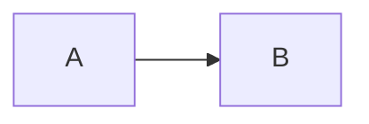

# Fixture Spec

## Overview

Basic structured fixture.

## Requirements

- R1. The viewer reads structured specs.

## Behavior & Flows

## Data & Interfaces

The fixture uses stable identifiers.

## Acceptance Criteria

- AC1 (R1): The structured source is collected.

## Decisions & History

- 2026-08-01 [DECISION] Use the structured fixture.
