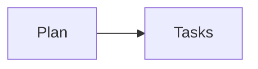

# Demo implementation plan

Status: active

**Related Specs:**

- bundle: docs/specs/semantic-spec-bundles/
- bundle: docs/specs/supporting-policy/

**Goal:** Build a deterministic review source bundle.

**Architecture:** Parse selected Markdown without inventing relationships.

## Global Constraints

- Keep source roles separate.

## Flow

## Tasks

### Task 1: Parse sources

Governing statements:

- [Every declared member enters the review source set exactly once](../../specs/semantic-spec-bundles/member-loading-and-provenance.md#every-declared-member-enters-the-review-source-set-exactly-once)
- [Repository-contained review inputs load successfully](../../specs/supporting-policy/supporting-policy-contract.md#repository-contained-review-inputs-load-successfully)

- Route: source-model
- Dependencies: none

- [ ] **Step 1: Read the primary source**
- [ ] **Step 2: Read related context**

Run: `python3 tests/test_review_sources.py`

Expected: source collection succeeds

## Progress History

- 2026-08-01: fixture created.
