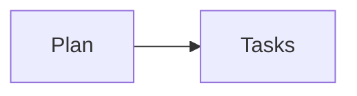

# Demo implementation plan

Status: active

**Related Specs:**
- id: 008-alpha
  path: docs/specs/008-alpha/spec.md
  requirements: [R1, R2, R3]
  acceptance: [AC1]
- id: 002-beta
  path: docs/specs/002-beta/spec.md
  requirements: [R1]
  acceptance: [AC4, AC6]

**Goal:** Build a deterministic review source bundle.

**Architecture:** Parse selected Markdown without inventing relationships.

## Global Constraints

- Keep source roles separate.

## Flow

## Tasks

### Task 1: Parse sources (008 R1–R3 · 002 AC4, AC6)

- Route: source-model
- Dependencies: none

- [ ] **Step 1: Read the primary source**
- [ ] **Step 2: Read related context**

Run: `python3 tests/test_review_sources.py`

Expected: source collection succeeds

## Progress History

- 2026-08-01: fixture created.
