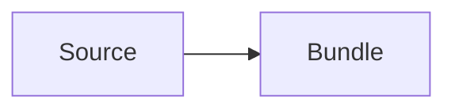

# Alpha source

## Overview

Primary structured context.

## Requirements

- R1. The parser preserves the first requirement.
- R2. The parser preserves the second requirement.
- R3. The parser preserves the third requirement.

## Behavior & Flows

## Data & Interfaces

The source uses the structured spec interface.

## Acceptance Criteria

- AC1 (R1–R3): The source model exposes all requirements.

## Decisions & History

- 2026-08-01 [DECISION] Use a structured fixture.
