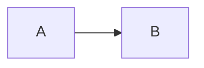

# Fixture Spec

Status: approved

## Requirements

- R1. First requirement.
- R2. Second requirement.

## Behavior & Flows

## Acceptance Criteria

- AC1 (R1): First acceptance criterion.
- AC2 (R2): Second acceptance criterion.

