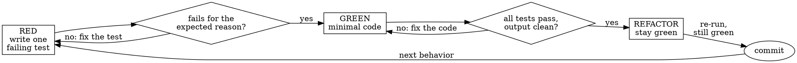

# Test-Driven Development

**Announce at start:** "Using the forge test-driven-development skill — test first, watch it fail, then code."

Respond to the user in the user's language. This skill file stays in English.

## Overview

Write one failing test. Run it and watch it fail for the expected reason. Write the minimal code that makes it pass. Refactor. Repeat.

**Seeing it fail is the point.** A test that passes immediately tests nothing — it may assert the wrong thing, exercise a mock, or cover behavior that already existed. The observed failure is your only proof that the test can catch the bug it exists to catch.

## Iron Law

```
NO IMPLEMENTATION CODE WITHOUT A FAILING TEST. RED → GREEN → REFACTOR.
```

Wrote implementation before its test? Delete it and restart from the test. Not "keep it as reference", not "adapt it while writing the test" — both are tests-after in disguise. Delete means delete; reimplement fresh from the failing test.

## When to Use / When NOT

**Use for:** Quick direct implementation, spec-backed direct implementation, new features, bugfixes, behavior changes, refactoring untested code, and every implementation step of an Execution Plan Task.

**Exempt (closed list):**

- Throwaway scripts that will be deleted after one use — if it survives the session or lands in the repo, it was not throwaway and needs tests
- Pure configuration with no logic to assert
- Generated code you never hand-edit

**Spike rule:** exploring an unknown API or design with scratch code is allowed — as a spike. Once the spike answers your question, delete the spike entirely and start the real implementation with a failing test. What survives a spike is knowledge and tests, never code.

Unsure whether something is exempt? It is not. Ask the user.

## The Process

Create one todo per numbered step below for each cycle. One cycle covers ONE behavior.



### 1. RED — write one failing test

One behavior, a name that states the behavior, real code paths.

```typescript
test('retries a failing operation up to 3 times', async () => {
  let attempts = 0;
  const op = () => { attempts++; if (attempts < 3) throw new Error('fail'); return 'ok'; };
  expect(await retryOperation(op)).toBe('ok');
  expect(attempts).toBe(3);
});
```

Bad version: `test('retry works')` asserting that a mock was called 3 times — vague name, and it verifies the mock, not the code. If the test name needs "and", split it into two tests.

### 2. Verify RED — watch it fail

Run the test in the shell and read the actual output. Confirm:

- It **fails**, not errors — a missing import or typo is not RED.
- The failure message is the one you expected (behavior missing).
- **It passes immediately?** Either the behavior already exists or the test asserts nothing. Stop and find out which before writing any code.

### 3. GREEN — minimal code

Write the simplest implementation that makes this one test pass. No extra options, no speculative parameters, no "while I'm here" improvements. If you want more behavior, that is the next cycle's test.

### 4. Verify GREEN — watch it pass

Run again in the shell: the new test passes, the whole suite still passes, output is clean (no new warnings or errors). A test fails? Fix the code, not the test — unless the test contradicts an approved or implemented Canonical Spec in `docs/specs/`, in which case the Canonical Spec decides. Changing that contract requires an approved Spec Delta.

### 5. REFACTOR — clean up, stay green

Only after green: remove duplication, improve names, extract helpers. No new behavior. Re-run the suite after refactoring.

### 6. Commit

Commit the test and implementation together. Before committing, confirm: every new function has a test you watched fail; each failure was for the expected reason; all tests pass with clean output; mocks exist only at boundaries you do not own.

### Bugfixes

A bug is a missing test. First reproduce the bug as a failing test (root cause established via the forge systematic-debugging skill), then run the cycle. The test that reproduced the bug stays forever as the regression guard — never fix a bug without one.

## Working Files

This skill adds tests to the project's own test tree; it creates no forge files by itself. Related paths:

- Direct work: Quick and spec-backed direct cycles need no Execution Plan. Keep only the tests and implementation; use optional `.forge/work/` input only when the work needs an independent brief or Delta.
- Planned work: the current Task lives in `docs/plans/PPP-<slug>/plan.md` or its optional `tasks/*.md`; plan-local progress is maintained by the forge executing-plans skill, not here.
- Bugfix work: keep local investigation in `.forge/scratch/`; promote a durable root-cause record to `docs/debug/YYYY-MM-DD-<slug>.md` per the forge systematic-debugging skill.
- Traceability: when a Canonical Spec governs the work, name tests so they map to its affected R-IDs and AC-IDs. Local Quick work names observable behavior without inventing R or AC IDs.

## Red Flags

| Excuse | Reality |
|--------|---------|
| "I'll write tests after" | Tests written after pass immediately and prove nothing. They describe what you built, not what was required. |
| "Too simple to test" | Simple code still breaks, and the test costs 30 seconds. "Too simple" is exactly where regressions hide. |
| "The test would just duplicate the code" | Then you are testing implementation, not behavior. Assert observable outcomes; read the anti-patterns reference. |
| "I already tested it manually" | Ad hoc and unrecorded. It cannot re-run on the next change, so it protects nothing. |
| "Deleting hours of work is wasteful" | Sunk cost. Unverified code is debt, not progress; rewriting under test is the cheaper path. |
| "Just this once — the deadline is tight" | Debugging untested code later costs more than the test you are skipping now. |
| "I'll keep it as a reference while writing the test" | You will adapt it, which is tests-after. Delete means delete. |
| "This is just a spike" (while planning to keep it) | A spike you keep is implementation without a test. Real spikes end in deletion; if you would hesitate to delete it, it needed TDD from the start. |
| "There's no test framework set up in this project" | Then setting one up is the first step of this task, not a reason to skip testing. One config file and one runner install is cheaper than shipping unverified code. |

## Anti-Patterns

When writing mocks, snapshots, or async tests — or whenever a test feels like it mirrors the code — read `references/testing-anti-patterns.md` in this skill's directory. It covers: testing implementation details, mocking what you own, assertion-free tests, snapshot overuse, test interdependence, and sleeping instead of waiting on conditions.

## Handoff

**Cycle complete and committed. If executing a plan, return to the forge executing-plans skill for the next task; before any "done" or "fixed" claim, use the forge verifying-work skill.**
