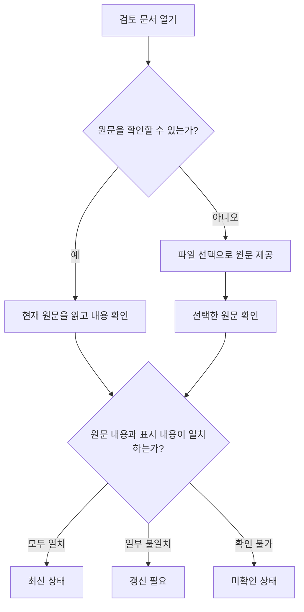

## Branching Review

```mermaid
flowchart TD
    A[검토 문서 열기] --> B{원문을 확인할 수 있는가?}
    B -- 예 --> C[현재 원문을 읽고 내용 확인]
    B -- 아니오 --> D[파일 선택으로 원문 제공]
    D --> E[선택한 원문 확인]
    C --> F{원문 내용과 표시 내용이 일치하는가?}
    E --> F
    F -- 모두 일치 --> G[최신 상태]
    F -- 일부 불일치 --> H[갱신 필요]
    F -- 확인 불가 --> I[미확인 상태]
```
