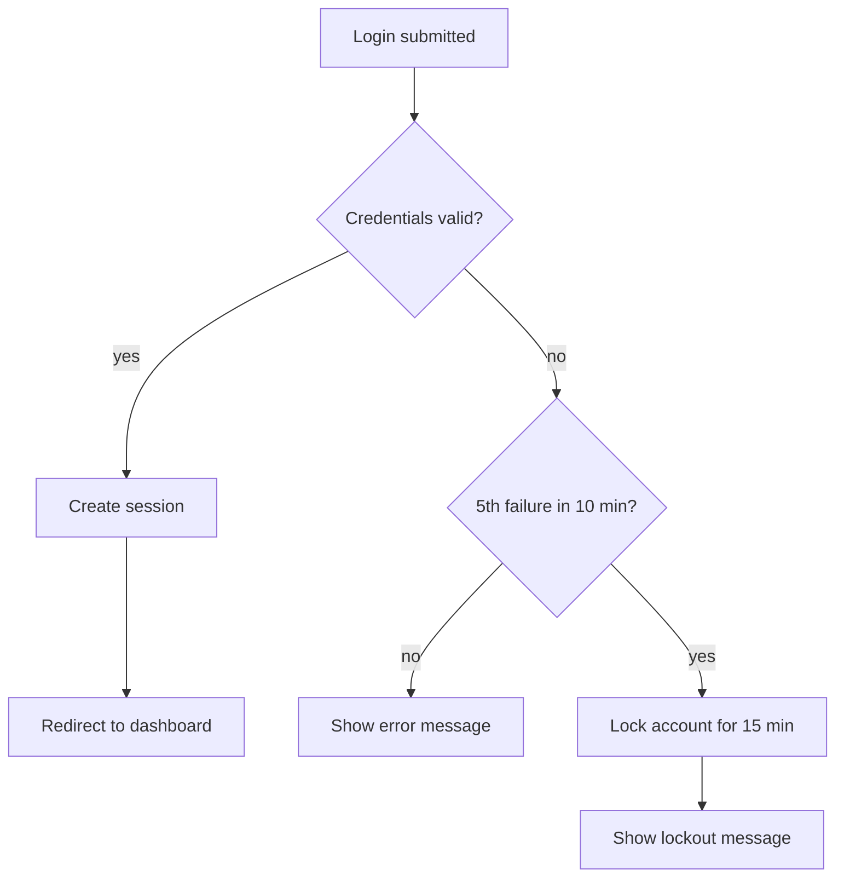
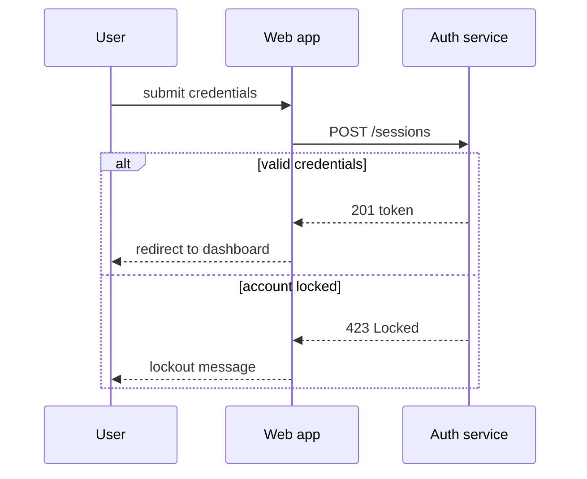

# Spec Template

Canonical structure for `docs/specs/NNN-<slug>/spec.md`. Section headings must match this template exactly — plans, verification, and the forge spec-viewer skill all navigate by these names.

## Status line semantics

The `Status:` line is the lifecycle gate token. It moves forward `draft → approved → implemented`; a change delta moves it back to `draft` until the user re-approves.

| Status | Meaning | Who may set it |
|---|---|---|
| `draft` | Being written or revised; not a valid basis for planning or coding | The agent, while authoring or revising |
| `approved` | The user explicitly approved the content; planning may start. Requires zero `[NEEDS CLARIFICATION]` markers | The user only — the agent records it after an explicit approval message, never infers it |
| `implemented` | Every acceptance criterion verified PASS with fresh evidence | Only the forge verifying-work skill, after walking all ACs |

## Template

````markdown
# <Feature name>

Status: draft

## Overview

<2–4 sentences: what this is and why it exists.>

Non-goals:
- <what this spec deliberately does not cover>

## Requirements

<Stable IDs — never renumber, never reuse a removed ID. EARS phrasing. Each
requirement must be testable. Mark unresolved ambiguity inline:
[NEEDS CLARIFICATION: the exact open question].>

- R1. WHEN <trigger> THE SYSTEM SHALL <behavior>
- R2. IF <abnormal condition> THEN THE SYSTEM SHALL <response>

## Behavior & Flows

<Mermaid flowchart / sequenceDiagram / stateDiagram fences. These fences are
the single diagram source — the spec viewer lifts them verbatim.>

## Data & Interfaces

<Entities and fields as tables; API and event contracts as tables.>

## Acceptance Criteria

<AC1..ACn, Given/When/Then, each citing the R-IDs it verifies.>

- AC1 (R1): GIVEN <precondition> WHEN <action> THEN <observable outcome>

## Decisions & History

<Dated log of decisions, clarifications, change deltas, drift findings,
rejected options. Append-only.>

- YYYY-MM-DD [DECISION] <what was decided and why>
````

## EARS quick reference

| Pattern | Shape |
|---|---|
| Ubiquitous | THE SYSTEM SHALL `<behavior>` |
| Event-driven | WHEN `<trigger>` THE SYSTEM SHALL `<behavior>` |
| State-driven | WHILE `<state>` THE SYSTEM SHALL `<behavior>` |
| Unwanted behavior | IF `<abnormal condition>` THEN THE SYSTEM SHALL `<response>` |
| Optional feature | WHERE `<feature is included>` THE SYSTEM SHALL `<behavior>` |

## Filled examples

Running example: login with account lockout.

### Requirements (EARS)

- R1. WHEN a user submits valid credentials THE SYSTEM SHALL create a session and redirect to the dashboard within 2 seconds.
- R2. IF a fifth login attempt for the same account fails within 10 minutes THEN THE SYSTEM SHALL lock the account for 15 minutes and display the lockout message.

### Acceptance criterion (Given/When/Then)

- AC1 (R2): GIVEN an account with four failed login attempts in the last 10 minutes, WHEN a fifth attempt fails, THEN the account rejects even correct credentials for 15 minutes and the login page shows the lockout message.

### Behavior & Flows





### Data & Interfaces

Entity table:

| Entity | Field | Type | Constraints | Notes |
|---|---|---|---|---|
| Account | email | string | unique | login identifier |
| Account | failed_attempts | integer | >= 0 | reset to 0 on success |
| Account | locked_until | timestamp, nullable | — | null = not locked |

API contract table:

| Endpoint | Method | Request | Success | Errors |
|---|---|---|---|---|
| /sessions | POST | { email, password } | 201 { token } | 401 invalid credentials; 423 account locked |

### Decisions & History entry formats

```
- 2026-07-04 [DECISION] Account-level lockout instead of IP throttling: shared-office IPs cause false positives.
- 2026-07-04 [CLARIFIED] R2: failure-count window is 10 minutes (user answer).
- 2026-07-04 [CHANGE] R3 MODIFIED: lockout duration 30 -> 15 minutes (change request).
- 2026-07-04 [CHANGE] R9 ADDED: admin unlock endpoint (change request).
- 2026-07-04 [DRIFT] Code returns 429 instead of 423 on lockout; reconciliation pending.
- 2026-07-04 [REJECTED] CAPTCHA after third failure: too much friction for the target users.
```

Tags: `[DECISION]` design choices · `[CLARIFIED]` resolved markers · `[CHANGE]` approved deltas (`R3 MODIFIED: …`, `R7 REMOVED: …`, `R9 ADDED: …`) · `[DRIFT]` code/spec mismatches found by sync mode · `[REJECTED]` options considered and dropped.
