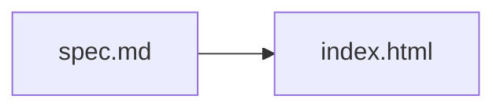

# 기본 구조화 Spec

## Overview

이 문서는 `forge/spec@1` 페이지 생성의 기본 동작을 설명한다.

## Requirements

- R1. 생성 페이지는 source metadata를 표시해야 한다.
- R2. 생성 페이지는 원본 Mermaid를 보존해야 한다.

## Behavior & Flows

다음 흐름은 source가 page로 변환되는 순서를 보여준다.

## Data & Interfaces

| 입력 | 출력 |
|---|---|
| `spec.md` | `index.html` |

## Acceptance Criteria

- AC1 (R1): page를 생성하면 현재 metadata와 source hash가 표시된다.
- AC2 (R2): Mermaid DOM text가 source fence와 일치한다.

## Decisions & History

- 2026-08-01 [DECISION] fixture는 두 spec의 관계를 포함한다.
